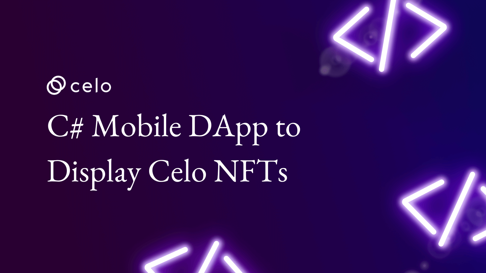

# C# mobile App to display Celo NFTs

The idea with this tutorial is not build complex app is show new possibilities to use Celo and other EVM (Ethereum virtual machine) with languages other than JavaScript in this case C#, You will learning how build an android app with C# and connect to Celo network to retriever NFT metadata and display NFT in the app.



<!--truncate-->

### [Source code](https://github.com/lucasespinosa28/DisplayNFTCelo)

## Prerequisites

- [Visual Studio 2022, with the Mobile development with .NET workload installed](https://visualstudio.microsoft.com/)
- [Knowledge of C#](https://docs.microsoft.com/pt-br/dotnet/csharp/)
- [Knowledge of EVM smart contracts](https://ethereum.org/en/developers/docs/smart-contracts)

## Setup

If you've installed Visual Studio 2022 but haven't installed support for mobile apps yet, open the Visual studio installer > click modify and enable Mobile development with .NET, [here's the full tutorial.](https://docs.microsoft.com/en-us/xamarin/get-started/installation/windows)

Create a new project > find **Mobile App(Xamarin.forms)** > choose a name > select **blank template**.


## interface

After create the app, go in “DisplayNFTCelo” and find the file MainPage.xaml and start to write code of interface to display the NFTs.


### [What is XAML](https://docs.microsoft.com/en-us/dotnet/desktop/wpf/xaml/?view=netdesktop-6.0)

[XAML](https://docs.microsoft.com/en-us/dotnet/desktop/wpf/xaml/?view=netdesktop-6.0) is a declarative markup language. As applied to the .NET Core programming model, XAML simplifies creating a UI for a .NET Core app, it's similar to HTML about without CSS, [Link if you want learning more about Xaml](https://docs.microsoft.com/en-us/dotnet/desktop/wpf/xaml/?view=netdesktop-6.0).

### Writing the Xaml code

Delete the default code inside &lt;StackLayout> &lt;/tackLayout> and add a new code with the app title.

```xaml
<StackLayout>
    <Frame BackgroundColor="Lime" Padding="8" CornerRadius="0">
        <Label Text="Celo mobile app" HorizontalTextAlignment="Center" TextColor="Black" FontSize="24"/>
    </Frame>
</StackLayout>
```

After &lt;/Frame> add the code with text input to get the address of the NFT contract, &lt;Editor> is an input text that lets you write in it, I choose the address of [CeloToadz](https://tofunft.com/collection/celotoads/items) because his images load faster.

```xaml
<Label Text="NFT contract address" Margin="0,20,0,0" HorizontalTextAlignment="Center" FontAttributes="Bold" FontSize="Medium"/>
<Editor x:Name="Address" Margin="20,0" Text="0x6Fc1C8d59FdC261c55273f9b8e64B7E88C45E208" FontAttributes="Bold" FontSize="Medium"/>
```

After &lt;Editor> add the code to create an entry that will receive the NFT id and a button to call the contract and get the NFT metadata.

```xaml
<Label Text="NFT contract address" Margin="0,20,0,0" HorizontalTextAlignment="Center" FontAttributes="Bold" FontSize="Medium"/>
<Editor x:Name="Address" Margin="20,0" Text="0x6Fc1C8d59FdC261c55273f9b8e64B7E88C45E208" FontAttributes="Bold" FontSize="Medium"/>
```

In this part will write the code that will receive the NFT metadata info and display in our app.

```xaml
<Label x:Name="Name"  HorizontalTextAlignment="Center" FontAttributes="Bold" FontSize="Medium"/>
<Image x:Name="NFTImage" />
<Label x:Name="Description"  HorizontalTextAlignment="Center" FontAttributes="Bold" FontSize="Medium"/>
```

finally let's create a button to show a random NFT when clicked.

```xaml
<Button Text="Get random NFT" BackgroundColor="Lime" TextColor="Black" Margin="50,0" Clicked="getRandomNFT"/>
```

#### Example with complete code.

```xaml
<?xml version="1.0" encoding="utf-8" ?>
<ContentPage xmlns="http://xamarin.com/schemas/2014/forms"
             xmlns:x="http://schemas.microsoft.com/winfx/2009/xaml"
             x:Class="DisplayNFTCelo.MainPage">

    <StackLayout>
        <Frame BackgroundColor="Lime" Padding="8" CornerRadius="0">
            <Label Text="Celo mobile app" HorizontalTextAlignment="Center" TextColor="Black" FontSize="24"/>
        </Frame>
        <Label Text="NFT contract address"  Margin="0,20,0,0" HorizontalTextAlignment="Center" FontAttributes="Bold" FontSize="Medium"/>
        <Editor x:Name="Address" Margin="20,0" Text="0x6Fc1C8d59FdC261c55273f9b8e64B7E88C45E208" FontAttributes="Bold" FontSize="Medium"/>
        <Label Text="NFT id number" HorizontalTextAlignment="Center" FontAttributes="Bold" FontSize="Medium"/>
        <Grid ColumnDefinitions="*,*">
            <Entry x:Name="NFTid" Keyboard="Numeric"></Entry>
            <Button Grid.Column="1" Text="Query" Clicked="getNFT"></Button>
        </Grid>
        <Label x:Name="Name"  HorizontalTextAlignment="Center" FontAttributes="Bold" FontSize="Medium"/>
        <Image x:Name="NFTImage" />
        <Label x:Name="Description"  HorizontalTextAlignment="Center" FontAttributes="Bold" FontSize="Medium"/>
        <Button Text="Get random NFT" BackgroundColor="Lime" TextColor="Black" Margin="50,0" Clicked="getRandomNFT"/>
    </StackLayout>

</ContentPage>
```

The result should look like this, the style may change depending on the brand of cell phone used, and don't worry if the `<label>` of the NFT metadata doesn't show, it will show later.


## C# code

In this part we will install the packages to access the Celo network and write the code to get the NFT metadata.

### Installing Nuget packages

Open NuGet Package Manager and install the packet Nethereum.Web3.

### [What is Nethereum?](http://docs.nethereum.com/en/latest/)

[Nethereum](http://docs.nethereum.com/en/latest/) is the .Net integration library for Ethereum, simplifying smart contract management and interaction with Ethereum nodes whether they are public..


How the NFT metadata are storage in format JSON will need to download the package System.Net.Http.Json to help to handle JSON archives.


### Writing the code

let's start writing the code to interact with cello NFTs, open the file MainPage.xaml.cs.


Above of public MainPage() add the code that contains information about Celo node URL address and part of ABI contract that contain function to call token Uri information.

```c#
private string url = "https://forno.celo.org";
private string ABI = @"[{""type"":""function"",""stateMutability"":""view"",""outputs"":[{""type"":""string"",""name"":"""",""internalType"":""string""}],""name"":""tokenURI"",""inputs"":[{""type"":""uint256"",""name"":""tokenId"",""internalType"":""uint256""}]}]";
```

Some token Uri return only an IPFS address without a host, we’ll create method to add um host if the token URL using IPFS does haven't for default, below of MainPage() add this:

```c#
string ipfsHost(string url)
{
    //Check if are an IPFS address
    if (url.Contains("ipfs://"))
    {
        //Add an IPFS host
        return url.Replace("ipfs://", "https://ipfs.io/ipfs/");
    }
    //Return an not IPFS address
    return url;
}
```

We'll write a method to read the json of NFT metadata.
How C# is statically typed will need to create a class to storage of NFT metadata information after get the json data.

```c#
class Metadata
{
    public string name { get; set; }
    public string description { get; set; }
    public string external_url { get; set; }
    public string image { get; set; }
    public Attribute[] attributes { get; set; }
    public class Attribute
    {
        public string trait_type { get; set; }
        public string value { get; set; }
    }

}
```

Now’ll create a method to get Json of NFT from a URL and display the information in our app.

```c#
async void queryAsyncMetadata(string uri)
{
    // create a new connection
    var client = new HttpClient();
    //get the metadata in format json em convert it's for a type metadata
    var response = await client.GetFromJsonAsync<Metadata>(ipfsHost(uri));
    //Display the name in a <label>
    Name.Text = response.name;
    //If image only have an ipfs address the method ipfsHost will add a host, Display the image in a <Image>
    NFTImage.Source = ipfsHost(response.image);
    //Display the description in a <label>
    Description.Text = response.description;
}
```

The next method will connect in a Celo node and read a smart contract to get an NFT metadata URL.

```c#
async void queryNFTContract(int id)
{
    //connect to a celo node
    var web3 = new Web3(url);
    //read a smart contract
    var contract = web3.Eth.GetContract(ABI, Address.Text);
    //Create a function to get a NFT metadata url
    var tokenURIFunction = contract.GetFunction("tokenURI");
    //Call the function to get a NFT metadata url
    var metadata = await tokenURIFunction.CallAsync<string>(id);
    //Pass the NFT metadata URL and display NFT imagen and information in the app
    queryAsyncMetadata(metadata);
}
```

We'll create method to make the query button find an NFT when clicked.

```c#
void getNFT(object sender, EventArgs e)
{
    //Read the input that have a nft id to query
    var id = int.Parse(NFTid.Text);
    //Pass the id to read the contract and display the NFT.
    queryNFTContract(id);
}
```

To make it more fun, it will create code to query a random NFT when clicking a button.

```c#
Random rnd = new Random();
void getRandomNFT(object sender, EventArgs e)
{
    //Query an NFT with random ID between 1 or 100
    queryNFTContract(rnd.Next(1, 100));
}
```

#### Complete Code

```c#
using System;
using Nethereum.Web3;
using System.Net.Http.Json;
using Xamarin.Forms;
using System.Net.Http;


namespace DisplayNFTCelo
{
    public partial class MainPage : ContentPage
    {
        private string url = "https://forno.celo.org";
        private string ABI = @"[{""type"":""function"",""stateMutability"":""view"",""outputs"":[{""type"":""string"",""name"":"""",""internalType"":""string""}],""name"":""tokenURI"",""inputs"":[{""type"":""uint256"",""name"":""tokenId"",""internalType"":""uint256""}]}]";
        public MainPage()
        {
            InitializeComponent();
        }
        string ipfsHost(string url)
        {
            //Check if are an IPFS address
            if (url.Contains("ipfs://"))
            {
                //Add an IPFS host
                return url.Replace("ipfs://", "https://ipfs.io/ipfs/");
            }
            //Return an not IPFS address
            return url;
        }
        class Metadata
        {
            public string name { get; set; }
            public string description { get; set; }
            public string external_url { get; set; }
            public string image { get; set; }
            public Attribute[] attributes { get; set; }
            public class Attribute
            {
                public string trait_type { get; set; }
                public string value { get; set; }
            }

        }
        async void queryAsyncMetadata(string uri)
        {
            // create a new connection
            var client = new HttpClient();
            //get the metadata in format json em convert it's for a type metadata
            var response = await client.GetFromJsonAsync<Metadata>(ipfsHost(uri));
            //Display the name in a <label>
            Name.Text = response.name;
            //If image only have an ipfs address the method ipfsHost will add a host, Display the image in a <Image>
            NFTImage.Source = ipfsHost(response.image);
            //Display the description in a <label>
            Description.Text = response.description;

        }
        async void queryNFTContract(int id)
        {
            //connect to a celo node
            var web3 = new Web3(url);
            //read a smart contract
            var contract = web3.Eth.GetContract(ABI, Address.Text);
            //Create a function to get a NFT metadata url
            var tokenURIFunction = contract.GetFunction("tokenURI");
            //Call the function to get a NFT metadata url
            var metadata = await tokenURIFunction.CallAsync<string>(id);
            //Pass the NFT metadata URL and display NFT imagen and information in the app
            queryAsyncMetadata(metadata);
        }
        void getNFT(object sender, EventArgs e)
        {
            //Read the input that have a nft id to query
            var id = int.Parse(NFTid.Text);
            //Pass the id to read the contract and display the NFT.
            queryNFTContract(id);
        }

        Random rnd = new Random();
        void getRandomNFT(object sender, EventArgs e)
        {
            //Query an NFT with random ID between 1 or 100
            queryNFTContract(rnd.Next(1, 100));
        }
    }
}
```

## Final result

The result should look like this, enter an id number and click query should display the queried NFT.


## Extra

if you want learning more:

- [EVM with C#](https://nethereum.com/)
- [Build Native app with C#](https://dotnet.microsoft.com/en-us/apps/maui)
