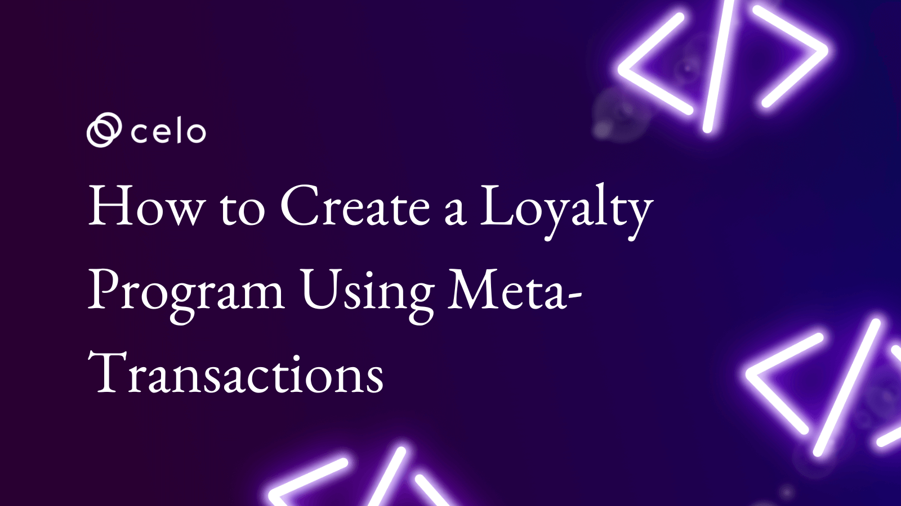

# How to create a Loyalty Program using Meta-transactions

## What if users could get rewarded for transactions and not pay gas? This tutorial will show you how!



How cool would it be if the users of your dApp did not need need to pay gas for transactions? What if they received rewards instead?

MASS-ADOOOOOOOOOPTION!

<!--truncate-->

---

### Here’s what we’ll cover

In this tutorial, you will learn how to create dApps that support Meta-transactions and how to implement a Loyalty program to reward users. I will cover:

- ✅ [What are Meta-Transactions?](#what-are-meta-transactions)
- ✅ [Why do we need ERC20Permit?](#why-do-we-need-erc20permit)
- ✅ [Setting up the Project](#setting-up-the-project)
- ✅ [Implementing the ERC20Permit type Token](#implementing-the-erc20permit-type-token)
- ✅ [Implementing the LoyaltyReward Token](#implementing-the-loyaltyreward-token)
- ✅ [Implementing the LoyaltyProgram Contract](#implementing-the-loyaltyprogram-contract)
- ✅ [Testing Contracts](#testing-contracts)

---

### What are Meta-Transactions?

When transacting on blockchain networks like Celo, you’ll come across [gas fees](https://ethereum.org/en/developers/docs/gas/#top). Gas fees are used to prevent the network from getting DDosed ([Distributed denial of service](https://www.cloudflare.com/learning/ddos/what-is-a-ddos-attack/)). If there were no gas fees, malicious users could spam the network with transactions, resulting in a denial of service for legitimate users.

So gas fees make sense. But when it is your first time building on a network, you won’t have the tokens available to try dApps and to pay for gas. This is where meta-transactions come in.


A **Meta-transaction** is a process where the user, instead of paying a gas fee, forwards their transaction to a third party. That third party, a **relayer**, will pay the gas fee for the transaction. This is all possible using signatures.

When you use signatures on the blockchain, you sign a message that specifies the contract, the function, and the parameters you want to pass using your private key. Once signed, you receive a signature that can be passed to anyone who is willing to pay for your gas fees. Because gas fees are charged to the broadcaster of the transaction, it doesn’t matter for who the relayer is.

> All of this is subject to the fact that the contract supports calling the specified functions by signatures!

You should have a fair understanding of what meta-transactions are. Next, we’ll go over the **ERC20Permit**.

> Note: If you are not familiar with the ERc20 Permit, you can learn more at this [link](https://eips.ethereum.org/EIPS/eip-20)

---

### Why do we need ERC20Permit?

When viewing the ERC20 implementation, you will notice that in order for someone to transfer ERC20 on your behalf, the transfer amount needs to be approved first.

The Loyalty program you will be implementing assumes that the user has no gas tokens to pay for gas fees. This means a third party will be transferring tokens on behalf of the user.

But for a third party to perform this action, it needs approval first. To start, take a look at the ERC20 implementation for [`approve`](https://github.com/OpenZeppelin/openzeppelin-contracts/blob/master/contracts/token/ERC20/ERC20.sol#L136).


`approve` assumes that the caller of this function is the one who wants to approve a `spender` to spend `amount` number of tokens.


As you can see above, `approve` needs to be called by the user itself and that will require gas.

But as mentioned in meta-transactions, the sender is a relayer. The user, depicted above, will instead approve the relayer’s tokens. We do not want that.

To tackle this, [ERC20Permit](https://github.com/OpenZeppelin/openzeppelin-contracts/blob/master/contracts/token/ERC20/extensions/draft-ERC20Permit.sol#L49) was introduced. ERC20Permit allows approval via signatures. Here is how it looks.


The `payer` (user) signs a message and sends the message to the `vendor` (relayer) via an off-chain mechanism. It can be anything API or even a text message works, there is no need to keep it private.

From the signature `v`, `r` and `s` can be extracted.

The `permit` function takes in the details for the approval and `v`, `r` and `s`, which are parts that allow the public address of the signer be recovered.

Using this function, we can approve the transfer of tokens on one’s behalf and also perform the transfer in the same transaction!

At this point, you have all the information you need to implement the Loyalty program contract. Now, let’s set up the project and get to coding!

---


---

### Setting up the Project

All the code you are about to write is available [here](https://github.com/therealharpaljadeja/meta-transactions-loyalty-program) for reference.

- Create a folder for your project and open a terminal on the same path
- Execute the command given below in order to get a project starter template

```bash
npx hardhat init
```

You should get the following output:


- For this tutorial, select **Create a Javascript project**
- You might be asked to install additional dependencies if yes then type `Y` and hit `Enter`
- Once it completes, you should have a project structure like this (excluding the node_modules folder)


You can remove the starter `Lock.sol` contract from `/contracts` folder as it is not needed.

That’s it for setting up the project!

---

### Implementing the ERC20Permit type Token

You can now implement the ERC20Permit token. In order to make the dApp truly gasless, you’ll need to use the ERC20Permit type token for transactions.

Luckily, [OpenZeppelin](https://openzeppelin.com/) makes it easy. OpenZeppelin has already done the implementation for you and all you need to do is inherit it.

**Here is the code for the ERC20Permit Token:**

```js reference title="Token.sol"
https://github.com/celo-org/DevRel/blob/main/education/06-loyalty-program-using-meta-transactions/Token.sol
```

You start with a constructor where you provide the `name` for the ERC20Permit token and the same `name` must be provided to the ERC20, along with the `symbol`.

Inside the constructor, you are minting 500 tokens to the deployer, so someone can have those tokens. These can then be passed on or be used as payment for services.

**Why inherit ERC20 & ERC20Permit?**

Because ERC20Permit is an abstract contract — meaning it does not implement all the functionality of ERC20 — only the permit parts.

Let's talk about the differences between ERC20 and ERC20Permit in brief. `permit` function lets users approve transfers via signatures.

There are some helper functions that keep track of nonce, in order to avoid invalid signatures from being replayed. For example, this could happen if a vendor tries claiming the same amount twice using the same signature 😅

In order to protect re-use, a nonce is used.

There are 2 more important things `DOMAIN_TYPEHASH` and `STRUCT_TYPEHASH`

These are related to [EIP712](https://eips.ethereum.org/EIPS/eip-712), which specifies a standard for how signatures should be generated to provide better UX to wallet users and RPC providers.

Why all this? Using a standard for signing messages, Wallets and RPC providers can provide a better UX for their users indicating what is being signed by the user.


The `STRUCT_TYPEHASH` is used to define the structure in which the data is encoded and helps both the contract and the off-chain signers understand how to encode the parameters to pass to the function.

> Note: In this context, `STRUCT_TYPEHASH` is `PERMIT_TYPEHASH`. You can check it out [here](https://github.com/OpenZeppelin/openzeppelin-contracts/blob/master/contracts/token/ERC20/extensions/draft-ERC20Permit.sol)

The `DOMAIN_TYPEHASH` is generated using another OpenZeppelin contract named `EIP712.sol`

The role of `DOMAIN_TYPEHASH` is to support the `STRUCT_TYPEHASH` by specifying the contract address that is going to verify the signature, the `name` of the contract, the `chainid` depending on which chain this contract is deployed, and the `version` of the contract.

Why?

Specifying the contract address allows only the specified contract address to verify the signature provided.

- The `chainid` is extremely important. We don’t want a contract with the same contract address on another chain to be able to verify the signature, thus performing actions on other chains.
- The `version` is used in case your contract is upgradeable. You can specify which version of your contract the signature is meant to be verifiable.

All of this is to prevent re-use and replay of the signature provided by the payer to the vendor.

Read more about replay attacks [here](https://www.coindesk.com/markets/2016/07/29/rise-of-replay-attacks-intensifies-ethereum-divide/).

You should have a pretty fair understanding of why the ERC20Permit is being used at this point. Now let’s implement the loyalty reward token!

---

### Implementing the LoyaltyReward Token

The code for LoyaltyToken is below.

```sol reference title="LoyaltyToken.sol"
https://github.com/celo-org/DevRel/blob/main/education/06-loyalty-program-using-meta-transactions/LoyaltyToken.sol
```

LoyaltyToken is a standard ERC20 token with the additional functionality of rewarding users.

- First, you have the constructor, we are calling it the `ERC20` constructor, and passing in the `name` and `symbol`
- Inside the constructor, you assign the `msg.sender` as the `loyaltyProgram` address so we can keep track of it
- Next, you have a `modifier onlyProgram` that let’s us mark functions that can only be called by our `loyaltyProgram` address. We don’t want anyone to call `rewardUser` and reward themselves 😅
- `function rewardUser` is fairly simple, just `mint` the provided `amount` of tokens to the `user` and `emit` an event called `Rewarded` for off-chain services on your frontend. Notice, the reward ratio is 10% of the payment amount.
- The function is marked `external` making it available to be called by anyone but will only execute when called by `loyaltyProgram` because we have a modifier `onlyProgram` applied to it.
- Lastly, we define the `Rewarded` event on what is to be `indexed`

That’s it for the `loyalty` token.

You can now implement the most interesting part, the `LoyaltyProgram` contract!

---

### Implementing the LoyaltyProgram Contract

Following is the code for the `LoyaltyProgram.sol` contract,

```sol reference title="LoyaltyProgram.sol"
https://github.com/celo-org/DevRel/blob/main/education/06-loyalty-program-using-meta-transactions/LoyaltyProgram.sol
```

- First, you have 2 variables `loyaltyToken` & `token` keeping track of the token that acts as a reward and the one that acts as a payment token.
  -You have a `mapping` called `isVendorRegistered`, which keeps track of addresses that are registered vendors who can receive payment via this contract and also relay transactions for their respective payers.
- In the constructor, you are deploying the `loyaltyToken` making this contract able to call `rewardUser` on the `loyaltyToken`. The constructor also takes in token address which acts as the payment token.
- `function registerVendor()` lets any address register themselves as a vendor on the `loyaltyProgram` in order to receive payment and able to relay transactions. It checks if the vendor is already registered and if they are not, it reverts.
- `function payViaSignature()` this is the main function that does most of the work. This function takes in the `payer`, `amount`, `deadline`, `v`, `r` & `s`

Let’s go one-by-one:

- `payer` — The address of the user who is going to make a payment
- `amount` — The amount to be transferred to the vendor in this payment
- `deadline` — This signature can be configured to expire after a particular deadline and becomes useless
- `v` — A recovery factor, this is related to elliptic curves where the point can lie either on +ve y-axis or -ve y-axis this `v` factor helps pick the right one
- `r`,`s` — These 2 factors are used to recover the public address who signed the signature

> You can read more about v, r & s [here](https://medium.com/mycrypto/the-magic-of-digital-signatures-on-ethereum-98fe184dc9c7)

In the first line of the function, you check whether the sender of the transaction is a registered `vendor` or not. Remember the `vendor` is the transaction sender since it is a meta-transaction. If the sender is not registered, it reverts.

- The function then calls `permit` on the payment token so as to get the approval to transfer token on behalf of `payer` to the `vendor`
- The next line transfers the token from `payer` to `vendor`
- Once the transfer is complete, we now reward the user by calling `rewardUser` on `loyaltyToken` this is being called in the context of `loyaltyProgram` so it is allowed.
- Lastly, you emit `Transaction` and `Rewarded` events to indicate successful transfer and reward delivery for off-chain applications and frontends.

**Why specify payer, amount & deadline?**

Signatures are hashes, which are irreversible, so instead of reversing the hash we re-create it on-chain and compare the output. If the output is the same, then the signature is verified. If not, it is invalid. It is also used to define the events in the contract.

At this point, you are done implementing the contracts that make up the Loyalty program. Below I have some tests prepared.. This will helps you figure out if we imlemented the contracts as per requirement.

Let’s have a look at the tests.

---

### Testing Contracts

This is the code I have made available for testing. Feel free to add more to your own repository.

```js reference title="loyalty.spec.js"
https://github.com/celo-org/DevRel/blob/main/education/06-loyalty-program-using-meta-transactions/loyalty.spec.js
```

**What does this file do?**

To check if the `payer` is able to pay the vendor by signing a message in EIP712 format and the vendor can submit this to `loyaltyProgram` contract to perform the payment and reward the `payer`
To check if the transaction reverts when `vendor` tries to request an amount more than they are supposed to receive
To check if the `vendor` is not requesting amount from some other payer / user using the same signature
This file should be inside `/test` folder.

To execute this tests use the following command in your terminal

```bash
npx hardhat test
```

If you get the following output, everything is working fine!


> Disclaimer: This implementation should not be assumed as secure, since it is being used for the purpose of the tutorial. I do not recommend implementing and getting it audited before going to mainnet.

**Modifying your loyalty program**

That’s everything it takes to implement a basic Loyalty Program! If you’d like to extend your loyalty program, there are many more modifications you can make.

_Here are some ideas you can take and perform on the Loyalty program._

- Implement it in a way that you are able to modify the reward percentage
- Implement a pausing mechanism where the program organizer can suspend the reward program (for a certain period of time or completely)
- The current implementation supports only one single payment token, try implementing it in a way that it supports more ERC20Permit compliant tokens as payment

References

- [EIP712 Implementation](https://github.com/OpenZeppelin/openzeppelin-contracts/blob/master/contracts/utils/cryptography/draft-EIP712.sol)
- [ERC20 Implementation](https://github.com/OpenZeppelin/openzeppelin-contracts/blob/master/contracts/token/ERC20/ERC20.sol)
- [ERC20 Permit](https://github.com/OpenZeppelin/openzeppelin-contracts/blob/master/contracts/token/ERC20/extensions/draft-ERC20Permit.sol)

#### Contact

In case you need any help reach out:

[twitter](https://twitter.com/harpaljadeja11) | harpaljadeja.eth#2927 on discord.

[View on Medium ↗️](https://developers.celo.org/how-to-create-a-loyalty-program-using-meta-transactions-686ae036b976)

<!--truncate-->
