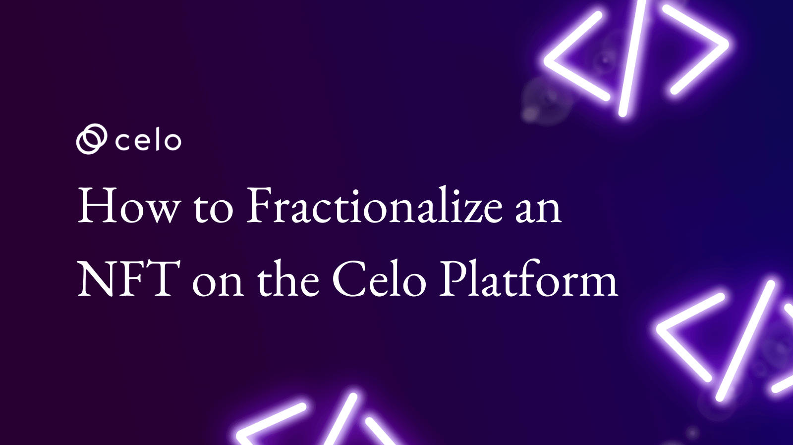

## Introduction

NFTs have taken the market by storm, and the industry is now whopping billions of dollars.

NFT is not a new concept. The concept first came into existence in 2014 with the launch of Quantum. A non-fungible token was created back then.

Later in 2020, NFT became a hot topic, and everyone was talking about it, and their market grew by \$250 million. Since then, sales of NFTs have sky-rocketed.

## Prerequisites​

- Prior knowledge of Solidity is required.
- Prior knowledge of HTML, CSS, and JavaScript is required.
- Knowledge of ERC-20, ERC-721 specification is required.
- Knowledge of how to deploy smart contracts via Remix.

## Requirements

- Remix IDE to write smart contract
- Knowledge of HTML, CSS, and JavaScript to code the frontend so we can interact with the smart contract to create an NFT.

## What are NFTs?​

A non-fungible token or NFT is a permanent record in blockchain linked to a digital or physical asset. For example, if I have a unique image and insert its location inside the token, that piece is called a non-fungible token.

But first, we need to understand what “fungible” means.

A “fungible” item is replaceable with a similar item bearing the same value; that means every fungible item has the same utility and intrinsic value. An example of this would be a $10 bill that can be used to replace any other $10 bill—you can swap your $10 bill with your friend’s without actually causing its value to dip. However, if you have a $10 bill that some celebrity has signed or a unique serial number like all eights, it could be worth up to $1,000 or even more. Why so? Because a mere celebrity autograph can make a regular $10 bill rare, special, and hence, non-fungible.

## What are fractionalized NFTs?​

As the name suggests, a fractionalized NFT is an NFT spitted into fractions that can be sold individually. Each fraction represents ownership of an NFT, enabling multiple people to own a single NFT.

Fractionalization lowers the threshold to own an NFT, enabling more people to own a single NFT collectively.

Fractionalized NFTs work just like shares of a company or shared ownership of a property.

When an NFT is fractionalized, the original NFT is locked up in a vault, and a limited supply of fungible tokens representing fractions of the NFT’s ownership is issued. Interested buyers can then invest in these individual fractions of the NFT and claim shared ownership.

## How to fractionalize an NFT?​

Both ERC-721 and ERC-1155 are used to create NFTs on Ethereum. However, to create alt tokens, the ERC-20 specification is used.

The fractionalization process requires creating limited ERC-20(fungible) tokens out of ERC-721(non-fungible) tokens. Those who hold this ERC-20 token own a fraction of the NFT.

Now let’s dive deeper and understand the process to fractionalize an NFT:

- To fractionalize an NFT, it must first be secured in a smart contract that breaks this ERC-721 or ERC-1155 token into several smaller parts, each representing an individual ERC-20 token.
- Each ERC-20 token represents partial ownership of the NFT. After the owner of the NFT sells it, holders of the ERC-20 tokens can redeem their tokens for their share of the money received from the sale.
- From deciding on the number of ERC-20 tokens to be created to fixing each token’s price, the owner of the NFT makes all major decisions regarding the fractionalization process.
- An open sale is then organized for the fractional shares at a fixed price for a set period or until they are sold out.

## Enough talking. Let’s get to the coding!​

We will need two smart contracts to achieve this task.

- **NFT smart contract**: This is a simple NFT smart contract
- **Fractionalized NFT smart contract**: This smart contract fractionalizes the NFT and gives out ERC-20 token. Users can also buy NFT from this NFT. Once a sale is made, ERC-20(fraction) holders can redeem their tokens with ETH.

Go to Open Zepplin wizard and create an ERC-721 token: <https://docs.openzeppelin.com/contracts/4.x/wizard>

It looks like this.

](<https://docs.openzeppelin.com/contracts/4.x/wizard>)

Give your NFT smart contract name and symbol. Make sure you select Ownable from the menu.

Below is the code for ERC-721 smart contract.

```js
// SPDX-License-Identifier: MIT
pragma  solidity ^0.8.9;

import  "@openzeppelin/contracts/token/ERC721/ERC721.sol";
import  "@openzeppelin/contracts/access/Ownable.sol";

contract  MyToken  is  ERC721, Ownable {
constructor() ERC721("MyToken", "MTK") {}
}
```

You can paste it in Remix IDE.

Now I will explain line-by-line this contract.

```js
// SPDX-License-Identifier: MIT
```

Above line specifies the license. In our case, it is an MIT license.

```js
import "@openzeppelin/contracts/token/ERC721/ERC721.sol";
import "@openzeppelin/contracts/access/Ownable.sol";
```

Above two are import statements which are importing ERC721 and Ownable smart contract.

```js
contract  MyToken  is  ERC721, Ownable {

constructor() ERC721("MyToken", "MTK") {}

}
```

Name of contract is MyToken which inherits ERC721 and Ownable.

We have a constructor, a special function that runs when a smart contract is created.

ERC721 is taking two arguments, token name and token symbol.

After we are done with creating the NFT smart contract, it’s time to create Fractionalized NFT smart contract.

Below is the code.

```js
// SPDX-License-Identifier: MIT
pragma  solidity ^0.8.4;

import  "@openzeppelin/contracts@4.6.0/token/ERC20/ERC20.sol";
import  "@openzeppelin/contracts@4.6.0/token/ERC721/IERC721.sol";
import  "@openzeppelin/contracts@4.6.0/access/Ownable.sol";
import  "@openzeppelin/contracts@4.6.0/token/ERC20/extensions/draft-ERC20Permit.sol";
import  "@openzeppelin/contracts@4.6.0/token/ERC721/utils/ERC721Holder.sol";

contract  FractionalizedNFT  is  ERC20, Ownable, ERC20Permit, ERC721Holder {
 IERC721  public  collection;
 uint256  public  tokenId;
 bool  public  initialized = false;
 bool  public  forSale = false;
 uint256  public  salePrice;
 bool  public  canRedeem = false;

 constructor() ERC20("MyToken", "MTK") ERC20Permit("MyToken") {}

 function  initialize(address  _collection, uint256  _tokenId, uint256  _amount) external  onlyOwner {
  require(!initialized, "Already initialized");
  require(_amount > 0, "Amount needs to be more than 0");
  collection = IERC721(_collection);
  collection.safeTransferFrom(msg.sender, address(this), _tokenId);
  tokenId = _tokenId;
  initialized = true;
  _mint(msg.sender, _amount);
 }

 function  putForSale(uint256  price) external  onlyOwner {
  salePrice = price;
  forSale = true;
 }

 function  purchase() external  payable {
  require(forSale, "Not for sale");
  require(msg.value >= salePrice, "Not enough CELO sent");
  collection.transferFrom(address(this), msg.sender, tokenId);
  forSale = false;
  canRedeem = true;
 }


 function  redeem(uint256  _amount) external {
  require(canRedeem, "Redemption not available");
  uint256  totalCelo = address(this).balance;
  uint256  toRedeem = _amount * totalCelo / totalSupply();
  _burn(msg.sender, _amount);
  payable(msg.sender).transfer(toRedeem);
 }
}
```

Let’s try to understand what this smart contract does.

Here FractionalizedNFT inherits ERC20, Ownable, ERC20Permit, ERC721Holder.

```js
IERC721  public  collection;
uint256  public  tokenId;
bool  public  initialized = false;
bool  public  forSale = false;
uint256  public  salePrice;
bool  public  canRedeem = false;
```

**collection** variable of type IERC721 holds NFT smart contract address we deployed earlier.
**tokenId** of type uint256 holds the id of the NFT.

initialized, forSale, canRedeem of type bool are flags.
**initialized** flag is is used tell that price of NFT is set, NFT address is stored in collection variable, tokenId gets initialized, NFT gets transferred from owner to smart contract and ERC-20 tokens are minted for the NFT owner.
**forSale** flag is used to tell that NFT is for sale.
**canRedeem** flag is used to tell that NFT is sold and users can redeem their ERC-20 token.
**salePrice** is the price of the NFT.

```js
constructor() ERC20("MyToken", "MTK") ERC20Permit("MyToken") {}
```

This is the function it runs when the smart contract is deployed. ERC20 takes the token name and token symbol as an argument, while ERC20Permit only takes the token name as an argument.

**ERC20Permit** is EIP specification which allows users to approve token transfers without spending gas fees.

```js
function  initialize(address  _collection, uint256  _tokenId, uint256  _amount) external  onlyOwner {
 require(!initialized, "Already initialized");
 require(_amount > 0, "Amount needs to be more than 0");
 collection = IERC721(_collection);
 collection.safeTransferFrom(msg.sender, address(this), _tokenId);
 tokenId = _tokenId;
 initialized = true;
 _mint(msg.sender, _amount);
}
```

function **initialize** is taking NFT address, \_tokenId and \_amount. The owner can only invoke this function.

It checks if the contract is already initialized. If not, it checks for the other condition, checking amount sent is greater than 0. Here amount refers to total number of ERC-20 tokens that are going to be minted.

**collection** variable of type IERC721 gets initialized Here collection variable holds address of an NFT. **safeTransferFrom** function transfers the NFT from the owner to the smart contract, i.e., itself. tokenId variable stores the token id. **initialized** flag is marked true. **\_mint** function mints erc20 tokens to the owner.

```js
function  putForSale(uint256 price) external  onlyOwner {
 salePrice = price;
 forSale = true;
}
```

**putForSale** function takes price as an argument. It sets the salePrice variable of type uint256. It is the price of an NFT. Also, the function makes the forSale flag to be true.

```js
function  purchase() external  payable {
 require(forSale, "Not for sale");
 require(msg.value >= salePrice, "Not enough CELO sent");
 collection.transferFrom(address(this), msg.sender, tokenId);
 forSale = false;
 canRedeem = true;
}
```

**purchase** function is a payable function, i.e., you can send CELO to this function.

First, it checks if the forSale flag is true and if the sent CELO is greater than or equal to the sale price. If both the conditions are fulfilled, then NFT is transferred from the NFTFractionalized contract to the buyer who sent the CELO.

**forSale** flag is set to false, and now people can redeem their ERC-20 tokens with CELO. This flag is set to true.

```js
function  redeem(uint256 _amount) external {
 require(canRedeem, "Redemption not available");
 uint256 totalCelo = address(this).balance;
 uint256 toRedeem = _amount * totalCelo / totalSupply();

 _burn(msg.sender, _amount);
 payable(msg.sender).transfer(toRedeem);
}
```

**redeem** function takes the amount as an argument. People can send either partial or complete ERC-20 tokens they are holding for that NFT.

First, it checks if **canRedeem** flag is set to true. Then it checks the total CELO smart contract that is holding. Then it calculates the amount of CELO that needs to be redeemed. It burns the sent ERC-20 token and transfers the calculated CELO to the caller of this function.

Here is the final code: [https://github.com/avirajkhare00/nft-fractionalization](https://github.com/avirajkhare00/nft-fractionalization)

### Frontend

Once we are done with coding our smart contracts, let’s get started with our Frontend.

For the frontend we will use the following libraries:

- create-react-app
- Web3
- @celo/contractkit

Frontend code is already done. Please clone this repo: [https://github.com/avirajkhare00/celo-fractionalized-nft-ui](https://github.com/avirajkhare00/celo-fractionalized-nft-ui)

We will create a single page so that anyone can purchase the NFT by sending the required CELO amount.

Those holding ERC-20 tokens of fractionalized NFT can redeem them back to the CELO.

Let’s get started with the coding part.

We will edit the page App.jsOur UI and logic will go on that page.

We need to take a look at two functions already defined inside src/App.js

### 1. buyNFT()

```js
export async function buyNFT() {
  await window.celo.enable();
  const web3 = new Web3(window.celo);
  let kit = newKitFromWeb3(web3);
  const accounts = await kit.web3.eth.getAccounts();
  const user_address = accounts[0];
  const contract = new kit.web3.eth.Contract(
    FractionalizedNFTABI,
    contractAddress
  );
  let result = await contract.methods.purchase().send({ from: user_address });
  console.log(result);
}
```

When we trigger this function inside our dApp. Anyone will be able to buy the NFT by paying the price.

### 2. redeemNFT()

```js
export async function redeemNFT() {
  let amount = document.getElementById("redeemNFTAmount").value;
  console.log(amount);
  await window.celo.enable();
  const web3 = new Web3(window.celo);
  let kit = newKitFromWeb3(web3);
  const accounts = await kit.web3.eth.getAccounts();
  const user_address = accounts[0];
  const contract = new kit.web3.eth.Contract(
    FractionalizedNFTABI,
    contractAddress
  );
  let result = await contract.methods
    .redeem(amount)
    .send({ from: user_address });
  console.log(result);
}
```

People will be able to get the CELO back once they send in their ERC-20 tokens to the contract. Actually, they don’t have to send the tokens. They just need to execute the function, their tokens will be burned inside the contract.

Final frontend looks like this.


When you open up this page. CeloExtensionWallet will ask you to connect to this site.

Below is a small video on how this functionality works.

Since I don’t have enough CELO, I won’t be able to buy the NFT, but if you have enough CELO, you will be able to buy it.

Here is the link to demo: [https://youtu.be/mVknObb1bEc](https://youtu.be/mVknObb1bEc)

I hope you loved this tutorial.

Thank You

## About the Author

- Aviraj Khare: Ex Gojek, Into Web3 space since 2016

## References

- **[https://docs.celo.org/](https://docs.celo.org/)**
