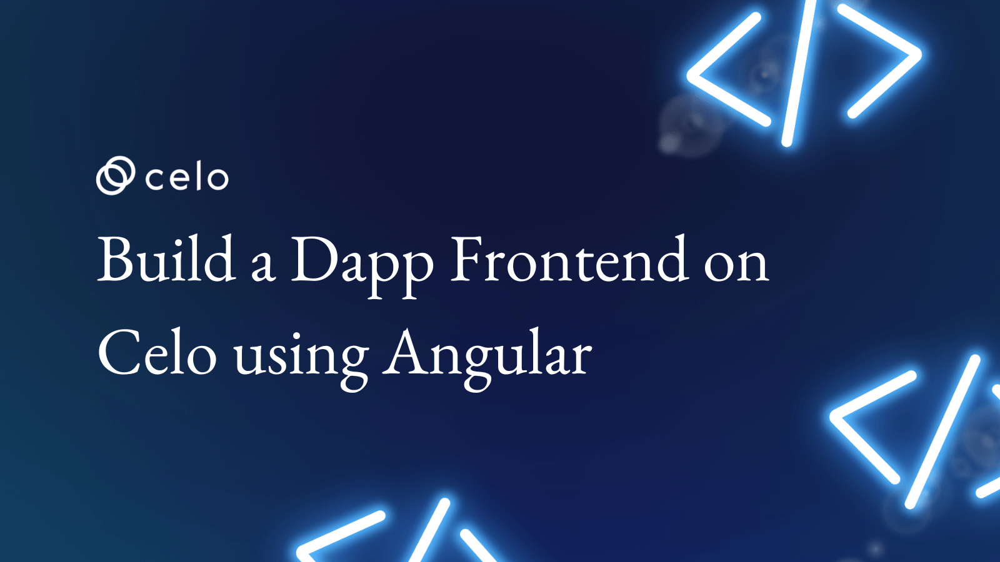

---
title: Build a Frontend dApp for Celo Network in Angular
description: How to build a frontend for an NFT Auction dApp that runs on the Celo blockchain using Angular 
authors:
  - name: ✍️ Yinka Tanimomo
tags: [hardhat, celosage, advanced]
hide_table_of_contents: false
slug: /tutorials/build-a-frontend-dapp-for-celo-network-in-angular
---



## Introduction

In this tutorial, we will be building a frontend for an NFT Auction dApp that runs on the Celo blockchain using Angular.

## How the dApp works

Our dApp will allow NFT owners to create Auctions for NFTs they own, and bidders can make bids on the NFTs. Successful bidders will get the NFTs they bidded for transferred to them, and the sellers will get the CELO paid by the bidders sent to their wallets.

- During Auction
  - The seller of NFT deploys this contract.
  - Auction lasts for seven days.
  - Participants can bid by depositing ETH greater than the current highest bidder.
  - All bidders can withdraw their bid if it is not the highest bid.
- After the auction
  1. The highest bidder becomes the new owner of NFT.
  1. The seller receives the highest bid of ETH.

You can see a sample of what we will be building here.


# Prerequisites

This tutorial assumes that you are already familiar with solidity and understand how smart contracts work. It will be assumed that you already know how to deploy smart contracts to a network using your favorite web3 tooling (Hardhat, Truffle, etc). Celo is an Ethereum Virtual Machine (EVM) compatible chain, so all the languages and workflows you learned while building for any EVM chain apply to Celo also.

I also assume that you already know the basics of using Angular, i.e., you can bootstrap an application in Angular and understand routing, services, binding, etc.

You will also need the following

- Solidity
- Hardhat/Truffle
- Node
- Typescript
- Angular Basics

# Getting Started

I assume that anyone going through this tutorial already understands and use Angular, so I will skip the setup involved in getting Angular to work on your development computer. That means I assume you already have Node and Angular setup on your PC.

\*If you are entirely new to Angular, [here](https://angular.io/start) is a good tutorial you can learn from.

To bootstrap our Angular dApp, we will be using **Celo Composer**.

**Celo Composer** is a set of tools and starter templates that makes it easy for you to start your Celo-based web3 projects.

You can check out Celo Composer here <https://github.com/celo-org/celo-composer/tree/main/packages/angular-app>.

To start our Angular App Project, we will use the Celo Composer CLI; the CLI makes it easy for us to select the options that we want when bootstrapping our dApp.

- Run this on your terminal

```text
    npx @celo/celo-composer create
```

- Choose Angular when asked for the framework

- Choose hardhat (Only Hardhat is available at the time of writing this tutorial)

- Skip subgraph, we won't use it in this tutorial.

Your Project will now be created; you can check to make sure it has the following folders

- packages/hardhat - Your Hardhat Folder - Where you can keep your Contracts
- packages/angular-app - Your Angular project

# Setup the Smart Contract

- Open your Hardhat project folder (`packages/hardhat`)

- Copy the *.envexample* to a new file called *.env*. This is where the private key you use to deploy your contracts will be saved.

- Fill in the private key with your Celo wallet private key. You might want to get some Alfajores (Testnet) coins from the Celo Faucet

- Install the needed packages  

```bash
  npm i
```

- Open your Contracts folder (packages/hardhat/contracts)

- Add a new contract in the folder called `NFTAuctionManager.sol`

```js
// SPDX-License-Identifier: MIT
pragma solidity ^0.8.13;

import "@openzeppelin/contracts/token/ERC721/IERC721.sol";
import "./NFTAuction.sol";

contract NFTAuctionManager {

    event AuctionCreated(address indexed creator, uint indexed auctionId, address indexed auctionAddress);


    uint public auctionCount;


    mapping(uint => address) public auctions;

    constructor() {

    }

    function createAuction(address _nft,
        uint _nftId,
        uint _startingBid) external {

        auctionCount++;

        address n = address(new NFTAuction(_nft,_nftId,_startingBid,msg.sender, auctionCount) );

        auctions[auctionCount]=n;

        emit AuctionCreated(msg.sender, auctionCount, n);
    }


    function getAuctionAddress(uint id) public view returns (address)
    {
        return auctions[id];
    }


}
```

The `NFTAuctionManager` Contract has two functions

**CreateAuction**: allows you to create a new Auction; it stores the created Auction in the auctions mapping

**GetAuctionAddress**: an helper method to access existing auctions through their index

- Add another Contract called `NFTAuction.sol`

```js
// SPDX-License-Identifier: MIT
pragma solidity ^0.8.13;

import "@openzeppelin/contracts/token/ERC721/IERC721.sol";

contract NFTAuction {
    event Started();
    event Bidded(address indexed sender, uint amount);
    event Withdrew(address indexed bidder, uint amount);
    event Ended(address winner, uint amount);

    IERC721 public nft;
    uint public nftId;

    address payable public seller;
    uint public endAt;
    bool public started;
    bool public ended;

    address public highestBidder;
    uint public highestBid;
    mapping(address => uint) public bids;

    uint public auctionId;

    constructor(
        address _nft,
        uint _nftId,
        uint _startingBid,
        address _seller,
        uint _auctionId
    ) {
        nft = IERC721(_nft);
        nftId = _nftId;

        seller = payable(_seller); // payable(msg.sender);
        highestBid = _startingBid;
        auctionId=_auctionId;
    }

    function start() external {
        require(!started, "started");
        require(msg.sender == seller, "not seller");

        nft.transferFrom(msg.sender, address(this), nftId);
        started = true;
        endAt = block.timestamp + 7 days;

        emit Started();
    }

    function bid() external payable {
        require(started, "not started");
        require(block.timestamp < endAt, "ended");
        require(msg.value > highestBid, "value < highest");


        highestBidder = msg.sender;
        highestBid = msg.value;

        bids[highestBidder] = highestBid;

        emit Bidded(msg.sender, msg.value);
    }

    function withdraw() external {
        uint bal = bids[msg.sender];
        bids[msg.sender] = 0;
        payable(msg.sender).transfer(bal);

        emit Withdrew(msg.sender, bal);
    }

    function end() external {
        require(started, "not started");
        require(block.timestamp >= endAt, "not ended");
        require(!ended, "ended");

        ended = true;
        if (highestBidder != address(0)) {
            nft.safeTransferFrom(address(this), highestBidder, nftId);
            seller.transfer(highestBid);
        } else {
            nft.safeTransferFrom(address(this), seller, nftId);
        }

        emit Ended(highestBidder, highestBid);
    }

    function details() public view returns (address _nft,uint _nftId,address _seller,uint _endAt, bool _started,bool _ended, address _highestBidder,uint _highestBid){
        return (address(nft), nftId,seller,endAt, started,ended,highestBidder,highestBid );

    }
}
```

The **NFTAuction** contract implements the Auction Sale. It has the following functions

**Start**: The ***start*** function allows you to transfer the NFT you want to sell to this contract and begin the sale. Only the seller can call this function.

**Bid**: Buyers can submit bids for the NFT through the ***bid*** function. Bids are only accepted if they are higher than the previous highest bid. The amount bidded is transferred to the contract when this function is called.

**Withdraw**: Bidders can withdraw their Celo in the event their bids were not successful.

**End**: This function ends the auction sale once the auction deadline has been reached. If the auction was successful, the NFT will be transferred to the highest bidder and the Celos transferred to the seller.

These are the contracts we will be interacting with via our Angular dApp Frontend.

## Deploy Your Smart contract

Your hardhat project was set up with the hardhat-deploy plugin which makes deployments very easy.

To deploy, go to the deploy folder, open the `00-deploy.js` file, and you will see an example deployment function for the existing Greeter contract.

Copy the `00-deploy.js` file and paste it to a new file called `01-deploy-NFTAuction.js`.

Your hardhat-deploy plugin deploys your contracts serially using the naming of the file. So, when you run the deploy command, it will run the `00-deploy` file first, then run the `01-deploy-nftauction.js` file next.

Now open the `01-deploy-NFTAuction.js` file.

Update the code to deploy the `NFTAuctionManager` Contract.

Your code should look like this

```js

await deploy("NFTAuctionManager", {
  from: deployer,
  args: [],
  log: true,
})

module.exports.tags = ["NFTAuctionManager"];

```

Deploy the Contracts by running the following commands on any terminal (make sure you are in the packages/hardhat directory)

```bash
npx hardhat deploy –network alfajores
```

If all is well, you should see a message from hardhat with the transaction hash of your Contract deployment and the address of your new Contract

You can now view your contract on the CELO explorer (Alfajores) using the address.

Now that we have deployed our contract let's build the dApp.

Before we go on, Our dApp will be running in the browser, so you will need a wallet to test within the browser. If you have not yet installed Metamask, this will be a good point to do that.

Also, once you have Metamask installed, ensure you add the CELO Networks - Mainnet and Alfajores ( TestNet ) - to it. If you are unsure how to go about this, You can use this tutorial ( <https://developers.celo.org/3-simple-steps-to-connect-your-metamask-wallet-to-celo-732d4a139587> ) as a guide.

# DAPP Frontend

Switch to the angular project in your terminal

```bash
cd packages/angular-app
```

Now install the needed packages

```bash
npm i
```

Once the packages install, let's run the code to see how it looks first with the base Celo composer code


Click on the connect button, and you will see how it works for now.

You can now connect to a crypto wallet, and the response from your connection is also displayed back to you. Now, let's go through the code that produced that.

Open **src/app/core/web3.ts**

The first thing we need to do is figure out a way to get access to our Web3 provider.

This Web3 provider allows your application to communicate with an Ethereum Node. Providers take JSON-RPC requests and return the response.

The `/core/web3` file contains an injection token that allows you to get access to the web provider.

```js

import { InjectionToken } from '@angular/core';
import Web3 from 'web3';

export const WEB3 = new InjectionToken<Web3>('web3', {
  providedIn: 'root',
  factory: () => new Web3(Web3.givenProvider)
});

```

Now that we know how to get access to the web3 provider, Most of your interactions with the blockchain are going to be happening through the web3Service so let's go through that also.

Open the `packages\angular-app\src\app\services\contract\web3.services.ts` file

Now let's go through the code

First, we import the libraries we will need. There are three important libraries to take note of.

1. **WalletConnect:** This is an open-source protocol that helps implement established connections between various crypto wallets and[](https://learn.bybit.com/glossary/defi/)decentralized finance (DeFi) DAPPs. The protocol establishes a remote, encrypted connection between the wallets and apps. Simply put, WalletConnect forms a bridge connecting any mobile wallet to any decentralized web application.
   With WalletConnect, users can connect over 170[](https://learn.bybit.com/crypto/walletconnect-compatible-wallets/)WalletConnect-compatible wallets, such as[](https://learn.bybit.com/crypto/what-is-metamask-and-how-to-use-it/)MetaMask, Valora, and[](https://learn.bybit.com/defi/what-is-trust-wallet/)Trust Wallet, and several DAPPs

1. **Web3 Modal:** This is an easy-to-use library to help developers add support for multiple providers in their apps with a simple, customizable configuration. With Web3modal, you can easily support injected providers like (Metamask, Brave Wallet, Dapper, Frame, Gnosis Safe, Tally, Web3 Browsers, etc) and WalletConnect.

1. **Web3 Js:**  This is a collection of JS libraries that lets you interact with an Ethereum node remotely or locally. CELO Composer comes preinstalled with web3 js.

Now, let's have a look at some of the class variables

All the Web3 Wallet accounts our DAPP is connected to are saved in the ***accounts*** array.

In Web3, a DAPP might be connected to different wallets at the same time; requesting for all connected accounts will always return an array. Most times, though, most DAPPS simply use the first member of the array as the active account.

The ***provider*** variable will store a reference to our web3 provider as provided by the Wallet we are connected to.

***balance*** shows the current Native Coin (CELO) Balance of our connected wallet.

In lines 27 - 53 (`web3.services.ts`), we configure our options for web3modal.

The ***walletconnect*** option allows us to set up the wallet that we would like to support in our dApp. You can connect through different types of connections

- Injected Wallets:-  e.g, Metamask - supports wallets that injects an Ethereum Provider into the browser or window
- Mobile Wallets: - e.g Valora - Wallet connect allows users to connect via scanning QR codes that deep links to the apps.
- Remote Nodes - e.g, Infura, Alchemy, etc - These -allow you to "plug in" to the blockchain via nodes managed by some trusted third party. Wallet Connect allows you to specify an InfuraId in the options.  If you don't have one, go to <https://www.infura.io/> now to create an account

Let's look at the next lines

```js

  async connectAccount() {
    this.provider = await this.web3Modal.connect(); // set provider
    if (this.provider) {
      this.web3js = new Web3(this.provider);
    } // create web3 instance
    this.accounts = await this.web3js.eth.getAccounts();
    return this.accounts;
  }

```  

In ***connectAccount***, we call the Web3modal's connect method to display our wallet connection dialog. This will display a dialog with all the options of wallets we configured earlier in WalletConnect.

After you select a wallet and get connected to an account, web3modal returns a provider. We will need this provider to create our web3js instance. Once we have our web3js instance, we can request our account.

Lastly, in the `web3.service`, the ***accountInfo*** method allows you to get the balance of the currently connected account.

Ok, let's change the web3service a little to make it easier to use with type checking

Replace the content with this

```js
import {Inject, Injectable} from '@angular/core';
import { WEB3 } from '../../core/web3';
import { Subject } from 'rxjs';
import Web3 from 'web3';
import Web3Modal from "web3modal";
import WalletConnectProvider from "@walletconnect/web3-provider";
import { provider } from 'web3-core';

@Injectable({
  providedIn: 'root'
})

@Injectable({
  providedIn: 'root'
})
export class Web3Service {
    web3Modal;
  web3js:  Web3| undefined;
  provider: provider | undefined;
  accounts: string[] | undefined;
  balance: string | undefined;

  constructor(@Inject(WEB3) private web3: Web3) {
    const providerOptions = {
      walletconnect: {
        package: WalletConnectProvider, // required
        options: {
          infuraId: 'env', // required change this with your own infura id
          description: 'Scan the qr code and sign in',
          qrcodeModalOptions: {
            mobileLinks: [
              'rainbow',
              'metamask',
              'argent',
              'trust',
              'imtoken',
              'pillar'
            ]
          }
        }
      },
      injected: {
        display: {
          logo: 'https://upload.wikimedia.org/wikipedia/commons/3/36/MetaMask_Fox.svg',
          name: 'metamask',
          description: "Connect with the provider in your Browser"
        },
        package: null
      },
    };

    this.web3Modal = new Web3Modal({
      network: "mainnet", // optional change this with the net you want to use like rinkeby etc
      cacheProvider: true, // optional
      providerOptions, // required
      theme: {
        background: "rgb(39, 49, 56)",
        main: "rgb(199, 199, 199)",
        secondary: "rgb(136, 136, 136)",
        border: "rgba(195, 195, 195, 0.14)",
        hover: "rgb(16, 26, 32)"
      }
    });
  }


  async connectAccount() {
    this.provider = await this.web3Modal.connect(); // set provider
    if (this.provider) {
      this.web3js = new Web3(this.provider);
    } // create web3 instance
    this.accounts = await this.web3js!.eth.getAccounts();
    return this.accounts;
  }

  async accountInfo(account: string){
    const initialvalue = await this.web3js!.eth.getBalance(account);
    this.balance = this.web3js!.utils.fromWei(initialvalue , 'ether');
    return this.balance;
  }

}
```

Now let's visit the AppComponent (`/src/app/app.component.ts`) to see how our web3service is used.

In the ***Connect*** method, we call the web3service ***connectAccount*** method to connect through our web3modal and then we log the response.

The response from the Connect call is bound to the header in our view, so you can try to connect a wallet to see what the response is.

If all goes well, you should see your connected wallet address on the page.

Congrats, you have made your first web3 interaction

## Add Bootstrap UI Framework

We are going to be modifying our DAPPs UI a little, and we will find it better to use a UI framework to keep our UI looking a little reasonable. I find it more straightforward to use bootstrap but you can use any framework you prefer.

Tailwind is installed, so I will disable it, and add **bootstrap** instead. So go to styles.css and remove all the stylings there.

There are two ways to install bootstrap.

- Via a CDN or
- Via an Angular plugin

While using an angular plugin is preferable, we won't be doing that as that's outside the scope of this tutorial, you can look up this tutorial to see how to setup bootstrap via the angular plugin. <https://www.freecodecamp.org/news/how-to-add-bootstrap-css-framework-to-an-angular-application>

For now, go to <https://getbootstrap.com/docs/5.2/getting-started/introduction/> and copy the bootstrap css files and scripts and add it to the head and body section in your `index.html`(`/src/index.html`)

We can now change the code in our app-component to use a more "bootstrappy" theme and we will also add support for routing by adding a Router Outlet.

```html
<nav class="navbar navbar-expand-sm navbar-dark bg-primary">
  <div class="container-fluid">
    <a class="navbar-brand" href="#">
      <h1>Angular DAPP</h1>
    </a>
    <button class="navbar-toggler" type="button" data-bs-toggle="collapse" data-bs-target="#navbarSupportedContent" aria-controls="navbarSupportedContent" aria-expanded="false" aria-label="Toggle navigation">
      <span class="navbar-toggler-icon"></span>
    </button>
    <div class="collapse navbar-collapse" id="navbarSupportedContent">
      <ul class="navbar-nav me-auto mb-2 mb-lg-0">
        <li class="nav-item">
          <a class="nav-link active" aria-current="page" href="/">Home</a>
        </li>

        <li class="nav-item dropdown">
          <a class="nav-link dropdown-toggle" href="#" id="navbarDropdown" role="button" data-bs-toggle="dropdown" aria-expanded="false">
            Auctions
          </a>
          <ul class="dropdown-menu" aria-labelledby="navbarDropdown">
            <li><a class="dropdown-item" href="/create-auction">Create Auction</a></li>
            <li><a class="dropdown-item" href="/list-auction">All Auctions</a></li>
          </ul>
        </li>

      </ul>

    </div>
  </div>
</nav>
<div class="container-fluid py-3">
  <div class="row my-3">
    <div class="col d-flex justify-content-center">
      <h3>My Angular DAPP</h3>

    </div>
  </div>
  <div class="row my-3">
    <div class="col d-flex justify-content-center">
      <div *ngIf="accounts "> <span>{{balance}} CELO </span> {{accounts[0]}}</div>
      <button *ngIf="!accounts " class="btn btn-primary py-2 px-4 rounded" (click)="Connect()" >
          Connect your wallet
      </button>
    </div>
  </div>

  <div class="row">
    <div class="col my-3 ">
      <router-outlet></router-outlet>
    </div>
  </div>
</div>
```

Now open the `app.module` file(**src/app/app.module.ts**), let's configure our app module to support routing. Add this import to the file (under existing imports)

```js
import {RouterModule, Routes } from '@angular/router';
```

Also create an array for storing our routes

```js
const routes: Routes = [];
```

Finally, in your NgModule, add the router module to the imports

```js
@NgModule({
 ...
  imports: [
 ....
 RouterModule.forRoot(routes)
 ],
  ...
})
export class AppModule {}
```

Your App Module should look like this now

```js
import { NgModule } from '@angular/core';
import { BrowserModule } from '@angular/platform-browser';
import { BrowserAnimationsModule } from '@angular/platform-browser/animations';

import { AppComponent } from './app.component';
import { RouterModule, Routes } from '@angular/router'

const routes: Routes = [];

@NgModule({
  declarations: [
    AppComponent
  ],
  imports: [
    BrowserModule,
    BrowserAnimationsModule,
 RouterModule.forRoot(routes)
  ],
  providers: [],
  bootstrap: [AppComponent]
})
export class AppModule { }
```

Let's add a new Home Component and setup a route for it. We can do this from the Angular-cli, so run this on your terminal (from the root angular folder path)

```bash
ng g c home
```

Open the newly added Home view (`/src/app/home/home.html`) and update it to

```html
<div class="row">
    <div class="col">
        <h3>Welcome to our Auction Site</h3>
    </div>
</div>
```

Then add a route for your home page (update the routes array in your `app.module`)

```js
const routes: Routes = [
  { path: 'home', component: HomeComponent },
  { path: '', redirectTo: '/home', pathMatch: 'full' },
]
```

Now, check your running application in your browser, it should still be working, good. And now it has a nav menu, and some page structure, great.

## Display Connected Wallet Information

So far, our connect button is working and shows us the account it's connected to, we will extend this a bit.

Go back to the app.component.ts file

Change the ***Connect*** method to an async method, rename the ***data*** class variable to ***accounts*** and update the ***Connect*** method to reflect this.

```js
accounts: any[]|undefined;
...
async Connect() {
  let accounts = await this.web3.connectAccount();
 console.log(accounts);
 this.accounts = accounts;
}
```  

We will update the view to reflect the changes

Let's add a condition on the UI to display the connect button when the accounts variable is undefined and show the principal(first) account when it's defined

Change from

```html
  <button class="bg-orange-500 hover:bg-blue-dark text-white font-bold py-2 px-4 rounded" (click)="Connect()" >
      Connect your wallet
  </button>
```  

to this

```html
  <div *ngIf="accounts "> {{accounts[0]}}</div>
  <button *ngIf="!accounts " class="bg-orange-500 hover:bg-blue-dark text-white font-bold py-2 px-4 rounded" (click)="Connect()" >
      Connect your wallet
  </button>
```  

Now whenever you are connected, it now shows your principal connected account.  

We can display the balance also when you are connected. We can use the ***accountInfo*** method of ***web3service*** to do that.

```js
async Connect() {
  let accounts = await this.web3.connectAccount();
 console.log(accounts);
 this.accounts = accounts;

 this.balance =  await this.web3.accountInfo(this.accounts![0]);

}
```

We have added a variable called ***balance*** to the component.

The only thing left to do is to display the ***balance*** on the UI

```html
<div *ngIf="accounts "> <span>{{balance}} CELO </span> {{accounts[0]}}</div>
<button *ngIf="!accounts " class="bg-orange-500 hover:bg-blue-dark text-white font-bold py-2 px-4 rounded" (click)="Connect()" >
    Connect your wallet
</button>
```

## Add Pages  

We are going to create 3 pages for this DAPP  

1. A Create Auction page - allows you to create an Auction for an NFT you own
1. Auction page - allows you to participate in an ongoing auction.
1. A Listing page - allows you to view all current auctions

Before we go on, let's change our "*noPropertyAccessFromIndexSignature*" Setting in the *tsconfig* to false. We are going to be accessing different properties from our template when validating the form and we won't want the typescript compiler to throw an error.

Look for this line in your *tsconfig*, and change from **true** to **false**

```js
"compilerOptions": { 

// ... 
  "noPropertyAccessFromIndexSignature": false, 

// …

}
```

**Create Auction Page**

Let's create our first page, the Auction creation page

Add a new component from the angular cli

```bash
ng g c create-auction
```

This should create a ***CreateAuctionComponent***. Add it to your routes

```js
{
    path: 'create-auction',
    component: CreateAuctionComponent
},
```

Ensure you import the right reference for the component. You can test whether the route is working by visiting /create-auction in your browser.

Let's discuss what we are going to do on this page.

On this page, we are going to add a form to allow users to input their ***NFTAddress*** and their ***TokenId***. We will take these values, and send them to our **NFTAuctionManger** Contract to create an **Auction** for us. We will set up a reactive form to do this, so let's import the **ReactiveFormsModule** into our **AppModule**

```js
...

import { FormsModule, ReactiveFormsModule } from '@angular/forms';

imports: [
 ...
 ReactiveFormsModule
]
```

Setup the form in your `CreateAuctionComponent`

```js
import { Component, OnInit } from '@angular/core';
import { FormBuilder, FormGroup, Validators } from '@angular/forms';
import { Web3Service } from '../services/contract/web3.service';
import { ActivatedRoute, Router } from '@angular/router';
import {Location} from '@angular/common';

@Component({
  selector: 'app-create-auction',
  templateUrl: './create-auction.component.html',
  styleUrls: ['./create-auction.component.css']
})
export class CreateAuctionComponent implements OnInit {
  mainFormGroup: FormGroup;
  submitted = false;

  constructor(private fb: FormBuilder,
    private web3: Web3Service,
    private route: ActivatedRoute,
    private router: Router,
    private location: Location
) {
    this.mainFormGroup = this.fb.group({
      nftAddress: ['',  [Validators.required]],
      tokenId: ['',  [Validators.required]],
      startPrice: [0, [Validators.required,Validators.min(0), Validators.max(1000000)]],
    })

  }

  ngOnInit(): void {

  }

  get f() {
    return this.mainFormGroup.controls;
  }

  onSubmit() {
    this.submitted = true;
    if (this.mainFormGroup.valid) {

      console.table(this.mainFormGroup.value);
    }
  }

}
```

Add a form to our Create-Auction View

```html
<div class="container">
    <div class="row">
        <div class="col-md-8 mx-auto">
            <div class="card">
                <div class="card-header">
                    <h3>Create Auction</h3>
                </div>
                <div class="card-body">
                    <form class="form" [formGroup]="mainFormGroup" (ngSubmit)="onSubmit()">
                        <div class="form-group">
                            <label>NFT Address</label>
                            <input type="text" class="form-control" formControlName="nftAddress">
                            <span class="text-danger"
                                *ngIf="(f['nftAddress'].touched || submitted) && f['nftAddress'].errors?.required">
                                NFT Address is required
                            </span>
                        </div>
                        <div class="form-group">
                            <label>NFT Token Id</label>
                            <input type="text" class="form-control" formControlName="tokenId">
                            <span class="text-danger"
                                *ngIf="(f.tokenId.touched || submitted) && f.tokenId.errors?.required">
                                Token Id is required
                            </span>
                            <span class="text-danger"
                                *ngIf="f.tokenId.touched && f.tokenId.errors?.tokenId">
                                Enter a valid Token ID
                            </span>
                        </div>
                        <div class="form-group">
                            <label>Start Bid Price</label>
                            <input type="number" class="form-control" formControlName="startPrice">
                            <span class="text-danger"
                                *ngIf="(f.startPrice.touched || submitted) && f.startPrice.errors?.required">
                                Start Bid Price is required
                            </span>
                            <span class="text-danger"
                                *ngIf="f.startPrice.touched && f.startPrice.errors?.min">
                                Start Bid Price must be at least 0
                            </span>
                            <span class="text-danger"
                                *ngIf="f.startPrice.touched && f.startPrice.errors?.min">
                                Start Bid Price must be at most 100,000,000
                            </span>
                        </div>

                        <div class="form-group my-4">
                            <button type="submit" [disabled]="mainFormGroup.invalid" class="btn btn-success">Submit</button>
                        </div>
                    </form>
                </div>
            </div>
        </div>
    </div>
</div>
```

Let's update our `onSubmit` function with the smart contract call to submit the auction details.

We will need the ABI of our deployed contracts and the address deployed, to make any call to our smart contract.

**What is an ABI?**

An ABI - Application Binary Interface - defines the methods, types, and structures used to interact with your binary smart contract. You can think of it like an API, they both expose the structure or interfaces that allow other contracts or programs to call them. The ABI exposes the function signatures and variable declarations in a smart contract and is often represented in JSON.

Hardhat often generates the ABIs for our contracts when we compile them, and the ABIs are often stored in the artifacts folder.

Let's copy our Contract ABIs into our project.

Create two files in your Angular Assets folder.

- NFTAuctionManager.json
- NFTAuction.json

Now go to the `packages/hardhat/artifacts/contracts/NFTAuctionManager.sol/NFTAuctionManager` file

Copy the ABI section of the json file and paste it into the *NFTAuctionManager.json* file you have just created. Copy only the Array, not the whole field.


Repeat the same for the `NFTAuction` file.

Now import the ABIs you just added, and add them to the top of the **CreateAuctionComponent**

```js
const NFTAuctionManagerABI = require('../../assets/NFTAuctionManager.json'); // ensure this is the right path
```

Now update your ***onSubmit*** method in your CreateAuction Component

```js
async onSubmit() {
  this.submitted = true;
  if (this.mainFormGroup.valid) {

    console.table(this.mainFormGroup.value);

    const nftAuctionManagerContract = new this.web3.web3js!.eth.Contract(NFTAuctionManagerABI,'0xb61dC7AB47915d41C7e0bEee1ABe42BE121B88f9');

    const startPrice = this.web3.web3js!.utils.toWei(this.mainFormGroup.get('startPrice')?.value.toString() , 'ether')

    const receipt = await nftAuctionManagerContract.methods
      .createAuction(this.mainFormGroup.get('nftAddress')?.value, this.mainFormGroup.get('tokenId')?.value, startPrice)
      .send({from: this.web3.accounts![0]})
    const newAuctionId = receipt.events.AuctionCreated.returnValues.auctionId;

    this.router.navigate(['/view-auction', newAuctionId]);

  }
}
```

We create a contract Instance that allows us to interact with our smart contract, using the ABI we just added.

Currency values in blockchain are usually represented by BigNumber (Crypto Currencies are usually denominated in up to 18 decimal places) and it's required that we send their values in Wei.

So We use a Web3js utility to convert the ***startPrice*** value to Wei. We pass in the other values and call the ***CreateAucton*** function on our smart contract.

A receipt object is returned back to us when we make the function call. This receipt object contains the

- Transaction Hash - Which you can use on a block explorer to examine the state of the event
- Events - Smart Contract state-changing functions do not return values, so the only way to send back return values from the functions are via events that you emit events. The events object maps event names as keys and events as properties. We will get the ID of our created Auction through the ***AuctionCreated*** event

**View Auction Page**

Once we have our New **AuctionId**, we can redirect to our **view-Auction** page. The View Auction page will allow us to interact with an existing auction specified by the Auction ID. Let's add a new page for our View Auction

```bash
ng g c view-auction

```

Now, we will add our View Auction Component to our route table, specifying the auctionId as a path parameter to the route

Our Route table(`app.module`) should now look like this

```js
const routes: Routes = [
  { path: 'home', component: HomeComponent },
  { path: '', redirectTo: '/home', pathMatch: 'full' },
  { path: 'create-auction', component: CreateAuctionComponent },
  { path: 'view-auction/:auctionId', component: ViewAuctionComponent },
];

```

To make it easy to access our Contract address, let's add it to the environment file.

```js
export const environment = {
  production: false,
  infuraId: '',
  nftAuctionManager: '0xb61dC7AB47915d41C7e0bEee1ABe42BE121B88f9'
};
```

Now let's modify our `ViewAuctionComponent` code.

We are going to make an HTTP request for the NFT metadata with Angular's HttpClient, so add the ***HttpClientModule*** to the App Module.

Our View Auction Component should allow all types of users to view an auction. Different buttons will be shown or hidden based on if the current user is the seller or the bidder. The seller will be able to start an Auction and will be able to end an auction once the End date is passed.

The ***StartAuction*** function in our Component will ask the seller to first approve the NFT Token for our Auction contract, without this we won't be able to transfer his/her NFT token to our contract where it will be held till the successful completion of the Auction.

Bids are submitted by Non-Owners via the Bid method.

Lastly, we will display the NFT image by querying the NFT for its metadata and then reading the image property.

```js
import { Component, OnInit } from '@angular/core';
import { FormBuilder, FormGroup, Validators } from '@angular/forms';
import { Title } from '@angular/platform-browser';
import { ActivatedRoute, Router, Params } from '@angular/router';
import { environment } from 'src/environments/environment';
import { Web3Service } from '../services/contract/web3.service';
import {Location} from '@angular/common';
import { HttpClient } from '@angular/common/http';
const NFTAuctionManagerABI = require('../../assets/NFTAuctionManager.json');
const NFTAuctionABI = require('../../assets/NFTAuction.json');

const tokenURIABI: any = [
  {
      "inputs": [
          {
              "internalType": "uint256",
              "name": "tokenId",
              "type": "uint256"
          }
      ],
      "name": "tokenURI",
      "outputs": [
          {
              "internalType": "string",
              "name": "",
              "type": "string"
          }
      ],
      "stateMutability": "view",
      "type": "function"
  },
  {
    "inputs": [
      {
        "internalType": "address",
        "name": "to",
        "type": "address"
      },
      {
        "internalType": "uint256",
        "name": "tokenId",
        "type": "uint256"
      }
    ],
    "name": "approve",
    "outputs": [],
    "stateMutability": "nonpayable",
    "type": "function"
  },
];

@Component({
  selector: 'app-view-auction',
  templateUrl: './view-auction.component.html',
  styleUrls: ['./view-auction.component.css']
})
export class ViewAuctionComponent implements OnInit {

  auctionId: undefined|any;
  auctionAddress: undefined|any;
  auction: undefined|any;
  nftAuctionManagerContract: undefined|any;
  nftAuctionContract: undefined|any;
  nftTokenContract: any;
  nftMetadata: any;
  mainFormGroup: FormGroup;
  account: any;
  ZERO_ADDRESS = '0x0000000000000000000000000000000000000000'

  constructor(
    public web3: Web3Service,
    private route: ActivatedRoute,
    private router: Router,
    private fb: FormBuilder,
    private location: Location,
    private http: HttpClient) { 

      this.mainFormGroup = this.fb.group({
        bid: [0.01, [Validators.required,Validators.min(0), Validators.max(1000000)]],
      })
    }

  ngOnInit(): void {

    this.route.params.subscribe((params: Params) => {
      this.auctionId = params['auctionId'];

      setTimeout(async ()=>{
        this.account = this.web3.accounts[0];
        this.nftAuctionManagerContract = new this.web3.web3js!.eth.Contract(NFTAuctionManagerABI,environment.nftAuctionManager);  

        this.auctionAddress = await this.nftAuctionManagerContract.methods.getAuctionAddress(this.auctionId).call();

        this.nftAuctionContract = new this.web3.web3js!.eth.Contract(NFTAuctionABI, this.auctionAddress);

        this.auction = await this.nftAuctionContract.methods.details().call();
        console.log('this.auction: ', this.auction);

        this.nftTokenContract = new this.web3.web3js!.eth.Contract(tokenURIABI, this.auction._nft)

        await this.getNFTMetadata(this.nftTokenContract, this.auction._nftId)

      }, 3000) 
    })
  }


  async getNFTMetadata(contract: any, tokenId: any) {

    const result = await contract.methods.tokenURI(tokenId).call()

    this.http.get(result).subscribe(
      (response) => { 
        this.nftMetadata  = response; 
        console.log(this.nftMetadata)
      },
      (error) => { console.error(error); });


  }


  async startAuction(){
    try{
      // approve nft for contract
      await this.nftTokenContract.methods
        .approve(this.auctionAddress, this.auction._nftId)
        .send({from: this.web3.accounts![0]})

      // start
      const receipt =  await this.nftAuctionContract.methods
        .start()
        .send({from: this.web3.accounts![0]});
      this.auction._started=true;
    }catch(err){
      console.error(err);
    }
  }

  async endAuction(){
    try{

      // start
      const receipt =  await this.nftAuctionContract.methods
        .end()
        .send({from: this.web3.accounts![0]});
      this.auction._ended=true;
    }catch(err){
      console.error(err);
    }
  }

  get f() {
    return this.mainFormGroup.controls;
  }

  async bid(){
    try{

      const receipt =  await this.nftAuctionContract.methods
        .bid()
        .send({
          from: this.web3.accounts![0],
          value: this.web3.web3js!.utils.toWei(this.mainFormGroup.get('bid')?.value.toString() , 'ether')
        });
      this.auction._started=true;
      window.location.reload();
    }catch(err){
      console.error(err);
    }
  }

  formatToEther(bn){
    return this.web3.web3js!.utils.fromWei(bn , 'ether')
  }  

}
```

**The View**

```html
<div class="row">
    <div class="col-12" *ngIf="!auction && !nftMetadata">Loading ...</div>
    <div class="col" *ngIf="auction || nftMetadata">
        <div class="card">


            <div *ngIf="auction" class="text-center">
                
                

                <dl>
                    <dt>Seller</dt>
                    <dd class="mb-3">{{auction._seller}} </dd>

                    <dt>NFT</dt>
                    <dd class="mb-3">{{auction._nft}}</dd>

                    <dt>Token Id</dt>
                    <dd class="mb-3">{{auction._nftId}}</dd>

                    <dt>Status</dt>
                    <dd class="mb-3">
                        <div>
                            <b>Started : </b>
                            <span *ngIf="!auction._started">No</span>
                            <span *ngIf="auction._started">Yes</span>


                            <b class="ms-3">Ended : </b>
                            <span *ngIf="!auction._ended">No</span>
                            <span *ngIf="auction._ended">Yes</span>

                            <button  class="btn btn-primary ms-4" *ngIf="!auction._started && auction._seller == account" (click)="startAuction()">Start</button>

                            <button  class="btn btn-primary ms-4" *ngIf="auction._started && auction._seller == account && !auction._ended" (click)="endAuction()">End</button>
                        </div>

                    </dd>

                    <dt>Current Bid</dt>
                    <dd class="mb-3">
                        <div >
                            <b *ngIf="ZERO_ADDRESS != auction._highestBidder"><small>{{formatToEther(auction._highestBid) | number: '1.0-8'}} CELO ({{auction._highestBidder}})</small> </b>

                            <b *ngIf="ZERO_ADDRESS == auction._highestBidder"><small>No Bids yet! Be the first to bid</small> </b>

                            <br/>


                        </div>

                    </dd>
                </dl>

                <div class="card card-default card-primary m-4 px-4 py-4" *ngIf="auction._started && !auction._ended && auction._seller != account">
                    <div class="card-header">
                        <h3>Make a bid</h3>
                    </div>
                    <div class="card-body">
                        <form class="form mt-4" [formGroup]="mainFormGroup" (ngSubmit)="bid()">

                            <div class="form-group">
                                <label>Bid Price</label>
                                <input type="number" class="form-control" formControlName="bid">
                                <span class="text-danger"
                                    *ngIf="(f.bid.touched ) && f.bid.errors?.required">
                                    Bid Price is required
                                </span>
                                <span class="text-danger"
                                    *ngIf="f.bid.touched && f.bid.errors?.min">
                                    Bid Price must be at least 0
                                </span>
                                <span class="text-danger"
                                    *ngIf="f.bid.touched && f.bid.errors?.min">
                                    Bid Price must be at most 100,000,000
                                </span>
                            </div>

                            <div class="form-group my-4">
                                <button type="submit"  [disabled]="mainFormGroup.invalid" class="btn btn-success">Bid</button>
                            </div>
                        </form>
                    </div>
                </div>
            </div>


        </div>
    </div>
</div>
```

**Auction Lists Page**

Now to our last page, the Auction List page.

Add a new component for our ***AuctionList***

```bash
ng g c auction-list
```

Add a route for the page

```js
const routes: Routes = [
  { path: 'home', component: HomeComponent },
  { path: '', redirectTo: '/home', pathMatch: 'full' },
  { path: 'create-auction', component: CreateAuctionComponent },
  { path: 'view-auction/:auctionId', component: ViewAuctionComponent },
  { path: 'list-auction', component: AuctionListComponent },
];
```

In our Auctions list page, we will query the **NFTAuctionManager** contract to retrieve a list of all the Auctions it has issued.
If you take a look at the smart contract, you will see that Auctions are stored in a mapping.

```js
mapping(uint => address) public auctions;
```

There is no way to return all the elements of a mapping from a view function in Solidity at once, so we have to be innovative with the way we get the list of auctions. This is where our ***AuctionCount*** variable in the contract comes in.

If we can get the Number of Auctions that have been listed, then we can iterate from zero to that number and get every Auction associated with our current index. This is made possible because we have made our Ids sequential.

We will use the ***Promise.All*** methods to get all the auctions in parallel.

```js
await Promise.all(
 Array(parseInt( auctionCount))
   .fill(undefined)  
   .map(async (element, index) => {


    const auctionAddress = await this.nftAuctionManagerContract.methods.getAuctionAddress(index + 1).call();

    const nftAuctionContract = new this.web3.web3js!.eth.Contract(NFTAuctionABI, auctionAddress);

    const auction = await nftAuctionContract.methods.details().call();

    const nftTokenContract = new this.web3.web3js!.eth.Contract(tokenURIABI, auction._nft);

    this.auctions.push(auction);
    try{ 

        (await this.getNFTMetadata(nftTokenContract, auction._nftId) ).subscribe(
          (response) => {                                   
            auction.nftMetadata = response;
            console.log(auction.nftMetadata);
          });

    }catch{

    }

   })            
);
```

So our AuctionListComponent code will be

```js
import { Component, OnInit } from '@angular/core';
import { FormBuilder, FormGroup, Validators } from '@angular/forms';
import { Title } from '@angular/platform-browser';
import { ActivatedRoute, Router, Params } from '@angular/router';
import { environment } from 'src/environments/environment';
import { Web3Service } from '../services/contract/web3.service';
import {Location} from '@angular/common';
import { HttpClient } from '@angular/common/http';
const NFTAuctionManagerABI = require('../../assets/NFTAuctionManager.json');
const NFTAuctionABI = require('../../assets/NFTAuction.json');

const tokenURIABI: any = [
  {
      "inputs": [
          {
              "internalType": "uint256",
              "name": "tokenId",
              "type": "uint256"
          }
      ],
      "name": "tokenURI",
      "outputs": [
          {
              "internalType": "string",
              "name": "",
              "type": "string"
          }
      ],
      "stateMutability": "view",
      "type": "function"
  },
  {
    "inputs": [
      {
        "internalType": "address",
        "name": "to",
        "type": "address"
      },
      {
        "internalType": "uint256",
        "name": "tokenId",
        "type": "uint256"
      }
    ],
    "name": "approve",
    "outputs": [],
    "stateMutability": "nonpayable",
    "type": "function"
  },
];

@Component({
  selector: 'app-auction-list',
  templateUrl: './auction-list.component.html',
  styleUrls: ['./auction-list.component.css']
})
export class AuctionListComponent implements OnInit {

  auctions: undefined|any[];
  account: any;
  ZERO_ADDRESS = '0x0000000000000000000000000000000000000000'
  nftAuctionManagerContract: any;

  constructor(
    public web3: Web3Service,
    private route: ActivatedRoute,
    private router: Router,
    private fb: FormBuilder,
    private location: Location,
    private http: HttpClient) {

    }

  ngOnInit(): void {

    setTimeout(async ()=>{
      this.account = this.web3.accounts[0];
      this.nftAuctionManagerContract = new this.web3.web3js!.eth.Contract(NFTAuctionManagerABI,environment.nftAuctionManager);  

      const auctionCount = await this.nftAuctionManagerContract.methods.auctionCount().call()


      this.auctions=[];
      await Promise.all(
        Array(parseInt( auctionCount))
          .fill(undefined)  
          .map(async (element, index) => {


              const auctionAddress = await this.nftAuctionManagerContract.methods.getAuctionAddress(index + 1).call();

              const nftAuctionContract = new this.web3.web3js!.eth.Contract(NFTAuctionABI, auctionAddress);

              const auction = await nftAuctionContract.methods.details().call();
              // console.log('this.auction: ', this.auction);

              const nftTokenContract = new this.web3.web3js!.eth.Contract(tokenURIABI, auction._nft);

              this.auctions.push(auction);
              try{

                (await this.getNFTMetadata(nftTokenContract, auction._nftId) ).subscribe(
                  (response) => {  


                      auction.nftMetadata = response;
                      console.log(auction.nftMetadata);
                  });

              }catch{

              }
          })            
      );

    }, 3000)

  }


  async getNFTMetadata(contract: any, tokenId: any) {

    const result = await contract.methods.tokenURI(tokenId).call();
    return this.http.get(result);
  }

  formatToEther(bn){
    return this.web3.web3js!.utils.fromWei(bn , 'ether')
  }
}
```

For our View, we just need to use a For loop (ngFor) to iterate through all the auctions and display them how we want.

```html
<div class="row">
    <div class="col">
        <div class="card ">
            <div class="card-header">
                <h3>All Auctions</h3>
            </div>
            <div class="card-body">
                <div class="row">
                    <div class="col-6 col-md-3 m-2" *ngFor="let auction of auctions">
                        <div class="card">
                            <div class="card-body" [routerLink]= "['/view-auction', auction.id]">
                                
                                

                                <div class="text-center">
                                    <dl>
                                        <dt>Seller</dt>
                                        <dd class="mb-3">{{auction._seller}} </dd>

                                        <dt>NFT</dt>
                                        <dd class="mb-3">{{auction._nft}}</dd>

                                        <dt>Token Id</dt>
                                        <dd class="mb-3">{{auction._nftId}}</dd>

                                        <dt>Status</dt>
                                        <dd class="mb-3">
                                            <div>
                                                <b>Started : </b>
                                                <span *ngIf="!auction._started">No</span>
                                                <span *ngIf="auction._started">Yes</span>


                                                <b class="ms-3">Ended : </b>
                                                <span *ngIf="!auction._ended">No</span>
                                                <span *ngIf="auction._ended">Yes</span>

                                            </div>

                                        </dd>

                                        <dt>Current Bid</dt>
                                        <dd class="mb-3">
                                            <div >
                                                <b *ngIf="ZERO_ADDRESS != auction._highestBidder"><small>{{formatToEther(auction._highestBid) | number: '1.0-8'}} CELO ({{auction._highestBidder}})</small> </b>

                                                <b *ngIf="ZERO_ADDRESS == auction._highestBidder"><small>No Bids yet! Be the first to bid</small> </b>

                                                <br/>


                                            </div>

                                        </dd>
                                    </dl>


                                </div>


                            </div>
                        </div>
                    </div>
                </div>
            </div>

        </div>
    </div>
</div>
```

Now try to compile your Angular DAPP, see if its running fine. You can visit the following [repo](https://github.com/layinka/build-angular-dapp-with-celo) to compare codes.

Once you have the DAPP compiling well and running well via ng serve, try to create an Auction for an NFT you own in a Testnet wallet. Switch your wallet to another, and try to bid on it.

Was your bid successful?

# Conclusion

Congratulations, you have now learned how to build a real-world dApp using Angular. You have seen how to connect with a blockchain wallet, interact with Smart Contracts, and read and write to the blockchain.

# Next Steps

Try to study some existing dApps in the Celo ecosystem, can you build a dApp for them in Angular?

Let me know in the comments if you have any questions

# About the Author

Yinka Tan is a full-stack blockchain developer who is fascinated with DeFi, NFTs, and FinTech.

# References

- Celo Composer <https://github.com/celo-org/celo-composer>
- Angular <https://angular.io>
- Web 3 Js <https://web3js.readthedocs.io/en/v1.8.1/web3-eth-contract.html>
- Wallet Connect: <https://docs.walletconnect.com>
- Web3Modal: <https://gitlab.com/minds/web3modal-angular>
- <https://developers.celo.org/3-simple-steps-to-connect-your-metamask-wallet-to-celo-732d4a139587>
- <https://pastel.network/what-exactly-is-nft-metadata/>
- English Auction <https://solidity-by-example.org/app/english-auction/>
