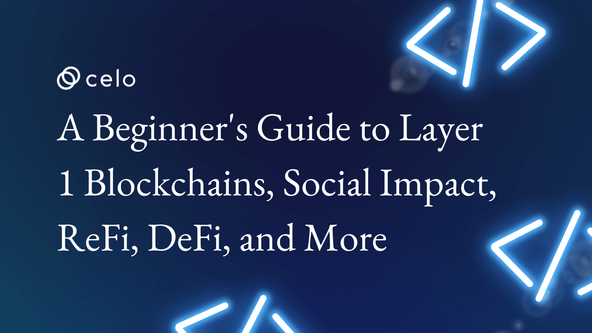

## Introduction

Blockchain technology has gained significant attention in recent years for its potential to revolutionize industries and change how we conduct transactions and exchange information. Blockchain technology can increase efficiency, reduce the risk of fraud, and give individuals and organizations greater control over their data.

Practitioners from various fields and sectors have participated in open debates on the disruptive potential of blockchain technology, and it has become more prevalent throughout the world of information and technology, hence being more than merely a platform for online payments.
This article will provide an overview of Layer 1 blockchains, DeFi, ReFi, social impact, and more. We will also explore some of the key concepts of Celo’s layer 1 blockchain, as well as some of the potential and use cases associated with blockchain technology and the ecosystem. By the end of this article, you will have a better understanding of Celo's main concepts and how it’s transforming the digital financial industry.

## Celo as a Layer 1 Blockchain

Celo Blockchain is a mobile-first blockchain that makes decentralized financial (DeFi) tools and services accessible to anyone with a mobile phone. Celo is a Layer 1 blockchain, a base blockchain or network where other scaling protocols within the ecosystem (layer 2 protocols) build their solutions to improve the scalability and transaction execution of the main chain.

A layer 1 blockchain, which makes up most of the blockchain, controls how scalable a project can be. The well-known examples of these layer 1s include Ethereum and Bitcoin.

## Celo’s Consensus

Celo uses a proof of stake(POS) consensus algorithm. This consensus mechanism ensures the security of a distributed database(blockchain), validating entries and adding new blocks to a blockchain. It also determines which nodes become validators and how incentives are arranged to secure the network.

The Celo blockchain uses a Byzantine Fault Tolerant (BFT) consensus mechanism. This is a well-defined set of validator nodes that broadcast messages between themselves in a sequence of steps to reach a final agreement. The network can handle up to 1/3rd of the validators being offline, faulty, or malicious. A quorum of validators must agree for a decision to be considered final.

In BFT consensus, validators build blocks by running transactions and verifying the blocks proposed by each other. This allows the network to deliver higher transaction throughput.

## Mobile Friendly and First

Celo is a mobile-first blockchain. It offers a fast light client protocol, a lightweight identity protocol that lets anyone on the network send crypto to phone numbers using the [Attestation system](https://docs.celo.org/protocol/identity/odis-domain). This feature lets you send payments to phone numbers even before the recipient has created the wallet.

With Web3 mainstream, Celo blockchain provides builders and developers a platform to build solutions to a market of over 6 billion smartphones in circulation, i.e., over 83% of the world’s population connected to the internet today. Celo being a mobile-first blockchain and having a family of a variety of native stable coins, e.g., cUSD, cEUR, cREAL, etc make cryptocurrencies user friendly, thereby enabling a new evolution of financial solutions accessible to mobile users in different communities hence a global financial ecosystem.

## ReFi

Based on this regenerative economics theory, regenerative finance(ReFi) was developed. ReFi's close ties to DeFi (decentralized finance).

Refi is a form of using money as a tool to solve systematic problems for the good of the community. Refi values money and wealth that often comes at the expense of people and the planet. In Refi, profits are used to replenish our planet’s ecosystems so that they can continue to support life and address our pressing social issues of justice and inequity.

Numerous communities are forming in the ReFi sector with the same goal of utilizing the blockchain (distributed ledger technology) to address sustainability issues, including climate change, biodiversity loss, resource scarcity, and the underlying socio-economic and institutional structures that exacerbate these crises.

Refi is an emerging key player in innovative climate finance, bridging cryptocurrency, climate action, and aligning incentives to enable millions of people to take climate action.

In Refi, carbon offsetting has been a major use case with the goal of reaching net zero. This kind of technology is enabling the rapid scaling of climate action required, with everyone participating using their computers to make meaningful action and be financially rewarded for it.

[Refi’s](http://medium.com/earthbanc) goal is to re-imagine and re-design money and the system it moves through.

## Refi Projects within the Ecosystem

- Wren. [Wren](https://www.wren.co/) is an approachable on-ramp to climate action. Wren is a platform for anyone who wants to tackle the climate crisis but isn’t sure where to start.

- Climate Collective. [Climate collective](https://climatecollective.org/) is an expanding coalition of companies building at the nexus of web3 and climate action.

- Flow Carbon. [Flow Carbon](https://www.flowcarbon.com/) is accelerating decarbonization through the preservation and protection of earth’s natural ecosystems, which are among the most immediate and cost-effective carbon sinks while investing in longer-term carbon removal and reduction projects.

- Moss. [Moss](http://moss.earth) is a climate tech with a common objective to combat climate change. Moss unites companies and people with the same goal. They simplify the offsetting process and guarantee the traceability and transparency of everything using blockchain technology.

- Wasset. [Wasset](http://wasset.io) is a blockchain protocol that incentivizes conscious waste management actions. Their efforts are to keep our planet safe and strive to solve global waste management issues from the ground up.

## Social Impact

Blockchain technology has the potential to significantly alter society in many ways. This kind of technology has promoted greater financial inclusion by providing financial services to underserved and unbanked communities and populations.

Blockchain technology has offered far-reaching possibilities for social impact in different sectors i.e., supply chain, digital identity, personal data protection, trust, and many more. Therefore, with blockchain technology’s ability to track, audit and access to publicly shared information, it’s possible to rebuild the gaps that have been established between centralized systems and the people they serve.

With the use of blockchain (trust-based and peer-to-peer systems), it has played a positive impact in different communities through the reduction of costs, eliminating borders, avoiding intermediaries, and providing [UBI](https://en.wikipedia.org/wiki/Universal_basic_income) to the end users, thereby changing the world in a better way than we know it.

## Blockchain use cases and examples for social impact

- Universal Basic Income(UBI). Blockchain technology has an impact on the implementation and how UBI is distributed and managed. One way blockchain technology can be used in UBI systems is by creating a decentralized digital currency that can be distributed to individuals as part of their basic income. This digital currency could be securely stored and managed on a blockchain platform, allowing individuals to easily access and use their basic income funds. [Impact Market](https://www.impactmarket.com/), one of the projects in the Celo ecosystem, is a human empowerment protocol that provides accessible financial solutions and knowledge to empower underprivileged people all over the world, unlocking opportunities and human potential.

- Digital identity. A digital identity is a unique set of identifying characteristics that an individual or entity can use to establish their online presence. Blockchain technology has replaced traditional systems with a highly trusted mechanism for managing identities. It can empower users to have greater control over their identity, and organizations can use the information only with customers’ consent, and no central entity would be able to compromise a consumer’s identity. Blockchain technology for digital identity can provide a high level of security, the ability to provide individuals and entities with greater control over their personal information additionally, blockchain-based digital identity systems can also provide greater convenience and efficiency.

- Supply chain Management.
  By offering a safe and transparent mechanism to track the flow of goods and materials, blockchain technology has the potential to significantly enhance supply chain management. By using a decentralized and distributed ledger, all parties in a supply chain can access and update information in real-time, allowing for greater visibility and accountability. This can help reduce the risk of fraud, errors, and inefficiencies, and enable more efficient and effective supply chain management. Additionally, many of the procedures and transactions involved in supply chain management can be automated and streamlined through smart contracts on a blockchain platform.

- Data Protection. Numerous approaches have been put in place using blockchain technology to enhance data security, for example, offering a high level of security for confidential data since it uses cryptography and decentralized networks to secure that kind of data. By doing so, malicious activities like tampering and illegal access to data can be reduced. Blockchain technology can replace traditional systems with a highly trusted mechanism for managing identities. It can empower users to have greater control over their own identity. Organizations can use the information only with customers’ consent. Blockchain technology can offer practical tools and capabilities for managing and protecting sensitive data.

## DeFi

DeFi (decentralized finance) is the use of blockchain technology and cryptocurrency to create decentralized financial instruments and applications. DeFi applications are built on top of blockchain networks and do not rely on traditional financial institutions for their operations.

DeFi has the potential to disrupt the financial industry by providing users with access to financial services that are more transparent, secure, and accessible than those offered by traditional financial institutions. DeFi applications are able to lend, borrow, stake, save, pay and accept and trade a variety of cryptocurrencies and stablecoins, and predict markets.

DeFi has challenged the traditional banking and financial solutions by eliminating service fee charges, third parties and central authorities or institutions. In this case, DeFi users can hold their assets or money in a secure digital wallet, and can trade their assets in a faster way with an internet connection.

## Why DeFi?

Defi has been increasingly utilized in different communities, and this has replaced human or institutional trust with blockchain technology, paperwork with smart contracts, third parties with open-source code, and public ledgers.
In centralized finance, becoming a market maker needs large capital of income hence being unbalanced for everyone. Therefore, this is dominated by large institutions providing liquidity and exchange or trading assets. However, DeFi solves this problem by allowing anyone with low capital or crypto assets to become a liquidity provider to certain pools and earn yields automatically. Examples of DeFi systems include [Uniswap](https://uniswap.org/), [Ubeswap](https://ubeswap.org/), [Moola Market](https://moola.market/), Revo, e.t.c

In DeFi, anyone can trade their assets without the need for KYC, credit score to represent the credit worth of an individual, and borrow against crypto collateral. Additionally, DeFi aims at providing crypto loans without trusting any third parties and this is executed by smart contracts on the blockchain.

## Importance of DeFi

- DeFi solutions are better, faster, cheaper, and more trustful compared to today’s financial services. The best example use case in the celo ecosystem is [Valora App](https://valoraapp.com/)

- Security and Transparency for everyone on the blockchain. You don't have to "open" an account or submit any information. By making a wallet, you can simply gain access.

- Accessibility for financial solutions is easy. Anyone with an internet connection can access DeFi platforms and make transactions without any restrictions and provision of KYC documents compared to the traditional banking system.

- Low fees and better interest rates that facilitate direct transactional negotiations between two parties using DeFi networks.

## Conclusion

Blockchain technology has the power to transform different sectors of the economy and extremely alter how we transact and share information. It has the capacity to boost productivity, lower the risk of fraud, and give people and organizations more control over their data by offering a safe and open platform for recording and verifying transactions.

The future of blockchain technology looks good, and it will be interesting to see how it continues to develop and be adopted in the upcoming years, even though the technology is still in its early phases and some issues need to be resolved.

Celo believes in a future where everyone can prosper and is on a mission to build a financial system that creates the conditions for prosperity for everyone.

## About the Author

A Software Developer, writer, community educator, and Country Ambassador at Celo Foundation. Connect with me on [Twitter](http://twitter.com/CodesUganda), and [LinkedIn](https://www.linkedin.com/in/mukundebrisa/)

## References

- [https://www.ncbi.nlm.nih.gov/pmc/articles/PMC8598042/](https://www.ncbi.nlm.nih.gov/pmc/articles/PMC8598042/)
- [https://docs.celo.org/general](https://docs.celo.org/general)
- [https://blog.celo.org/consensus-and-proof-of-stake-in-the-celo-protocol-3ff8eee331f6](https://blog.celo.org/consensus-and-proof-of-stake-in-the-celo-protocol-3ff8eee331f6)
- [https://docs.celo.org/protocol/identity/odis-domain](https://docs.celo.org/protocol/identity/odis-domain)
- [https://blog.celo.org/why-build-on-the-celo-blockchain-9ceab3d11b70](https://blog.celo.org/why-build-on-the-celo-blockchain-9ceab3d11b70)
- [http://medium.com/earthbanc](http://medium.com/earthbanc)
- [https://docs.impactmarket.com/](https://docs.impactmarket.com/)
- [https://www.nec.com/en/global/solutions/blockchain/blockchain-for-digital-identity.html](https://www.nec.com/en/global/solutions/blockchain/blockchain-for-digital-identity.html)
