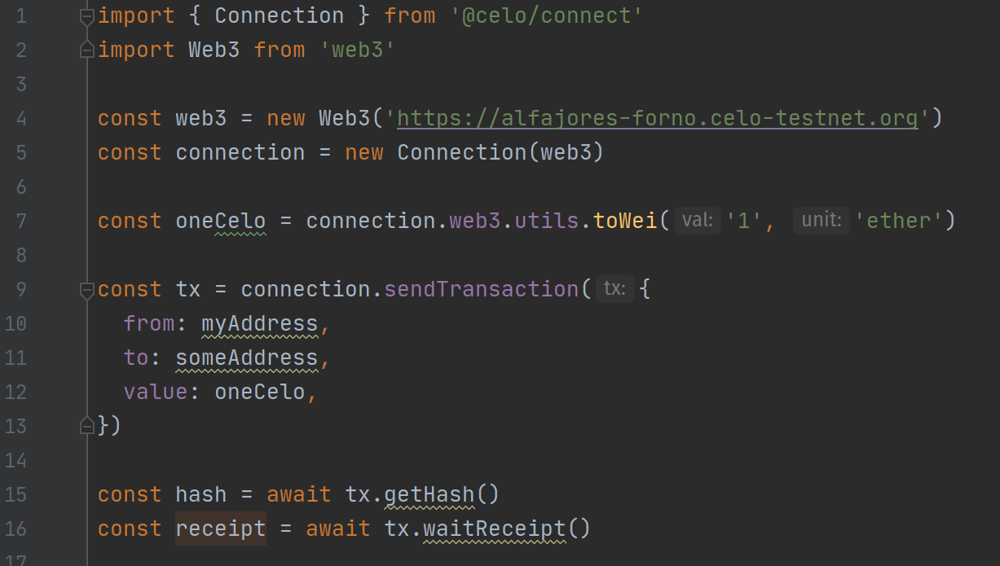
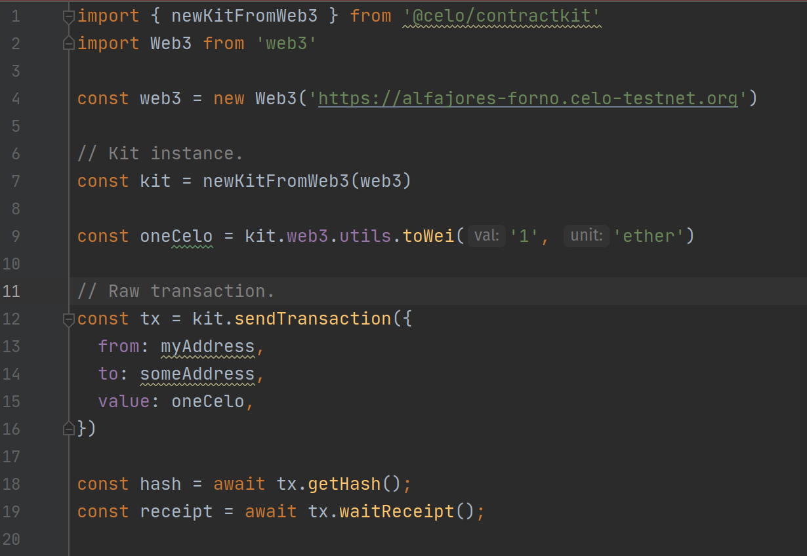
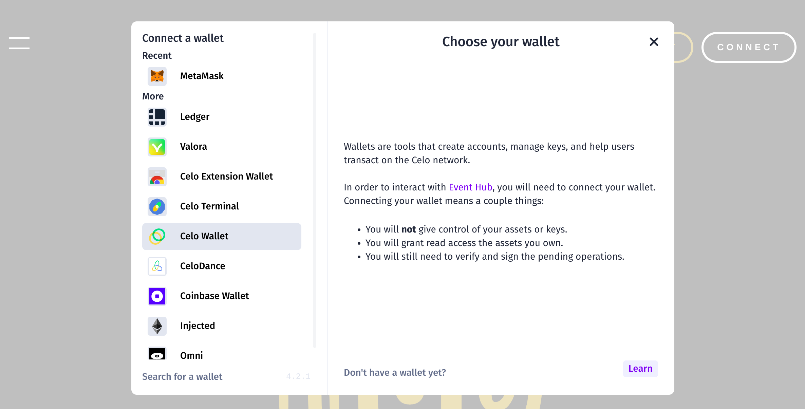
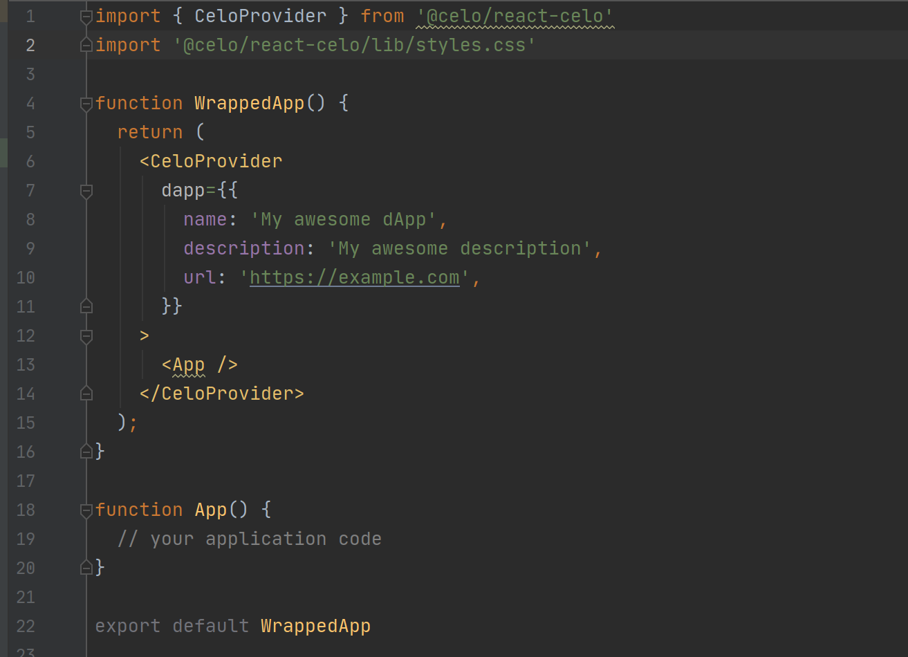
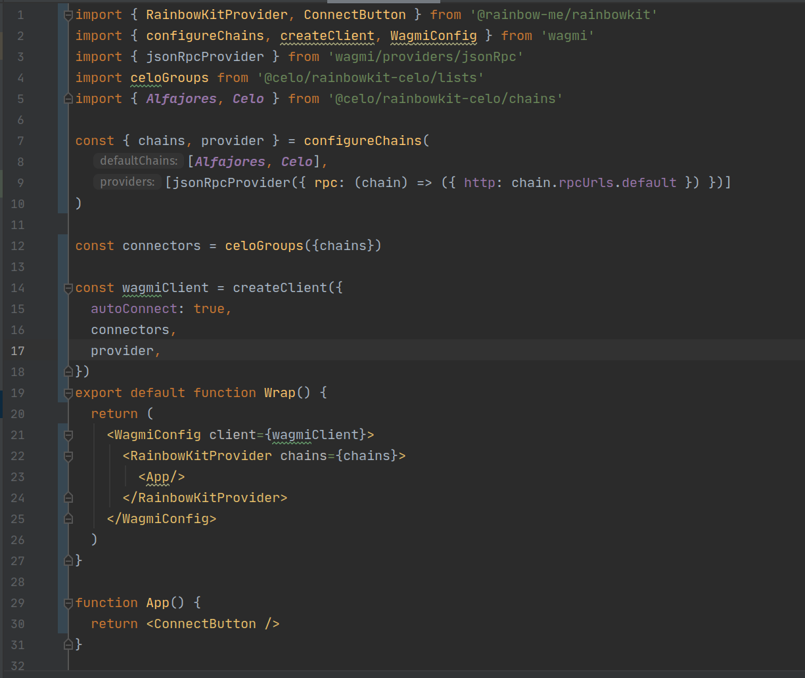
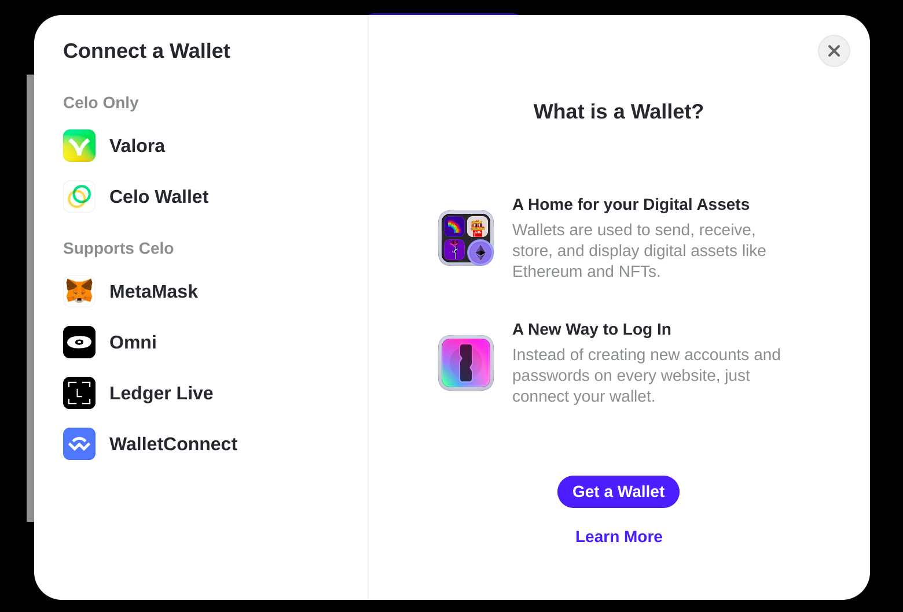
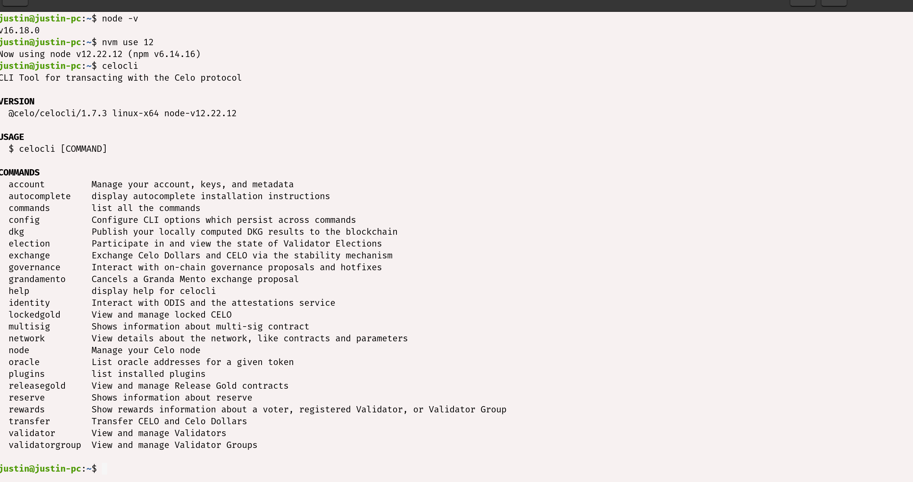
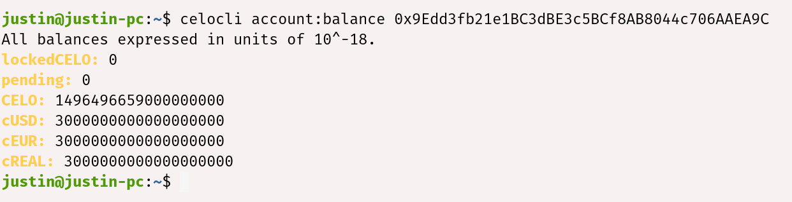

## Introduction

Every technology has its tools and tooling approach and blockchain networks are no different. For one that has decided to develop on the Celo blockchain, there are numerous tools available for potential Celo developers and those already developing on the Celo network to make their work easy.

A bad workman quarrels with his tools they say, getting acquainted with tools that would be highlighted here would ensure one is an authority at what he does. Moreso, you will be using the right tool for the job.

## Prerequisites

- You need basic programming knowledge
- Head over to [Celo docs](https://docs.celo.org/developer) to familiarize yourself with few concepts

## Requirements

- We'll need Metamask, install it from [HERE](https://metamask.io/).
- Node.js from V12. or higher.

## Celo Tools

Celo team has developed numerous SDKs, libraries and tools to enable both potential blockchain developers,
and those already working on the Celo network to have as many options as possible in choosing the right tools for development.
Appropriate usage of them helps us to avoid overkills in development and interaction processes.

## Celo Connect

Celo connect provides the most basic functionality needed to interact with Celo blockchain. For instance, if all you need is
sending and signing transactions or working without need to use Celo Contract Wrappers, Celo connect should be your go-to tool.

Sticking to the exact tool for a job ensures you comply with one of  the basics principles in programming - You Aren't Going to Need It. **(YAGNI)**

**Installation**

```js
npm install @celo/connect
```

**Basic Usage of @celo/connect**



## ContractKit

Contract Kit is a library designed to make Celo interaction very easy. It contains packages needed to interact on the Celo Network. It sets feeCurrency for a transaction, gives full access to Celo Contract Wrappers and much more unlike **@celo/connect**

**Installation**

```js
npm install @celo/contractkit
```

**Basic usage of @celo/contractkit**



## React Celo

React Celo library has done the heavy lifting for React developers. All the cool functionalities that are available in the _contractkit_ are exposed as React hooks via _useCelo_ and, also uses React Context Provider to have react-celo states available throughout your application.

If you just want to set up Celo in your React application without bordering on what is happening under the hood, _react-celo_ is the best bet. It is ideal for scaffolding Celo projects for a quick prototype and, also for production projects.

It is worth mentioning that it supports several wallets; Celo Dance, Celo Extension Wallet, Celo Terminal, Celo Wallet, Ledger,  MetaMask, Plaintext private key, Omni, Valora, WalletConnect.

Both Developer and User Experience are factored in by default. For instance, to get last connected account or account that has once connected to your dApp is now a breeze in _react-celo_.

Below, is the react-celo modal system for connecting to your user's wallet of choice.



**Installation**

```js
npm install @celo/react-celo @celo/contractkit
```

**Basic Usage of @celo/react-celo**



## Celo Composer

With Celo Composer, one can easily set up Celo on any of the popular front-end frameworks like; React, React Native, Flutter and Angular using CLI.

This tool is perfect for web2 developers trying to get started on the Celo blockchain.

**Installation**

```js
npm install @celo/celo-composer
```

**Basic Usage of @celo/celo-composer**

To get started, run ```npx @celo/celo-composer create```, you would be presented with stages of prompts to assist in scaffolding a front-end application of your choice alongside with Solidity development framework like; Hardhat and Truffle.

The directory structure looks like the image below. Inside the packages folder, is the front-end (react-app) and Solidity (hardhat) frameworks we chose to work with.


## Rainbowkit Celo

RainbowKit Celo is an offshoot from [Rainbowkit](https://www.rainbowkit.com/) library but for Celo blockchain. Intuitive, responsive and customizable features make it outstanding for Celo Developers.

It supports main CELO wallets (Valora, Celo Wallet, and Celo Terminal). Like React Celo, it is another option that allows Celo blockchain interaction faster using React.

**Installation**

```js
npm install @celo/rainbowkit-celo
```

**Basic Usage of @celo/rainbowkit-celo**



You should have an interface that looks like the one below after starting the app.



**Getting an error during package installation?**

If you are faced with error ```Could not resolve dependency```, try adding –legacy-peer-deps flag to your command e.g
```npm install rainbow-me/rainbowkit –legacy-peer-deps```

## Celo CLI

If you are the type of developer that is obsessed with Command Line, Celo community has not left you out,
```@celo/celocli``` to the rescue.

**Installation**

It is very important that you must have Node.js v12.x else it would not work. You can check this [tutorial](https://docs.celo.org/blog/tutorials/celo-cli-a-practical-guide-to-energize-your-celo-toolkit#introduction-to-the-celo-cli) on how to manage your Node version. After you have installed the appropriate Node version run:

```js
npm install -g @celo/celocli
```

to install it globally on your machine, or

```js
npm install @celo/celocli
```

to install it on your project directory, afterwards your run

```js
npx celocli
```

After successful installation, if you run `celocli`, you will see the list of the available commands.



**Basic Usage of @celo/celocli**

For a simple demonstration, I’m going to check my Celo testnet (Alfajores) account balance. First configure _celocli_ to work with Alfajores. You can do the same for any of the Celo networks.

```js
celocli config:set --node=https://alfajores-forno.celo-testnet.org
```

Then run

```js
celocli account:balance <enter your Celo wallet address here>
```

You will now have your Celo wallet balances listed like below.



To know more about the account module run

```js
celocli account
```

It will list all the available options for _account_. Same goes for other modules.

## Conclusion

One should be free from a trial and error approach as regards making decisions on the correct Celo tool to use on one’s project.

We were able to see Celo tools briefly. Head over to [Celo docs](https://docs.celo.org/) to see more of the developer tools, libraries, and SDKs.

## About the Author

A software engineer, co-founder, Africinnovate and a Web3 enthusiast. I used to call myself VueDetective. Connect with me on [LinkedIn](https://linkedin.com/in/cjustinobi) and
[Github](https://github.com/cjustinobi)

## References

[https://docs.celo.org/developer](https://docs.celo.org/developer)
