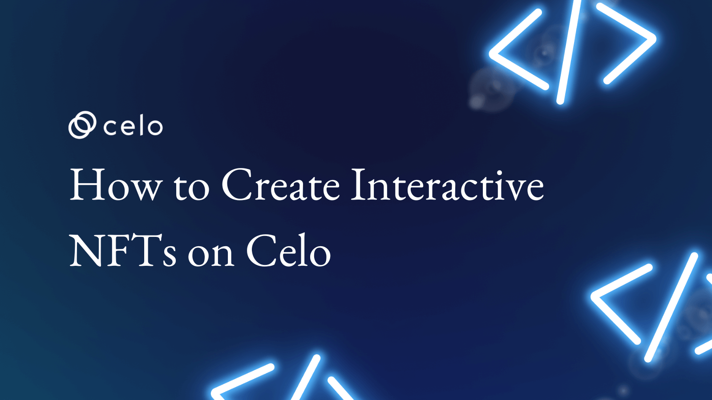

## Introduction​

NFTs have taken the market by storm, and the industry is now whopping billions of dollars.
NFT is not a new concept. The concept first came into existence in 2014 with the launch of Quantum. A non-fungible token was created back then.

Later in 2020, NFT became a hot topic, and everyone was talking about it, and their market grew by $250 million. Since then, sales of NFTs have sky-rocketed.

## Prerequisites​

- Prior knowledge of Solidity is required.
- Prior knowledge of HTML, CSS, and JavaScript is required.
- Knowledge of ERC-721, ERC-1155 specification is required.
- Knowledge of how to deploy smart contracts via Remix.

## Requirements

- Remix IDE to write smart contract.
- Knowledge of HTML, CSS, and JavaScript to code the frontend so we can interact with the smart contract to create an NFT.

## So what is an NFT?

A non-fungible token or NFT is a permanent record in blockchain linked to a digital or physical asset. For example, if I have a unique image and insert its location inside the token, that piece is called a non-fungible token.

But first, we need to understand what “fungible” means.

A “fungible” item is replaceable with a similar item bearing the same value; that means every fungible item has the same utility and intrinsic value. An example of this would be a $10 bill that can be used to replace any other $10 bill—you can swap your $10 bill with your friend’s without actually causing its value to dip. However, if you have a $10 bill that some celebrity has signed or a unique serial number like all eights, it could be worth up to $1,000 or even more. Why so? Because a mere celebrity autograph can make a regular $10 bill rare, special, and hence, non-fungible.

## The difference between ERC-721 and ERC-1155

ERC-721 and ERC-1155 are both Ethereum smart contract standards for creating tokens on the Ethereum blockchain. The main difference between the two standards is how they handle multiple tokens' creation and management.

ERC-721 is a standard for creating non-fungible tokens, unique tokens representing a one-of-a-kind item or asset. Each ERC-721 token is distinct and cannot be replaced or interchanged with another.

On the other hand, ERC-1155 is a standard for creating both fungible and non-fungible tokens. This means ERC-1155 tokens can represent either unique or interchangeable items, such as cryptocurrencies. The ERC-1155 standard allows for creating and managing multiple types of tokens within a single, smart contract, making it more efficient and cost-effective than using multiple contracts for different types of tokens.

The main difference between ERC-721 and ERC-1155 is that ERC-721 is specifically for non-fungible tokens, while ERC-1155 can be used for both non-fungible and fungible tokens.

## Limitations of NFT

When we talk about NFTs, we think about some monkey picture, but that’s not about it. Any digital art can be made NFT. Right now, NFTs are all about static art files. A static file is stored in decentralized storage like IPFS, and its hash is stored inside a smart contract. A hash is a metadata for minted NFT. It contains different attributes for the art file.

This is what the ERC721 Metadata JSON Schema looks like:

```js
{
  "title": "Asset Metadata",
  "type": "object",
  "properties": {
  "name": {
    "type": "string",
    "description": "Identifies the asset to which this NFT represents"
  },
  "description": {
    "type": "string",
    "description": "Describes the asset to which this NFT represents"
  },
  "image": {
    "type": "string",
    "description": "A URI pointing to a resource with mime type image/* representing the asset to which this NFT represents. Consider making any images at a width between 320 and 1080 pixels and aspect ratio between 1.91:1 and 4:5 inclusive."
  }
  }
}
```

Both image and metadata might be stored inside IPFS.

Right now, all we have is a digital file. We can see, listen to, and trade it, but we can’t interact with it, and they can’t interact with each other.

This is where NFTs are limited in capabilities. They are static, not dynamic. They can’t interact with Humans or other NFTs.

## Interactive NFTs

Interactive NFTs are the NFTs with which you can interact. We have these traditional NFTs with which you can’t interact. You can see, hear, and view it but can’t interact with it.
With interactive NFTs, you can also change the smart contract's state.
In this tutorial, we won’t be changing the smart contract's state, but we will be able to interact with it.

## Enough talking. Show me the code

In the interactive NFT, we have two parts. One is the smart contract. Another one is the Metadata of the NFT. We will hack the metadata to make our NFT interactive.

This tutorial will create an NFT that will flip the value.

Let's get started.

First, we need to create an ERC-721 contract.

Here is the code.

```js
// SPDX-License-Identifier: MIT
pragma solidity ^0.8.4;

import "@openzeppelin/contracts/token/ERC721/ERC721.sol";
import "@openzeppelin/contracts/token/ERC721/extensions/ERC721URIStorage.sol";
import "@openzeppelin/contracts/access/Ownable.sol";
import "@openzeppelin/contracts/utils/Counters.sol";

contract MyNFT0 is ERC721, ERC721URIStorage, Ownable {
  using Counters for Counters.Counter;
  Counters.Counter private _tokenIdCounter;

  constructor() ERC721("MyNFT0", "MNFT0") {}

  function _baseURI() internal pure override returns (string memory) {
    return "https://ipfs.filebase.io/ipfs/";
  }

  function supportsInterface(bytes4 interfaceId)
    public view virtual override(ERC721) 
    returns (bool) {
    return super.supportsInterface(interfaceId);
  }

  function mintNFT(address to, string memory uri) public onlyOwner {
    _tokenIdCounter.increment();
    uint256 tokenId = _tokenIdCounter.current();
    _safeMint(to, tokenId);
    _setTokenURI(tokenId, uri);
  }


  // The following functions are overrides required by Solidity.

  function _burn(uint256 tokenId) internal override(ERC721, ERC721URIStorage) {
    super._burn(tokenId);
  }

  function tokenURI(uint256 tokenId)
    public
    view
    override(ERC721, ERC721URIStorage)
    returns (string memory)
  {
    return super.tokenURI(tokenId);
  }
}
```

Go ahead and paste this code. I will explain what every line does.

```js
// SPDX-License-Identifier: MIT
```

This tells the license of the smart contract. In our case, it is MIT license.

```js
import "@openzeppelin/contracts/token/ERC721/ERC721.sol";
import "@openzeppelin/contracts/token/ERC721/extensions/ERC721URIStorage.sol";
import "@openzeppelin/contracts/access/Ownable.sol";
import "@openzeppelin/contracts/utils/Counters.sol";
```

We are importing a couple of openzeppelin smart contracts such as [ERC721](https://docs.openzeppelin.com/contracts/4.x/erc721), [ERC721URIStorage](https://docs.openzeppelin.com/contracts/4.x/api/token/erc721), [Ownable](https://docs.openzeppelin.com/contracts/2.x/access-control), and [Counters](https://docs.openzeppelin.com/contracts/3.x/api/utils).

**ERC721**: We are importing the ERC721 smart contract because we need to use the functionality of the ERC721 contract, and MyNFT0 is an ERC721 contract.

**ERC721URIStorage**: ERC721URIStorage extension provides storage for token URIs which means that URIs are stored on-chain. Without this extension, URIs are NOT going to be stored on-chain.

**Ownable**: Our smart contract also inherits Ownable, which means that few functions are meant to be called by the owner only.

**Counters**: Provides counters that can only be incremented, decremented, or reset. This can be used, e.g., to track the number of elements in a mapping, issue ERC721 ids, or count request ids.

```js
contract MyNFT0 is ERC721, ERC721URIStorage, Ownable {}
```

This line means that the contract name is `MyNFT` which is inheriting `ERC721`, `ERC721URIStorage`, `Ownable`.

```js
using Counters for Counters.Counter;
Counters.Counter private _tokenIdCounter;
```

Here, we assign `_tokenIdCounter` of type `Counters.Counter`. It is a private variable. It is used to track how many NFTs are being minted. In a case when NFT gets minted, `_tokenIdCounter` is incremented. In case a token is burned, `_tokenIdCounter` is decremented.

```js
constructor() ERC721("MyNFT0", "MNFT0") {}
```

A constructor is a special function that is called when a smart contract is initialized. It is only called one time. In the constructor, the `ERC721` contract is initialized with two arguments, token name and token id.

```js
function _baseURI() internal pure override returns (string memory) {
    return "https://ipfs.filebase.io/ipfs/";
  }
```

`_baseURI()` function returns the URI. In our case, URI is pointing toward the IPFS domain name.

```js
function supportsInterface(bytes4 interfaceId)
    public view virtual override(ERC721) 
    returns (bool) {
    return super.supportsInterface(interfaceId);
  }
```

Returns true if this contract implements the interface defined by `interfaceId`.

```js
function mintNFT(address to, string memory uri) public onlyOwner {
    _tokenIdCounter.increment();
    uint256 tokenId = _tokenIdCounter.current();
    _safeMint(to, tokenId);
    _setTokenURI(tokenId, uri);
  }
```

`mintNFT()` function is used to mint an NFT. It takes two arguments, an address and an IPFS hash.
It can either be called only by the owner can be called by anyone. In our case, only the owner can call the mintNFT function. This function is public in nature.

It increments `_tokenIdCounter`.
`tokenId` becomes the current count of `_tokenIdCounter`.
It calls the `_safeMint()` function with two arguments, address `to` and `tokenId`.
It sets the `tokenId` to the IPFS hash.

```js
function _burn(uint256 tokenId) internal override(ERC721, ERC721URIStorage) {
    super._burn(tokenId);
  }
```

`_burn()` is used to destroy the NFT token. It takes `tokenId` as an argument. It does not return anything.

```js
function tokenURI(uint256 tokenId)
    public
    view
    override(ERC721, ERC721URIStorage)
    returns (string memory)
  {
    return super.tokenURI(tokenId);
  }
}
```

`tokenURI()` function returns the IPFS hash. It takes `tokenId`.

After we code our ERC-721 contract, it is time to make an NFT interactive.

Since we cannot make changes in our smart contract to make our NFT interactive otherwise, it won't be called an ERC-721 contract. We need to make changes to our NFT Metadata. This time we will be extending our NFT metadata that will point to JavaScript code.

Inside the IPFS, we will be pushing NFT Metadata, and JavaScript code to make our NFT interactive.

Please note that our interactive NFTs won’t work with existing NFT platforms like OpenSea, Rarible, etc, since they won't understand our NFT Metadata file.

We need to code our frontend to make it work.

It’s time to define our Metadata.

```js
{
  "title": "MyNFT0",
  "type": "object",
  "properties": {
    "name": {
      "type": "string",
      "description": "MyNFT0"
    },
    "description": {
      "type": "string",
      "description": "This is an interactive NFT."
    },
    "image": {
      "type": "string",
      "description": ""
    },
    "js": {
      "type": "string",
      "description": "QmUS8szs3GkafJPLXQjjJe19xUyeSeUWiQLSmJKW1EorXc
"
    }
  }
}
```

Here we are extending ERC-721 metadata and including the JavaScript code that will be executed to make an NFT interactive.

First, we must upload an image and js code file in IPFS. To do that, I am using <https://filebase.com>

You need to upload the following JS code in the IPFS.

```js
function flip () {
  return true || false;
}
```

Once you store it, copy its IPFS hash and paste it inside the description of js inside the `metadata.json` file.
In the end, you need to upload the metadata file.
Once you upload all these two things, your filebase dashboard will look something like this.


Now go to <https://remix.ethereum.org> and paste the smart contract code I have already provided.

Deploy the smart contract in the `VM` as of now. Once you deploy it, go to the approve tab and give your wallet address in the to field and copy the IPFS hash of the `metadata.json` file from filebase dashboard.

If you call the `tokenURI` function from remix with tokenId 1, you will see it is returning the full URL of the metadata.json file.

You may go ahead and deploy the smart contract to the **CELO** testnet if you want.

Now it’s time to code the frontend part.We will be using plain HTML, CSS, JavaScript, and Bootstrap for this.

Here is the repository: <https://github.com/avirajkhare00/celo-interactive-nft-tutorial>

Clone this repository and run this code. You may run this code by serving the file via any http server.

If Python 3 is installed on your machine, you can execute the following command: `python3 -m http.server`

Here is the doc for http server: ​​<https://docs.python.org/3/library/http.server.html>

Let’s try to understand what frontend JS code is doing.

```js
const MyNFT0ContractAddress = "0xC1A6E6C2FDBd58d8AE952e3888E18B231cBc48f1";

const MyNFT0Contract = new web3.eth.Contract(MyNFT0ABI, MyNFT0ContractAddress);

async function getResult() {
  let result = await MyNFT0Contract.methods.tokenURI(2).call();
  console.log(result);

  fetch(result)
    .then(response => response.json())
    .then(data => {
      console.log(data);
      console.log(data.properties.js.description);
      let jsCodeHash = data.properties.js.description;
      let baseURL = 'https://ipfs.filebase.io/ipfs/';

      fetch(baseURL + jsCodeHash)
      .then(response => response.text())
      .then(data => {
        eval(data);
        console.log(flip());
        document.getElementById('flipBtn').onclick = () => {
          document.getElementById('flipValue').innerText = flip().toString();
              };
            });
        });
    };

getResult();
```

Basically we have stored the JS code inside the IPFS.
Once we fetch the JS code from the IPFS, we are calling the eval() function to execute that code since it came in the form of a string.

We can see that if you click on the `Flip` button, it will return you either true or false. This is a very basic example of dynamic NFT.

In the end, it will look something like this:


## Conclusion

Go ahead and create an NFT game, I might try to make a tutorial on NFT games that will be dynamic in nature.

## Next Steps

Create a simple game in the form of dynamic NFT.

## About the author

Aviraj Khare: Into web3 space since 2016.
GitHub: <https://github.com/avirajkhare00>

## References

- <https://docs.celo.org/>
