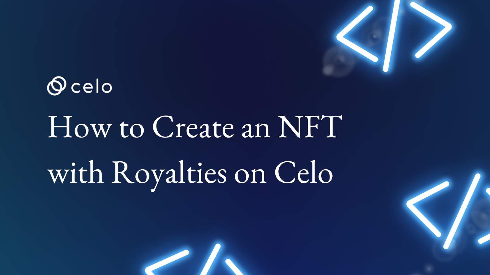

## Introduction

NFTs have taken the market by storm, and the industry is now whopping billions of dollars.
NFT is not a new concept. The concept first came into existence in 2014 with the launch of Quantum. A non-fungible token was created back then.

Later in 2020, NFT became a hot topic, and everyone was talking about it, and their market grew by $250 million. Since then, sales of NFTs have sky-rocketed.

In this tutorial we will learn to create an NFT with royalties. I will show you how to mint them in the UI and transfer it to another address from Rarible. Once you transfer from Rarible, you will see a small percentage of CELO gets transferred which is Royalty.

So let's get started...

## Prerequisites​

- Prior knowledge of Solidity is required.
- Prior knowledge of HTML, CSS, and JavaScript is required.
- Knowledge of ERC-721 specification is required.
- Knowledge of how to deploy smart contracts via Remix.

## Requirements

- Remix IDE to write smart contract.
- Knowledge of HTML, CSS, and JavaScript to code the frontend so we can interact with the smart contract to create an NFT with Royalty.

## So what is an NFT?

A non-fungible token or NFT is a permanent record in blockchain linked to a digital or physical asset. For example, if I have a unique image and insert its location inside the token, that piece is called a non-fungible token.

But first, we need to understand what “fungible” means.

A “fungible” item is replaceable with a similar item bearing the same value; that means every fungible item has the same utility and intrinsic value. An example of this would be a $10 bill that can be used to replace any other $10 bill—you can swap your $10 bill with your friend’s without actually causing its value to dip. However, if you have a $10 bill that some celebrity has signed or a unique serial number like all eights, it could be worth up to $1,000 or even more. Why so? Because a mere celebrity autograph can make a regular $10 bill rare, special, and hence, non-fungible.

## Why do we need royalty in an NFT?

First, I want to explain what Royalty is?

NFT royalties are payouts that compensate the original creator every time a secondary sale of their digital asset occurs. The royalty percentage is set by the creator at the time of minting, commonly around 5-10%. This percentage is taken from the sale price and sent to the creator.

## Enough talking, show me the code

So we are going to code two smart contracts this time.

1. **NFTMinter:** It will be used to mint NFT and users will also pay using CELO via this smart contract. Only this smart contract will be able to mint an NFT.

2. **MyNFT:** This smart contract will inherit ERC-2981, ERC-721 along with others.

Let's code `MyNFT.sol` first.

Below is the smart contract, I will paste the entire code first, then I will go line-by-line to tell you what it does.

```js
// SPDX-License-Identifier: MIT
pragma solidity ^0.8.0;

import "@openzeppelin/contracts/token/common/ERC2981.sol";
import "@openzeppelin/contracts/token/ERC721/extensions/ERC721URIStorage.sol";
import "@openzeppelin/contracts/access/Ownable.sol";
import "@openzeppelin/contracts/utils/Counters.sol";

contract MyNFT is ERC721URIStorage, ERC2981, Ownable {
  using Counters for Counters.Counter;
  Counters.Counter private _tokenIds;

  constructor() ERC721("MyNFT", "MN0") {
    _setDefaultRoyalty(msg.sender, 200);
  }

  function _baseURI() internal pure override returns (string memory) {
        return "https://ipfs.filebase.io/ipfs/";
    }

  function supportsInterface(bytes4 interfaceId)
    public view virtual override(ERC721, ERC2981)
    returns (bool) {
      return super.supportsInterface(interfaceId);
  }

  function _burn(uint256 tokenId) internal virtual override {
    super._burn(tokenId);
    _resetTokenRoyalty(tokenId);
  }

  function burnNFT(uint256 tokenId)
    public onlyOwner {
      _burn(tokenId);
  }

  function mintNFT(address recipient, string memory tokenURI)
    public onlyOwner
    returns (uint256) {
      _tokenIds.increment();

      uint256 newItemId = _tokenIds.current();
      _safeMint(recipient, newItemId);
      _setTokenURI(newItemId, tokenURI);

      return newItemId;
  }

  function mintNFTWithRoyalty(address recipient, string memory tokenURI, address royaltyReceiver, uint96 feeNumerator)
    public onlyOwner
    returns (uint256) {
      uint256 tokenId = mintNFT(recipient, tokenURI);
      _setTokenRoyalty(tokenId, royaltyReceiver, feeNumerator);

      return tokenId;
  }
}
```

```js
// SPDX-License-Identifier: MIT
```

This represents license, in this case, it is MIT license.

```js
pragma solidity ^0.8.0;
```

This line represents solidity version, in our case, we are using version greater then `0.8.0`.

```js
import "@openzeppelin/contracts/token/common/ERC2981.sol";
import "@openzeppelin/contracts/token/ERC721/extensions/ERC721URIStorage.sol";
import "@openzeppelin/contracts/access/Ownable.sol";
import "@openzeppelin/contracts/utils/Counters.sol";
```

Here, we are importing couple of libraries. Below I will tell you what each library does.

- **ERC2981:** Implementation of the NFT Royalty Standard, a standardized way to retrieve royalty payment information.
- **ERC721URIStorage:** ERC721 token with storage based token URI management.
- **Ownable:** Contract module which provides a basic access control mechanism, where there is an account (an owner) that can be granted exclusive access to specific functions.
- **Counters:** Provides counters that can only be incremented, decremented or reset. This can be used e.g. to track the number of elements in a mapping, issuing ERC721 ids, or counting request ids.

 ```js
contract MyNFT is ERC721URIStorage, ERC2981, Ownable {}
 ```

 Here, we are defining `MyNFT` contract which inherits `ERC721URIStorage`, `ERC2981` and `Ownable`.

```js
using Counters for Counters.Counter;
  Counters.Counter private _tokenIds;
```

`_tokenIds` variable is getting initialized, it's type is `Counters.Counter` and it has private scope.

```js
  constructor() ERC721("MyNFT", "MN0") {
    _setDefaultRoyalty(msg.sender, 200);
  }
```

Here we are calling constructor function. It is a special function. It only runs once, it will only run at the time of initialization of smart contract.

Here, `ERC721` is taking two arguments, NFT name and NFT symbol. We are also calling one more function, `_setDefaultRoyalty()`. It takes owner address and percentage we wish to set for royalty. In our case, we did set **2%** royalty.

```js
function _baseURI() internal pure override returns (string memory) {
        return "https://ipfs.filebase.io/ipfs/";
    }
```

`_baseURI()` returns the base URI, we did setup our base URI to <https://ipfs.filebase.io/ipfs>.

```js
function supportsInterface(bytes4 interfaceId)
    public view virtual override(ERC721, ERC2981)
    returns (bool) {
      return super.supportsInterface(interfaceId);
  }
```

Returns true if this contract implements the interface defined by `interfaceId`.

```js
function _burn(uint256 tokenId) internal virtual override {
    super._burn(tokenId);
    _resetTokenRoyalty(tokenId);
  }

function burnNFT(uint256 tokenId)
    public onlyOwner {
      _burn(tokenId);
  }
```

These two functions are used to burn an NFT by giving a `tokenId`. It also reset the token royalty for a given NFT.

```js
function mintNFT(address recipient, string memory tokenURI)
    public onlyOwner
    returns (uint256) {
      _tokenIds.increment();

      uint256 newItemId = _tokenIds.current();
      _safeMint(recipient, newItemId);
      _setTokenURI(newItemId, tokenURI);

      return newItemId;
  }

function mintNFTWithRoyalty(address recipient, string memory tokenURI, address royaltyReceiver, uint96 feeNumerator)
    public onlyOwner
    returns (uint256) {
      uint256 tokenId = mintNFT(recipient, tokenURI);
      _setTokenRoyalty(tokenId, royaltyReceiver, feeNumerator);

      return tokenId;
  }
```

Here we have two functions. In our NFTMinter smart contract, we will call `mintNFTWithRoyalty()` function. This function takes `recipient`, `tokenURI`, `royaltyReceiver` and `feeNumerator`.

- `recipient` takes an address whose NFT we need to mint.
- `tokenURI` contains IPFS hash of an image.
- `royaltyReceiver` takes an address where we do need to send the royalty.
- `feeNumerator` takes an integer, here we decide how much royalty do we need to send to the creator.

Now comes our second smart contract. `NFTMinter.sol`. Below is the code.

```js
// SPDX-License-Identifier: MIT
pragma solidity ^0.8.4;

import './MyNFT.sol';

contract NFTMinter {

    address public owner;
    uint256 public basePrice;
    address public MyNFTContractAddress;

    // modifiers
    modifier onlyOwner() {
        require(msg.sender == owner, "Ownable: caller is not the owner");
        _;
    }

    constructor() {
        owner = msg.sender;
        basePrice = 1000000000000000; // this is 0.001 CELO
    }

    // function to add or update nft smart contract address
    function updateMyNFTContractAddress(address _address) public onlyOwner {
        MyNFTContractAddress = _address;
    }

    // function that calls the mint function. Anyone can call this function.
    function mintNft(address _toAddress, string memory _uri) public payable {
        
        if(msg.sender != owner) {
            require(msg.value >= basePrice, "Not enought ETH sent");

            (bool sent, bytes memory data) = owner.call{value: msg.value}("");
            require(sent, "Failed to send CELO");
        }

        MyNFT my_nft = MyNFT(MyNFTContractAddress);
        my_nft.mintNFTWithRoyalty(_toAddress, _uri, owner, 2500);
    }
}
```

Here, we are creating `NFTMinter` contract.

```js
address public owner;
uint256 public basePrice;
address public MyNFTContractAddress;
```

We have defined three variables here.

- `owner`: holds owner address. One who instantiate smart contract becomes an owner.
- `basePrice`: Price at which we are minting the NFT.
- `MyNFTContractAddress`: It holds contract address of `MyNFT` smart contract.

```js
modifier onlyOwner() {
    require(msg.sender == owner, "Ownable: caller is not the owner");
    _;
}
```

`onlyOwner()` is a modifier. If we add this modifier in a function, it can only be called by the owner.

```js
constructor() {
    owner = msg.sender;
    basePrice = 1000000000000000; // this is 0.001 CELO
}
```

In the constructor, we are assigning `owner` as `msg.sender`, it is a special type of variable. It contains address of a person who invoked the contract. Also, we are assigning `basePrice` in terms of wei. When converted to CELO, it is 0.001 CELO.

```js
function updateMyNFTContractAddress(address _address) public onlyOwner {
    MyNFTContractAddress = _address;
}
```

This function updates `MyNFTContractAddress` variable. It can only be called by owner.

```js
function mintNft(address _toAddress, string memory _uri) public payable {
        
    if(msg.sender != owner) {
        require(msg.value >= basePrice, "Not enought CELO sent");

        (bool sent, bytes memory data) = owner.call{value: msg.value}("");
        require(sent, "Failed to send CELO");
    }

    MyNFT my_nft = MyNFT(MyNFTContractAddress);
    my_nft.mintNFTWithRoyalty(_toAddress, _uri, owner, 2500);
}
```

`mintNft()` is a special type of function. It is a payable function. Anyone can call this function. `Owner` can mint NFT without sending `CELO`.

First, it checks weather function invoker is owner or not. If invoker is an owner, then it directly mints an NFT.

If person is not an owner, it checks if CELO sent greater then or equal to `basePrice`, if not, contract will revert back.

If enough CELO is sent, it transfer CELO to the owner, then it mints NFT for the given address.

I have checked in both smart contracts and frontend here: <https://github.com/avirajkhare00/celo-blogs/tree/main/nft-with-royalty>.

It's time to code frontend part.

We are going to create a very basic frontend. You can mint NFT by clicking a button.

This is how frontend will look like:


I have already uploaded an image to IPFS, here is the hash: `QmWwtPHgG6G2679oNA9nMxuXeARjYrmVaaBHEDbr9pMg4E`

When we will be minting the NFT, you can use this or insert an image of your choice. You can use <https://filebase.com> to upload an image to IPFS.

Since Rarible does not support Celo Testnet, I will be using goreli testnet to show you how royalty is transferred.

Go ahead and run the frontend code by using any http server. Mint an NFT, then go to Rarible testnet here: <https://testnet.rarible.com/>.

You can see that your NFT is getting displayed, now put it on sale for whatever amount you wish for.

Now ask your friend or choose another wallet and purchase the NFT.

Check for Etherscan transactions. You will see that `0.001` ether went to the address who minted NFT and 2.0 % went to the creater of the NFT.

Check the screenshot below:


Congrats, you just learnt how to create an NFT having royalty.

## About the author

Aviraj Khare: Into web3 space since 2016.
GitHub: <https://github.com/avirajkhare00>

## References

- <https://docs.celo.org/>
- <https://rarible.com>
