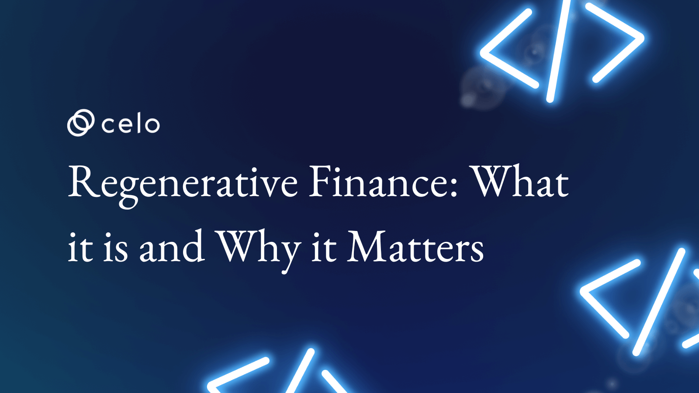
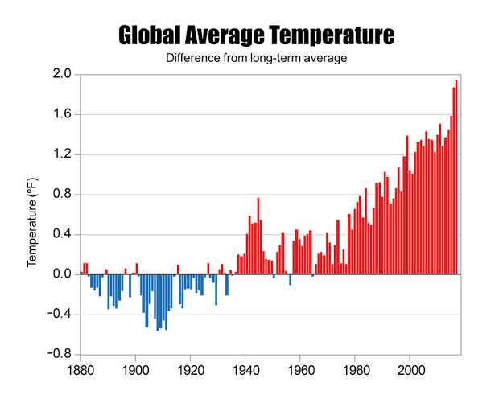
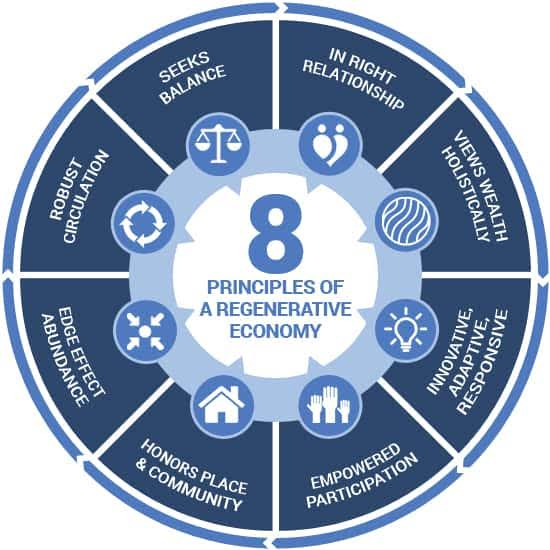
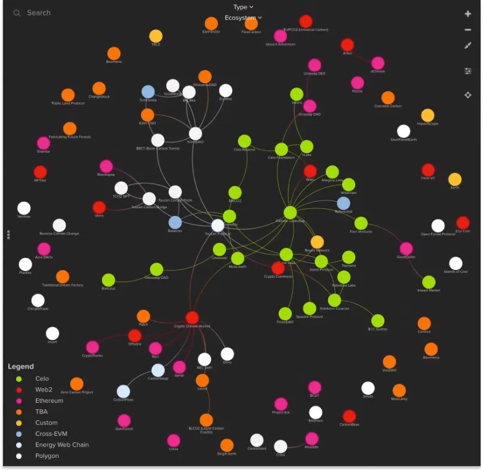

## Introduction

The current traditional financial methods are too limited to offer needed solutions to current systemic problems like global warming. Hence, the increasing integration and incentivization of environmental, social, and governance (ESG) measures in financial decisions is a step in the right direction. This ideal is what ReFi and the Celo blockchain platform represent.

*P.S: The primary focus is on tackling unfavorable effects in [these areas.](https://www.c2es.org/content/changes-in-climate/)*

## Prerequisites

In this article, we'll look into the financial protocol behind the Celo blockchain, the 'how' and the 'helps.' It will help if you get familiar with the Celo blockchain before reading, as the knowledge will help you contextualize and understand better.

## Requirements

Follow the links for video explainers on the working of the Celo blockchain economy and the ReFi system:

- [https://youtube.com/@CeloOrg](https://youtube.com/@CeloOrg)
- [https://www.youtube.com/watch?v=6s1O_s9pZW4](https://www.youtube.com/watch?v=6s1O_s9pZW4)

## Regenerative Finance and Celo: The Process and Partnership

### What is ReFi?

Regenerative Finance, or "ReFi," is a financial model that incentivizes community actions toward solving systemic issues like global warming, waste management, etc. Rooted in the principles of regenerative economics, this new financial system motivates individuals through platforms like the Celo blockchain. Platforms like Celo allow individuals to generate an income by working on and funding projects for the public good.

By ‘financing good deeds,’ ReFi offers an advancement to the traditional system that benefits those who pursue their interests. And with several blockchain projects like the Celo blockchain offering technology with ReFi ideals, the future looks bright.

### The ReFi Process

ReFi is a thorough process that pays attention to the interconnected nature of the causes and consequences of these ‘good deeds.’ Also, the ReFi process sees to the equitable distribution of capital. This is possible by eliminating repayment terms and collateral conditions that drain resources from communities.

For an effective process, ReFi adjusts exclusionary credit criteria, engages core stakeholders in the decision-making process, and rebalances the hierarchies of economic control.

Beyond the transactional aspects, ReFi also pays attention to the existing relationships. With these relationships, regenerative finance ensures the effectiveness of its other features.

### Introducing Celo: A Real-Life ReFi Use Case

The next generation of the internet, [Web3,](https://www.coindesk.com/learn/what-is-web-3-and-why-is-everyone-talking-about-it/) relies heavily on the implementation of decentralized financial protocols. However, one obstacle in the way of most businesses is the distribution of DeFi initiatives to a broader range of end users.

Then comes the Celo project as a blockchain ecosystem that works to connect crypto users to smartphone users. With the EVM (Ethereum Virtual Machine) developed for mobile users, the Celo blockchain platform guarantees affordable transition fees that anyone can pay using stablecoins or tokens.

Following the Celo project's main net launch in 2020, Celo users can now send money to any recipient straight from their mobile devices thanks to a decentralized network and digital contracts.

The Celo blockchain platform leverages phone numbers as public keys and creates a native stable-value token ($cUSD) to rid the obstacles to crypto-assets adoption.

Lastly, the Celo decentralized network encourages the creation of decentralized apps and smart contracts. And through the Celo Wallet, Celo delivers a mobile-focused social payment system.

### Celo and ReFi: A Partnership for the Society

As an application of ReFi, Celo is an ecologically friendly platform as it utilizes the POS consensus mechanism throughout its setup. At the core of the Celo framework is the vision to create a prosperous world for everyone. To achieve this vision, the Celo platform writes a new page in the money narrative with ReFi ideals.

- Propelling Societal Prosperity

The implementation of ReFi ideals through the Celo platform eliminates the power of the invisible hand on society. Now, there's a self-sustaining engine to power the common good through a global financial system that serves as a prosperity propeller.

- Supporting Societal Good

According to Charles Eisenstein in the book Sacred Economics, *"If you back the money with more of the things you wish to see in the world, you will obtain more of those things."* This idea defines ReFi and the efforts of the Celo team.

Like ReFi, Celo encourages sustainable development by creating a platform and funding for projects targeted at societal good. The Celo ecosystem utilizes its services to ensure social and environmental projects are transparent, accessible, and beneficial.

- A Platform for All

Sticking to the permissionless ideal of ReFi, Celo allows anyone to contribute, use, and study in its ecosystem. Also, by leveraging the power of blockchain and smart contracts, the permissionless nature of Celo enables the achievement of its climate goals.

### ReFi Projects Built on the Celo Blockchain

1. [Wasset](https://wasset.io/) is a blockchain protocol that incentivizes waste management efforts to keep our planet safe. This ReFi protocol hopes to manage waste through reuse, recycling, storage, treatment, and energy recovery. Users can leverage the platform to add value by sorting and recycling their waste and selling specific quantities of this sorted waste and recycled items on the Wasset Marketplace.

2. [Climate Collective](https://climatecollective.net/) is a coalition of businesses, initiatives, creations, networks, and a thousand Web3 entities to stop and reverse climate change.

3. [Astro Protocol](https://astroport.fi/en) develops tools to leverage spatial and location data. This data serves as the foundation for web3 and a host of regenerative finance protocols that need it to back environmental assets.

4. [Flow Carbon](https://www.flowcarbon.com/) tokenizes carbon credits to add them to the blockchain. Then, the platform enables the flow of funds back to the projects which need it to speed up their ecological actions.

5. [MOSS](https://moss.earth/) is a ReFi project committed to the protection of the Amazon rainforest. The token, MCO2, one of the project's values, is based on certificates that meet projects around the Amazon. Also, there is an NFT Marketplace that offers conservation parcels of 50 hectares of rainforest to those interested.

# Conclusion

ReFi is a crucial part of the web3 ecosystem as it betters the technology and its methods, benefits nature, and, of course, yields rewards. In the same vein, the Celo blockchain platform sets out to prove the prospect of a carbon-negative, regenerative economic system.

We are in the early stages of ReFi, and with platforms like Celo, the stage is set for the realization of the full potential of this financial system.

# Next Steps

Follow these links to video and textual explainers of the ReFi and Celo relationship for better understanding:

- [https://blog.celo.org/the-celo-foundation-climate-collective-and-toucan-collaboration-deepens-to-bring-refi-to-the-e714700b96d0](https://blog.celo.org/the-celo-foundation-climate-collective-and-toucan-collaboration-deepens-to-bring-refi-to-the-e714700b96d0)
- [https://forum.celo.org/t/regenerative-finance-refi-and-prosperity-for-all/3907](https://forum.celo.org/t/regenerative-finance-refi-and-prosperity-for-all/3907)
- [https://youtu.be/KoXWQqWMOrs](https://youtu.be/KoXWQqWMOrs)
- [https://youtu.be/NupjIleVIeQ](https://youtu.be/NupjIleVIeQ)

# About the Author

I am [Israel Okunaya,](https://meetisraelokunaya.curious.page/) a lover of everything DeFi, ReFi, HyFi, and blockchain protocols in these aspects. So, I write about them!

# References

1. [https://www.c2es.org/content/changes-in-climate/](https://www.c2es.org/content/changes-in-climate/)

2. [https://www.coindesk.com/learn/what-is-web-3-and-why-is-everyone-talking-about-it/](https://www.coindesk.com/learn/what-is-web-3-and-why-is-everyone-talking-about-it/)

3. [https://wasset.io/](https://wasset.io/)

4. [https://climatecollective.net/](https://climatecollective.net/)

5. [https://astroport.fi/en](https://astroport.fi/en)

6. [https://www.flowcarbon.com/](https://www.flowcarbon.com/)
