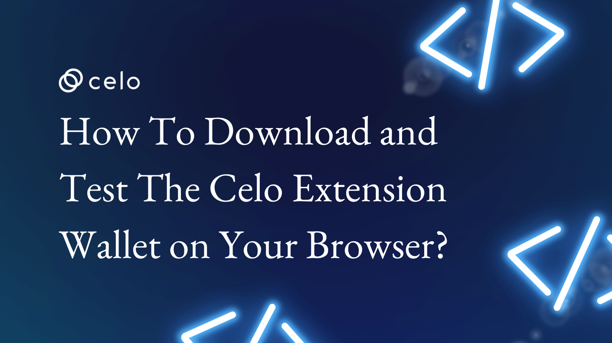

## How To Download and Test The Celo Extension Wallet on Your Browser?

In this tutorial, we will show you how to download and use the Celo extension wallet on your web browser. We will provide step-by-step instructions for installing and setting up the wallet, as well as how to test it using the Testnet. By the end of this tutorial, you will have a working Celo extension wallet and the knowledge to use it for your blockchain development projects. This tutorial is essential for anyone looking to get started with the Celo blockchain and its extension wallet.

<iframe width="560" height="315" src="https://www.youtube.com/embed/KD_0kKxtl8c" title="YouTube video player" frameborder="0" allow="accelerometer; autoplay; clipboard-write; encrypted-media; gyroscope; picture-in-picture; web-share" allowfullscreen></iframe>
