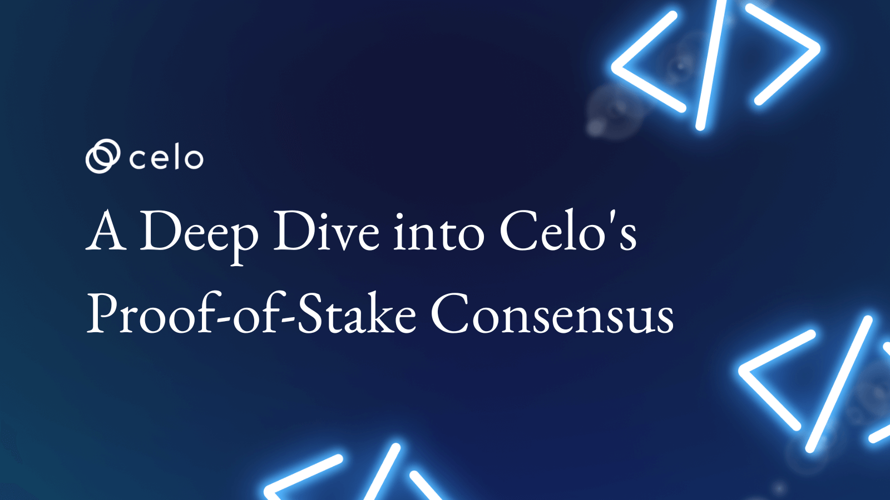

## Introduction

The Celo blockchain is a proficient, fast, and lightweight platform that supports the building of innovative, complex, and client-designed mobile applications. In simple terms, it is a network that allows the development of decentralized and inventive mobile and web applications.

One of the core features of how the Celo blockchain work falls on the concept of multiple revolutionary solutions, one of which is called [Proof of Stake](https://docs.celo.org/protocol/pos) (PoS).
On completing this article, you’ll have a solid idea of the [Concept of Celo’s protocols](https://docs.celo.org/learn/celo-protocol#:~:text=The%20Celo%20blockchain%20implements%20a,offline%2C%20faulty%2C%20or%20malicious.), what PoS is and how it makes Celo an efficient platform for creating indigenous, decentralized solutions.

You’ll also have all the basic information you’ll need to get started with building on the Celo blockchain.

## Prerequisites

Throughout this article, you are not expected to have any prior in-depth knowledge of any technology or intricate detail about the web3 space.
If you’re reading this tutorial, it means you want to know more about what a PoS is and how the Celo Blockchain integrates this verification system.

## What is Consensus Mechanism

A [Consensus](https://docs.celo.org/learn/celo-protocol#consensus-and-proof-of-stake) Mechanism is a method of authentication adopted by blockchain platforms to ensure transactions are in sync and agree on which transaction is valid before adding the transaction to the blockchain.

Amongst others, one of the proven efficient and effective means of reaching consensus on the blockchain is using the Proof of Stack PoS consensus mechanism. Which is why the Celo blockchain uses it.

When a transaction is created on the Celo blockchain before it is added to the blockchain ledger it first needs to be validated by the chain’s miners, thus the need for [consensus](https://docs.celo.org/protocol/consensus).

## What is Proof of Stack (PoS)

[Proof of Stack](https://docs.celo.org/learn/celo-protocol#consensus-and-proof-of-stake) is a type of consensus mechanism that adopts the idea of staking coins to earn its node runners the right to validate a transaction before adding it to the blockchain ledger.

When a transaction occurs on a blockchain platform like Celo, there is a need to first authenticate and validate the transaction before adding the transaction to the blockchain permanently. These tasks are usually carried out by the blockchain’s miners and node runners on the Celo blockchain.

> ***Note: Node runners or [validators](https://docs.celo.org/protocol/consensus#validators) are individuals or companies running full blockchain network nodes. They provide the backbone of the blockchain network by providing the infrastructure that allows the network to process transactions and maintain a distributed ledger. Node runners are rewarded for their services with tokens or coins from the network***.

Looking back to the technology system before the web3 revolutionary breakthrough, verifying transactions would require a centralized or automated entity that was prone to either time consumption for financial and data forgery for non-monetary transactions and a lot more.

The need for a system like the PoS for the validation of transactions, therefore came as an innovative technological breakthrough.

In a PoS system, the chances of forgery or manipulation of transactions and data would be easily spotted and penalized.
The PoS means of consensus is one of the important features that make the Celo Blockchain a secure and rewarding platform for developers to build on and validators to manage and get rewarded for.

The PoS algorithm also allows its validators and node runners to carry out validation while maintaining a low computational cost and manual effort.

## Other types of Consensus Mechanism

Just like the PoS is used by the Celo blockchain as a means of reaching Consensus in approving all transactions, there are also other consensus mechanisms adopted by other blockchains some of which are;

1. **Proof of Work (PoW)**: [This](https://www.investopedia.com/terms/p/proof-work.asp) type of consensus algorithm requires its miners to consume a massive amount of computational power to solve the complex cryptographic puzzle that defines each transaction. Although this algorithm is effective and adopted by popular blockchain platforms, it is not quite efficient.

2. **Delegated Proof of Stake (DPoS)**: [This](https://learn.bybit.com/blockchain/delegated-proof-of-stake-dpos/) type of consensus algorithm is similar to the PoS algorithm. But unlike the PoS algorithm, a group of miners or node runners is tasked with achieving a distributed consensus. It serves more like a voting system where miners decide who should be responsible for validating a transaction.

3. **Proof Of Importance (PoI)**: [This](https://www.techopedia.com/definition/33599/proof-of-importance-poi#:~:text=of%20Importance%20(PoI)-,What%20Does%20Proof%20of%20Importance%20(PoI)%20Mean%3F,that%20they%20can%20create%20blocks.) algorithm is also very similar to the Proof of Stake algorithm, In the mechanism rewards are given to effective network users. The algorithm allows a hierarchy of importance based on individuals who have made more contributions to the system and gives them the right to validate transactions on the platform.

4. **Proof of Activity (PoA)**: [This](https://www.investopedia.com/terms/p/proof-activity-cryptocurrency.asp#:~:text=What%20Is%20Proof%2Dof%2DActivity,miners%20arrive%20at%20a%20consensus.) algorithm is a hybrid of the Proof of Work (PoW) and the Proof of Stake (PoS) algorithms, that allow validators to stake coins as collateral, and also validate blocks using computational decryption and other resources.

5. **Proof of Captivity (PoC)**: [This](https://www.investopedia.com/terms/p/proof-capacity-cryptocurrency.asp#:~:text=Proof%20of%20capacity%20(PoC)%20is,mining%20rights%20and%20validate%20transactions.)system of consensus neither requires a miner si solve cryptographic puzzles like the PoW or stake coins like the PoS, but rather to prove that they have a certain amount of hard drive space to contribute to storing plots of cryptographic hashes for the blockchain.

6. **Proof of Authority (PoA)**: [This](https://www.naukri.com/learning/articles/proof-of-activity-in-blockchain/) algorithm simply pre-selects and authorizes validator nodes to validate a newly added block.

7. **Proof of Elapsed Time (PoET)**: [This](https://www.naukri.com/learning/articles/proof-of-elapsed-time-in-blockchain/) system of consensus was designed to simply select a leader from a pool of miners and validators and assigns the task of validating the next node.

These are a few other important consensus algorithms available and adopted by other blockchain platforms.

## Other Core Feature Of the Celo Blockchain

* [**Scalability**](https://forum.celo.org/t/how-many-transaction-can-celo-blockchain-process-per-second/112):  The Celo blockchain was built to handle a large number of users and transactions without slowing down or becoming unresponsive. Celo is a layer-1 blockchain solution that helps to scale up blockchain technology to handle a high throughput of transactions.
It does this by allowing transactions to be validated off-chain and then quickly grouping them into batches for faster processing on-chain. This helps reduce overall network congestion and improves scalability.

* [**Security**](https://forum.celo.org/t/security-guidelines-for-celo-partners/3723): Transactions on the Celo Blockchain go through a set of measures taken to protect the data and transactions stored on the blockchain from tampering or unauthorized access. This includes encryption, secure protocols, and validation of transactions. Additionally, Celo's consensus protocol is designed to ensure the safety and integrity of the blockchain by maintaining a decentralized network of validators who are incentivized to keep the blockchain secure.

* [**Speed**](https://www.altcoinbuzz.io/reviews/altcoin-projects/celo-blockchain-with-fast-cheap-and-secure-transactions/#:~:text=Fastest%20EVM%20Chain%20%E2%80%93%20Celo%2C%20in,scalability%20of%20the%20Celo%20platform.): The Celo blockchain is designed to offer a high level of speed, and enables users to quickly and securely transfer value across the network in a matter of seconds. It also utilizes a sharding technology called Celo Fast Finality (CFF) that allows the network to split its transactions into multiple shards to process thousands of transactions per second. It utilizes a mechanism called instant finality that also allows the network to commit transactions.

## Building on Celo

As a developer looking to [build](https://celo.org/developers) fast, secure, scalable, and innovative ideas, building on Celo is an exciting opportunity for you to create applications and services that leverage the Celo platform. Celo provides a secure, open-source platform for developers to create distributed applications and services that connect people and organizations in meaningful ways. With Celo, developers can create applications that bring new possibilities to the global economy, from unlocking financial inclusion to providing access to new markets.

## Wallets

The Celo [wallet](https://celowallet.app/) enables its users to quickly and securely send and receive payments, store digital assets, and access various financial services. It allows users to view their account balances and track their transactions.

The [wallet](https://docs.celo.org/network/alfajores/use-mobile-wallet) also provides developers with the tools they require to interact with the Celo Blockchain, like signing transactions, deploying and testing contracts, calling and testing functions, etc.
Additionally, the Celo wallet offers enhanced security features to ensure the safety of users’ digital assets. With its suite of features, the Celo wallet is a powerful tool for building on the Celo blockchain. Indirectly you can also interact with the celo blockchain by [adding](https://medium.com/defi-for-the-people/how-to-set-up-metamask-with-celo-912d698fcafe) the celo network to other wallets like [metamask](https://docs.celo.org/wallet/metamask/use), etc. More wallet-related information and why you need one can be found [here](https://docs.celo.org/wallet).

## Smart Contract

The Celo blockchain also allows technological transactions like compiling, testing, debugging, deploying, and calling contracts on the network, which gives you the ability to create, a decentralized application and interact with a decentralized codebase on the blockchain.

Here, you will find more tutorials on creating, [verifying](https://docs.celo.org/developer/deploy/hardhat#verify-contracts-on-celo), and deploying smart contracts, writing contract tests, and making contract call on the Celo blockchain using, [Hardhat](https://docs.celo.org/developer/deploy/hardhat), [Truffle](https://docs.celo.org/developer/walkthrough/hello-contracts), foundry, [Remix](https://docs.celo.org/developer/deploy/remix), etc.

## Connecting to Celo

When connecting to the Celo alfajores or maiNet for deploying or interacting with the network, you’re advised to use the Celo configuration file below in place of the code in your .config file.

```javascript
require("@nomiclabs/hardhat-waffle");
require("dotenv").config({ path: ".env" });
require("hardhat-deploy");

// You need to export an object to set up your config
// Go to https://hardhat.org/config/ to learn more

// Prints the Celo accounts associated with the mnemonic in .env
task("accounts", "Prints the list of accounts", async (taskArgs, hre) => {
  const accounts = await hre.ethers.getSigners();

  for (const account of accounts) {
    console.log(account.address);
  }
});

/**
 * @type import('hardhat/config').HardhatUserConfig
 */
module.exports = {
  defaultNetwork: "alfajores",
  networks: {
    localhost: {
      url: "http://127.0.0.1:7545",
    },
    alfajores: {
      gasPrice: 1500000000,
      gas: 4100000,
      url: "https://alfajores-forno.celo-testnet.org",
      accounts: {
        mnemonic: process.env.MNEMONIC,
        path: "m/44'/52752'/0'/0",
      },
      //chainId: 44787
    },
    celo: {
      url: "https://forno.celo.org",
      accounts: {
        mnemonic: process.env.MNEMONIC,
        path: "m/44'/52752'/0'/0",
      },
      chainId: 42220,
    },
  },
  solidity: "0.8.10",
};
```

[Here](https://github.com/Julius170/Making_Contract_Calls.demo/blob/master/hardhat.config.js) is a link to the code sample above, you will also require your funded wallet’s Mnemonic phrase in an encrypted file. To know more about interacting with the Celo blockchain here are some tutorials you can read on.

## Creating Dapps on the Celo blockchain

The Celo blockchain provides the infrastructure for decentralized applications [(DApps)](https://docs.celo.org/blog/tutorials/truffle-and-celo-the-ultimate-guide-to-deploy-celo-dapps-with-truffle) to act as a bridge between users and their data privacy. The increasing number of dApps that utilize the Celo blockchain validates its usefulness in the blockchain ecosystem.

Creating the Celo Blockchain is a revolutionary way to use blockchain technology to build secure and reliable mobile and web applications. With the Celo platform, developers can easily create decentralized applications [(DApps)](https://developers.celo.org/hardhat-and-celo-the-ultimate-guide-to-deploy-celo-dapps-using-hardhat-747f42ad0788) and smart contracts that enable users to transfer value, store information, and more. This platform is designed to be user-friendly and secure, making it an attractive option for developers looking to build the next generation of applications.

## Redeploying to Celo

[Redeploying](https://learn.figment.io/tutorials/redeploy-ethereum-dapps-on-celo) your Decentralized Application (Dapp) to Celo is a necessary process that can enable you to take advantage of the Celo network’s advantages, including scalability and security. The Celo platform enables developers to create and deploy their Dapps quickly and easily, and redeploying is an important part of this process.

Redeploying your Dapp to Celo requires a Celo account, which you can create through their website or the Celo mobile app. Once you have an account, you must create a Dapp and deploy it to the Celo blockchain. This process involves setting up a smart contract, enabling the Celo network to run your Dapp. You then need to write the code for your Dapp and deploy it onto the Celo blockchain. Once your Dapp is deployed, it will be available to anyone on the Celo platform. Here you can find more information on Redeploying your Dapp to the Celo network.

Redeploying on the Celo network provides the following benefits to your decentralized application.

1. **Scalability**: The Celo blockchain can scale to millions of users, with each user able to transact in a matter of seconds. This makes it ideal for large-scale applications that handle large volumes of transactions.

2. **Low Cost**: Celo has committed to providing users with low-cost transactions, allowing developers to lower the cost of running their Dapps and making them more attractive to users.

3. **Security**: Celo utilizes advanced cryptography to provide a secure and reliable platform for developers and users.

4. **Ease of Use**: Celo has a user-friendly interface that makes it easy for developers to deploy their Dapps and for users to use them.

5. **Open Source**: Celo is an open-source platform that allows developers to access and customize the code to their needs and requirements.

6. **Community Support**: Celo has a vibrant and supportive community of developers and users who are always willing to help out and provide assistance.

## Conclusion

Now that you have completed this tutorial, you understand the concept of one of the core concepts that make up the Celo blockchain. And you now have everything you need to start building and interacting with the celo blockchain.

## Next Steps

Now that you’ve successfully grasped the lesson in this tutorial, you can also read on the following topics to help you get started on building real-world solutions and other development on Celo.

You can also consider contributing to the Celo network as a developer or as a technical writer (Celo Sage).

## About the Author​

Mayowa Julius Ogungbola

A Software Engineer and technical writer who is always open to working on new ideas. I enjoy working on [GitHub](https://github.com/Julius170/), and you can also find out what I tweet about and connect with me on [LinkedIn](https://www.linkedin.com/in/julius-ogungbola-a71810229/)
