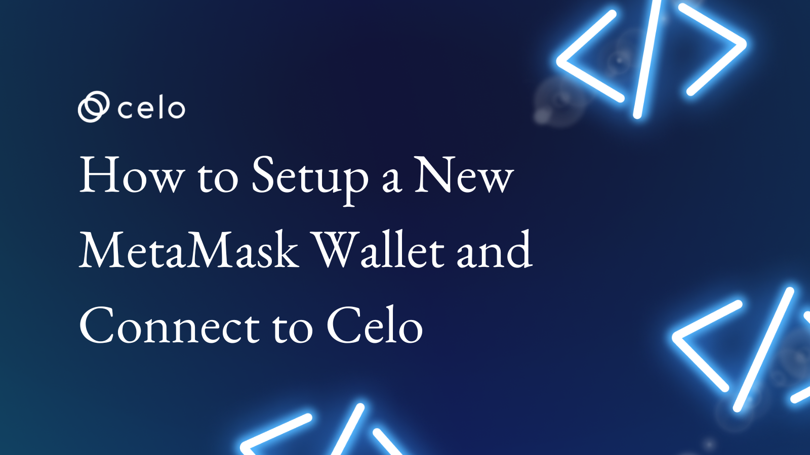

import YouTube from '@components/YouTube';

## Introdução

Nesse tutorial iremos aprender a como criar uma carteira MetaMask e conectar com a blockchain da Celo.

## Pré-requisitos

Para este tutorial você precisará de um navegador que suporte extensões, recomendamos os seguintes:

- Google Chrome
- Microsoft Edge
- Mozilla Firefox

## Tutorial

Confira no video como criar uma carteira para a blockchain Celo.

<YouTube videoId="eBhupjh9POM"/>

:::info Descrição

[MetaMask](https://metamask.io/)
[ChainList](https://chainlist.org/)

:::

:::info Obtenha suporte

Entre no [Servidor Discord da Celo](https://chat.celo.org/) ou acesse diretamente o canal em português
[aqui](https://discord.com/channels/600834479145353243/956679819406491708).

:::
