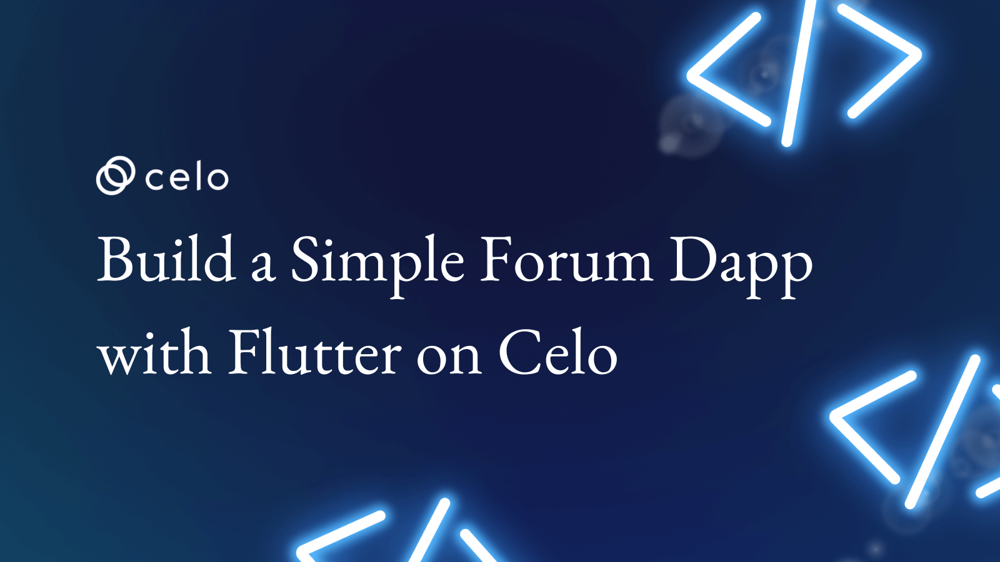
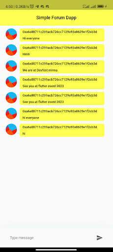
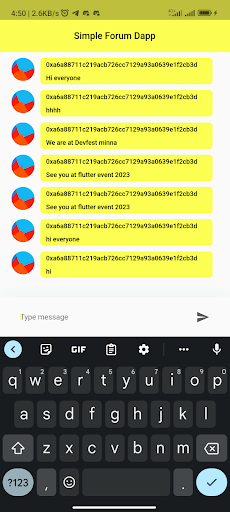
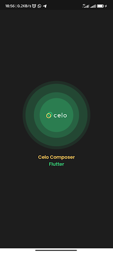
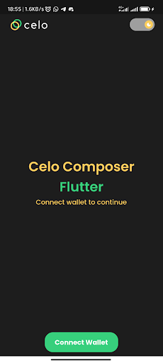

## Introduction

In this tutorial, we're going to build a deployable smart contract and an accompanying Flutter widget to add comment threads to your apps.

### How the DAPP works

Here's what we're aiming to build.



By adding comment threads such as this around our app we can let our users have conversations anywhere about anything!

## Prerequisites

First, This tutorial assumes that you are already familiar with solidity and understand how smart contracts work and also assumes that you already know the basics of using Flutter or you can  please clone the [flutter web3 celo](https://github.com/Mujhtech/flutter-web3-celo). You'll also want to make sure you've installed the MetaMask Mobile App and have a MetaMask account. If you'd like, see our prior tutorial Setting Up Your Wallet for more details on this.

For this project we'll be using a few interesting dependencies & dev dependencies:

- [walletconnect_dart](https://pub.dev/packages/walletconnect_dart/example)
- [provider](https://pub.dev/packages/provider/example)
- [http](https://pub.dev/packages/http/example)
- [url_launcher](https://pub.dev/packages/url_launcher/example)
- [jazzicon](https://pub.dev/packages/jazzicon/example)
- [web3dart](https://pub.dev/packages/web3dart/example)

For dev dependencies:

- [build_runner](https://pub.dev/packages/build_runner)
- [web3dart_builders](https://pub.dev/packages/web3dart_builders)

We'll walk you through each one as we go and show you how to use them in combination to write some awesome dapps.

## Getting Started

I assume that anyone going through this tutorial already understands and uses Flutter, so I will skip the setup involved in getting Flutter to work on your development computer. That means I assume you already have VS Code/Android Studio together with Android SDK and Flutter setup on your PC.

*If you are entirely new to Flutter, here [https://docs.flutter.dev/get-started/install](https://docs.flutter.dev/get-started/install) is a good tutorial you can learn from.

To get started, you can clone this repository flutter-web3-celo or make use of Celo Composer.

Celo Composer is a set of tools and starter templates that makes it easy for you to start your Celo-based web3 projects.

You can check out Celo Composer here [https://github.com/celo-org/celo-composer/tree/main/packages/flutter-app](https://github.com/celo-org/celo-composer/tree/main/packages/flutter-app).

### Using Celo Composer

To start our Flutter App Project, we will use the Celo Composer CLI; the CLI makes it easy for us to select the options that we want when bootstrapping our dApp. In other to do that you need to have Node set up on your PC and you can visit Node to get started. Run this on your terminal after setup Node.
 
```bash
npx @celo/celo-composer create
```

Choose Flutter when asked for the framework

Choose hardhat (Only Hardhat is available at the time of writing this tutorial)
 
Your Project will now be created; you can check to make sure it has the following folders

packages/hardhat - Your Hardhat Folder - Where you can keep your Contracts
packages/flutter-app - Your Flutter project

## Setup the Smart Contract

Okay, now that everything is set up, let's start with our smart contract.

### Design

For comments, we'll need a data structure that should contain the following information:

- An id
- The topic to which the comment belongs
- A message
- The creator
- A timestamp

We will also need the following few things for our UI (Flutter):

- A way to fetch a list of comments for a specific topic
- A way to add a new comment
- A way to receive updates about comments that have been added

```solidity
// SPDX-License-Identifier: MIT
// ForumV1

pragma solidity ^0.8.4;

contract ForumV1 {

   struct Comment {
       uint32 id;
       string topic;
       address creator_address;
       string message;
       uint created_at;
   }

   uint32 private idCounter;

   mapping(string => Comment[]) private commentsByTopic;  

   event CommentAdded(Comment comment);

   function getComments(string calldata topic) public view returns(Comment[] memory) {

      return commentsByTopic[topic];

   }


   function addComment(string calldata topic, string calldata message) public {

       Comment memory comment = Comment({
           id: idCounter,
           topic: topic,
           creator_address: msg.sender,
           message: message,
           created_at: block.timestamp
       });

       commentsByTopic[topic].push(comment);

       idCounter++;

       emit CommentAdded(comment);
   }
}
```

The ForumV1 Contract has two functions

- addComment: allows you to create a new comment; it stores the created comments using topic in the commentsByTopic mapping
- getComments: a method to access all comments by topic

### Deploy Smart contract

- Open your Hardhat project folder (packages/hardhat)

- Copy the .envexample to a new file called .env. This is where the private key you use to deploy your contracts will be saved.

- Fill in the private key with your Celo wallet private key. You might want to get some Alfajores (Testnet) coins from the Celo Faucet

- Open your Contracts folder (packages/hardhat/contracts)

- Add a new contract in the folder called ForumV1.sol and paste the above contract into the contract file.

Your hardhat project was set up with the hardhat-deploy plugin which makes deployments very easy.

To deploy, go to the deploy folder, open the 00-deploy.js file, and you will see an example deployment function for the existing Greeter contract.

Add the following code to the 00-deploy.js file

```js
await deploy(“ForumV1”, {
  from: deployer,
  args: [],
  log: true,
})
```

Then update the module.exports tags to include ForumV1 Contract like below.

```js
module.exports.tags = [..., "ForumV1];
```

Deploy the Contracts by running the following commands on any terminal (make sure you are in the packages/hardhat directory)

```bash
npx hardhat deploy –network alfajores
```

If all is well, you should see a message from hardhat with the transaction hash of your Contract deployment and the address of your new Contract

You can now view your contract on the CELO explorer (Alfajores) using the address.

Now that we have deployed our contract let’s build the dApp.

## The UI (Flutter)

If you have a look at CELO Composer you'll see that the starter code came with some UI boilerplate. Run your flutter project and you should be able to get the following UI.



### Directory Structure

- ```.vscode``` — VSCode settings including code snippets, recommended extensions etc.
- ```android``` — Contains all the Android-specific code.
- ```ios``` — Contains all the IOS-specific code.
- ```lib``` — Core modules, controllers, UI Code, constants, etc.
- ```.gitignore``` — A gitignore file specifies intentionally untracked files that Git should ignore.
- ```pubspec.yaml``` — A pubspec is generated when you create a new Flutter project.

First, make sure that the following packages are all installed and to do so you can check your ```pubspec.yaml``` file

- [walletconnect_dart](https://pub.dev/packages/walletconnect_dart/example) : WalletConnect is an open-source protocol for connecting decentralised applications to mobile wallets with QR code scanning or deep linking. A user can interact securely with any Dapp from their mobile phone, making WalletConnect wallets a safer choice compared to desktop or browser extension wallets.

- [provider](https://pub.dev/packages/provider/example) : A simple flutter package to manage state
- [http](https://pub.dev/packages/http/example) : A composable, Future-based library for making HTTP requests.
- [url_launcher](https://pub.dev/packages/url_launcher/example) :  A Flutter plugin for launching a URL.
- [jazzicon](https://pub.dev/packages/jazzicon/example) : This package contains how to make Idention. Identicon usually uses as an avatar of your wallet/crypto avatar. it is unique because generated by your address.
- [web3dart](https://pub.dev/packages/web3dart/example) : A dart library that connects to interact with the Ethereum blockchain. It connects to an Ethereum node to send transactions, interact with smart contracts, and much more!
- [build_runner](https://pub.dev/packages/build_runner) : This package provides a concrete way of generating files using Dart code, outside of tools like pub
- [web3dart_builders](https://pub.dev/packages/web3dart_builders) : This package is an extension of the web3dart package that includes the dart contract generator from ABI.

We will need the ABI of our deployed contracts and the address deployed, to make any call to our smart contract.

### What is an ABI?

An ABI - Application Binary Interface - defines the methods, types, and structures used to interact with your binary smart contract. You can think of it like an API, they both expose the structure or interfaces that allow other contracts or programs to call them. The ABI exposes the function signatures and variable declarations in a smart contract and is often represented in JSON.
Hardhat often generates the ABIs for our contracts when we compile them, and the ABIs are often stored in the artifacts folder.

Let’s copy our Contract ABIs into our project.

Then create a folder in the project folder directory lib and create a file named ```forumV1.abi.json```. Note your file name can be anything but make sure the file extension start and ends with ```.abi.json```. With the help of ```build_runner``` & ```web3dart_builders``` we will be able to generate a dart contract object file which we will be using to interact with our smart contract.

Run this in your terminal

```bash
flutter pub run build_runner build
```

or

```bash
flutter pub run build_runner watch
```

This will generate a dart file to represent our smart contract object named ```forumV1.g.dart```.

### Models

Forum Model is an object to represent the incoming data from our smart contract.

```dart
/// lib/models/forum.dart
import 'dart:convert';

class Forum {
 String owner;
 String message;
 Forum({
   required this.owner,
   required this.message,
 });


 Forum copyWith({
   String? owner,
   String? message,
 }) {
   return Forum(
     owner: owner ?? this.owner,
     message: message ?? this.message,
   );
 }


 Map<String, dynamic> toMap() {
   return {
     'owner': owner,
     'message': message,
   };
 }


 factory Forum.fromMap(List data) {
   return Forum(
     owner: data[2].toString(),
     message: data[3],
   );
 }


 static List<Forum> fromMaps(List data) {
   final List<Forum> forums = [];
   for (final item in data) {
     final castData = item as List;
     final state = Forum.fromMap(castData);
     forums.add(state);
   }
   return forums;
 }


 String toJson() => json.encode(toMap());


 factory Forum.fromJson(String source) => Forum.fromMap(json.decode(source));


 @override
 String toString() => 'Forum(owner: $owner, message: $message)';


 @override
 bool operator ==(Object other) {
   if (identical(this, other)) return true;


   return other is Forum && other.owner == owner && other.message == message;
 }


 @override
 int get hashCode => owner.hashCode ^ message.hashCode;
}
```

App Info Model is a simple model class to provide a simple information about our flutter app to our smart contract

```dart
/// lib/models/app_info.dart

class AppInfo {
 final String? url;
 final String? name;
 final String? description;
 final List<String>? icons;


 AppInfo({
   this.url,
   this.name,
   this.description,
   this.icons,
 });
}

```

Crypto Wallet Model is a simple class object to represent the most commonly used wallet apps on both android and iOS and their deep link.

```dart
/// lib/models/crypto_wallet.dart
class CryptoWallet {
 static const CryptoWallet metamask = CryptoWallet(
     universalLink: 'https://metamask.app.link/', deeplink: 'metamask://');
 static const CryptoWallet trustWallet = CryptoWallet(
     universalLink: 'https://link.trustwallet.com/', deeplink: 'trust://');
 static const CryptoWallet rainbowMe = CryptoWallet(
     universalLink: 'https://rainbow.me/', deeplink: 'rainbow://');
 static const CryptoWallet talken =
     CryptoWallet(universalLink: 'https://talken.io');


 /// universal link for iOS
 final String universalLink;


 /// deeplink for android
 final String? deeplink;


 const CryptoWallet({
   required this.universalLink,
   this.deeplink,
 });
}

```

### Components

Chat Input Box Component contains both a text form field and a send icon. A send icon is wrapped with an InkWell widget with an onTap event that checks if the user already connects there then fires the addComment method in our wallet controller object else redirects the user to connect their wallet.

```dart
/// lib/components/chat_input_field.dart


import 'package:flutter/material.dart';
import 'package:flutter_web3_basic/controller/controller.dart';
import 'package:provider/provider.dart';


class ChatInputField extends StatefulWidget {
 const ChatInputField({
   Key? key,
 }) : super(key: key);


 @override
 State<ChatInputField> createState() => _ChatInputFieldState();
}


class _ChatInputFieldState extends State<ChatInputField> {
 TextEditingController message = TextEditingController();
 @override
 Widget build(BuildContext context) {
   WalletController walletController = context.watch<WalletController>();
   return Container(
     padding: const EdgeInsets.symmetric(
       horizontal: 20,
       vertical: 20 / 2,
     ),
     decoration: BoxDecoration(
       color: Theme.of(context).scaffoldBackgroundColor,
       boxShadow: [
         BoxShadow(
           offset: const Offset(0, 4),
           blurRadius: 32,
           color: const Color(0xFF087949).withOpacity(0.08),
         ),
       ],
     ),
     child: SafeArea(
       child: Row(
         children: [
           Expanded(
             child: Container(
               padding: const EdgeInsets.symmetric(
                 horizontal: 20 * 0.75,
               ),
               decoration: BoxDecoration(
                 color: Colors.white.withOpacity(0.05),
                 borderRadius: BorderRadius.circular(40),
               ),
               child: Row(
                 children: [
                   Expanded(
                     child: TextField(
                       controller: message,
                       decoration: const InputDecoration(
                         hintText: "Type message",
                         border: InputBorder.none,
                       ),
                     ),
                   ),
                   const SizedBox(width: 20 / 4),
                   InkWell(
                     onTap: () async {
                       if (walletController.publicWalletAddress == null) {
                         walletController.connectWallet(context);
                       } else {
                         await walletController
                             .addComment(message.text.trim());
                       }
                     },
                     child: Icon(
                       Icons.send,
                       color: Theme.of(context)
                           .textTheme
                           .bodyText1!
                           .color!
                           .withOpacity(0.64),
                     ),
                   ),
                 ],
               ),
             ),
           ),
         ],
       ),
     ),
   );
 }
}

```

Message Component is a simple custom widget that displays comment and their creator and it makes use of the Jazzicon widget to render user avatars based on their wallet address.

```dart
/// lib/components/message.dart


import 'package:flutter/material.dart';
import 'package:flutter_web3_basic/constant.dart';
import 'package:flutter_web3_basic/models/forum.dart';
import 'package:jazzicon/jazzicon.dart';
import 'package:jazzicon/jazziconshape.dart';


class Message extends StatefulWidget {
 final Forum forum;
 const Message({super.key, required this.forum});


 @override
 State<Message> createState() => _MessageState();
}


class _MessageState extends State<Message> {
 JazziconData? jazz;


 @override
 void initState() {
   jazz = Jazzicon.getJazziconData(40, address: widget.forum.owner);
   super.initState();
 }


 @override
 Widget build(BuildContext context) {
   return Row(
     crossAxisAlignment: CrossAxisAlignment.start,
     children: [
       if (jazz != null) Jazzicon.getIconWidget(jazz!),
       const SizedBox(
         width: 10,
       ),
       Container(
         width: MediaQuery.of(context).size.width - 100,
         decoration: const BoxDecoration(
             color: GlobalColors.primary,
             borderRadius: BorderRadius.all(Radius.circular(6))),
         padding: const EdgeInsets.symmetric(horizontal: 10, vertical: 5),
         child: Column(
           crossAxisAlignment: CrossAxisAlignment.start,
           children: [
             Text(
               widget.forum.owner,
               style: const TextStyle(
                   color: Colors.black,
                   fontSize: 14,
                   fontWeight: FontWeight.w600),
             ),
             const SizedBox(
               height: 10,
             ),
             Text(
               widget.forum.message,
               style: const TextStyle(
                   color: Colors.black,
                   fontSize: 14,
                   fontWeight: FontWeight.w600),
             )
           ],
         ),
       )
     ],
   );
 }
}

```

### Constants

This file provides some constant us with some constant variables like color, RPC Url, chainId, etc.

```dart
import 'package:flutter/material.dart';


class GlobalColors {
 GlobalColors._();
 static const Color primary = Color(0xFFFCFF51);
}

class GlobalConstants {
 static const String testnetApiUrl = "https://alfajores-forno.celo.org";
 static const String mainnettApiUrl = "https://forno.celo.org";
 static const String bridge = "https://bridge.walletconnect.org";
 static const String name = "Simple Forum Dapp";
 static const String url = "https://celo.org";
 static const String contractAddress =
     '----';
 static const int testnetChainId = 44787;
 static const int mainnetChainId = 42220;
}
```

### Utilities

```WalletConnectEthereumCredentials``` is  a class object that implements a custom transaction sender object on the web3dart package

```dart
/// lib/utils/wallet_connet_etherum_credentials.dart


import 'dart:typed_data';


import 'package:walletconnect_dart/walletconnect_dart.dart';
import 'package:web3dart/crypto.dart';
import 'package:web3dart/web3dart.dart';


class WalletConnectEthereumCredentials extends CustomTransactionSender {
 WalletConnectEthereumCredentials({required this.provider});


 final EthereumWalletConnectProvider provider;


 @override
 Future<EthereumAddress> extractAddress() async {
   EthereumAddress address =
       EthereumAddress.fromHex(provider.connector.session.accounts[0]);
   return address;
 }


 EthereumAddress getEthereumAddress() {
   final String publicAddress = provider.connector.session.accounts.first;
   return EthereumAddress.fromHex(publicAddress);
 }


 @override
 Future<String> sendTransaction(Transaction transaction) async {
   final hash = await provider.sendTransaction(
     from: transaction.from!.hex,
     to: transaction.to?.hex,
     data: transaction.data,
     gas: transaction.maxGas,
     gasPrice: transaction.gasPrice?.getInWei,
     value: transaction.value?.getInWei,
     nonce: transaction.nonce,
   );


   return hash;
 }


 @override
 Future<MsgSignature> signToSignature(Uint8List payload,
     {int? chainId, bool isEIP1559 = false}) {
   // TODO: implement signToSignature
   throw UnimplementedError();
 }
  @override
 // TODO: implement address
 EthereumAddress get address => throw UnimplementedError();
  @override
 MsgSignature signToEcSignature(Uint8List payload, {int? chainId, bool isEIP1559 = false}) {
   // TODO: implement signToEcSignature
   throw UnimplementedError();
 }
}

```

```WalletConnectHelper``` is a simple object utility class for implementing Walletconnect protocol using deep linking to connect to different wallet apps e.g Trust Wallet, Metamask etc. Note at the time of testing this didn’t work with Valora Wallet App

```dart
/// lib/utils/wallet_connet.dart


import 'dart:async';
import 'package:flutter/foundation.dart';
import 'package:flutter_web3_basic/constant.dart';
import 'package:flutter_web3_basic/models/models.dart';
import 'package:flutter_web3_basic/utils/utils.dart';
import 'package:url_launcher/url_launcher.dart';
import 'package:walletconnect_dart/walletconnect_dart.dart';


/// WalletConnectHelper is an object for implement WalletConnect protocol for
/// mobile apps using deep linking to connect with wallets.
class WalletConnectHelper {
 final String? bridge;


 /// mobile app info
 final AppInfo appInfo;


 late WalletConnect connector;


 SessionStatus? sessionStatus;
 List<String> accounts = [];


 /// Connector using brigde 'https://bridge.walletconnect.org' by default.
 WalletConnectHelper({
   this.bridge,
   required this.appInfo,
 }) {
   connector = getWalletConnect();
 }


 WalletConnect getWalletConnect() {
   final WalletConnect connector = WalletConnect(
     bridge: bridge ?? 'https://bridge.walletconnect.org',
     clientMeta: PeerMeta(
       name: appInfo.name ?? 'Simple Forum Dapp',
       description: appInfo.description ?? 'Simple Forum Dapp on Celo',
       url: appInfo.url ?? 'https://celo.org',
       icons: appInfo.icons ??
           ['https://cryptologos.cc/logos/celo-celo-logo.png'],
     ),
   );
   return connector;
 }


 //----------------------------------------------------------------


 void reset() {
   connector = getWalletConnect();
 }


 Future<bool> initSession(context, {int? chainId}) async {
   try {
     return await initMobileSession(chainId: chainId);
   } catch (e) {
     return false;
   }
 }


 Future<bool> initMobileSession({int? chainId}) async {
   if (!connector.connected) {
     try {
       sessionStatus = await connector.createSession(
         chainId: chainId,
         onDisplayUri: (uri) async {
           await _connectWallet(displayUri: uri);
         },
       );


       accounts = sessionStatus?.accounts ?? [];


       return true;
     } catch (e) {
       debugPrint('createSession() - failure - $e');
       reset();
       return false;
     }
   } else {
     return true;
   }
 }


 Future<void> _connectWallet({
   CryptoWallet wallet = CryptoWallet.metamask,
   required String displayUri,
 }) async {
   var deeplink = DeeplinkUtil.getDeeplink(wallet: wallet, uri: displayUri);
   bool isLaunch = await launchUrl(Uri.parse(deeplink),
       mode: LaunchMode.externalApplication);
   if (!isLaunch) {
     throw 'connectWallet() - failure - Could not open $deeplink.';
   }
 }


 WalletConnectEthereumCredentials getEthereumCredentials() {
   EthereumWalletConnectProvider provider = EthereumWalletConnectProvider(
       connector,
       chainId: GlobalConstants.testnetChainId);


   WalletConnectEthereumCredentials credentials =
       WalletConnectEthereumCredentials(provider: provider);


   return credentials;
 }


 Future<void> dispose() async {
   connector.session.reset();
   await connector.killSession();
   await connector.close();


   sessionStatus = null;
   accounts = [];


   reset();
 }
}

```

DeeplinkUtil is a utility class to extract deep link URLs based on mobile platform OS.

```dart
/// lib/utils/deeplink.dart


import 'dart:io';


import 'package:flutter_web3_basic/models/models.dart';


class DeeplinkUtil {
 static const wcBridge = 'wc?uri=';


 static String getDeeplink({
   required CryptoWallet wallet,
   required String uri,
 }) {
   if (Platform.isIOS) {
     return wallet.universalLink + wcBridge + Uri.encodeComponent(uri);
   } else {
     return uri;
   }
 }
}

```

### Controllers

WalletController is an object that implements the ChangeNotifier object and notifies our UI of any changes like when user connect their wallet, user add new comments, the user disconnects their wallet, etc.

```dart
/// lib/controllers/wallet.dart


import 'package:eip55/eip55.dart';
import 'package:flutter/material.dart';
import 'package:http/http.dart';
import 'package:web3dart/web3dart.dart';


import 'package:flutter_web3_basic/blockcain/forumV1.g.dart';
import 'package:flutter_web3_basic/constant.dart';
import 'package:flutter_web3_basic/main.dart';
import 'package:flutter_web3_basic/models/forum.dart';
import 'package:flutter_web3_basic/models/models.dart';
import 'package:flutter_web3_basic/utils/utils.dart';


class WalletController extends ChangeNotifier {
 bool balRefresh = false;
 List? _forums;
 List? get forums => _forums;


 EtherAmount bal = EtherAmount.fromUnitAndValue(EtherUnit.wei, 0);


 final WalletConnectHelper walletConnectHelper = WalletConnectHelper(
   bridge: GlobalConstants.bridge,
   appInfo: AppInfo(
     name: GlobalConstants.name,
     description: GlobalConstants.name,
     url: GlobalConstants.url,
   ),
 );


 late Web3Client web3client;
 //late StreamChicken2Contract contract;


 bool isConnectWallet = false;
 String? publicWalletAddress;


 void connectWallet(context) async {
   isConnectWallet = await walletConnectHelper.initSession(context,
       chainId: GlobalConstants.testnetChainId);
   if (isConnectWallet) {
     Navigator.pushReplacement(
         context,
         MaterialPageRoute(
             builder: (context) => const MyHomePage(
                   title: 'Simple Forum Dapp',
                 )));
     publicWalletAddress = walletConnectHelper
         .getEthereumCredentials()
         .getEthereumAddress()
         .toString();
     publicWalletAddress = toEIP55Address(publicWalletAddress!);


     // Init web3client
     initWeb3Client();


     // get Balance
     await getBalance();


     // Init contract
     await fetchComment();


     // Update ui
     notifyListeners();
   }
 }


 // Disconnet wallet
 void disconnectWallet() {
   walletConnectHelper.dispose();
   isConnectWallet = false;
   publicWalletAddress = null;
   notifyListeners();
 }


 void initWeb3Client() {
   web3client = Web3Client(GlobalConstants.testnetApiUrl, Client());
 }


 Future getBalance() async {
   var address =
       await walletConnectHelper.getEthereumCredentials().extractAddress();
   bal = await web3client.getBalance(address);
   notifyListeners();
 }


 Future<void> fetchComment() async {
   try {
     final forumV1 = ForumV1(
       address: EthereumAddress.fromHex(GlobalConstants.contractAddress),
       client: web3client,
     );
     final res = await forumV1.getComments('Celo Sage');
     _forums = Forum.fromMaps(res);
     notifyListeners();
   } catch (e) {
     //
   }
 }


 Future<void> addComment(String message) async {
   try {
     final forumV1 = ForumV1(
       address: EthereumAddress.fromHex(GlobalConstants.contractAddress),
       client: web3client,
     );
     Credentials cred = walletConnectHelper.getEthereumCredentials();
     await forumV1.addComment('Celo Sage', message,
         credentials: cred,
         transaction: Transaction(
             from: walletConnectHelper
                 .getEthereumCredentials()
                 .getEthereumAddress()));
     await fetchComment();
   } catch (e) {
     //
     print(e);
   }
 }
}

```

Basically below are some methods in WalletConnect Controller and their uses.

```connectWallet```: This method gets called when the user clicks to connect their wallet app and with the help of wallet connect helper it automatically opens a deep link URL for a user to select and compatible wallet app and continue after a successful connection is initiated a web3 client is been created which will be used to interact with our blockchain network i.e Celo Testnet network then get the user wallet address and get user balance in case we want to display user wallet balance based on the selected network.

```fetchComment```: This method makes use of our smart contract ABI object generated by ```web3dart_builders``` package and passes the web3Client object together will the smart contract address to create an instance that can be used to call some of our smart contract objects like fetchComment then pass the data return to our Forum Model and notify our UI to render new updates.

```addComment```: As said above, an instance of forumV1 object is used to call ```addComment``` but for us to make a transaction we need to pass a user credential to the ```addComment``` method which we get from ```WalletConnectEthereumCredential``` Utility then we can now call fetchComment method to get new records and update our UI.

```disconnectWallet```: This method helps disposed of some variables in our controller like wallet connect, isConnectWallet, etc. then once our UI get notified it automatically redirects the user to the homepage to reconnect their wallet.

Note: Throughout this tutorial, we are using ```Celo Sage``` as our topic in the smart contract which means to have many topics you can make use of any local storage package to save user topics and fetch comments based on those topics [shared_preferences](https://pub.dev/packages/shared_preferences) is an excellent example of local storage package to go with.

### Views

Our app entry point listened to a Multiprovider, in this case, we are only listening to WalletConnectController then redirecting users to a splash screen where user can connect their wallet app for authentication.

```dart
import 'package:flutter/material.dart';
import 'package:flutter_web3_basic/components/components.dart';
import 'package:flutter_web3_basic/constant.dart';
import 'package:flutter_web3_basic/controller/controller.dart';
import 'package:provider/provider.dart';


void main() async {
 WidgetsFlutterBinding.ensureInitialized();
 runApp(
   MultiProvider(providers: [
     ChangeNotifierProvider<WalletController>(
       create: (_) => WalletController(),
     )
   ], child: const MyApp()),
 );
}


class MyApp extends StatelessWidget {
 const MyApp({super.key});


 // This widget is the root of your application.
 @override
 Widget build(BuildContext context) {
   return MaterialApp(
     title: 'Simple Forum Dapp on CELO',
     theme: ThemeData(
         primarySwatch: const MaterialColor(0xFFFCFF51, {
       50: Color.fromRGBO(255, 255, 229, 1),
       100: Color.fromRGBO(254, 255, 179, 1),
       200: Color.fromRGBO(253, 255, 128, 1),
       300: Color.fromRGBO(252, 255, 77, 1),
       400: Color.fromRGBO(251, 255, 26, 1),
       500: Color.fromRGBO(226, 230, 0, 1),
       600: Color.fromRGBO(175, 179, 0, 1),
       700: Color.fromRGBO(125, 128, 0, 1),
       800: Color.fromRGBO(75, 77, 0, 1),
       900: Color.fromRGBO(25, 26, 0, 1),
     })),
     debugShowCheckedModeBanner: false,
     home: const SplashPage(),
   );
 }
}

```

Splash Screen: First screen show the user to connect their wallet address.

```dart
class SplashPage extends StatelessWidget {
 const SplashPage({super.key});


 @override
 Widget build(BuildContext context) {
   WalletController walletController = context.watch<WalletController>();
   return Scaffold(
     body: Column(
       crossAxisAlignment: CrossAxisAlignment.center,
       mainAxisAlignment: MainAxisAlignment.center,
       children: [
         const Center(
           child: Text(
             'Welcome to Simmple Forum App',
             textAlign: TextAlign.center,
             style: TextStyle(
                 color: Colors.black,
                 fontSize: 20,
                 fontWeight: FontWeight.w600),
           ),
         ),
         TextButton(
           child: Container(
             height: 40,
             width: 200,
             decoration: const BoxDecoration(
                 color: GlobalColors.primary,
                 borderRadius: BorderRadius.all(Radius.circular(6))),
             padding: const EdgeInsets.symmetric(horizontal: 10, vertical: 5),
             child: const Center(
               child: Text(
                 'Connect to continue',
                 style: TextStyle(fontSize: 20.0, color: Colors.black),
               ),
             ),
           ),
           onPressed: () {
             walletController.connectWallet(context);
           },
         ),
       ],
     ),
   );
 }
}

```

```Home page```: This page renders all comments based on the topic provider ```Celo Sage``` and chat input field for the user to enter new comments

```dart
class MyHomePage extends StatefulWidget {
 const MyHomePage({super.key, required this.title});


 final String title;


 @override
 State<MyHomePage> createState() => _MyHomePageState();
}


class _MyHomePageState extends State<MyHomePage> {
 @override
 Widget build(BuildContext context) {
   WalletController walletController = context.watch<WalletController>();
   return Scaffold(
       appBar: AppBar(
         title: Text(widget.title),
         centerTitle: true,
         elevation: 0,
       ),
       body: Column(
         children: [
           if (walletController.forums != null &&
               walletController.forums!.isNotEmpty)
             Expanded(
               child: ListView.separated(
                 padding:
                     const EdgeInsets.symmetric(horizontal: 20, vertical: 10),
                 itemCount: walletController.forums!.length,
                 separatorBuilder: (context, index) => const SizedBox(
                   height: 10,
                 ),
                 itemBuilder: (context, index) =>
                     Message(forum: walletController.forums![index]),
               ),
             )
           else
             Expanded(
               child: Column(
                 crossAxisAlignment: CrossAxisAlignment.center,
                 mainAxisAlignment: MainAxisAlignment.center,
                 children: const [
                   Center(
                     child: Text(
                       'Be the first to comment',
                       textAlign: TextAlign.center,
                       style: TextStyle(
                           color: Colors.black,
                           fontSize: 20,
                           fontWeight: FontWeight.w600),
                     ),
                   ),
                 ],
               ),
             ),
           const ChatInputField(),
         ],
       ));
 }
}
```

## Conclusion

Congratulations, you have now learned how to build a real-world dApp using Flutter. You have seen how to connect with a blockchain wallet, interact with Smart Contracts, and read and write to the blockchain.

## About the Author

I am a Software Engineer, Tech Evangelist (Preaching the gospel of flutter & blockchain) also and Ex-GDSC Leads.

## References

- Celo Composer [https://github.com/celo-org/celo-composer](https://github.com/celo-org/celo-composer)
- Flutter [https://flutter.dev](https://flutter.dev)
- Solidity by example [https://solidity-by-example.org/](https://solidity-by-example.org/)
