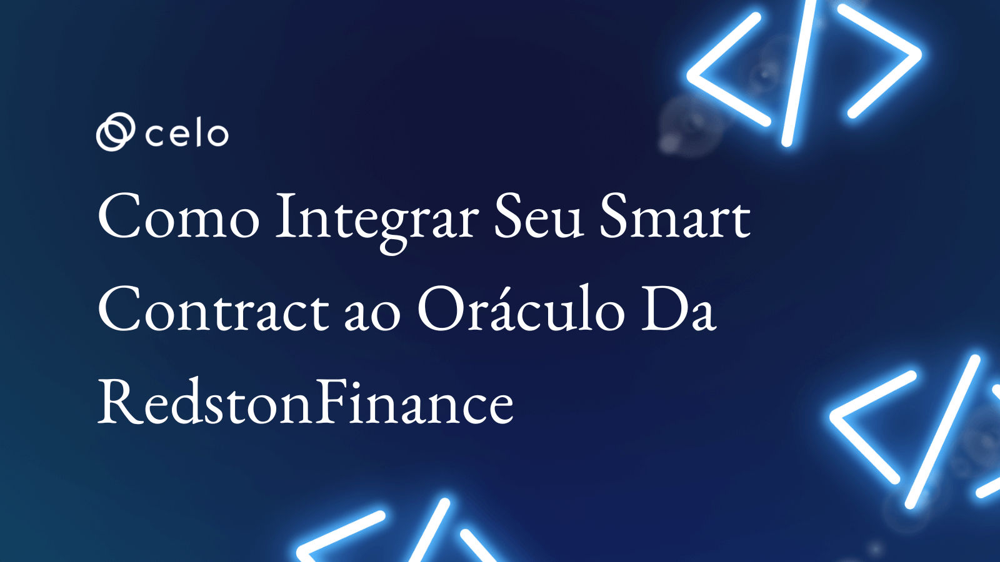

import YouTube from '@components/YouTube';

## Introdução

Nesse tutorial iremos aprender a como conectar seu smart contract à rede de oráculos da Redstone Finance.

## Pré-requisitos

Para este tutorial você precisará dos seguintes programas instalados em sua máquina:

- Node.js
- Visual Studio Code

E dos seguintes conhecimentos prévios:

- Solidity
- React.js
- TypeScript

## Assista o vídeo

Confira no video como criar um smart contract de aposta que funciona como uma roleta russa na blockchain Celo.

<YouTube videoId="ULPn1sNzaXg"/>

:::info Descrição

[Código](https://github.com/itxtoledo/celo-sage-examples/tree/main/russian-roulette-solidity)

:::

:::info Obtenha suporte

Entre no [Servidor Discord da Celo](https://chat.celo.org/) ou acesse diretamente o canal em português
[aqui](https://discord.com/channels/600834479145353243/956679819406491708).

:::
