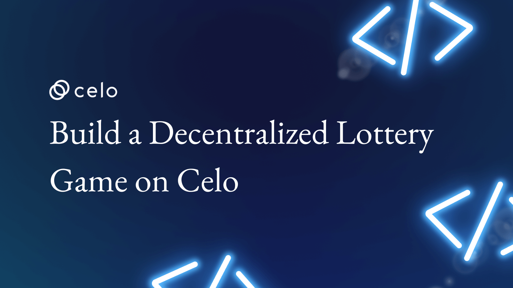
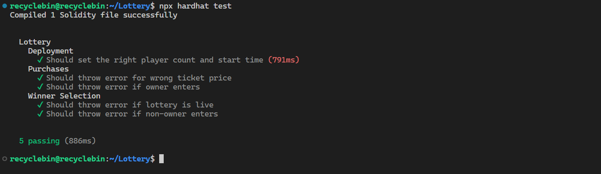
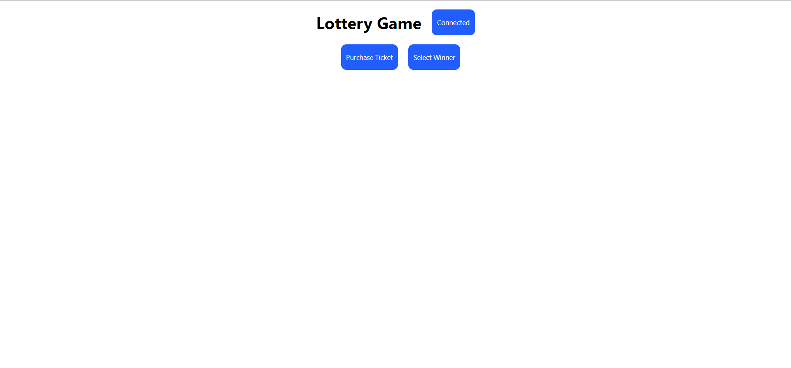
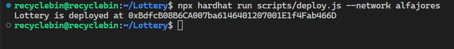

## Introduction

Welcome to a step-by-step guide to creating a decentralized lottery game. This tutorial will take you through the process of generating a random number on Celo and using it to build a functional decentralized lottery game with a user-friendly web app. By the end, you'll have a solid understanding of how to create a decentralized lottery game using smart contracts and a web app that interacts with it. Additionally, you'll have a working decentralized lottery game that can serve as a foundation for future projects. Let's get started!

## Prerequisites

It's recommended that you have a basic understanding of Solidity, JavaScript, and React to follow this tutorial. Familiarity with Hardhat is helpful but not necessary, as the tutorial will cover the basics. Having a grasp of these technologies will make it easier to understand and follow along, but even without prior experience, you'll still learn a lot from this tutorial.

## Requirements

This tutorial requires Node.js to run and test Solidity code. To check if Node.js is installed, run this command in the terminal:

```bash
node -v
```

If Node.js isn't installed, download it from the [official website](https://nodejs.org/) and follow the installation instructions. Once Node.js is installed, you can proceed with the tutorial.

## How the Lottery Game Works

Our lottery game runs for a fixed timeframe and participants can join by paying a fee of 1 Celo. At the end of the game, the winner is selected, and all collected fees go to them.

For this tutorial, the game duration is set to 30 minutes after deployment. The winner is selected using on-chain randomness. To learn more about the on-chain randomness generation, refer to [this page](https://docs.celo.org/protocol/randomness).

## Setting Up the Hardhat Project

To set up a new Hardhat project for this tutorial, follow these steps:

- Create a directory called `Lottery` and open it in your code editor.
- In the terminal, run the following command to set up the Hardhat project:

```bash
npx hardhat .
```

This will create the necessary files and directories, such as a `package.json` file and a `contracts` directory for your Solidity code.

- Remove all files from the `contracts` and `test` directories, and create a new Solidity file called `Lottery.sol` in the `contracts` directory and a new test file called `lottery.test.js` in the `test` directory.
- Run the following command in the terminal to install dependencies:

```bash
npm install dotenv
```

Now you are ready to start coding your smart contract for the lottery game. The installed dependency will be used later in the tutorial.

## Lottery Smart Contract Development

To write the smart contract for the lottery game, Open `Lottery.sol` and begin coding. Start by using the `pragma` directive to specify the compatible version of Solidity. Then, define an empty smart contract named `Lottery` to implement all the game functions.

Also, include the interfaces of the contracts that generate randomness. These interfaces are `IRegistry` for the `Registry` contract that stores updated addresses of various contracts, and `IRandom` for the `Random` contract that generates randomness.

```solidity
// SPDX-License-Identifier: MIT
pragma solidity ^0.8.17;

interface IRegistry {
    function setAddressFor(string calldata, address) external;

    function getAddressForOrDie(bytes32) external view returns (address);

    function getAddressFor(bytes32) external view returns (address);

    function getAddressForStringOrDie(
        string calldata identifier
    ) external view returns (address);

    function getAddressForString(
        string calldata identifier
    ) external view returns (address);

    function isOneOf(bytes32[] calldata, address) external view returns (bool);
}

interface IRandom {
    function revealAndCommit(bytes32, bytes32, address) external;

    function randomnessBlockRetentionWindow() external view returns (uint256);

    function random() external view returns (bytes32);

    function getBlockRandomness(uint256) external view returns (bytes32);
}

contract Lottery{

}
```

To store data and track events on the blockchain, we will add the following variables and mappings to the `Lottery` smart contract:

`address owner`: this variable will store the address of the contract owner.

`uint256 public endTime`: this variable will store the timestamp when the game will end.

`uint256 public playerCount`: this variable will store the number of players who have entered the lottery.

`mapping(uint => player) players`: this mapping will store the players who have entered the lottery.

`event enteredLottery(address player)`: this event will be emitted when a player enters the lottery.

`event announceWinner(address winner)`: this event will be emitted when the winner is announced.

```solidity
contract Lottery {

  address owner;
    uint256 public endTime;
    uint256 public playerCount;

    struct player {
        address player;
        bool entered;
    }

    mapping(uint => player) players;

    event enteredLottery(address player);
    event announceWinner(address winner);

  // All the functions in the contract should be placed below this line.

}
```

Let's write the constructor, which will set the end time of the game and the owner. The end time will be 30 minutes after the deployment of the contract, and the owner will be whoever deploys the contract.

```solidity
  constructor() {
        endTime = block.timestamp + 30 minutes;
    owner = msg.sender;
    }
```

The next step is to write the `getRandom`function. This function will generate a random number using the `Random` contract. First, the function will get the address of the `Random` contract using the `getAddress` function of the `Registry` contract. Then, the function will pass that address to the `IRandom` interface and call the `random` function, which will return a random value of type `bytes32`.

```solidity
  function getRandom() internal view returns (bytes32 randomness) {
    randomness = IRandom(
          IRegistry(0x000000000000000000000000000000000000ce10).getAddressFor(
              keccak256(abi.encodePacked("Random"))
            )
        ).random();
    }
```

To allow players to enter the lottery, we will write the `purchaseTicket` function. Players must pay a fee of 1 Celo to enter the game. The function will allow players to enter the lottery only if the following conditions are met:

- The game has not ended
- The correct ticket price has been paid
- The player is not the owner

If all conditions are met, the function will add the player's details to the `players` mapping, emit the `enteredLottery` event with the player's address, and increase the `playerCount`.

```solidity
  function purchaseTicket() public payable {
    require(block.timestamp <= endTime, "Lottery has ended");
      require(msg.value == 1 ether, "Incorrect ticket price");
    require(msg.sender != owner, "Owner can not enter lottery");
          
    players[playerCount] = player(msg.sender, true);
          
    emit enteredLottery(msg.sender);
  
    playerCount++;
    }
```

To complete the lottery game, we need a function for selecting the winner from all the players. To do this, we will write a `selectWinner` function that will allow the owner to select the winner after the end of the game.

If the game has ended and the owner has called the function, we will generate randomness using the `getRandom` function and determine the index of the winner. To end the game, we will emit an event called `announceWinner` and send the collected fees as a reward to the winner's address.

```solidity
  function selectWinner() public payable {
        require(block.timestamp > endTime, "Lottery has not ended");
    require(msg.sender == owner, "Only the owner can select the winner");
  
    uint256 winnerIndex = uint256(getRandom()) % playerCount;
      address winner = players[winnerIndex].player;
          
    emit announceWinner(winner);
  
    payable(winner).transfer(address(this).balance);
    }
```

We have completed the smart contract for the game. Now, let's begin testing the contract.

## Testing Smart Contract

We have completed writing the smart contract, now it's time to test its functionality. To do so, we first need to import some necessary modules for testing in the `lottery.test.js`.

```js
const {
 time,
 loadFixture,
} = require("@nomicfoundation/hardhat-network-helpers");
const { expect } = require("chai");
const { minutes } = require("@nomicfoundation/hardhat-network-helpers/dist/src/helpers/time/duration");
const { ethers } = require("hardhat"); 
```

Next, we can create a describe block that will contain all of our tests. First, we will create a fixture to set up the test environment by deploying our contract and creating dummy accounts for testing.

```js
describe("Lottery", function() {
  async function deployFixture() {
    const [owner, otherAccount] = await ethers.getSigners();

    const Lottery = await ethers.getContractFactory("Lottery");
    const lottery = await Lottery.deploy();

    return { lottery, owner, otherAccount };
  }

  // Start of Tests

  // End of Tests
});
```

We will organize our tests into three separate `describe` blocks for deployment, ticket purchase, and winner selection. To begin, we will test if the initial state of the contract is set correctly after deployment. For this, we will deploy the contract and verify that the owner and end of the game match the expected values.

```js
describe("Deployment", function() {
  it("Should set the right player count and start time", async function() {
    const { lottery } = await loadFixture(deployFixture);

    expect(await lottery.playerCount()).to.equal(0);
    expect(await lottery.endTime()).to.equal(await time.latest() + minutes(30));
  });
});
```

Next, we will test the ticket purchasing feature. In this test, we will verify the `purchaseTicket` function for the following conditions:

- Ensure that a user can purchase a ticket by paying the correct ticket price.
- Ensure that the owner is restricted from purchasing a ticket.

```js
describe("Purchases", function () {
 it("Should throw error for wrong ticket price", async function() {
  const { lottery, otherAccount } = await loadFixture(deployFixture);

  await expect(lottery.connect(otherAccount).purchaseTicket({ value: 2 }))
   .to.be.revertedWith("Incorrect ticket price");
 });

 it("Should throw error if owner enters", async function() {
  const { lottery } = await loadFixture(deployFixture);

  await expect(lottery.purchaseTicket({ value: ethers.utils.parseUnits("1", "ether") }))
   .to.be.revertedWith("Owner can not enter lottery");
 });
});
```

Finally, we will test the `selectWinner` function for the following conditions:

- Ensure that winner selection is only possible after the end of the game.
- Ensure that only the owner can execute this function.

```js
describe("Winner Selection", function() {
  it("Should throw error if lottery is live", async function() {
    const { lottery } = await loadFixture(deployFixture);

    await expect(lottery.selectWinner()).to.be.revertedWith("Lottery has not ended");
  });

  it("Should throw error if non-owner enters", async function() {
    const { lottery, otherAccount } = await loadFixture(deployFixture);

    time.increaseTo(await time.latest() + minutes(30));

    await expect(lottery.connect(otherAccount).selectWinner()).to.be.revertedWith("Only the owner can select the winner");
  });
});
```

Run the following command in the terminal to execute all tests:

```bash
npx hardhat test
```

Test results:



## Compiling the Contract

The ABI, or Application Binary Interface, is necessary for interacting with the contract from the frontend. To generate the ABI, we can compile the contract. The following terminal command will compile the contract and create two directories, `artifacts` and `cache`:

```bash
npx hardhat compile
```

The `artifacts` directory will be a `Lottery.json` file that can be used in the frontend.

## Lottery Game Frontend

We will build the frontend for the Lottery Game using React. Our focus while building the frontend will be on interactions between the wallet and the contract. The interactions that a user will have while playing the game can be divided into two categories:

- Wallet Interactions: Initial connection with the wallet
- Contract Interactions:
  - Purchase a ticket or enter the game (for players)
  - Select a winner (for the owner)

Let's examine how these actions can be performed on the frontend. Before we begin building the frontend, we need to set up the React project. To set up the React project, run the following command in the terminal:

```bash
npx create-react-app frontend
cd frontend
```

Next, we'll install the `ethers` library to interact with the wallet and contract. Use `npm` to install it:

```bash
npm install ethers
```

To create the frontend, open App.js and remove all existing code. Replace it with the following snippet to create a basic structure for our app:

```js
import "./App.css";
import { useState } from "react";
/* 
NOTE: After deploying the contract you have to change this variable to
   address of your contract.
*/
const address = "0xB06779b05cfaa33Eee1E0eB0B66A7C68b50Ab72f"

function App() {
  const [contract, setContract] = useState();
 
  const connect = async () => { 
      // implementation of connect function
  };
  const purchaseTicket = async () => { 
      // implementation of purchaseTicket function
  };
  const selectWinner = () => { 
      // implementation of selectWinner function
  };

  return (
      <div className="App">
          <div className="row">
              <h1>Lottery Game</h1>
              <button onClick={connect}>
                  {contract ? "Connected" : "Connect"}
              </button>
          </div>
          <div className="row">
              <button onClick={purchaseTicket}>Purchase Ticket</button>
              <button onClick={selectWinner}>Select Winner</button>
          </div>
      </div>
  );
}
```

We have a variable called `address` located above the `App` component. It will store the address of our contract which we will retrieve after deployment. Currently, it is a dummy address so that we can build the frontend without encountering any errors. We have also created a state variable called `contract` using the `useState` hook.

We have several functions that we will implement as we progress, but before that, let's import `ethers` which will assist us with wallet interactions.

```js
import { ethers } from "ethers";
```

We also need to import the `Lottery.json` file that was generated from compiling the smart contract and contains the ABI.

Earlier, we compiled the contract and this generated the `artifacts` directory, which contains a `Lottery.json` file in the `contracts/Lottery.sol` directory. Copy this file and paste it into the `src` directory of the `frontend` directory.

To import both components, add the following code snippet at the top of the file:

```js
import data from "./Lottery.json";
```

As discussed, the frontend will perform three actions, each with its associated function. Let's write the `connect` function to handle the first action, which is connecting with the wallet.

The `connect` function starts by checking if the user's browser has an Ethereum provider such as MetaMask enabled. If it does, the function creates a new `Web3Provider` instance using the `ethereum` object and requests the user's accounts. It then stores the first account in the returned array in the `account` variable.

Next, the function creates an instance of `ethers.Contract` using the contract's address, ABI, and signer (the provider's signer). Finally, it sets the contract instance in the `setContract` variable for later use.

If no Ethereum provider is found, the function logs a message to install a Celo wallet.

```js
const connect = async () => {
  const { ethereum } = window;
  if (ethereum) {
   const provider = new ethers.providers.Web3Provider(ethereum);
   const accounts = await provider.send("eth_requestAccounts", []);
   const account = accounts[0];
   console.log(account);
   const signer = provider.getSigner();
   const contract = new ethers.Contract(address, data.abi, signer);
   setContract(contract);
  } else {
   console.log("Install any Celo wallet");
  }
 };
```

The next function we can write is called `purchaseTicket`, which will allow players to enter the game by paying a small fee of 1 Celo.

This function uses the `contract` state variable to call the `purchaseTicket()` function on the smart contract, and passes in the value of 1 Celo, which is expressed as `ethers.utils.parseUnits("1", "ether")`.

A try-catch block is used to handle any errors that may occur when calling the `purchaseTicket()` function of the contract. The returned value from the smart contract function is stored in the `result` variable. If there is an error, an error message is logged. Regardless of the outcome, the function logs the `result` variable at the end.

```js
const purchaseTicket = async () => {
  try {
   const result = await contract.purchaseTicket({ value: ethers.utils.parseUnits("1", "ether") });
   console.log(result);
  } catch (error) {
   console.error(error.reason);
  }
}
```

The next function we can write is `selectWinner` which will be used by the owner to select the winner of the game.

The function uses the `contract` state variable to call the `selectWinner()` function on the smart contract.

The function uses a try-catch block to handle any errors that may occur when calling the `selectWinner()` function of the contract. The `result` variable stores the returned value from the smart contract function. If there is an error, the error message is logged. Finally, the function logs the `result` variable regardless if there is an error or not.

```js
const selectWinner = async () => {
  try {
   const result = await contract.selectWinner();
   console.log(result);
  } catch (error) {
   console.error(error.reason);
  }
};
```

Add the following CSS to the `App.css` file for styling the app.

```css
.App {
   display: flex;
   flex-direction: column;
   justify-content: center;
   align-items: center;
}

.row {
   display: flex;
   flex-direction: row;
   justify-content: center;
   align-items: center;
   flex-wrap: wrap;
   align-content: space-between;
   width: 500px;
}

button {
   background-color: #225dff;
   border: none;
   border-radius: 10px;
   padding: 10px;
   margin-left: 20px;
   height: 50px;
   font-family: inherit;
   cursor: pointer;
   color: #ffffff;
}
```

Our app is functional and looks adequate. Let's now deploy the contract and test if the app operates correctly.



## Contract Deployment

To deploy the contract, changes must be made to `hardhat.config.js`. Firstly, the `dotenv`
 the module must be loaded to read the private key from an environment variable:

```js
require("dotenv").config();
```

Next, create an `.env` file and store the private key for your deployer wallet. You can either create a new deployer wallet or use an existing one and ensure that you have a sufficient amount of testnet Celo tokens to pay for the deployment. You can obtain testnet Celo tokens from the [faucet](https://celo.org/developers/faucet).

```js
PRIVATE_KEY = "YOUR_PRIVATE KEY"
```

Then, add configuration for the Alfajores testnet and Celo mainnet in the `module.exports` object:

```js
defaultNetwork: "hardhat",
networks: {
  hardhat: {
  },
  alfajores: {
    url: "https://alfajores-forno.celo-testnet.org",
    accounts: [process.env.PRIVATE_KEY],
    chainId: 44787,
  },
  celo: {
    url: "https://forno.celo.org",
    accounts: [process.env.PRIVATE_KEY],
    chainId: 42220,
  },
},
```

Before deployment, create a script to deploy the contract. In the `scripts` directory, you can modify the `deploy.js` file to deploy the contract. Open the file and paste the following code into `deploy.js`:

```js
const hre = require("hardhat");

async function main() {
  try {
   const Lottery = await hre.ethers.getContractFactory("Lottery");
   const lottery = await Lottery.deploy();
 
   await lottery.deployed(); 
 
   console.log(`Lottery is deployed at ${lottery.address}`);
  } catch (error) {
   console.error(`Error deploying the Lottery contract: ${error.message}`);
  }
}

main().catch((error) => {
   console.error(error);
   process.exitCode = 1;
});
```

We first load the `hardhat` module and create the `main` function to deploy the contract.

Within `main`, we use `getContractFactory` to create an instance of the contract and then call the `deploy` method on that instance to deploy the contract. Note that the contract deployment does not occur immediately, so we call the `deployed` method of `lottery` (of type `Contract`) to return a promise that resolves after a successful deployment or rejects if there is an error.

In the end, we simply log the address of the deployed contract to the console, which can be copied and added to the frontend.

To deploy the contract, run the following command in the terminal:

```bash
npx hardhat run scripts/deploy.js --network alfajores
```

The output of the command:



## Playing the Lottery Game

The demo game is deployed [here](https://dl-celo.netlify.app/). For the demo game, the time frame will 2 weeks so when you’re checking the game it might have ended.

## Conclusion

In conclusion, this tutorial successfully demonstrated how to generate on-chain randomness using the Random contract deployed by the Celo team. Through the creation of a lottery game contract and accompanying web app, we were able to effectively utilize this on-chain randomness in a practical and engaging manner. This tutorial serves as a valuable resource for those looking to gain a deeper understanding of on-chain randomness and its practical applications in decentralized applications.

## Next Steps

So, you've reached the end of the tutorial! Congratulations, you're now a master of on-chain randomness and lottery games. If you've built something amazing, don't keep it to yourself! Share it with me on the [Celo discord](https://discord.gg/celo). I'm always there, probably for too long, but I'd love to see what you've created.

But don't stop here! You can elevate your game by adding notifications to the web app, so players can see exactly what error was thrown. You can also expand the game contract to handle multiple games or create a reward distribution system for multiple players. The possibilities are endless!

So, if you add a little extra something special to your game, you know what to do. Show it off on the [discord](https://discord.gg/celo)! Let's see who can make the most creative and exciting lottery game.

## About the Author

Nikhil Bhintade is a product manager and technical writer who is always on the lookout for anything new in technology. He has a great understanding of technology and always looks for new ways to improve it.

When he's not busy writing compelling product stories and technical documents, you can find him tinkering on [GitHub](https://github.com/nikbhintade), where he shares his latest projects. And if you're looking to connect with a tech industry insider, you can always find him on [LinkedIn](https://linkedin.com/in/nikbhintade), where he's always happy to chat about the latest trends and developments.

## References

Celo Randomness: [link](https://docs.celo.org/protocol/randomness)
