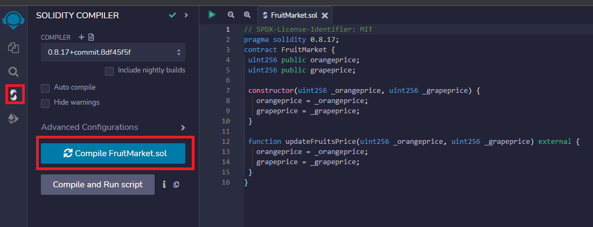
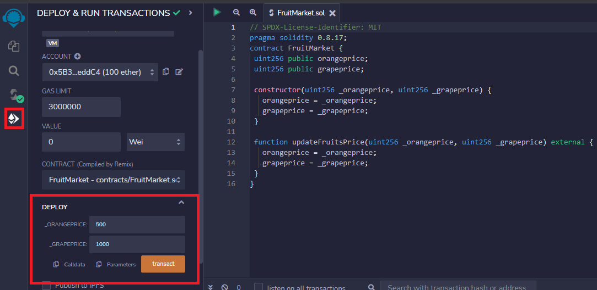
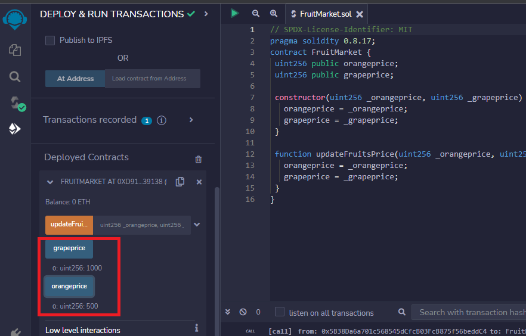
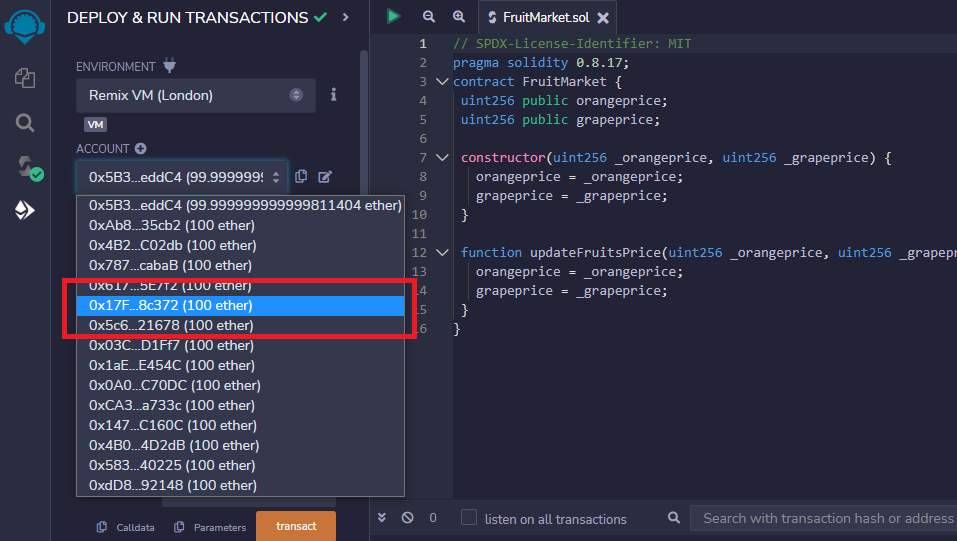
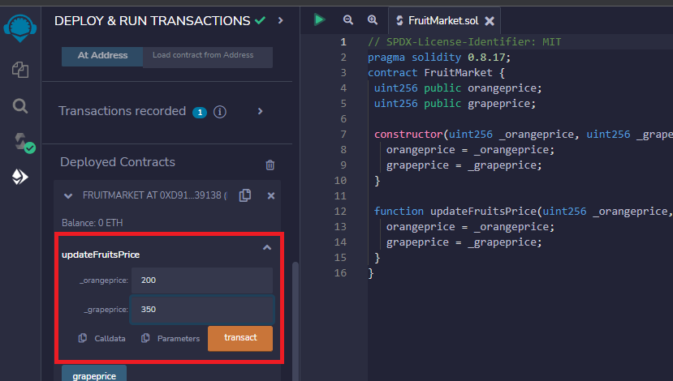
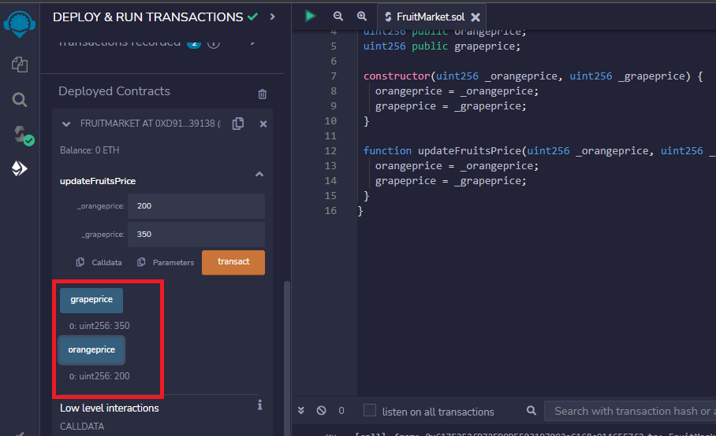
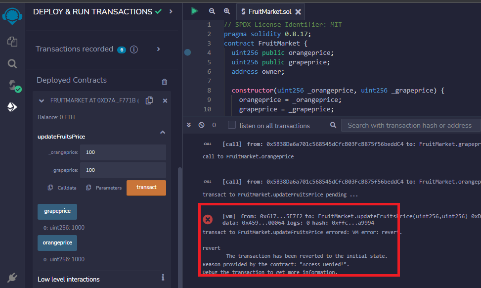
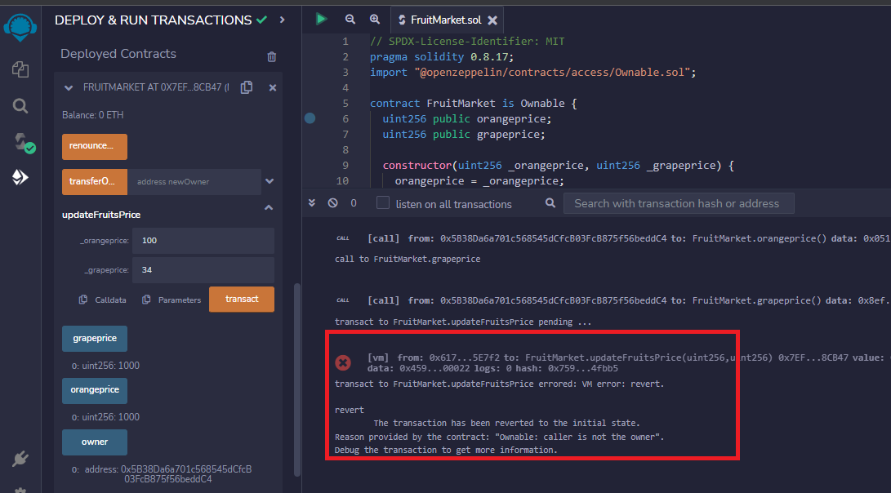

## Introduction

When creating a smart contract, we want to ensure that we prevent anyone from gaining unauthorized access to our contract to fend off contract manipulation.

In Solidity, an ownership attack takes advantage of a smart contract's vulnerabilities and gives illegal and unauthorized access to a foreign party, i.e., another contract or person. This access will allow the person or contract to perform desired operations without restriction.

In this article, we will look at an example of how the ownership attack works. We will also consider two methods to prevent this from happening to our contracts.

## Prerequisites

To properly understand this guide, you must have a solid knowledge of creating smart contracts with Solidity. The link below will come in handy:

<https://docs.celo.org/blog/tutorials/solidity-from-zero-to-hero>

## Requirements

To code along with this guide, you must set up a text editor or IDE.

## Code Demonstration: Ownership Attack in Solidity

For a practical demonstration of the ownership attack, let us consider a simple contract that serves as a fruit market. In this market, oranges and grapes are available for sale. This market owner can update these fruits' prices at will.

```solidity

// SPDX-License-Identifier: MIT
pragma solidity 0.8.17;
contract FruitMarket {
  uint256 public orangeprice;
  uint256 public grapeprice;

  constructor(uint256 _orangeprice, uint256 _grapeprice) {
    orangeprice = _orangeprice;
    grapeprice = _grapeprice;
  }

  function updateFruitsPrice(uint256 _orangeprice, uint256 _grapeprice) external {
    orangeprice = _orangeprice;
    grapeprice = _grapeprice;
  }
}

```

As mentioned earlier, the above code snippet is a contract that allows the owner to update the prices of fruits whenever necessary.
The contract first declares two state variables to hold the prices of oranges and grapes. They are `orangeprice` and `grapeprice`.

```solidity

uint256 public orangeprice;
uint256 public grapeprice;

```

The contract also has a `constructor` used to set each fruit's initial price. When the contract is about to be deployed, we will have to set the prices with the `constructor` for a successful deployment.
To set the prices, the `constructor` uses two arguments, `_orangeprice` and `_grapeprice`. It then assigns the value of these arguments to the state variables earlier defined.

```solidity

constructor(uint256 _orangeprice, uint256 _grapeprice) {
  orangeprice = _orangeprice;
  grapeprice = _grapeprice;
}

```

Finally, the contract has a function called `updateFruitsPrice()`. This function updates the fruit price. It works similarly to the `constructor`. The difference is that this function can be called anytime, while the `constructor` is called during deployment. We use the `external` keyword when defining the function so that anyone can call it.

```solidity

function updateFruitsPrice(uint256 _orangeprice, uint256 _grapeprice) external {
  orangeprice = _orangeprice;
  grapeprice = _grapeprice;
}

```

Now that we understand the code snippet let us test it to see how it works. To do this, we need an IDE for solidity. We can make use of the [remix IDE](https://remix.ethereum.org/). Let us follow the following steps:
**Step 1:** Compile the solidity contract. We need to compile the contract to ensure that our code has no syntax errors.



**Step 2:** The next thing we need to do is to deploy the contract. We will set the initial prices of the fruits when doing this. The deployed contract will appear at the bottom.



**Step 3:** After we deploy our contract, let us check the current prices of the fruits. They should match the prices we set when deploying the contract.



**Step 4:** Now that we have confirmed the prices of the fruits, let us switch our account. This new account will serve as the account of the attacker. We can use any account that we want.



**Step 5:** Next, we will change the prices of the fruits with this new account. To do this, we have to call the `updateFruitsPrice()` function. Since the function is `external`, any account can call it.



**Step 6:** Now that we have altered the prices of the fruits, let us check if this will truly affect the prices we initially set.



We can observe that the prices of the fruits are lesser than the original amount set by the `owner` account, i.e., the first account we used to deploy the code.

From the above demonstration, we can see how a completely different account easily altered the prices of the fruits. Many problems can arise from this, especially if the code is more complex and contains sensitive information. The contract will be unstable and compromised.

## How to Prevent an Ownership Attack on Solidity Smart Contracts

Two ways are available to protect our contracts against the ownership attack. The underlying principles of both ways revolve around setting some access control in our contracts. Doing this will require an account to be authorized before performing certain operations. Let us have a look at these methods.

## Prevent Ownership Attacks in Solidity Manually

This method will prevent an ownership attack without importing any external libraries or inheriting from an external source. Let us consider the code below:

```solidity

// SPDX-License-Identifier: MIT
pragma solidity 0.8.17;
contract FruitMarket {
  uint256 public orangeprice;
  uint256 public grapeprice;

        // create owner variable
  address owner;

  constructor(uint256 _orangeprice, uint256 _grapeprice) {
    orangeprice = _orangeprice;
    grapeprice = _grapeprice;

                // initialize owner variable to be msg.sender
    owner = msg.sender;
  }

                // create a modifier to check if the caller is the owner of the contract
    modifier IsOwner(){
    require(msg.sender == owner, "Access Denied!");
    _;
  }

        //modify the update function to make use of IsOwner() modifier
  function updateFruitsPrice(uint256 _orangeprice, uint256 _grapeprice) external IsOwner{
    orangeprice = _orangeprice;
    grapeprice = _grapeprice;
  }
}

```

In the above code, we can notice some changes. The first thing new in this code is the introduction of a new variable called `owner`. It is an address.

```solidity

// create owner variable
address owner;

```

We can also notice some changes in the `constructor`. The change included setting the value of the `owner` variable to `msg.sender`. With this, whoever deploys the contract will own the contract.

```solidity

constructor(uint256 _orangeprice, uint256 _grapeprice) {
  orangeprice = _orangeprice;
  grapeprice = _grapeprice;

  // initialize owner variable to be msg.sender when deployed
  owner = msg.sender;
}

```

The code also contains a `modifier`. This `modifier` first checks if the caller is the contract's owner and calls `theupdateFruitsPrice()` function if the check passes. If the check fails, the transaction will fail. The program will also send a message that says, "Access Denied!"

```solidity


//create a modifier to check if the caller is the owner of the contract
modifier IsOwner(){
  require(msg.sender == owner, "Access Denied!"); //check if caller is owner
  _; //perform function
}

```

The last modification in the code is done to the `updateFruitsPrice()` function. Here, the `IsOwner()` modifier is added to the function.

```solidity

//modify the update function to make use of IsOwner() modifier
function updateFruitsPrice(uint256 _orangeprice, uint256 _grapeprice) external IsOwner{
  orangeprice = _orangeprice;
  grapeprice = _grapeprice;
}

```

Now that we have analyzed the code let us test it on the remix IDE. We will follow the same steps as we did earlier. This time, when we try to change the prices of fruits with an unauthorized account, we will get an error, and the transaction will fail. A message that says “Access Denied!” will also be sent.



We have already seen one way of preventing our contracts from the ownership attack in Solidity. We did this successfully without importing any library. We will use an external library to protect our contract in the second method.

## Prevent Ownership Attack in Solidity with OpenZeppelin

In this method, we will prevent our contracts from being exploited by using the `Ownable` contract in [OpenZeppelin](https://www.openzeppelin.com/). We will modify our contract to inherit from the `Ownable` contract.
This method is more efficient because we will be writing less code, and since OpenZeppelin is trusted, our code will be safe from mistakes we might make if we try to do this manually. Let us review the following code:

```solidity

// SPDX-License-Identifier: MIT
pragma solidity 0.8.17;
import "@openzeppelin/contracts/access/Ownable.sol";

contract FruitMarket is Ownable {
  uint256 public orangeprice;
  uint256 public grapeprice;

  constructor(uint256 _orangeprice, uint256 _grapeprice) {
    orangeprice = _orangeprice;
    grapeprice = _grapeprice;
  }

  function updateFruitsPrice(uint256 _orangeprice, uint256 _grapeprice) external onlyOwner {
    orangeprice = _orangeprice;
    grapeprice = _grapeprice;
  }
}

```

When we look at the code, we can see that `Ownable` is imported into the code.

```solidity

import "@openzeppelin/contracts/access/Ownable.sol";

```

After this, there is a change to our `FruitMarket` contract. It has now inherits from `Ownable`. This is done with the `is Ownable` added to it.

```solidity

contract FruitMarket is Ownable

```

We have also removed the extra variables and the `modifier` from the code. In our code, we have added `onlyOwner()` to the `updateFruitesPrice()` function. `onlyOwner()` is a modifier that is in the `Ownable` contract. Since our code inherits this contract, we do not need to write the `onlyOwner()` modifier manually.

```solidity

//add onlyowner() to function
function updateFruitsPrice(uint256 _orangeprice, uint256 _grapeprice) external onlyOwner {
  orangeprice = _orangeprice;
  grapeprice = _grapeprice;
}

```

The code we just analyzed will perform in the same manner as the one we implemented manually. When an authorized user tries to update the prices of the fruits, the transaction will fail. Apart from this, we can also notice some extra functions on the left side of the IDE. The Ownable contract provides these functions.



## Conclusion

This article shows us the risk of leaving our contracts without access control. We have also seen ideal ways to prevent our contracts from ownership attacks. We must practice safe methods to write our codes in Solidity. A slight mistake can cause unpleasant experiences for us and whoever will use our contracts for larger projects.

## Next Steps

After learning about the ownership attack in Solidity, the next thing to do is to implement its preventive measures in future codes. It is also important to learn about more vulnerabilities in Solidity. Check out the following links to learn more:

- <https://docs.celo.org/blog/tutorials/solidity-vulnerabilities-delegated-call>
- <https://docs.celo.org/blog/tutorials/preventing-vulnerabilities-in-solidity-denial-of-service-attack>

## References

- [OpenZeppelin](https://github.com/OpenZeppelin/openzeppelin-contracts)
- [Solidity vulnerabilities](https://blog.sigmaprime.io/solidity-security.html)
- [Remix IDE](http://remix.ethereum.org/)

## Author

[Oyeniyi Abiola Peace](https://twitter.com/_iamoracle) is a seasoned software and blockchain developer. With a degree in Telecommunication Science from the University of Ilorin and over five years experience in JavaScript, Python, PHP, and Solidity, he is no stranger to the tech industry. Peace currently works as the CTO at DFMLab and is a Community Moderator at Celo Blockchain. When he's not coding or teaching, he loves to read and spend time with family and friends.
