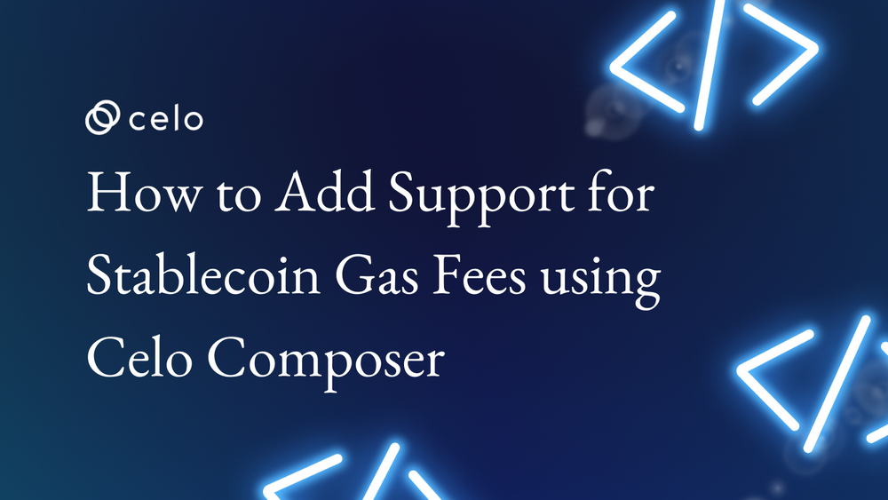
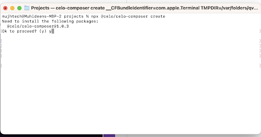
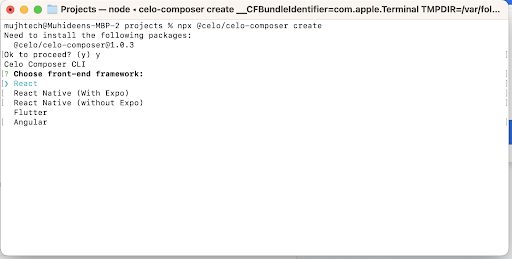
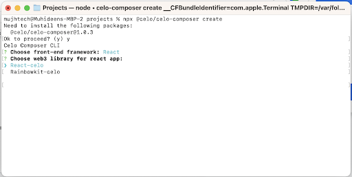
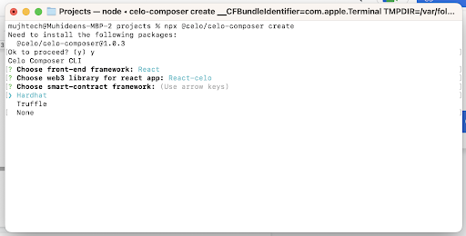
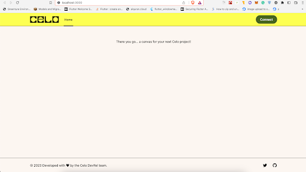
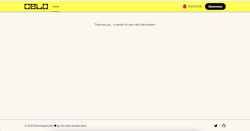
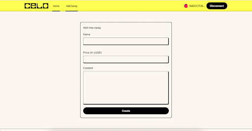
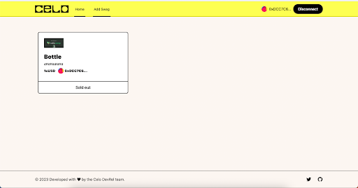

## Introduction

This tutorial will show you how to use Celo Composer to add support for stablecoin gas fees. A command-line interface (CLI) tool called Celo Composer enables programmers to communicate with the Celo platform and create decentralized apps (dApps) on top of it. You may build a smart contract using Celo Composer and incorporate it into your dApp to manage stablecoin payments for gas costs.

## Prerequisites

The assumption made in this tutorial is that you are already familiar with solidity and are aware of how smart contracts operate. It will be expected that you are familiar with how to use your preferred web3 tooling to deploy smart contracts to a network (Hardhat, Truffle, etc). Due to Celo's compatibility with the Ethereum Virtual Machine (EVM), all the languages and workflows you learnt when developing for other EVM chains also apply to Celo.

- Basic knowledge of JavaScript and ReactJS.
- Understanding of the basics of blockchain and Ethereum.
- Knowledge of Solidity, the programming language for - writing smart contracts on CELO.
- A wallet for interacting with the CELO network, such as Celo Wallet Extension, Valora etc.
- Understanding of concepts like smart contract deployment, transactions, gas, and Web3 providers.

## Getting Started

To bootstrap our React DAPP, we will be using **Celo Composer**.

### Celo Composer

Celo Composer allows you to quickly build, deploy, and iterate on decentralized applications using Celo. It provides several frameworks, examples, and Celo-specific functionality to help you get started with your next dApp.

You can check out Celo Composer here [https://github.com/celo-org/celo-composer/tree/main/packages/react-app](https://github.com/celo-org/celo-composer/tree/main/packages/react-app).

To start our React App Project, we will use the Celo Composer CLI; the CLI makes it easy for us to select the options that we want when bootstrapping our dApp. Run this on your terminal

```bash
npx @celo/celo-composer create
```



- If you don’t have celo-compoer installed press enter to continue
- Choose React when asked for the framework



- Then choose React Celo for the web3 library



Choose hardhat (Only Hardhat is available at the time of writing this tutorial)



- Skip subgraph, we won’t use it in this tutorial.
 
Your Project will now be created; you can check to make sure it has the following folders

- packages/hardhat - Your Hardhat Folder - Where you can keep your Contracts
- packages/react-app - Your React project

## Setup the Smart Contract

- Open your Hardhat project folder (packages/hardhat)

- Copy the .envexample to a new file called .env. This is where the private key you use to deploy your contracts will be saved.

- Fill in the private key with your Celo wallet private key. You might want to get some Alfajores (Testnet) coins from the Celo Faucet

- Open your Contracts folder (packages/hardhat/contracts)

- Add a new contract in the folder called CeloMarketPlace.sol

```solidity
// SPDX-License-Identifier: MIT


pragma solidity >=0.7.0 <0.9.0;


interface IERC20Token {
   function transfer(address, uint256) external returns (bool);


   function approve(address, uint256) external returns (bool);


   function transferFrom(address, address, uint256) external returns (bool);


   function totalSupply() external view returns (uint256);


   function balanceOf(address) external view returns (uint256);


   function allowance(address, address) external view returns (uint256);


   event Transfer(address indexed from, address indexed to, uint256 value);
   event Approval(
       address indexed owner,
       address indexed spender,
       uint256 value
   );
}


contract CeloMarketPlace {
   uint256 internal productsLength = 0;
   address internal cUsdTokenAddress =
       0x874069Fa1Eb16D44d622F2e0Ca25eeA172369bC1;


   struct Product {
       address payable owner;
       string name;
       string image;
       string description;
       string location;
       uint256 price;
       uint256 sold;
   }


   mapping(uint256 => Product) internal products;


   function createProduct(
       string memory _name,
       string memory _image,
       string memory _description,
       string memory _location,
       uint256 _price
   ) public {
       uint256 _sold = 0;
       products[productsLength] = Product(
           payable(msg.sender),
           _name,
           _image,
           _description,
           _location,
           _price,
           _sold
       );
       productsLength++;
   }


   function getProduct(
       uint256 _index
   )
       public
       view
       returns (
           address payable,
           string memory,
           string memory,
           string memory,
           string memory,
           uint256,
           uint256
       )
   {
       Product storage product = products[_index];
       return (
           product.owner,
           product.name,
           product.image,
           product.description,
           product.location,
           product.price,
           product.sold
       );
   }


   function buyProduct(uint256 _index) public payable {
       require(
           IERC20Token(cUsdTokenAddress).transferFrom(
               msg.sender,
               products[_index].owner,
               products[_index].price
           ),
           "Transfer failed."
       );
       products[_index].sold++;
   }


   function getProductsLength() public view returns (uint256) {
       return (productsLength);
   }
}
```

The **CeloMarketPlace** contract implements the following functions:

**CreateProduct**: The **createProduct** function allows you to create a product that any other user can buy with a stable token cUSD and also pay a gas fee with a stable token.

**GetProduct**: The **getProduct** helps to retrieve all product on blockchain and display it in our frontend UI.

**BuyProduct**: The **buyProduct** function allows any user to buy a product already created on the blockchain.

**GetProductsLength**: The **getProductsLength** help us retrieve the number of product created.

Note: At the time of writing this article there is no way to implement paying the gas fee with a stable token in your smart contract but thanks to **@celo/contractkit** allow us to set what token to use for the gas fee in our frontend.

### Deploy Your Smart contract
 
Your hardhat project was set up with the hardhat-deploy plugin which makes deployments very easy.

To deploy, go to the deploy folder, open the 00-deploy.js file, and you will see an example deployment function for the existing Greeter contract.

Copy the 00-deploy.js file and paste it to a new file called 01-deploy-CeloMarketPlace.js.

Your hardhat-deploy plugin deploys your contracts serially using the naming of the file. So, when you run the deploy command, it will run the 00-deploy file first, and then run the 01-deploy-nftauction.js file next.

Now open the 01-deploy-NFTAuction.js file.

Your code should look like this

```javascript
await deploy(“CeloMarketPlace”, {
from: deployer,
args: [],
log: true,
})

module.exports.tags = ["CeloMarketPlace];
```

Deploy the Contracts by running the following commands on any terminal (make sure you are in the packages/hardhat directory)

```bash
npx hardhat deploy –network alfajores
```

If all is well, you should see a message from hardhat with the transaction hash of your Contract deployment and the address of your new Contract

You can now view your contract on the CELO explorer (Alfajores) using the address.

Now that we have deployed our contract let’s build the dApp.

## The UI

Switch to the angular project in your terminal

```bash
cd packages/react-app
```

Now install the needed packages

```bash
npm i or yarn i
```

Once the packages install, let’s run the code to see how it looks first with the base Celo composer code

Start the dApp and you are good to go.

```bash
yarn react-app:dev/npm run react-:dev
```



You can check how it functions at the moment by clicking the connect button.

Now that you can connect to a cryptocurrency wallet, the result of your connection is also shown to you. Let's now examine the code that resulted in that.



### ABI (Application Binary Interface)

We will need the ABI of our deployed contracts and the address deployed, to make any call to our smart contract.
Let’s copy our Contract ABIs into our project.

Create a folder name blockchain at the root of our project and create a json file with the contract name **CeloMarketPlace.json**.

Now go to the packages/hardhat/artifacts/contracts/**CeloMarketPlace.sol** file

Copy the ABI section of the json file and paste it into the **CeloMarketPlace.json** file you have just created. Copy only the Array, not the whole field.

### Add utils

We are going to create a folder for utils in our project directory named utils, basically we logger util and address util to validate and shorten the user address.

**Create address file**

Let’s create a file named address.ts in the utils folder at the root directory of the frontend app. In this file, we will have some functions like shortenAddress, normalizeAddress, validateAddress etc.

```javascript
import { getAddress, isAddress } from "@ethersproject/address";
import { logger } from "./logger";


export function isValidAddress(address: string) {
 // Need to catch because ethers' isAddress throws in some cases (bad checksum)
 try {
   const isValid = address && isAddress(address);
   return !!isValid;
 } catch (error) {
   logger.warn("Invalid address", error, address);
   return false;
 }
}


export function validateAddress(address: string, context: string) {
 if (!address || !isAddress(address)) {
   const errorMsg = `Invalid addresses for ${context}: ${address}`;
   logger.error(errorMsg);
   throw new Error(errorMsg);
 }
}


export function normalizeAddress(address: string) {
 validateAddress(address, "normalize");
 return getAddress(address);
}


export function shortenAddress(
 address: string,
 elipsis?: boolean,
 capitalize?: boolean
) {
 if (address === undefined) {
   return null;
 }
 validateAddress(address, "shorten");
 const shortened =
   normalizeAddress(address).substr(0, 8) + (elipsis ? "..." : "");
 return capitalize ? capitalizeAddress(shortened) : shortened;
}


export function capitalizeAddress(address: string) {
 return "0x" + address.substring(2).toUpperCase();
}


export function areAddressesEqual(a1: string, a2: string) {
 validateAddress(a1, "compare");
 validateAddress(a2, "compare");
 return getAddress(a1) === getAddress(a2);
}


export function trimLeading0x(input: string) {
 return input.startsWith("0x") ? input.substring(2) : input;
}


export function ensureLeading0x(input: string) {
 return input.startsWith("0x") ? input : `0x${input}`;
}

```

**Create logger file**

Let’s create a file named logger.ts in the utils folder at the root directory of the frontend app.

```javascript
export const logger = {
 debug: (...args: any[]) => console.debug(...args),
 info: (...args: any[]) => console.info(...args),
 warn: (...args: any[]) => console.warn(...args),
 error: (...args: any[]) => console.error(...args),
};

```

**Product utils**

Here, we define the product type interface and transformData function that can transform the incoming data from blockchain to product type

```javascript
export interface Product {
 index: number;
 name: string;
 creator: string;
 image: string;
 content: string;
 price: number;
 location: string;
 bought: boolean;
}


export const transformProductData = (data: any, i: number): Product => {
 return {
   index: i,
   creator: data[0],
   name: data[1],
   image: data[2],
   price: Number(data[5]),
   bought: Number(data[6]) == 1 ? true : false,
   content: data[3],
   location: data[4],
 };
};
```

**Upload to ipfs infura**

This is a simple function that uploads a media file to ipfs infura using ipfs-http-client npm package. Note: We later didn’t implement upload image for our product in this tutorial but just in case you might need it.

```javascript
import { create as ipfsHttpClient } from "ipfs-http-client";


const client = ipfsHttpClient({
 host: "https://ipfs.infura.io:5001/api/v0",
});


export const uploadToIpfs = async (e: any) => {
 const file = e.target.files[0];
 if (!file) return;
 try {
   const added = await client.add(file, {
     progress: (prog) => console.log(`received: ${prog}`),
   });
   return `https://ipfs.infura.io/ipfs/${added.path}`;
 } catch (error: any) {
   console.log("Error uploading file: ", error);
   if (error && error.message) {
     alert(error.message);
   }
 }
};
```

### Components

**Create Identicon Components**

Open the components folder then create a file name Identicon.tsx then paste the below code, here we create a component to render an Icon for users based on their wallet address

```javascript
import Jazzicon from "react-jazzicon";
import { CSSProperties, PureComponent } from "react";
import { isValidAddress, normalizeAddress } from "../utils/address";


type Props = {
 address: string;
 size?: number;
 styles?: CSSProperties;
};


// This should match metamask: https://github.com/MetaMask/metamask-extension/blob/master/ui/helpers/utils/icon-factory.js#L84
function addressToSeed(address: string) {
 const addrStub = normalizeAddress(address).slice(2, 10);
 return parseInt(addrStub, 16);
}


export class Identicon extends PureComponent<Props> {
 render() {
   const { address, size: _size } = this.props;
   const size = _size ?? 34;


   if (!isValidAddress(address)) return null;


   return (
     <Jazzicon diameter={size} seed={addressToSeed(address)} />
   );
 }
}
```

Open components/Header.tsx file

```javascript
let [componentInitialized, setComponentInitialized] = useState(false);
 let { initialised, address, connect, disconnect } = useCelo();


 useEffect(() => {
   if (initialised) {
     setComponentInitialized(true);
   }
 }, [initialised]);
```

Inside Header component, with useEffect we are checking if user already connect their wallet then show user their address and a disconnect button else a connect button. So basically we modified the section below to add user wallet address using one of the function we have in our utils/address.ts file and also created another components named Identicon to render an icon for for user based on their wallet address.

```javascript
      {componentInitialized && address ? (
        <>
          <Identicon address={address} size={24} />
          <span>{shortenAddress(address!, true, true)}</span>
          <button
            type="button"
            className="hidden sm:inline-flex content-center place-items-center rounded-full border border-wood bg-black py-2 px-5 text-md font-medium text-snow hover:bg-forest"
            onClick={disconnect}
          >
            Disconnect
          </button>
        </>
      ) : (
        <button
          type="button"
          className="inline-flex content-center place-items-center rounded-full border border-wood bg-forest py-2 px-5 text-md font-medium text-snow hover:bg-black"
          onClick={() =>
            connect().catch((e) => console.log((e as Error).message))
          }
        >
          Connect
        </button>
      )}
```

**Create Product Card**

Open the components folder, and create a file component to render the user product. Here our product card props have two values data with type Product & buy method means that the user will able to click on buy if the product is yet to be bought else the buy button is disabled.

```javascript
import { shortenAddress } from "@/utils/address";
import { Product } from "@/utils/product";
import Image from "next/image";
import { Identicon } from "./Identicon";


type Props = {
 data: Product;
 buy: () => void;
};


export default function ProductCard({ data, buy }: Props) {
 return (
   <div className="w-full md:w-1/2 lg:w-1/3 flex-shrink-[0] group p-0 m-0">
     <div className="mb-10 px-3 py-0 relative w-full inline-block flex-shrink-[0]">
       <div className="relative cursor-pointer w-full p-0 m-0">
         <div className="group-hover:-translate-x-2 group-hover:-translate-y-2 duration-75 transition ease-out bg-white relative border-black border-2 z-[2] rounded-[8px]">
           <div className="flex flex-col">
             <div className="p-6">
               <div className="relative w-1/2 h-[50px] mb-3">
                 {data.image ? (
                   
                 ) : (
                   <Image src="/logo.svg" alt="Celo" fill={true} />
                 )}
               </div>
               <h3 className="mb-2 font-black text-2xl w-full text-ellipsis">
                 {data.name}
               </h3>
               <p className="w-full text-xs font-bold ">{data.content}</p>
               <div className="flex flex-row items-center space-x-3">
                 <div className="my-2 flex items-center space-x-1">
                   <h6 className="text-sm font-black">{data.price}cUSD</h6>
                 </div>
                 <div className="my-2 flex items-center space-x-1">
                   <Identicon address={data.creator} size={24} />


                   <h6 className="text-sm font-black">
                     {shortenAddress(data.creator, true, true)}
                   </h6>
                 </div>
               </div>
             </div>
             <div className="flex items-center border-t-2 border-black px-6 divide-x-2 divide-black justify-center">
               <button
                 disabled={data.bought}
                 type="button"
                 onClick={() => buy()}
                 className="py-3 w-1/2 text-md text-black font-semibold disabled:cursor-not-allowed"
               >
                 {data.bought ? "Sold out" : "Buy Product"}
               </button>
             </div>
           </div>
         </div>
         <div className="absolute left-0 top-0 right-0 bottom-0 rounded-[12px]  border-black border-2 z-[1] bg-primary opacity-0 group-hover:opacity-100"></div>
       </div>
     </div>
   </div>
 );
}
```

**Add Product Page**



```javascript
import { FormEvent, useState } from "react";
import { useCelo } from "@celo/react-celo";
import { CeloContract } from "@celo/contractkit";
import { CeloMarketPlace_ABI } from "@/blockchain/CeloMarketPlace";


export default function Home() {
 const { address, performActions } = useCelo();
 const [name, setName] = useState<string>();
 const [price, setPrice] = useState<number>();
 const [content, setContent] = useState<string>();


 const handleSubmit = async (e: FormEvent<HTMLFormElement>) => {
   e.preventDefault();
   await performActions(async (kit) => {
     try {
       kit.connection.defaultFeeCurrency = CeloContract.StableToken;
       const res = await new kit.connection.web3.eth.Contract(
         CeloMarketPlace_ABI,
         "0x53E6b76075BE8a5B32AffA5823fb9388d7A4FE7b"
       ).methods
         .createProduct(
           name,
           " https://miro.medium.com/v2/resize:fit:1400/format:webp/1*65HxJ5NB7oJyrJmvJzguWA.png",
           content,
           "Lagos",
           price
         )
         .send({ from: address });
       // console.log(transaction);
     } catch (e) {
       //
       console.log(e);
     }
   });
 };


 return (
   <div className="w-full md:min-w-[550px] max-w-[600px] p-0 m-0">
     <div className="border-2 border-black rounded-lg w-full relative">
       <div className="flex flex-col px-4 py-5">
         <h4 className="mb-4">Add new swag</h4>
         <form
           onSubmit={(e) => handleSubmit(e)}
           className="flex flex-col space-y-4"
         >
           <div className="mb-4 flex flex-col space-y-2">
             <label className="text-md text-black">Name</label>
             <input
               type="text"
               className="form-control"
               required
               onChange={(e) => setName(e.target.value)}
             />
           </div>
           <div className="mb-4 flex flex-col space-y-2">
             <label className="text-md text-black">Price (in cUSD)</label>
             <input
               type="number"
               className="form-control"
               required
               onChange={(e) => setPrice(Number(e.target.value))}
             />
           </div>
           <div className="mb-4  flex flex-col space-y-2">
             <label className="text-md text-black">Content</label>
             <textarea
               required
               className="form-control min-h-[200px]"
               onChange={(e) => setContent(e.target.value)}
             />
           </div>
           <button
             type="submit"
             className="inline-flex items-center justify-center text-center rounded-full border border-black bg-black py-2 px-5 text-md font-medium text-snow hover:bg-black"
           >
             Create
           </button>
         </form>
       </div>
     </div>
   </div>
 );
}
```

**Home Page.**

The home page is where most of our logic has been implemented.

```javascript
import ProductCard from "@/components/ProductCard";
import { useContract } from "@/hooks/useContract";
import { CeloMarketPlace_ABI } from "@/blockchain/CeloMarketPlace";
import { useEffect, useState } from "react";
import { Product, transformProductData } from "@/utils/product";
import { useCelo } from "@celo/react-celo";
import { BigNumber, ethers } from "ethers";
import { CeloContract, newKitFromWeb3, StableToken } from "@celo/contractkit";


export default function Home() {
 const [products, setProducts] = useState<Product[] | null>();
 const contract = useContract(
   CeloMarketPlace_ABI,
   "0x53E6b76075BE8a5B32AffA5823fb9388d7A4FE7b"
 );


 const { performActions, address, getConnectedKit } = useCelo();


 const fetchAllProduct = async () => {
   try {
     let products: Product[] = [];
     const productLength = await contract!.methods.getProductsLength().call();
     for (let i = 0; i < productLength; i++) {
       const [product] = await Promise.all([
         contract!.methods.getProduct(i).call(),
       ]);
       console.log(product);
       products.push({ ...transformProductData(product, i) });
     }
     setProducts(products);
   } catch (e) {
     console.log(e);
   }
 };


 const handleBuy = async (product: Product) => {
   await performActions(async (kit) => {
     try {
       const web3Kit = newKitFromWeb3(kit.connection.web3);


       await web3Kit.setFeeCurrency(CeloContract.StableToken);


       let cUSDcontract = await web3Kit.contracts.getStableToken(
         StableToken.cUSD
       );


       const approveTx = cUSDcontract.increaseAllowance(
         "0x53E6b76075BE8a5B32AffA5823fb9388d7A4FE7b",
         product.price
       );


       const gasPrice = await kit.connection.web3.eth.getGasPrice();
       const approveReceipt = await approveTx.sendAndWaitForReceipt({
         gasPrice,
       });


       console.log(approveReceipt.blockHash);


       await new kit.connection.web3.eth.Contract(
         CeloMarketPlace_ABI,
         "0x53E6b76075BE8a5B32AffA5823fb9388d7A4FE7b"
       ).methods
         .buyProduct(product.index)
         .send({
           from: address,
         });
     } catch (e) {
       //
       console.log(e);
     }
   });
 };


 useEffect(() => {
   if (products == null) {
     fetchAllProduct();
   }
 });


 return (
   <div className="flex flex-wrap w-full">
     {products != null && products.length > 0 ? (
       products.map((data: Product, index: number) => (
         <ProductCard data={data} key={index} buy={() => handleBuy(data)} />
       ))
     ) : (
       <div></div>
     )}
   </div>
 );
}
```

**useContract**: This is a hook that helps us connect to our smart contract even without the user been connect to their wallet so with the help of useContract we are able to leverage it and use it to fetch all product records from the blockchain and render it in our home page component.

**fetchAllProudct**: This function helps fetch all product records and transform them into Product type data that can be easily accessed in typescript.

```javascript
 const fetchAllProduct = async () => {
   try {
     let products: Product[] = [];
     const productLength = await contract!.methods.getProductsLength().call();
     for (let i = 0; i < productLength; i++) {
       const [product] = await Promise.all([
         contract!.methods.getProduct(i).call(),
       ]);
       console.log(product);
       products.push({ ...transformProductData(product, i) });
     }
     setProducts(products);
   } catch (e) {
     console.log(e);
   }
 };
```

**handleBuy**: This is where most of your logic happens like handling gas fee payments and processing the buy method from the blockchain. performActions is an async method from useCelo in **@celo/react-celo** package that returns a miniContractKit method which can be used to connect to any contract.

```javascript
const handleBuy = async (product: Product) => {
   await performActions(async (kit) => {
     try {
       const web3Kit = newKitFromWeb3(kit.connection.web3);


       await web3Kit.setFeeCurrency(CeloContract.StableToken);


       let cUSDcontract = await web3Kit.contracts.getStableToken(
         StableToken.cUSD
       );


       const approveTx = cUSDcontract.increaseAllowance(
         "0x53E6b76075BE8a5B32AffA5823fb9388d7A4FE7b",
         product.price
       );


       const gasPrice = await kit.connection.web3.eth.getGasPrice();
       const approveReceipt = await approveTx.sendAndWaitForReceipt({
         gasPrice,
       });


       console.log(approveReceipt.blockHash);


       await new kit.connection.web3.eth.Contract(
         CeloMarketPlace_ABI,
         "0x53E6b76075BE8a5B32AffA5823fb9388d7A4FE7b"
       ).methods
         .buyProduct(product.index)
         .send({
           from: address,
         });
     } catch (e) {
       //
       console.log(e);
     }
   });
 };
```

We create a new instance of web3 kit that can be used to set stable coin as default to pay a gas fee. Then get a cUSD contract that can be used to approve user transactions since our smart contract only allows cUSD payment for the product and get gasPrice based on approved transactions then call our buyProduct method for the smart contract to finalize the process.

Note: Gas price must be set manually because contractkit pre-populates it and its helpers for getting gas price are only meant for stable token prices



## Conclusion

Congratulations, you have now learned how to add support for Stablecoin gas fees using Celo Composer. You have seen how to connect with a blockchain wallet, interact with Smart Contracts using Celo-Contractkit.

## About the Author

I am a Software Engineer, Tech Evangelist (Preaching the gospel of flutter & blockchain) also and Ex-GDSC Leads.

## References

Celo Composer [https://github.com/celo-org/celo-composer](https://github.com/celo-org/celo-composer)

React [https://reactjs.org/](https://reactjs.org/)

Solidity by example [https://solidity-by-example.org/](https://solidity-by-example.org/)

Celo Contractkit: [https://docs.celo.org/developer/contractkit/usage](https://docs.celo.org/developer/contractkit/usage)

Stable Coin Gas Fee Support: [https://github.com/Mujhtech/stable-coin-gas-fee-support](https://github.com/Mujhtech/stable-coin-gas-fee-support)
