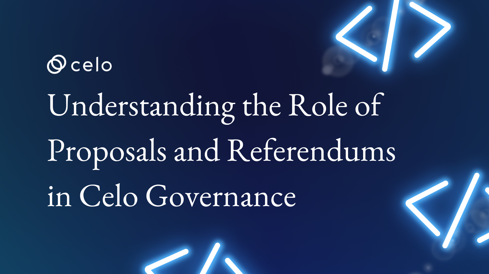

## Understanding the Role of Proposals and Referendums in Celo Governance

In the world of blockchain, governance plays a crucial role in the decision-making and management of a network. Celo is a platform that utilizes proposals and referendums to allow community members to vote on changes and upgrades to the network.

In this article, we delve into the concept of proposals and referendums and how they function within the Celo governance system. We explore the various stages of proposal creation, voting and execution, and the role of validators, token holders, and the Celo community in the process. Today's topic is Understanding the Role of Proposals and Referendums in Celo Governance

Here's an overview of what we'll cover

- ✅ Introduction to Celo
- ✅ Overview of Celo’s Governance
- ✅ Celo Governance Model
- ✅ Proposals
- ✅ Referendum
- ✅ The Proposal Process
- ✅ Successful Proposals and Referendums
- ✅ Conclusion

By the end of this post, we gain insight into the democratic and decentralized nature of Celo governance. Let's go!

## ✅ Introduction to Celo

Celo is a mobile-first blockchain that makes decentralized financial (DeFi) tools and services accessible to anyone with a mobile phone.

Celo aims to create a global payment network that is fast, secure, and affordable, with low transaction fees. The Celo network is based on a proof-of-stake consensus mechanism and uses a novel stability mechanism to maintain the value of the Celo token at a stable price.

In this article, we will provide an overview of the Celo blockchain and its governance model. We will explore how the network is governed and how the community participates in decision-making.

## ✅ Overview of Celo’s Governance

One of the critical aspects of the Celo blockchain is its governance model. The Celo governance model is designed to be decentralized, transparent, and community-driven. The Celo Foundation plays a critical role in facilitating the governance process, but the ultimate decision-making power lies with the community. The Celo Foundation facilitates the governance process by providing support and resources to the community.

The governance model of the Celo blockchain is designed to ensure that the community is represented and that decisions are made in the best interests of the network. The Celo Foundation is responsible for ensuring that the network remains secure and stable, but the community is responsible for proposing and voting on changes to the network's protocol.

## ✅ Celo Governance Model

The Celo governance model is a decentralized system that relies on the Celo token, governance smart contracts, and the community to help manage the protocol. This model allows token holders to have a voice in decision-making and helps ensure the Celo blockchain remains fair and secure.

CELO token plays a critical role in the governance of the Celo platform and technology. Anyone who holds any amount of CELO is empowered to vote on governance proposals that direct how the core technology operates today and in the future.

## ✅ Proposals

Proposals are suggestions for changes or additions to the Celo network. They are a critical component of the Celo governance model. They allow the community to propose changes to the network's protocol and to vote on these changes. Proposals can be made for both on-chain and off-chain changes

You can view information about a specific proposal with the following command:

```
celocli governance:show --proposalID=<PROPOSAL_ID>
```

Here is an example of what a proposal looks like:

```
    Running Checks:
            ✔  14 is an existing proposal
    proposal:
            0:
                contract: Governance
            function: setBaselineQuorumFactor
                args:
                0: 500000000000000000000000
            params:
                baselineQuorumFactor: 500000000000000000000000 (~5.000e+23)
                value: 0
    metadata:
            proposer: 0xF3EB910DA09B8AF348E0E5B6636da442cFa79239
            deposit: 100000000000000000000 (~1.000e+20)
            timestamp: 1609961608 (~1.610e+9)
            transactionCount: 1
            descriptionURL: https://github.com/celo-org/celo-proposals/blob/master/CGPs/0016.md
    stage: Referendum
    upvotes: 0
    votes:
            Yes: 30992399904903465125627698 (~3.099e+25)
            No: 0
            Abstain: 0
    passing: true
    requirements:
            constitutionThreshold: 0.7
            support: 0.99883105743491071638
            required: 29107673282861669327494319.531832308424 (~2.910e+25)
            total: 30992399904903465125627698 (~3.099e+25)
    isApproved: true
    isProposalPassing: true
    timeUntilStages:
            referendum: past
            execution: 57 minutes, 59 seconds
            expiration: 3 days, 57 minutes, 59 seconds
```

### Types of Proposals

Celo's way of making decisions through governance involves two types of proposals - on-chain and off-chain.

On-chain proposals result in automatic updates to the Celo network when accepted, while off-chain proposals don't require any changes to the protocol and are implemented manually by the Celo Foundation.

In simpler terms, proposals in Celo's governance can be of two types - one that updates the network automatically (on-chain), and another that is implemented manually (off-chain) without any protocol modifications.

- a. On-Chain Proposals

On-chain proposals are changes that are made to the Celo protocol. The proposal must include a detailed explanation of the proposed change, the expected impact of the change, and any potential risks associated with the change.
Submitted proposals are added to the queue of proposals. While a proposal is on this queue, voters may use their Locked Celo to upvote the proposal.
To vote on an on-chain proposal, members of the community must hold Celo governance tokens  Locked Celo, which give them voting power. Once per day the top three proposals, by weight of the Locked Celo upvoting them, are dequeued and moved into the Approval phase.
If the proposal is approved, it is automatically executed by the network. The proposal is then implemented into the Celo protocol, and the community can start using the new feature or change. Some examples of on-chain proposals that have been successfully implemented include the adoption of a new stablecoin and the introduction of a rewards program for validators.

- b. Off-Chain Proposals

Off-chain proposals are essentially suggestions for making changes to the Celo protocol, but they don't involve actually changing the protocol itself. Instead, these proposals are manually carried out by the Celo Foundation.

When presenting a proposal, it's crucial to give a thorough description of the change you wish to make, including any potential dangers and how it might affect the system.

The Celo Foundation will manually incorporate the change into the network if the application is accepted after going through approval. The community will be able to begin using the new feature or update after it has been implemented.

## ✅ Referendum

A referendum is the process by which the Celo community votes on a proposal. The voting process is conducted using the Celo blockchain, and any Celo holder can participate in the vote. The voting process is designed to be secure and transparent, ensuring that the results are accurate and verifiable.
Referendums are used to make decisions that affect the entire network. These decisions can include changes to the Celo protocol, changes to the governance model, and changes to the network's mission and vision. The suggested changes or feature on the proposal is implemented on the network after getting the required number of upvotes from the community members.

When a proposal is queued, you can upvote the proposal to indicate you'd like it to be considered with the following command.

```
celocli governance:upvote --proposalID=<PROPOSAL_ID> --from=<YOUR_VOTER_ADDRESS>
```

Once a proposal has reached the Referendum phase, it is open to the community for voting. You can do that using the following command

```
celocli governance:vote --proposalID=<PROPOSAL_ID>--value=<Abstain|Yes|No> --from=<YOUR_VOTER_ADDRESS>
```

The community then has a voting period of 5 days to vote yes or no on the proposal. If a proposal receives a majority of votes in favor, it is implemented on the Celo network. This could include changes to the network's technical parameters or changes to the governance structure itself. If a proposal is rejected, it can be revised and resubmitted in the future.

## ✅ The Proposal Process

When someone submits a proposal, it goes into a Proposal Queue with all the other proposals waiting for consideration. If you want your proposal to have a better chance of being seen, you should try to get people to upvote it. The more upvotes it gets, the higher it will move up in the queue.

Every day, three proposals from the top of the queue get automatically promoted to the approval stage. This means they will be reviewed more closely and have a better chance of being accepted. However, if a proposal stays in the queue for four weeks without being promoted, it will expire, which means it won't be considered any further. So it's important to get your proposal noticed and upvoted!

### Submitting a proposal

To propose changes or updates to the blockchain, users can submit a Proposal to the Governance smart contract along with a small deposit of CELO to prevent spam proposals. Don't worry, you'll get the deposit back if your proposal passes the Approval stage.

When submitting your proposal, you need to provide a list of transactions and a description URL so that voters can learn more about it. The transaction data includes the destination address, data, and value. If your proposal gets approved, the Governance contract will execute the transactions you included.

Your proposal will be added to the queue of proposals where voters can upvote it using their Locked Celo. The top three proposals with the most upvotes will be moved to the Approval phase daily. If your proposal hasn't received enough upvotes or if it's been on the queue for more than four weeks, it will expire and your deposit will be forfeited.

### Approval

Once your proposal reaches the Approval phase, you can reclaim your Locked Celo deposit. In this phase, the proposal needs to be approved by the Approver, which is initially a 3 of 9 multi-signature address held by individuals chosen by the Celo Foundation. If the proposal is not approved within 24 hours, it is considered expired and won't move on to the next phase.

### Referendum

If your proposal is approved, it will graduate to the Referendum phase, where any user can vote yes, no, or abstain. The weight of their vote depends on the weight of their Locked Celo. After the Referendum phase, which lasts five days, your proposal will be marked as passed or failed.

To pass, your proposal needs to meet a minimum threshold for participation and agreement. The participation threshold is the minimum portion of Locked Celo that must cast a vote for your proposal to pass. This requirement prevents proposals from passing with very low participation. The agreement threshold is the portion of votes that must be "yes" votes for your proposal to pass.

### Execution

Finally, if your proposal graduates from the Referendum phase to the Execution phase, anyone can execute it by triggering a call operation code from the Governance smart contract. The proposal will expire from this phase after three days.

## ✅ Successful Proposals and Referendums

The community has been successfully given the opportunity to suggest and vote on network changes thanks to Celo's decentralized governance approach. The Celo network has implemented numerous proposals and referendums over the years, which has had a substantial impact on the functionality and user experience of the network.

### Celo proposes to Increase in the network’s minimum gas threshold

Celo voted on a proposal to increase the network’s minimum gas threshold. The Celo Governance Proposal 0066 was voted on and ended on Jan 27.

The proposal seeks to increase the minimum gas threshold to $0.001 for simple ERC-20 transactions. Unlike Ethereum, where gas fees must be paid in ETH only, in Celo, users can pay using ERC-20 currencies, not just CELO.

The overall goal of Celo's proposal to raise the minimum gas threshold is to strengthen the network's security and scalability while also making sure that all users may continue to access the platform, particularly those who depend on low-value transactions for financial inclusion.

### Celo Foundation proposes to deploy Uniswap v3 on its native blockchain

Celo's proposal aims to leverage the benefits of Uniswap v3 and offer users on its blockchain a more efficient and cost-effective way to trade cryptocurrencies. By deploying Uniswap v3 on Celo, users will be able to enjoy faster transaction times and lower gas fees. This is due to Celo's Proof-of-Stake (PoS) consensus mechanism, which consumes less energy and allows for faster block times than other popular blockchains like Ethereum.

Additionally, the deployment of Uniswap v3 on Celo's native blockchain could help to further decentralize the exchange ecosystem and provide greater liquidity to Celo's network. This is because users who previously had to rely on centralized exchanges to trade cryptocurrencies can now use Uniswap v3 on Celo to trade in a decentralized and trustless manner.

Celo's proposal to deploy Uniswap v3 on its native blockchain could have significant benefits for both the Celo network and the broader decentralized finance (DeFi) ecosystem. By providing a more efficient and cost-effective way to trade cryptocurrencies, Celo could help to further democratize access to DeFi and bring the benefits of decentralized finance to a wider audience.

### Censusworks proposal to rename Celo Gold (cGLD) to (CELO)

Censusworks, a validator group with a strong commitment to reliability and the Celo ecosystem, proposed to rename Celo Gold (cGLD) to simply Celo (CELO). The platform has two native tokens: cUSD, which is a stablecoin pegged to the US dollar, and cGLD, which is the native utility token used for staking and governance.

The proposal aims to simplify the Celo branding by unifying the two native tokens under a single brand name - Celo. This will make it easier for users to understand and engage with the Celo ecosystem, particularly as the platform expands its offerings in the DeFi space.

First of all, it will aid in preventing confusion between the two native tokens, since users may believe that cGLD is a token with a gold backing. Additionally, as the Celo ecosystem continues to expand and offer new features and products, the proposed change would make it simpler for new users to comprehend and navigate it. Finally, the streamlined branding will contribute to the development of a stronger, more identifiable brand for Celo, which may encourage platform acceptance and expansion.

This is a crucial step toward streamlining and streamlining the branding of the Celo ecosystem, which may aid in boosting platform growth and acceptance.
Using the Celo Governance platform, a community vote was held to decide whether to change the name of cGLD to CELO. The proposal passed and Celo Gold is now known as Celo native asset or just Celo for short

These successful proposals and referendums show how the decentralized governance model used by Celo effectively empowers the community to make significant network changes. The paradigm encourages transparency and accountability while allowing for community involvement in decision-making.

## ✅ Conclusion

In conclusion, the governance structure of Celo is intended to provide the community a voice in the growth and direction of the ecosystem. Decisions are made via a process of approval, referendum, and execution, and the model is transparent.

Celo's decentralized governance system heavily relies on proposals and referendums. They give communities the chance to influence the network's course and guarantee that their voices are heard. Proposals and referendums support the long-term sustainability of the network, the development of a vibrant and active community, and transparency and accountability.

The mechanism enables community members who own Celo governance tokens to vote on both on-chain and off-chain proposals as well as referendums. In general, the Celo government
Overall, the Celo governance model serves as an example of how blockchain networks can be governed in a decentralized and democratic way.

## References

- <https://blog.celo.org/why-we-should-rename-celo-gold-35b04d87e95a>
- <https://docs.celo.org/holder/vote/governance#understanding-proposal-details>
- <https://docs.celo.org/protocol/governance#stakeholder-proposal-process>

## Next Steps

And that brings us to the end of today's topic on “Understanding the Role of Proposals and Referendums in Celo Governance”. To recap, you can find a summary of all the topics we covered below.

- ✅ Introduction to Celo
- ✅ Overview of Celo’s Governance
- ✅ Celo Governance Model
- ✅ Proposals
- ✅ Referendum
- ✅ The Proposal Process
- ✅ Successful Proposals and Referendums
- ✅ Conclusion

I hope you learned a lot from this tutorial. Please check out the [Celo Documentation](https://https://docs.celo.org/) to aid your learning further.

## About the Author

Kyrian Chigozie is a technical writer with a passion for web3 technology. He specializes in creating clear and effective documentation for complex technical concepts. COnnect with me on [Twitter](https://twitter.com/Kyrian_M)
