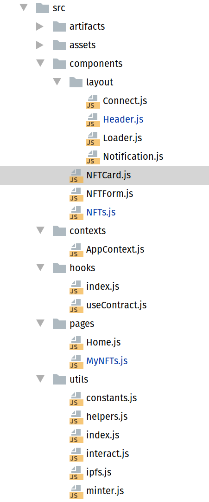

## Introduction​

Welcome to our tutorial on building an NFT marketplace for tech artisans on Celo! This tutorial will show you how to use React, Solidity, react-celo, and IPFS to create a platform that connects creators and collectors in the NFT market space. Our marketplace will allow creators to create and showcase their NFT. 

Metrics, such as the number of NFT transactions and amounts received from clients, are used to determine outstanding creators. This tutorial is perfect for those looking to build a platform that connects tech artisans and clients in a decentralized, secure, and efficient manner.

## Prerequisites​

To successfully follow along in this tutorial, you need basic knowledge of the following:
HTML, CSS, and React
Blockchain, Solidity, and Hardhat

## Requirements​

- [Remix](https://remix.ethereum.org/) - Online editor for writing smart contracts or any code editor you choose.
- [Metamask](https://metamask.io/) - For managing our wallet.
- [Hardhat](https://hardhat.org/) - For compiling and deploying the smart contract
- [Alfajores Testnet Account](https://developers.celo.org/3-simple-steps-to-connect-your-metamask-wallet-to-celo-732d4a139587) - Required to connect to the dApp and make test transactions.
- [Node.js](https://nodejs.org/en/) - From V12. or higher
- [Pinata Account](https://www.pinata.cloud/) - You need an account with Pinata to store files in a decentralized manner.

## Stack Walkthrough

We will use React.js to build the application's frontend, allowing users to create, buy, sell, and Cancel an NFT.

`react-celo` helps us to get up to speed in setting up Celo in our React application. It has done the heavy lifting, such as connecting to the wallet and making available Contract Kit necessary for interacting with the Celo blockchain.

The backend of the dApp was written in Solidity using Remix IDE.


IPFS allows decentralized storage for our NFT files and their corresponding metadata.

## Smart Contract

The NFT minter section was generated with Open Zeppelin wizard, which has the basic functionalities to get us to hit the ground running in this project. Feel free to head to their docs to familiarize yourself with the many audited and secured contracts they have created to ease smart contract development.

I would walk us through some significant functions of the Dapp.

```solidity
	function createNFT(string memory NFTURI, uint256 price) public payable returns (uint) {

        _NFTIdCounter.increment();

        uint256 newNFTId = _NFTIdCounter.current();

        _safeMint(msg.sender, newNFTId);

        _setTokenURI(newNFTId, NFTURI);

        idToListedNFT[newNFTId] = ListedNFT(newNFTId, payable(msg.sender), price, false );

        myNFTs[msg.sender][newNFTId] = MyNFT(newNFTId, payable(msg.sender), price,  false, false);

        Seller storage _NFTseller = sellers[msg.sender];

        _NFTseller.NFTCounts ++;

        return newNFTId;
    }

```
The `createNFT` function accepts the NFT URI that would be made available when we upload our NFT metadata to IPFS and the price of the NFT.

The `_safeMint` function is utilized in Solidity smart contracts on the blockchain to produce and include fresh tokens or NFTs in the blockchain. Its primary objective is to guarantee that the newly generated tokens are safely and securely added to the blockchain without any possibility of loss or theft.

It accepts the address of the user calling the function and the ID of the newly created token.

The `_setTokenURI` is a function that establishes the Uniform Resource Identifier (URI) for a specific token or NFT. This URI is a string of characters that indicates the location where the token's metadata is stored, such as a JSON file on IPFS or a centralized server. Using `_setTokenURI` allows developers to associate a token's metadata with its unique identifier on the blockchain.

This function is handy for NFTs with extensive metadata linked to them, such as a title, description, image, and other attributes that describe the NFT and its underlying asset. By utilizing `_setTokenURI`, developers can store this metadata in a decentralized manner, making it transparent and easily accessible to anyone who wants to view it.

Overall, ` _setTokenURI` is a crucial tool for developers building NFT applications on the EVM compatible blockchain, ensuring that their NFTs' metadata is securely stored and easily accessible on the blockchain.

```solidity
    function getMyNFTs (uint256 _index, address _callerAddress) public view returns (

        uint256 _NFTId,
        address _seller,
        uint256 _price,
        bool _forSale,
        bool _sold,
        uint256 _sales,
        uint256 _earnings
    ) {

        Seller storage _NFTseller = sellers[_callerAddress];
        MyNFT storage _myNFT = myNFTs[_callerAddress][_index];

        return (
        _myNFT.NFTId,
        _myNFT.seller,
        _myNFT.price,
        _myNFT.forSale,
        _myNFT.sold,
        _NFTseller.sales,
        _NFTseller.earnings
        );

    }

```

The `getMyNFTs` returns all the NFTs owned by the user interacting with the smart contract and their relevant details like the NFT seller's address, price, sales, and earnings. The function requires two parameters: `_index`, which specifies the index of the NFT that the user wants to view, and `_callerAddress`, which is the user's address calling the function. The function returns a tuple of the mentioned variables, which users can access and view their NFTs and associated details.

```solidity
function buyNFT(uint256 tokenId) public noReentrant payable {
        ListedNFT storage _listedNFT = idToListedNFT[tokenId];
        address seller = idToListedNFT[tokenId].seller;
        require(msg.value == _listedNFT.price, "Please submit the asking price in order to complete the purchase");

        // Update the details of the token.
        _listedNFT.forSale = false;
        _listedNFT.seller = payable(msg.sender);
        _itemsSold.increment();

        // Transfer the token to the contract.
        _transfer(address(this), msg.sender, tokenId);

        // Transfer the proceeds from the sale to the seller of the NFTCard.
        payable(seller).transfer(msg.value);

        myNFTs[msg.sender][tokenId] = MyNFT(tokenId, payable(msg.sender), _listedNFT.price, false, false);
        myNFTs[seller][tokenId] = MyNFT(tokenId, payable(seller), _listedNFT.price, false, true);

        Seller storage _seller = sellers[seller];
        Seller storage _buyer = sellers[msg.sender];

        _seller.sales ++;
        _seller.earnings += _listedNFT.price;
        _buyer.NFTCounts ++;
    }
```

`buyNFT` is used to facilitate a user's purchase of a listed NFT. The user provides the `tokenId` of the NFT they want to buy and sends an amount of ether (in wei) that matches the NFT's price. The function then transfers the NFT's ownership and payment to the seller.

The function updates the relevant details of the purchased NFT, such as its forSale status and its new seller. Additionally, it increments the `itemsSold` counter to track the number of NFTs sold.

After the transaction is completed, the function updates the myNFTs mapping for both the buyer and the seller, indicating the change in ownership of the NFT. The function also updates the counters of sales and earnings for the seller and the number of NFTs owned by the buyer.

Overall, this function streamlines the process of purchasing NFTs, allowing for a more efficient and secure transfer of both the NFT and the payment.

```solidity
function sellNFT(uint256 tokenId) public noReentrant payable {

        ListedNFT storage _listedNFT = idToListedNFT[tokenId];

        require(_listedNFT.price > 0, "Make sure the price isn't negative");
        require(msg.value == listPrice, "Hopefully sending the correct price");
        require(_listedNFT.seller == msg.sender, "Only NFT owners can perform this operation");
        require(_listedNFT.forSale == false, "Item already listed for sale");

        MyNFT storage _myNFT = myNFTs[msg.sender][tokenId];

        payable(owner).transfer(listPrice);
        _transfer(msg.sender, address(this), tokenId);
        _listedNFT.forSale = true;
        _myNFT.forSale = true;

        emit NFTListedSuccess(
            tokenId,
            msg.sender,
            _listedNFT.price,
            true
        );
    }
```

`sellNFT` enables the listing of an NFT for sale on the marketplace. The function takes a unique NFT identifier called `tokenId` as a parameter, declares two storage variables, and then performs several checks to ensure that the caller is the owner of the NFT, that it hasn't already been listed for sale, and that the amount of Celo sent by the caller matches the NFT's list price. If all checks pass, the contract owner is paid the list price, the NFT is transferred from the caller to the contract, and the `forSale` flag is set to true for both the `_listedNFT` and `_myNFT` structs. Finally, the function emits an event with information about the newly listed NFT. The `noReentrant` modifier is used to prevent re-entrancy attacks that could occur if the function is called multiple times before it has finished executing.

## Frontend

In this section, you will learn how to establish a connection between the user interface of your decentralized application (DApp) and the smart contract running on the Celo blockchain. This connection will enable your DApp to communicate and interact with your smart contract.

Here is what the `src` directory structure looks like.



The project was structured to have the Hardhat and React live in one directory. Hence, the reason we have the artifacts directory in the src. That was achieved by configuring the hardhat.config.js paths section to use the `src` directory.

```js
require('@nomicfoundation/hardhat-toolbox');
require('dotenv').config()

/** @type import('hardhat/config').HardhatUserConfig */
module.exports = {
  solidity: '0.8.17',
  defaultNetwork: 'alfajores',
  networks: {
    alfajores: {
      url: 'https://alfajores-forno.celo-testnet.org',
      accounts: [process.env.REACT_APP_PRIVATE_KEY],
      chainId: 44787
    }
  },
  paths: {
    artifacts: './src/artifacts'
  }
};
```


This is a configuration file for Hardhat, a development environment for building, testing, and deploying smart contracts on Ethereum and other EVM-compatible blockchains like Celo. The file contains several settings that define how Hardhat will operate.

The settings include specifying the version of Solidity to use, defining the default network to use, the network(s) to use and their respective URLs, private keys, and network IDs, and the location of the artifacts directory.

The file imports two external modules, `@nomicfoundation/hardhat-toolbox` and `dotenv`, which provide useful plugins and utilities for Hardhat and load environment variables from a .env file, respectively.

The Hooks and Utils directories are where many of the functions in this project are located. Therefore, we will be exploring these directories and describing the purpose of each file within them.

## Hooks

This is where all the custom hooks are located. You might be wondering at this moment what hook is in React.

In React, a hook is a function that enables the use of state and other React features within functional components. They are designed to provide a way to reuse stateful logic across different components without relying on class components or higher-order components.

React includes several built-in hooks, including useState, useEffect, useContext, and useRef. These built-in hooks allow you to manage state, perform side effects, access context and create refs within functional components.

Developers can also create custom hooks, JavaScript functions that use one or more of the built-in hooks to provide reusable, stateful logic that can be shared between multiple components.

Overall, hooks are a powerful and flexible feature of React that make it easier to write functional components with state and other React features, resulting in more readable, maintainable, and reusable code.

### useContract.js

```js


import { useState, useEffect, useCallback } from 'react'
import { useCelo } from '@celo/react-celo'


export const useContract = (abi, contractAddress) => {

  const { kit, address } = useCelo()
  const [contract, setContract] = useState(null)

  const getContract = useCallback(async () => {

    setContract(new kit.connection.web3.eth.Contract(abi, contractAddress))
  }, [kit, abi, contractAddress])

  useEffect(() => {
    if (address) getContract()
  }, [address, getContract])

  return contract
}
```


This custom hook enables a smart contract by providing its ABI (Application Binary Interface) and contract address. It uses the `useState`, `useEffect`, and `useCallback` hooks from React and the `useCelo` hook from the `@celo/react-celo package`.

The `useCelo` hook provides access to the Celo blockchain and wallet using Metamask or Celo wallet browser extension, etc. It returns an object containing a `kit` property representing the connection to the blockchain and an `address` property representing the current wallet address.

The `useContract` hook initializes a contract state variable to null and defines a getContract function using the `useCallback` hook. The getContract function uses the kit object to create a new smart contract instance by passing in its ABI and contract address. This function is memoized using `useCallback` to prevent unnecessary re-renders.

The `useEffect` hook calls the `getContract` function once the address property is available. This ensures that the smart contract is only instantiated once the user's wallet address is known.

Finally, the `useContract` hook returns the contract state variable, which can be used by the component that calls this hook to interact with the smart contract on the blockchain.

## Utils

This typically contains various utility functions and modules that can be used throughout the application. These functions and modules are generally designed to perform specific tasks or provide reusable pieces of code that can be utilized across different application parts.

### constants.js

```js
export const IPFS_URL = 'https://gateway.pinata.cloud/ipfs/'
export const FILE_TO_IPFS_URL = 'https://api.pinata.cloud/pinning/pinFileToIPFS'
export const JSON_TO_IPFS_URL = 'https://api.pinata.cloud/pinning/pinJSONToIPFS'
```


The file has only three constants, and the values are set to a string. 
IPFS_URL is used to specify the location of the IPFS gateway provided by Pinata, which allows users to access files stored on the IPFS network via a URL.
FILE_TO_IPFS_URL represents the Pinata API endpoint that allows us to upload a file to IPFS, while JSON_TO_IPFS_URL is the endpoint that enables us to upload JSON to IPFS.

Using a constant variable for the URL string allows for easy reuse of the URL throughout the codebase without manually typing out the string each time it is used. This can make the code more maintainable and less prone to errors.

### helpers.js

contains helper functions that are used across the tutorial.

```js


export const truncate = input => `${input.substring(0, 5)}...${input.slice(-4)}`

export const priceToWei = (kit, price) => kit.connection.web3.utils.toWei(String(price), 'ether')

export const formatPrice = (kit, price) => price ? kit.connection.web3.utils.fromWei(String(price)) : ''

export const toCheckSum  = (kit, address) => kit.connection.web3.utils.toChecksumAddress(address)
```


- truncate: This function takes a string input and truncates it to a length of 9 characters by taking the first five characters, adding an ellipsis (...), and then adding the last four characters of the string. The truncated string is then returned.

- priceToWei: Takes two parameters:  the `kit` object and a `price` value. It converts the price from Ether to Wei, which is the smallest unit of Ether. The toWei function is called on the web3.utils property of the connection property of the kit object, passing in the price value as a string and the string 'ether' to specify the unit of the input value. The converted value is returned.

- formatPrice: This function takes two parameters:  the `kit` object and a `price` value. It converts the price from Wei to Ether and returns it as a string. If the price is falsy (i.e., null, undefined, 0, NaN, false, or an empty string), an empty string is returned. The `fromWei` function is called on the `web3.utils` property of the `connection` property of the `kit` object, passing in the price value as a string.

- toCheckSum: This function takes two parameters: a `kit` object and an `address` value. It converts the address value to its checksummed form, a case-sensitive representation of the Ethereum address with a specific format that helps prevent certain errors. The toChecksumAddress function is called on the web3.utils property of the connection property of the kit object, passing in the address value. The `checksummed` address is returned.


### interact.js

```js
import { getNFTMeta } from './ipfs'

export const nftContractAddress = '0x1f08cb18155Dc80ceCD8C93AC3b345361ce3661A'

export const createNFT = async (NFTContract, NFTURI, price, address) => {
  try {
    return await NFTContract.methods.createNFT(NFTURI, price).send({from: address})
  } catch (e) {
    console.log(e)
  }
}

export const getNfts = async (NFTContract) => {
  try {

    const NFTs = []
    const NFTCount = await NFTContract.methods.getNFTCount().call()

    for (let i = 1; i <= NFTCount; i++) {
      const NFT = new Promise(async (resolve) => {

        const NFTItem = await NFTContract.methods.getNFT(i).call()
        const NFTURI = await NFTContract.methods.tokenURI(i).call()

        const NFTMeta = await getNFTMeta(NFTURI)

        resolve({
          tokenId: NFTItem._NFTId,
          price: NFTItem._price,
          seller: NFTItem._seller,
          forSale: NFTItem._forSale,
          sales: NFTItem._sales,
          earnings: NFTItem._earnings,
          name: NFTMeta.name,
          image: NFTMeta.image,
          initialPrice: NFTMeta.price,
          description: NFTMeta.description
        })
      })
      NFTs.push(NFT)
    }
    return Promise.all(NFTs)
  } catch (e) {
    console.log({ e })
  }
}

export const buyNFT = async (NFTContract, NFT, address) => {
  return await NFTContract.methods.buyNFT(NFT.tokenId).send({
    from: address,
    value: NFT.price
  })

}

export const sellNFT = async (NFTContract, tokenId, address) => {

  const listPrice = await NFTContract.methods.getListPrice().call()

  return await NFTContract.methods.sellNFT(tokenId).send({
    from: address,
    value: listPrice
  })

}

export const cancelNFT = async (NFTContract, tokenId, address) => {

  return await NFTContract.methods.cancel(tokenId).send({
    from: address
  })

}

export const getMyNFTs = async (NFTContract, address) => {
  try {

    const NFTCount = await NFTContract.methods.getMyNFTCount(address).call()

    let NFTs = []

    for (let i = 1; i < NFTCount; i++) {
      const NFTItem = await NFTContract.methods.getMyNFTs(i, address).call()

      if (NFTItem._sold) {
        continue
      }

      const NFTURI = await NFTContract.methods.tokenURI(NFTItem._NFTId).call()

      const NFTMeta = await getNFTMeta(NFTURI)

      NFTs.push({
        tokenId: NFTItem._NFTId,
        price: NFTItem._price,
        seller: NFTItem._seller,
        forSale: NFTItem._forSale,
        name: NFTMeta.name,
        image: NFTMeta.image,
        initialPrice: NFTMeta.price,
        description: NFTMeta.description,
      })
    }

    return NFTs

  } catch (e) {
    console.log(e)
  }
}

export const getSellerStat = async (NFTContract, address) => {
  return await NFTContract.methods.getSellerStat(address).call()
}
```

This file exports several functions for interacting with the NFT smart contract.

The `createNFT` function creates a new NFT with the given metadata and price.

The `getNfts` function retrieves all existing NFTs by iterating over each token ID and calling the getNFT and `tokenURI` functions of the NFT contract to get the token's metadata and URI. It then calls the getNFTMeta function from the ipfs.js module to retrieve the NFT's metadata from IPFS. The function returns an array of all NFTs, each with its metadata and information about its sales history.

The `buyNFT`, `sellNFT`, and `cancelNFT` functions interact with the NFT contract to respectively buy, sell, or cancel the sale of a given NFT.

The `getMyNFTs` function retrieves all NFTs owned by the specified address by calling the `getMyNFTs` function of the NFT contract for each token ID.

Finally, the `getSellerStat` function retrieves a seller's statistics from the NFT contract, including the total number of NFTs sold and the total amount earned.

### ipfs.js

```js
import axios  from 'axios'
import { IPFS_URL, FILE_TO_IPFS_URL, JSON_TO_IPFS_URL } from './constants'

export const imageToIPFS = async (image) => {

  let data = new FormData()

  data.append('file', image, image.name)
  data.append('pinataOptions', '{"cidVersion": 1}')

  let config = {
    method: 'post',
    url: FILE_TO_IPFS_URL,
    headers: {
      'Content-Type': `multipart/form-data boundary=${data._boundary}`,
      'Authorization': `Bearer ${process.env.REACT_APP_PINATA_JWT}`
    },
    data
  }

  const res = await axios(config)

  return res.data.IpfsHash
}

export const JSONToIPFS = async(json) => {

  const res = await axios.post(JSON_TO_IPFS_URL, json, {
      headers: {
        'Authorization': `Bearer ${process.env.REACT_APP_PINATA_JWT}`
      }
    })

  return `${IPFS_URL}${res.data.IpfsHash}`

}

export const getNFTMeta = async URI => {
  try {
    return (await axios.get(URI)).data
  } catch (e) {
    console.log({ e })
  }
}
```

We first import the Axios library to make HTTP requests to Pinata's API endpoints.

`imageToIPFS` function takes an image file, sends it to Pinata using the `pinFileToIPFS` API endpoint, and returns the IPFS hash of the pinned file.

The `JSONToIPFS` function takes a JSON object, sends it to Pinata using the `pinJSONToIPFS` API endpoint, and returns the IPFS URL of the pinned JSON.

The `getNFTMeta` function takes a URI of an NFT metadata JSON file, retrieves the file from IPFS using Axios, and returns the parsed JSON object.

## Conclusion

We built an NFT marketplace for tech artisans to connect with their prospective clients with a metric to highlight freelancers with frequent sales. [Here](https://tech-artisans.vercel.app/) is the final demo of what we built. [Here](https://github.com/cjustinobi/tech-artisans-nft-marketplace) is the link to the complete code.

## About the Author​

A software engineer, co-founder, Africinnovate, and a Web3 enthusiast. I used to call myself VueDetective. Connect with me on LinkedIn and Github

## References​

[https://docs.celo.org/developer](https://docs.celo.org/developer)
[https://docs.alchemy.com/docs/how-to-build-an-nft-marketplace-from-scratch](https://docs.alchemy.com/docs/how-to-build-an-nft-marketplace-from-scratch)

