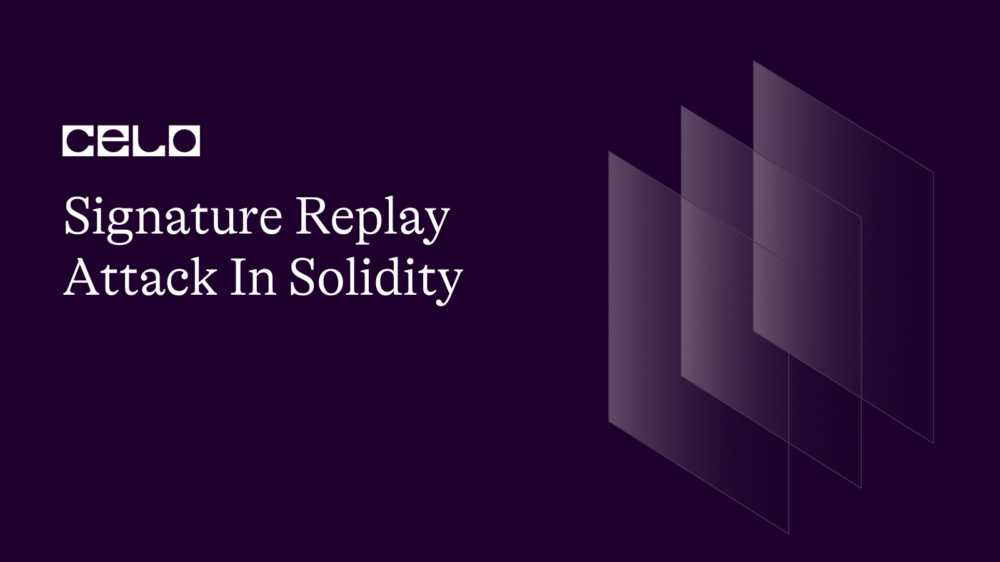

## Introduction

In the blockchain, a signature replay attack is an attack whereby a previously executed valid transaction is fraudulently or maliciously repeated on the same blockchain or a different blockchain. In this attack, the attacker can intercept a valid transaction and use the signature of that transaction to bypass security measures in order to perform the transaction again fraudulently. This article aims to explain scenarios where attackers can use the signature replay attack on our solidity contracts, code examples of how the signature replay attack works, and how we can prevent the attack on our contracts.

## Prerequisites

Before reading this article, it is essential for you to:

1. Have a basic understanding of Solidity smart contracts
2. Understand what hashing is and how it works

## How Does the Signature Replay Attack Work?

We will consider an example of a multi-sig wallet to understand how the replay attack works. A multi-sig wallet is a digital wallet that requires more than one signature before a transaction can be approved. There is more information on multi-sig wallets [here](https://www.bitstamp.net/learn/security/what-is-a-multisig-wallet/).

To demonstrate our example, let us consider a multi-sig wallet with a balance of 20 ETH. The wallet has two administrators, AdminX and AdminY.

For AdminY to withdraw 4 ETH, AdminX signs a message that contains his signature. AdminY can add his signature and send a transaction to the wallet requesting 4 ETH. This method involves signing a message off-chain. It reduces gas fees. There are three ways in which AdminY can perform the replay attack in these scenarios:


1. Because AdminX's message was signed off-chain and sent to AdminY, AdminY can decide to withdraw another 4 ETH without the knowledge of AdminX. AdminY can do this because he already has the signature of AdminX. The contract will recognize the signature and approve the transaction.
2. If the contract prevents the above scheme from working, AdminY can decide to deploy the contract at another address. Doing this will allow him to perform the same transaction without any hurdles.
3. AdminY can deploy the contract by using CREATE2 and calling selfdestruct(). If this is done, the contract can be recreated at the same address and reused with all the previous messages.

## How to Prevent Solidity Smart Contracts From Signature Replay Attack

To prevent the replay attack in our contracts, we must find a way to make each off-chain signature unique. We can do this by adding a [nonce](https://medium.com/swlh/ethereum-series-understanding-nonce-3858194b39bf). This way, once a signature has been used, an attacker cannot reusea signaturet because the contract will recognize the nonce once a signature has been used.

If the contract is deployed at another address, we can prevent the replay attack by including the contract's address inside the signature. We will add a nonce to prevent the first case.

In the scenario where a contract is created with `CREATE2` and `selfdestruct()` is called, there is no way to prevent the replay attack. We cannot prevent it because when `selfdestruct()` is called, the nonces are reset, and the contract no longer recognizes previously used nonces.

## Code Demonstration of the Replay Attack

The code below is vulnerable to a replay attack. We will examine the code and turn it into one that prevents replay attacks from happening.

```solidity

// SPDX-License-Identifier: MIT
pragma solidity ^0.8.18;

import "github.com/OpenZeppelin/openzeppelin-contracts/blob/release-v4.5/contracts/utils/cryptography/ECDSA.sol";

contract MultiSigWallet {
    using ECDSA for bytes32;

    address[2] public admins;

    constructor(address[2] memory _admins) payable {
        admins = _admins;
    }

    function deposit() external payable {}

    function transfer(address _sendto, uint _amount, bytes[2] memory _sigs) external {
        bytes32 txHash = getTxHash(_sendto, _amount);
        require(_checkSignature(_sigs, txHash), "invalid sig");

        (bool sent, ) = _sendto.call{value: _amount}("");
        require(sent, "Failed to send Ether");
    }

    function getTxHash(address _sendto, uint _amount) public pure returns (bytes32) {
        return keccak256(abi.encodePacked(_sendto, _amount));
    }

    function _checkSignature( bytes[2] memory _sigs, bytes32 _txHash) private view returns (bool) {

        bytes32 ethSignedHash = _txHash.toEthSignedMessageHash();

        for (uint i = 0; i < _sigs.length; i++) {
            address signer = ethSignedHash.recover(_sigs[i]);
            bool valid = signer == admins[i];

            if (!valid) {
                return false;
            }
        }

        return true;
    }
}

```

In the code above, we first import [ECDSA.sol](https://docs.openzeppelin.com/contracts/2.x/utilities) from [OpenZeppelin](https://docs.openzeppelin.com/).

```solidity

import "github.com/OpenZeppelin/openzeppelin-contracts/blob/release-v4.5/contracts/utils/cryptography/ECDSA.sol";
```

Next, we have the admins variable inside the contract called `MultiSigWallet`. The variable holds the address of the two contract admins.

```solidity
address[2] public admins;
```

We go ahead to define a constructor. The constructor takes the address of the two admins and assigns their values accordingly when the contract is deployed.

```solidity
constructor(address[2] memory _admins) payable {
    admins = _admins;
}
```

The code has a `deposit()` function to deposit money. It also has a `transfer()` function.
The `transfer()` function takes three parameters; the address that will receive the funds, the amount to be sent, and the signatures from both admins. 


1. First, it recreates the hash that was signed from the `_sendto` and `_amount` parameters. 
2. Next, it checks the two signatures against the hash. If the two signatures are valid, it proceeds to transfer the ether.

```solidity
// deposit function
function deposit() external payable {}

//transfer function
function transfer(address _sendto, uint _amount, bytes[2] memory _sigs) external {
        // get hash of _sendto and _amount
    bytes32 txHash = getTxHash(_sendto, _amount);

        // check if signature is valid
    require(_checkSignature(_sigs, txHash), "invalid sig");

        // send ether if signature is valid
    (bool sent, ) = _sendto.call{value: _amount}("");
    require(sent, "Failed to send Ether");
}
```

The next function in the code is the `getTxHash()` function. This function uses the `keccak256` hashing algorithm to hash the `_sendto` and `_amount`.

```solidity
function getTxHash(address _to, uint _amount) public view returns (bytes32) {
        return keccak256(abi.encodePacked(_to, _amount));
}
```

Finally, there is a function called `_checkSignature()`. The job of this function is to check if the signer's signature corresponds to the admin's signature. 


1. First, it recomputes the signed hash by calling `toEthSignedMessageHash()`. 
2. Next, it runs a for loop that recovers the signer of each signature. 
3. The loop then checks to confirm if the signer of the message is indeed an admin of the contract. If not, it returns false.

```solidity
function _checkSignature( bytes[2] memory _sigs, bytes32 _txHash) private view returns (bool) {

                // recompute hash
    bytes32 ethSignedHash = _txHash.toEthSignedMessageHash();

    for (uint i = 0; i < _sigs.length; i++) {
                                // get the signer of the signature
        address signer = ethSignedHash.recover(_sigs[i]);

                                //check if the signer is an admin
        bool valid = signer == admins[i];

        if (!valid) {
            return false;
        }
    }

    return true;
}
```

Now that we have analyzed the contract let us look at ways to protect it from a signature replay attack.

To prevent an attacker from reusing a signature signed off-chain, we need to make each sign unique for each transaction by creating a unique transaction hash. We can do this by including a nonce in the transaction hash.

After this, we will invalidate the hash once the transaction is carried out. Let us analyze the code below:

```solidity
// SPDX-License-Identifier: MIT
pragma solidity ^0.8.18;

import "github.com/OpenZeppelin/openzeppelin-contracts/blob/release-v4.5/contracts/utils/cryptography/ECDSA.sol";

contract MultiSigWallet {
using ECDSA for bytes32;

address[2] public admins;
mapping(bytes32 => bool) public is_executed;

constructor(address[2] memory _admins) payable {
    admins = _admins;
}

function deposit() external payable {}

function transfer(address _sendto, uint _amount, uint _nonce, bytes[2] memory _sigs) external {
    bytes32 txHash = getTxHash(_sendto, _amount, _nonce);

    require(!is_executed[txHash], "transaction has been previously executed");

    require(_checkSignature(_sigs, txHash), "invalid sig");

    is_executed[txHash] = true;

    (bool sent, ) = _sendto.call{value: _amount}("");
    require(sent, "Failed to send Ether");
}

function getTxHash(address _sendto, uint _amount, uint _nonce) public pure returns (bytes32) {
    return keccak256(abi.encodePacked(_sendto, _amount, _nonce));
}

function _checkSignature( bytes[2] memory _sigs, bytes32 _txHash) private view returns (bool) {

    bytes32 ethSignedHash = _txHash.toEthSignedMessageHash();

    for (uint i = 0; i < _sigs.length; i++) {
        address signer = ethSignedHash.recover(_sigs[i]);
        bool valid = signer == admins[i];

        if (!valid) {
            return false;
        }
    }

    return true;
}
    }
```

In the above code, we have added a `nonce` as a parameter to the `getTxHash()` function. We have also done this to the `transfer()` function. By doing this, we have successfully made each signature and hash unique.

Another thing to note is the mapping called `is_executed` which is at the top of the contract.

```solidity
mapping(bytes32 => bool) public is_executed;
```

We use this to invalidate each hash after a transaction has been carried out. To do this, we first check if `is_executed` is false. If it is and the signatures are valid, we set `is_executed` to `true`, then send the required ether.

```solidity
function transfer(address _sendto, uint _amount, uint _nonce, bytes[2] memory _sigs) external {
    bytes32 txHash = getTxHash(_sendto, _amount, _nonce);

                            // check if is_executed is still false
    require(!is_executed[txHash], "transaction has been previously executed");
                            // check for valid signatures
    require(_checkSignature(_sigs, txHash), "invalid sig");
                                    // change is_executed to true
    is_executed[txHash] = true;

                            // send ether
    (bool sent, ) = _sendto.call{value: _amount}("");
    require(sent, "Failed to send Ether");
}
```

With the preventive measures taken, we can protect our contract from a replay attack that uses the signature of the admins. 

Next, we must protect the contract against a replay attack where the attacker deploys the contract at another address. 

We can do this by including the address of the contract inside the `getTxHash()` function. So whenever the admins sign the `txHash`, they sign a hash unique to the contract.

```solidity
function getTxHash(address _sendto, uint _amount, uint _nonce) public view returns (bytes32) {
    return keccak256(abi.encodePacked(address(this), _sendto, _amount, _nonce));
}
```

The full code for the contract protected against both forms of replay attack can be found below:

```solidity
// SPDX-License-Identifier: MIT
pragma solidity ^0.8.18;

import "github.com/OpenZeppelin/openzeppelin-contracts/blob/release-v4.5/contracts/utils/cryptography/ECDSA.sol";

contract MultiSigWallet {
    using ECDSA for bytes32;

    address[2] public admins;
    mapping(bytes32 => bool) public is_executed;

    constructor(address[2] memory _admins) payable {
        admins = _admins;
    }

    function deposit() external payable {}

    function transfer(address _sendto, uint _amount, uint _nonce, bytes[2] memory _sigs) external {
        bytes32 txHash = getTxHash(_sendto, _amount, _nonce);

        require(!is_executed[txHash], "transaction has been previously executed");

        require(_checkSignature(_sigs, txHash), "invalid sig");

        is_executed[txHash] = true;

        (bool sent, ) = _sendto.call{value: _amount}("");
        require(sent, "Failed to send Ether");
    }

    function getTxHash(address _sendto, uint _amount, uint _nonce) public view returns (bytes32) {
        return keccak256(abi.encodePacked(address(this), _sendto, _amount, _nonce));
    }

    function _checkSignature( bytes[2] memory _sigs, bytes32 _txHash) private view returns (bool) {

        bytes32 ethSignedHash = _txHash.toEthSignedMessageHash();

        for (uint i = 0; i < _sigs.length; i++) {
            address signer = ethSignedHash.recover(_sigs[i]);
            bool valid = signer == admins[i];

            if (!valid) {
                return false;
            }
        }

        return true;
    }
}
```

## Conclusion

This article has extensively reviewed how the replay attack works and how to prevent it in our contracts. We should always be security conscious whenever we write our contracts because once we deploy a contract to the blockchain, it can't be modified to fix any vulnerability that might later be discovered, leaving our contracts vulnerable forever.

## Next Steps

For more understanding of the vulnerabilities of solidity, read this article: [https://blog.sigmaprime.io/solidity-security.html](https://blog.sigmaprime.io/solidity-security.html)


## References

- [Multi-Sig wallets](https://www.bitstamp.net/learn/security/what-is-a-multisig-wallet/)
- [Openzeppelin](https://docs.openzeppelin.com/)
- [Openzeppelin contracts](https://docs.openzeppelin.com/contracts/2.x/utilities)
- [Understanding Nonce](https://medium.com/swlh/ethereum-series-understanding-nonce-3858194b39bf)

## Author

[Oyeniyi Abiola Peace](https://www.linkedin.com/in/abiola-oyeniyi-75523b145/) is a seasoned software and blockchain developer. With a degree in Telecommunication Science from the University of Ilorin and over five years experience in JavaScript, Python, PHP, and Solidity, he is no stranger to the tech industry. Peace currently works as the CTO at DFMLab. When he's not coding or teaching, he loves to read and spend time with family and friends.
