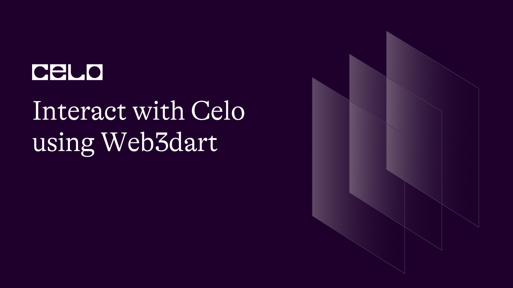
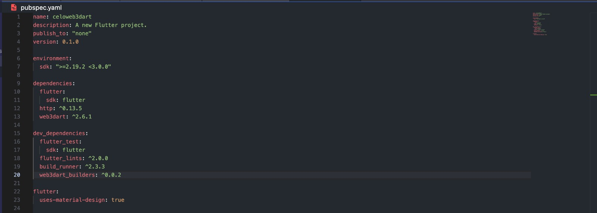
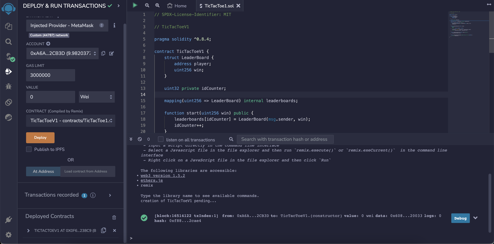
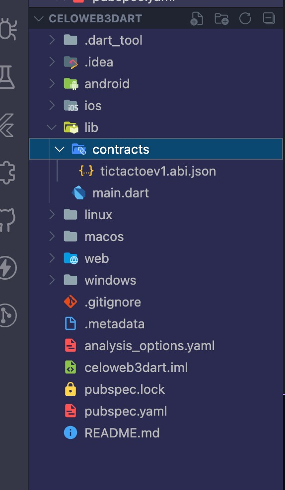
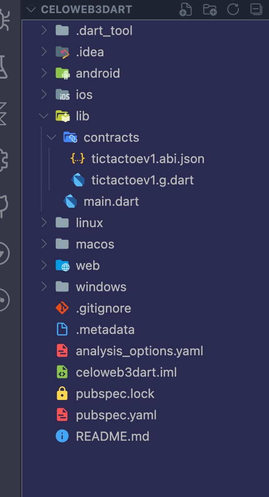
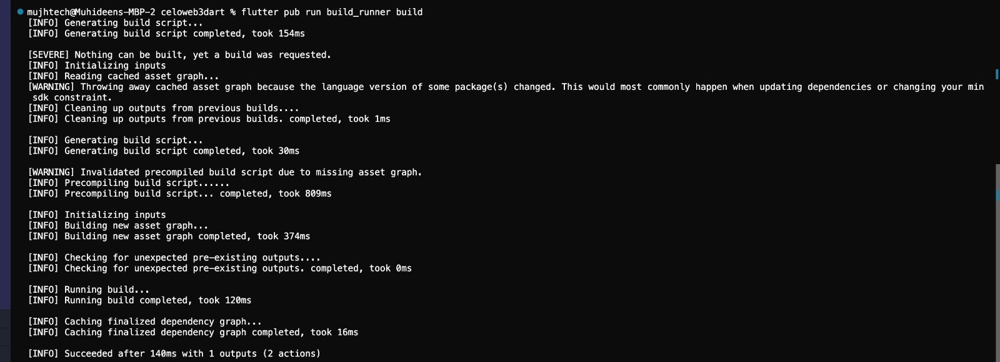
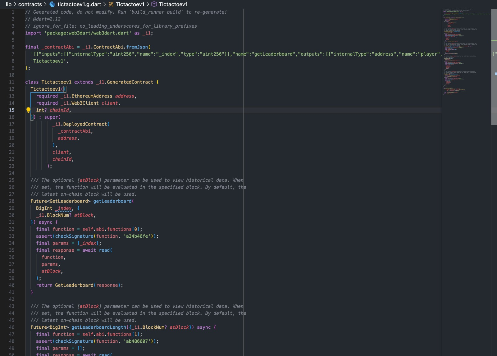
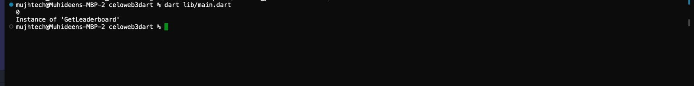

## Introduction

In this tutorial, we'll go over the fundamentals of interacting with Solidity smart contract programming language using web3dart. You will have a fundamental understanding of how to make a contract call in the dart programming language. 

This tutorial will demonstrate how simple it is to interact with smart contracts, call functions, and listen to events in Dart, one of the most flexible programming languages for creating dApps.

### How it works

Web3dart Package is a pretty cool generator that lets you create dart classes from ABIs. Using build_runner to generate functions and classes from ABI/bytecode greatly simplifies the process, even though it might not work on more complex smart contracts.

## Prerequisites

First, This tutorial assumes that you are already familiar with solidity and understand how smart contracts work and also assumes that you already know the basics of using dart language.

For this project we'll be using a few interesting dependencies & dev dependencies:

- [http](https://pub.dev/packages/http/example) : A composable, Future-based library for making HTTP requests.
- [web3dart](https://pub.dev/packages/web3dart/example) : A dart library that connects to interact with the Ethereum blockchain. It connects to an Ethereum node to send transactions, interact with smart contracts, and much more!

For dev dependencies:

- [build_runner](https://pub.dev/packages/build_runner) : This package provides a concrete way of generating files using Dart code, outside of tools like pub
- [web3dart_builders](https://pub.dev/packages/web3dart_builders) : This package is an extension of the web3dart package that includes the dart contract generator from ABI.



## Getting Started

I assume anyone going through this tutorial already understands and uses Flutter, so I will skip the setup involved in getting Flutter to work on your development computer. That means I assume you already have VS Code/Android Studio together with Android SDK and Flutter setup on your PC.

If you are entirely new to Flutter, here ([https://docs.flutter.dev/get-started/install](https://docs.flutter.dev/get-started/install)) is a good tutorial you can learn from.

## Setup the Smart Contract

The next step is to compile our smart contract using the solidity compiler of your choice, such as hardhat, truffle, or any other solidity compiler.

```solidity
// SPDX-License-Identifier: MIT

// TicTacToeV1

pragma solidity ^0.8.4;

contract TicTacToeV1 {
    struct LeaderBoard {
        address player;
        uint256 win;
    }

    uint32 private idCounter;

    mapping(uint256 => LeaderBoard) internal leaderboards;

    function start(uint256 win) public {
        leaderboards[idCounter] = LeaderBoard(msg.sender, win);
        idCounter++;
    }

    function getLeaderboard(uint256 _index)
        public
        view
        returns (address player, uint256)
    {
        LeaderBoard storage leaderboard = leaderboards[_index];
        return (leaderboard.player, leaderboard.win);
    }

    function updateLeaderboard(uint256 index) public {
        leaderboards[index].win++;
    }

    function getLeaderboardLength() public view returns (uint256) {
        return (idCounter);
    }
}
```

### Deploy Smart contract (Remix)

Now that your contract is compiled, you can deploy your smart contract to the network. You can deploy to any Ethereum compatible network, and in this case we’ll be deploying the Celo testnet or mainnnet depending on your preference. If you’re brand new to this stick with testnet!
 - Click the Deploy and Run Transactions Icon on the left side menu.
 - Choose Injected Web3 as your environment.
 - [Connect MetaMask to Celo](https://medium.com/@joenyzio/3-simple-steps-to-connect-your-metamask-wallet-to-celo-732d4a139587) testnet and verify the network.



## Dart Implementation

### Directory structure



**Before and After**

Let’s copy our Contract ABIs into our project.

Then create a folder in the project folder directory lib  and create a file named **tictactoev1.abi.json**. Note your file name can be anything but make sure the file extension start and ends with **.abi.json**. With the help of **build_runner** & **web3dart_builders** we will be able to generate a dart contract object file which we will be using to interact with our smart contract.

Run this in your terminal

```bash
flutter pub run build_runner build
```

or

```bash
flutter pub run build_runner watch
```



This will generate a dart file to represent our smart contract object named **tictactoev1.g.dart**.



### Dart Implementation

```dart
import 'package:celoweb3dart/contracts/tictactoev1.g.dart';
import 'package:http/http.dart';
import 'package:web3dart/web3dart.dart';

void main() async {
  const rpcUrl = 'https://alfajores-forno.celo-testnet.org';
  final client = Web3Client(rpcUrl, Client());

  // Import your private key or generate one from hardhat
  final credentials = EthPrivateKey.fromHex(
    '-------',

    /// This is generated by hardhat, not a real account
  );

  // Import your smart contract address
  final tictactoeV1 = Tictactoev1(
    address:
        EthereumAddress.fromHex('0x0f6E0e3F5df62d4067D9969Cd3c9F34cc2b238C9'),

    /// This is generated by hardhat, not a real account
    client: client,
  );

  // Add user to leaderboard
  await tictactoeV1.start(BigInt.one, credentials: credentials);

  // Get LeaderboardLength
  print(await tictactoeV1.getLeaderboardLength());

  // Get leaderboard by index
  print(await tictactoeV1.getLeaderboard(BigInt.one));
}
```

We can access the different functions and events that exist in our dart implementation of the TicTacToeV1 smart contract. By running ```dart lib/main.dart```. we can easily see that we have been able to interact seamlessly with our deployed smart contract.



## Conclusion

Congratulations, you have learned how to interact with the CELO blockchain using web3dart.

## About the Author

I am a Software Engineer, Tech Evangelist (Preaching the gospel of flutter & blockchain) also and Ex-GDSC Leads.

## References

- Web3dart [https://pub.dev/packages/web3dart](https://pub.dev/packages/web3dart)
- Flutter [https://flutter.dev](https://flutter.dev)
- Solidity by example [https://solidity-by-example.org/](https://solidity-by-example.org/)


