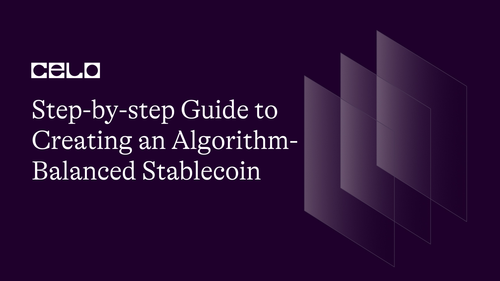

## Introduction

In recent years, stablecoins have emerged as an increasingly popular alternative to conventional cryptocurrencies due to their stable value. However, stablecoins supported by a single asset or basket of assets can still be subject to volatility and price fluctuations. A solution would be creating an algorithm-balanced stablecoin, which uses an algorithm to adjust the supply of the stablecoin based on market conditions. This article will provide a step-by-step guide to creating an algorithm-balanced stablecoin using the Mento protocol, including the technical aspects. 

On completing this tutorial, the reader will better understand how cStables are designed to maintain their value over the long term using the Mento protocol and how to create one using the Celo Governance Proposal (CGP).

## Prerequisites

To continue with this tutorial, we need to understand the following well.
- Solidity and smart contracts
- Stable Coins
- The Celo Blockchain

## What is Mento

**According to the [Mento official documentation](https://docs.mento.org/mento-protocol/introduction/what-is-mento):** Mento is a decentralized and transparent protocol that enables the creation of stable value digital assets, such as assets that track the value of fiat currencies (commonly referred to as ‘stablecoins’). The goal of Mento is to support the real-world adoption of digital currencies by enabling the creation of stable value assets for users worldwide.

## The Mento Protocol

The Mento Protocol enables the creation of 'stablecoins' and liquidity provisions. The protocol supports real-world digital currency adoption and creates 'cStable'. cStables refers to all stablecoins built on Celo using the Celo Mento Protocol and adopted by the governors such as cUSD, cEUR, and cREAL.

The cStables are backed by a reserve of assets, including BTC, ETH, DAI, USDC, CELO, and cMCO2, with a total value of approximately USD 160,838,636 of writing. The reserve status of the Mento Protocol can change over time based on various factors, such as the performance of the underlying assets, market conditions, and user demand for the stablecoins.

## Technical Aspects of the Mento Protocol

The Mento Protocol relies on smart contracts to support the creation of stablecoins, provide liquidity, and implement mechanisms for market stability through expansion and contraction. This tutorial categorizes smart contracts into liquidity and pricing modules to better understand the protocol.

## Liquidity Contracts

*1. Tobin tax:* the expansion and contraction mechanism and using oracles to obtain accurate market data. Below is a dummy contract that simulates the Tobin-tax smart contract.

Below is a simulation of the `Tobintax` smart contract using dummy data and variables:

```solidity
// SPDX-License-Identifier: MIT
pragma solidity ^0.8.0;

contract TobinTax {
    
    uint public taxRate;
    mapping(address => bool) public taxableTransactionTypes;
    address public taxCollectionAccount;
    uint public totalTaxCollected;

    constructor(uint _taxRate, address _taxCollectionAccount) {
        taxRate = _taxRate;
        taxCollectionAccount = _taxCollectionAccount;
    }

    function applyTax(uint _transactionAmount) public payable {
        // Check if the transaction is taxable
        if (taxableTransactionTypes[msg.sig]) {
            uint tax = (_transactionAmount * taxRate) / 100;
            totalTaxCollected += tax;
            // Send the tax to the tax collection account
            payable(taxCollectionAccount).transfer(tax);
            // Send the remaining amount to the recipient
            payable(msg.sender).transfer(_transactionAmount - tax);
        } else {
            // Send the full amount to the recipient
            payable(msg.sender).transfer(_transactionAmount);
        }
    }

    function setTaxableTransactionType(address _transactionType, bool _isTaxable) public {
        // Set whether the given transaction type is taxable
        taxableTransactionTypes[_transactionType] = _isTaxable;
    }

    function getTaxableTransactionType(address _transactionType) public view returns (bool) {
        // Get whether the given transaction type is taxable
        return taxableTransactionTypes[_transactionType];
    }

    function getTotalTaxCollected() public view returns (uint) {
        // Get the total tax collected so far
        return totalTaxCollected;
    }
}
```
In the implementation above, the `TobinTax` contract sets the `taxRate` variable when we deploy the contract. It also has a `taxableTransactionTypes` mapping that can specify which types of transactions are taxable. The `totalTaxCollected` variable keeps track of the total tax collected so far.

To apply the Tobin tax to a transaction, we can call the `applyTax` function. It checks if the transaction is taxable and calculates the amount of tax to collect. The `taxCollectionAccount` receives the tax, and `applyTax` sends the remaining amount to the recipient.

The `setTaxableTransactionType` and `getTaxableTransactionType` functions determine whether a transaction type is taxable.
Lastly, to get the total tax collected so far, we can use the `getTotalTaxCollected.`

*2. ValueDeltaBreaker:* This contract is another module used to prevent large fluctuations in the liquidity pools' exchange rates of stablecoins and collateral assets. The module calculates the value of the stablecoins and collateral assets in the pools and compares it to the total value of the reserve and collateral assets. If the difference between the two exceeds a certain threshold, the module automatically adjusts the exchange rates to prevent large fluctuations.

Below is a simulation of the `ValueDeltaBreaker` smart contract using dummy data and variables:

```solidity
// SPDX-License-Identifier: MIT
pragma solidity ^0.8.0;

contract ValueDeltaBreaker {
    
    uint public threshold;
    uint public lastValue;
    bool public isBroken;

    constructor(uint _threshold) {
        threshold = _threshold;
    }

    function checkValue(uint _value) public {
        if (_value - lastValue >= threshold) {
            isBroken = true;
        } else {
            isBroken = false;
        }
        lastValue = _value;
    }

    function getIsBroken() public view returns (bool) {
        return isBroken;
    }

    function getLastValue() public view returns (uint) {
        return lastValue;
    }
}
```

In the contract above, the `ValueDeltaBreaker` contract sets the threshold variable when we deploy the contract. It also has a `lastValue` variable that keeps track of the last recorded value and sets the `isBroken` variable to true if the value delta exceeds the threshold.

The `checkValue` function checks whether the value delta exceeds the threshold. It compares the difference between the given `_value` and the last recorded `value`; if the difference is greater than or equal to the threshold, it sets `isBroken` to `true`. Otherwise, it sets `isBroken` to `false`.

The `getIsBroken` and `getLastValue` functions return the current values of `isBroken` and `lastValue`, respectively.

*3. BreakerBox:* implements the Tobin tax mechanism on the Mento Protocol. The contract is responsible for collecting fees from stablecoin transactions and transferring them to the reserve contract to stabilize the value of the stablecoins.

Below is a simulation of `BreakerBox` smart contract using dummy data and variables:
```solidity
// SPDX-License-Identifier: MIT
pragma solidity ^0.8.0;

interface IERC20 {
    function transfer(address to, uint256 value) external returns (bool);
    function balanceOf(address account) external view returns (uint256);
}

contract BreakerBox {
    
    uint public constant TAX_RATE = 1; // 1% Tobin tax rate
    mapping(address => bool) public taxableTokens;
    address public taxCollectionAccount;

    constructor(address _taxCollectionAccount) {
        taxCollectionAccount = _taxCollectionAccount;
    }

    function applyTax(address _token, address _recipient, uint _amount) public {
        // Check if the token is taxable
        require(taxableTokens[_token], "Token not taxable");
        
        // Calculate the tax amount
        uint tax = (_amount * TAX_RATE) / 100;
        
        // Transfer taxed amount to a tax collection account
        IERC20(_token).transfer(taxCollectionAccount, tax);
        
        // Transfer remaining amount to the recipient
        IERC20(_token).transfer(_recipient, _amount - tax);
    }

    function setTaxableToken(address _token, bool _isTaxable) public {
        // Set whether the given token is taxable
        taxableTokens[_token] = _isTaxable;
    }

    function getTaxableToken(address _token) public view returns (bool) {
        // Get whether the given token is taxable
        return taxableTokens[_token];
    }

    function getTotalTaxCollected(address _token) public view returns (uint) {
        // Get the total tax collected for the given token
        return IERC20(_token).balanceOf(taxCollectionAccount);
    }
}
```

In the contract above, the `BreakerBox` contract has a constant `TAX_RATE` variable representing the Tobin tax rate. It also has a `taxableTokens` mapping that can specify which tokens are taxable. The `taxCollectionAccount` variable holds the account address to send the collected tax.

The `applyTax` function applies the Tobin tax to a transaction. It checks whether the token is transferred to the `taxCollectionAccount` and whether the remaining amount is transferred to the recipient.

The `setTaxableToken` and `getTaxableToken` functions set and get whether a particular token is taxable.

The `getTotalTaxCollected` function collects a particular token's total tax.

*4. PartialReserve:* This module implements the expansion and contraction mechanism of the Mento Protocol. The module is responsible for tracking the value of the reserve and collateral assets and adjusting the exchange rates of stablecoins and collateral assets in the liquidity pools to maintain a stable exchange rate. The module also includes various parameters that can be adjusted to optimize the system's stability.

Below is a simulation of the `PartialReserve` smart contract using dummy data and variables:

```solidity
// SPDX-License-Identifier: MIT
pragma solidity ^0.8.0;

interface IERC20 {
    function transfer(address to, uint256 value) external returns (bool);
    function balanceOf(address account) external view returns (uint256);
}

contract PartialReserve {
    
    uint public constant RESERVE_RATIO = 10; // 10% reserve ratio
    mapping(address => uint) public reserveBalances;
    address public reserveAccount;

    constructor(address _reserveAccount) {
        reserveAccount = _reserveAccount;
    }

    function deposit(address _token, uint _amount) public {
        // Transfer tokens to a contract
        IERC20(_token).transferFrom(msg.sender, address(this), _amount);
        
        // Calculate the reserve amount
        uint reserve = (_amount * RESERVE_RATIO) / 100;
        
        // Transfer reserve to reserve account
        IERC20(_token).transfer(reserveAccount, reserve);
        
        // Add remaining amount to the reserve balance
        reserveBalances[_token] += _amount - reserve;
    }

    function withdraw(address _token, uint _amount) public {
        // Check that there are sufficient reserve funds
        require(reserveBalances[_token] >= _amount, "Insufficient reserves");
        
        // Calculate the amount to withdraw
        uint withdrawAmount = (_amount * 100) / (100 - RESERVE_RATIO);
        
        // Transfer tokens to the user
        IERC20(_token).transfer(msg.sender, withdrawAmount);
        
        // Subtract amount from reserve balance
        reserveBalances[_token] -= _amount;
    }

    function getReserveBalance(address _token) public view returns (uint) {
        // Get the current reserve balance for the given token
        return reserveBalances[_token];
    }
}
```

In the contract above, the `PartialReserve` contract has a constant `RESERVE_RATIO` variable representing the reserve ratio. It also has a `reserveBalances` mapping that keeps track of each token's reserve balance. The `reserveAccount` variable holds the account's address where the reserve fund will be stored.

The `deposit` function deposits tokens into the reserve and transfers the tokens to the contract, calculates the reserved amount, and transfers the reserve to the `reserveAccount`. It also adds the remaining amount to the reserve balance.

The `withdraw` function withdraws tokens from the reserve. It checks sufficient reserve funds, calculates the amount to withdraw, transfers the tokens to the user, and subtracts the amount from the reserve balance.
The `getReserveBalance` function gets the current reserve balance for a particular token.

*5. BiPoolManager:* contract manages the liquidity pools that back the stablecoins on the Mento Protocol. The contract is responsible for managing the liquidity of the pools, implementing the ConstantSum PricingModule and the ConstantProduct PricingModule to determine the exchange rates of stablecoins and collateral assets, and implementing the MedianDeltaBreaker and ValueDeltaBreaker modules to prevent large fluctuations in the exchange rates.

Below is a simulation of the `BiPoolManager` smart contract using dummy data and variables:

```solidity
// SPDX-License-Identifier: MIT
pragma solidity ^0.8.0;

interface IERC20 {
    function transfer(address to, uint256 value) external returns (bool);
    function balanceOf(address account) external view returns (uint256);
}

contract BiPoolManager {
    
    struct BiPool {
        address tokenA;
        address tokenB;
        uint balanceA;
        uint balanceB;
    }
    
    mapping(address => BiPool) public bipools;
    
    function createBiPool(address _tokenA, address _tokenB, uint _balanceA, uint _balanceB) public {
        // Create new BiPool with specified balances
        BiPool memory newPool = BiPool({
            tokenA: _tokenA,
            tokenB: _tokenB,
            balanceA: _balanceA,
            balanceB: _balanceB
        });
        
        // Add new BiPool to mapping
        bipools[address(newPool)] = newPool;
        
        // Transfer tokens from sender to BiPool
        IERC20(_tokenA).transferFrom(msg.sender, address(newPool), _balanceA);
        IERC20(_tokenB).transferFrom(msg.sender, address(newPool), _balanceB);
    }
    
    function swap(address _biPool, address _fromToken, address _toToken, uint _amount) public {
        // Get BiPool from mapping
        BiPool storage biPool = bipools[_biPool];
        
        // Determines which token to swap out and swap in

        bool fromTokenA = (_fromToken == biPool.tokenA);
        bool toTokenA = (_toToken == biPool.tokenA);
        
        // Calculate exchange rate
        uint exchangeRate = (fromTokenA ? biPool.balanceB * 1000 / biPool.balanceA : biPool.balanceA * 1000 / biPool.balanceB);
        
        // Calculate amount of tokens to swap
        uint swapAmount = (fromTokenA ? _amount * exchangeRate / 1000 : _amount * 1000 / exchangeRate);
        
        // Transfer tokens from sender to BiPool
        IERC20(_fromToken).transferFrom(msg.sender, address(biPool), _amount);
        
        // Update BiPool balances
        if (fromTokenA) {
            biPool.balanceA += _amount;
            biPool.balanceB -= swapAmount;
        } else {
            biPool.balanceB += _amount;
            biPool.balanceA -= swapAmount;
        }
        
        // Transfer swapped tokens to sender
        IERC20(_toToken).transfer(msg.sender, swapAmount);
    }
    
    function getBalance(address _biPool, address _token) public view returns (uint) {
        // Get BiPool from mapping
        BiPool storage biPool = bipools[_biPool];
        
        // Get balance of specified token
        if (_token == biPool.tokenA) {
            return biPool.balanceA;
        } else if (_token == biPool.tokenB) {
            return biPool.balanceB;
        } else {
            return 0;
        }
    }
}
```
In this implementation, the `BiPoolManager` contract has a BiPool struct that represents a BiPool with two tokens, tokenA and tokenB, and their respective balances, `balanceA` and `balanceB`. The `bipools` mapping keeps track of all the `BiPools` created by the contract.
The `createBiPool` function creates a new `BiPool` with the specified tokens and their initial balances. The function takes in four parameters: `_tokenA`, `_tokenB`, `_balanceA`, and `_balanceB`, which represent the addresses of the two tokens in the BiPool and their initial balances, respectively.

The function creates a new `BiPool` struct with the specified token addresses and initial balances. It then adds the new `BiPool` to the `bipools` mapping using the address of the new `BiPool` as the key. Finally, the function transfers the specified amount of each token from the sender to the new `BiPool`.

Once the `BiPool` is created, users can swap between the two tokens in the `BiPool` using the swap function. We can use `getBalance` function to get the balance of a specified token in a specified `BiPool`.

*6. MedianDeltaBreaker:* This contract prevents large fluctuations in the liquidity pools' exchange rates of stablecoins and collateral assets. The module calculates the median exchange rate across all pools and compares it to the current exchange rate. If the difference between the two exceeds a certain threshold, the module automatically adjusts exchange rates to prevent large fluctuations.

```solidity
// SPDX-License-Identifier: MIT
pragma solidity ^0.8.0;

contract MedianDeltaBreaker {
    address public constant TARGET_TOKEN = 0x1234567890123456789012345678901234567890;
    uint public constant DELTA_THRESHOLD = 100000; // Target token price delta threshold
    uint public constant BREAKER_FEE = 1000; // Breaker fee as a percentage
    uint public constant NUM_ORACLES = 3; // Number of oracles to use
    
    address public owner; // Owner of the contract
    address public beneficiary; // Address to receive the breaker fee
    
    constructor(address _beneficiary) {
        owner = msg.sender;
        beneficiary = _beneficiary;
    }
    
    function setBeneficiary(address _beneficiary) external {
        require(msg.sender == owner, "Only owner can set beneficiary");
        beneficiary = _beneficiary;
    }
    
    function breakTargetToken() external {
        uint[] memory prices = new uint[](NUM_ORACLES);
        
        for (uint i = 0; i < NUM_ORACLES; i++) {
            prices[i] = getPrice(i);
        }
        
        uint targetTokenPrice = getMedian(prices);
        uint anchorTokenPrice = getPrice(ANCHOR_TOKEN);
        uint priceDelta = targetTokenPrice > anchorTokenPrice ? targetTokenPrice - anchorTokenPrice : anchorTokenPrice - targetTokenPrice;
        
        require(priceDelta > DELTA_THRESHOLD, "Price delta not exceeded");
        
        uint breakerFee = (priceDelta * BREAKER_FEE) / 10000;
        uint amountToTransfer = priceDelta - breakerFee;
        
        // Transfer the target token to the contract
        IERC20(TARGET_TOKEN).transferFrom(msg.sender, address(this), amountToTransfer);
        
        // Transfer the breaker fee to the beneficiary
        IERC20(TARGET_TOKEN).transfer(beneficiary, breakerFee);
    }
    
    function getPrice(uint _oracleIndex) public view returns (uint) {
        // Dummy function to return a random price for the given oracle index
        return (block.timestamp % 100000) + (_oracleIndex * 100000);
    }
    
    function getMedian(uint[] memory values) public pure returns (uint) {
        uint n = values.length;
        uint[] memory sortedValues = new uint[](n);
        for (uint i = 0; i < n; i++) {
            sortedValues[i] = values[i];
        }
        for (uint i = 0; i < n; i++) {
            for (uint j = i + 1; j < n; j++) {
                if (sortedValues[j] < sortedValues[i]) {
                    uint tmp = sortedValues[i];
                    sortedValues[i] = sortedValues[j];
                    sortedValues[j] = tmp;
                }
            }
        }
        if (n % 2 == 0) {
            return (sortedValues[n / 2 - 1] + sortedValues[n / 2]) / 2;
        } else {
            return sortedValues[n / 2];
        }
    }
}

interface IERC20 {
    function transfer(address to, uint256 value) external returns (bool);
    function transferFrom(address from, address to, uint256 value) external returns (bool);
}
``` 

This `MedianDeltaBreaker` contract is similar to the `ValueDeltaBreaker` contract but uses a median price of multiple oracles feeds to calculate the target token price. The contract allows users to trigger a breaker function when the price delta between the target token and

## Pricing Modules

The protocol uses the pricing module to determine the cost or fee of executing particular actions or transactions. There are two types of modules which are as follows:

*ConstantProduct Pricing Module:* The ConstantProduct PricingModule is another module used to determine the exchange rates of stablecoins and collateral assets in the liquidity pools. The module ensures that the product of the pool's stablecoin and collateral asset balances remains constant, which also helps stabilize the exchange rates.

*ConstantSum Pricing Module:* The ConstantSum PricingModule is a module used to determine the exchange rates of stablecoins and collateral assets in the liquidity pools. The module ensures that the total value of the stablecoins and collateral assets in the pool remains constant, which helps to stabilize the exchange rates.

## Creating a New Stablecoin on Celo through the CGP

Proposing a new stablecoin would require a Celo Governance Proposal (CGP). The [Celo official website](https://docs.celo.org/developer-guide/protocol/governance/proposals) has a comprehensive guide we can follow to create a proposal. However, before creating a CGP for a new cStable, we should consider the following factors:

*Use Cases:* Stablecoins on Celo should be designed for a broad range of transactions, including payments and remittances, and as a store of value. The use cases should be user-friendly and support a wide range of transactions.

*Partner Integrations:* Exchange partnerships that will integrate the stablecoin are crucial to support broader adoption and ensure a seamless user experience.

*Liquidity:* Adequate liquidity is crucial to prevent the stablecoin from getting depegged. Stablecoins on Celo should partner with exchanges and market makers and utilize market-making tools to ensure sufficient liquidity.

*Yield:* Providing yield incentives to users with the stablecoin can help drive adoption and usage.

*Marketing:* A detailed marketing plan that outlines the promotion plan for the stablecoin and the target audiences is critical to raise awareness and drive adoption.

*Security:* Multi-sig wallets, audits, and insurance policies are some of the security measures that should be implemented to ensure the security of stablecoins on Celo.

*Transparency:* The proposal should outline the strategy to manage the stablecoin's reserves and how audits and reports will be provided to ensure transparency.

*Legal Compliance:* Stablecoins on Celo should comply with all relevant laws and regulations, including KYC/AML and securities laws.

*Community:* Engaging with the community and incorporating feedback is crucial to the long-term success of stablecoins on Celo.

*Governance:* The proposal should define a clear mechanism for how to make changes and decisions related to the stablecoin's management and upgrades.

*Partnerships:* Strategic partnerships can help drive the adoption and usage of stablecoins on Celo.

*Accessibility:* The stablecoin should be easily accessible to users globally, especially the targets, with support for different currencies and languages.

*Technology:* The proposal writers should outline the technology used to create the cStable, explicitly mentioning the Celo protocol, as stablecoins on Celo are built using it.

*Failure and recovery:* The proposal should outline what actions will be taken if the stablecoin does not meet the checklist requirements.

*Smart contract changes:* In the unlikely event that a newly launched stablecoin's liquidity drops significantly and needs to be delisted, the smart contract may need to be changed to support this.

*Timeline:* The proposal should include a timeline for completing the checklist, focusing on the supporting tasks of partner integrations, liquidity, and marketing initiatives.

*cLabs' view:* [cLabs](https://clabs.co) is exploring other stablecoins they can help launch. They are gathering use cases for key strategic and social impact markets like the Indian Rupee, Great British Pound, Mexican Peso, and Colombian Peso. They are open to additional use cases for these or other markets.

## Conclusion

The Mento protocol offers a comprehensive solution for creating and designing stablecoins to maintain their value over the long term. Through an algorithm-balanced approach, stablecoins can adjust their supply based on market conditions, reducing the risk of volatility and price fluctuations. By creating cStables, the Mento protocol supports real-world digital currency adoption and provides liquidity provisions. By following the step-by-step guide outlined in this article, readers can better understand the technical aspects of the Mento protocol and learn how to create their algorithm-balanced stablecoin using the Celo Governance Proposal.


## References

[Mento Protocol website](https://mento.finance/)
[Mento Protocol GitHub repository](https://github.com/Mento-Finance/mento-contracts)
[Mento Protocol Whitepaper](https://mento.finance/whitepaper.pdf)
[Celo Mono-Repo](https://github.com/celo-org/celo-monorepo)
[Celo Governance Proposals documentation](https://docs.celo.org/developer-guide/protocol/governance/proposals)
[Successfully Launching More cStables on Celo](https://forum.celo.org/t/successfully-launching-more-cstables-on-celo/3363)

## Author

[Oyeniyi Abiola Peace](https://twitter.com/_iamoracle) is a seasoned software and blockchain developer. He is no stranger to the tech industry, with a degree in Telecommunication Science from the University of Ilorin and over five years of experience in JavaScript, Python, PHP, and Solidity. Peace currently works as the CTO at DFMLab and is a Community Moderator at Celo Blockchain. He loves to read and spend time with family and friends when he is not coding or teaching.

