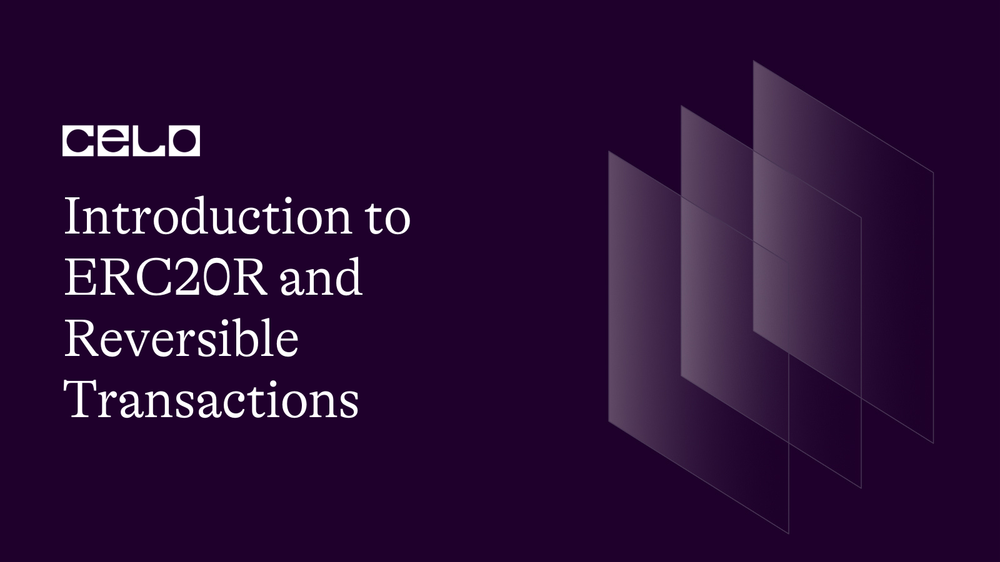

## Introduction

Recently, efforts have been increasingly geared towards researching and developing reversible versions of ERC-20 and ERC-721 tokens- the most widely used token standards in the Ethereum ecosystem - and the reasons are plausible. Since its inception, the cryptocurrency industry has been plagued with incessant hacks, thefts, and accidental losses, all of which have been remediable. However, supporting reversibility for ERC-20 and ERC-721 tokens is poised to upend the status quo and aid in preventing thefts and accidental losses, making the crypto industry far more innocuous. This article provides a detailed look into the need for reversible transactions and a technical approach to how they function. In this article, you will learn the practicalities of reversible transactions and how best they can serve the crypto space.

## Why Are Reversible Transactions Necessary?

In contrast to the traditional banking system, which acts as a trusted third party and stores data on centralized databases, blockchain technology was designed to be an immutable ledger whose data is distributed across multiple nodes upon approval by validators. The centralized nature of traditional finance allows flexibility in transactions’ reversibility at any time. However, this cannot happen with blockchain transactions because once data has been processed, it is automatically stored across all blockchain nodes. Hackers know this fact and have been able to cheat the system and escape with billions of dollars in hacking exploits without being caught.

Annual incidents can gross up to billions of dollars; a typical example is the 2020 annual exploit, which hit $7.8 billion; the amount doubled in 2021 when about $14 billion was stolen. Usually, assets stolen from a victim's address are transferred to another address controlled by the hacker. From there, the assets are laundered by transferring them to other addresses and eventually to an offramp.

To illustrate, let us consider the infamous Ronin Bridge attack as an example. The attacker transferred ETH and USDC from the Ronin contract on Ethereum to an address controlled by the attacker. From there, some of the funds were moved to the "Tornado mixer" (a coin mixer that allows users to obfuscate the origin and destination of transactions) and subsequently held in the ERC-20 contracts.

Similarly, NFTs held in ERC-721, and ERC-1155 contracts have seen a steady increase in theft exploits, with an estimated $100 million stolen in NFTs phishing attacks, among others, in only about 12 months following July 2021. These incidents paint a bleak picture of the crypto industry.

Aside from theft, transaction finality has also worked against us when funds are mistakenly sent to the wrong address. In May 2022, JUNO, a Cosmos-based blockchain, approved a proposal to transfer $36 million to a specific address. The funds were lost due to a typographical error in the address. If there had been a way to reverse that transaction, the funds could have been recovered, hence the need for its development.

## An Overview of the ERC20-R

The ERC20R was proposed by researchers at Stanford. This proposed extension to the widely used ERC-20 token standard would enable transactions to be reversed within a short dispute window. To reverse a transaction, a decentralized group of judges would need to first freeze the disputed assets and then be convinced to reverse the transaction. The mention of a "decentralized set of judges" has caused controversy within the crypto community, with some claiming that decentralized court systems using a similar justice model already exist and are prone to corruption and manipulation. Others argue that involving human judges goes against the core principles of decentralized finance, which seeks to remove the need for central authorities to approve transactions.

## Proposed Workflow

To reverse a transaction using the ERC20R smart contract, the following are the processes involved:

- **The Victim Requests A Freeze On The Stolen Funds**

The victim submits a freeze request to a governance contract, along with relevant evidence and some staked funds. Only an address directly affected by the transaction can initiate a request to freeze a transaction.

- **Judges May Accept Or Deny The Freeze Request**

The request is accepted or rejected by a decentralized panel of judges. If the judges' decision is accepted, an on-chain governance contract is instructed to invoke the freeze function on the impacted ERC-20R or ERC-721R contract. As a result, the assets in question are frozen and cannot be transferred.

- **Execute Freeze**

For NFTs, the process is as simple as freezing the disputed NFT and blocking it from being transferred. The freezing process will be relatively quick, with the judges deciding in one or two days. For ERC-20R, this process traces down the stolen funds and disallows those funds to be transferred. The account owner can still transact with others if their balance stays above the frozen amount.

- **Trial**

Following that, both parties can present evidence to the decentralized panel of judges. When the judges decide, they instruct the governance contract to invoke either the reverse or rejectReverse functions on the impacted ERC-20R or ERC-721R contract. The reverse function returns the disputed (frozen) assets to their original owner. The rejectReverse function removes the freeze on the disputed assets and leaves them in place. The trial could be lengthy, lasting several weeks or months.

Here is a brief breakdown of the functions called by the governance contract. Let us describe this API in more detail:

- **freeze()**

This function calculates and freezes the amounts to be frozen on the attacker's address and potential downstream addresses. It returns a claimID for ERC-20R that points to an on-chain list of account (amount) pairs. The list identifies all of the accounts containing frozen assets related to the complaint, as well as the amount frozen in each. It returns a boolean success flag for ERC-721R. Section 2 explains the inner workings of the freeze function.

- **reverse()**

All frozen assets associated with the claimed theft are returned to the original owner using this function. It takes a valid claimID as an argument for ERC-20R and an argument (tokenId; index) for ERC-721R, where the index identifies the reversed transaction.

- **rejectReverse():** All amounts associated with the claim are unfrozen using the rejectReverse() function. It takes a claimID as an argument for ERC-20R and a tokenId for ERC-721R.

- **clean():** Some transaction data is stored on the chain by reversible contracts. The clean function deletes on-chain information for transactions with a closed dispute window.

_**Side Note:** The freeze(), reverse(), and rejectreverse() functions can only be called by the governance contract, while anyone can call the clean function._

## Real-Life Implementation

The full ERC20R contract has been implemented by Kaili Wang, which can be found [here](https://github.com/kkailiwang/erc20r/blob/master/contracts/ERC20R.sol).

## Conclusion

With intensive research and development, reversible transactions are rapidly evolving. When fully operational, they will contribute significantly to the exponential growth of the crypto industry and reduce hacks and thefts, thereby increasing consumer trust and confidence. This type of technology has a lot of advantages, especially for crypto institutions, because it adds an extra layer of security and allows them to avoid being stuck with an irreversible payment without their consent.

## References

- Kaili Wang, Dan Boneh, and Qinchen Wang (October 2022), ERC-20 and ERC-721: Reversible Transactions on Ethereum. Available at [https://arxiv.org/abs/2208.00543](https://arxiv.org/abs/2208.00543)
- Kaili Wang, (September 2022), Reversible Transactions on Ethereum: ERC-20R and ERC-721R Available at [https://mirror.xyz/kaili.eth/gB-rx89sNAT3CVuxWo6xVFS5ptNcllW7cVWVCfcFa6k](https://mirror.xyz/kaili.eth/gB-rx89sNAT3CVuxWo6xVFS5ptNcllW7cVWVCfcFa6k)

## Author

Oyeniyi Abiola Peace is a seasoned software and blockchain developer. With a degree in Telecommunication Science from the University of Ilorin and over five years of experience in JavaScript, Python, PHP, and Solidity, he is no stranger to the tech industry. Peace currently works as the CTO at DFMLab and is a Community Moderator at Celo Blockchain. When he's not coding or teaching, he loves to read and spend time with family and friends.
