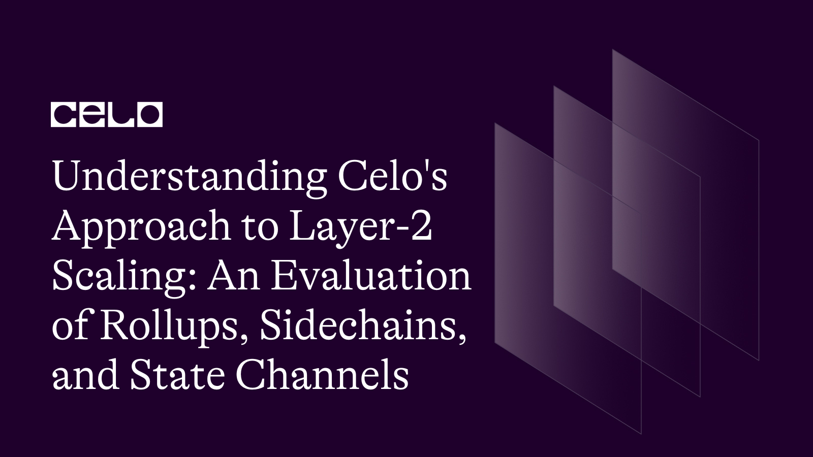

## Introduction

As the demand for blockchain technology continues to grow, the issue of scalability has become increasingly important. Celo, a mobile-first blockchain platform, has implemented a variety of layer-2 scaling solutions to address this challenge, including rollups, sidechains, and state channels.

This article provides a comprehensive evaluation of each of these approaches, explaining how they work. The article also explores the implications of Celo's layer-2 scaling solutions for the wider blockchain ecosystem, including how they may impact the user experience and the development of decentralized applications. The article is intended for developers, blockchain enthusiasts, and anyone interested in understanding how Celo's layer-2 scaling solutions are driving innovation in the blockchain industry.

## Introduction to Celo’s approach to Layer-2 scaling

Layer 2 is a collective term for solutions designed to help scale your application by handling transactions off the Mainnet (layer 1) while taking advantage of the robust decentralized security model of Mainnet. Transaction speed suffers when the network is busy, making the user experience poor for certain types of dapps. And as the network gets busier, gas prices increase as transaction senders aim to outbid each other. Blockchain networks without scalability risk becoming sluggish and unreliable, making it challenging for users to access financial services.

Additionally, layer-2 scaling solutions use sidechains and state channels to increase transaction processing capacity while reducing the load on the main net. Sidechains are separate blockchains that run in parallel to the main net and can process transactions more quickly and efficiently, while state channels are off-chain protocols that allow users to transact without relying on the main net for every transaction.

The importance of scaling solutions for the Celo network cannot be overstated. As more users join the network and more transactions are processed, scalability becomes critical in ensuring that the platform can continue functioning efficiently. Without scalable solutions, Celo's network could become congested, leading to slower transaction processing times, higher transaction fees, and a less efficient platform overall. Celo's solutions can help you build fast, efficient, and sustainable blockchain applications.

## Overview of Rollups, Sidechains, and State Channels

Due to the massive amount of data that needs to be processed, blockchain-based applications, like those on the Celo platform, can run into performance and scalability problems. Developers can use layer-2 scaling techniques like rollups, sidechains, and state channels to solve this issue.

Rollups are particularly exciting for developers as they can significantly increase the number of transactions that can be processed on the blockchain. Optimistic rollups can bundle transactions off-chain while maintaining a high level of security through a challenging period, during which the community can dispute invalid transactions. Alternatively, zk-rollups offer more privacy and efficiency by using zero-knowledge proofs.

Sidechains offer another way to scale by allowing developers to build separate chains that run parallel to the Celo blockchain. These sidechains can handle specific types of transactions, which can reduce the load on the main net and improve the overall performance of the system.

Finally, state channels enable developers to transact off-chain, making it possible to process high-frequency or low-value transactions without congesting the main net. This optimizes the performance of applications and makes transactions faster and more efficient.

## How do Roll Ups work?

Rollups are Layer 2 scaling solutions for blockchain networks that allow for more efficient and cost-effective transactions. They work by aggregating multiple transactions off-chain and then bundling them into a single transaction on-chain. This bundling process is known as "rolling up" transactions, hence the name "rollups."

There are two types of rollups with different security models:
Optimistic rollups: assume transactions are valid by default and only run the computation, via a [fraud-proof](https://ethereum.org/en/glossary/#fraud-proof), in the event of a challenge.
Zero-knowledge rollups: runs computation off-chain and submits a [validity proof](https://ethereum.org/en/glossary/#validity-proof) to the chain.

In an Optimistic Rollup, a fraud-proof mechanism is used to ensure the security of the system. If a fraudulent transaction is included in the rollup, any user can submit fraud proof to the main blockchain, which triggers a challenging period. During the challenge period, the fraudulent transaction is validated and if it is found to be invalid, the transaction is reverted, and the user who submitted the fraud-proof is rewarded with a bounty.

Here is a code example of how to implement Optimism Rollup on the Celo network using Solidity:

```solidity
//SPDX-License-Identifier: MIT
pragma solidity ^0.8.0;


import "@ethersproject/contracts/token/ERC20/IERC20.sol";
import "@optimism/sol-calls/contracts/OVM_CrossDomainMessenger.sol";


contract Rollup {
    address public l2Bridge;
    mapping(address => uint256) public balances;


    event Deposit(address indexed account, uint256 amount);
    event Withdraw(address indexed account, uint256 amount);


    constructor(address _l2Bridge) {
        l2Bridge = _l2Bridge;
    }


    function deposit(uint256 amount) external {
        // Transfer Celo tokens from the user to the Rollup contract
        IERC20 celo = IERC20(0x471EcE3750Da237f93B8E339c536989b8978a438);
        celo.transferFrom(msg.sender, address(this), amount);


        // Increase the user's balance on the Rollup contract
        balances[msg.sender] += amount;


        emit Deposit(msg.sender, amount);


        // Send a message to the L2 bridge to notify it of the deposit
        OVM_CrossDomainMessenger(l2Bridge).sendMessage(
            abi.encodeWithSignature("deposit(address,uint256)", msg.sender, amount),
            0
        );
    }


    function withdraw(uint256 amount) external {
        // Check that the user has enough balance on the Rollup contract
        require(balances[msg.sender] >= amount, "insufficient balance");


        // Decrease the user's balance on the Rollup contract
        balances[msg.sender] -= amount;


        // Transfer Celo tokens from the Rollup contract to the user
        IERC20 celo = IERC20(0x471EcE3750Da237f93B8E339c536989b8978a438);
        celo.transfer(msg.sender, amount);


        emit Withdraw(msg.sender, amount);


        // Send a message to the L2 bridge to notify it of the withdrawal
        OVM_CrossDomainMessenger(l2Bridge).sendMessage(
            abi.encodeWithSignature("withdraw(address,uint256)", msg.sender, amount),
            0
        );
    }
}
```

This implementation defines a Rollup contract that can handle deposits and withdrawals of Celo tokens. It uses the IERC20 interface to interact with the Celo token contract and the OVM_CrossDomainMessenger contract to communicate with the L2 bridge.

To use this Rollup contract, you need to deploy it on the Celo network using [Remix](https://remix.ethereum.org/) or any other Solidity IDE. Make sure to pass in the address of the L2 bridge as a constructor argument.

Once the Rollup contract is deployed, you can deposit Celo tokens into the Rollup contract by calling the `deposit` function with the desired amount as a parameter. To withdraw Celo tokens, call the `withdraw` function with the amount to withdraw as a parameter. The Rollup contract will handle the transfers and communicate with the L2 bridge to update the state of the Optimism Rollup.

## How do Sidechains work?

Users can create new smart contracts and tokens on sidechains, which are independent chains connected to the main blockchain. Because they are separate but linked to the main blockchain, developers can test out new features and functions without worrying about how they will affect the main net. Instead of using the main blockchain to verify transactions, sidechains use their own unique consensus mechanism. This makes it possible for improved scalability and quicker transaction processing.

Sidechains, which can be used to create unique applications and smart contracts, are supported by the [Celo](https://celo.org/) Network. The [Celo SDK](https://celo-sdk-docs.readthedocs.io/en/latest/) allows programmers to build and control sidechains that can interface with the primary blockchain. The use of cross-chain bridges, which allow tokens and data to be transferred between sidechains and the main net, is also supported by the Celo Network.

To implement a sidechain on the Celo network, we will use Celo's protocol for interoperability called "Mento '' which allows for the creation of side chains and cross-chain asset transfers.

To implement a sidechain on the Celo network, we will use Celo's protocol for interoperability called "Mento '' which allows for the creation of sidechains and cross-chain asset transfers. Here's an example of how to create a sidechain on the Celo network using Mento:

```solidity
//SPDX-License-Identifier: MIT
 pragma solidity ^0.8.0;


import "@celo-org/mento/contracts/mento/MentoBridge.sol";
import "@celo-org/mento/contracts/mento/MentoToken.sol";


contract MySidechain {
    MentoBridge public bridge;
    MentoToken public token;


    constructor(address _bridgeAddress) {
        bridge = MentoBridge(_bridgeAddress);
        token = new MentoToken("My Sidechain Token", "MST");
    }


    function deposit(uint256 amount) public {
        token.mint(msg.sender, amount);
        token.approve(address(bridge), amount);
        bridge.deposit(token, amount);
    }


    function withdraw(uint256 amount) public {
        bridge.withdraw(token, amount);
        token.burn(msg.sender, amount);
    }
}


```

In this example, we first import the necessary contracts from the Mento library, namely the MentoBridge and MentoToken contracts. We then create a MySidechain contract which takes the address of the Mento bridge as a constructor argument. We store the MentoBridge instance in a public variable called bridge.

We also create an instance of a MentoToken contract which represents the token on our sidechain. In this example, we use the MentoToken contract provided by the Mento library, but we can also create our own implementation.

The `deposit` function allows users to deposit tokens into the sidechain by first minting the tokens to the user's account, then approving the bridge to transfer the tokens, and finally calling the `deposit` function on the MentoBridge contract.
The ‘withdraw’ function allows users to withdraw tokens from the sidechain by calling the `withdraw` function on the MentoBridge contract and then burning the tokens from the user's account.

With this implementation, we have created a sidechain on the Celo network using Mento for interoperability. Users can deposit and withdraw tokens between the main Celo network and our sidechain using the Mento bridge.

## How do State Channels work?

State channels are a nifty way of handling transactions that don't require using the blockchain itself. Basically, it's a method where two people create a little pathway between them where they can carry out multiple transactions. This means that they can interact with each other directly instead of having to broadcast everything to the larger blockchain network. The really cool part is that only the final state of the channel is stored on the blockchain, which helps keep things secure.

By lowering the volume of on-chain transactions that need to be processed, state channels significantly contribute to improving the scalability of blockchain networks. As a result, there can be more transactions processed per second, which boosts productivity and lowers transaction costs.

State channels can also considerably shorten the time needed to complete transactions. Participants can manage transactions outside of the blockchain, so they don't have to wait for confirmation there before settling them.

State channels allow for off-chain transactions between parties, reducing transaction fees and increasing transaction speeds. In order to implement state channels on the Celo network, we will use the Solidity library for state channels called `celo-monorepo`.

Here's an example of how to implement state channels on the Celo network using the celo-monorepo library:

```solidity
//SPDX-License-Identifier: MIT
pragma solidity ^0.8.0;


import "@celo-monorepo/libraries/src/channel/StateChannel.sol";


contract MyStateChannel {
    StateChannel.Channel public channel;


    constructor(address[] memory _signers, uint256 _nonce, uint256 _timeout) {
        channel = StateChannel.createChannel(_signers, _nonce, _timeout);
    }


    function deposit(uint256 amount) public {
        channel.deposit(amount);
    }


    function startExit() public {
        channel.startExit();
    }


    function finalizeExit() public {
        channel.finalizeExit();
    }


    function update(uint256[] memory amounts, bytes32[] memory newRootHash, bytes memory sigs) public {
        channel.update(amounts, newRootHash, sigs);
    }
}
```

In this example, we first import the StateChannel library from the celo-monorepo repository. We then create a MyStateChannel contract which takes an array of signer addresses, a nonce, and a timeout as constructor arguments. We create a public variable called channel which is an instance of the Channel struct in the StateChannel library, created by calling the createChannel function with the constructor arguments.

The deposit function allows users to deposit funds into the state channel by calling the deposit function on the channel instance. The startExit function allows a party to initiate the exit process by calling the startExit function on the channel instance.

The finalizeExit function allows the other party to finalize the exit process by calling the finalizeExit function on the channel instance. The update function allows the parties to update the state of the channel by calling the update function on the channel instance, passing in an array of updated amounts, a new root hash, and signatures from the signers.

With this implementation, we have created a state channel on the Celo network using the celo-monorepo library. Users can deposit funds into the state channel, update the state of the channel off-chain, and finalize the channel by calling the appropriate functions on the channel instance.

## Evaluation of their use cases

Rollups, sidechains, and state channels are all layer-2 scaling solutions for blockchain networks, each designed to address specific use cases.

- **Rollups**:

Rollups are well-suited for use cases that require high throughput and complex smart contracts. They are capable of processing thousands of transactions per second, which makes them ideal for applications that require a high degree of scalability. Rollups also retain the security guarantees of the underlying blockchain and can support complex smart contracts.

One common use case for rollups is decentralized exchanges (DEXs). DEXs require high throughput and complex smart contract functionality to support features such as limit orders and margin trading. Rollups can provide this functionality while maintaining the security and decentralization of the underlying blockchain.

- **Sidechains**:

Sidechains are best suited for specific use cases that require specialized functionality. Sidechains can be designed to have their own consensus mechanisms, transaction fees, and block times, making them highly flexible. This flexibility allows sidechains to be tailored to specific use cases, such as gaming or asset exchange.

One popular use case for sidechains is gaming. Gaming requires high throughput, low latency, and specialized functionality such as non-fungible tokens (NFTs). Sidechains can provide these features while allowing for a seamless gaming experience that is not possible on the main blockchain.

- **State Channels**:

State channels are ideal for applications that require high throughput and low fees for simple transactions. State channels are limited to simple payment channels and cannot support complex smart contracts. However, they offer instant transaction processing and do not require every transaction to be processed on the blockchain.

One common use case for state channels is microtransactions. Microtransactions require low fees and instant processing times, making state channels an ideal solution. State channels can also be used for applications that require fast and frequent transactions, such as online advertising.

## Conclusion

This article introduces Celo's approach to layer-2 scaling solutions, which can help improve transaction speed and reduce gas prices for users of blockchain-based applications. Layer 2 solutions like rollups, sidechains, and state channels allow for more efficient and cost-effective transactions, enabling developers to scale their applications. Rollups, in particular, bundle transactions off-chain and then process them as a single transaction on-chain, increasing the number of transactions that can be processed. Optimistic rollups and zk-rollups are two types of rollups that differ in their security models. Celo's solutions can help developers build fast, efficient, and sustainable blockchain applications.

## Next Steps​

I hope you learned a lot from this tutorial. Please check out the [Github Repository](https://github.com/Kyrian212/Layer-2-scaling) or the [Celo Documentation](https://docs.celo.org/) to learn more.

## About the Author​

Kyrian Chigozie is a Technical Writer with a passion for web3 technology. Connect with me on [Twitter](https://twitter.com/Kyrian_M) and [LinkedIn](https://www.linkedin.com/in/kyrianm/).

## References

- [Celo docs](https://docs.celo.org/)
- [Celo-sdk](https://celo-sdk-docs.readthedocs.io/en/latest/)
- [Scaling](https://ethereum.org/en/developers/docs/scaling/)
- [Fraud-proof](https://ethereum.org/en/glossary/#fraud-proof)
- [Validity-proof](https://ethereum.org/en/glossary/#validity-proof)
- [Remix](remix.ethereum.org/)
