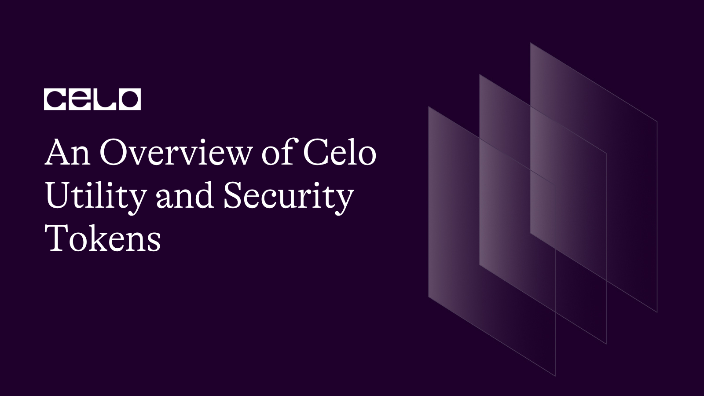

## Introduction

Utility tokens are digital assets that lives on the blockchain and can be used to gain access to certain things, such as a game or a website. They do not give you ownership of a company or anything like that. On the other hand, security tokens are unique as they denote ownership, e.g., ownership of a company or a piece of property. If you have a security token, you may enjoy the privilege of voting on important decisions or even get compensated financially for owning a portion of an asset. This article thoroughly explains the types of tokens available on Celo, what they are, and why they are important! Let's dive in!

**_Take note: nothing in this article constitute financial advice._**

## Prerequisites

This tutorial is beginner-friendly; only prior knowledge of blockchain is required.

## What are Tokens?

A token is an asset, utility, or unit of value on the blockchain e.g. Celo. It is a programmable asset managed by a smart contract. Examples of tokens on Celo are Moola, ImpactMarket (PACT), Immortal DAO (IMMO), and Ubeswap (UBE), and they help decentralized applications automate processes like yield farming, over-collateralized loans, governance, and staking.

These tokens can also be bought, held, and traded like any other cryptocurrency.

## Types of Tokens

There are various types of tokens which are listed below:

- **Utility Tokens:** These tokens grant the holder access to a specific service or network. They are frequently used to incentivize network participation or to pay for a specific service, e.g., Pact, stCelo, etc.

- **Security Tokens:** Similar to traditional securities such as stocks or bonds, security tokens represent ownership in a company or asset. They may entitle the holder to dividends or the right to vote on important issues.

- **Asset-backed Tokens:** Tokens representing ownership in a real-world asset, such as real estate or a work of art, are known as asset-backed tokens. For example, the Plastik token is backed by real-life recycled plastic.

## What are Utility Tokens?

Utility or user tokens are digital assets granting the holder access to a specific service or network. They are often distributed during initial coin offerings (ICOs) and are used to incentivize network participation or to pay for a specific service. Utility tokens can be bought and sold on cryptocurrency exchanges, and their value fluctuates based on supply and demand.

They are typically not considered securities because they do not grant the holder ownership of the issuing company. Rather, they grant you the right to use a specific service or network. Examples of utility tokens are Filecoin, Siacoin, and Civic.

## Importance of Utility Tokens

Utility tokens play various roles depending on the ecosystem in which they are used. Some of such roles are:

- **Funding:** Utility tokens help raise product or service development funds which can be accomplished via an Initial Coin Offering (ICO), in which tokens are sold to investors in exchange for cryptocurrency or fiat currency.

- **Access:** They grant holders access to a specific product or service. A company, for example, may create a utility token to purchase goods or services on its platform. For example, the Plastik token allows companies and individuals to sponsor plastic recovery projects through the Plastik NFT Marketplace.

- **Participation:** These tokens also aim to incentivize ecosystem participation and engagement. A social media platform, for example, may issue tokens that can be earned by creating content or contributing to the platform.

- **Governance:** Some utility tokens, such as voting tokens, enable holders to participate in decentralized decision-making processes within a decentralized autonomous organization (DAO) or platform. For example, the Immortal DAO allows holders of sIMMO to vote on important community decisions like Audits, Listings, and Fund Management.

- **Reward:** Utility tokens can reward users for their contributions to an ecosystem, such as content creation or governance participation. On the Celo Ecosystem, users can deposit CELO to the Staked Celo smart contract and receive stCELO tokens in return, allowing them to earn staking rewards

## Utility Token Issues and Challenges

Utility tokens have received much attention recently due to their use in Initial Token Offerings (ICOs), which have become a popular way for blockchain and cryptocurrency projects to raise funds. However, some issues and challenges emerged with the use of these tokens.

- **Ambiguity:** One issue is the ambiguity surrounding the legal status of utility tokens. Whether utility tokens are subject to securities regulations in many jurisdictions is still being determined.

- **Vulnerability to Fraud:** Another issue is the possibility of fraud in the ICO market. Because the ICO market is largely unregulated, there have been several cases where fraudsters exploited the lack of oversight to defraud investors.

- **Adoption Challenges:** Finally, there is a risk that these tokens will not be widely adopted, causing their value to fall. To succeed, a utility token must be widely used within its specific ecosystem or platform. If token adoption is low, the value of the tokens may fall, causing investors to lose money.

## What are Security Tokens?

Security tokens are digital assets representing ownership of a physical asset, such as stock or real estate. They are intended to comply with securities regulations and may confer certain rights and obligations on investors, such as the right to receive dividends or the obligation to pay taxes.

A security token offering (STO) is similar to a traditional IPO in that it allows businesses to raise funds by selling securities in the form of tokens, which can be bought and sold on secondary markets in the same way that traditional securities can.

Security tokens are considered investments rather than just a means of exchange; they are subject to stricter regulatory oversight than utility tokens. This gives investors more protection and legal clarity, but it also means that companies that issue security tokens may face additional regulatory hurdles and compliance costs.

Overall, security tokens have the potential to transform the way traditional assets are purchased, sold, and managed. Still, they also bring challenges and risks that must be carefully considered.

# Importance of Security Tokens

- **Increased Liquidity:** Using blockchain technology, security tokens can be purchased and sold on secondary markets with greater ease and liquidity than traditional securities. This can make it easier for investors to buy and sell assets, potentially increasing their value.

- **Cost Savings:** Because security tokens can be traded on a digital platform, the costs of purchasing, selling, and holding them may be lower than those of traditional securities. This can reduce the cost of buying and selling assets for investors while making it more appealing for companies to raise funds through STOs.

- **Improved Accessibility:** Since security tokens can be bought and sold by anyone with an internet connection, investors worldwide may access a broader range of investment opportunities. This can help democratize access to financial markets while increasing the amount of capital available to businesses.

- **Enhanced Security and Transparency:** Security tokens can provide a secure and transparent record of ownership and transactions by utilizing blockchain technology. This can help to reduce the risk of fraud and improve the financial system's integrity.
  Security Token Challenges

Below are some of the difficulties and issues associated with security tokens:

- **Regulations:** Security tokens are governed by federal and state securities laws, which can be complex and differ depending on the jurisdiction. Companies may need help to issue and trade security tokens per these laws.

- **Liquidity:** Due to the limited number of exchanges that trade security tokens and the smaller number of investors who are familiar with them, security tokens may be less liquid than other assets such as stocks or bonds.

- **Custody:** Proper custody of security tokens is critical for ensuring the assets' safety and security. This can be challenging because it necessitates the secure storage of the private keys associated with the tokens.

- **Valuation:** Security token valuation can be difficult because it may need a clearer market value and may not be traded regularly.

- **Fraud:** Security tokens, like any other asset, are vulnerable to fraud. Before investing in security tokens, investors should exercise caution and conduct due diligence.

## Conclusion

While one token helps incentivize holders to act in a certain way, the other is a contract representing legal ownership of an asset. However, due to the strict regulations imposed on security tokens, they are considered safer than utility tokens.

## References

[Immortal DAO Governance and Voting](https://docs.immortaldao.finance/governance-and-voting/dao)

[Plastik Official Website](https://plastiks.io)

[Blockchain Council. Security Tokens Vs. Utility Tokens: A Concise Guide](https://www.blockchain-council.org/blockchain/security-tokens-vs-utility-tokens-a-concise-guide/)

## Author

[Oyeniyi Abiola Peace](https://twitter.com/_iamoracle) is a seasoned software and blockchain developer. With a degree in Telecommunication Science from the University of Ilorin and over five years of experience in JavaScript, Python, PHP, and Solidity, he is no stranger to the tech industry. Peace currently works as the CTO at DFMLab and is a Community Moderator at Celo Blockchain. When he's not coding or teaching, he loves to read and spend time with family and friends.
