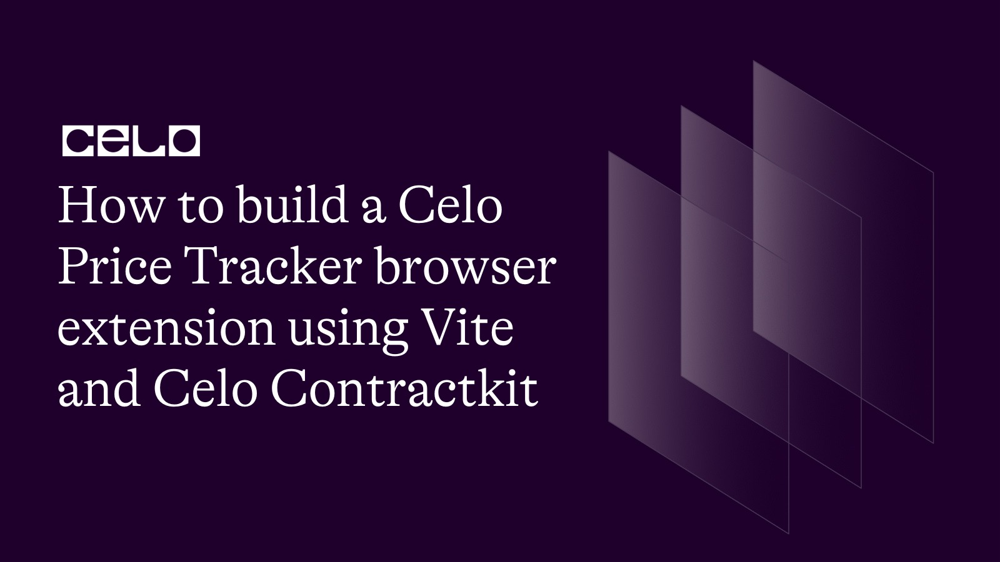
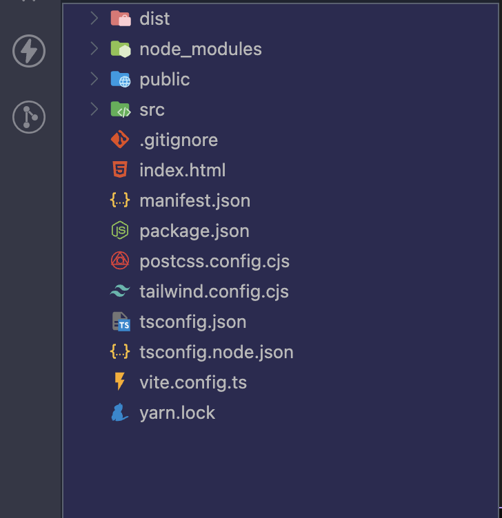
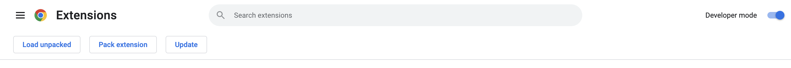
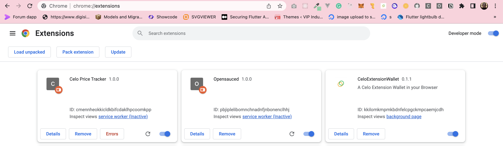
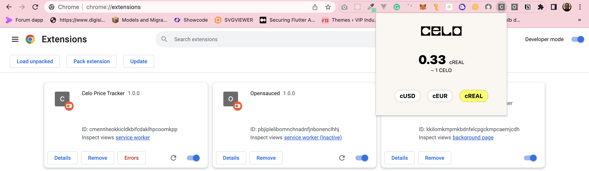

## Introduction

In this article, I will show developers how to create a Celo Price Tracker browser extension that works with any browser, such as Brave, Chrome, and Firefox, by using Vite (a React template), Crxjs Vite Plugin, and the Celo Contractkit package.

## Prerequisites

Basic knowledge of javascript and ReactJs


## Getting Started

To bootstrap our React DAPP, we will be using Vite & crxJs.

### Create a vite project

Use your favorite package manager to scaffold a new project and follow the prompts to create a vanilla JS project.

```bash
yarn create vite my-vue-app --template react-ts
```

### Install CRXJS Vite plugin

Now install the CRXJS Vite plugin using your favorite package manager.

```bash
yarn install -D @crxjs/vite-plugin@latest
```

### Create a manifest file

Create a file named manifest.json next to vite.config.js

```javascript
{
    "manifest_version": 3,
    "name": "Celo Price Tracker",
    "version": "1.0.0",
    "action": {
        "default_popup": "index.html"
    }
}
```

### Update your vite config

```javascript
import { defineConfig } from "vite";
import react from "@vitejs/plugin-react";
import { crx } from "@crxjs/vite-plugin";
import manifest from "./manifest.json";

// https://vitejs.dev/config/
export default defineConfig({
  plugins: [react(), crx({ manifest })],
});
```

### Run your project

```bash
yarn run dev
```

That's it! Your project directory should look like this:



### Load the extension in the broswer

When the build completes, open Chrome or Edge and navigate to **_chrome://extensions_**. Make sure to turn on the developer mode switch.



Drag your **_dist_** folder into the Extensions Dashboard to install it. Your extension icon will be in the top bar. The icon will be the first letter of the extension's name.

Once you've found the extension icon, right-click it and choose "Inspect popup window". This will open the popup and the popup dev tools window. We need to inspect the popup to keep it open while making changes.



### Implement the UI

Now, we need to install some npm dependencies in order to continue our implementation.

**Dev-Dependencies**

```bash
yarn install -D autoprefixer tailwindcss postcss
```

**Dependencies**

```bash
yarn install ethers bignumber.js wagmi @mento-protocol/mento-sdk @ethersproject/units @ethersproject/bignumber @ethersproject/address @tanstack/react-query
```

### Utils Implementation

Create a folder inside src folder in the root of your project named utils.
addresses.ts: create a file named addresses.ts and paste the below code, basically what we need from this file is to compare two addresses or check if address is a valid address

```javascript
import { getAddress, isAddress } from "@ethersproject/address";
export type { getAddress };

export function validateAddress(address: string, context: string) {
  if (!address || !isAddress(address)) {
    const errorMsg = `Invalid addresses for ${context}: ${address}`;
    //logger.error(errorMsg);
    throw new Error(errorMsg);
  }
}

export function areAddressesEqual(a1: string, a2: string) {
  validateAddress(a1, "compare");
  validateAddress(a2, "compare");
  return getAddress(a1) === getAddress(a2);
}
```

amount.ts: here is where we convert a from wei to number or rounded figure

```javascript
import { formatUnits, parseUnits } from "@ethersproject/units";
import BigNumber from "bignumber.js";
import { DISPLAY_DECIMALS, MIN_ROUNDED_VALUE } from "./consts";
// import { logger } from 'src/utils/logger'

export type NumberT = BigNumber.Value;

export function fromWei(value: NumberT | null | undefined): number {
  if (!value) return 0;
  const valueString = value.toString().trim();
  const flooredValue = new BigNumber(valueString).toFixed(
    0,
    BigNumber.ROUND_FLOOR
  );
  return parseFloat(formatUnits(flooredValue));
}

// Similar to fromWei above but rounds to set number of decimals
// with a minimum floor, configured per token
export function fromWeiRounded(
  value: NumberT | null | undefined,
  roundDownIfSmall = false
): string {
  if (!value) return "0";
  const flooredValue = new BigNumber(value).toFixed(0, BigNumber.ROUND_FLOOR);
  const amount = new BigNumber(formatUnits(flooredValue));
  if (amount.isZero()) return "0";

  // If amount is less than min value
  if (amount.lt(MIN_ROUNDED_VALUE)) {
    if (roundDownIfSmall) return "0";
    else return MIN_ROUNDED_VALUE.toString();
  }

  return amount.toFixed(DISPLAY_DECIMALS).toString();
}
```

chains.ts: contain list of network chain in celo ecosystem

```javascript
export enum ChainId {
  Alfajores = 44787,
  Baklava = 62320,
  Celo = 42220,
}

export interface ChainMetadata {
  chainId: ChainId;
  name: string;
  rpcUrl: string;
  explorerUrl: string;
  explorerApiUrl: string;
}

export const Alfajores: ChainMetadata = {
  chainId: ChainId.Alfajores,
  name: "Alfajores",
  rpcUrl: "https://alfajores-forno.celo-testnet.org",
  explorerUrl: "https://alfajores.celoscan.io",
  explorerApiUrl: "https://api-alfajores.celoscan.io/api",
};

export const Baklava: ChainMetadata = {
  chainId: ChainId.Baklava,
  name: "Baklava",
  rpcUrl: "https://baklava-forno.celo-testnet.org",
  explorerUrl: "https://explorer.celo.org/baklava",
  explorerApiUrl: "https://explorer.celo.org/baklava/api",
};

export const Celo: ChainMetadata = {
  chainId: ChainId.Celo,
  name: "Mainnet",
  rpcUrl: "https://forno.celo.org",
  explorerUrl: "https://celoscan.io",
  explorerApiUrl: "https://api.celoscan.io/api",
};

export const chainIdToChain: Record<number, ChainMetadata> = {
  [ChainId.Alfajores]: Alfajores,
  [ChainId.Baklava]: Baklava,
  [ChainId.Celo]: Celo,
};

export const allChains = [Alfajores, Baklava, Celo];
```

consts.ts : List of constant values

```javascript
export const SWAP_QUOTE_REFETCH_INTERVAL = 5000; // 5 seconds

export const MAX_EXCHANGE_TOKEN_SIZE = "100000000000000000000000"; // 100,000 Tokens

export const MIN_ROUNDED_VALUE = 0.001;
export const DISPLAY_DECIMALS = 3;
```

debounce.ts

```javascript
import { useEffect, useState } from "react";

// Based on https://usehooks.com/useDebounce
export function useDebounce<T>(value: T, delayMs = 500): T {
  const [debouncedValue, setDebouncedValue] = useState < T > value;

  useEffect(() => {
    const handler = setTimeout(() => {
      setDebouncedValue(value);
    }, delayMs);

    return () => {
      clearTimeout(handler);
    };
  }, [value, delayMs]);

  return debouncedValue;
}
```

exchange.ts: List of brokers address and exchange addresses on both CELO mainnet and testnet

```javascript
import { Exchange } from "@mento-protocol/mento-sdk";

import { ChainId } from "./chains";

export const BrokerAddresses: Record<ChainId, string> = {
  [ChainId.Alfajores]: "0xD3Dff18E465bCa6241A244144765b4421Ac14D09",
  [ChainId.Baklava]: "0x6723749339e320E1EFcd9f1B0D997ecb45587208",
  [ChainId.Celo]: "",
};

export const AlfajoresExchanges: Exchange[] = [
  {
    providerAddr: "0x9B64E8EaBD1a035b148cE970d3319c5C3Ad53EC3",
    id: "0x3135b662c38265d0655177091f1b647b4fef511103d06c016efdf18b46930d2c",
    assets: [
      "0x874069Fa1Eb16D44d622F2e0Ca25eeA172369bC1",
      "0xF194afDf50B03e69Bd7D057c1Aa9e10c9954E4C9",
    ],
  },
  {
    providerAddr: "0x9B64E8EaBD1a035b148cE970d3319c5C3Ad53EC3",
    id: "0xb73ffc6b5123de3c8e460490543ab93a3be7d70824f1666343df49e219199b8c",
    assets: [
      "0x10c892A6EC43a53E45D0B916B4b7D383B1b78C0F",
      "0xF194afDf50B03e69Bd7D057c1Aa9e10c9954E4C9",
    ],
  },
  {
    providerAddr: "0x9B64E8EaBD1a035b148cE970d3319c5C3Ad53EC3",
    id: "0xed0528e42b9ecae538aab34b93813e08de03f8ac4a894b277ef193e67275bbae",
    assets: [
      "0xE4D517785D091D3c54818832dB6094bcc2744545",
      "0xF194afDf50B03e69Bd7D057c1Aa9e10c9954E4C9",
    ],
  },
  {
    providerAddr: "0x9B64E8EaBD1a035b148cE970d3319c5C3Ad53EC3",
    id: "0xf77561650ba043a244ae9c58f778c141532c4afdb7cae5e6fd623b565c5584a0",
    assets: [
      "0x874069Fa1Eb16D44d622F2e0Ca25eeA172369bC1",
      "0x2C4B568DfbA1fBDBB4E7DAD3F4186B68BCE40Db3",
    ],
  },
];

export const BaklavaExchanges: Exchange[] = [
  {
    providerAddr: "0xFF9a3da00F42839CD6D33AD7adf50bCc97B41411",
    id: "0x3135b662c38265d0655177091f1b647b4fef511103d06c016efdf18b46930d2c",
    assets: [
      "0x62492A644A588FD904270BeD06ad52B9abfEA1aE",
      "0xdDc9bE57f553fe75752D61606B94CBD7e0264eF8",
    ],
  },
  {
    providerAddr: "0xFF9a3da00F42839CD6D33AD7adf50bCc97B41411",
    id: "0xb73ffc6b5123de3c8e460490543ab93a3be7d70824f1666343df49e219199b8c",
    assets: [
      "0xf9ecE301247aD2CE21894941830A2470f4E774ca",
      "0xdDc9bE57f553fe75752D61606B94CBD7e0264eF8",
    ],
  },
  {
    providerAddr: "0xFF9a3da00F42839CD6D33AD7adf50bCc97B41411",
    id: "0xed0528e42b9ecae538aab34b93813e08de03f8ac4a894b277ef193e67275bbae",
    assets: [
      "0x6a0EEf2bed4C30Dc2CB42fe6c5f01F80f7EF16d1",
      "0xdDc9bE57f553fe75752D61606B94CBD7e0264eF8",
    ],
  },
  {
    providerAddr: "0xFF9a3da00F42839CD6D33AD7adf50bCc97B41411",
    id: "0xf77561650ba043a244ae9c58f778c141532c4afdb7cae5e6fd623b565c5584a0",
    assets: [
      "0x62492A644A588FD904270BeD06ad52B9abfEA1aE",
      "0x4c6B046750F9aBF6F0f3B511217438451bc6Aa02",
    ],
  },
];

export const MentoExchanges: Record<ChainId, Array<Exchange> | undefined> = {
  [ChainId.Alfajores]: AlfajoresExchanges,
  [ChainId.Baklava]: BaklavaExchanges,
  [ChainId.Celo]: undefined,
};
```

Note some of this value were extract from mento-web repository on github.

mento.ts: create a mento sdk instance by passing the JSON RPC Provider correspond to the network (testnet or mainnet) based on chainId

```javascript
import { Mento } from "@mento-protocol/mento-sdk";
import { ChainId } from "./chains";
import { BrokerAddresses, MentoExchanges } from "./exchanges";
import { getProvider } from "./provider";

const cache: Record<number, Mento> = {};

export async function getMentoSdk(chainId: ChainId): Promise<Mento> {
  if (cache[chainId]) return cache[chainId];

  const provider = getProvider(chainId);
  const brokerAddr = BrokerAddresses[chainId];
  const exchanges = MentoExchanges[chainId];
  let mento: Mento;
  if (brokerAddr) {
    mento = Mento.createWithParams(provider, brokerAddr, exchanges);
  } else {
    mento = await Mento.create(provider);
  }
  cache[chainId] = mento;
  return mento;
}
```

provider.ts: Create JSON RPC Provider using ethers

```javascript
import { providers } from "ethers";
import { ChainId, chainIdToChain } from "./chains";

const cache: Record<number, providers.JsonRpcProvider> = {};

export function getProvider(chainId: ChainId): providers.JsonRpcProvider {
  if (cache[chainId]) return cache[chainId];
  const chain = chainIdToChain[chainId];
  const provider = new providers.JsonRpcProvider(chain.rpcUrl, chainId);
  cache[chainId] = provider;
  return provider;
}
```

Note: you might not be able to import providers from ethers package if you are using latest version of this package. This project use version 5.7.2

tokens.ts: List of all token on CELO both mainnet and testnet e.g CELO Native, cUSD, cEUR etc and their corresponding information like address.

```javascript
import { areAddressesEqual } from "./addresses";

import { ChainId } from "./chains";

export interface Token {
  id: string;
  symbol: string; // The same as id for now
  name: string;

  decimals: number;
}

export enum TokenId {
  CELO = "CELO",
  cUSD = "cUSD",
  cEUR = "cEUR",
  cREAL = "cREAL",
}

export const StableTokenIds = [TokenId.cUSD, TokenId.cEUR, TokenId.cREAL];

export const CELO: Token = {
  id: TokenId.CELO,
  symbol: TokenId.CELO,
  name: "Celo Native",

  decimals: 18,
};
export const cUSD: Token = {
  id: TokenId.cUSD,
  symbol: TokenId.cUSD,
  name: "Celo Dollar",

  decimals: 18,
};
export const cEUR: Token = {
  id: TokenId.cEUR,
  symbol: TokenId.cEUR,
  name: "Celo Euro",

  decimals: 18,
};
export const cREAL: Token = {
  id: TokenId.cREAL,
  symbol: TokenId.cREAL,
  name: "Celo Real",
  decimals: 18,
};

export const Tokens: Record<TokenId, Token> = {
  CELO,
  cUSD,
  cEUR,
  cREAL,
};

export const TokenAddresses: Record<ChainId, Record<TokenId, string>> = {
  [ChainId.Alfajores]: {
    [TokenId.CELO]: "0xF194afDf50B03e69Bd7D057c1Aa9e10c9954E4C9",
    [TokenId.cUSD]: "0x874069Fa1Eb16D44d622F2e0Ca25eeA172369bC1",
    [TokenId.cEUR]: "0x10c892A6EC43a53E45D0B916B4b7D383B1b78C0F",
    [TokenId.cREAL]: "0xE4D517785D091D3c54818832dB6094bcc2744545",
  },
  [ChainId.Baklava]: {
    [TokenId.CELO]: "0xdDc9bE57f553fe75752D61606B94CBD7e0264eF8",
    [TokenId.cUSD]: "0x62492A644A588FD904270BeD06ad52B9abfEA1aE",
    [TokenId.cEUR]: "0xf9ecE301247aD2CE21894941830A2470f4E774ca",
    [TokenId.cREAL]: "0x6a0EEf2bed4C30Dc2CB42fe6c5f01F80f7EF16d1",
  },
  [ChainId.Celo]: {
    [TokenId.CELO]: "0x471EcE3750Da237f93B8E339c536989b8978a438",
    [TokenId.cUSD]: "0x765DE816845861e75A25fCA122bb6898B8B1282a",
    [TokenId.cEUR]: "0xD8763CBa276a3738E6DE85b4b3bF5FDed6D6cA73",
    [TokenId.cREAL]: "0xe8537a3d056DA446677B9E9d6c5dB704EaAb4787",
  },
};

export function isNativeToken(tokenId: string) {
  return Object.keys(Tokens).includes(tokenId);
}

export function isStableToken(tokenId: string) {
  return StableTokenIds.includes(tokenId as TokenId);
}

export function getTokenById(id: string): Token | null {
  return Tokens[id as TokenId] || null;
}

export function getTokenAddress(id: TokenId, chainId: ChainId): string {
  const addr = TokenAddresses[chainId][id];
  if (!addr)
    throw new Error(`No address found for token ${id} on chain ${chainId}`);
  return addr;
}

export function getTokenByAddress(address: string): Token {
  const idAddressTuples = Object.values(TokenAddresses)
    .map((idToAddress) => Object.entries(idToAddress))
    .flat();
  // This assumes no clashes btwn different tokens on diff chains
  for (const [id, tokenAddr] of idAddressTuples) {
    if (areAddressesEqual(address, tokenAddr)) {
      return Tokens[id as TokenId];
    }
  }
  throw new Error(`No token found for address ${address}`);
}
```

### Hooks

useSwap Hook: This is the react hook that implement the mento sdk instance we created in src/utils/mento.ts and this is the hook we will be using in our frontend UI.

```javascript
import { useQuery } from "@tanstack/react-query";
import BigNumber from "bignumber.js";
import { BigNumber as EtherBigNumber } from "@ethersproject/bignumber";
import { useEffect } from "react";
import { SWAP_QUOTE_REFETCH_INTERVAL } from "../utils/consts";
import { TokenId, getTokenAddress } from "../utils/tokens";
import { NumberT, fromWeiRounded } from "../utils/amount";
import { useDebounce } from "../utils/debounce";

import { getMentoSdk } from "../utils/mento";
import { ChainId } from "../utils/chains";

export function useSwap(
  fromAmountWei: string,
  fromTokenId: TokenId,
  toTokenId: TokenId,
  chainId: ChainId
) {
  const debouncedFromAmountWei = useDebounce(fromAmountWei, 350);

  const { isLoading, isError, error, data } = useQuery(
    [debouncedFromAmountWei, fromTokenId, toTokenId],
    async () => {
      const fromAmountBN = EtherBigNumber.from(debouncedFromAmountWei);
      if (fromAmountBN.lte(0) || !fromTokenId || !toTokenId) return null;
      const mento = await getMentoSdk(chainId);
      const fromTokenAddr = getTokenAddress(fromTokenId, chainId);
      const toTokenAddr = getTokenAddress(toTokenId, chainId);
      const toAmountWei = (
        await mento.getAmountOut(
          fromTokenAddr,
          toTokenAddr,
          fromAmountBN.toNumber()
        )
      ).toString();
      return {
        toAmountWei: toAmountWei,
        toAmount: fromWeiRounded(toAmountWei),
        rate: calcExchangeRate(debouncedFromAmountWei, toAmountWei),
      };
    },
    {
      staleTime: SWAP_QUOTE_REFETCH_INTERVAL,
      refetchInterval: SWAP_QUOTE_REFETCH_INTERVAL,
    }
  );

  useEffect(() => {
    if (error) {
      console.log(error);
    }
  }, [error]);

  return {
    isLoading,
    isError,
    toAmountWei: data?.toAmountWei || "0",
    toAmount: data?.toAmount || "0",
    rate: data?.rate,
  };
}

function calcExchangeRate(fromAmount: NumberT, toAmount: NumberT) {
  try {
    return new BigNumber(fromAmount)
      .dividedBy(toAmount)
      .toFixed(2, BigNumber.ROUND_DOWN);
  } catch (error) {
    //logger.warn("Error computing exchange values", error);
    return "0";
  }
}
```

### Frontend UI

Clean up the UI by delete some files like App.css, logo.svg etc

Init tailwindcss by run the following commands

```bash
npx tailwindcss init -p
```

Configure the template path by remove everything inside tailwind.config.cjs file and replace it with code below

```javascript
/** @type {import('tailwindcss').Config} */
module.exports = {
  content: ["./index.html", "./src/**/*.{js,ts,jsx,tsx}"],
  theme: {
    extend: {
      colors: {
        primary: "#FCFF51",
        bg: "#fbf6f1",
      },
    },
  },
  plugins: [],
};
```

Update your index.css file

```css
@tailwind base;
@tailwind components;
@tailwind utilities;

.btn {
  @apply bg-white hover:bg-primary px-3 py-1 border border-black border-opacity-20 rounded-3xl inline-flex items-center text-sm font-bold cursor-pointer disabled:cursor-not-allowed;
}

.active {
  @apply bg-primary;
}
```

Inside assets folder, create celo.svg file for celo logo and paste the below code

```javascript
<svg
  width="114"
  height="26"
  viewBox="0 0 114 26"
  fill="none"
  xmlns="http://www.w3.org/2000/svg"
>
  <path
    fill-rule="evenodd"
    clip-rule="evenodd"
    d="M25.9538 0H0.435547V25.682H25.9533V16.7172H21.7184C20.2586 19.9876 16.9728 22.2654 13.2125 22.2654C8.02853 22.2654 3.83037 18.0039 3.83037 12.823C3.83037 7.64221 8.02853 3.41712 13.2125 3.41712C17.0457 3.41712 20.3315 5.76873 21.7919 9.11197H25.9538V0ZM50.6663 16.7167C49.1698 19.987 45.9205 22.2647 42.1242 22.2649C37.086 22.2649 32.9608 18.2234 32.7783 13.1898H54.9012V0H29.3829V25.6814H54.9012V16.7167H50.6663ZM50.9934 10.0303H33.1782H33.1777C34.3093 5.80518 38.0696 3.41716 42.122 3.41716C46.1743 3.41716 49.6793 5.65795 50.9934 10.0303ZM110.005 12.8225C110.005 18.0398 105.843 22.2649 100.659 22.2649C95.5115 22.2649 91.3133 18.0033 91.3133 12.8225C91.3133 7.64169 95.4753 3.4166 100.659 3.4166C105.843 3.4166 110.005 7.60527 110.005 12.8225ZM113.436 0H87.918V25.682H113.436V0ZM80.4927 16.7167H84.7276V25.6814H58.2969V0H62.6046V12.8225C62.6046 18.5543 66.8395 22.2284 71.8772 22.2284C75.7833 22.2284 79.2148 20.0974 80.4927 16.7172V16.7167Z"
    fill="black"
  />
</svg>
```

Clean up the App.tsx file and replace it with the code below

```javascript
import BigNumber from "bignumber.js";
import { useEffect, useState } from "react";
import celoLogo from "./assets/celo.svg";
import { useSwap } from "./hooks/useSwap";
import { Alfajores, Celo } from "./utils/chains";
import { TokenId } from "./utils/tokens";

function App() {
  const [toToken, setToToken] = useState < TokenId > TokenId.cUSD;

  const { isLoading, toAmount, rate } = useSwap(
    BigNumber(1).toString(),
    TokenId.CELO,
    toToken,
    Alfajores.chainId
  );

  console.log(rate);

  useEffect(() => {});

  return (
    <div className="min-w-[320px] min-h-[250px] m-0 flex bg-bg p-0">
      <div className="h-2/3 w-full my-auto flex flex-col">
        <div className="w-full flex items-center justify-center">
          
        </div>
        <div className="flex flex-col items-center justify-center my-10">
          <h1 className="text-3xl font-extrabold">
            {rate ?? 1}
            <span className="ml-2 text-xs font-normal">
              {toToken.toString()}
            </span>
          </h1>
          <p className=" text-black text-xs">~ 1 CELO</p>
        </div>
        <div className="flex items-center justify-center space-x-4">
          <button
            className={`btn ${toToken == TokenId.cUSD ? "!bg-primary" : ""}`}
            type="button"
            onClick={() => setToToken(TokenId.cUSD)}
          >
            cUSD
          </button>
          <button
            className={`btn ${toToken == TokenId.cEUR ? "!bg-primary" : ""}`}
            type="button"
            onClick={() => setToToken(TokenId.cEUR)}
          >
            cEUR
          </button>
          <button
            className={`btn ${toToken == TokenId.cREAL ? "!bg-primary" : ""}`}
            type="button"
            onClick={() => setToToken(TokenId.cREAL)}
          >
            cREAL
          </button>
        </div>
      </div>
    </div>
  );
}

export default App;
```

### Final build

Boom!!!



## Conclusion

Congratulations, you have now learned how to build a browser extension base using vite and crxjs.

## About the Author

I am a Software Engineer, Tech Evangelist (Preaching the gospel of flutter & blockchain) also and Ex-GDSC Leads.

## References

- [Github Repo](https://github.com/Mujhtech/celo-vite-extension)
- [CRXJS](https://crxjs.dev/vite-plugin/getting-started/react/dev-basics)
- [Vite Js](https://vitejs.dev/guide/)
- [Celo Docs](https://docs.celo.org)
