## Introduction

An English auction is ideal for selling NFTs because it gives all potential buyers a fair chance at placing bids until only one bidder with the highest bid is left. This guide will teach you how to create a smart contract that implements an English Auction system in Solidity. It will also ensure that all transactions for the auction are safe and recorded on the blockchain to prevent alteration or deletion. You will also learn how to write secure code and prevent hackers from exploiting your contract. Finally, we will cover a demonstration of how the contract works.

## Prerequisites

For a proper understanding of this guide, it is necessary to:

1. Understand how to build a smart contract and have experience building one.
2. Have a basic knowledge of NFTs and can mint them.
3. Know and understand what [ERC721](https://www.geeksforgeeks.org/what-is-erc721-token/) is about and can implement it at a basic level.

## Build an English Auction Contract with Solidity

You should use the [Remix IDE](https://remix.ethereum.org/) or any other IDE you choose for this guide. Once you have comfortably set up your IDE, follow these steps to create your auction contract:

**Step 1:** Create a file to contain your Solidity code and name it Auction.sol.

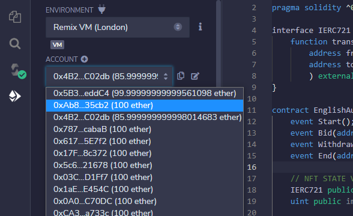

**Step 2:** Open your file and include the IERC721 interface. This will ensure that NFTs are transferred easily between contracts and wallets that implement the same interface. You can read about IERC721 [here](https://www.geeksforgeeks.org/what-is-erc721-token/).

```solidity
// SPDX-License-Identifier: MIT

pragma solidity ^0.8.17;

interface IERC721 {

    function safeTransferFrom(

        address from,

        address to, uint nftId

        ) external;

}
```

**Step 3:** Create your contract and create the necessary state variables.

```solidity

// SPDX-License-Identifier: MIT

pragma solidity ^0.8.17;

interface IERC721 {

    function safeTransferFrom(

        address from,

        address to, uint nftId

        ) external;

}

contract EnglishAuction{

    // NFT STATE VARIABLES

    IERC721 public immutable nft;

    uint public immutable nftId;

    // STATE VARIABLES FOR AUCTION INFORMATION

    address payable public immutable seller;

    uint32 public endAuction;

    bool public hasStarted;

    bool public hasEnded;

    // STATE VARIABLES RELEVANT TO BIDDERS

    address public highestBidder;

    uint public highestBid;

    mapping(address => uint) public totalBids;

}

```

The above code defines three categories of state variables.

The first category contains the following:

1. nft: This is used to store the NFT that is up for auction.
2. nftId: This is used to store the ID of the NFT up for auction.

Both variables are immutable because there is no intention of changing the NFT or its ID during the auction.

The second category contains the following variables:

1. Seller: As the name implies, it will store the value of whoever is selling the NFT. Naturally, this should be the owner of the NFT. Also, the variable is immutable because there is no plan to change the seller during the auction. Finally, the variable is payable to allow the seller to withdraw the ETH after the auction.
2. endAuction: This variable will be used to store the timestamp when the auction ends.
3. hasStarted: This Boolean variable will be used to check if the auction has started.
4. hasEnded: This Boolean variable will be used to check whether the auction has ended.

The final category defines variables relevant to the bidders in the auction:

1. highestBidder: This variable will hold the address of the highest bidder in the auction.
2. highestBid: This variable will hold the highest bid value in the auction.
3. totalBids: This is a mapping from address to uint. It will contain all the bids of each bidder that are not the highest bid. In order words, if a bid is not the highest bid, it will be stored here for each user. This will make it possible for bidders to withdraw their bids if they are not the highest bidder.

**Step 4:** Create a constructor for the contract.

```solidity

constructor(address _nft, uint _nftId, uint _startingPrice){

        nft = IERC721(_nft);

        nftId = _nftId;

        seller = payable(msg.sender);

        highestBid = _startingPrice;

    }
```

In our constructor, We have declared three parameters. They are \_nft, \_nftId , and \_startungPrice. Inside the constructor:

1. We have assigned the values of nft and nftId appropriately.
2. We have also assigned the seller to the owner of the contract, i.e., msg.sender.
3. Lastly, We have assigned the value of the highestBid to be the \_startPrice. So whatever value the seller inputs when deploying the contract will be the highest bid until someone else makes a higher bid.

**Step 5:** Create a function to start the auction.

```solidity

function startAuction() external{

        require(msg.sender == seller, "You are unauthorized to start this auction.");

        require(!hasStarted, "The auction has started");

        hasStarted = true;

        endAuction = uint32(block.timestamp + 7 days);

        nft.transferFrom(seller, address(this), nftId);

        emit Start();

    }

```

In the above function:

1. We have passed a condition to allow only the seller to start the auction. This will ensure that people with malicious intent cannot start the auction.

```solidity
require(msg.sender == seller, "You are unauthorized to start this auction.");
```

1. We have passed a condition to prevent the auction from starting twice simultaneously by ensuring it can only start if it isn't currently in progress.

```solidity
require(!hasStarted, "The auction has started");
```

2. After passing the conditions, We set hasStarted to true to signify that the auction has started.
3. We also set the value of endAuction to be 14 days from the start time. This value was cast to uint32 because endAuction was declared with uint32. Naturally, block.timestamp has a value of uint256 which is overkill for this use case.

```solidity
endAuction = uint32(block.timestamp + 14 days);
```

4. We transferred the ownership of the NFT from the seller to the contract so that the contract would own the NFT.

```solidity
nft.transferFrom(seller, address(this), nftId);
```

5. We emitted the contract by typing:

```solidity
emit Start();
```

Because We have done this, We have to modify the code at the top by adding the Start() event like this:

```solidity
event Start();
```

6. Create a function for bidding. Once the auction has started, potential bidders should be allowed to bid on the NFT.

```solidity
function bidPrice() external payable{

        require(hasStarted, "English auction has not started");

        require(block.timestamp < endAuction, "English auction has ended");

        require(msg.value>highestBid, "You cannot bid a lower amount. This is an English auction");

        if (highestBidder != address(0)){

            totalBids[highestBidder] += highestBid;

        }

        highestBid = msg.value;

        highestBidder = msg.sender;

        emit Bid(msg.sender, msg.value);

    }
```

The above function uses the external and payable keywords so bidders can interact with it and send ETH.

Inside the function, We have done the following:

1. We have set three conditions a bidder must meet before he can bid:

- The auction must have started before a bidder can bid.
- The bidder cannot bid after the auction ends.
- The bidder can only bid prices higher than the current highest bid.

```solidity
require(hasStarted, "English auction has not started");

require(block.timestamp < endAuction, "English auction has ended");

require(msg.value>highestBid, "You cannot bid a lower amount. This is an English auction");
```

2. We also wrote a condition that stores the total bids that are not the highest but have been bid already. For this to happen, the current highest bidder must not be at address(0).

```solidity
if (highestBidder != address(0)){

            totalBids[highestBidder] += highestBid;

        }
```

3. If the bidder calling the function places an amount greater than the current highest bid, then the value of the highest bidder and the highest bid will be changed.

```solidity
highestBid = msg.value;

highestBidder = msg.sender;
```

4. After this, We emitted the Bid() event.

```solidity
// emit bid event

emit Bid(msg.sender, msg.value);
```

Declare the Bid() event at the top of your contract by typing the following code:

event Bid(address indexed sender, uint amount)

7. Create a withdraw function. This function will allow bidders who aren't the highest bidders to withdraw their ETH after the auction.

```solidity
function withdrawBids() external{

        uint balances = totalBids[msg.sender];

        totalBids[msg.sender] = 0;

        payable(msg.sender).transfer(balances);

        emit Withdraw(msg.sender, balances);

    }
```

In the withdrawBids() function:

1. We have created a variable called balances. The value of balances is the total amount of bids by a sender which are not the highest bids, i.e., totalBids[msg.sender]
2. We reset totalBids[msg.sender] to zero. This is a precaution against a reentrancy attack in Solidity. Always make sure you reset the balances before making a transfer to keep your code protected.

```solidity
totalBids[msg.sender] = 0;
```

3. Next, We made a transfer of ETH to the rightful owner.

```solidity
payable(msg.sender).transfer(balances);
```

4. After this, We emitted the Withdraw() event.

```solidity
emit Withdraw(msg.sender, balances);
```

Declare the Withdraw() event at the top of your contract by typing the following code:

```solidity
event Withdraw(address indexed bidder, uint amount);
```

8. Create a function to end the auction. Allow anyone to call this function. If the seller does not end the auction after the end time has elapsed, the highest bidder will have their ETH stuck in the contract, and the NFT will still belong to the contract. To prevent this, use the external keyword when defining the function.

```solidity

function end() external{

        require(hasStarted, "The auction has not started yet");

        require(!hasEnded, "The auction is still in progress");

        require(block.timestamp>=endAuction);

        hasEnded = true;

        nft.transferFrom(address(this), highestBidder, nftId);

        seller.transfer(highestBid);

    }
```

In the above function:

1. The first three lines are rules to prevent the auction from being stopped wrongly.

- The first rule requires that the auction must have started before anyone can choose to end it.
- The second rule requires that the auction cannot be ended if it is still in progress.
- The third rule requires that the time at which the end()function is called must not be lower than the time stipulated for the auction to last. In our contract, We stipulated 14 days for this.

2. We set hasEnded to true. This will ensure that the function can only be called once.
3. We then transferred the NFT from the contract to the highest bidder.
4. Finally, We transferred all the ETH from the highest bid to the seller.

Although the function works as expected, it has a little problem. If the NFT does not get any bidder by the end of the auction, it will be transferred to address(0). This is not ideal because the NFT is supposed to go back to the seller in such a case. Remember that We had previously transferred ownership of the NFT to the contract.

To fix this problem, We will include a conditional statement to check who the highest bidder is. If it is not address(0), the seller and highest bidder will exchange NFT and ETH. If not, the ownership of the NFT will be transferred back to the seller. The modified function will look like this:

```solidity
function end() external{

        require(hasStarted, "The auction has not started yet");

        require(!hasEnded, "The auction is still in progress");

        require(block.timestamp>=endAuction);

        hasEnded = true;

        if(highestBidder != address(0)){

            nft.transferFrom(address(this), highestBidder, nftId);

            seller.transfer(highestBid);

        }else{

            nft.transferFrom(address(this), seller, nftId);

        }

        emit End(highestBidder, highestBid);

    }
```

I have emitted the End() event, so scroll up and add this code to your contract:

```solidity
event End(address highestBidder, uint amount);
```

This concludes the creation of an English auction contract in Solidity. If you have followed the steps above, the English auction contract you have should look like this:

```solidity

// SPDX-License-Identifier: MIT

pragma solidity ^0.8.17;

interface IERC721 {

    function transferFrom(

        address from,

        address to, uint nftId

        ) external;

}

contract EnglishAuction{

    event Start();

    event Bid(address indexed sender, uint amount);

    event Withdraw(address indexed bidder, uint amount);

    event End(address highestBidder, uint amount);

    // NFT STATE VARIABLES

    IERC721 public immutable nft;

    uint public immutable nftId;

    // STATE VARIABLES FOR AUCTION INFORMATION

    address payable public immutable seller;

    uint32 public endAuction;

    bool public hasStarted;

    bool public hasEnded;

    // STATE VARIABLES RELEVANT TO BIDDERS

    address public highestBidder;

    uint public highestBid;

    mapping(address => uint) public totalBids;

    constructor(address _nft, uint _nftId, uint _startingPrice){

        nft = IERC721(_nft);

        nftId = _nftId;

        seller = payable(msg.sender);

        highestBid = _startingPrice;

    }

    function startAuction() external{

        require(msg.sender == seller, "You are unauthorized to start this auction.");

        require(!hasStarted, "The auction has started");

        hasStarted = true;

        // SET AUCTION END SATE TO 7 DAYS

        endAuction = uint32(block.timestamp + 14 days);

        // TRANSFER OWNERSHIP OF NFT FROM SELLER TO CONTRACT

        nft.transferFrom(seller, address(this), nftId);

        emit Start();

    }

    function bidPrice() external payable{

        require(hasStarted, "English auction has not started");

        require(block.timestamp < endAuction, "English auction has ended");

        require(msg.value>highestBid, "You cannot bid a lower amount. This is an English auction");

        // KEEP RECORD OF TOTAL BIDS THAT ARE NOT THE HIGHEST BID

        if (highestBidder != address(0)){

            totalBids[highestBidder] += highestBid;

        }

        // ASSIGN HIGHEST BID

        highestBid = msg.value;

        // ASSIGN HIGHEST BIDDER

        highestBidder = msg.sender;

        emit Bid(msg.sender, msg.value);

    }

    function withdrawBids() external{

        uint balances = totalBids[msg.sender];

        // RESET THE AMOUNT TOTAL BIDS BEFORE TRANSFERRING TO PREVENT REENTRANCY

        totalBids[msg.sender] = 0;

        // TRANSFER BIDS

        payable(msg.sender).transfer(balances);

        emit Withdraw(msg.sender, balances);

    }

    function end() external{

        require(hasStarted, "The auction has not started yet");

        require(!hasEnded, "The auction is still in progress");

        require(block.timestamp>=endAuction);

        hasEnded = true;

        // CHECK IF SOMEONE BIDDED FOR THE NFT AND WHO THE HIGHEST BIDDER IS

        if(highestBidder != address(0)){

            nft.transferFrom(address(this), highestBidder, nftId);

            seller.transfer(highestBid);

        }else{

            nft.transferFrom(address(this), seller, nftId);

        }

        emit End(highestBidder, highestBid);

    }

}
```

## Demonstration Of How An English Auction Contract Works

Now that you have successfully built your English auction system with Solidity, you will see a demonstration of the contract in this section.

For a proper demonstration of the contract, you will need to mint an NFT. You can mint a demo NFT by deploying this code from [solidity-by-example.org](https://solidity-by-example.org/app/erc721/). Create a new file and paste the code into it.

For this demo, We have modified the auction to last for 180 seconds. You can do the same by modifying the endAuction variable as follows:

```solidity
endAuction = uint32(block.timestamp + 180);
```

After you have gone through the instructions above, follow the steps listed below:

**Step 1:** Deploy the MyNFT contract from the code you copied.

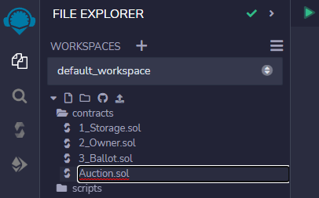

**Step 2:** Mint an NFT from the contract you just deployed. Call the mint() function to do this and pass in the necessary arguments.

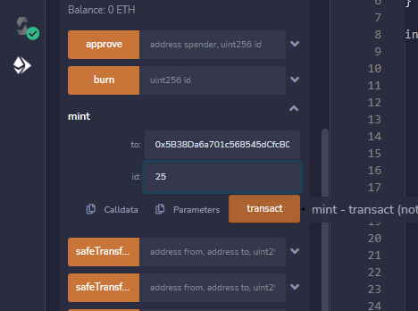

**Step 3:** Deploy your English auction contract. The contract takes three arguments at the point of deployment. These are:

1. The address of the NFT you want to sell. In this case, it will be the address of the NFT contract you deployed.
2. The id of the NFT you wish to sell. This id is the same value as the id of the NFT you minted. In our case, it is 25.
3. The starting bid for the auction. You can set this to your preferred price.

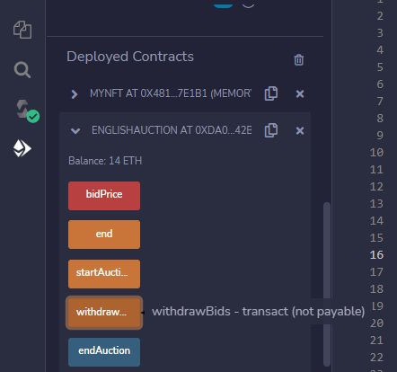

**Step 4:** Approve the English auction contract to transfer the ownership of the NFT from the seller to the contract. To do this, click on the deployed MyNFT contract and call the approve() function. Pass the address of the English auction contract and the id of the NFT you minted as arguments.

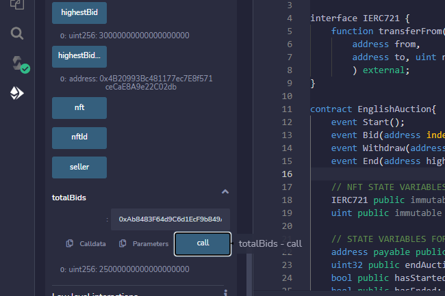

**Step 5:** Start the auction by calling the startAuction() function in the English auction contract. Once you do this, you will have 180 seconds to bid for the NFT.

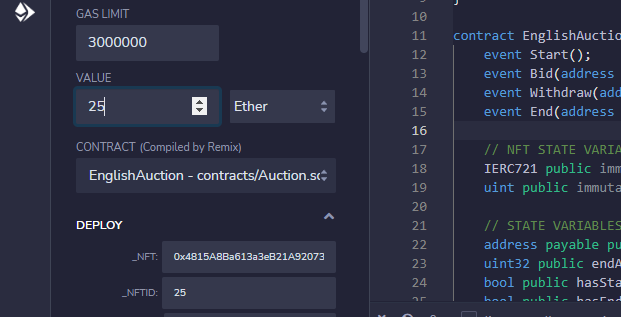

**Step 6:** After you start the auction, switch the account to a new one. This is a way to emulate a bidder. Let this bidder be Bidder1.

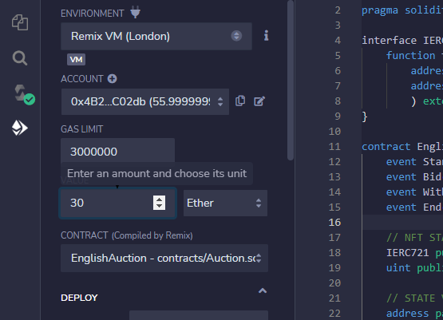

**Step 7:** Bid a price higher than the starting price with the account of Bidder1. We will bid 15 ETH, then click on the bidPrice() function.

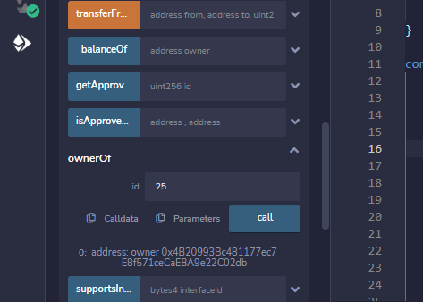


**Step 8:** Switch to a new account. Let this be Bidder2. With this account, bid a price higher than 15 ETH.

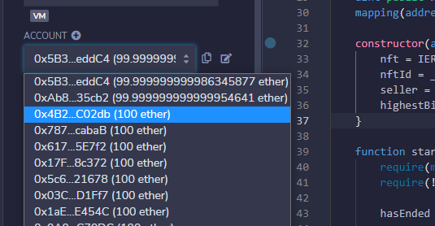

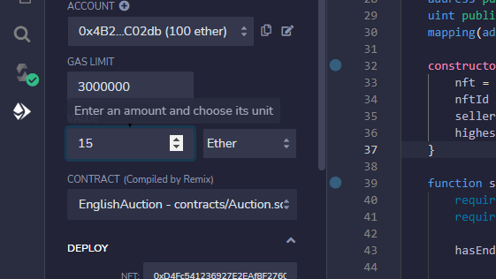

**Step 9:** Switch back to Bidder1 and bid a price higher than Bidder2's bid.

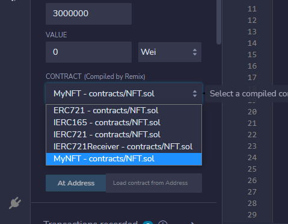

**Step 10:** You can decide to continue bidding if you want. But for this demonstration, We will wait for the auction to be over, i.e., 180 seconds. While waiting, you can check the value of some variables—for instance, the highest bid and highest bidder. Our highest bidder is Bidder1.

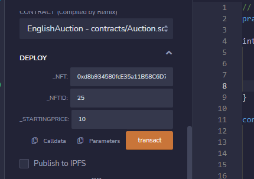

Since Bidder1 made two bids, he should be able to withdraw his first bid. This is because the first bid is not the highest. Bidder2 should also be able to withdraw his bid. You can check how much each bidder can withdraw by pasting their addresses in the totalBids() function. We will check for Bidder2.

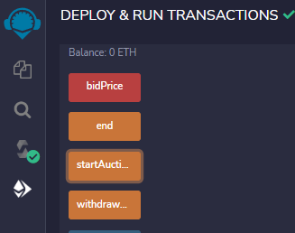

**Step 11:** End the auction after the time has elapsed. After this, check the owner of the NFT by calling the ownerOf() function in the MyNFT contract.

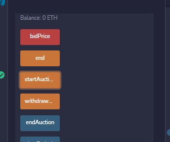

**Step 12:** Withdraw the ETH bid by Bidder2 and the ETH first bid by Bidder1. To do this, switch the accounts accordingly and call the withdrawBids() function.

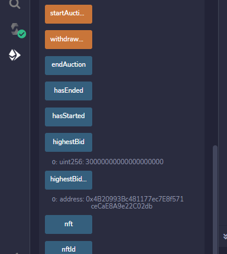

## Conclusion

This article covered a step-by-step process of building an English auction contract in Solidity. You also saw some best practices to prevent attackers from hijacking your contract. You should be able to build your auction contract and keep it secure.

## Next Steps

After learning about the English auction contract, you should implement it in your projects. You can also get your hands dirty by building a Dutch auction system yourself. This [article](https://www.investopedia.com/terms/d/dutchauction.asp) contains information about what a Dutch auction is.

In another article, We will walk you through how to build a Dutch auction system in Solidity. So you shouldn't worry much if you cannot build one yourself.

## References

The following sources served as inspirations and guides for writing this article:

1. [English Auction](https://youtu.be/ZeFjGJpzI7E)

2. [Solidity By Example](https://solidity-by-example.org/)

## Author

[Oyeniyi Abiola Peace](https://twitter.com/_iamoracle) is a seasoned software and blockchain developer. With a degree in Telecommunication Science from the University of Ilorin and over five years of experience in JavaScript, Python, PHP, and Solidity, he is no stranger to the tech industry. Peace currently works as the CTO at DFMLab and is a Community Moderator at Celo Blockchain. When he's not coding or teaching, he loves to read and spend time with family and friends.
