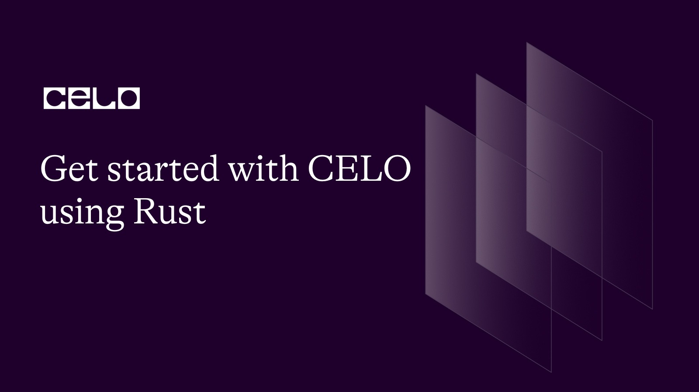
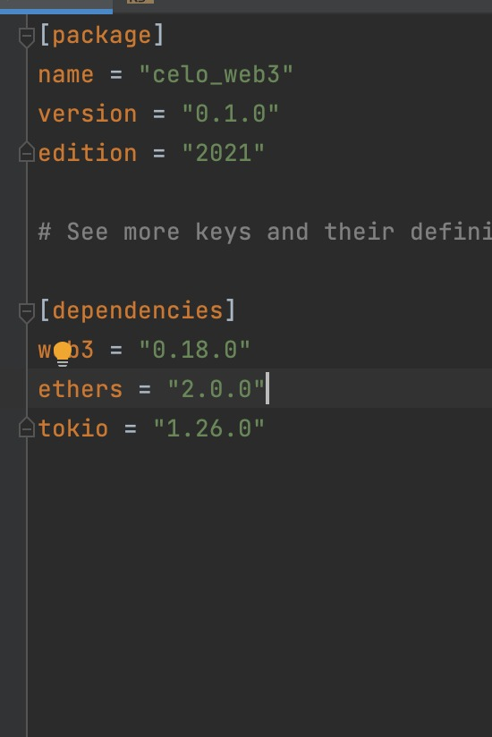
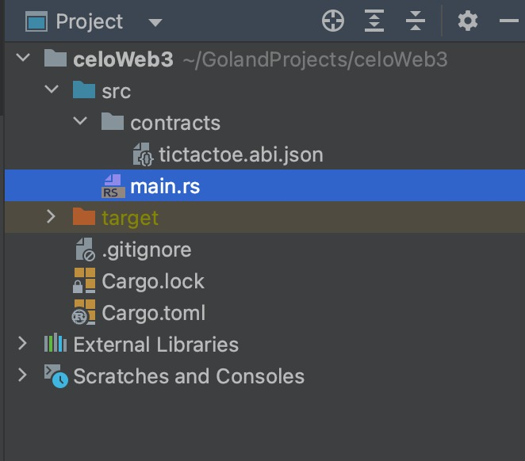
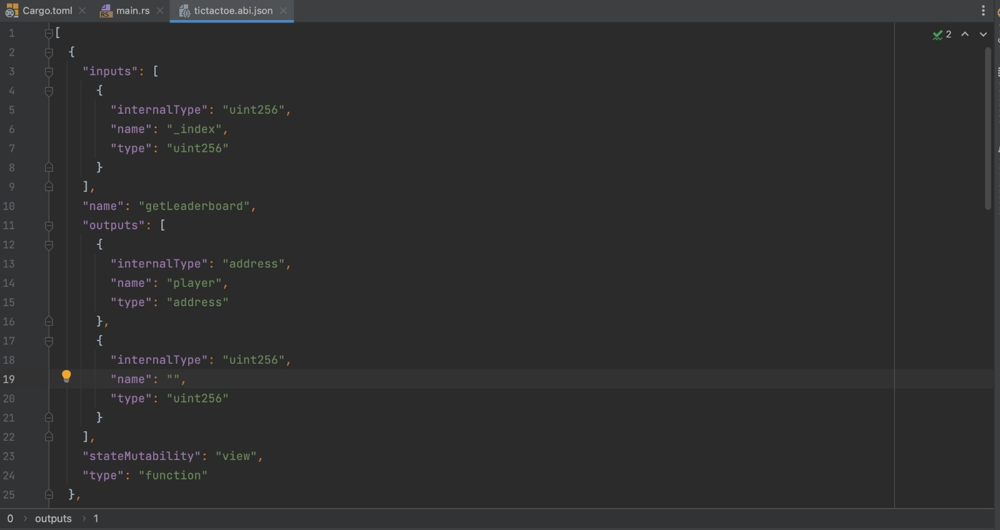
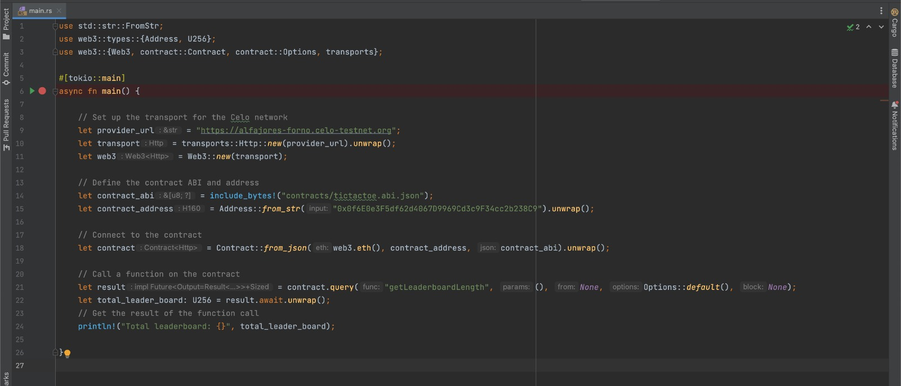
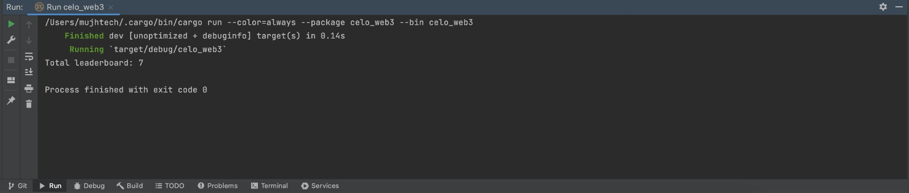

## Introduction

In this tutorial, we'll go over the fundamentals of interacting with Solidity smart contract programming language using web3. You will have a fundamental understanding of how to make a contract call in the rust programming language.

This tutorial will demonstrate how simple it is to interact with smart contracts, call functions, and listen to events in rust.

### How it works

Web3 Package is a pretty cool crate package that let you deploy, interact with any blockchain network.

## Prerequisites

First, This tutorial assumes that you are already familiar with solidity and understand how smart contracts work and also assumes that you already know the basics of using rust language.

For this project we'll be using a few interesting dependencies:

- [tokio](https://crates.io/crates/tokio)
- [web3](https://crates.io/crates/web3)
- [ethers](https://crates.io/crates/ethers)



## Getting Started

I assume anyone going through this tutorial already understands and uses Rust, so I will skip the setup involved in getting Rust to work on your development computer. That means I assume you already have VS Code/Intellij Idea/Eclipse/Atom and Rust setup on your PC.

If you are entirely new to Rust, here ( [https://www.rust-lang.org/learn/get-started](https://www.rust-lang.org/learn/get-started) ) is a good tutorial you can learn from or make use of online rust playground ( [https://play.rust-lang.org/](https://play.rust-lang.org/) ).

## Setup the Smart Contract

The next step is to compile our smart contract using the solidity compiler of your choice, such as hardhat, truffle, or any other solidity compiler.

```solidity
// SPDX-License-Identifier: MIT

// TicTacToeV1

pragma solidity ^0.8.4;

contract TicTacToeV1 {
    struct LeaderBoard {
        address player;
        uint256 win;
    }

    uint32 private idCounter;

    mapping(uint256 => LeaderBoard) internal leaderboards;

    function start(uint256 win) public {
        leaderboards[idCounter] = LeaderBoard(msg.sender, win);
        idCounter++;
    }

    function getLeaderboard(uint256 _index)
        public
        view
        returns (address player, uint256)
    {
        LeaderBoard storage leaderboard = leaderboards[_index];
        return (leaderboard.player, leaderboard.win);
    }

    function updateLeaderboard(uint256 index) public {
        leaderboards[index].win++;
    }

    function getLeaderboardLength() public view returns (uint256) {
        return (idCounter);
    }
}
```

### Deploy Smart contract (Remix)

Now that your contract is compiled, you can deploy your smart contract to the network. You can deploy to any Ethereum compatible network, and in this case we’ll be deploying the Celo testnet or mainnnet depending on your preference. If you’re brand new to this stick with testnet!

- Click the Deploy and Run Transactions Icon on the left side menu.
- Choose Injected Web3 as your environment.
- [Connect MetaMask to Celo](https://medium.com/@joenyzio/3-simple-steps-to-connect-your-metamask-wallet-to-celo-732d4a139587) testnet and verify the network.


## Dart Implementation

### Directory structure



Let’s copy our Contract ABIs into our project.

Then create a folder in the project folder directory lib and create a file named tictactoev1.abi.json.



```javascript
[
  {
    inputs: [
      {
        internalType: "uint256",
        name: "_index",
        type: "uint256",
      },
    ],
    name: "getLeaderboard",
    outputs: [
      {
        internalType: "address",
        name: "player",
        type: "address",
      },
      {
        internalType: "uint256",
        name: "",
        type: "uint256",
      },
    ],
    stateMutability: "view",
    type: "function",
  },
  {
    inputs: [],
    name: "getLeaderboardLength",
    outputs: [
      {
        internalType: "uint256",
        name: "",
        type: "uint256",
      },
    ],
    stateMutability: "view",
    type: "function",
  },
  {
    inputs: [
      {
        internalType: "uint256",
        name: "win",
        type: "uint256",
      },
    ],
    name: "start",
    outputs: [],
    stateMutability: "nonpayable",
    type: "function",
  },
  {
    inputs: [
      {
        internalType: "uint256",
        name: "index",
        type: "uint256",
      },
    ],
    name: "updateLeaderboard",
    outputs: [],
    stateMutability: "nonpayable",
    type: "function",
  },
];
```

### Rust Implementation



```js
use std::str::FromStr;
use web3::types::{Address, U256};
use web3::{Web3, contract::Contract, contract::Options, transports};

#[tokio::main]
async fn main() {

    // Set up the transport for the Celo network
    let provider_url = "https://alfajores-forno.celo-testnet.org";
    let transport = transports::Http::new(provider_url).unwrap();
    let web3 = Web3::new(transport);

    // Define the contract ABI and address
    let contract_abi = include_bytes!("contracts/tictactoe.abi.json");
    let contract_address = Address::from_str("0x0f6E0e3F5df62d4067D9969Cd3c9F34cc2b238C9").unwrap();

    // Connect to the contract
    let contract = Contract::from_json(web3.eth(), contract_address, contract_abi).unwrap();

    // Call a function on the contract
    let result = contract.query("getLeaderboardLength", (), None, Options::default(), None);
    let total_leader_board: U256 = result.await.unwrap();
    // Get the result of the function call
    println!("Total leaderboard: {}", total_leader_board);

}
```

In this example, we first set up a transport for the celo network using the transport Http struct method from web3. We then create a new web3 instance from the http transport we created. We then define the ABI and address of the smart contract we want to interact with. We use the Contract struct from web3 to connect to the contract, and then call a function on the contract using the query/call method. Finally, we get the result of the function call and print it out.

Note that you'll need to replace the **_contracts/tictactoe.abi.json_** and **_contract_address_** values with the actual ABI and address of the smart contract you want to interact with. You can generate the ABI using a tool like abigen or solc, and you can get the contract address from a blockchain explorer or by deploying the contract yourself.

The run your program, we can easily see that we have been able to interact seamlessly with our deployed smart contract.



## Conclusion

Congratulations, you have learned how to interact with the CELO blockchain using web3 in Rust programming.

## About the Author

I am a Software Engineer, Tech Evangelist (Preaching the gospel of flutter & blockchain) also and Ex-GDSC Leads.

## References

- [Github Repo](https://github.com/Mujhtech/rust_web3)
- [Tokio crate package](https://crates.io/crates/tokio)
- [web3 crate package/](https://crates.io/crates/web3)
- [Get started with rust](https://www.rust-lang.org/learn/get-started)
- [Learn solidity by example](https://solidity-by-example.org)
