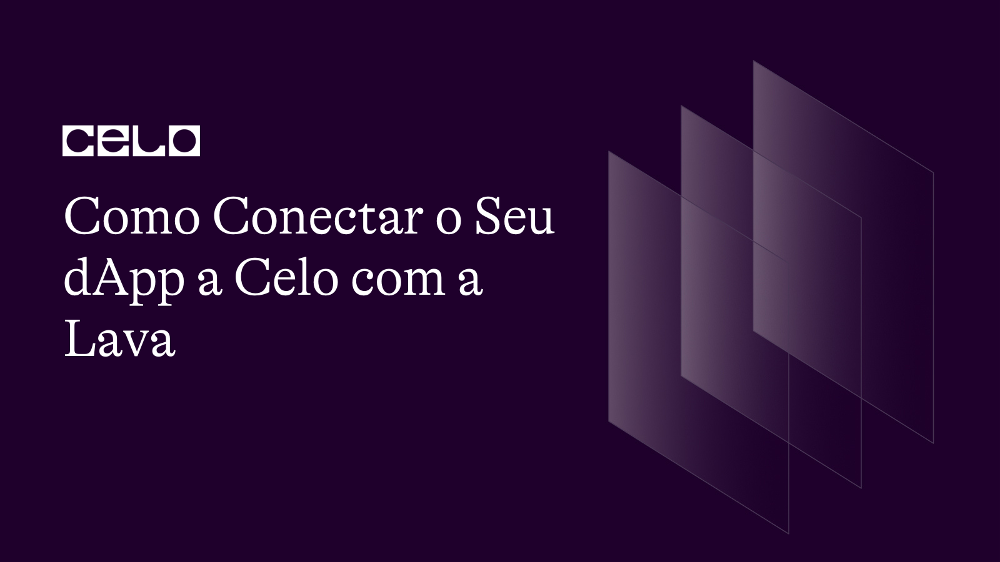

import YouTube from '@components/YouTube';

## Introdução

Nesse tutorial iremos aprender conectar seu dApp react a rede Lava para que possamos utilizar a blockchain Celo.

## Pré-requisitos

Para este tutorial você precisará dos seguintes programas instalados em sua máquina:

- Node.js
- Visual Studio Code

## Assista o vídeo

Confira no video como conectar seu dApp a rede de full nodes da Lava.

<YouTube videoId="c84zZp_UWWA"/>

:::info Descrição

[Código](https://github.com/itxtoledo/celo-sage-examples/tree/main/lavanet-dapp-integration)

:::

:::info Obtenha suporte

Entre no [Servidor Discord da Celo](https://chat.celo.org/) ou acesse diretamente o canal em português
[aqui](https://discord.com/channels/600834479145353243/956679819406491708).

:::

## Conclusão

Parabéns! Você concluiu o tutorial e aprendeu conectar seu dApp a rede de ful nodes descentralizados da Lava, e agora pode utilizar a blockchain Celo sem medo de ser bloqueado ou rastreado 🎉.

## Próximos passos

Como próximos passos sugiro a você utilizar a Lava em todos os seus dApps que ainda estão utilizando serviços centralizados de full nodes.

## Sobre o Autor

Sou um desenvolvedor com o objetivo de melhorar a vida das pessoas através do compartilhamento do meu conhecimento em programação, estou sempre disponível para ajudar a comunidade Celo.

[LinkedIn](https://www.linkedin.com/in/itxtoledo/)
