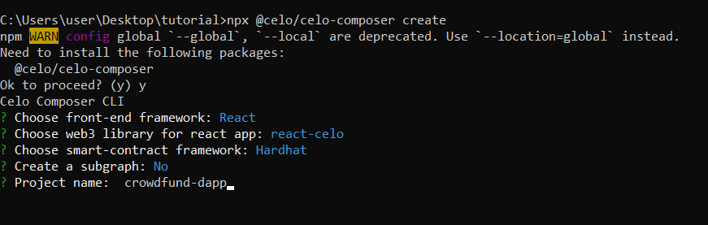

## Introduction

Hey there! In this article, we'll be talking about how to create a crowdfunding Dapp on the Celo blockchain using Solidity and Celo-composer. We'll take you through the process step by step, starting with creating a smart contract for the crowdfunding process and ending with deploying the Dapp on the Celo network.

Celo is a blockchain platform that aims to make financial tools accessible to everyone, and it's super easy to use. Solidity is the programming language we'll be using to write the smart contract, and Celo-composer is the development framework that simplifies the process of building Dapps on Celo.

By the end of this article, you'll have a solid understanding of how to build a Dapp on Celo and be able to explore creating more complex applications on the Celo blockchain. Let's get started!

## Prerequisite

Before we dive into building the Dapp, there are some prerequisites that you need to have:

- Understanding on how to use command line or terminal
- Basic knowledge of blockchain concepts
- Familiarity with the Solidity
- Basic understanding of Celo Composer

## Requirements

- Yarn
- Node js
- A code editor
- Metamask

## Setting up the Environment

Celo Composer is a powerful tool that enables you to create and launch decentralized applications on the Celo blockchain with ease. Whether you're an experienced developer or just getting started with blockchain technology, Celo Composer simplifies the process of building, deploying, and updating dApps on Celo.

With Celo composer, You have access to a variety of ready-to-use frameworks and examples, which can help you get started on your project right away.

Using the CLI is the easiest way to get started with celo composer and we will explore that in this tutorial. To get started on our crowdfunding dapp, Open your terminal

Run this on your terminal

```bash
npx @celo/celo-composer create
```

The terminal would display prompts so you can choose your framework.
For this tutorial, we would be using react-celo and hardhat.
After setting up your environment, your terminal would look like this



You can choose whatever you’d like to call your project in the `project name`.

Navigate to your project directory and open your project using a code editor by running the command

```bash
cd crowdfund-dapp
code .
```

Navigate to your terminal and install the dependencies using the following command

```bash
yarn
```

**Note**

- I’d recommend [Visual Studio Code](https://code.visualstudio.com/) as a code editor but there are others like Sublime or atom.
- Please check out the README.md file in the [Celo Composer Repository](https://github.com/celo-org/celo-composer) to learn more about setting up your environment.

## Write the Smart Contract

In this step, we will be creating the crowdfunding smart contract but before we begin, in our code editor let’s navigate to the contracts folder through the hardhat directory by running the following command in the terminal.

```bash
cd packages/hardhat/contract
```

Create a new file called `Crowdfunding.sol` and add the contract below.

**`Crowdfunding.sol`**

```solidity
// SPDX-License-Identifier: GPL-3.0
pragma solidity ^0.8.0;

contract Crowdfunding {
    address public owner;
mapping(address => uint256) contributions;

    struct Project {
        string name;
        string description;
        uint256 goal;
        uint256 deadline;
        uint256 totalContributions;
        bool completed;
        bool goalReached;

        address payable[] contributors;
    }

    Project[] public projects;

    event GoalReached(uint projectId, uint amountRaised);
    event FundingReceived(uint projectId, address contributor, uint amount );

    modifier onlyOwner {
        require(msg.sender == owner, "Only owner can call this function.");
        _;
    }

    constructor() {
        owner = msg.sender;
    }

    function createProject(string memory _name, string memory _description, uint _goal) public onlyOwner {
        Project memory project =  Project({
            name: _name,
            description: _description,
            goal: _goal,
            deadline: block.timestamp + 3 days,
            totalContributions: 0,
            completed: false,
            goalReached: false,
            contributors: new address payable[](0)
        });
        projects.push(project);
    }


     function contribute(uint256 amount, uint _projectId) public payable {
        Project storage project = projects[_projectId];
        require(!project.completed, "Project has already been completed.");
        require(block.timestamp < project.deadline, "Project deadline has passed.");
        contributions[msg.sender] += amount;
        project.totalContributions += amount;
        if (contributions[msg.sender] == amount) {
            project.contributors.push(payable(msg.sender));
        }
        emit FundingReceived(_projectId, msg.sender, amount);
        checkGoalReached(_projectId);
    }


     function checkGoalReached(uint _projectId) internal {
        Project storage project = projects[_projectId];
        if (project.totalContributions >= project.goal && !project.goalReached) {
            project.goalReached = true;
            emit GoalReached(_projectId, project.totalContributions);
        }
    }

      function complete(uint _projectId) public onlyOwner {
        Project storage project = projects[_projectId];
        require(block.timestamp >= project.deadline, "Project deadline has not passed.");
        require(!project.completed, "Project has already been completed.");
        project.completed = true;
        if (project.goalReached) {
            address payable ownerPayable = payable(owner);
            ownerPayable.transfer(address(this).balance);
        } else {
            for (uint i = 0; i < project.contributors.length; i++) {
                address payable contributor = project.contributors[i];
                uint contribution = contributions[contributor];
                if (contribution > 0) {
                    contributor.transfer(contribution);
                }
            }
        }
    }

    function getProjects() public view returns (Project[] memory) {
    return projects;
}

}
```

`contract Crowdfunding` declares the name of the contract, which is `Crowdfunding`.

`address public owner` declares a public variable called `owner`, which is of type `address`. The `public` keyword means that this variable can be accessed from outside the contract, which makes it possible for other contracts and external entities to interact with the crowdfunding contract.

`mapping(address => uint256) contributions;` declares a data structure called "mapping", which associates a value with each unique key.

The `struct **Project**` has several properties, including the project name, description, funding goal, deadline, total contributions`,` completed`and`goal reached`.

The `GoalReached` and `FundingReceived` events, are triggered when a funding goal is reached and when a project receives funding, respectively.

The modifier `onlyOwner` restricts access to certain functions only to the owner of the contract.

The `createProject` function creates a new project with the specified name, description, and funding goal. The project's deadline is set to three days from the current block timestamp.

The `contribute` function allows a user to contribute a specified amount to a specific `_projectId` in the smart contract. It checks that the project has not been completed, and the deadline has not passed, before adding the user's contribution to the `project.totalContributions`. If the user has not contributed before, their address is added to the project's contributors list. Finally, the function emits a FundingReceived event and checks if the project's funding goal has been reached.

The `checkGoalReached` function checks whether a particular project has reached its funding goal.

The `complete function` allows the owner of the contract to mark a project as completed and distribute the funds. If the project has reached its funding goal, the function transfers the entire balance of the contract to the owner's address. If not, the function distributes the contributions to each contributor based on their contribution amount.

The function `getProjects()` reads the state and returns an array of type `Project`.

## Connect your wallet

Under the hardhat folder, create a `.env` file and add the following command to it

```bash
MNEMONIC=""
PRIVATE_KEY=""
CELOSCAN_API_KEY=""
```

Add your private key of your metamask wallet to the `PRIVATE_KEY`. Please ensure you are using a test account.

**Learn more:**

- Check out [3 Simple Steps to Connect your MetaMask Wallet To Celo](https://developers.celo.org/3-simple-steps-to-connect-your-metamask-wallet-to-celo-732d4a139587) for more details.

## Deploy the contract

Navigate to the hardhat folder by running this command in your terminal

```bash
cd packages/hardhat/deploy
```

Go to the `00-deploy.js` file and paste the following command

```js
module.exports = async ({ getNamedAccounts, deployments }) => {
  const { deploy } = deployments;
  const { deployer } = await getNamedAccounts();

  await deploy("Crowdfunding", {
    from: deployer,
    // args: [ethers.utils.parseEther("1.0")],
    log: true,
  });

module.exports.tags = ["Crowdfunding"];
```

Deploy your smart contracts by running this command

```bash
yarn deploy
```

## Conclusion

In this tutorial, you have learnt how to set up your environment, write a crowdfunding contract, connect your wallet and deploy your crowdfunding contract.

## Next Steps

Now, you can challenge yourself by adding extra functionalities to the smart contract. Please check the [Repo](https://github.com/Kyrian212/crowdfundy) and also [Celo Documentation](docs.celo.org) to learn more.

## Author

Kyrian Chigozie is a Technical Writer with a passion for web3 technology. Connect with me on [Twitter](https://twitter.com/Kyrian_M) or [Github](https://github.com/Kyrian212).

## Reference

- [Celo Docs](https://docs.celo.org/)
- [Celo Composer](https://github.com/celo-org/celo-composer)
- [Visual Studio Code](https://code.visualstudio.com/)
- [3 Simple steps to connect your metamask wallet to Celo](https://developers.celo.org/3-simple-steps-to-connect-your-metamask-wallet-to-celo-732d4a139587)
