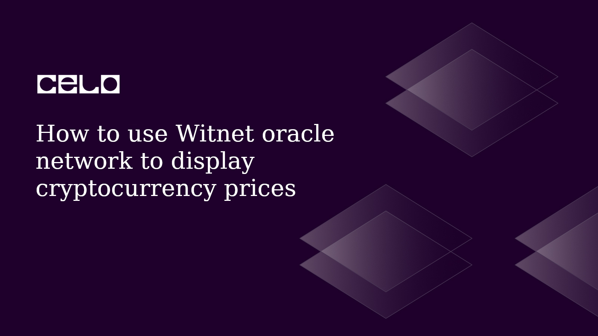

## Introduction​

When developing Dapp, we often need to bring in information that is stored and processed outside of a
blockchain network. This data can be retrieved and used by smart contracts through the use of oracles,
which act as intermediaries between the off-chain world and the blockchain network. By using off-chain data,
smart contracts can execute more complex logic and interact with external systems and services.

There are a couple of oracle platforms one could use to get off-chain data to one's Dapp.
I want to show how to use Witnet to display price feeds of the popular blockchain networks.

## Prerequisites​

To successfully follow along in this tutorial, you need basic knowledge of the following:
HTML, CSS, and React
Blockchain, Solidity, and Hardhat

## Requirements​

- [Remix](https://remix.ethereum.org/) - Online editor for writing smart contracts or any code editor you choose.
- [Metamask](https://metamask.io/) - For managing our wallet.
- [Hardhat](https://hardhat.org/) - For compiling and deploying the smart contract
- [Alfajores Testnet Account](https://developers.celo.org/3-simple-steps-to-connect-your-metamask-wallet-to-celo-732d4a139587) - Required to connect to the dApp and make test transactions.
- [Node.js](https://nodejs.org/en/) - From V12. or higher

## Witnet and Celo

Witnet is a decentralized oracle network that allows smart contracts to securely and reliably access external data sources, off-chain computations, and other off-chain resources. Celo, on the other hand, is a blockchain platform that aims to make financial tools and services more accessible to anyone with a mobile phone.

The two platforms are not directly related, but they can be used together to build decentralized applications that require access to external data. For example, a developer building a decentralized prediction market on Celo might use Witnet as the oracle network to retrieve external data such as sports scores or stock prices. In our case, we are about to use Witnet and Celo blockchain to get price feeds of some popular blockchain networks.

## Smart Contract

The PriceFeeds smart contract retrieves price feeds data from the Witnet decentralized oracle network.

```solidity
// SPDX-License-Identifier: MIT
pragma solidity ^0.8.11;

import "witnet-solidity-bridge/contracts/interfaces/IWitnetPriceRouter.sol";
import "witnet-solidity-bridge/contracts/interfaces/IWitnetPriceFeed.sol";

contract PriceFeeds {
   IWitnetPriceRouter public witnetPriceRouter;
   mapping(bytes4 => IWitnetPriceFeed) public priceFeeds;
   bytes4[] ID4;
   uint256 public lastUpdateTime;

   constructor(IWitnetPriceRouter _router, bytes4[] memory _ID4) {
       witnetPriceRouter = _router;
       ID4 = _ID4;
       lastUpdateTime = block.timestamp;
       updatePriceFeeds();
   }

   function updatePriceFeeds() public {
       for (uint256 i = 0; i < ID4.length; i++) {
           bytes4 _ID4 = ID4[i];
           IERC165 _newPriceFeed = witnetPriceRouter.getPriceFeed(bytes4(_ID4));
           if (address(_newPriceFeed) != address(0)) {
               priceFeeds[_ID4] = IWitnetPriceFeed(address(_newPriceFeed));
           }
       }
   }

   function checkAndUpdatePriceFeeds() public {
       if (block.timestamp >= lastUpdateTime + 60) { // Check if a minute has passed
           updatePriceFeeds();
           lastUpdateTime = block.timestamp; // Update last update time
       }
   }


   function getPriceFeedLastValues(bytes4 _ID4) public returns (int256 _lastPrices, uint256 _lastTimestamps) {
       checkAndUpdatePriceFeeds();
       IWitnetPriceFeed priceFeed = priceFeeds[_ID4];
       (int256 lastPrice, uint256 lastTimestamp, , ) = priceFeed.lastValue();

       _lastPrices = lastPrice;
       _lastTimestamps = lastTimestamp;
   }
}
```

The contract imports the interfaces for the WitnetPriceRouter and WitnetPriceFeed contracts from the Witnet Solidity Bridge library.

The contract has a constructor that takes an `IWitnetPriceRouter` instance and an array of `bytes4` IDs as parameters. It initializes a mapping called `priceFeeds` that maps each `bytes4` ID to an `IWitnetPriceFeed` instance. The `updatePriceFeeds` function is called in the constructor to retrieve the current price feeds for each ID.

The contract also has a `checkAndUpdatePriceFeeds` function that checks if a minute has passed since the last update and updates the price feeds if necessary. This function is called in the `getPriceFeedLastValues` function.

The `getPriceFeedLastValues` function takes a `bytes4` ID as a parameter and retrieves the last price and timestamp for that ID from the corresponding `IWitnetPriceFeed` instance in the `priceFeeds` mapping. It calls the `checkAndUpdatePriceFeeds` function to ensure that the price feeds are up-to-date before retrieving the values.

## Frontend

The frontend has a typical CRA folder structure, so I would not bore us with details of what the folders of this app looks like in this tutorial. However, I would highlight a few of the custom files I created.

Also, we are going to use `react-celo`to easily incorporate Celo blockchain features into this application.

## App.js

```js
import { Routes, Route } from "react-router-dom";
import AppHeader from "./components/layout/Header";
import Home from "./pages/Home";
import { CeloProvider, Alfajores, NetworkNames } from "@celo/react-celo";
import "@celo/react-celo/lib/styles.css";

const WrappedApp = () => {
  return (
    <CeloProvider
      networks={[Alfajores]}
      network={{
        name: NetworkNames.Alfajores,
        rpcUrl: "https://alfajores-forno.celo-testnet.org",
        graphQl: "https://alfajores-blockscout.celo-testnet.org/graphiql",
        explorer: "https://alfajores-blockscout.celo-testnet.org",
        chainId: 44787,
      }}
      dapp={{
        name: "How to use Witnet oracle network to display cryptocurrency prices",
        description: "",
        url: "https://witnet-oracle.vercel.app/",
      }}
    >
      <App />
    </CeloProvider>
  );
};

const App = () => {
  return (
    <div>
      <AppHeader />
      <Routes>
        <Route path="/" element={<Home />} />
      </Routes>
    </div>
  );
};

export default WrappedApp;
```

This file is the ideal place to configure `react-celo`. We imported the `Routes` and `Route` components from the `react-router-dom` package, as well as the `CeloProvider`, `Alfajores`, and `NetworkNames` components from the `@celo/react-celo` package.

The `WrappedApp` component uses the `CeloProvider` to configure the Celo network to be used in the application, setting the networks array to `Alfajores`, which is a test network. It also sets the `network` object with various network details such as `rpcUrl`, `graphQl`, `explorer`, and `chainId`. Additionally, the `dapp` object provides details about the decentralized application itself. The `App` component is then wrapped in the `CeloProvider` component.

The `App` component renders an `AppHeader` component and defines a single route using the `Routes` and `Route` components, which renders our only page component, the `Home` component when the URL path is set to "/".

## Hooks

### useContract.js

```js
import { useState, useEffect, useCallback } from "react";
import { useCelo } from "@celo/react-celo";

export const useContract = (abi, contractAddress) => {
  const { kit, address } = useCelo();
  const [contract, setContract] = useState(null);

  const getContract = useCallback(async () => {
    setContract(new kit.connection.web3.eth.Contract(abi, contractAddress));
  }, [kit, abi, contractAddress]);

  useEffect(() => {
    if (address) getContract();
  }, [address, getContract]);

  return contract;
};
```

This is the only custom hook in the application. It accepts two parameters: `abi` and `contractAddress`.

The hook uses the `useCelo` hook from the `@celo/react-celo` package to get the Celo kit object and the current user address. It also defines a state variable called `contract` using the `useState` hook, which is initially set to null.

The `getContract` function is defined using the `useCallback` hook to ensure that it is only recreated when the dependencies, `kit`, `abi`, and `contractAddress`, change. The function creates a new contract instance using the web3.eth.Contract method provided by the Celo kit object and sets the `contract` state variable to the new instance.

Basically, the `useEffect` hook is used to call the `getContract` function when the `address` variable changes, which is passed as a dependency to the hook. This ensures that the contract instance is only created after the user address has been fetched.

The hook returns the `contract` state variable, which can be used by the calling component to interact with the smart contract using the defined `abi` and `contractAddress`.

## Utils

### constants.js

```js
export const ID4s = [
  { caption: "btc/usd", value: 0x24beead4 },
  { caption: "celo/eur", value: 0x21a79821 },
  { caption: "celo/usd", value: 0x9ed884be },
  { caption: "eth/usd", value: 0x3d15f701 },
  { caption: "nct/celo", value: 0x4d50c3a6 },
  { caption: "nct/usd", value: 0x31077f15 },
];
```

This file exports `ID4s` array, which consists of price feeds currently supported by the Witnet Foundation for Celo testnet (Alfajores). Each object has two key-value pairs: caption, a string representing the caption of the currency pair and value, a hexadecimal value representing the ID of the currency pair.

The `value` key represents a unique identifier for simplifying the identification of currency pairs served by Witnet's Price Router. One could use only the first 4 bytes of the full bytes32 identifier (ID32), which are referred to as ID4.

### helpers.js

```js
export const truncate = (input) =>
  `${input.substring(0, 5)}...${input.slice(-4)}`;
```

`truncate` receives a string as input, shortens it to a length of 9 characters by taking the first five characters, adding an ellipsis ("..."), and then appending the last four characters of the string. Finally, it returns the shortened string.

### interact.js

```js
import { ID4s } from "./constants";

export const priceFeedAddress = "0xB40bf553be448345C09891682636cf632a77c419";

export const getPriceFeed = async (contract) => {
  if (contract) {
    try {
      let values = ID4s.map((item) => item.value);
      values = values.map((item) => "0x" + item.toString(16));

      let priceFeeds = [];

      for (let i = 0; i < ID4s.length; i++) {
        const priceFeed = new Promise(async (resolve) => {
          const priceFeed = await contract.methods
            .getPriceFeedLastValues(values[i])
            .call();
          resolve({
            price: (priceFeed._lastPrices / 1000000).toFixed(2),
            caption: ID4s[i].caption,
          });
        });
        priceFeeds.push(priceFeed);
      }
      return Promise.all(priceFeeds);
    } catch (e) {
      console.log({ e });
    }
  }
};
```

The `getPriceFeed` function takes a single argument, `contract`. It's an asynchronous function that performs a series of steps when the contract argument is truthy. First, it creates an array of the value properties from the ID4s constant, converts each value to a hexadecimal string, and pushes each string to the `values` array.

Next, it creates an empty array called `priceFeeds` and loops through the ID4s array. For each item in ID4s, it creates a new Promise that awaits the result of calling the `getPriceFeedLastValues` method on the contract object with the corresponding value as an argument.

When the `getPriceFeedLastValues` method call completes, the Promise resolves with an object containing the `price` value and the `caption` from the current ID4s item. The resolved Promise is then pushed to the priceFeeds array.

## Conclusion

We built an NFT marketplace for tech artisans to connect with their prospective clients with a metric to highlight freelancers with frequent sales. [Here](https://witnet-oracle.vercel.app/) is the final demo of what we built. [Here](https://github.com/cjustinobi/witnet-oracle) is the link to the complete code.

## About the Author​

A software engineer, co-founder, Africinnovate, and a Web3 enthusiast. I used to call myself VueDetective. Connect with me on LinkedIn and Github

## References​

[Witnet data feeds documentation](https://docs.witnet.io/smart-contracts/witnet-data-feeds)
