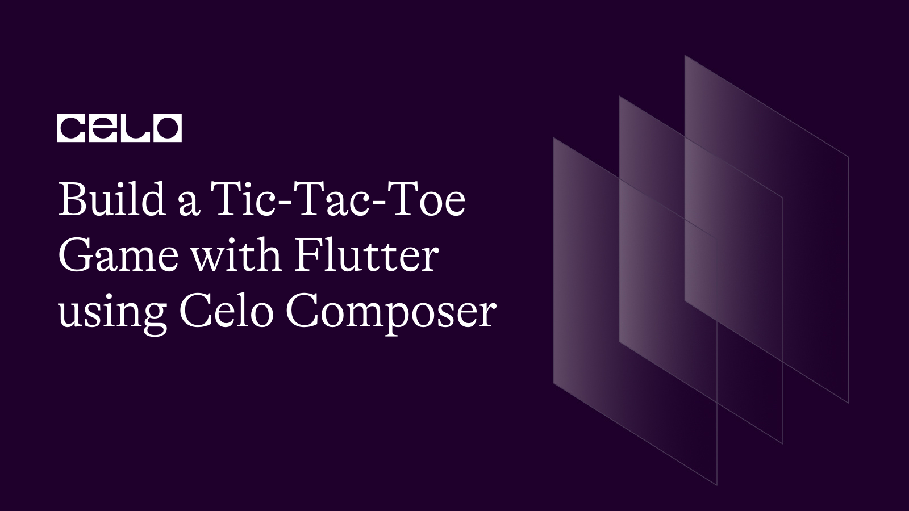
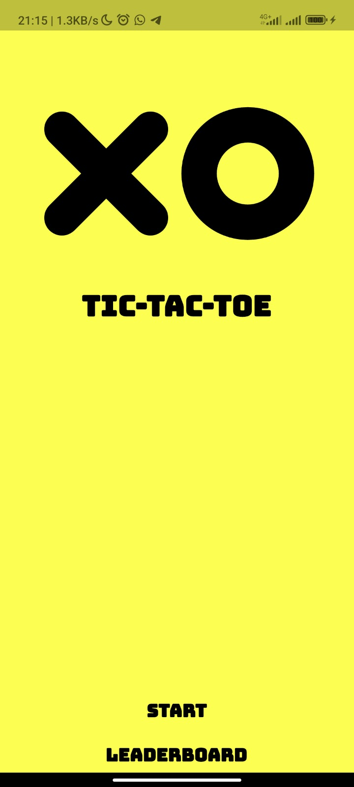
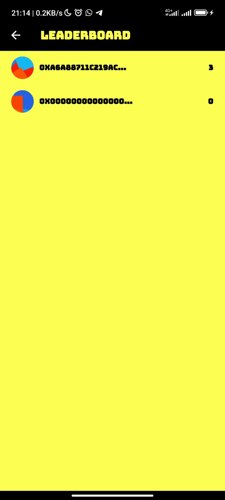
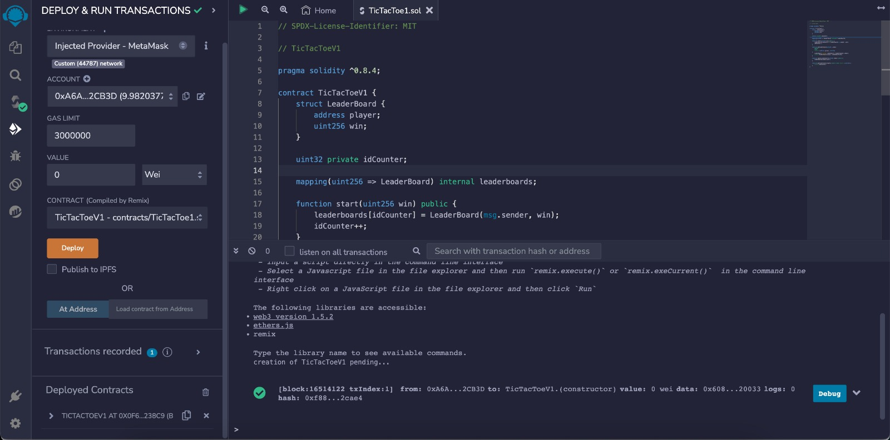
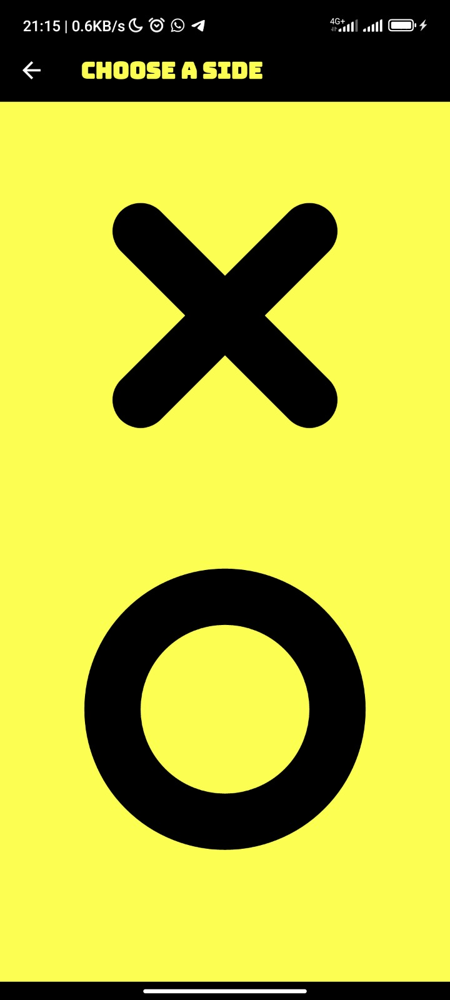
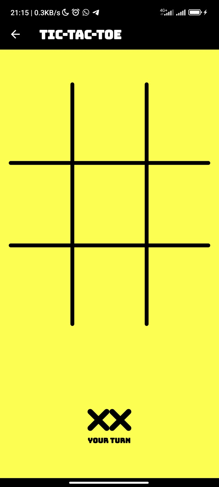
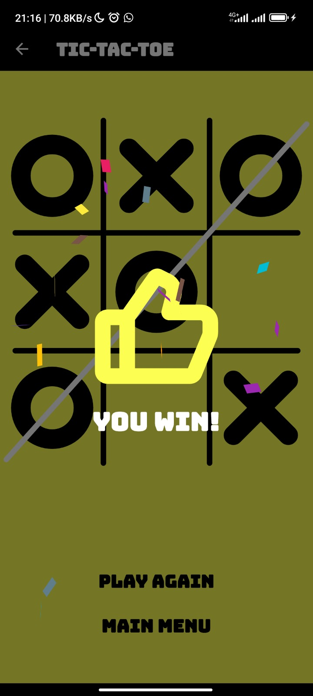
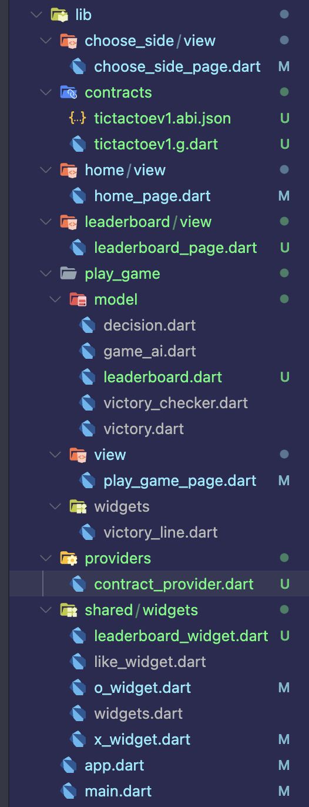
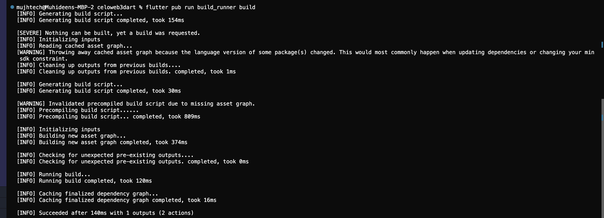
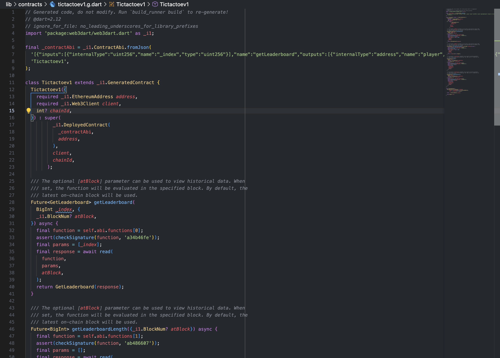

## Introduction

In this tutorial, we'll go over the fundamentals of building a basic Tic Tac Toe game with the help of the well-known Flutter framework, the Celo Composer toolkit, and the Solidity smart contract programming language. You will have a fundamental understanding of how to make a Tic Tac Toe game with Flutter and Solidity by the end of this lesson, and you will be able to build on this knowledge to make more challenging games.

We'll begin by introducing Flutter, Celo Composer, and Solidity and outlining how to utilize each of them to create a Tic Tac Toe game. Next, we'll go over how to start up a fresh Flutter project using Celo Composer, install the required dependencies, and use Solidity to build a smart contract for the Ethereum network. We will next go over the fundamentals of building a user interface (UI) for our game using the Flutter framework and Celo Composer. Additionally, we'll go through how to use the web3.dart library to interface with the smart contract and use the smart contract to decide the game's winner. Then we'll test the game and make any required changes.

### How the dApp works

Here's what we're aiming to build.




## Getting Started

I assume that anyone going through this tutorial already understands and uses Flutter, so I will skip the setup involved in getting Flutter to work on your development computer. That means I assume you already have VS Code/Android Studio together with Android SDK and Flutter setup on your PC.

- If you are entirely new to Flutter, here [https://docs.flutter.dev/get-started/install](https://docs.flutter.dev/get-started/install) is a good tutorial you can learn from.

To get started, you can clone this repository flutter-web3-celo or make use of Celo Composer.

Celo Composer is a set of tools and starter templates that makes it easy for you to start your Celo-based web3 projects.

You can check out Celo Composer here [https://github.com/celo-org/celo-composer/tree/main/packages/flutter-app](https://github.com/celo-org/celo-composer/tree/main/packages/flutter-app).

### Using Celo Composer

To start our Flutter App Project, we will use the Celo Composer CLI; the CLI makes it easy for us to select the options that we want when bootstrapping our dApp. In other to do that you need to have Node set up on your PC and you can visit Node to get started. Run this on your terminal after setup Node.

```bash
npx @celo/celo-composer create
```

Choose Flutter when asked for the framework

Choose hardhat (Only Hardhat is available at the time of writing this tutorial)

Your Project will now be created; you can check to make sure it has the following folders

packages/hardhat - Your Hardhat Folder - Where you can keep your Contracts
packages/flutter-app - Your Flutter project

## Setup the Smart Contract

The next step is to compile our smart contract using the solidity compiler of your choice, such as hardhat, truffle, or any other solidity compiler.

```solidity
// SPDX-License-Identifier: MIT

// TicTacToeV1

pragma solidity ^0.8.4;

contract TicTacToeV1 {
    struct LeaderBoard {
        address player;
        uint256 win;
    }

    uint32 private idCounter;

    mapping(uint256 => LeaderBoard) internal leaderboards;

    function start(uint256 win) public {
        leaderboards[idCounter] = LeaderBoard(msg.sender, win);
        idCounter++;
    }

    function getLeaderboard(uint256 _index)
        public
        view
        returns (address player, uint256)
    {
        LeaderBoard storage leaderboard = leaderboards[_index];
        return (leaderboard.player, leaderboard.win);
    }

    function updateLeaderboard(uint256 index) public {
        leaderboards[index].win++;
    }

    function getLeaderboardLength() public view returns (uint256) {
        return (idCounter);
    }
}
```

### Deploy Smart contract (Remix)

Now that your contract is compiled, you can deploy your smart contract to the network. You can deploy to any Ethereum compatible network, and in this case we’ll be deploying the Celo testnet or mainnnet depending on your preference. If you’re brand new to this stick with testnet!

- Click the Deploy and Run Transactions Icon on the left side menu.
- Choose Injected Web3 as your environment.
- [Connect MetaMask to Celo](https://medium.com/@joenyzio/3-simple-steps-to-connect-your-metamask-wallet-to-celo-732d4a139587) testnet and verify the network.



## The UI (Flutter)





### Directory structure



Let’s copy our Contract ABIs into our project.

Then create a folder in the project folder directory lib and create a file named **tictactoev1.abi.json**. Note your file name can be anything but make sure the file extension start and ends with **.abi.json**. With the help of **build_runner** & **web3dart_builders** we will be able to generate a dart contract object file which we will be using to interact with our smart contract.

Run this in your terminal

```bash
flutter pub run build_runner build
```

or

```bash
flutter pub run build_runner watch
```



This will generate a dart file to represent our smart contract object named **tictactoev1.g.dart**.



### Shared Widgets

Leaderboard Widgets

```js
// lib/shared/widgets/leaderboard_widget.dart
import 'package:flutter/material.dart';
import 'package:jazzicon/jazzicon.dart';
import 'package:jazzicon/jazziconshape.dart';
import 'package:tic_tac_toe/app.dart';
import 'package:tic_tac_toe/play_game/model/leaderboard.dart';

class LeaderboardWidget extends StatefulWidget {
  final Leaderboard leaderboard;
  const LeaderboardWidget({super.key, required this.leaderboard});

  @override
  State<LeaderboardWidget> createState() => _LeaderboardWidgetState();
}

class _LeaderboardWidgetState extends State<LeaderboardWidget> {
  JazziconData? jazz;

  @override
  void initState() {
    jazz = Jazzicon.getJazziconData(40, address: widget.leaderboard.player);
    super.initState();
  }

  @override
  Widget build(BuildContext context) {
    return Row(
      crossAxisAlignment: CrossAxisAlignment.center,
      mainAxisAlignment: MainAxisAlignment.spaceBetween,
      children: [
        Row(
          crossAxisAlignment: CrossAxisAlignment.center,
          children: [
            if (jazz != null) Jazzicon.getIconWidget(jazz!),
            const SizedBox(
              width: 10,
            ),
            Text(
              '${widget.leaderboard.player.substring(0, 16)}...',
              overflow: TextOverflow.ellipsis,
              style: const TextStyle(
                fontSize: 16,
                fontWeight: FontWeight.bold,
                color: black,
              ),
            )
          ],
        ),
        Text(
          '${widget.leaderboard.win}',
          overflow: TextOverflow.ellipsis,
          style: const TextStyle(
            fontSize: 16,
            fontWeight: FontWeight.bold,
            color: black,
          ),
        )
      ],
    );
  }
}

```

**O Widget**

```js
// lib/shared/widgets/o_widget.dart
import 'dart:math' as math;

import 'package:flutter/material.dart';
import 'package:flutter_hooks/flutter_hooks.dart';
import 'package:tic_tac_toe/app.dart';

class OWidget extends HookWidget {
  final double height;
  final double width;
  final bool shouldAnimate;
  final Color color;
  final double radius;
  final double strokeWidth;

  const OWidget({
    Key? key,
    this.height = 100,
    this.width = 100,
    this.shouldAnimate = true,
    this.color = black,
    this.radius = 55,
    this.strokeWidth = 30,
  }) : super(key: key);

  @override
  Widget build(BuildContext context) {
    final animationController =
        useAnimationController(duration: const Duration(milliseconds: 600));
    final animation = Tween<double>(begin: 0, end: math.pi * 2).animate(
      animationController,
    );

    useEffect(() {
      animationController.forward();
      return () {};
    }, []);
    return SizedBox(
      height: height,
      width: width,
      child: AnimatedBuilder(
        animation: animation,
        builder: (context, child) {
          return CustomPaint(
            painter: OPainter(
                color: color,
                sweepAngle: shouldAnimate ? animation.value : math.pi * 2,
                radius: radius,
                strokeWidth: strokeWidth),
          );
        },
      ),
    );
  }
}

class OPainter extends CustomPainter {
  final Color color;
  final double sweepAngle;
  final double radius;
  final double strokeWidth;

  OPainter({
    required this.color,
    required this.sweepAngle,
    this.radius = 55,
    this.strokeWidth = 30,
  });

  @override
  void paint(Canvas canvas, Size size) {
    Paint paint = Paint()
      ..color = color
      ..strokeWidth = strokeWidth
      ..strokeCap = StrokeCap.round
      ..style = PaintingStyle.stroke;

    Rect rect =
        Rect.fromCircle(center: size.center(Offset.zero), radius: radius);
    canvas.drawArc(rect, 0, sweepAngle, false, paint);
  }

  @override
  bool shouldRepaint(covariant OPainter oldDelegate) {
    return oldDelegate.sweepAngle != sweepAngle;
  }
}
```

**X Widget**

```js
// lib/shared/widgets/x_widget.dart
import 'dart:ui';

import 'package:flutter/material.dart';
import 'package:flutter_hooks/flutter_hooks.dart';
import 'package:tic_tac_toe/app.dart';

class XWidget extends HookWidget {
  final double height;
  final double width;
  final bool shouldAnimate;
  final Color color;
  final double strokeWidth;

  const XWidget({
    Key? key,
    this.height = 100,
    this.width = 100,
    this.shouldAnimate = true,
    this.color = black,
    this.strokeWidth = 30,
  }) : super(key: key);

  @override
  Widget build(BuildContext context) {
    final firstAnimationController = useAnimationController(
      duration: const Duration(milliseconds: 300),
      lowerBound: 0,
      upperBound: 1,
    );

    final secondAnimationController = useAnimationController(
      duration: const Duration(milliseconds: 300),
      lowerBound: 0,
      upperBound: 1,
    );

    useEffect(() {
      firstAnimationController.forward();
      firstAnimationController.addListener(() {
        if (firstAnimationController.value == 1) {
          secondAnimationController.forward();
        }
      });
      return () {};
    }, []);
    return SizedBox(
      height: height,
      width: width,
      child: AnimatedBuilder(
        animation: Listenable.merge(
          [firstAnimationController, secondAnimationController],
        ),
        builder: (context, child) {
          return CustomPaint(
            painter: XPainter(
              color: color,
              firstLineProgress:
                  shouldAnimate ? firstAnimationController.value : 1,
              secondLineProgress:
                  shouldAnimate ? secondAnimationController.value : 1,
              strokeWidth: strokeWidth,
            ),
          );
        },
      ),
    );
  }
}

class XPainter extends CustomPainter {
  final Color color;
  final double firstLineProgress;
  final double secondLineProgress;
  final double strokeWidth;

  XPainter({
    required this.color,
    this.firstLineProgress = 1,
    this.secondLineProgress = 1,
    this.strokeWidth = 30,
  });

  @override
  void paint(Canvas canvas, Size size) {
    Paint paint = Paint()
      ..color = color
      ..strokeWidth = strokeWidth
      ..strokeCap = StrokeCap.round
      ..style = PaintingStyle.stroke;
    Path firstPath = Path()
      ..moveTo(0, 0)
      ..lineTo(size.width, size.height);

    Path secondPath = Path()
      ..moveTo(size.width, 0)
      ..lineTo(0, size.height);
    animatePath(firstPath, paint, canvas, firstLineProgress);
    if (firstLineProgress == 1) {
      animatePath(secondPath, paint, canvas, secondLineProgress);
    }
  }

  animatePath(Path path, Paint paint, Canvas canvas, double progress) {
    PathMetrics shadowMetrics = path.computeMetrics();
    for (PathMetric pathMetric in shadowMetrics) {
      Path extractPath = pathMetric.extractPath(
        0.0,
        pathMetric.length * progress,
      );
      canvas.drawPath(extractPath, paint);
    }
  }

  @override
  bool shouldRepaint(covariant XPainter oldDelegate) {
    return oldDelegate.firstLineProgress != firstLineProgress ||
        oldDelegate.secondLineProgress != secondLineProgress;
  }
}
```

### Providers

**Contract Provider**

This is where our business logic is and how we interact with CELO Blockchain using wallet private key.
Note: Our aims here is to be able to connect to smart contract, add player to leaderboard if not on the leaderboard then update user win record.

```js
// lib/providers/contract_provider
// ignore_for_file: depend_on_referenced_packages

import 'package:collection/collection.dart';
import 'package:flutter/material.dart';
import 'package:http/http.dart';
import 'package:web3dart/web3dart.dart';

import 'package:tic_tac_toe/contracts/tictactoev1.g.dart';
import 'package:tic_tac_toe/play_game/model/leaderboard.dart';

class ContractProvider extends ChangeNotifier {
  final rpcUrl = 'https://alfajores-forno.celo-testnet.org';
  List<Leaderboard>? _leaderboards;
  List<Leaderboard>? get leaderboards => _leaderboards;
  // Import your private key or generate one from hardhat
  final credentials = EthPrivateKey.fromHex(
    '------',
  );

  Future<void> addPlayer() async {
    try {
      final client = Web3Client(rpcUrl, Client());
      // Import your smart contract address
      final tictactoeV1 = Tictactoev1(
        address: EthereumAddress.fromHex(
            '0x0f6E0e3F5df62d4067D9969Cd3c9F34cc2b238C9'),

        /// This is generated by hardhat, not a real account
        client: client,
      );

      await tictactoeV1.start(BigInt.one, credentials: credentials);
    } catch (e) {
      //
    }
  }

  Future<void> fetchLeaderboard() async {
    try {
      _leaderboards = null;
      notifyListeners();

      final client = Web3Client(rpcUrl, Client());
      // Import your smart contract address
      final tictactoeV1 = Tictactoev1(
        address: EthereumAddress.fromHex(
            '0x0f6E0e3F5df62d4067D9969Cd3c9F34cc2b238C9'),

        /// This is generated by hardhat, not a real account
        client: client,
      );

      final leaderboardLength = await tictactoeV1.getLeaderboardLength();

      if (leaderboardLength.toInt() > 0) {
        for (int i = 1; i <= leaderboardLength.toInt(); i++) {
          final leaderboard = await tictactoeV1.getLeaderboard(BigInt.from(i));

          if (_leaderboards == null || _leaderboards!.isEmpty) {
            _leaderboards = [
              Leaderboard(
                  player: leaderboard.player.toString(),
                  win: leaderboard.var2.toInt())
            ];
          } else {
            final isAdded = _leaderboards!
                .where((e) => e.player == leaderboard.player.toString())
                .toList();

            if (isAdded.isEmpty) {
              _leaderboards!.add(Leaderboard(
                  player: leaderboard.player.toString(),
                  win: leaderboard.var2.toInt()));
            }
          }
        }
        notifyListeners();
      }
    } catch (e) {
      //
    }
  }

  Future<void> updateLeaderboard() async {
    try {
      final client = Web3Client(rpcUrl, Client());
      // Import your smart contract address
      final tictactoeV1 = Tictactoev1(
        address: EthereumAddress.fromHex(
            '0x0f6E0e3F5df62d4067D9969Cd3c9F34cc2b238C9'),

        /// This is generated by hardhat, not a real account
        client: client,
      );

      Leaderboard? user = _leaderboards!.firstWhereOrNull(
        (e) => e.player == credentials.address.toString(),
      );

      if (user != null) {
        int index = _leaderboards!.indexOf(user);
        await tictactoeV1.updateLeaderboard(BigInt.from(index),
            credentials: credentials);
      } else {
        await addPlayer();
      }
    } catch (e) {
      //
    }
  }
}
```

### Screens

**Home Screen** : This is the first page user get to see and click on start to select what shape to use for game or click leaderboard in order to see the list of players on the leaderboard list

```js
// lib/home/view/home_page.dart

import 'package:flutter/material.dart';
import 'package:provider/provider.dart';
import 'package:tic_tac_toe/app.dart';
import 'package:tic_tac_toe/choose_side/view/choose_side_page.dart';
import 'package:tic_tac_toe/leaderboard/view/leaderboard_page.dart';
import 'package:tic_tac_toe/providers/contract_provider.dart';

import '../../shared/widgets/widgets.dart';

class HomePage extends StatelessWidget {
  const HomePage({Key? key}) : super(key: key);

  @override
  Widget build(BuildContext context) {
    final controller = context.read<ContractProvider>();
    return Scaffold(
      body: Padding(
        padding: const EdgeInsets.symmetric(horizontal: 60.0),
        child: Column(
          mainAxisAlignment: MainAxisAlignment.spaceBetween,
          children: [
            Column(
              mainAxisSize: MainAxisSize.min,
              children: [
                const SizedBox(height: kToolbarHeight + 90),
                Row(
                  mainAxisAlignment: MainAxisAlignment.center,
                  children: const [
                    Hero(
                      tag: 'xw1',
                      child: XWidget(shouldAnimate: false, strokeWidth: 40),
                    ),
                    SizedBox(width: 60),
                    Hero(
                      tag: '0w1',
                      child: OWidget(shouldAnimate: false, strokeWidth: 40),
                    ),
                  ],
                ),
                const SizedBox(height: 80),
                Text(
                  'Tic-Tac-Toe'.toUpperCase(),
                  style: const TextStyle(
                    fontSize: 40,
                    color: black,
                    fontWeight: FontWeight.bold,
                  ),
                ),
              ],
            ),
            Column(
              children: [
                GestureDetector(
                  onTap: () {
                    controller.fetchLeaderboard();
                    Navigator.push(
                      context,
                      MaterialPageRoute(
                        builder: (context) => const ChooseSidePage(),
                      ),
                    );
                  },
                  child: Container(
                    height: 40,
                    width: 250,
                    decoration: BoxDecoration(
                        color: yellow, borderRadius: BorderRadius.circular(10)),
                    child: const Center(
                      child: Text(
                        'Start',
                        style: TextStyle(
                          fontSize: 25,
                          fontWeight: FontWeight.bold,
                          color: black,
                        ),
                      ),
                    ),
                  ),
                ),
                const SizedBox(height: 10),
                GestureDetector(
                  onTap: () {
                    controller.fetchLeaderboard();
                    Navigator.push(
                      context,
                      MaterialPageRoute(
                        builder: (context) => const LeaderboardPage(),
                      ),
                    );
                  },
                  child: Container(
                    height: 40,
                    width: 250,
                    decoration: BoxDecoration(
                        color: yellow, borderRadius: BorderRadius.circular(10)),
                    child: const Center(
                      child: Text(
                        'Leaderboard',
                        style: TextStyle(
                          fontSize: 25,
                          fontWeight: FontWeight.bold,
                          color: black,
                        ),
                      ),
                    ),
                  ),
                ),
              ],
            ),
          ],
        ),
      ),
    );
  }
}
```

**Choose Side Screen** : Note throughout this game, user will be playing with computer as opponent. On choose side page user get to select what shape/side to use for the game. You can go back to Shared Widgets section to see how both sides widget been implement with Animated builder

```js
// lib/choose_side/view/choose_side_page.dart
import 'package:flutter/material.dart';
import 'package:tic_tac_toe/app.dart';
import 'package:tic_tac_toe/play_game/view/play_game_page.dart';
import 'package:tic_tac_toe/shared/widgets/widgets.dart';

class ChooseSidePage extends StatelessWidget {
  const ChooseSidePage({Key? key}) : super(key: key);

  @override
  Widget build(BuildContext context) {
    return Scaffold(
      appBar: AppBar(
        backgroundColor: black,
        elevation: 0,
        iconTheme: const IconThemeData(color: Colors.white),
        title: Text(
          'Choose a side'.toUpperCase(),
          style: const TextStyle(
            fontSize: 25,
            fontWeight: FontWeight.bold,
            color: yellow,
          ),
        ),
      ),
      body: Column(
        crossAxisAlignment: CrossAxisAlignment.center,
        children: [
          SizedBox(width: MediaQuery.of(context).size.width),
          const SizedBox(height: 40),
          _LetterContainer(
            onPressed: () {
              Navigator.push(
                context,
                MaterialPageRoute(
                  builder: (context) => const PlayGamePage(
                    playerChar: 'x',
                    aiChar: 'o',
                  ),
                ),
              );
            },
            child: const Hero(
              tag: 'xw1',
              child: XWidget(
                width: 150,
                height: 150,
                color: black,
                shouldAnimate: false,
                strokeWidth: 50,
              ),
            ),
          ),
          const SizedBox(height: 50),
          _LetterContainer(
            onPressed: () {
              Navigator.push(
                context,
                MaterialPageRoute(
                  builder: (context) => const PlayGamePage(
                    playerChar: 'o',
                    aiChar: 'x',
                  ),
                ),
              );
            },
            child: const Hero(
              tag: '0w1',
              child: OWidget(
                width: 150,
                height: 150,
                color: black,
                radius: 100,
                shouldAnimate: false,
                strokeWidth: 50,
              ),
            ),
          ),
        ],
      ),
    );
  }
}

class _LetterContainer extends StatelessWidget {
  final Widget child;
  final VoidCallback onPressed;

  const _LetterContainer(
      {Key? key, required this.child, required this.onPressed})
      : super(key: key);

  @override
  Widget build(BuildContext context) {
    return GestureDetector(
      onTap: onPressed,
      child: Container(
        height: 300,
        width: 300,
        decoration: BoxDecoration(
            color: yellow, borderRadius: BorderRadius.circular(10)),
        child: Column(
          mainAxisAlignment: MainAxisAlignment.center,
          children: [
            child,
          ],
        ),
      ),
    );
  }
}
```

**Leaderboard Screen** : Here is where user get to see list of leaderboard using Listview separated widget in order to give little space between each LeaderboardWidget.

```js
// lib/leaderboard/view/leaderboard_page.dart
import 'package:flutter/material.dart';
import 'package:provider/provider.dart';
import 'package:tic_tac_toe/app.dart';
import 'package:tic_tac_toe/providers/contract_provider.dart';
import 'package:tic_tac_toe/shared/widgets/leaderboard_widget.dart';

class LeaderboardPage extends StatelessWidget {
  const LeaderboardPage({Key? key}) : super(key: key);

  @override
  Widget build(BuildContext context) {
    final controller = context.watch<ContractProvider>();
    return Scaffold(
      appBar: AppBar(
        backgroundColor: black,
        elevation: 0,
        iconTheme: const IconThemeData(color: Colors.white),
        title: Text(
          'Leaderboard'.toUpperCase(),
          style: const TextStyle(
            fontSize: 25,
            fontWeight: FontWeight.bold,
            color: yellow,
          ),
        ),
      ),
      body: controller.leaderboards == null || controller.leaderboards!.isEmpty
          ? Column(
              crossAxisAlignment: CrossAxisAlignment.center,
              mainAxisAlignment: MainAxisAlignment.center,
              children: const [
                Center(
                  child: Text(
                    'No leaderboard yet.',
                    overflow: TextOverflow.ellipsis,
                    style: TextStyle(
                      fontSize: 16,
                      fontWeight: FontWeight.bold,
                      color: black,
                    ),
                  ),
                )
              ],
            )
          : ListView.separated(
              padding: const EdgeInsets.symmetric(horizontal: 20, vertical: 10),
              separatorBuilder: (context, index) {
                return const SizedBox(
                  height: 20,
                );
              },
              itemBuilder: (_, index) {
                return LeaderboardWidget(
                  leaderboard: controller.leaderboards![index],
                  key: Key(controller.leaderboards![index].toString()),
                );
              },
              itemCount: controller.leaderboards!.length,
            ),
    );
  }
}

```

**Play game screen** : This page comprise a lot of logic and some widgets and this is where user get to play game together with opponents (Computer).

```js
// lib/play_game/view/play_game_page.dart

import 'dart:async';
import 'dart:math';

import 'package:confetti/confetti.dart';
import 'package:flutter/material.dart';
import 'package:flutter_hooks/flutter_hooks.dart';
import 'package:provider/provider.dart';
import 'package:tic_tac_toe/app.dart';
import 'package:tic_tac_toe/play_game/model/game_ai.dart';
import 'package:tic_tac_toe/play_game/model/victory.dart';
import 'package:tic_tac_toe/play_game/model/victory_checker.dart';
import 'package:tic_tac_toe/play_game/widgets/victory_line.dart';
import 'package:tic_tac_toe/providers/contract_provider.dart';
import 'package:tic_tac_toe/shared/widgets/widgets.dart';

class PlayGamePage extends HookWidget {
  final String playerChar;
  final String aiChar;

  const PlayGamePage({
    Key? key,
    required this.playerChar,
    required this.aiChar,
  }) : super(key: key);

  @override
  Widget build(BuildContext context) {
    final controller = context.read<ContractProvider>();
    final victory =
        useState<Victory>(Victory(0, 0, LineType.none, Winner.none));
    final playersTurn = useState(true);
    final aisTurn = useState(false);
    final fields = useState<List<List<String>>>([
      ['', '', ''],
      ['', '', ''],
      ['', '', '']
    ]);
    final gameAi = useState(
      GameAI(field: fields.value, playerChar: playerChar, aiChar: aiChar),
    );
    final confettiController = ConfettiController(
      duration: const Duration(seconds: 10),
    );

    void checkForVictory() {
      var checkedVictory =
          VictoryChecker.checkForVictory(fields.value, playerChar);

      if (checkedVictory != null) {
        aisTurn.value = false;
        playersTurn.value = false;
        victory.value = checkedVictory;
        String? message;

        if (victory.value.winner == Winner.player) {
          message = 'You Win!';
        } else if (victory.value.winner == Winner.ai) {
          message = 'AI Wins!';
        } else if (victory.value.winner == Winner.draw) {
          message = 'It\'s a tie!';
        }

        if (message != null) {
          confettiController.play();
          showDialog(
            context: context,
            builder: (context) {
              return Material(
                type: MaterialType.transparency,
                child: Column(
                  mainAxisAlignment: MainAxisAlignment.center,
                  children: [
                    Visibility(
                      visible: victory.value.winner == Winner.player,
                      child: Stack(
                        children: [
                          const LikeWidget(
                            height: 150,
                            width: 150,
                          ),
                          ConfettiWidget(
                            confettiController: confettiController,
                            blastDirectionality: BlastDirectionality.explosive,
                            shouldLoop: true,
                          ),
                        ],
                      ),
                    ),
                    Visibility(
                      visible: victory.value.winner == Winner.player,
                      child: const SizedBox(height: 20),
                    ),
                    Text(
                      message!.toUpperCase(),
                      style: const TextStyle(
                        fontSize: 40,
                        fontWeight: FontWeight.bold,
                        color: Colors.white,
                      ),
                    ),
                  ],
                ),
              );
            },
          );
        }
      }
    }

    bool allCellsAreTaken() {
      var field = fields.value;
      return field[0][0].isNotEmpty &&
          field[0][1].isNotEmpty &&
          field[0][2].isNotEmpty &&
          field[1][0].isNotEmpty &&
          field[1][1].isNotEmpty &&
          field[1][2].isNotEmpty &&
          field[2][0].isNotEmpty &&
          field[2][1].isNotEmpty &&
          field[2][2].isNotEmpty;
    }

    bool gameIsDone() {
      return allCellsAreTaken() || victory.value.winner != Winner.none;
    }

    registerAiTurn(int row, int column) {
      aisTurn.value = true;
      Timer(const Duration(milliseconds: 500), () {
        var aiDecision = gameAi.value.getDecision();
        fields.value[aiDecision!.row][aiDecision.column] = aiChar;
        // fields.notifyListeners();
        Timer(const Duration(milliseconds: 500), () {
          // Timer(const Duration(milliseconds: 600), () {
          //   checkForVictory();
          // });
          checkForVictory();
          if (victory.value.winner == Winner.none) {
            aisTurn.value = false;
            playersTurn.value = true;
          }
        });
      });
    }

    registerPlayerTurn(int row, int column) {
      playersTurn.value = false;
      List<List<String>> newFields = fields.value;
      newFields[row][column] = playerChar;
      fields.value = newFields;
      // fields.notifyListeners();
      Timer(const Duration(milliseconds: 600), () {
        checkForVictory();
        Timer(const Duration(milliseconds: 1000), () {
          playersTurn.value = false;
          if (!gameIsDone()) registerAiTurn(row, column);
        });
      });
    }

    playAgain() {
      victory.value = Victory(0, 0, LineType.none, Winner.none);
      playersTurn.value = true;
      aisTurn.value = false;
      fields.value = [
        ['', '', ''],
        ['', '', ''],
        ['', '', '']
      ];
      gameAi.value =
          GameAI(field: fields.value, playerChar: playerChar, aiChar: aiChar);
    }

    const titleTheme = TextStyle(
      fontSize: 28,
      fontWeight: FontWeight.bold,
      color: Colors.black,
    );

    const infoTextStyle = TextStyle(
      fontSize: 16,
      fontWeight: FontWeight.w700,
      color: Colors.black,
    );

    return Scaffold(
      appBar: AppBar(
        backgroundColor: black,
        elevation: 0,
        iconTheme: const IconThemeData(color: Colors.white),
        title: Text(
          'Tic-Tac-Toe'.toUpperCase(),
          style: titleTheme.copyWith(color: Colors.white),
        ),
      ),
      body: Center(
        child: SizedBox(
          width: MediaQuery.of(context).size.width > 420
              ? 400
              : MediaQuery.of(context).size.width,
          child: Column(
            mainAxisAlignment: MainAxisAlignment.spaceBetween,
            children: [
              Column(
                children: [
                  const SizedBox(height: 60),
                  Stack(
                    children: [
                      const _GameGrid(),
                      _GameFields(
                        fields: fields.value,
                        registerPlayerTurn: registerPlayerTurn,
                        registerAiTurn: registerAiTurn,
                        gameIsDone: () => gameIsDone(),
                        playersTurn: playersTurn.value,
                      ),
                      buildVictoryLine(victory.value),
                    ],
                  ),
                ],
              ),
              Column(
                children: [
                  AnimatedSwitcher(
                    duration: const Duration(milliseconds: 300),
                    reverseDuration: const Duration(milliseconds: 300),
                    child: () {
                      if (playersTurn.value) {
                        return Column(
                          children: const [
                            _BottomLoader(),
                            SizedBox(height: 15),
                            Text('Your Turn', style: infoTextStyle),
                          ],
                        );
                      } else if (aisTurn.value) {
                        return Column(
                          children: const [
                            _BottomLoader(),
                            SizedBox(height: 15),
                            Text('Thinking', style: infoTextStyle),
                          ],
                        );
                      } else if (gameIsDone()) {
                        return Column(
                          mainAxisAlignment: MainAxisAlignment.start,
                          children: [
                            GestureDetector(
                              onTap: () {
                                if (victory.value.winner == Winner.player) {
                                  controller.updateLeaderboard().then((value) =>
                                      {controller.fetchLeaderboard()});
                                }
                                playAgain();
                              },
                              child:
                                  const Text('Play Again', style: titleTheme),
                            ),
                            const SizedBox(height: 30),
                            GestureDetector(
                              onTap: () {
                                if (victory.value.winner == Winner.player) {
                                  controller.updateLeaderboard().then((value) =>
                                      {controller.fetchLeaderboard()});
                                }
                                Navigator.popUntil(
                                  context,
                                  (route) => route.isFirst,
                                );
                              },
                              child: const Text('Main Menu', style: titleTheme),
                            ),
                          ],
                        );
                      } else {
                        return Container();
                      }
                    }(),
                  ),
                  const SizedBox(height: 60),
                ],
              ),
            ],
          ),
        ),
      ),
    );
  }

  Widget buildVictoryLine(Victory victory) {
    return AspectRatio(
      aspectRatio: 0.9,
      child: VictoryLine(victory: victory),
    );
  }
}

class _GameFields extends HookWidget {
  final List<List<String>> fields;
  final Function(int row, int column) registerPlayerTurn;
  final Function(int row, int column) registerAiTurn;
  final Function gameIsDone;
  final bool playersTurn;

  const _GameFields({
    Key? key,
    required this.fields,
    required this.registerPlayerTurn,
    required this.registerAiTurn,
    required this.gameIsDone,
    required this.playersTurn,
  }) : super(key: key);

  @override
  Widget build(BuildContext context) {
    return AspectRatio(
      aspectRatio: 0.9,
      child: Column(
        mainAxisAlignment: MainAxisAlignment.spaceEvenly,
        children: [
          Expanded(
            child: Row(
              mainAxisAlignment: MainAxisAlignment.spaceEvenly,
              children: [
                buildCell(0, 0),
                buildCell(0, 1),
                buildCell(0, 2),
              ],
            ),
          ),
          Expanded(
            child: Row(
              mainAxisAlignment: MainAxisAlignment.spaceEvenly,
              children: [
                buildCell(1, 0),
                buildCell(1, 1),
                buildCell(1, 2),
              ],
            ),
          ),
          Expanded(
            child: Row(
              mainAxisAlignment: MainAxisAlignment.spaceEvenly,
              children: [
                buildCell(2, 0),
                buildCell(2, 1),
                buildCell(2, 2),
              ],
            ),
          ),
        ],
      ),
    );
  }

  Widget buildCell(int row, int column) {
    return AspectRatio(
      aspectRatio: 0.9,
      child: GestureDetector(
        onTap: () {
          if (!gameIsDone() && playersTurn) {
            registerPlayerTurn(row, column);
            // if (!gameIsDone()) {
            //   registerAiTurn(row, column);
            // }
          }
        },
        child: buildCellItem(row, column),
      ),
    );
  }

  Widget buildCellItem(int row, int column) {
    var cell = fields[row][column];
    if (cell.isNotEmpty) {
      return Column(
        crossAxisAlignment: CrossAxisAlignment.center,
        mainAxisAlignment: MainAxisAlignment.center,
        children: [
          cell == 'x'
              ? const XWidget(
                  height: 70,
                  width: 70,
                  strokeWidth: 25,
                )
              : const OWidget(
                  height: 70,
                  width: 70,
                  radius: 40,
                  strokeWidth: 25,
                ),
        ],
      );
    } else {
      return Container(
        height: 20,
        width: 20,
        color: Colors.transparent,
      );
    }
  }
}

class _GameGrid extends StatelessWidget {
  const _GameGrid({Key? key}) : super(key: key);

  @override
  Widget build(BuildContext context) {
    return Stack(
      children: [
        AspectRatio(
          aspectRatio: 0.9,
          child: Stack(
            children: [
              Column(
                mainAxisAlignment: MainAxisAlignment.spaceEvenly,
                children: const [
                  _HorizontalLine(),
                  _HorizontalLine(),
                ],
              ),
              Row(
                mainAxisAlignment: MainAxisAlignment.spaceEvenly,
                children: const [
                  _VerticalLine(),
                  _VerticalLine(),
                ],
              ),
            ],
          ),
        ),
      ],
    );
  }
}

class _VerticalLine extends StatelessWidget {
  const _VerticalLine({Key? key}) : super(key: key);

  @override
  Widget build(BuildContext context) {
    return Container(
      decoration: BoxDecoration(
        color: Colors.black,
        borderRadius: BorderRadius.circular(10),
      ),
      width: 7.0,
    );
  }
}

class _HorizontalLine extends StatelessWidget {
  const _HorizontalLine({Key? key}) : super(key: key);

  @override
  Widget build(BuildContext context) {
    return Container(
      margin: const EdgeInsets.only(left: 16.0, right: 16.0),
      decoration: BoxDecoration(
        color: Colors.black,
        borderRadius: BorderRadius.circular(10),
      ),
      height: 7.0,
    );
  }
}

class _BottomLoader extends HookWidget {
  const _BottomLoader({Key? key}) : super(key: key);

  @override
  Widget build(BuildContext context) {
    final padding = useState<double>(25);

    useEffect(() {
      Timer(const Duration(milliseconds: 250), () {
        padding.value = 10;
      });
      return () {};
    }, []);
    List<Widget> xo = [
      const XWidget(
        height: 30,
        width: 30,
        strokeWidth: 10,
      ),
      const OWidget(
        height: 30,
        width: 30,
        strokeWidth: 10,
        radius: 15,
      )
    ];
    return Row(
      mainAxisSize: MainAxisSize.min,
      children: [
        AnimatedPadding(
          duration: const Duration(milliseconds: 300),
          padding: EdgeInsets.only(right: padding.value),
          child: xo[Random().nextInt(2)],
        ),
        xo[Random().nextInt(2)],
      ],
    );
  }
}
```

**Victory Line Widget**

```js
// lib/play_game/widgets/victory_line.dart
import 'package:flutter/material.dart';
import 'package:tic_tac_toe/play_game/model/victory.dart';

class VictoryLine extends StatelessWidget {
  final Victory victory;

  const VictoryLine({
    Key? key,
    required this.victory,
  }) : super(key: key);

  @override
  Widget build(BuildContext context) {
    return CustomPaint(painter: VictoryLinePainter(victory: victory));
  }
}

class VictoryLinePainter extends CustomPainter {
  Victory victory;

  VictoryLinePainter({required this.victory});

  @override
  bool hitTest(Offset position) {
    return false;
  }

  final _paint = Paint()
    ..color = Colors.white
    ..strokeWidth = 7.0
    ..strokeCap = StrokeCap.round;

  @override
  void paint(Canvas canvas, Size size) {
    if (victory.winner != Winner.none) {
      if (victory.lineType == LineType.horizontal) {
        _drawHorizontalLine(victory.row, size, canvas);
      } else if (victory.lineType == LineType.vertical) {
        _drawVerticalLine(victory.col, size, canvas);
      } else if (victory.lineType == LineType.diagonal_ascending) {
        _drawDiagonalLine(true, size, canvas);
      } else if (victory.lineType == LineType.diagonal_descending) {
        _drawDiagonalLine(false, size, canvas);
      }
    }
  }

  void _drawVerticalLine(int column, Size size, Canvas canvas) {
    if (column == 0) {
      var x = size.width / 3 / 2;
      var top = Offset(x, 8.0);
      var bottom = Offset(x, size.height - 8.0);
      canvas.drawLine(top, bottom, _paint);
    } else if (column == 1) {
      var x = size.width / 2;
      var top = Offset(x, 8.0);
      var bottom = Offset(x, size.height - 8.0);
      canvas.drawLine(top, bottom, _paint);
    } else {
      var columnWidth = size.width / 3;
      var x = columnWidth * 2 + columnWidth / 2;
      var top = Offset(x, 8.0);
      var bottom = Offset(x, size.height - 8.0);
      canvas.drawLine(top, bottom, _paint);
    }
  }

  void _drawHorizontalLine(int row, Size size, Canvas canvas) {
    if (row == 0) {
      var y = size.height / 3 / 2;
      var left = Offset(8.0, y);
      var right = Offset(size.width - 8.0, y);
      canvas.drawLine(left, right, _paint);
    } else if (row == 1) {
      var y = size.height / 2;
      var left = Offset(8.0, y);
      var right = Offset(size.width - 8.0, y);
      canvas.drawLine(left, right, _paint);
    } else {
      var columnHeight = size.height / 3;
      var y = columnHeight * 2 + columnHeight / 2;
      var left = Offset(8.0, y);
      var right = Offset(size.width - 8.0, y);
      canvas.drawLine(left, right, _paint);
    }
  }

  void _drawDiagonalLine(bool isAscending, Size size, Canvas canvas) {
    if (isAscending) {
      var bottomLeft = Offset(8.0, size.height - 8.0);
      var topRight = Offset(size.width - 8.0, 8.0);
      canvas.drawLine(bottomLeft, topRight, _paint);
    } else {
      var topLeft = const Offset(8.0, 8.0);
      var bottomRight = Offset(size.width - 8.0, size.height - 8.0);
      canvas.drawLine(topLeft, bottomRight, _paint);
    }
  }

  @override
  bool shouldRepaint(VictoryLinePainter oldDelegate) => false;

  @override
  bool shouldRebuildSemantics(VictoryLinePainter oldDelegate) => false;
}
```

**Decision**

```js
// lib/play_game/model/decision.dart
class Decision {
  int row;
  int column;

  Decision(this.row, this.column);
}
```

**Game AI**

```js
// lib/play_game/model/game_ai.dart
import 'dart:math';

import 'decision.dart';

class GameAI {
  List<List<String>> field;
  String playerChar;
  String aiChar;
  Decision? _decision;

  GameAI({required this.field, required this.playerChar, required this.aiChar});

  Decision? getDecision() {
    _makeDecision();
    return _decision;
  }

  _makeDecision() {
    if (_chooseCenterIfNotEmpty()) return;
    if (_isAiCloseToWinning()) return;
    if (_isPlayerCloseToWinning()) return;
    if (_playerHasOneChar()) return;
    _chooseRandom();
  }

  bool _chooseCenterIfNotEmpty() {
    if (field[1][1].isEmpty) {
      _decision = Decision(1, 1);
      return true;
    } else {
      return false;
    }
  }

  bool _isAiCloseToWinning() {
    return _hasTwoCharsInLine(0, 0, 0, 1, 0, 2, aiChar) ||
        _hasTwoCharsInLine(1, 0, 1, 1, 1, 2, aiChar) ||
        _hasTwoCharsInLine(2, 0, 2, 1, 2, 2, aiChar) ||
        _hasTwoCharsInLine(0, 0, 1, 0, 2, 0, aiChar) ||
        _hasTwoCharsInLine(0, 1, 1, 1, 2, 1, aiChar) ||
        _hasTwoCharsInLine(0, 2, 1, 2, 2, 2, aiChar) ||
        _hasTwoCharsInLine(0, 0, 1, 1, 2, 2, aiChar) ||
        _hasTwoCharsInLine(0, 2, 1, 1, 2, 0, aiChar);
  }

  bool _isPlayerCloseToWinning() {
    return _hasTwoCharsInLine(0, 0, 0, 1, 0, 2, playerChar) ||
        _hasTwoCharsInLine(1, 0, 1, 1, 1, 2, playerChar) ||
        _hasTwoCharsInLine(2, 0, 2, 1, 2, 2, playerChar) ||
        _hasTwoCharsInLine(0, 0, 1, 0, 2, 0, playerChar) ||
        _hasTwoCharsInLine(0, 1, 1, 1, 2, 1, playerChar) ||
        _hasTwoCharsInLine(0, 2, 1, 2, 2, 2, playerChar) ||
        _hasTwoCharsInLine(0, 0, 1, 1, 2, 2, playerChar) ||
        _hasTwoCharsInLine(0, 2, 1, 1, 2, 0, playerChar);
  }

  bool _hasTwoCharsInLine(
      int r1, int c1, int r2, int c2, int r3, int c3, String side) {
    if (field[r1][c1] == side &&
        field[r2][c2] == side &&
        field[r3][c3].isEmpty) {
      _decision = Decision(r3, c3);
      return true;
    }
    if (field[r1][c1] == side &&
        field[r3][c3] == side &&
        field[r2][c2].isEmpty) {
      _decision = Decision(r2, c2);
      return true;
    }
    if (field[r2][c2] == side &&
        field[r3][c3] == side &&
        field[r1][c1].isEmpty) {
      _decision = Decision(r1, c1);
      return true;
    }
    return false;
  }

  bool _playerHasOneChar() {
    return _playerHasOneCharInLine(0, 0, 0, 1, 0, 2) ||
        _playerHasOneCharInLine(1, 0, 1, 1, 1, 2) ||
        _playerHasOneCharInLine(2, 0, 2, 1, 2, 2) ||
        _playerHasOneCharInLine(0, 0, 1, 0, 2, 0) ||
        _playerHasOneCharInLine(0, 1, 1, 1, 2, 1) ||
        _playerHasOneCharInLine(0, 2, 1, 2, 2, 2) ||
        _playerHasOneCharInLine(0, 0, 1, 1, 2, 2) ||
        _playerHasOneCharInLine(0, 2, 1, 1, 2, 0);
  }

  _playerHasOneCharInLine(int r1, int c1, int r2, int c2, int r3, int c3) {
    if (field[r1][c1] == playerChar &&
        field[r2][c2].isEmpty &&
        field[r3][c3].isEmpty) {
      _decision = Decision(r3, c3);
      return true;
    }
    if (field[r2][c2] == playerChar &&
        field[r1][c1].isEmpty &&
        field[r3][c3].isEmpty) {
      _decision = Decision(r1, c1);
      return true;
    }
    if (field[r3][c3] == playerChar &&
        field[r1][c1].isEmpty &&
        field[r2][c2].isEmpty) {
      _decision = Decision(r1, c1);
      return true;
    }
    return false;
  }

  _chooseRandom() {
    var random = Random();
    while (true) {
      var row = random.nextInt(3);
      var column = random.nextInt(3);

      if (field[row][column].isEmpty) {
        _decision = Decision(row, column);
        break;
      }
    }
  }
}

```

**Leaderboard**

```js
// lib/play_game/model/leaderboard.dart
// ignore_for_file: public_member_api_docs, sort_constructors_first
class Leaderboard {
  String player;
  int win;
  Leaderboard({
    required this.player,
    required this.win,
  });
}

```

**Victory Checker**

```js
// lib/play_game/model/victory_checker.dart
import 'package:tic_tac_toe/play_game/model/victory.dart';

class VictoryChecker {
  static const winConditionList = [
    [0, 1, 2],
    [3, 4, 5],
    [6, 7, 8],
    [0, 3, 6],
    [1, 4, 7],
    [2, 5, 8],
    [0, 4, 8],
    [2, 4, 6],
  ];
  static Victory? checkForVictory(List<List<String>> field, String playerChar) {
    Victory? v;
    //check horizontal lines
    if (field[0][0].isNotEmpty &&
        field[0][0] == field[0][1] &&
        field[0][0] == field[0][2]) {
      v = Victory(0, 0, LineType.horizontal,
          field[0][0] == playerChar ? Winner.player : Winner.ai);
    } else if (field[1][0].isNotEmpty &&
        field[1][0] == field[1][1] &&
        field[1][0] == field[1][2]) {
      v = Victory(1, 0, LineType.horizontal,
          field[1][0] == playerChar ? Winner.player : Winner.ai);
    } else if (field[2][0].isNotEmpty &&
        field[2][0] == field[2][1] &&
        field[2][0] == field[2][2]) {
      v = Victory(2, 0, LineType.horizontal,
          field[2][0] == playerChar ? Winner.player : Winner.ai);
    }

    //check vertical lines
    else if (field[0][0].isNotEmpty &&
        field[0][0] == field[1][0] &&
        field[0][0] == field[2][0]) {
      v = Victory(0, 0, LineType.vertical,
          field[0][0] == playerChar ? Winner.player : Winner.ai);
    } else if (field[0][1].isNotEmpty &&
        field[0][1] == field[1][1] &&
        field[0][1] == field[2][1]) {
      v = Victory(0, 1, LineType.vertical,
          field[0][1] == playerChar ? Winner.player : Winner.ai);
    } else if (field[0][2].isNotEmpty &&
        field[0][2] == field[1][2] &&
        field[0][2] == field[2][2]) {
      v = Victory(0, 2, LineType.vertical,
          field[0][2] == playerChar ? Winner.player : Winner.ai);
    }

    //check diagonal
    else if (field[0][0].isNotEmpty &&
        field[0][0] == field[1][1] &&
        field[0][0] == field[2][2]) {
      v = Victory(0, 0, LineType.diagonal_descending,
          field[0][0] == playerChar ? Winner.player : Winner.ai);
    } else if (field[2][0].isNotEmpty &&
        field[2][0] == field[1][1] &&
        field[2][0] == field[0][2]) {
      v = Victory(2, 0, LineType.diagonal_ascending,
          field[2][0] == playerChar ? Winner.player : Winner.ai);
    } else if (field[0][0].isNotEmpty &&
        field[0][1].isNotEmpty &&
        field[0][2].isNotEmpty &&
        field[1][0].isNotEmpty &&
        field[1][1].isNotEmpty &&
        field[1][2].isNotEmpty &&
        field[2][0].isNotEmpty &&
        field[2][1].isNotEmpty &&
        field[2][2].isNotEmpty) {
      v = Victory(-1, -1, LineType.none, Winner.draw);
    }

    return v;
  }
}
```

**Decision**

```js
// lib/play_game/model/victory.dart
class Victory {
  int row;
  int col;
  LineType lineType;
  Winner winner;

  Victory(this.row, this.col, this.lineType, this.winner);
}

enum LineType { horizontal, vertical, diagonal_ascending, diagonal_descending, none }

enum Winner { ai, player, draw, none }
```

### App Scaffold

This is where we wrapped our home page with material app widget and scaffold our app

```js
// lib/app.dart
import 'package:flutter/material.dart';
import 'package:tic_tac_toe/home/view/home_page.dart';

const Color black = Color(0xff000000);
const Color yellow = Color(0xffFCFF51);

class MyApp extends StatelessWidget {
  const MyApp({super.key});

  @override
  Widget build(BuildContext context) {
    return MaterialApp(
      title: 'Tic-Tac-Toe',
      debugShowCheckedModeBanner: false,
      theme: ThemeData(
        brightness: Brightness.dark,
        scaffoldBackgroundColor: yellow,
        fontFamily: 'Bungee',
        colorScheme: Theme.of(context)
            .colorScheme
            .copyWith(
              secondary: yellow,
              brightness: Brightness.dark,
            )
            .copyWith(background: yellow),
      ),
      home: const HomePage(),
    );
  }
}

```

### Main

This is the entry point of our wrapped with multi-provider

```js
// lib/main.dart
import 'package:flutter/material.dart';
import 'package:provider/provider.dart';
import 'package:tic_tac_toe/app.dart';
import 'package:tic_tac_toe/providers/contract_provider.dart';

void main() {
  runApp(
    MultiProvider(providers: [
      ChangeNotifierProvider<ContractProvider>(
        create: (_) => ContractProvider(),
      )
    ], child: const MyApp()),
  );
}

```

## Conclusion

Congratulations, you have now learned how to build a real-world dApp using Flutter. You have seen how to connect with a blockchain wallet, interact with Smart Contracts, and read and write to the blockchain.

## About the Author

I am a Software Engineer, Tech Evangelist (Preaching the gospel of flutter & blockchain) also and Ex-GDSC Leads.

## References

- Tic Tac Toe [https://github.com/JideGuru/flutter-tic-tac-toe](https://github.com/JideGuru/flutter-tic-tac-toe)
- Web3dart [https://pub.dev/packages/web3dart](https://pub.dev/packages/web3dart)
- Flutter [https://flutter.dev](https://flutter.dev)
- Solidity by example [https://solidity-by-example.org/](https://solidity-by-example.org/)
