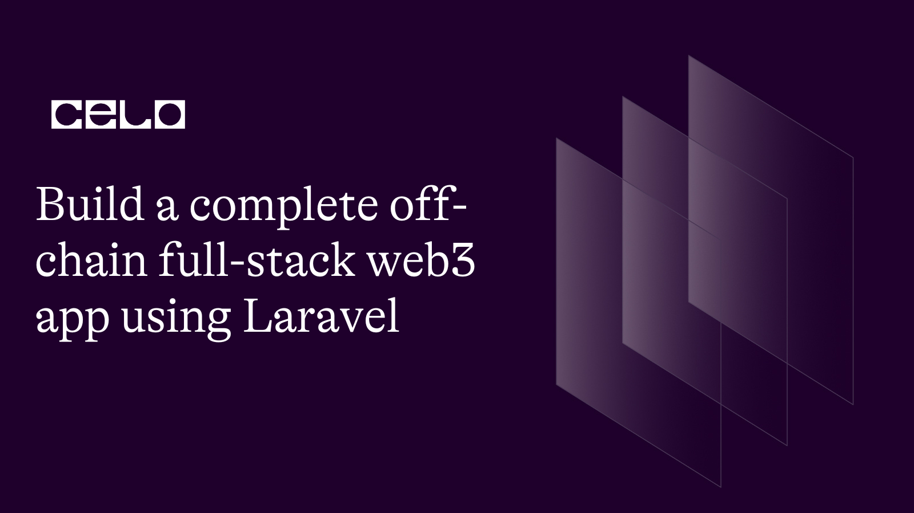
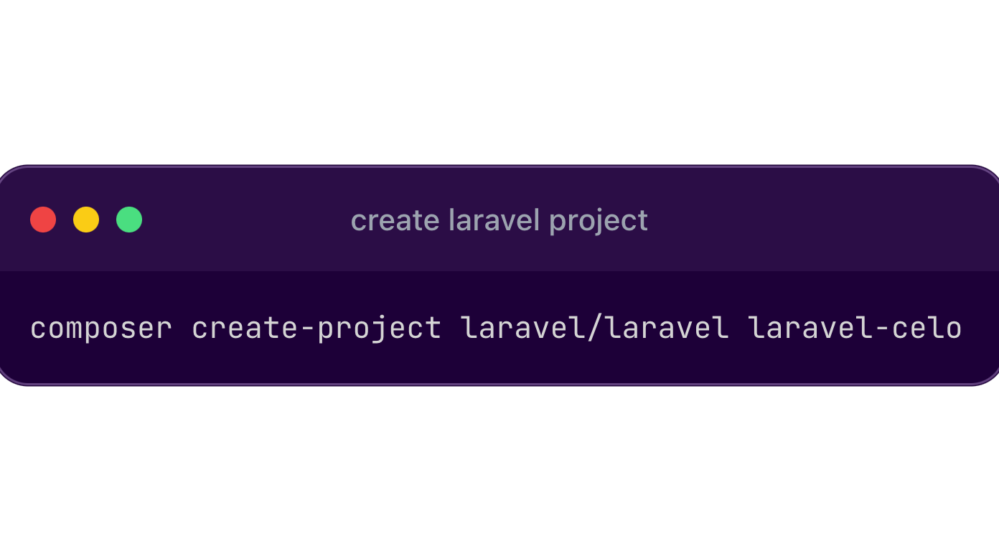
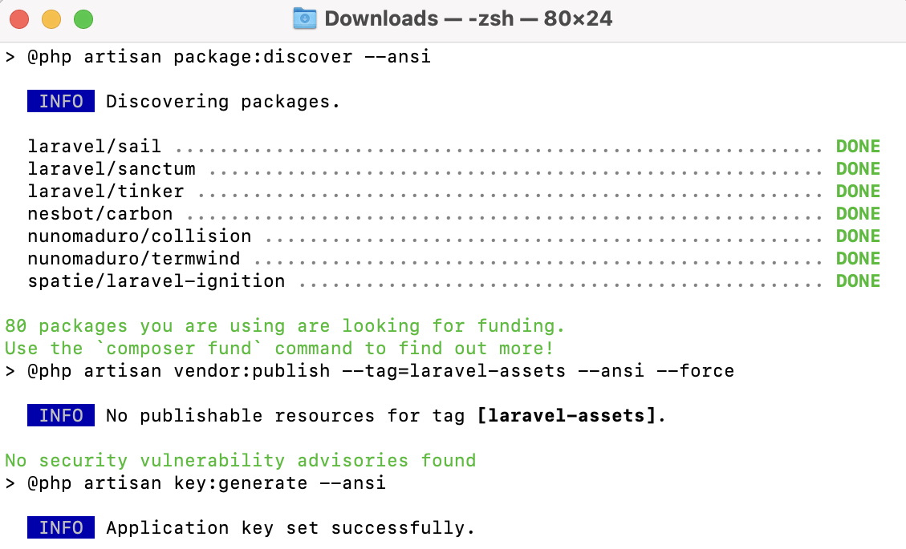
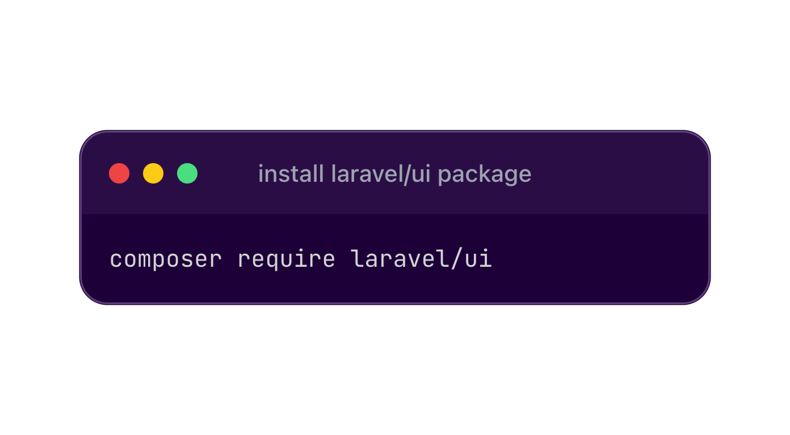
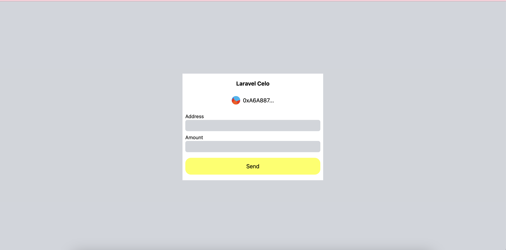

## Introduction

In this article, we will be discussing how to build an off-chain full-stack web3 app using SPA Laravel Monorepo together with Laravel UI ReactJs/VueJs together with Solidity. This tutorial is basically for PHP/Laravel developer that are trying to do something new in web3 space on Celo Network.

## Prerequisites

Basic knowledge of php, laravel, javascript and ReactJs


## Getting Started

To bootstrap our DAPP, we will be using Laravel & Laravel UI (React).

I assume that anyone going through this tutorial already understands and uses **Composer**, so I will skip the setup involved in getting **Composer** to work on your development computer. That means I assume you already have VS Code setup on your PC. If you are developing on macOS, PHP and Composer can be installed via [Homebrew](https://brew.sh/). In addition, we recommend [installing Node and NPM](https://nodejs.org/).

If you are entirely new to php development and never use **Composer** before, here ( [https://getcomposer.org/](https://getcomposer.org/) ) is a good place you can learn from.

To get started, you can clone this repository flutter-web3-celo.

**Composer** is a tool for dependency management in PHP. It allows you to declare the libraries your project depends on and it will manage (install/update) them for you.

### Create a Laravel Project

After installing PHP and Composer, use the Composer create-project command to create a new Laravel project:



```bash
composer create-project laravel/laravel laravel-celo
```

On successfully project created



### Configure Laravel UI

Laravel provides Bootstrap, React Vue scaffolding in the laravel/ui Composer package, which can be installed using Composer:



```bash
composer require laravel/ui
```

After installing the laravel/ui package, use the ui Artisan command to install the frontend scaffolding:

```bash
php artisan ui react
```

Before compiling your frontend, install dependencies using the NPM:

```bash
npm install && npm run dev
```

Open another terminal and serve your laravel application using the artisan command below

```bash
php artisan serve
```

Open your welcome.view.php file in your views folder inside resources folder, remove all code snippets in the file and replace them with the snippet below

```php
<!DOCTYPE html>
<html lang="{{ str_replace('_', '-', app()->getLocale()) }}">

<head>
    <meta charset="utf-8">
    <meta name="viewport" content="width=device-width, initial-scale=1">

    <title>Laravel</title>

    <!-- Fonts -->
    <link rel="preconnect" href="https://fonts.bunny.net">
    <link href="https://fonts.bunny.net/css?family=figtree:400,600&display=swap" rel="stylesheet" />

    <!-- Styles -->
    @vite('resources/css/app.css')
</head>

<body>
    <div class="" id="example"></div>
    <script>
        var global = window
        window.config = {
            API_URL: '{{ url('/') }}/api/v1',
            BASE_URL: '{{ url('/') }}',
            APP: 'production'
        }
    </script>
    <script type="module">
        import RefreshRuntime from "http://localhost:5173/@react-refresh"
        RefreshRuntime.injectIntoGlobalHook(window)
        window.$RefreshReg$ = () => {}
        window.$RefreshSig$ = () => (type) => type
        window.__vite_plugin_react_preamble_installed__ = true
    </script>
    @vite('resources/js/app.js')
</body>

</html>
```

Replace the port in **http://localhost:5173/@react-refresh** with the port your vite app is running in the other terminal

Then navigate to your laravel app using the giving server url in your console e.g [http://127.0.0.1:8000](http://127.0.0.1:8000)

### Configure Tailwindcss

To install and configure tailwindcss

```bash
npm install -D tailwindcss postcss autoprefixer
```

Init tailwindcss for the frontend project

```bash
npx tailwindcss init -p
```

Replace the code snippets in tailwind.config.js file with the snippet below

```javascript
/** @type {import('tailwindcss').Config} */
module.exports = {
  content: [
    "./resources/**/*.blade.php",
    "./resources/**/*.js",
    "./resources/**/*.jsx",
    "./resources/**/*.vue",
  ],
  theme: {
    extend: {},
  },
  plugins: [],
};
```

### Install some dependencies

Install dependencies below for easy integration celo in our laravel application

```dash
npm i @celo/contractkit @celo/react-celo @esbuild-plugins/node-globals-polyfill ethers react-jazzicon
```

You might likely encountered some issues due to process and some package been removed in vite, update your vite.config.js to look like the below code snippets

```javascript
import { defineConfig } from "vite";
import laravel from "laravel-vite-plugin";
import react from "@vitejs/plugin-react";
import { NodeGlobalsPolyfillPlugin } from "@esbuild-plugins/node-globals-polyfill";

export default defineConfig({
  optimizeDeps: {
    esbuildOptions: {
      define: {
        global: "globalThis",
      },
      plugins: [
        NodeGlobalsPolyfillPlugin({
          process: true,
          buffer: true,
        }),
      ],
    },
  },
  resolve: {
    alias: {
      assert: "assert",
      stream: "stream-browserify",
      https: "agent-base",
    },
  },
  plugins: [
    laravel({
      input: ["resources/sass/app.scss", "resources/js/app.js"],
      refresh: true,
    }),
    react(),
  ],
});
```

Identicon Component

```javascript
import Jazzicon from "react-jazzicon";
import { CSSProperties, PureComponent } from "react";
import { isValidAddress, normalizeAddress } from "../utils/address";

// This should match metamask: https://github.com/MetaMask/metamask-extension/blob/master/ui/helpers/utils/icon-factory.js#L84
function addressToSeed(address) {
  const addrStub = normalizeAddress(address).slice(2, 10);
  return parseInt(addrStub, 16);
}

export class Identicon extends PureComponent {
  render() {
    const { address, size: _size, styles } = this.props;
    const size = _size ?? 34;

    if (!isValidAddress(address)) return null;

    return <Jazzicon diameter={size} seed={addressToSeed(address)} />;
  }
}
```

utils/address.js

```javascript
import { getAddress, isAddress } from "@ethersproject/address";

export function isValidAddress(address) {
  // Need to catch because ethers' isAddress throws in some cases (bad checksum)
  try {
    const isValid = address && isAddress(address);
    return !!isValid;
  } catch (error) {
    return false;
  }
}

export function validateAddress(address, context) {
  if (!address || !isAddress(address)) {
    const errorMsg = `Invalid addresses for ${context}: ${address}`;

    throw new Error(errorMsg);
  }
}

export function normalizeAddress(address) {
  validateAddress(address, "normalize");
  return getAddress(address);
}

export function shortenAddress(address, elipsis, capitalize) {
  if (address == undefined) {
    return null;
  }
  validateAddress(address, "shorten");
  const shortened =
    normalizeAddress(address).substr(0, 8) + (elipsis ? "..." : "");
  return capitalize ? capitalizeAddress(shortened) : shortened;
}

export function capitalizeAddress(address) {
  return "0x" + address.substring(2).toUpperCase();
}

export function areAddressesEqual(a1, a2) {
  validateAddress(a1, "compare");
  validateAddress(a2, "compare");
  return getAddress(a1) === getAddress(a2);
}

export function trimLeading0x(input) {
  return input.startsWith("0x") ? input.substring(2) : input;
}

export function ensureLeading0x(input) {
  return input.startsWith("0x") ? input : `0x${input}`;
}
```

Then update your Example.jsx file with the code below

```javascript
import React from "react";
import ReactDOM from "react-dom/client";
import { Identicon } from "./Identicon";
import { shortenAddress } from "../utils/address";
import { CeloProvider, useCelo } from "@celo/react-celo";
import "@celo/react-celo/lib/styles.css";

function Example() {
  const { address, initialised, connect, disconnect, performActions } =
    useCelo();
  const [transferTo, setTransferTo] = React.useState("");
  const [transferAmount, setTransferAmount] = React.useState(0);

  async function transfer() {
    e.preventDefault();
    await performActions(async (kit) => {
      const cUSD = await kit.contracts.getStableToken();
      await cUSD.transfer(transferTo, transferAmount).sendAndWaitForReceipt();
    });
  }

  return (
    <CeloProvider
      dapp={{
        name: "Laravel Celo",
        description: "Laravel Celo Dapp",
        url: "https://example.com",
        // if you plan on supporting WalletConnect compatible wallets, you need to provide a project ID, you can find it here: https://docs.walletconnect.com/2.0/cloud/relay
        // walletConnectProjectId: "123",
      }}
    >
      <div className="bg-gray-300 min-h-screen w-full flex flex-col justify-center items-center">
        <div className="w-full max-w-[400px] m-auto">
          <div className="bg-white w-full px-2 py-4">
            <div className="flex flex-col">
              <h4 className="font-bold text-center">Laravel Celo</h4>
              {address != null && address != undefined ? (
                <>
                  <div className="flex items-center justify-center space-x-2 mt-6">
                    <Identicon size={24} address={address} />{" "}
                    <p>{shortenAddress(address, true, false)}</p>
                  </div>

                  <form className="flex flex-col" onSubmit={(e) => transfer(e)}>
                    <label className="mt-6 text-sm">Address</label>
                    <input
                      onChange={(e) => setTransferTo(e.target.value)}
                      type="text"
                      required
                      className="h-8 rounded-md bg-gray-300 focus:ring-0 ring-0 border-0 focus:border-0 focus:outline-none text-black px-2 py-1"
                    />
                    <label className="mt-2 text-sm">Amount</label>
                    <input
                      onChange={(e) => setTransferAmount(e.target.value)}
                      type="number"
                      required
                      className="h-8 rounded-md bg-gray-300 focus:ring-0 ring-0 border-0 focus:border-0 focus:outline-none text-black px-2 py-1"
                    />
                    <button className="mt-4 bg-[#FCFF51] text-black rounded-2xl py-3">
                      Send
                    </button>
                  </form>
                </>
              ) : (
                <>
                  <button
                    type="button"
                    onClick={() => connect()}
                    className="mt-4 bg-[#FCFF51] text-black rounded-2xl py-3"
                  >
                    Connect wallet
                  </button>
                </>
              )}
            </div>
          </div>
        </div>
      </div>
    </CeloProvider>
  );
}

export default Example;

if (document.getElementById("example")) {
  const Index = ReactDOM.createRoot(document.getElementById("example"));

  Index.render(
    <React.StrictMode>
      <Example />
    </React.StrictMode>
  );
}
```

Boom!!!



## Conclusion

Congratulations, you have now learned how to build a real-world dApp using Laravel. You have seen how to transfer token using @celo/react-celo.
About the Author

I am a Software Engineer, Tech Evangelist (Preaching the gospel of flutter & blockchain) also and Ex-GDSC Leads.

## References

- [Github Repo](https://github.com/Mujhtech/laravel-celo)
- [Larave Vite](https://laravel.com/docs/10.x/vite)
- [Celo Docs](https://docs.celo.org)
