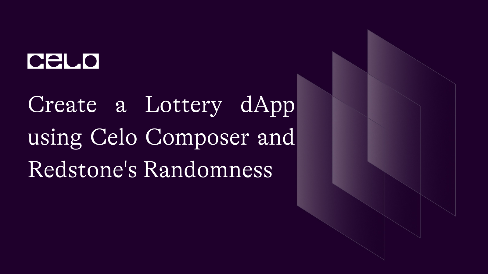
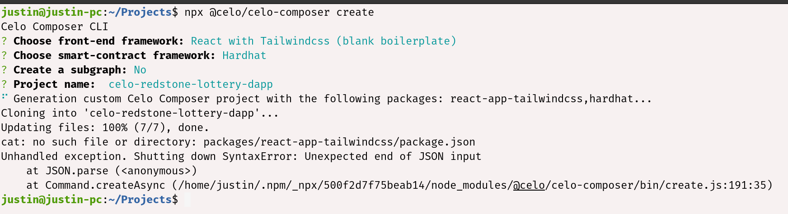
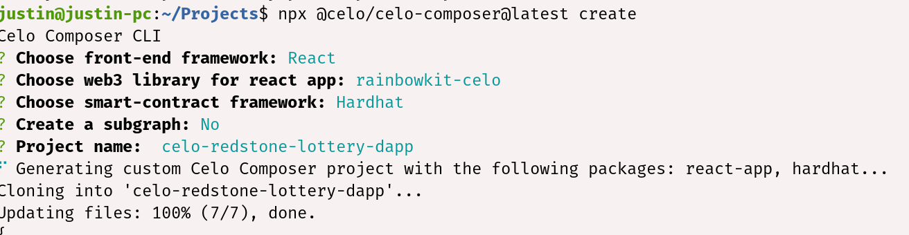

## Introduction

Lotteries often involve random number generation to select winning numbers or determine which participants win prizes. Solidity smart contracts can use randomness to ensure that lottery outcomes are fair and unbiased, hence the use of Redstone randomness, which allows for transparency in the implementation.

## Prerequisites

To successfully follow along in this tutorial, you need basic knowledge of the following:
HTML, CSS, and React
Blockchain, Solidity, and Hardhat

## Requirements​

- [Remix](https://remix.ethereum.org/) - Online editor for writing smart contracts or any code editor you choose.
- [Metamask](https://metamask.io/) - For managing our wallet.
- [Hardhat](https://hardhat.org/) - For compiling and deploying the smart contract
- [Alfajores Testnet Account](https://developers.celo.org/3-simple-steps-to-connect-your-metamask-wallet-to-celo-732d4a139587) - Required to connect to the dApp and make test transactions.
- [Node.js](https://nodejs.org/en/) - From V12. or higher

## Why Redstone Randomness

Redstone provides services that are used in dApps to provide external data to the smart contracts running on the blockchain. Since smart contracts are self-executing code that lives on the blockchain, they cannot access external data on their own. This is where oracle services like Redstone come in.

Amongst their many services, we are going to focus on Randomness. They provide entropy, which is a measure of the randomness of data, to smart contracts. The entropy is obtained from a source called https://drand.love/, which is a decentralized, publicly auditable randomness beacon.

## Smart Contract

```solidity
import "redstone-evm-connector/lib/contracts/message-based/PriceAwareOwnable.sol";
```

First, we start by importing the `PriceAwareOwnable` contract from `redstone-evm-connector`. The PriceAwareOwnable contract provides basic ownership functionality, and it also allows the contract to query off-chain data from the oracle.

```solidity
    struct LotteryStruct {
        uint256 id;
        string title;
        uint256 ticketPrice;
        uint256[] luckyNumbers;
        uint256[] selectedLuckyNumbers;
        uint256 participantCount;
        address winner;
        bool ended;
        address owner;
        uint256 createdAt;
        uint256 expiresAt;
    }
```

The `LotteryStruct` stores information about a specific lottery, such as its ID, title, ticket price, lucky numbers, selected lucky numbers, participant count, winner, whether it has ended, owner, creation time, and expiration time.

```solidity
    struct ParticipantStruct {
        address payable account;
        uint256 luckyNumber;
        bool paid;
    }
```

The `ParticipantStruct` stores information about a specific participant, such as their account address, lucky number, and a paid flag to indicate if they have been paid for winning in a case where the participant is selected as a winner.

```solidity
    mapping(uint256 => LotteryStruct) lotteries;
```

Creates a mapping that associates an unsigned integer (uint256) to a `LotteryStruct` object. This mapping allows you to store and retrieve `LotteryStruct` objects by their corresponding lottery ID.

```solidity
    mapping(uint256 => ParticipantStruct) lotteryParticipants;
```

Creates a similar mapping which allows you to store and retrieve `ParticipantStruct` objects by their lottery ID.

```solidity
    function createLottery( string memory title, uint256 ticketPrice, uint256 expiresAt ) public {

        require(bytes(title).length > 0, "Title can't be empty");
        require(ticketPrice > 0 ether, "Ticket Price cannot be zero");
        require( expiresAt > block.timestamp, "Expiration date cannot be less than the future" );

        uint256 randomness = random();
        uint256[] memory _luckyNumbers = new uint256[](10);
        uint256 maxValue = 1000;

        for (uint256 i = 0; i < 10; i++) {
            _luckyNumbers[i] = (uint256(keccak256(abi.encode(randomness, i))) % maxValue) + 1;
        }

        LotteryStruct memory lottery;

        lottery.id = totalLotteries;
        lottery.title = title;
        lottery.luckyNumbers = _luckyNumbers;
        lottery.ticketPrice = ticketPrice;
        lottery.owner = msg.sender;
        lottery.createdAt = block.timestamp;
        lottery.expiresAt = expiresAt;

        lotteries[lottery.id] = lottery;

        totalLotteries++;
    }
```

`createLottery` takes in three parameters: the title of the lottery, the ticket price, and the expiration date, and then checks that the title is not empty, the ticket price is greater than 0 `ether`, and the expiration date is in the future.

It then generates a random number using the `random()` function and uses it to generate an array of 10 lucky numbers. The lucky numbers are generated using a for loop that uses the `keccak256` hash function to generate a pseudo-random number based on the randomness and the index `i`. The `% maxValue` operation ensures that the resulting number is between 1 and 1000.
The function then creates a new `LotteryStruct` struct and assigns the relevant data to it: the ID, the title, the lucky numbers, the ticket price, the owner (i.e., the person who called the function), the creation date (i.e., the current block timestamp), and the expiration date.

Finally, the new lottery is added to the lotteries mapping and increments the `totalLotteries` variable.`

```solidity
    function enter(uint256 _id) public payable {
        LotteryStruct storage lottery = lotteries[_id];

        require(msg.sender != lottery.owner, "Owner can't participate");
        require(block.timestamp * 1000 >= lottery.expiresAt, "End time reached");
        require(msg.value >= lottery.ticketPrice, "insufficient payment");

        uint256 luckyNumber;
        uint256[] memory selectedLuckyNumbers = lottery.selectedLuckyNumbers;
        bool numberAlreadySelected;

        do {
            // generate a random index within the range of luckyNumbers array
            uint256 index = uint256( keccak256(abi.encodePacked(block.timestamp))) % lottery.luckyNumbers.length;

            luckyNumber = lottery.luckyNumbers[index];
            // check if the number has already been selected by the current participant
            numberAlreadySelected = false;
            for (uint256 i = 0; i < selectedLuckyNumbers.length; i++) {
                if (selectedLuckyNumbers[i] == luckyNumber) {
                    numberAlreadySelected = true;
                    break;
                }
            }
        } while (numberAlreadySelected);

        ParticipantStruct storage participant = lotteryParticipants[_id];
        participant.account = payable(msg.sender);
        participant.luckyNumber = luckyNumber;
        participant.paid = false;

        lottery.participantCount++;

        lottery.selectedLuckyNumbers.push(luckyNumber);
    }
```

This function allows a user to participate in the lottery by paying the ticket price and selecting a lucky number. The function generates a random lucky number that has not already been selected by the participant and stores the participant information in the lotteryParticipants mapping.

```solidity
    function pickWinner(uint256 _id) public {
        LotteryStruct storage lottery = lotteries[_id];
        uint256 totalLotteryAmount = lottery.ticketPrice * lottery.participantCount;

        uint256 winnerNumberIndex = uint256( keccak256(abi.encodePacked(block.timestamp)) ) %    lottery.selectedLuckyNumbers.length;

        lotteryParticipants[_id].account.transfer(totalLotteryAmount);
        lottery.winner = lotteryParticipants[_id].account;
        lottery.ended = true;
        emit Random(winnerNumberIndex);
    }
```

Here, we randomly select a winner from the list of selected lucky numbers and transfer the total lottery amount to their account. Finally we set the `ended` flag to `true` and emit a `Random` event with the `index` of the winning lucky number.

```solidity
    function getLottery(uint256 _id) public view returns (
            uint256 id,
            string memory title,
            uint256 ticketPrice,
            uint256[] memory luckyNumbers,
            uint256 participants,
            address winner,
            bool ended,
            address owner,
            uint256 createdAt,
            uint256 expiresAt
        )
    {
        LotteryStruct memory _lottery = lotteries[_id];

        return (
            _lottery.id,
            _lottery.title,
            _lottery.ticketPrice,
            _lottery.luckyNumbers,
            _lottery.participantCount,
            _lottery.winner,
            _lottery.ended,
            _lottery.owner,
            _lottery.createdAt,
            _lottery.expiresAt
        );
    }
```

function returns information about a specific lottery, such as its ID, title, ticket price, lucky numbers, participant count, winner, whether it has ended, owner, creation time, and expiration time.

```solidity
    function getParticipant(uint256 _id) public view returns (address account, uint256 luckyNumber, bool paid) {

        ParticipantStruct storage _participant = lotteryParticipants[_id];

        return (
            _participant.account,
            _participant.luckyNumber,
            _participant.paid
        );
    }
```

`getParticipant` is used to retrieve the data of a participant. It takes `_id` which is the ID of the participant in the `lotteryParticipants` mapping. The function then uses the `storage` keyword to create a reference to the `ParticipantStruct` stored at the \_id index in the `lotteryParticipants` mapping. This means that any modifications made to `_participant` will be reflected in the storage. The function then returns the account address of the participant, their lucky number, and a boolean indicating whether or not they are the selected winner or not.

```solidity
    function random() private view returns (uint256) {
        uint256 randomValue = getPriceFromMsg(bytes32("ENTROPY"));

        return
            uint256(
                keccak256(
                    abi.encodePacked(
                        randomValue,
                        block.timestamp / 1000,
                        blockhash(block.number - 1),
                        blockhash(block.number)
                    )
                )
            );
    }
```

The `random` function uses the `getPriceFromMsg` function from the `PriceAwareOwnable` contract to generate a random number based on the current block timestamp and block hashes.

```solidity
    function getLotteryCount() public view returns (uint256) {
        return totalLotteries;
    }
```

The `getLotteryCount` returns the total number of lotteries that have been created. This comes handy when getting all the lotteries.

The complete Solidity code looks like this:

```solidity
//SPDX-License-Identifier: Unlicense
pragma solidity ^0.8.0;

import "redstone-evm-connector/lib/contracts/message-based/PriceAwareOwnable.sol";

contract Lottery is PriceAwareOwnable {
    uint256 private totalLotteries = 0;

    struct LotteryStruct {
        uint256 id;
        string title;
        uint256 ticketPrice;
        uint256[] luckyNumbers;
        uint256[] selectedLuckyNumbers;
        uint256 participantCount;
        address winner;
        bool ended;
        address owner;
        uint256 createdAt;
        uint256 expiresAt;
    }

    struct ParticipantStruct {
        address payable account;
        uint256 luckyNumber;
        bool paid;
    }

    mapping(uint256 => LotteryStruct) lotteries;
    mapping(uint256 => ParticipantStruct) lotteryParticipants;

    event Random(uint256 rand);

    function createLottery( string memory title, uint256 ticketPrice, uint256 expiresAt ) public {

        require(bytes(title).length > 0, "Title can't be empty");
        require(ticketPrice > 0 ether, "Ticket Price cannot be zero");
        require( expiresAt > block.timestamp, "Expiration date cannot be less than the future" );

        uint256 randomness = random();
        uint256[] memory _luckyNumbers = new uint256[](10);
        uint256 maxValue = 1000;

        for (uint256 i = 0; i < 10; i++) {
            _luckyNumbers[i] = (uint256(keccak256(abi.encode(randomness, i))) % maxValue) + 1;
        }

        LotteryStruct memory lottery;

        lottery.id = totalLotteries;
        lottery.title = title;
        lottery.luckyNumbers = _luckyNumbers;
        lottery.ticketPrice = ticketPrice;
        lottery.owner = msg.sender;
        lottery.createdAt = block.timestamp;
        lottery.expiresAt = expiresAt;

        lotteries[lottery.id] = lottery;

        totalLotteries++;
    }

    function enter(uint256 _id) public payable {
        LotteryStruct storage lottery = lotteries[_id];

        require(msg.sender != lottery.owner, "Owner can't participate");
        require(block.timestamp * 1000 >= lottery.expiresAt, "End time reached");
        require(msg.value >= lottery.ticketPrice, "insufficient payment");

        uint256 luckyNumber;
        uint256[] memory selectedLuckyNumbers = lottery.selectedLuckyNumbers;
        bool numberAlreadySelected;

        do {
            // generate a random index within the range of luckyNumbers array
            uint256 index = uint256( keccak256(abi.encodePacked(block.timestamp))) % lottery.luckyNumbers.length;

            luckyNumber = lottery.luckyNumbers[index];
            // check if the number has already been selected by the current participant
            numberAlreadySelected = false;
            for (uint256 i = 0; i < selectedLuckyNumbers.length; i++) {
                if (selectedLuckyNumbers[i] == luckyNumber) {
                    numberAlreadySelected = true;
                    break;
                }
            }
        } while (numberAlreadySelected);

        ParticipantStruct storage participant = lotteryParticipants[_id];
        participant.account = payable(msg.sender);
        participant.luckyNumber = luckyNumber;
        participant.paid = false;

        lottery.participantCount++;

        lottery.selectedLuckyNumbers.push(luckyNumber);
    }

    function pickWinner(uint256 _id) public {
        LotteryStruct storage lottery = lotteries[_id];
        uint256 totalLotteryAmount = lottery.ticketPrice * lottery.participantCount;

        uint256 winnerNumberIndex = uint256( keccak256(abi.encodePacked(block.timestamp)) ) % lottery.selectedLuckyNumbers.length;

        lotteryParticipants[_id].account.transfer(totalLotteryAmount);
        lottery.winner = lotteryParticipants[_id].account;
        lottery.ended = true;
        emit Random(winnerNumberIndex);
    }

    function getLottery(uint256 _id) public view returns (
            uint256 id,
            string memory title,
            uint256 ticketPrice,
            uint256[] memory luckyNumbers,
            uint256 participants,
            address winner,
            bool ended,
            address owner,
            uint256 createdAt,
            uint256 expiresAt
        )
    {
        LotteryStruct memory _lottery = lotteries[_id];

        return (
            _lottery.id,
            _lottery.title,
            _lottery.ticketPrice,
            _lottery.luckyNumbers,
            _lottery.participantCount,
            _lottery.winner,
            _lottery.ended,
            _lottery.owner,
            _lottery.createdAt,
            _lottery.expiresAt
        );
    }

    function getParticipant(uint256 _id) public view returns (address account, uint256 luckyNumber, bool paid) {

        ParticipantStruct storage _participant = lotteryParticipants[_id];

        return (
            _participant.account,
            _participant.luckyNumber,
            _participant.paid
        );
    }

    function random() private view returns (uint256) {
        uint256 randomValue = getPriceFromMsg(bytes32("ENTROPY"));

        return
            uint256(
                keccak256(
                    abi.encodePacked(
                        randomValue,
                        block.timestamp / 1000,
                        blockhash(block.number - 1),
                        blockhash(block.number)
                    )
                )
            );
    }

    function getLotteryCount() public view returns (uint256) {
        return totalLotteries;
    }
}

```

## Celo Composer

Celo Composer provides an effortless way to integrate Celo blockchain with various widely-used front-end frameworks, including React, React Native, Flutter, and Angular, via CLI. It is particularly useful for web2 developers who are new to the Celo blockchain and looking for a simple way to get started.

You might encounter an error that looks like the below screenshot when you try to install `celo-composer` without the latest version.



If that is the case, use `npx @celo/celo-composer@latest create`. Select `React` for the front-end framework prompt, `Hardhat` for smart-contract framework. We don’t need a subgraph and finally enter your project name.

Your terminal should have a similar output like this below:



## Important files

There are five files I would like us to focus on in this dApp, the rest are typical Celo Composer directory structure and files. They are `LotteryCard.tsx` and `LotteryForm.tsx` in the component directory, `index.tsx` in the pages directory, helpers.js, and interact.js.
LotteryCard.tsx

```js
import { ethers } from "ethers";
import { timestampToDate, lotteryElapsed, truncate } from "../utils";
import { useAccount } from "wagmi";

interface LotteryCardProps {
  id: number;
  owner: string;
  title: string;
  price: number;
  participants: number;
  winner: address;
  endTime: number;
  ended: boolean;
  enterLotteryHandler: (id: number, price: number) => void;
  endLotteryHandler: (id: number) => void;
}

const LotteryCard: React.FC<LotteryCardProps> = ({
  id,
  owner,
  title,
  price,
  participants,
  winner,
  endTime,
  ended,
  enterLotteryHandler,
  endLotteryHandler,
}) => {
  const { address } = useAccount();

  return (
    <div className="bg-white rounded-lg shadow-lg p-4">
      <h2 className="mb-4 font-bold">
        {title} <br />
        <span className="font-light">
          {ethers.utils.formatEther(price)} CELO
        </span>
      </h2>
      <div className="flex justify-between">
        <div className="mr-4">
          <p>Participants</p>
          <span>{participants}</span>
        </div>
        <div>
          <p>End Date</p>
          <span>{timestampToDate(endTime.toNumber())}</span>
        </div>
      </div>
      <div>
        {!ended && !lotteryElapsed(endTime) && owner !== address && (
          <button
            onClick={() => enterLotteryHandler(id, price)}
            className="mt-3 bg-slate-300 w-28 rounded"
          >
            Buy
          </button>
        )}
        {!ended && lotteryElapsed(endTime) && (
          <button
            onClick={() => endLotteryHandler(id)}
            className="mt-3 bg-slate-300 w-28 rounded"
          >
            End Lottery {ended}
          </button>
        )}
        {ended && (
          <div>
            <button disabled className="mt-3 bg-slate-200 w-28 rounded">
              Lottery Ended
            </button>
            <br />
            <small>Winner: {truncate(winner)}</small>
          </div>
        )}
      </div>
    </div>
  );
};

export default LotteryCard;
```

LotteryCard component takes in several props, including the ID of the lottery, the address of the creator, the title of the lottery, the price of the ticket, the number of participants, the winner's address, the end time of the lottery, a boolean indicating whether the lottery has ended, and two handler functions for participating and ending the lottery.

Within the component, the `useAccount` hook from the `wagmi` package is used to get the current user's address. The component then displays the title of the lottery and the price of the ticket, as well as the number of participants and the end date of the lottery.

If the lottery has not ended, and the end time has not elapsed, a `Buy` button is displayed, which calls the `enterLotteryHandler` function when clicked. If the lottery has ended, an "End Lottery" button is displayed, which calls the `endLotteryHandler` function when clicked. If the lottery has already ended, a `Lottery Ended` button is displayed along with the winner's address.

## LotteryForm.tsx

```js
import { useState } from "react";
import { toTimestamp, createLottery } from "../utils";

const LotteryForm = () => {
  const [loading, setLoading] = useState(false);
  const [title, setTitle] = useState("");
  const [ticketPrice, setTicketPrice] = useState("");
  const [endTime, setEndTime] = useState("");

  const createLotteryHandler = async () => {
    setLoading(true);
    await createLottery(title, ticketPrice, endTime);
    setLoading(false);
    window.location.reload();
  };

  return (
    <div>
      <h1 className="m-2  text-2xl">Lottery Dapp</h1>
      <form className="flex justify-between">
        <div className="flex items-center space-x-2">
          <label htmlFor="title" className="sr-only">
            Lottery Title
          </label>
          <input
            onChange={(e) => setTitle(e.target.value)}
            type="text"
            name="item-name"
            id="title"
            placeholder="Title"
            className="w-40 px-4 py-2 border border-gray-300 rounded-md focus:outline-none focus:ring-2 focus:ring-blue-500"
          />
        </div>
        <div className="flex items-center space-x-2">
          <label htmlFor="item-price" className="sr-only">
            Ticket Price
          </label>
          <input
            onChange={(e) => setTicketPrice(e.target.value)}
            type="number"
            name="item-price"
            id="item-price"
            placeholder="Item Price"
            className="w-24 px-4 py-2 border border-gray-300 rounded-md focus:outline-none focus:ring-2 focus:ring-blue-500"
          />
        </div>
        <div className="flex items-center space-x-2">
          <label htmlFor="datetime" className="sr-only">
            End Time
          </label>
          <input
            onChange={(e) => setEndTime(toTimestamp(e.target.value))}
            type="datetime-local"
            name="datetime"
            id="datetime"
            placeholder="Datetime"
            className="w-40 px-4 py-2 border border-gray-300 rounded-md focus:outline-none focus:ring-2 focus:ring-blue-500"
          />
        </div>
        <button
          onClick={createLotteryHandler}
          type="button"
          className="ml-2 inline-flex items-center px-4 py-2 bg-blue-500 border border-transparent rounded-md font-semibold text-white hover:bg-blue-700 focus:outline-none focus:ring-2 focus:ring-blue-500 focus:ring-offset-2"
        >
          {loading ? "Creating ..." : "Create Lottery"}
        </button>
      </form>
    </div>
  );
};

export default LotteryForm;
```

The component imports the `useState` hook from the React library and the `toTimestamp` and `createLottery` functions from the ../utils module.

We have four pieces of state, which are `loading`, `title`, `ticketPrice`, and endTime`. The`loading`state is a boolean that is used to indicate if the form is currently being submitted. The`title`,`ticketPrice`, and`endTime` states are all used to store the values of their respective input fields.

The component returns a form with three input fields and a button. The first input field is for the lottery title, the second input field is for the ticket price, and the third input field is for the end time of the lottery. The `toTimestamp` function is used to convert the end time input value to a Unix timestamp. The button is used to submit the form and create a new lottery. When the button is clicked, the `createLotteryHandler` function is called. This function sets the loading state to true, calls the `createLottery` function with the form values, and then sets the loading state to false. Finally, the page is reloaded to display the newly created lottery.

## index.tsx

```js
import { useEffect, useState } from "react";
import { getLotteries, enter, endLottery } from "../utils";
import LotteryCard from "../components/LotteryCard";
import LotteryForm from "../components/LotteryForm";

const Home = () => {
  const [lotteries, setLotteries] = useState(undefined);

  const getLotteryHandler = async () => {
    const res = await getLotteries();
    setLotteries(res);
  };

  const enterLotteryHandler = async (id, price) => {
    await enter(id, price);
    getLotteryHandler();
  };

  const endLotteryHandler = async (id) => {
    await endLottery(id);
    getLotteryHandler();
  };

  useEffect(() => {
    getLotteryHandler();
  }, [getLotteries]);

  return (
    <div className="item-list">
      <LotteryForm updateList={getLotteryHandler} />

      <div className="grid grid-cols-3 gap-4 mt-10">
        {lotteries &&
          lotteries.map((lottery) => (
            <LotteryCard
              key={lottery.id}
              id={lottery.id}
              owner={lottery.owner}
              title={lottery.title}
              price={lottery.ticketPrice}
              participants={lottery.participants.toNumber()}
              winner={lottery.winner}
              endTime={lottery.expiresAt}
              ended={lottery.ended}
              enterLotteryHandler={enterLotteryHandler}
              endLotteryHandler={endLotteryHandler}
            />
          ))}
      </div>
    </div>
  );
};

export default Home;
```

LotteryForm component contains a form to create a new lottery with a title, ticket price, and end time. The Home component is the main component that displays the list of lotteries and allows users to enter lotteries, end lotteries, and create new lotteries.

The `useState` hook is used to manage the state of the lotteries and the loading state of the form submission. The `useEffect` hook is used to fetch the list of lotteries when the component mounts.

`getLotteryHandler` function fetches the list of lotteries using the `getLotteries` function from the `utils` module and sets the state of lotteries.

The `enterLotteryHandler` function is used to enter a user into a lottery using the enter function from the `utils` module. It then calls `getLotteryHandler` to update the list of lotteries.

The `endLotteryHandler` function is used to end a lottery using the `endLottery` function from the `utils` module. It then calls `getLotteryHandler` to update the list of lotteries.

Home component renders the `LotteryForm` component and a list of `LotteryCard` components for each lottery in the lotteries array. Each `LotteryCard` component displays information about the lottery and allows users to enter the lottery or end it (if the user is the owner of the lottery).

## helpers.js

This file contains a set of utility functions.

`truncate`: This function takes a string as input and truncates it to a length of 10 characters, replacing the characters in the middle with an ellipsis.

`toTimestamp`: This function takes a date string as input and converts it to a Unix timestamp (the number of seconds since January 1, 1970).

`timestampToDate`: This function takes a Unix timestamp as input and converts it to a human-readable date string in the format "DD/MM/YYYY HH:MM".

`priceToWei`: This function takes a price (in a non-Wei unit, such as Ether) as input and converts it to Wei, which is the smallest unit of Ether.

`lotteryElapsed`: This function takes a Unix timestamp as input and checks if the current time (in Unix timestamp format) is later than the input timestamp. If it is, it returns true, indicating that the lottery has elapsed; otherwise, it returns false.

## interact.js

This file imports the `ethers` and `Contract` modules from the `ethers` package, the `WrapperBuilder` module from the `redstone-evm-connector` package. The `priceToWei` function from another file is also imported and used to convert a non-Wei price to Wei. The contractAddress variable is the address of the smart contract we got when we deployed our smart contract.

## Conclusion

Congratulations! You should be able to create a dApp that involves use of random numbers by utilizing Redstone oracle and Celo Composer speedily. [Here](https://github.com/cjustinobi/celo-redstone-lottery) is the link to the complete code.

## About the Author​

A software engineer, co-founder, Africinnovate, and a Web3 enthusiast. I used to call myself VueDetective. Connect with me on [LinkedIn](https://linkedin.com/in/cjustinobi) and [Github](https://github.com/cjustinobi)

## References​

- [How to use Redstone Randomness](https://docs.redstone.finance/docs/smart-contract-devs/randomness)
