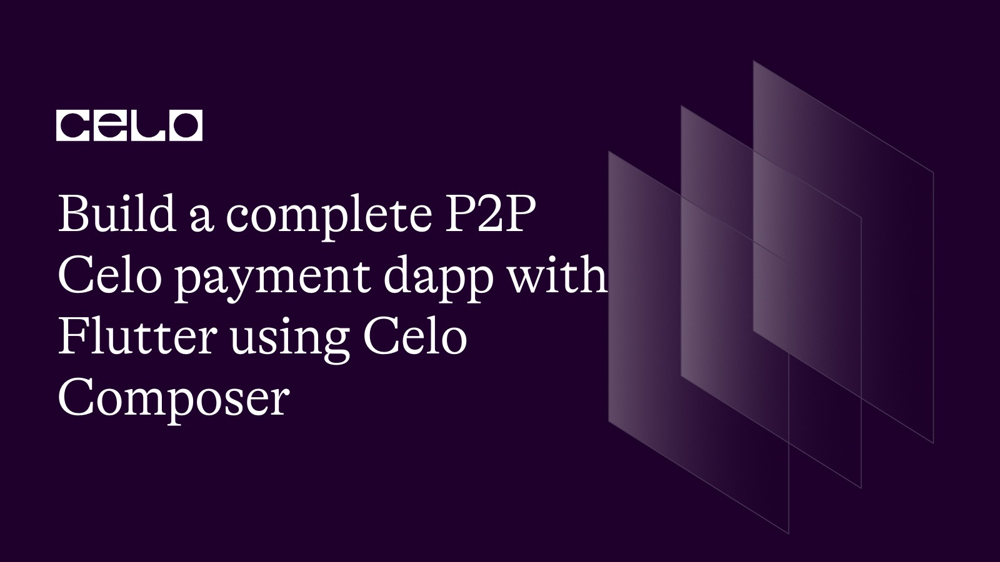
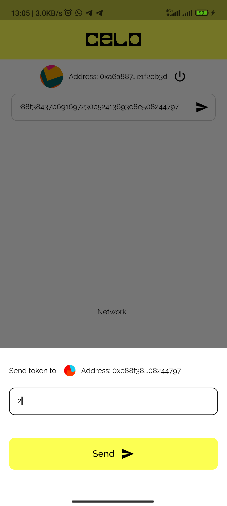
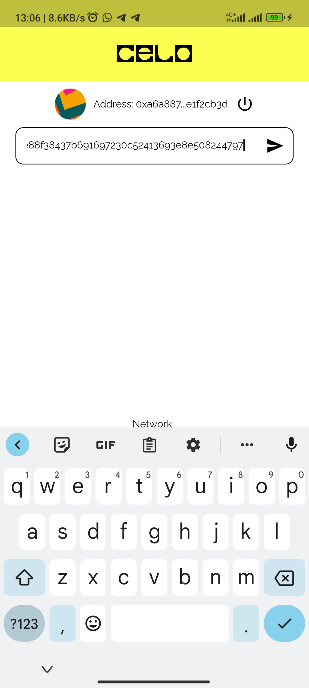

## Introduction

In this tutorial, I will be explaining on how to build a CELO based p2p payment dApp where user can send funds to each other on CELO network with QR code with Flutter using Celo Composer for bootstrap.


## Prerequisites

First, This tutorial assumes that you are already familiar with solidity and understand how smart contracts work and also assumes that you already know the basics of using Flutter or you can please clone the [flutter p2p celo](https://github.com/Mujhtech/flutter_p2p_celo). You'll also want to make sure you've installed the MetaMask Mobile App and have a MetaMask account. If you'd like, see our prior tutorial Setting Up Your Wallet for more details on this.

For this project we'll be using a few interesting dependencies & dev dependencies:

- [qr_flutter](https://pub.dev/packages/qr_flutter)
- [qr_code_scanner](https://pub.dev/packages/qr_code_scanner)
- [jazzicon](https://pub.dev/packages/jazzicon/example)

We'll walk you through each one as we go and show you how to use them in combination to write some awesome dapps.

## Getting Started

I assume that anyone going through this tutorial already understands and uses Flutter, so I will skip the setup involved in getting Flutter to work on your development computer. That means I assume you already have VS Code/Android Studio together with Android SDK and Flutter setup on your PC.

- If you are entirely new to Flutter, here [https://docs.flutter.dev/get-started/install](https://docs.flutter.dev/get-started/install) is a good tutorial you can learn from.

To get started, you can clone this repository flutter-web3-celo or make use of Celo Composer.

Celo Composer is a set of tools and starter templates that makes it easy for you to start your Celo-based web3 projects.

You can check out Celo Composer here [https://github.com/celo-org/celo-composer/tree/main/packages/flutter-app](https://github.com/celo-org/celo-composer/tree/main/packages/flutter-app).

### Using Celo Composer

To start our Flutter App Project, we will use the Celo Composer CLI; the CLI makes it easy for us to select the options that we want when bootstrapping our dApp. In other to do that you need to have Node set up on your PC and you can visit Node to get started. Run this on your terminal after setup Node.

```bash
npx @celo/celo-composer create
```

Choose Flutter when asked for the framework

Your Project will now be created; you can check to make sure it has the following folders

packages/flutter-app - Your Flutter project

### Manage Environmental variable

Create a .env file at the root of your project inside flutter-app folder in packages and add the follow variable

```env
ETHEREUM_RPC=https://alfajores-forno.celo-testnet.org
```

### Add dependencies

You can add the dependencies mentioned above in the prerequisites manually in the pubspec.yaml file or use the command line below

```bash
flutter pub add qr_flutter qr_code_scanner jazzicon
```

### Update main.dart file

Since we don’t need greetContract and web3cubit, you can remove them and your main.dart file should look like this below

```dart
import 'package:flutter/material.dart';
import 'package:flutter/services.dart';
import 'package:flutter_bloc/flutter_bloc.dart';
import 'package:flutter_celo_composer/configs/themes.dart';
import 'package:flutter_celo_composer/configs/web3_config.dart';
import 'package:flutter_celo_composer/infrastructures/repository/secure_storage_repository.dart';
import 'package:flutter_celo_composer/infrastructures/service/cubit/secure_storage_cubit.dart';
import 'package:flutter_celo_composer/module/auth/interfaces/screens/authentication_screen.dart';
import 'package:flutter_celo_composer/module/auth/service/cubit/auth_cubit.dart';
import 'package:flutter_dotenv/flutter_dotenv.dart';
import 'package:walletconnect_dart/walletconnect_dart.dart';
import 'package:web3dart/web3dart.dart';

Future<void> main() async {
  /// Load env file
  await dotenv.load();

  runApp(
    MyApp(
      walletConnect: await walletConnect,
      web3client: web3Client,
    ),
  );
}

class MyApp extends StatelessWidget {
  const MyApp({
    required this.walletConnect,
    required this.web3client,
    Key? key,
  }) : super(key: key);
  final WalletConnect walletConnect;

  final Web3Client web3client;

  @override
  Widget build(BuildContext context) {
    return MultiBlocProvider(
      providers: <BlocProvider<dynamic>>[
        BlocProvider<AuthCubit>(
          create: (BuildContext context) => AuthCubit(
            storage: SecureStorageRepository(),
            connector: walletConnect,
          ),
        ),
        BlocProvider<SecureStorageCubit>(
          create: (BuildContext context) => SecureStorageCubit(
            storage: SecureStorageRepository(),
          ),
        ),
      ],
      child: MaterialApp(
        title: 'Sophon',
        debugShowCheckedModeBanner: false,
        theme: buildDefaultTheme(context),
        home: const MyHomePage(),
      ),
    );
  }
}

class MyHomePage extends StatefulWidget {
  const MyHomePage({Key? key}) : super(key: key);

  @override
  State<MyHomePage> createState() => _MyHomePageState();
}

class _MyHomePageState extends State<MyHomePage> {
  @override
  Widget build(BuildContext context) {
    /// Lock app to portrait mode
    SystemChrome.setPreferredOrientations(<DeviceOrientation>[
      DeviceOrientation.portraitUp,
      DeviceOrientation.portraitDown,
    ]);
    return const AuthenticationScreen();
  }
}
```

### Update home_screen.dart file

Update the home screen file to carry the new changes.

```dart
import 'package:flutter/material.dart';
import 'package:flutter_bloc/flutter_bloc.dart';
import 'package:flutter_celo_composer/module/auth/interfaces/screens/authentication_screen.dart';
import 'package:flutter_celo_composer/module/auth/service/cubit/auth_cubit.dart';
import 'package:flutter_celo_composer/module/home/interfaces/widgets/send_bottomsheet.dart';
import 'package:jazzicon/jazzicon.dart';
import 'package:jazzicon/jazziconshape.dart';
import 'package:walletconnect_dart/walletconnect_dart.dart';

class HomeScreen extends StatefulWidget {
  const HomeScreen({
    required this.session,
    required this.connector,
    required this.uri,
    Key? key,
  }) : super(key: key);

  final dynamic session;
  final WalletConnect connector;
  final String uri;

  @override
  State<HomeScreen> createState() => _HomeScreenState();
}

class _HomeScreenState extends State<HomeScreen> {
  String accountAddress = '';
  String networkName = '';
  TextEditingController addressTextController = TextEditingController();
  final GlobalKey<FormState> formKey = GlobalKey<FormState>();

  JazziconData? jazz;

  ButtonStyle buttonStyle = ButtonStyle(
    elevation: MaterialStateProperty.all(0),
    backgroundColor: MaterialStateProperty.all(
      Colors.white.withAlpha(60),
    ),
    shape: MaterialStateProperty.all(
      RoundedRectangleBorder(borderRadius: BorderRadius.circular(25)),
    ),
  );

  // void updateGreeting() {
  //   launchUrlString(widget.uri, mode: LaunchMode.externalApplication);

  //   context.read<Web3Cubit>().updateGreeting(greetingTextController.text);
  //   greetingTextController.text = '';
  // }

  @override
  void initState() {
    super.initState();

    /// Execute after frame is rendered to get the emit state of InitializeProviderSuccess
    WidgetsBinding.instance.addPostFrameCallback((_) {
      accountAddress = widget.connector.session.accounts[0];
      jazz = Jazzicon.getJazziconData(40,
          address: widget.connector.session.accounts[0]);

      setState(() {});
    });
  }

  @override
  Widget build(BuildContext context) {
    final ThemeData theme = Theme.of(context);
    final double width = MediaQuery.of(context).size.width;
    final double height = MediaQuery.of(context).size.height;

    return BlocListener<AuthCubit, AuthState>(
      listener: (BuildContext context, AuthState state) {
        if (state is SessionDisconnected) {
          Future<void>.delayed(const Duration(seconds: 2), () {
            Navigator.of(context).pushReplacement(
              MaterialPageRoute<void>(
                builder: (BuildContext context) => const AuthenticationScreen(),
              ),
            );
          });
        }
      },
      child: Scaffold(
        appBar: AppBar(
          backgroundColor: const Color(0xFFFCFF52),
          elevation: 0,
          // ignore: use_decorated_box

          toolbarHeight: 0,
          automaticallyImplyLeading: false,
        ),
        backgroundColor: Colors.white,
        resizeToAvoidBottomInset: false,
        body: Form(
          key: formKey,
          child: SafeArea(
            child: Column(
              children: <Widget>[
                Container(
                  width: double.infinity,
                  height: 70,
                  color: const Color(0xFFFCFF52),
                  child: Padding(
                    padding: const EdgeInsets.all(24.0),
                    child: Image.asset(
                      'assets/images/logo.png',
                      width: 16,
                    ),
                  ),
                ),
                const SizedBox(
                  height: 10,
                ),
                Column(
                  crossAxisAlignment: CrossAxisAlignment.start,
                  children: <Widget>[
                    Row(
                      crossAxisAlignment: CrossAxisAlignment.center,
                      mainAxisAlignment: MainAxisAlignment.center,
                      children: <Widget>[
                        if (jazz != null) ...<Widget>[
                          Jazzicon.getIconWidget(jazz!),
                          const SizedBox(
                            width: 10,
                          ),
                        ],
                        Text(
                          'Address: ${accountAddress.substring(0, 8)}...${accountAddress.substring(accountAddress.length - 8, accountAddress.length)}',
                          style: theme.textTheme.titleMedium!.copyWith(
                            color: Colors.black,
                          ),
                        ),
                        const SizedBox(
                          width: 10,
                        ),
                        GestureDetector(
                          onTap: () {},
                          child: const Icon(Icons.power_settings_new,
                              color: Colors.black),
                        )
                      ],
                    ),
                    const SizedBox(
                      height: 10,
                    ),
                    Padding(
                      padding: const EdgeInsets.symmetric(horizontal: 20),
                      child: TextFormField(
                        controller: addressTextController,
                        validator: (String? value) {
                          if (value == null || value.isEmpty) {
                            return 'Field is required';
                          }

                          return null;
                        },
                        cursorColor: Colors.black,
                        style: theme.textTheme.titleMedium!.copyWith(
                          color: Colors.black,
                        ),
                        decoration: InputDecoration(
                          contentPadding: const EdgeInsets.symmetric(
                              horizontal: 15, vertical: 10),

                          enabledBorder: OutlineInputBorder(
                              borderSide: BorderSide(
                                  color: Colors.black.withOpacity(0.2),
                                  width: 1),
                              borderRadius:
                                  const BorderRadius.all(Radius.circular(10))),
                          focusedBorder: const OutlineInputBorder(
                              borderSide:
                                  BorderSide(color: Colors.black, width: 1),
                              borderRadius:
                                  BorderRadius.all(Radius.circular(10))),
                          focusedErrorBorder: const OutlineInputBorder(
                              borderSide:
                                  BorderSide(color: Colors.black, width: 1),
                              borderRadius:
                                  BorderRadius.all(Radius.circular(10))),
                          hintText: 'Send to wallet address',
                          hintStyle: Theme.of(context)
                              .textTheme
                              .titleMedium!
                              .copyWith(color: Colors.black),
                          errorBorder: const OutlineInputBorder(
                              borderSide:
                                  BorderSide(color: Colors.black, width: 1),
                              borderRadius:
                                  BorderRadius.all(Radius.circular(10))),
                          errorStyle: Theme.of(context)
                              .textTheme
                              .titleMedium!
                              .copyWith(
                                  fontWeight: FontWeight.normal,
                                  fontStyle: FontStyle.italic,
                                  color: Colors.red),
                          suffixIcon: GestureDetector(
                            onTap: () {
                              if (!formKey.currentState!.validate()) {
                                return;
                              }

                              // ignore: inference_failure_on_function_invocation
                              showModalBottomSheet(
                                  context: context,
                                  shape: const RoundedRectangleBorder(
                                    borderRadius: BorderRadius.only(
                                        topLeft: Radius.circular(20),
                                        topRight: Radius.circular(20)),
                                  ),
                                  constraints:
                                      BoxConstraints(maxHeight: height * 0.3),
                                  builder: (BuildContext builder) {
                                    // final Wallet wallet;
                                    return SendBottomSheet(
                                        connector: widget.connector,
                                        session: widget.session,
                                        address:
                                            addressTextController.text.trim());
                                  });
                            },
                            child: const Icon(
                              Icons.send,
                              color: Colors.black,
                            ),
                          ),
                          // prefixIcon: prefixIcon,
                        ),
                      ),
                    )
                  ],
                ),
                Expanded(
                  child: Column(
                    mainAxisAlignment: MainAxisAlignment.center,
                    children: <Widget>[
                      // conditionally print the address
                      if (accountAddress.isNotEmpty) const SizedBox(height: 10),
                      Text(
                        'Network: $networkName',
                        style: theme.textTheme.titleMedium!.copyWith(
                          color: Colors.black,
                        ),
                      ),
                    ],
                  ),
                )
              ],
            ),
          ),
        ),
      ),
    );
  }
}
```

Lastly, create a folder named widgets inside home/interfaces/ folder then create send_bottomsheet.dart file and update the file with the code below

```dart
import 'package:flutter/material.dart';
import 'package:flutter_celo_composer/configs/web3_config.dart';
import 'package:flutter_celo_composer/internal/ethereum_credentials.dart';
import 'package:jazzicon/jazzicon.dart';
import 'package:jazzicon/jazziconshape.dart';
import 'package:walletconnect_dart/walletconnect_dart.dart';
import 'package:web3dart/web3dart.dart';

class SendBottomSheet extends StatefulWidget {
  const SendBottomSheet({
    required this.address,
    required this.connector,
    required this.session,
    Key? key,
  }) : super(key: key);
  final String address;
  final WalletConnect connector;
  final SessionStatus session;

  @override
  State<SendBottomSheet> createState() => _SendBottomSheetState();
}

class _SendBottomSheetState extends State<SendBottomSheet> {
  JazziconData? jazz;
  TextEditingController amountTextController = TextEditingController();
  final GlobalKey<FormState> formKey = GlobalKey<FormState>();
  bool sending = false;

  @override
  void initState() {
    super.initState();

    /// Execute after frame is rendered to get the emit state of InitializeProviderSuccess
    WidgetsBinding.instance.addPostFrameCallback((_) {
      jazz = Jazzicon.getJazziconData(40, address: widget.address);

      setState(() {});
    });
  }

  @override
  Widget build(BuildContext context) {
    return Form(
      key: formKey,
      child: Container(
        color: Colors.white,
        padding: const EdgeInsets.only(left: 16, right: 16, top: 30),
        child: Column(children: [
          Row(
            mainAxisAlignment: MainAxisAlignment.spaceBetween,
            children: <Widget>[
              Row(
                children: <Widget>[
                  Text(
                    'Send token to ',
                    style: Theme.of(context).textTheme.titleMedium!.copyWith(
                          color: Colors.black,
                        ),
                  ),
                  const SizedBox(
                    width: 10,
                  ),
                  if (jazz != null) ...<Widget>[
                    Jazzicon.getIconWidget(jazz!, size: 20),
                    const SizedBox(
                      width: 10,
                    ),
                  ],
                  Text(
                    'Address: ${widget.address.substring(0, 8)}...${widget.address.substring(widget.address.length - 8, widget.address.length)}',
                    style: Theme.of(context).textTheme.titleMedium!.copyWith(
                          color: Colors.black,
                        ),
                  ),
                ],
              ),
            ],
          ),
          const SizedBox(
            height: 20,
          ),
          TextFormField(
            controller: amountTextController,
            validator: (String? value) {
              if (value == null || value.isEmpty) {
                return 'Field is required';
              }

              return null;
            },
            cursorColor: Colors.black,
            style: Theme.of(context).textTheme.titleMedium!.copyWith(
                  color: Colors.black,
                ),
            decoration: InputDecoration(
              contentPadding:
                  const EdgeInsets.symmetric(horizontal: 15, vertical: 10),

              enabledBorder: OutlineInputBorder(
                  borderSide: BorderSide(
                      color: Colors.black.withOpacity(0.2), width: 1),
                  borderRadius: const BorderRadius.all(Radius.circular(10))),
              focusedBorder: const OutlineInputBorder(
                  borderSide: BorderSide(color: Colors.black, width: 1),
                  borderRadius: BorderRadius.all(Radius.circular(10))),
              focusedErrorBorder: const OutlineInputBorder(
                  borderSide: BorderSide(color: Colors.black, width: 1),
                  borderRadius: BorderRadius.all(Radius.circular(10))),
              hintText: 'Amount to send',
              hintStyle: Theme.of(context)
                  .textTheme
                  .titleMedium!
                  .copyWith(color: Colors.black),
              errorBorder: const OutlineInputBorder(
                  borderSide: BorderSide(color: Colors.black, width: 1),
                  borderRadius: BorderRadius.all(Radius.circular(10))),
              errorStyle: Theme.of(context).textTheme.titleMedium!.copyWith(
                  fontWeight: FontWeight.normal,
                  fontStyle: FontStyle.italic,
                  color: Colors.red),

              // prefixIcon: prefixIcon,
            ),
          ),
          const SizedBox(
            height: 40,
          ),
          MaterialButton(
            hoverElevation: 0,
            elevation: 0,
            onPressed: () async {
              if (sending) {
                return;
              }
              try {
                sending = true;
                setState(() {});
                final sender = widget.connector.session.accounts[0];
                final provider =
                    EthereumWalletConnectProvider(widget.connector);
                final wcCredentials =
                    WalletConnectEthereumCredentials(provider: provider);

                final String txnHash = await web3Client.sendTransaction(
                  wcCredentials,
                  Transaction(
                      from: EthereumAddress.fromHex(sender),
                      to: EthereumAddress.fromHex(widget.address),
                      value: EtherAmount.inWei(BigInt.from(
                          int.parse(amountTextController.text.trim())))),
                  chainId: widget.session.chainId,
                );

                ScaffoldMessenger.of(context).showSnackBar(
                  const SnackBar(
                    content: Text('Transaction sent successfully'),
                    backgroundColor: Colors.red,
                  ),
                );

                sending = false;
                setState(() {});
                Navigator.pop(context);
              } catch (e) {
                //
                sending = false;
                setState(() {});
                ScaffoldMessenger.of(context).showSnackBar(
                  const SnackBar(
                    content: Text('Transaction failed, try again'),
                    backgroundColor: Colors.red,
                  ),
                );
              }
            },
            color: const Color(0xFFFCFF52),
            shape: RoundedRectangleBorder(
                borderRadius: BorderRadius.circular(10),
                side: const BorderSide(
                    color: Color(0xFFFCFF52),
                    width: 1,
                    style: BorderStyle.solid)),
            child: Container(
                height: 56,
                alignment: Alignment.center,
                child: Row(
                  crossAxisAlignment: CrossAxisAlignment.center,
                  mainAxisAlignment: MainAxisAlignment.center,
                  children: <Widget>[
                    Text(sending ? 'Please wait' : 'Send',
                        style: Theme.of(context)
                            .textTheme
                            .titleLarge!
                            .copyWith(color: Colors.black)),
                    if (!sending) ...<Widget>[
                      const SizedBox(
                        width: 10,
                      ),
                      const Icon(
                        Icons.send,
                        color: Colors.black,
                      )
                    ] else ...<Widget>[
                      const SizedBox(
                        width: 10,
                      ),
                      const Center(
                        child: SizedBox(
                            height: 10,
                            width: 10,
                            child: CircularProgressIndicator(
                              strokeWidth: 2,
                              valueColor:
                                  AlwaysStoppedAnimation<Color>(Colors.black),
                            )),
                      )
                    ]
                  ],
                )),
          )
        ]),
      ),
    );
  }
}
```




## Conclusion

Congratulations, you have now learned how to build a payment dApp using Celo Composer. You have seen how to connect with a blockchain wallet and send token to Celo blockchain.

## About the Author

I am a Software Engineer, Tech Evangelist (Preaching the gospel of flutter & blockchain) also and Ex-GDSC Leads.

## References

- Source Code [https://github.com/Mujhtech/flutter_p2p_celo](https://github.com/Mujhtech/flutter_p2p_celo)
- Celo Composer [https://github.com/celo-org/celo-composer](https://github.com/celo-org/celo-composer)
- Flutter [https://flutter.dev](https://flutter.dev)
- Solidity by example [https://solidity-by-example.org/](https://solidity-by-example.org/)
