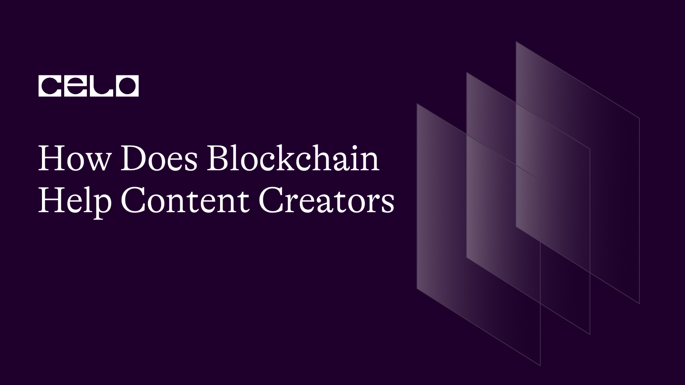

## Introduction

The potential applications of blockchain technology in our daily lives are numerous. in particular, content Creators who are eager to use blockchain technology to safeguard their intellectual property, monetize their work, and establish direct communication with their audiences.

We examine the new potential that the Celo blockchain is presenting to content creators in this series. This series will give you insightful knowledge on the nexus between content creation and blockchain technology, regardless of whether you are an experienced blockchain enthusiast or a newcomer to the field as a content creator. It will be discussed in the section after this:

- What Is Blockchain ?
- Blockchain's function in content creation
- The Impact of Blockchain on Content Creation
- The Best Blockchain Projects for Content Creators
- How Content Creators Utilize The Blockchain
- Why is celo blockchain beneficial to content creators

## Prerequisites

It is crucial to have prior knowledge of the following for a full understanding of this series:

- Who the content creators are and what they do?
- Blockchain technology encompasses ideas such as Celo Blockchain, Distributed Ledger Technology, Decentralization, Consensus, etc.
- Web3 applications

The links below can be of assistance:

- [Content Creators: Who They Are & What They Do](https://sproutsocial.com/insights/content-creator/)
- [Blockchain Basics - An Introduction to Web3 Terms and concepts with Celo](https://docs.celo.org/blog/tutorials/blockchain-basics-an-introduction-to-web3-terms-and-concepts-with-celo)

## Requirements

You ought to be familiar with the process of creating content. Additionally, you should click the following link to read an introduction to the Celo blockchain and learn about its potential applications worldwide:

- [An Introductory Guide to Celo](https://medium.com/celoorg/an-introductory-guide-to-celo-b185c62d3067)

So let's get started without further ado!

### What is Blockchain ?

Blockchain is a type of digital ledger technology that enables secure, decentralized transaction recording. Blockchain can be conceptualized as a collection of linked data blocks, each of which has a transactional history. These blocks are connected in a sequential and unchangeable chain to produce a transparent and untouchable record of all transactions that have taken place on the network.

The decentralized nature of blockchain is one of its fundamental characteristics. Blockchain transactions are certified by a network of users known as nodes, in contrast to traditional financial systems where transactions are handled and verified by a central authority such as a bank or government. Every node keeps a copy of the blockchain, and new transactions are validated by agreement among the nodes. No node has the authority to alter the record without the support of the other nodes.

Blockchain is more secure thanks to its decentralized nature, which lowers the possibility of fraud or hacking. Greater transparency is also made possible because all users of the network can see and confirm the transactions that were recorded on the blockchain. Blockchain technology has a wide range of potential uses outside of financial transactions, such as supply chain management, identity verification, and voting systems.

### Blockchain’s function in content creation

The modern world depends heavily on content producers. The internet has been successfully used by them to spread their content. As a result of this practice, many people now take their trade seriously and spend countless hours producing excellent material to share with their audiences online. The content creation sector does face some issues, nevertheless, that only blockchain can address.

Making sure that content providers are adequately compensated for their labor is one of the main difficulties in the industry. A decentralized, transparent system for monitoring ownership and usage rights for digital information can be made using blockchain technology. Creators may guarantee that they are properly acknowledged and paid for their work as well as prevent unauthorized use and distribution of their content by storing ownership and license information on a blockchain.

Digital content distribution is a further area where blockchain could be used in content development. Without the help of middlemen like publishing houses or streaming services, blockchain-based platforms can offer a safe and open mechanism for content producers to disseminate their work directly to users. Smart contracts can be used to automate distribution and payment, ensuring that content producers are paid fairly for their work and that consumers can access it for an affordable price.

In general, blockchain technology has the potential to completely transform the way content Creators are paid for and distribute their work, offering a safer, more open, and more fair system for everyone involved in the industry.

### The impact of blockchain on content creation

We can anticipate seeing even more cutting-edge use cases for blockchain in the field of content creation as it continues to develop. Here are some of the ways in which blockchain is already impacting content creation:

- Copyright defense: The creation of a decentralized copyright register using blockchain technology can aid in defending the owners' rights to their works. As a result, creators may be able to more easily protect their copyright and stop unauthorized usage of their creations.

- Content monetization: Blockchain can also help creators find new methods to make money off of their work. Blockchain-based platforms, for instance, can enable artists to sell their products directly to customers without the use of middlemen. Micropayments can also be made possible via blockchain-based payment systems, allowing authors to profit from even tiny transactions.

- Ownership and authenticity: The capacity of blockchain to prove ownership and authenticity of digital assets is one of the technology's most important advantages for content creation. The ownership and authorship of a piece of material can be permanently documented via blockchain technology. By doing so, content theft and plagiarism may be reduced.

- Openness and accountability: The immutability and openness of the blockchain can help prevent fraud and guarantee that artists are fairly compensated for their labor. Blockchain can help creators manage their income and guarantee they get their fair part of the earnings by permanently recording transactions.

### The Best Blockchain Projects for Content Creators

Content creators can publish their work on a variety of blockchain platforms. Below, I've compiled a list of blockchain projects you should be familiar with and utilize as a content creator.

- Steemit: Steemit is a blockchain-based social media network that pays content producers and curators in cryptocurrency for their contributions. To ensure quick and secure transactions, it makes use of a special consensus process called Delegated Proof of Stake (DPoS).

- LBRY: LBRY is a decentralized platform for sharing content that enables content creators to post their work and profit from views and downloads using cryptocurrency. To guarantee the availability and integrity of the content, it is constructed on a blockchain and makes use of a decentralized storage system.

- Audius: Audius is a blockchain-based music streaming platform that allows artists to distribute their music and earn cryptocurrency directly from fans. It uses a decentralized storage system to ensure the availability and immutability of the music files.

- Basic Attention Token (BAT): BAT is a cryptocurrency that is used to reward content creators for their work on the Brave browser. Brave is a privacy-focused web browser that blocks ads and trackers and rewards users with BAT for viewing privacy-respecting ads.

- Filecoin: Filecoin is a decentralized storage network that allows content creators to store and distribute their work securely and efficiently. It uses a unique consensus algorithm called Proof of Spacetime (PoSt) to ensure that the storage network is secure and reliable.

### How Content Creators Utilize The Blockchain

The distribution, monetization, and protection of content creators' work can all be enhanced by using the blockchain in different ways. Here are some illustrations:

- Content Monetization: Blockchain-based platforms can enable content creators to monetize their work directly without intermediaries such as publishers, distributors, or advertisers. By using smart contracts and cryptocurrency, content creators can receive payment instantly and directly from their audience. This can also help to reduce the transaction fees and payment processing time.

- Digital Rights Management: Blockchain technology can provide a secure and immutable record of ownership and distribution rights for digital content. This can help to prevent piracy and ensure that content creators receive appropriate compensation for their work.
  Decentralized Storage: Content creators can store their work on a decentralized storage network, where it is distributed across a network of nodes instead of being stored on a central server. This can help to ensure that the content is available and accessible even if one or more nodes fail.

- Rewarding Engagement: Blockchain-based platforms can also incentivize user engagement by rewarding users for actions such as liking, sharing, and commenting on content. This can help to increase the reach and visibility of the content and encourage community engagement.

- Crowdfunding: Content creators can also use blockchain technology to crowdfund their projects directly from their audience. By using cryptocurrency and smart contracts, they can set fundraising goals and receive contributions from their supporters without intermediaries.

### Why is celo blockchain beneficial to content creators

Especially for individuals who are looking for a more open and accessible approach to monetise their work, Celo is a blockchain platform that provides a number of advantages to content producers. The following are some explanations for why content producers may benefit from the Celo blockchain:

- Minimal Transaction Fees: Celo has a minimal transaction fee structure, making it perfect for content creators who wish to monetize their work without having to pay excessive fees that would reduce their earnings. Additionally, because of the low transaction costs, it is feasible to make micropayments and small payments.

- Decentralized identification: By offering a decentralized identification solution, Celo enables content producers to confirm their identity independently of centralized third-party services. This can enhance platform security and assist in preventing fraud and identity theft.

- Easy to Use: Celo is designed to be user-friendly and accessible, even for those who are new to blockchain technology. This means that content creators who may not be technically savvy can still use the platform to monetize their work.

- Mobile-first Approach: Celo has a mobile-first approach, which means that it is optimized for mobile devices. This makes it easier for content creators who create content on their smartphones or tablets to use the platform.

- Stablecoins: Celo provides stablecoins that are linked to the values of the underlying currencies, such as Celo Dollars (cUSD) and Celo Euros (cEUR). This can lessen volatility and give content producers a more steady and predictable pay source.

In summary, the Celo blockchain provides content producers with a number of advantages, including minimal transaction fees, decentralized identification, usability, a focus on mobility, and stablecoins. These tools can assist content producers in more easily, securely, and consistently remunerating their work.

## Conclusion

For the adoption of both current and future blockchain applications for content providers, the Celo blockchain satisfies all requirements. While more of them occasionally get integrated, some of these applications already exist. The future is even more promising and the potential of blockchain for content producers in the Celo ecosystem is limitless.

## Next Steps​

I trust this tutorial was very informative for you. You may read more about the Celo blockchain and the different activities and projects that are being created on it to have a greater understanding of the platform. You can find all the details you need to get started in the official Celo developer guide if you're interested in developing your projects on the Celo blockchain. Moreover, you can participate in the community by advancing the Celo blockchain by turning into a Celo validator. Check [Celo documentation](https://docs.celo.org/) to get started!

## About the Author

Shukurah Ganiyu is a UIUX designer and a content writer passionate about blockchain, DeFi, NFTs, and cryptocurrencies for the emerging Web3 sector. You can connect with me on GitHub using the Link

## References

[https://docs.celo.org/blog/tutorials/why-should-you-use-celo](https://docs.celo.org/blog/tutorials/why-should-you-use-celo)

[https://docs.celo.org/blog/tutorials/a-beginners-guide-to-layer-1-blockchains-socialimpact-refi-defi-and-more](https://docs.celo.org/blog/tutorials/a-beginners-guide-to-layer-1-blockchains-socialimpact-refi-defi-and-more)

[https://mailchimp.com/courier/article/blockchain/](https://mailchimp.com/courier/article/blockchain/)

[https://coinmarketcap.com/alexandria/article/top-blockchain-based-platform-for-content-creators](https://coinmarketcap.com/alexandria/article/top-blockchain-based-platform-for-content-creators)
