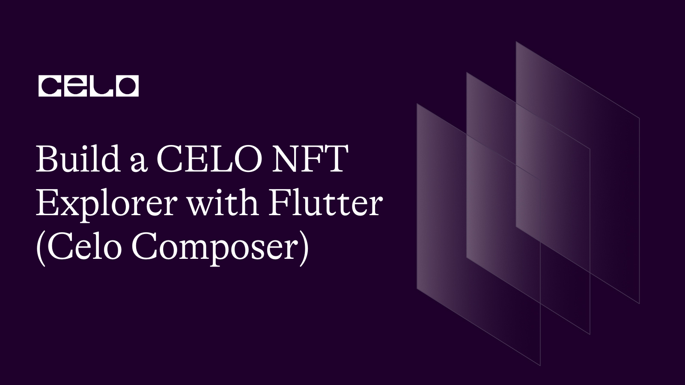
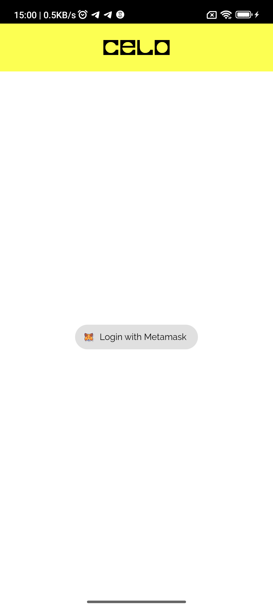
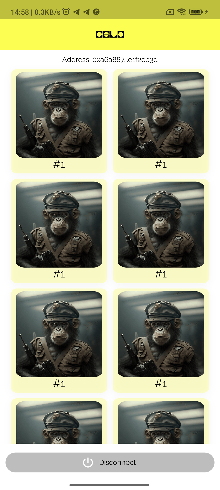

## Introduction

In this tutorial, I will be explaining on how to build a CELO based p2p payment dApp where user can send funds to each other on CELO network with QR code with Flutter using Celo Composer for bootstrap.


## Prerequisites

First, This tutorial assumes that you are already familiar with solidity and understand how smart contracts work and also assumes that you already know the basics of using Flutter or you can please clone the [flutter celo nft](https://github.com/Mujhtech/flutter-celo-nft). You'll also want to make sure you've installed the MetaMask Mobile App and have a MetaMask account. If you'd like, see our prior tutorial Setting Up Your Wallet for more details on this.

For this project we'll be using a few interesting dependencies & dev dependencies:

- [jazzicon](https://pub.dev/packages/jazzicon/example)

We'll walk you through each one as we go and show you how to use them in combination to write some awesome dapps.

## Getting Started

I assume that anyone going through this tutorial already understands and uses Flutter, so I will skip the setup involved in getting Flutter to work on your development computer. That means I assume you already have VS Code/Android Studio together with Android SDK and Flutter setup on your PC.

- If you are entirely new to Flutter, [Flutter get started](https://docs.flutter.dev/get-started/install) is a good tutorial you can learn from.

To get started, you can clone this repository [flutter-celo-nft](https://github.com/Mujhtech/flutter-celo-nft/)  or make use of Celo Composer.

Celo Composer is a set of tools and starter templates that makes it easy for you to start your Celo-based web3 projects.

You can check out [Celo Composer](https://github.com/celo-org/celo-composer/tree/main/packages/flutter-app).

### Using Celo Composer

To start our Flutter App Project, we will use the Celo Composer CLI. The CLI makes it easy for us to select the options that we want when bootstrapping our dApp. In other to do that you need to have Node set up on your PC and you can visit Node to get started. Run this on your terminal after setup Node.

```bash

npx @celo/celo-composer create

```

Choose Flutter when asked for the framework

Your Project will now be created, you can check to make sure it has the following folders

`packages/flutter-app` - Your Flutter project

### Manage Environmental variable

Create a `.env` file at the root of your project inside flutter-app folder in packages and add the follow variable

```env
ETHEREUM_RPC=https://alfajores-forno.celo-testnet.org
```

In other to get nfts data, we will be using moralis to get nft data from Celo blockchain to do so you need to obtain your moralis api key by login to moralis dashboard.  Update your `.env` file with moralis web3 api key and your `.env` file should now look like below


```env
ETHEREUM_RPC=https://alfajores-forno.celo-testnet.org
MORALIS_WEB3_API_KEY=********
```

### UI

To manage user nft on wallet authenticated, we need to create a cubit file to manage nft state. In lib folder, open `module/home` folder then create new folder name model and create the nft model file in it you can name it anything then update the file with the code snippet below

```dart
// ignore_for_file: public_member_api_docs, sort_constructors_first
import 'dart:convert';

class NftModel {
  String? tokenAddress;
  String? tokenId;
  String? tokenUri;
  String? contractType;
  NormalizedMetadata? normalizedMetadata;
  NftModel({
    this.tokenAddress,
    this.tokenId,
    this.tokenUri,
    this.contractType,
    this.normalizedMetadata,
  });

  NftModel copyWith({
    String? tokenAddress,
    String? tokenId,
    String? tokenUri,
    String? contractType,
    NormalizedMetadata? normalizedMetadata,
  }) {
    return NftModel(
      tokenAddress: tokenAddress ?? this.tokenAddress,
      tokenId: tokenId ?? this.tokenId,
      tokenUri: tokenUri ?? this.tokenUri,
      contractType: contractType ?? this.contractType,
      normalizedMetadata: normalizedMetadata ?? this.normalizedMetadata,
    );
  }

  Map<String, dynamic> toMap() {
    return <String, dynamic>{
      'token_address': tokenAddress,
      'token_id': tokenId,
      'token_uri': tokenUri,
      'contract_type': contractType,
      'normalized_metadata': normalizedMetadata?.toMap(),
    };
  }

  factory NftModel.fromMap(Map<String, dynamic> map) {
    return NftModel(
      tokenAddress:
          map['token_address'] != null ? map['token_address'] as String : null,
      tokenId: map['token_id'] != null ? map['token_id'] as String : null,
      tokenUri: map['token_uri'] != null ? map['token_uri'] as String : null,
      contractType:
          map['contract_type'] != null ? map['contract_type'] as String : null,
      normalizedMetadata: map['normalized_metadata'] != null
          ? NormalizedMetadata.fromMap(
              map['normalized_metadata'] as Map<String, dynamic>)
          : null,
    );
  }

  String toJson() => json.encode(toMap());

  factory NftModel.fromJson(String source) =>
      NftModel.fromMap(json.decode(source) as Map<String, dynamic>);

  @override
  String toString() {
    return 'NftModel(tokenAddress: $tokenAddress, tokenId: $tokenId, tokenUri: $tokenUri, contractType: $contractType, normalizedMetadata: $normalizedMetadata)';
  }

  @override
  bool operator ==(covariant NftModel other) {
    if (identical(this, other)) return true;

    return other.tokenAddress == tokenAddress &&
        other.tokenId == tokenId &&
        other.tokenUri == tokenUri &&
        other.contractType == contractType &&
        other.normalizedMetadata == normalizedMetadata;
  }

  @override
  int get hashCode {
    return tokenAddress.hashCode ^
        tokenId.hashCode ^
        tokenUri.hashCode ^
        contractType.hashCode ^
        normalizedMetadata.hashCode;
  }
}

/// Check https://docs.moralis.io/web3-data-api/evm/reference/get-wallet-nfts?address=0xd8da6bf26964af9d7eed9e03e53415d37aa96045&chain=eth&format=decimal&token_addresses=[]&media_items=false
/// for the rest of meta data fields
class NormalizedMetadata {
  String? name;
  String? description;
  String? image;
  NormalizedMetadata({
    this.name,
    this.description,
    this.image,
  });

  NormalizedMetadata copyWith({
    String? name,
    String? description,
    String? image,
  }) {
    return NormalizedMetadata(
      name: name ?? this.name,
      description: description ?? this.description,
      image: image ?? this.image,
    );
  }

  Map<String, dynamic> toMap() {
    return <String, dynamic>{
      'name': name,
      'description': description,
      'image': image,
    };
  }

  factory NormalizedMetadata.fromMap(Map<String, dynamic> map) {
    return NormalizedMetadata(
      name: map['name'] != null ? map['name'] as String : null,
      description:
          map['description'] != null ? map['description'] as String : null,
      image: map['image'] != null ? map['image'] as String : null,
    );
  }

  String toJson() => json.encode(toMap());

  factory NormalizedMetadata.fromJson(String source) =>
      NormalizedMetadata.fromMap(json.decode(source) as Map<String, dynamic>);

  @override
  String toString() =>
      'NormalizedMetadata(name: $name, description: $description, image: $image)';

  @override
  bool operator ==(covariant NormalizedMetadata other) {
    if (identical(this, other)) return true;

    return other.name == name &&
        other.description == description &&
        other.image == image;
  }

  @override
  int get hashCode => name.hashCode ^ description.hashCode ^ image.hashCode;
}
```

To render the nft, we need to create another folder inside the ```module/home``` folder name widgets (which we will be using to manage all home widgets). Create a new data file name ```nft_card.dart``` (You can use any name you like though) and update it with below code

```dart
import 'package:cached_network_image/cached_network_image.dart';
import 'package:flutter/material.dart';
import 'package:flutter_celo_composer/module/home/model/nft_model.dart';

class NftCard extends StatelessWidget {
  const NftCard({
    required this.nft,
    super.key,
  });
  final NftModel nft;

  @override
  Widget build(BuildContext context) {
    return Container(
      padding: const EdgeInsets.all(5),
      decoration: BoxDecoration(
          color: const Color(0xFFFCFF52).withOpacity(0.3),
          borderRadius: BorderRadius.circular(10),
          boxShadow: <BoxShadow>[
            BoxShadow(
                offset: const Offset(0, 4),
                blurRadius: 12,
                spreadRadius: 0,
                color: Colors.black.withOpacity(0.04))
          ]),
      child: Column(
        children: <Widget>[
          Expanded(
            child: Container(
              decoration: BoxDecoration(
                  borderRadius: BorderRadius.circular(20),
                  image: DecorationImage(
                      image: CachedNetworkImageProvider(
                          nft.normalizedMetadata?.image ?? ''))),
            ),
          ),
          Text(
            '#${nft.tokenId}',
            overflow: TextOverflow.ellipsis,
            style: Theme.of(context)
                .textTheme
                .headlineSmall!
                .copyWith(color: Colors.black),
          )
        ],
      ),
    );
  }
}
```

For cubit, create new folder in ```module/home``` name ```services/cubit```, and create a file for both state and cubit then update them respectfully

```dart
import 'dart:convert';

import 'package:flutter_celo_composer/module/home/model/nft_model.dart';
import 'package:flutter_dotenv/flutter_dotenv.dart';
import 'package:http/http.dart' as http;
import 'package:flutter_bloc/flutter_bloc.dart';
import 'package:walletconnect_dart/walletconnect_dart.dart';

part 'nft_state.dart';

class NftCubit extends Cubit<NftState> {
  NftCubit({required this.connector}) : super(const NftState());
  final WalletConnect connector;

  Future<void> fetchNfts() async {
    try {
      emit(FetchNftLoading());

      final http.Response res = await http.Client().get(
          Uri.parse(
              'https://deep-index.moralis.io/api/v2/${connector.session.accounts[0]}/nft?chain=eth&format=decimal&media_items=false'),
          headers: <String, String>{
            'Accept': 'application/json',
            'X-API-Key': dotenv.get('NFTCOLLECTION_CONTRACT_ADDRESS')
          });

      if (!<int>[200, 201, 202].contains(res.statusCode)) {
        throw 'Failed to fetch data';
      }

      List<dynamic> rawdata = json.decode(res.body)['result'];

      emit(FetchNftSuccess(
          nfts: rawdata
              .map((dynamic e) => NftModel.fromMap(e as Map<String, dynamic>))
              .toList()));
    } catch (e) {
      emit(FetchNftFailed(errorCode: '', message: e.toString()));
    }
  }
}
```

For nft state,

```dart
part of 'nft_cubit.dart';

class NftState {
  const NftState();
}

class FetchNftLoading extends NftState {
  FetchNftLoading();
}

class FetchNftSuccess extends NftState {
  const FetchNftSuccess({required this.nfts});
  final List<NftModel> nfts;
}

class FetchNftFailed extends NftState {
  const FetchNftFailed({
    required this.errorCode,
    required this.message,
  });

  final String errorCode;
  final String message;
}
```

Lastly, let’s update both ```home_screen.dart``` and ```main.dart``` file with new changes.

```dart
import 'package:flutter/material.dart';
import 'package:flutter_bloc/flutter_bloc.dart';
import 'package:flutter_celo_composer/module/home/model/nft_model.dart';
import 'package:flutter_celo_composer/module/home/services/cubit/nft_cubit.dart';
import 'package:flutter_celo_composer/module/home/widgets/nft_card.dart';
import 'package:jazzicon/jazzicon.dart';
import 'package:jazzicon/jazziconshape.dart';
import 'package:walletconnect_dart/walletconnect_dart.dart';

class HomeScreen extends StatefulWidget {
  const HomeScreen({
    required this.session,
    required this.connector,
    required this.uri,
    Key? key,
  }) : super(key: key);

  final dynamic session;
  final WalletConnect connector;
  final String uri;

  @override
  State<HomeScreen> createState() => _HomeScreenState();
}

class _HomeScreenState extends State<HomeScreen> {
  String accountAddress = '';
  String networkName = '';
  TextEditingController greetingTextController = TextEditingController();
  JazziconData? jazz;

  ButtonStyle buttonStyle = ButtonStyle(
    elevation: MaterialStateProperty.all(0),
    backgroundColor: MaterialStateProperty.all(
      Colors.white.withAlpha(60),
    ),
    shape: MaterialStateProperty.all(
      RoundedRectangleBorder(borderRadius: BorderRadius.circular(25)),
    ),
  );

  @override
  void initState() {
    super.initState();

    /// Execute after frame is rendered to get the emit state of InitializeProviderSuccess
    WidgetsBinding.instance.addPostFrameCallback((_) {
      accountAddress = widget.connector.session.accounts[0];
      jazz = Jazzicon.getJazziconData(40,
          address: widget.connector.session.accounts[0]);

      setState(() {});

      context.read<NftCubit>().fetchNfts();
    });
  }

  @override
  Widget build(BuildContext context) {
    final ThemeData theme = Theme.of(context);
    final double width = MediaQuery.of(context).size.width;
    final double height = MediaQuery.of(context).size.height;

    List<NftModel> nfts = [];

    return BlocListener<NftCubit, NftState>(
      listener: (BuildContext context, NftState state) {
        if (state is FetchNftSuccess) {
          nfts = state.nfts;
        } else if (state is FetchNftFailed) {
        } else if (state is FetchNftLoading) {}
      },
      child: Scaffold(
        appBar: AppBar(
          elevation: 0,
          title: Image.asset(
            'assets/images/logo.png',
            width: 50,
            height: 50,
          ),
          centerTitle: true,
          // ignore: use_decorated_box
          backgroundColor: const Color(0xFFFCFF52),
        ),
        backgroundColor: Colors.white,
        body: Column(
          children: <Widget>[
            Column(
              children: [
                const SizedBox(height: 10),
                if (accountAddress.isNotEmpty)
                  Text(
                    'Address: ${accountAddress.substring(0, 8)}...${accountAddress.substring(accountAddress.length - 8, accountAddress.length)}',
                    style: theme.textTheme.titleMedium!.copyWith(
                      color: Colors.black,
                    ),
                  ),
              ],
            ),
            Expanded(
              child: GridView.builder(
                padding:
                    const EdgeInsets.symmetric(horizontal: 20, vertical: 10),
                gridDelegate: const SliverGridDelegateWithFixedCrossAxisCount(
                  crossAxisCount: 2,
                  childAspectRatio: 1 / 1.08,
                  crossAxisSpacing: 10,
                  mainAxisSpacing: 10,
                ),
                shrinkWrap: true,
                itemBuilder: (_, int index) {
                  return NftCard(
                    nft: nfts[index],
                    key: Key(index.toString()),
                  );
                },
                itemCount: nfts.length,
              ),
            ),
            Container(
              padding: const EdgeInsets.symmetric(vertical: 10, horizontal: 10),
              child: SizedBox(
                width: width,
                child: ElevatedButton.icon(
                  onPressed: () {
                    //context.read<AuthCubit>().();
                  },
                  icon: const Icon(
                    Icons.power_settings_new,
                  ),
                  label: Text(
                    'Disconnect',
                    style: theme.textTheme.titleMedium!
                        .copyWith(color: Colors.black),
                  ),
                  style: ButtonStyle(
                    elevation: MaterialStateProperty.all(0),
                    backgroundColor: MaterialStateProperty.all(
                      Colors.grey.shade400,
                    ),
                    shape: MaterialStateProperty.all(
                      RoundedRectangleBorder(
                        borderRadius: BorderRadius.circular(25),
                      ),
                    ),
                  ),
                ),
              ),
            ),
          ],
        ),
      ),
    );
  }
}
```

For main.dart

```dart
import 'package:flutter/material.dart';
import 'package:flutter/services.dart';
import 'package:flutter_bloc/flutter_bloc.dart';
import 'package:flutter_celo_composer/configs/themes.dart';
import 'package:flutter_celo_composer/configs/web3_config.dart';
import 'package:flutter_celo_composer/infrastructures/repository/secure_storage_repository.dart';
import 'package:flutter_celo_composer/infrastructures/service/cubit/secure_storage_cubit.dart';
import 'package:flutter_celo_composer/module/auth/interfaces/screens/authentication_screen.dart';
import 'package:flutter_celo_composer/module/auth/service/cubit/auth_cubit.dart';
import 'package:flutter_celo_composer/module/home/services/cubit/nft_cubit.dart';
import 'package:flutter_dotenv/flutter_dotenv.dart';
import 'package:walletconnect_dart/walletconnect_dart.dart';
import 'package:web3dart/web3dart.dart';

Future<void> main() async {
  /// Load env file
  await dotenv.load();

  runApp(
    MyApp(
      walletConnect: await walletConnect,
      web3client: web3Client,
    ),
  );
}

class MyApp extends StatelessWidget {
  const MyApp({
    required this.walletConnect,
    required this.web3client,
    Key? key,
  }) : super(key: key);
  final WalletConnect walletConnect;
  final Web3Client web3client;

  @override
  Widget build(BuildContext context) {
    return MultiBlocProvider(
      providers: <BlocProvider<dynamic>>[
        BlocProvider<AuthCubit>(
          create: (BuildContext context) => AuthCubit(
            storage: SecureStorageRepository(),
            connector: walletConnect,
          ),
        ),
        BlocProvider<NftCubit>(
          create: (BuildContext context) => NftCubit(
            connector: walletConnect,
          ),
        ),
        BlocProvider<SecureStorageCubit>(
          create: (BuildContext context) => SecureStorageCubit(
            storage: SecureStorageRepository(),
          ),
        ),
      ],
      child: MaterialApp(
        title: 'Sophon',
        debugShowCheckedModeBanner: false,
        theme: buildDefaultTheme(context),
        home: const MyHomePage(),
      ),
    );
  }
}

class MyHomePage extends StatefulWidget {
  const MyHomePage({Key? key}) : super(key: key);

  @override
  State<MyHomePage> createState() => _MyHomePageState();
}

class _MyHomePageState extends State<MyHomePage> {
  @override
  Widget build(BuildContext context) {
    /// Lock app to portrait mode
    SystemChrome.setPreferredOrientations(<DeviceOrientation>[
      DeviceOrientation.portraitUp,
      DeviceOrientation.portraitDown,
    ]);
    return const AuthenticationScreen();
  }
}
```

Incase you encounter any error with test folder, make sure to update any necessary file changes. Then run your project, you should be able to get something similar with below screenshot.




## Conclusion

Congratulations, you have now learned how to build a real-world dApp using Flutter. You have seen how to connect with a blockchain wallet, and play around with NFT.

## About the Author

I am a Software Engineer, Tech Evangelist (Preaching the gospel of flutter & blockchain) also and Ex-GDSC Leads.

## References

- [Source Code](https://github.com/Mujhtech/flutter-celo-nft/)

- [Celo Composer](https://github.com/celo-org/celo-composer)

- [Flutter](https://flutter.dev)

- [Solidity by example](https://solidity-by-example.org/)