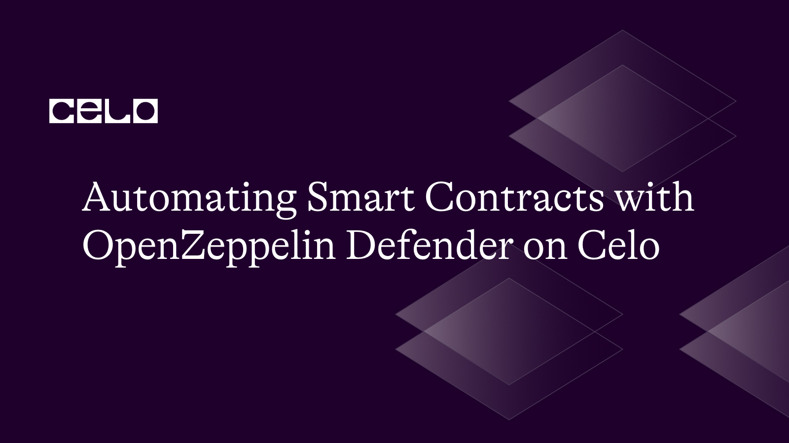

import YouTube from '@components/YouTube';

## Introduction

This tutorial introduces developers to automating smart contracts using OpenZeppelin Defender -  a powerful, secure smart contract management platform. As smart contracts cannot self-trigger, automation becomes essential for efficient operation. By leveraging OpenZeppelin Defender's capabilities, you'll learn how to schedule and automate tasks securely and reliably, streamlining your smart contract's performance and enhancing the overall user experience within the decentralized ecosystem on Celo Blockchain.

## Prerequisites

1. Basic Knowledge of Javascript
2. Familiarity with Solidity Smart Contracts

## Video

<YouTube videoId="DHkAM9NRods"/>

[Video URL](https://youtu.be/DHkAM9NRods)

## Resources

1. [Github Gist - Token Contract Code](https://gist.github.com/iamoracle/4b33b3e0785dab393a35d7c20c70373a)
2. [Celo Alfajores](https://faucet.celo.org)
3. [CeloScan Alfajores Explorer](https://alfajores.celoscan.io)
4. [Celo Faucet](https://faucet.celo.org)

## Conclusion

This tutorial is a great resource for anyone looking to automate their smart contracts on the Celo network using OpenZeppelin Defender.

## Author

[Oyeniyi Abiola Peace](https://twitter.com/_iamoracle) is a seasoned software and blockchain developer. With a degree in Telecommunication Science from the University of Ilorin and over five years of experience in JavaScript, Python, PHP, and Solidity, he is no stranger to the tech industry. Peace currently works as the CTO at DFMLab and is a Community Moderator at Celo Blockchain. When he's not coding or teaching, he loves to read and spend time with family and friends.
