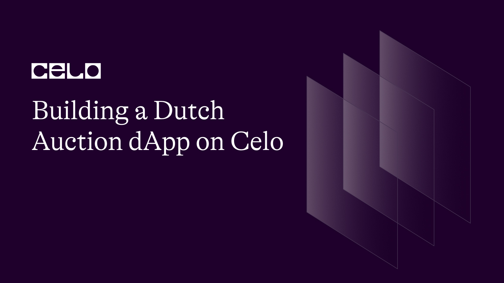
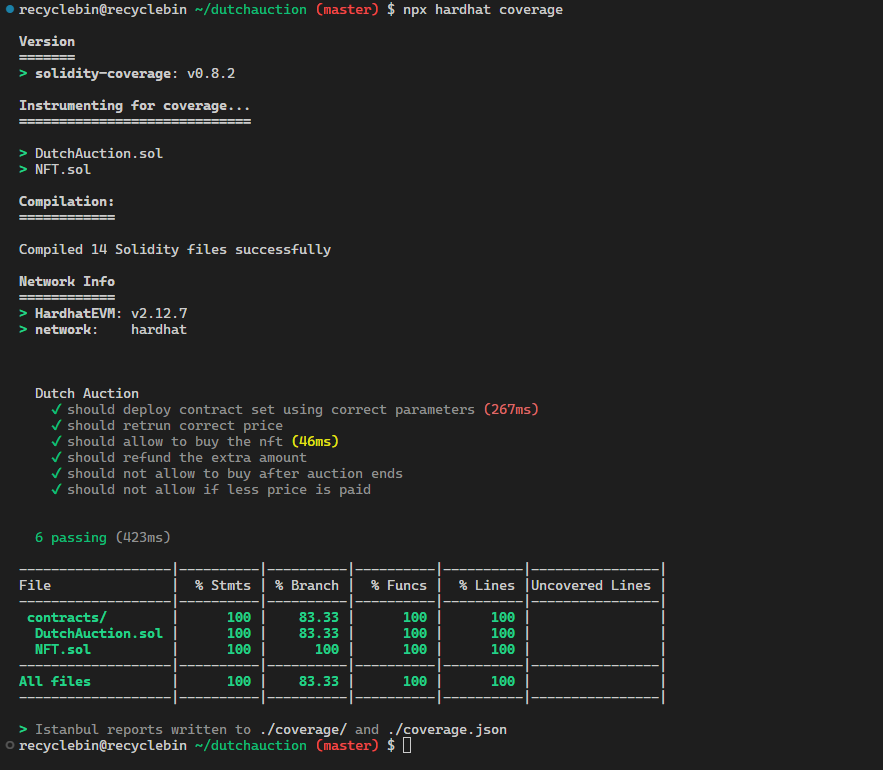
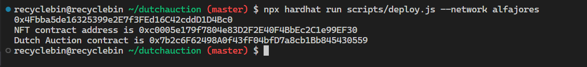

## Introduction

In this tutorial, we will be building a dapp for a Dutch auction using Solidity, Hardhat, and React. In a Dutch auction, the price of an item starts high and gradually decreases until a buyer is found. Unlike an English auction, where the price increases with each bid, a Dutch auction can be a more efficient way to sell an item, especially if the seller wants to sell it quickly. We will cover the smart contract and user interface for the dapp and show you how to deploy and interact with the dapp on Celo.

## Prerequisites

We will create a Dutch auction dapp to auction off an NFT. Therefore, we assume that you already have knowledge of how NFTs work. If you are not familiar with NFTs, please complete one of the following tutorials first:

- [How to quickly build an NFT collection on Celo](https://docs.celo.org/blog/tutorials/how-to-quickly-build-an-nft-collection-on-celo)
- [Deploy an NFT to Celo](https://docs.celo.org/blog/2022/01/05/no-code-erc721)

It is recommended that you have a basic understanding of Solidity, JavaScript, and React to follow this tutorial. Familiarity with Hardhat is helpful but not necessary since the tutorial will cover the basics. Having a grasp of these technologies will make it easier to understand and follow along. However, even without prior experience, you can still learn a lot from this tutorial.

## Requirements

To run and test Solidity code for this tutorial, Node.js (version >=16.0) is required. To check if Node.js is installed, run the following command in the terminal:

```
node -v
```

If Node.js is not installed or the version is outdated, you can download the latest version from the **[official website](https://nodejs.org/)** and install it by following the instructions provided. Once Node.js is installed, you can proceed with the tutorial.

We also need to install a wallet in the browser that works with Celo, such as MetaMask.

## How Does a Dutch Auction Work?

In a Dutch auction, the price of the item being auctioned gradually decreases until someone is willing to accept the current price. This differs from a traditional auction, where the price starts low and increases gradually until someone is willing to pay the highest amount.

Here's how a Dutch auction typically works:

1. The auctioneer sets an initial asking price that is relatively high.
2. The auctioneer then gradually lowers the price over time until someone is willing to accept the current price.
3. Anyone who is interested in the item indicates their willingness to purchase it by placing a bid.
4. Once a bid is placed at the current price, the auction is complete, and the item is purchased at that price.

In a smart contract, instead of manually decreasing the price over a set period of time, we can set a discount rate (discount per second) to achieve the same result. We can calculate the current price of the item using the following formula:

```
current price = initial price - (discount rate * time elapsed in seconds)
```

## Project Setup

In this tutorial, we will be creating and testing smart contracts and building a web app using Hardhat and React. Let's start with the setup for both.

### Hardhat Setup

First, create a directory for this tutorial and open it in a code editor like VS Code. To set up the Hardhat project, run the following command in the terminal:

```bash
npx hardhat .
```

After the project setup is complete, remove all files from the **`contracts`** and **`test`** directories. Next, create three new files, **`DutchAuction.sol`**, **`NFT.sol`** in the **`contracts`** directory, and **`DutchAuction.js`** in the **`test`** directory. We must also create an **`.env`** file to store the private key of the wallet that will be used for contract deployment.

We also need to install some dependencies that will help us in the development process. These dependencies are:

- **`@openzeppelin/contracts`**: provides us with the ERC-721 standard to create NFTs.
- **`dotenv`**: helps us read environment variables like our private key.
- **`solidity-coverage`**: shows us test coverage for our contracts.

To install these dependencies, run the following command in the terminal:

```bash
npm install "dotenv" "@openzeppelin/contracts" "solidity-coverage"
```

Make sure to add the private key for the wallet that you want to use for deployment to the **`.env`** file and have some test Celo tokens in the wallet. You can obtain some test tokens from the **[Alfajores token faucet](https://faucet.celo.org/)**.

## Web App Setup

To build the web app, we will be using React.js. To create a new React project, open the terminal and run the following command:

```bash
npx create-react-app frontend
```

Now, let's install the packages required for the web app. We need to install the following packages:

- **`ethers`**: This package is used to interact with smart contracts and wallets.
- **`react-toastify`**: This package is used to show notifications on the web app.

To install the packages, run the following command:

```bash
# Change directory to `frontend`
cd frontend
# Installing ethers v5.7.2 and react-toastify
npm install "ethers@5.7.2" "react-toastify"
# Change directory back to base directory
cd ..
# PWD - base directory
```

## NFT Contract

Now that we have set up the project, we can start by writing the NFT smart contract.

First, we will write our NFT contract, with which we are going to mint the NFT that will be auctioned. As the NFT contract is not the focus of this tutorial, simply copy the following code snippet into the **`NFT.sol`** file. If you want to learn more about NFTs, you can read the tutorials linked in the Prerequisites section.

```solidity
// SPDX-License-Identifier: MIT
pragma solidity ^0.8.17;

import "@openzeppelin/contracts/token/ERC721/extensions/ERC721URIStorage.sol";
import "@openzeppelin/contracts/utils/Counters.sol";

contract NFT is ERC721URIStorage {
    using Counters for Counters.Counter;
    Counters.Counter private _tokenIds;

    constructor() ERC721("GameItem", "ITM") {}

    function awardItem(
        address player,
        string memory tokenURI
    ) public returns (uint256) {
        uint256 newItemId = _tokenIds.current();
        _mint(player, newItemId);
        _setTokenURI(newItemId, tokenURI);

        _tokenIds.increment();
        return newItemId;
    }
}
```

When we put the NFT up for auction, we will give permissions to the auction contract to transfer the NFT from our wallet. The next step is to write the auction contract.

## Auction Contract

To create an auction smart contract, we start by opening the **`DutchAuction.sol`** file and pasting the following code snippet that defines the smart contract outline and necessary imports:

```solidity
// SPDX-License-Identifier: MIT
pragma solidity ^0.8.17;

import "@openzeppelin/contracts/token/ERC721/IERC721.sol";

contract DutchAuction {}
```

### Defining Variables

We need to store some key parameters related to the auction in the contract. For each parameter, we create a variable with the following details:

- **`nft`**: This variable is of type **`IERC721`** and stores the address of the non-fungible token (NFT) contract that will be used to mint and auction the NFT.
- **`initialPrice`**: This variable is of type **`uint256`** sets the initial price of the NFT in ether.
- **`discountRate`**: This variable is of type **`uint256`** sets the discount rate at which the price of the NFT will decrease per unit time.
- **`duration`**: This variable is of type **`uint256`** sets the duration of the auction in days.
- **`sold`**: This variable is of type **`bool`** indicates whether the NFT has been sold or not. It is initially set to **`false`**.
- **`startTime`**: This variable is of type **`uint256`** stores the timestamp when the auction starts.
- **`id`**: This variable is of type **`uint256`** and stores the ID of the NFT that will be auctioned.

```solidity
contract DutchAuction {
    IERC721 public nft;

    uint256 public initialPrice = 50 ether;
    uint256 public discountRate = 20 wei;
    uint256 public duration = 7 days;
    bool public sold = false;

    uint256 public startTime;
    uint256 public id;

    // Constructor
}
```

### Defining Constructor

In the constructor function, we initialize three variables, namely **`id`**, **`startTime`**, and **`nft`**. We require two arguments to set these variables, **`_id`** and **`_nft`**. We pass **`_nft`** to **`IERC721`** to set up the **`nft`** variable, while **`id`** is assigned the value of **`_id`**. Additionally, we set the value of **`startTime`** as the current timestamp at the moment of contract deployment.

```solidity
    constructor(address _nft, uint256 _id) {
        id = _id;
        nft = IERC721(_nft);
        startTime = block.timestamp;
    }
    // Calculate current price of the NFT
```

### Get Current Price

We can calculate the current price of the item being auctioned in the function called **`getPrice`**. The formula for the current price is:

```
current price = initial price - (discount rate * time elapsed in seconds)
```

Time elapsed can be calculated by subtracting the current timestamp and start time. This will give us the elapsed time in seconds. We can multiply the time elapsed with **`discountRate`** and subtract the result from the initial price.

```solidity
    // Calculate current price of the NFT
    function getPrice() public view returns (uint256 price) {
        uint256 timePassed = block.timestamp - startTime;
        price = initialPrice - (timePassed * discountRate);
    }

    // buy NFT being auctioned
```

### Buy NFT

We can write a function called **`buy`** that allows anyone to purchase an NFT at the current price. This function first checks whether the auction is still ongoing by verifying whether the current block timestamp is less than the end time of the auction. If the auction is still ongoing, it then calculates the current price of the NFT using the **`getPrice()`** function.

Next, the function checks whether the value sent with the transaction is greater than or equal to the calculated price. If this condition is met, the function transfers the NFT from the contract owner to the caller and refunds any excess ETH sent with the transaction. Finally, the function sets the **`sold`** variable to **`true`**.

```solidity
    // buy NFT being auctioned
    function buy() public payable {
        require(block.timestamp < startTime + duration, "Auction ended");

        uint256 price = getPrice();
        require(msg.value >= price, "ETH < price");

        nft.safeTransferFrom(nft.ownerOf(0), msg.sender, id);
        uint256 refund = msg.value - price;
        if (refund > 0) {
            payable(msg.sender).transfer(refund);
        }
        sold = true;
    }
```

Now that we've completed our smart contract, we can move on to unit testing it.

## Unit Tests

It is considered a good practice to write unit tests for all smart contracts to ensure that they work according to our expectations. In this section, we will write unit tests for our smart contract.

To begin, we import necessary dependencies and create a **`describe`** block containing all the tests that we will write. The **`describe`** block is a way to group tests together.

```js
const {
  days,
} = require("@nomicfoundation/hardhat-network-helpers/dist/src/helpers/time/duration");
const {
  loadFixture,
  time,
} = require("@nomicfoundation/hardhat-network-helpers");
const { expect } = require("chai");
const hre = require("hardhat");

describe("Dutch Auction", async () => {
  const deployFixture = async () => {};
});
```

We need to define the **`deployFixture`** function first. The fixture will deploy both smart contracts and approve the auction contract as an operator for the NFT that is being auctioned. Additionally, we will create two dummy accounts that will be used for testing purposes.

After creating the smart contracts, we will return instances of both the contracts and the two dummy addresses.

```js
const deployFixture = async () => {
  const [owner, buyer] = await hre.ethers.getSigners();
  let nft;

  try {
    const NFT = await hre.ethers.getContractFactory("NFT");
    nft = await NFT.deploy();

    await nft.deployed();
    await nft.awardItem(
      owner.address,
      "https://gist.githubusercontent.com/nikbhintade/97994377f414de00809dad098ca57bf2/raw/117c9db714b13425116c2496ed0b237e7c88d83b/nft.json"
    );
  } catch (err) {
    console.log(err);
  }

  let dutchauction;

  try {
    const DutchAuction = await hre.ethers.getContractFactory("DutchAuction");
    dutchauction = await DutchAuction.deploy(nft.address, 0);

    await dutchauction.deployed();
  } catch (err) {
    console.log(err);
  }

  await nft.approve(dutchauction.address, 0);
  return { dutchauction, nft, owner, buyer };
};
```

Our first test will check if the contracts are deployed correctly by verifying that the variables we set from the constructor have the expected values and that the auction contract is approved as an operator for the NFT being auctioned.

```js
it("should deploy contract set using correct parameters", async () => {
  const { dutchauction, nft } = await loadFixture(deployFixture);

  expect(await dutchauction.id()).to.be.equal(0);
  expect(await dutchauction.startTime()).to.be.equal((await time.latest()) - 1);
  expect(await dutchauction.nft()).to.be.equal(nft.address);

  expect(await nft.getApproved(0)).to.be.equal(dutchauction.address);
});
```

We have learned about how the contract calculates the current price. Now, we will test if it accurately calculates the current price in the following test:

```js
it("should return the correct price", async () => {
  const { dutchauction } = await loadFixture(deployFixture);

  const DISCOUNT_RATE = await dutchauction.discountRate();
  const INITIAL_PRICE = await dutchauction.initialPrice();

  await time.increase(3600 - 1);

  const PRICE = hre.ethers.BigNumber.from(3600).mul(DISCOUNT_RATE);

  expect(await dutchauction.getPrice()).to.be.equal(INITIAL_PRICE.sub(PRICE));
});
```

This test ensures that the **`getPrice()`** function accurately returns the current price by comparing the expected price, calculated based on the discount rate and initial price, with the actual price returned by the function.

Next, let's test if the buy functionality works as expected. The expected behavior is that if a buyer buys the NFT at the current price, then the NFT will be transferred to the buyer's wallet. To test this, we will check if the **`Transfer`** event is emitted from the NFT contract with the correct arguments. The test code is as follows:

```js
it("should allow the buying of the NFT", async () => {
  const { dutchauction, nft, buyer } = await loadFixture(deployFixture);

  await time.increase(3600 - 1);
  const PRICE = await dutchauction.getPrice();

  expect(await dutchauction.connect(buyer).buy({ value: PRICE }))
    .to.emit(nft, "Transfer")
    .withArgs(dutchauction.address, buyer.address, 0);
});
```

The **`buy()`** function also includes a refund option that refunds the buyer if they paid more than the current price. To test this functionality, we will send more ether than the current price and check if the balance of the smart contract is equal to the current price of the NFT, as the remaining amount will be refunded to the buyer. The test code is as follows:

```js
it("should refund the extra amount", async () => {
  const { dutchauction, buyer } = await loadFixture(deployFixture);

  await time.increase(3600);

  await dutchauction.connect(buyer).buy({ value: "999999999999999999999" });
  const PRICE = await dutchauction.getPrice();

  expect(
    await hre.ethers.provider.getBalance(dutchauction.address)
  ).to.be.equal(hre.ethers.BigNumber.from(PRICE));
});
```

The above test checks if the extra amount paid is refunded to the buyer by comparing the balance of the smart contract to the current price of the NFT.

Next, let's test if the smart contract restricts the buying of the NFT after the end of the auction. To test this, we will increase the timestamp by 7 days and then call the **`buy()`** function. It should revert with the reason "Auction ended". The test code is as follows:

```js
it("should not allow buying after the auction ends", async () => {
  const { dutchauction, buyer } = await loadFixture(deployFixture);

  await time.increase(days(7));

  const PRICE = await dutchauction.getPrice();
  await expect(
    dutchauction.connect(buyer).buy({ value: PRICE })
  ).to.revertedWith("Auction ended");
});
```

We also need to test if the buyer can only buy the NFT at the current price or higher. To test this, we'll pay less than the current price and check if the function reverts with the reason "ETH < price". Here's the code:

```js
it("should not allow buying if less price is paid", async () => {
  const { dutchauction, buyer } = await loadFixture(deployFixture);

  await time.increase(3600);

  const PRICE = await dutchauction.getPrice();
  await expect(
    dutchauction.connect(buyer).buy({ value: PRICE.sub(1000) })
  ).to.be.revertedWith("ETH < price");
});
```

With these tests, we have covered most of the contract. We can now set up our project to see the code coverage. To set up the **`solidity-coverage`** plugin, we just need to import it in **`hardhat.config.js`**.

```js
require("solidity-coverage");
```

To run the tests and see the coverage, we can run the following command in the terminal:

```bash
npx hardhat coverage
```

The output of the coverage should look something like this:



Now that we have written and tested the auction smart contract, let's proceed to deploy both of our smart contracts.

## Contract Deployment

Firstly, we need to add the network configuration for the Alfajores network and import **`dotenv`** to **`hardhat.config.js`**. The import statement will be at the top of the file, and the Alfajores configuration will go in the **`module.exports`** object:

```js
require("@nomicfoundation/hardhat-toolbox");
require("solidity-coverage");
require("dotenv").config();

/** @type import('hardhat/config').HardhatUserConfig */
module.exports = {
  solidity: "0.8.17",
  defaultNetwork: "hardhat",
  networks: {
    hardhat: {},
    alfajores: {
      url: "https://alfajores-forno.celo-testnet.org",
      accounts: [process.env.PRIVATE_KEY],
      chainId: 44787,
    },
    celo: {
      url: "https://forno.celo.org",
      accounts: [process.env.PRIVATE_KEY],
      chainId: 42220,
    },
  },
};
```

We have configured our project to deploy to the Alfajores testnet. To deploy both of our smart contracts, we need to write a script. Open **`deploy.js`** from the **`scripts`** directory. Remove all the content from the **`main`** function and add the following snippet:

```js
const hre = require("hardhat");

async function main() {
  const deployer = await hre.ethers.getSigner();
  console.log(deployer.address);

  const NFT = await hre.ethers.getContractFactory("NFT");
  const nft = await NFT.deploy();
  await nft.deployed();

  console.log(`NFT contract address is ${nft.address}`);

  const mintTxn = await nft.awardItem(
    deployer.address,
    "https://gist.githubusercontent.com/nikbhintade/97994377f414de00809dad098ca57bf2/raw/137da789cb4ba9710db60439c27e9c36deeee555/nft.json"
  );
  await mintTxn.wait();

  const DutchAuction = await hre.ethers.getContractFactory("DutchAuction");
  const dutchAuction = await DutchAuction.deploy(nft.address, 0);
  await dutchAuction.deployed();

  console.log(`Dutch Auction contract is ${dutchAuction.address}`);

  const approvalTxn = await nft.approve(dutchAuction.address, 0);
  await approvalTxn.wait();
}

// We recommend this pattern to be able to use async/await everywhere
// and properly handle errors.
main().catch((error) => {
  console.error(error);
  process.exitCode = 1;
});
```

In this script, we are performing the same steps as we did when creating a fixture for our unit tests. Firstly, we deploy the NFT contract and mint an NFT with the contract deployer's wallet as the owner. Next, we deploy the auction contract with the correct parameters, and finally, we approve the auction contract as an operator for the minted NFT.

With the setup for contract deployment completed, you can run the following command in the terminal to deploy the contracts:

```bash
npx hardhat run scripts/deploy.js --network alfajores
```

You will see an output similar to the following:



## Creating The Web App

As we have tested and deployed our smart contract, we can proceed with building the web app. To create the web app, we need the contract ABI. We have generated the ABI while deployed contracts. Copy the `DutchAuction.json` and `NFT.json` from the `artifacts/contracts/DutchAuction.sol` and `artifacts/contracts/NFT.sol` directory to `frontend/src`.

To start building the web app, open the `App.js` file in the `frontend/src` directory and paste the following code snippet. It creates the basic structure of the web app:

```js
import "./App.css";
import DutchAuction from "./DutchAuction.json";
import NFT from "./NFT.json";

import { useEffect, useState } from "react";
import { ethers } from "ethers";
import { ToastContainer, toast } from "react-toastify";
import "react-toastify/dist/ReactToastify.css";

const CONTRACTADDRESS = "0x60b9752bF3e616f4Aa40e12cdB6B615fe5e14807";

function App() {
  const [state, setState] = useState({
    contract: undefined,
    address: "",
    metadata: {},
    sold: false,
  });
  const [price, setPrice] = useState();

  // connect to wallet
  const connect = async () => {};

  const buy = async () => {};

  return (
    <div className="App">
      <nav>
        <p>Dutch Auction</p>
        <button onClick={connect}>
          {state.address ? `${state.address}` : "Connect"}
        </button>
      </nav>

      {state.address ? (
        <div className="container">
          <div>
            
          </div>

          <div className="buy">
            <h2>{state.metadata.name}</h2>
            <h4>{price}</h4>
            <button onClick={buy} disabled={state.sold}>
              {state.sold ? "NFT Sold" : "Buy Now!"}
            </button>
          </div>
        </div>
      ) : (
        <h2>Not connected</h2>
      )}

      <ToastContainer
        position="top-right"
        autoClose={3000}
        hideProgressBar={false}
        newestOnTop={false}
        closeButton={false}
        closeOnClick
        rtl={false}
        pauseOnFocusLoss
        draggable
        pauseOnHover
        theme="dark"
      />
    </div>
  );
}

export default App;
```

In the web app, our primary focus is on the logic rather than the structure and styling. The `App` component handles most of the application's functionality. Let's take a closer look at what it does. At the top, we import various libraries, each of which serves a specific purpose:

- `ethers`: a library used to interact with contracts and wallets
- `useState`: a hook that allows us to track state in a function component
- `useEffect`: a hook that allows us to perform side effects in our components
- `ToastContainer`: a notification component
- `toast`: a function used to trigger notifications

We also declare a variable called `CONTRACTADDRESS`, which stores the auction contract address obtained from deploying the contracts.

Within the `App` component, we use the `useState` hook to store a variety of data, including an object that stores an instance of the contract, the user's address, the metadata of the NFT being auctioned, and the NFT's status to determine whether it has been sold. We also use `useState` to store the current price of the NFT. Additionally, the component contains functions that handle wallet and contract interactions, including:

- `connect`: handles wallet connection and sets the initial state of the web app
- `buy`: allows users to buy the NFT being auctioned if they wish to do so
- `getPrice`: retrieves the current price of the NFT

The rest of the web app consists of a simple HTML structure that uses ternary operators to display different components to the user based on the application's state.

### Connecting Wallet

The `connect` function is responsible for connecting a wallet to a web application and retrieving information related to a Dutch auction smart contract and an NFT being auctioned. The function begins by checking if a wallet is installed, and if one is not found, it returns an error message. However, if a wallet is detected, the function uses the `Web3Provider` from the `ethers.js` library to connect to the wallet and retrieve the associated account. It then uses this account to create a `signer` object and instantiate an `auction` contract object with the signer, address of the contract, and the ABI of the contract.

The function retrieves information from the `sold`, `nft`, and `id` variables of the auction smart contract. After retrieving this information, it uses the `nft` and `id` variables to get metadata information from the NFT contract. Finally, it stores all the necessary data in the state using the `setState` function. If an error occurs during any of these steps, the function displays an error message using the `toast` library.

```js
const connect = async () => {
  try {
    const { ethereum } = window;
    if (!ethereum) {
      console.error("Install any Celo wallet");
      return toast.error("No wallet installed!");
    }

    const provider = new ethers.providers.Web3Provider(ethereum);
    const accounts = await provider.send("eth_requestAccounts", []);
    const account = accounts[0];

    const signer = provider.getSigner();
    const auction = new ethers.Contract(
      CONTRACTADDRESS,
      DutchAuction.abi,
      signer
    );

    const [sold, nftAddress, id] = await Promise.all([
      auction.sold(),
      auction.nft(),
      auction.id(),
    ]);

    const nft = new ethers.Contract(nftAddress, NFT.abi, signer);
    const metadata = await fetch(await nft.tokenURI(id)).then((res) =>
      res.json()
    );

    setState({
      contract: auction,
      address: `${account.slice(0, 5)}...${account.slice(-5)}`,
      metadata,
      sold,
    });
  } catch (error) {
    toast.error(error.reason);
  }
};
```

We can write a `buy` function that enables users to purchase an NFT from an auction at its current price. The function begins by retrieving the current price of the NFT and invoking the smart contract's buy function with the appropriate amount. If the transaction is successful, a toast notification will appear. We then call the function again to check the NFT's sold status and save it in the application's state. In case of any errors during any of these steps, the function employs the `toast` library to display an error message.

```jsx
const buy = async () => {
  try {
    const _price = await state.contract.getPrice();
    const buyTxn = await state.contract.buy({
      value: ethers.utils.parseEther(_price),
    });
    await toast.promise(buyTxn.wait(), {
      pending: "transaction executing",
      success: "NFT bought",
    });
    const isSold = await state.contract.sold();
    setState({ ...state, sold: isSold });
  } catch (error) {
    console.error(error);
    toast.error(error.data?.message || error.message);
  }
};
```

To ensure that the price is consistently updated, we will use the **`useEffect`** hook and create a **`getPrice`** function. We will make **`state.contract`** a dependency of the **`useEffect`** hook to ensure that it is triggered whenever the state changes.

In the **`useEffect`** hook, we will first define the **`getPrice`** function. This function will call the **`getPrice`** function of the smart contract and update the price in the state. To continually update the price, we will use the **`setInterval`** method to call the **`getPrice`** function every 5 seconds.

Finally, we will include a **`clearInterval`** method in the **`return`** statement to clear the interval.

```js
useEffect(() => {
  const getPrice = async () => {
    console.log("hit");
    if (state.contract !== undefined) {
      try {
        const price = await state.contract.getPrice();
        setPrice(ethers.utils.formatEther(price));
      } catch (e) {
        console.log(e);
      }
    }
  };
  let interval;
  if (state.contract !== undefined) {
    interval = setInterval(() => {
      getPrice();
    }, 5000);
  }

  return () => {
    if (interval) {
      clearInterval(interval);
    }
  };
}, [state.contract]);
```

We have finished implementing the functionality of our application. To add styling to our application, please copy and paste the following CSS code into the **`app.css`** file:

```css
* {
  font-size: 14px;
}

body {
  margin: 0;
  font-family: "Martel", -apple-system, BlinkMacSystemFont, "Segoe UI", "Roboto",
    "Oxygen", "Ubuntu", "Cantarell", "Fira Sans", "Droid Sans", "Helvetica Neue",
    sans-serif;
  -webkit-font-smoothing: antialiased;
  -moz-osx-font-smoothing: grayscale;
  background-color: #c5d0dd;
}

.App {
  text-align: center;
}

nav {
  font-family: "Karla";
  font-weight: 700;
  display: flex;
  align-items: center;
  justify-content: space-between;
  padding: 5px 30px;
}
nav > p {
  font-size: 25px;
  font-weight: 700;
}

button {
  background-color: #fda5a4;
  font-family: "Karla";
  padding: 10px 30px;
  border-style: none;
  font-weight: 700;
  cursor: pointer;
}

.container {
  display: flex;
  flex-direction: row;
  gap: 5%;
  padding: 5% 10%;
}
.buy {
  padding-top: 5%;
  text-align: left;
}

#nft {
  width: 75%;
}

h2 {
  font-family: "Karla";
  font-weight: 700;
  font-size: 25px;
}
```

### Running a Web App

To run a web app on your machine, enter the following commands in the terminal:

```bash
# change directory to frontend
cd frontend
# run development server
npm start
# or run `yarn start`
```

This should open a tab in the browser, allowing you to interact with your smart contract. Make sure to switch network in your wallet to the Alfajores testnet.

## Demo App

You can check out the demo app at this [link](https://dutch-auction.netlify.app/). Make sure to switch network in your wallet to the Alfajores testnet.

## Conclusion

In conclusion, we have successfully developed a Dutch auction dapp that enables us to auction our NFT. Throughout this tutorial, we have learned how to implement Dutch auction logic in our smart contract and how to interact with the NFT using contract interface.

Furthermore, we have built a web app to interact with our auction contract, with a focus on the app's logic and functions rather than its structure and styling. The web app features an easy-to-use interface that allows users to connect their wallets and purchase the NFT.

Overall, we have gained a better understanding of how Dutch auctions work and how to implement them in a smart contract. We also learned how to test and deploy a smart contract, as well as build a web app to interact with it. We hope that this tutorial has been helpful and provided a good introduction to Dutch auctions.

## Next Steps

Congratulations on completing this tutorial! Making it to the end is no small feat. Share your outstanding work on Celo Discord so that everyone can admire it.

Now that you have a solid understanding of how Dutch auctions work, it's important to note that there is a limitation in our dapp: it only allows one NFT to be auctioned at a time. As a next step, you can create a smart contract that enables different users to auction NFTs from different NFT contracts in one smart contract. You can then write a web app to interact with the new contract.

Alternatively, you can start small by allowing different users to auction NFTs from the same contract and implement a function that enables users to add NFTs for auction.

## About the Author

Nikhil Bhintade is a tech-savvy product manager and technical writer, always eager to discover the latest and greatest in the tech world. With a sharp mind for all things technical, he is constantly exploring new ideas and looking for ways to push the boundaries of what's possible with technical content and products.

When he's not crafting compelling product stories and technical documents, you can catch him tinkering on his latest projects on **[GitHub](https://github.com/nikbhintade)**. And if you're looking for a tech industry insider to connect with, he's always up for a chat on **[LinkedIn](http://linkedin.com/in/nikbhintade)**, where he stays on top of the latest trends and developments.

## References

- Project [Repo](https://github.com/nikbhintade/dutch-auction-dapp)
- [Reference](https://solidity-by-example.org/app/dutch-auction/) from Solidity By Example
- [Hardhat](https://hardhat.org/)
- [React Toastify](https://www.npmjs.com/package/react-toastify)
