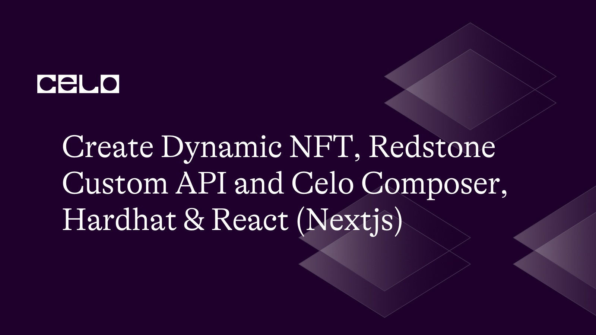

## Introdcution

Welcome to this tutorial, in this tutorial we will be building a Dynamic NFT using Celo composer together with Redstone Oracle Custom API Data.

We will be build an NFT pass for our exclusive boat club. In our boat club we will be minting an NFT pass for a new member just joining, in which case will be a Silver pass and overtime based on some business logic e.g how much the person spends in the club, how long they belong to the club or their status in the club.
The business upgrade their status to Gold which is the Second tier ot Platinum which is the top tier.

Using Redstone Oracle our smart contract will be able to check and know that a user level has changed and then trigger a change such that the holder of the NFT will see a different image and met descriptions on their NFT.

## Background Knowledge

Dynamic NTFs are NFT with encoded logic that allows them to change their metadata based on external conditions. A very popular example is the
LaMelo Ball Collectible that changes its metadata based on the player stats during the basketball season.

## Requirements

Before we begin, make sure to have a package manager installed on your machine. yarn and npm are perfect managers.

## Github Code

For your reference, you can use the completed tutorial [github code](https://github.com/alofeoluwafemi/dynamic-nft) and the [api code](https://github.com/alofeoluwafemi/dynamic-nft-for-membership-card).

## Project Preview


## Step 1: Bootstrap UI

From your terminal in your project directory, set up your project using Celo composer. Call your project name Dynamic NFT.

```bash
npx celo-composer create
```


Open the project in your preferred editor and install dependencies.

```bash
yarn
```


After successful dependencies installation using yarn. Launch the React app in celo composer to view our default canvas by running:

```bash
yarn react-app:dev
```


Open `react-app/pages/index.tsx` then replace it with this

```js
export default function Home() {
  return (
    <div>
      <div className="w-[450px] pb-4  bg-[#040404] mx-auto mt-20 rounded-xl">
        
        <div className="px-6">
          <p className="text-white font-bold mb-2">Silver Membership</p>
          <p className="text-white">
            Initial purchase includes a lifetime membership for the Stackshift
            Boat club.
          </p>
          <div className="mt-10 flex items-center gap-x-4">
            <h4 className="text-white flex-none text-sm font-semibold leading-6">
              What’s included
            </h4>
            <div className="text-white h-px flex-auto bg-gray-100"></div>
          </div>
          <ul
            role="list"
            className=" mt-8 grid grid-cols-1 gap-4 text-sm leading-6 text-gray-600 sm:grid-cols-2 sm:gap-6"
          >
            <li className="text-white flex gap-x-3">
              <svg
                className="h-6 w-5 flex-none text-indigo-600"
                viewBox="0 0 20 20"
                fill="#fff"
                aria-hidden="true"
              >
                <path
                  fill-rule="evenodd"
                  d="M16.704 4.153a.75.75 0 01.143 1.052l-8 10.5a.75.75 0 01-1.127.075l-4.5-4.5a.75.75 0 011.06-1.06l3.894 3.893 7.48-9.817a.75.75 0 011.05-.143z"
                  clipRule="evenodd"
                ></path>
              </svg>
              Private forum access
            </li>

            <li className="text-white flex gap-x-3">
              <svg
                className="text-white h-6 w-5 flex-none text-indigo-600"
                viewBox="0 0 20 20"
                fill="#fff"
              >
                <path
                  fill-rule="evenodd"
                  d="M16.704 4.153a.75.75 0 01.143 1.052l-8 10.5a.75.75 0 01-1.127.075l-4.5-4.5a.75.75 0 011.06-1.06l3.894 3.893 7.48-9.817a.75.75 0 011.05-.143z"
                  clipRule="evenodd"
                ></path>
              </svg>
              Member resources
            </li>

            <li className="text-white flex gap-x-3">
              <svg
                className="h-6 w-5 flex-none text-indigo-600"
                viewBox="0 0 20 20"
                fill="#fff"
              >
                <path
                  fill-rule="evenodd"
                  d="M16.704 4.153a.75.75 0 01.143 1.052l-8 10.5a.75.75 0 01-1.127.075l-4.5-4.5a.75.75 0 011.06-1.06l3.894 3.893 7.48-9.817a.75.75 0 011.05-.143z"
                  clipRule="evenodd"
                ></path>
              </svg>
              Annual conference
            </li>

            <li className="text-white flex gap-x-3">
              <svg
                className="h-6 w-5 flex-none text-indigo-600"
                viewBox="0 0 20 20"
                fill="#fff"
              >
                <path
                  fill-rule="evenodd"
                  d="M16.704 4.153a.75.75 0 01.143 1.052l-8 10.5a.75.75 0 01-1.127.075l-4.5-4.5a.75.75 0 011.06-1.06l3.894 3.893 7.48-9.817a.75.75 0 011.05-.143z"
                  clipRule="evenodd"
                ></path>
              </svg>
              Official member t-shirt
            </li>
          </ul>
        </div>
      </div>
    </div>
  );
}
```

Find and replace everywhere you see `fill-rule` with `fillRule`. To follow React syntax.

If you open up your `http://localhost:3000` again, it will be refreshed with the new UI. But our image is missing, so let us fix that up by creating folder `images/memberships` in the public folder and uploading the 3 images below inside there.

[Silver NFT](https://gateway.pinata.cloud/ipfs/QmNwMoD7euKmDE2dugXNWuiPgy7RNB4WkEkU3VuFcFVcj3/silver.gif)
[Gold NFT](https://gateway.pinata.cloud/ipfs/QmNwMoD7euKmDE2dugXNWuiPgy7RNB4WkEkU3VuFcFVcj3/gold.gif)
[Platinum NFT](https://gateway.pinata.cloud/ipfs/QmNwMoD7euKmDE2dugXNWuiPgy7RNB4WkEkU3VuFcFVcj3/platinum.gif)

Make sure the images name are `silver.gif`, `gold.gif` and `platinum.gif` respectively.

Now let us upload our images to IPFS using Pinnata, a pinning service for IPFS. Signup to [Pinnata](https://app.pinata.cloud/) and upload the whole plan folder there such that the result looks like this, allowing them to all share the same base image URL.


In the root folder of the project, create a folder called `plans` and inside there create 3 files, `silver.json`, `gold.json` and `platinum.json`. These fields will hold our NFT meta data.
We will be following Opensea metadata specification.

**silver.json**

```json
{
  "description": "Silver Membership",
  "image": "https://gateway.pinata.cloud/ipfs/QmNwMoD7euKmDE2dugXNWuiPgy7RNB4WkEkU3VuFcFVcj3/silver.gif",
  "name": "Silver Membership",
  "attributes": [
    {
      "trait_type": "private_forum_access",
      "value": true
    },
    {
      "trait_type": "discount_on_all_products",
      "value": true
    },
    {
      "trait_type": "annual_conference_pass",
      "value": false
    },
    {
      "trait_type": "club_swags",
      "value": false
    },
    {
      "trait_type": "personal_chaufer",
      "value": false
    },
    {
      "trait_type": "free_boat_rides",
      "value": false
    }
  ]
}
```

**gold.json**

```json
{
  "description": "Gold Memebership",
  "image": "https://gateway.pinata.cloud/ipfs/QmNwMoD7euKmDE2dugXNWuiPgy7RNB4WkEkU3VuFcFVcj3/gold.gif",
  "name": "Silver Memebership",
  "attributes": [
    {
      "trait_type": "private_forum_access",
      "value": true
    },
    {
      "trait_type": "discount_on_all_products",
      "value": true
    },
    {
      "trait_type": "annual_conference_pass",
      "value": true
    },
    {
      "trait_type": "club_swags",
      "value": true
    },
    {
      "trait_type": "personal_chaufer",
      "value": false
    },
    {
      "trait_type": "free_boat_rides",
      "value": false
    }
  ]
}
```

**platinum.json**

```json
{
  "description": "Platinum Memebership",
  "image": "https://gateway.pinata.cloud/ipfs/QmNwMoD7euKmDE2dugXNWuiPgy7RNB4WkEkU3VuFcFVcj3/platinum.gif",
  "attributes": [
    {
      "trait_type": "private_forum_access",
      "value": true
    },
    {
      "trait_type": "discount_on_all_products",
      "value": true
    },
    {
      "trait_type": "annual_conference_pass",
      "value": true
    },
    {
      "trait_type": "club_swags",
      "value": true
    },
    {
      "trait_type": "personal_chaufer",
      "value": true
    },
    {
      "trait_type": "free_boat_rides",
      "value": true
    }
  ]
}
```

Again upload this folder as a whole, on using Pinnata. This ensures the all have the same base URL and by the last URL path between `silver.json`, `gold.json` and `platinum.json` make sit straightforward to use in our smart contract.


## Step 2: Dynamic NFT API (The Backend)

Remember we said based on some logic defined by the Boat Club, the level of access changes for a member. So how does how smart contract knows about this?

From the Boat Club Database or API, it checks what level a user is and then upadates the membership on the smart contract accordingly. What we want to do next is to create a simple express js API in Node.

From your terminal and in your workspace directory create a new project and do npm init.

```bash
mkdir dynamic-nft-api
cd dynamic-nft
npm init
```

Open the project in your code editor and update the rest of the files as seen below. One thing to note is that we are adding the Vercel configuration file so that we can easily host our simple API on vercel.


**.gitignore**

```bash
node_modules
```

**index.js**

You can change the address in the URL to yours if you which. But in this tutorial since we are not hitting a live DB, it won't matter. The response will be static ad we can update it manually.

```js
const express = require("express");

const app = express();

app.get("/", (req, res) => {
  res.send("Hello World!");
});

app.get(
  "/membership/0x2A6B7BA38BD8BED065C68361c383A77C160C5Fd7",
  (req, res) => {
    res.json({
      level: 1, // 0 = silver, 1 = gold, 2 = platinum
    });
  }
);

app.listen(8090, () => {
  console.log("Server running on port 8090");
});
```

**vercel.json**

```js
{
    "version": 2,
    "builds": [
        {
            "src": "index.js",
            "use": "@now/node"
        }
    ],
    "routes": [
        {
            "src": "/(.*)",
            "dest": "index.js"
        }
    ]
}
```

Now push this to your Github, then link the repository to Vercel so that it can be deployed live for free.

Ours was deployed on thsi domain by vercel https://dynamic-nft-api.vercel.app.


## Step 4: Upload Custom API to Redstone

If you visit https://dynamic-nft-api.vercel.app/membership/0x2A6B7BA38BD8BED065C68361c383A77C160C5Fd7, now you should be getting json response

```json
{
  "level": 1
}
```

Don't forget to use your own URL if you deployed using Vercel too. But it's fine to just go with this one if you plan to do so.

Visit https://custom.redstone.finance/, click on create new and then follow the screenshot to create your own custom API data.

**Step A**


**Step B**


**Step C**


What you need to note is the **ID**

For now that okay.

## Step 5: Deploy Smart Contract

The first thing we have to do before proceeding to start coding our Smart contract is to generate a wallet and fund it with some test Celo.
Luckily for us the Celo composer package comes with a command to do just that.

```bash
cd packages/hardhat
npx hardhat create-account
```

If you encounter this problem when you run this command. Simply open your `hardhatconfig.js` and remove the waffle import. It will fix it


When the command runs successfully, you should see a private key generate for you and the public address too.

Copy your public address and visit https://faucet.celo.org and request some test faucet.

Delete all the files in the `hardhat/contracts` folder and the `hardhat/test` folder.

We will not be going depth into the explanation of the smart contract, but its simple and straight forward. However the video tutorial does more justice to that.
Tha said, create a file `Membership.sol` in the smart contract folder and paster the below.

**Membership.sol**

```solidity
// SPDX-License-Identifier: MIT
pragma solidity ^0.8.9;

import "@openzeppelin/contracts/token/ERC721/ERC721.sol";
import "@openzeppelin/contracts/token/ERC721/extensions/ERC721URIStorage.sol";
import "@openzeppelin/contracts/access/Ownable.sol";
import "@openzeppelin/contracts/utils/Counters.sol";
import "@redstone-finance/evm-connector/contracts/data-services/CustomUrlsConsumerBase.sol";

contract Membership is
    ERC721,
    ERC721URIStorage,
    Ownable,
    CustomUrlsConsumerBase
{
    using Counters for Counters.Counter;

    Counters.Counter private _tokenIdCounter;

    uint256 public lastAnswer;

    constructor() ERC721("Membership", "MMS") {}

    function _baseURI() internal pure override returns (string memory) {
        return
            "https://gateway.pinata.cloud/ipfs/Qme74zLzhAU7umzG2GG96wTPtogV5xh7pKGvBRUEFGxZHX/";
    }

    function safeMint(address to, string memory uri) public onlyOwner {
        uint256 tokenId = _tokenIdCounter.current();

        _tokenIdCounter.increment();
        _safeMint(to, tokenId);
        _setTokenURI(tokenId, uri);
    }

    // The following functions are overrides required by Solidity.

    function _burn(
        uint256 tokenId
    ) internal override(ERC721, ERC721URIStorage) {
        super._burn(tokenId);
    }

    function tokenURI(
        uint256 tokenId
    ) public view override(ERC721, ERC721URIStorage) returns (string memory) {
        return super.tokenURI(tokenId);
    }

    function updateMembership(uint256 tokenId) public onlyOwner {
        uint256 membership = getOracleNumericValueFromTxMsg(
            bytes32("0x1774675b9bc5ae5c")
        );

        lastAnswer = membership;

        string memory uri = "silver.json";

        if (membership == 0) {
            uri = "silver.json";
        } else if (membership == 10**8) {
            uri = "gold.json";
        } else if (membership == 20**8) {
            uri = "platinum.json";
        }

        _setTokenURI(tokenId, uri);
    }
}
```

In the hardhat folder in your terminal, install the Redstone connector using yarn

```bash
yarn add @redstone-finance/evm-connector
```

Three things to note hear:

1. The `updateMembership` function will be triggered when the API make changes to the user membership. It updates the user NFT metadata between the 3 membership levels
2. The `bytes32("0x1774675b9bc5ae5c")`, replace it with the ID earlier from Redstone.
3. The `_setTokenURI(tokenId, uri)` is wher ethe magic of updating the metadata URL happens.

In the `hardhat/test` folder create `membership_test.js` file and paste the below code.

```js
const { assert, expect } = require("chai");
const { ethers } = require("hardhat");
const { before } = require("mocha");
const { WrapperBuilder } = require("@redstone-finance/evm-connector");

before(async function () {
  const [deployer] = await ethers.getSigners();
  const Membership = await ethers.getContractFactory("Membership");
  const membership = await Membership.deploy();
  await membership.deployed();

  this.membership = membership;
  this.deployer = deployer;
});

describe("Membership", function () {
  it("Should mint a new nft for user", async function () {
    const res = await this.membership.safeMint(
      this.deployer.address,
      "silver.json"
    );

    await res.wait();

    const balance = await this.membership.balanceOf(this.deployer.address);

    assert.equal(balance, 1);
  });

  it("Should confirm owner of token", async function () {
    const owner = await this.membership.ownerOf(0);
    assert.equal(owner, this.deployer.address);
  });

  it("Should confirm token URI", async function () {
    const tokenUri = await this.membership.tokenURI(0);

    assert.equal(
      tokenUri,
      "https://gateway.pinata.cloud/ipfs/Qme74zLzhAU7umzG2GG96wTPtogV5xh7pKGvBRUEFGxZHX/silver.json"
    );
  });

  it("Should update membership from Silver to Gold", async function () {
    const membershipRes = await fetch(
      "https://dynamic-nft-for-membership-card.vercel.app/membership/0x3472059945ee170660a9A97892a3cf77857Eba3A"
    );

    const body = await membershipRes.json();

    //When membership is upgraded Gold
    if (body.level === 1) {
      const wrappedContract = WrapperBuilder.wrap(
        this.membership
      ).usingDataService(
        {
          dataServiceId: "redstone-custom-urls-demo",
          uniqueSignersCount: 2,
          dataFeeds: ["0x1774675b9bc5ae5c"],
        },
        ["https://d1zm8lxy9v2ddd.cloudfront.net"]
      );

      // Interact with the contract (getting oracle value securely)
      const res = await wrappedContract.updateMembership(0);

      await res.wait();

      const tokenUri = await this.membership.tokenURI(0);

      assert.equal(
        tokenUri,
        "https://gateway.pinata.cloud/ipfs/Qme74zLzhAU7umzG2GG96wTPtogV5xh7pKGvBRUEFGxZHX/gold.json"
      );
    }
  });
});
```

Change the value of `dataFeeds` in the last test to your own Redstone ID, same as you used in the contract.

From the `hardhat` folder.

```bash
npx hardhart test
```


## Step 6: Deploy Contract

In thw deploy folder replace the `00-deploy.js`

```js
module.exports = async ({ getNamedAccounts, deployments }) => {
  const { deploy } = deployments;
  const { deployer } = await getNamedAccounts();

  await deploy("Membership", {
    from: deployer,
    args: [],
    log: true,
  });
};

module.exports.tags = ["Membership"];
```

Run from the terminal

```bash
npx hardhat deploy
```


Note the Deployed contract address. We will be needing it moving forward.

## Step 7: Scripts

Let us write some scripts to carry out some operations for our NFT contracts. Go the `hardhat/scripts` folder and create the following scripts, see the explanation of each scripts below.

NB: **In all the scripts remember to change the address in attach to your deployed Membership contract address**

1. **mint-safe-001.js**: The mint script as the name implies will mint a membership nft to our address.
2. **confirm-token-uri-002.js**: This script will print out the token URL of our newly minted NFT, and we can confirm it's the silver NFT minted
3. **confirm-token-owner-003.js**: This script prints out your deployer address as the NFT owner.
4. **update-membership-004.js**: This is the most important script of all. In production, this is the script that will be running periodically to trigger the smart contract to check and upgrade the metadata of user NFT based on response from server. As you will see shortly, once we update our API level from `0` to `1` and run this script our NFT as displayed will change image and metatags 😍.

**mint-safe-001.js**

```js
async function main() {
  const [deployer] = await ethers.getSigners();

  // We get the contract to deploy
  const Membership = await hre.ethers.getContractFactory("Membership");
  const membership = await Membership.attach(
    "0xA39EaF77c0524417F5D6261A3267c40d8036c9AF"
  );

  const res = await membership.safeMint(deployer.address, "silver.json");

  const ok = await res.wait();

  console.log(ok);
}

// We recommend this pattern to be able to use async/await everywhere
// and properly handle errors.
main()
  .then(() => process.exit(0))
  .catch((error) => {
    console.error(error);
    process.exit(1);
  });
```

Run using `npx hardhat run --network alfajores scripts/mint-safe-001.js`.

**confirm-token-uri-002.js**

```js
async function main() {
  const [deployer] = await ethers.getSigners();

  // We get the contract to deploy
  const Membership = await hre.ethers.getContractFactory("Membership");
  const membership = await Membership.attach(
    "0xA39EaF77c0524417F5D6261A3267c40d8036c9AF"
  );

  const tokenUri = await membership.tokenURI(0);

  console.table({ tokenUri });
}

// We recommend this pattern to be able to use async/await everywhere
// and properly handle errors.
main()
  .then(() => process.exit(0))
  .catch((error) => {
    console.error(error);
    process.exit(1);
  });
```

Run using `npx hardhat run --network alfajores scripts/confirm-token-uri-002.js`

**confirm-token-owner-003.js**

```js
async function main() {
  const [deployer] = await ethers.getSigners();

  // We get the contract to deploy
  const Membership = await hre.ethers.getContractFactory("Membership");
  const membership = await Membership.attach(
    "0xA39EaF77c0524417F5D6261A3267c40d8036c9AF"
  );

  const owner = await membership.ownerOf(0);

  console.table({ owner });
}

// We recommend this pattern to be able to use async/await everywhere
// and properly handle errors.
main()
  .then(() => process.exit(0))
  .catch((error) => {
    console.error(error);
    process.exit(1);
  });
```

Run using `npx hardhat run --network alfajores scripts/confirm-token-owner-003.js`

**update-membership-004.js**

```js
async function main() {
  const [deployer] = await ethers.getSigners();
  const { WrapperBuilder } = require("@redstone-finance/evm-connector");

  // We get the contract to deploy
  const Membership = await hre.ethers.getContractFactory("Membership");
  const membership = await Membership.attach(
    "0xA39EaF77c0524417F5D6261A3267c40d8036c9AF"
  );

  const wrappedContract = WrapperBuilder.wrap(membership).usingDataService(
    {
      dataServiceId: "redstone-custom-urls-demo",
      uniqueSignersCount: 2,
      dataFeeds: ["0x1774675b9bc5ae5c"],
    },
    ["https://d1zm8lxy9v2ddd.cloudfront.net"]
  );

  // Interact with the contract (getting oracle value securely)
  const res = await wrappedContract.updateMembership(0);

  await res.wait();

  const tokenUri = await membership.tokenURI(0);

  console.table({ tokenUri });
}

// We recommend this pattern to be able to use async/await everywhere
// and properly handle errors.
main()
  .then(() => process.exit(0))
  .catch((error) => {
    console.error(error);
    process.exit(1);
  });
```

Don't run this script yet. Let us display our NFT on the UI and then change the value of level from our NFT API from `0` to `1` i.e. Change the membership level from Silver to Gold.

## Step 8: Display NFT

To display our NFT, update the `react-app/pages/index.tsx` file.

```js
import React, { useEffect, useState } from "react";
import {
  abi as mAbi,
  address as mAddress,
} from "@dynamic-nft/hardhat/deployments/alfajores/Membership.json";
import { useCelo } from "@celo/react-celo";
import { parseEther } from "ethers/lib/utils.js";

const capitalized = (word: string) =>
  word.charAt(0).toUpperCase() + word.slice(1);

export default function Home() {
  const [membership, setMembership] = useState(null);
  const { kit, address } = useCelo();
  const membershipContract = new kit.connection.web3.eth.Contract(
    mAbi,
    mAddress
  );

  useEffect(() => {
    const getMembership = async () => {
      const uri = await membershipContract.methods.tokenURI(0).call();

      if (uri) {
        const pinnataRes = await fetch(uri);
        const data = await pinnataRes.json();

        console.log(data);

        setMembership(data);
      }
    };

    getMembership();
  }, [address]);

  const perkComponent = (perk: string) => {
    let trait = perk.split("_");
    trait[0] = capitalized(trait[0]);

    return (
      <li key={perk} className="text-white flex gap-x-3">
        <svg
          className="h-6 w-5 flex-none text-indigo-600"
          viewBox="0 0 20 20"
          fill="#fff"
          aria-hidden="true"
        >
          <path
            fillRule="evenodd"
            d="M16.704 4.153a.75.75 0 01.143 1.052l-8 10.5a.75.75 0 01-1.127.075l-4.5-4.5a.75.75 0 011.06-1.06l3.894 3.893 7.48-9.817a.75.75 0 011.05-.143z"
            clipRule="evenodd"
          ></path>
        </svg>
        {trait.join(" ")}
      </li>
    );
  };

  return membership == null ? (
    ""
  ) : (
    <div className="w-[450px] pb-10  bg-[#040404] mx-auto rounded-xl">
      
      <div className="px-6">
        <p className="text-white font-bold mb-2">{membership.name} #ID 0</p>
        <p className="text-white">
          Initial purchase includes a lifetime membership for the Stackshift
          Boat club.
        </p>
        <div className="mt-10 flex items-center gap-x-4">
          <h4 className="text-white flex-none text-sm font-semibold leading-6">
            What’s included
          </h4>
          <div className="text-white h-px flex-auto bg-gray-100"></div>
        </div>
        <ul
          role="list"
          className=" mt-8 grid grid-cols-1 gap-4 text-sm leading-6 text-gray-600 sm:grid-cols-2 sm:gap-6"
        >
          {membership.attributes.map(
            (attribute) =>
              attribute.value == true && perkComponent(attribute.trait_type)
          )}
        </ul>

        <p className="mt-6 text-xs leading-5 text-white text-center">
          Add more to your club balance to earn more perks
        </p>
      </div>
    </div>
  );
}
```

If you visit `http://localhost:3000` you will now see your silver membership NFT display.

## Step 9: Final!

Go back to the `index.js` of the NFT API and change the value of level from 0 to 1, so that calling the API will return below

```js
{
  level: 1;
}
```

We use 0 - 2 to represent membership levels.

1. 0 => Silver
2. 1 => Gold
3. 2 => Platinum

You can also change it to 2 if you want to see your NFT change to Platinum membership.

Push the updated NFT API to Github so Vercel can redeploy the update. Confirm by trying it out on the Custom API page or visiting the URL.

Now run the fourth script from before

```bash
npx hardhat run --network alfajores scripts/update-membership-004.js
```

If you revisit `http://localhost:3000` you will now see your gold membership NFT display with updated metadata. You can easily downgrade or update the user NFT membership without the NFT id changing

Congratulation on building a dynamic NFT 🥳🥳

## Conclusion

Dynamic NFT is a next level upgrade to the limitation of NFT. Now projects have the luxury to test out audience reaction to different designs and upgrades and its easy to reward users with upgrades on thier existing NFTs.

## About Author

Oluwafemi Alofe is a Blockchain developer with 3 years of applicable knowledge and 8 years of total experience as a Software engineer. He has written and deployed vulnerability-free smart contracts as a blockchain developer on a variety of blockchains, including but not limited to Ethereum, BCS, and Celo. Oluwafemi has a strong interest in developing distributed systems, and continues to learn new things every day to stay current with technological advancements.

He is has two [Udemy courses on solidity development](https://www.udemy.com/user/alofeoluwafemi/) with over 6,300 student enrolled and also a book on [Amazon KDP](https://www.amazon.com/Beginning-PHP-Laravel-approach-Inventory-ebook/dp/B086434XWV/) for PHP and Laravel Developers.

He's currently a platform owner at [myco.io](https://myco.io), first world, watch to earn platform with over 1 Million users.

Connect with Oluwafemi on [Twitter](https://twitter.com/alofeoluwafemi_) or [Linkedin](https://www.linkedin.com/in/oluwafemialofe/).
