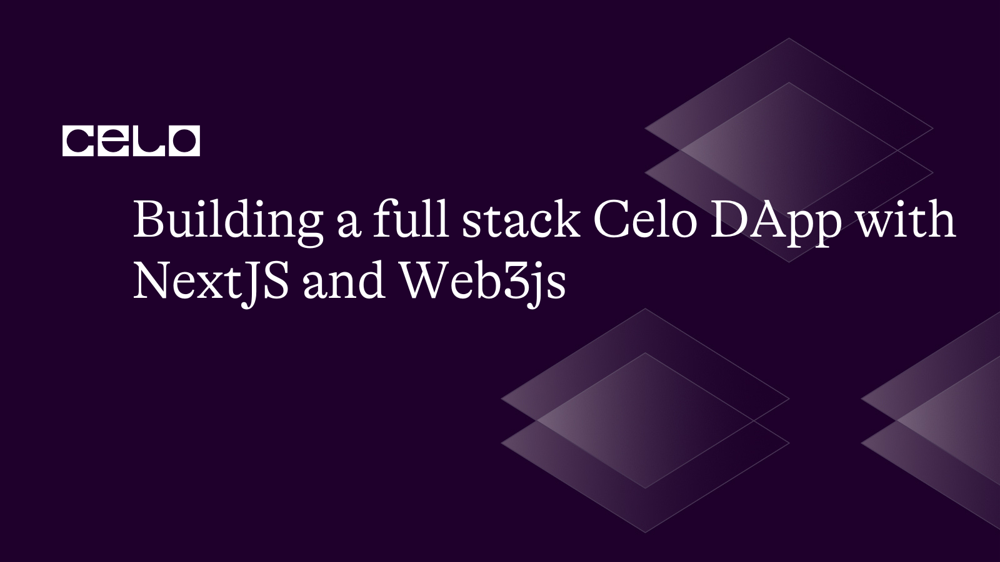
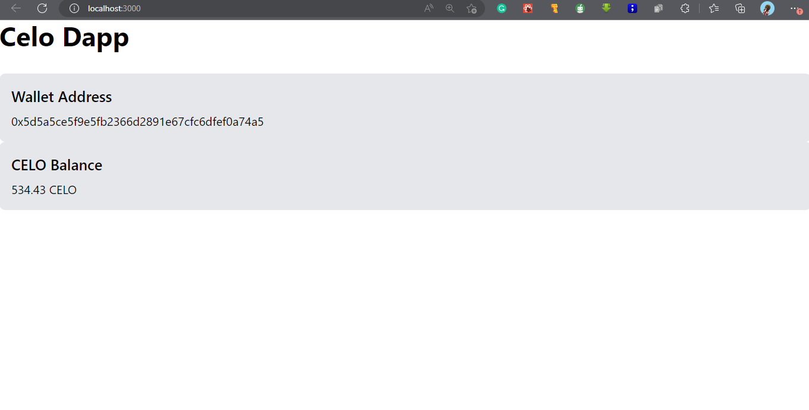

## Introduction

Celo is a blockchain platform focused on creating inclusive financial systems. To build decentralized applications on Celo, developers can use a variety of tools and programming languages, including NextJS and `web3.js`. NextJS is a popular framework for building server-side rendered React applications, while web3.js is a JavaScript library that provides a programming interface for interacting with Ethereum-based blockchains, including Celo.
The `@celo/contractkit` package makes it easy to build Celo DApps using these tools. This package provides a simplified programming interface for interacting with Celo intelligent contracts, which abstracts away many of the low-level details of interacting with the blockchain.

By using NextJS, web3.js, @celo-tools/use-contractkit, and the @celo/contractkit package, developers can build fast, scalable, and accessible Celo DApps. Anyone with an internet connection can access these DApps and can provide innovative financial services to underserved communities around the world.

## Prerequisites

Before we get started, let’s make sure we have everything set up and installed:

- Node.js (v14 or later)
- NPM (v6 or later)
- Git
- NextJS/JavaScript

## Creating NextJS App

It is simple as running the command prescribed by the NextJS team in the documentation. It is a good skill and ability to have as a developer to be able to break ground, being able to follow the documentation. Execute the below command to create one.

```bash
npx create-next-app my-dapp
```

This will create a new directory called `my-dapp` with a basic NextJS app from the directory you ran the command from.

## Move into the app environment

Now that you have created the app using the command provided for you, up next is to move into the app-created environment with a simple run of the below command.

```bash
cd my-app
```

## Styling setup

To beautify our app and make it looks more appealing to every user. It is important to setup a simple but beautiful styling techniques. There are thousands of ways of doing it, ranging from writing simple CSS to using frameworks and libraries. To leverage available technology we will be using TailwindCSS and it is time to set it up using the below commands and steps.

- Step 1: Install Dependencies

```bash
npm install tailwindcss postcss-preset-env postcss-flexbugs-fixes
```

The above command installs every dependency needed for the TailwindCSS to execute and works.

- Step 2: TailwindCSS Configuration
  Once the installation is complete, create a new file called `tailwind.config.js` in the root directory of your project and add the following code:

```javascript
module.exports = {
  mode: "jit",
  purge: ["./pages/**/*.{js,ts,jsx,tsx}", "./components/**/*.{js,ts,jsx,tsx}"],
  darkMode: false, // or 'media' or 'class'
  theme: {
    extend: {},
  },
  variants: {
    extend: {},
  },
  plugins: [],
};
```

- Step 3: CSS Configuration
  Then, create a new file called `postcss.config.js` in the root directory of your project and add the following code and add up the code below in it.

```javascript
module.exports = {
  plugins: {
    tailwindcss: {},
    autoprefixer: {},
  },
};
```

- Step 4: The CSS needed
  Finally, at this styling configuration stage, create a new file (if not exist) called `globals.css` in the `styles/ directory` of your project and add the following code.

```css
@import "tailwindcss/base";
@import "tailwindcss/components";
@import "tailwindcss/utilities";
```

## Web3JS setup

- Step 1: What is Web3JS?
  Web3.js is a JavaScript library that provides a way to interact with the Ethereum blockchain and other compatible blockchains such as Celo, Binance Smart Chain, and others. It is used by developers to build decentralized applications (Dapps) that can read and write data to the blockchain.
  Web3.js allows developers to interact with the blockchain by providing an API that abstracts away the low-level details of interacting with the blockchain, such as handling the encoding and decoding of transactions and interacting with smart contracts. With Web3.js, developers can send and receive transactions, deploy smart contracts, call methods on smart contracts, and more.
  Web3.js is the most widely used library for building decentralized applications on Ethereum and other compatible blockchains. It is actively developed and maintained by the Ethereum Foundation and has a large community of developers contributing to its development.

- Step 2: Install the package
  Next, install Web3.js by running the below command in your terminal.

```bash
npm install web3
```

- Step 3: Create web3.js
  It is time to create a new file called `web3.js` in the `utils/` directory of your project and add the following code.

```javascript
import Web3 from "web3";
let web3;
if (typeof window !== "undefined" && typeof window.ethereum !== "undefined") {
  // We are in the browser and metamask is running.
  window.ethereum.request({ method: "eth_requestAccounts" });
  web3 = new Web3(window.ethereum);
} else {
  // We are on the server *OR* the user is not running metamask.
  const provider = new Web3.providers.HttpProvider(
    process.env.NEXT_PUBLIC_RPC_URL
  );
  web3 = new Web3(provider);
}
export default web3;
```

This code sets up a Web3 instance that can be used to interact with the Celo blockchain. It checks if the user is running MetaMask in their browser, and if so, uses that as the provider. If not, it uses a default HTTP provider.

## Celo Setup

- Step 1: What is CeloJS
  There is no specific library or framework called `celojs`. However, there are several libraries and tools available for developers who are building on the Celo blockchain.
  One of the most commonly used libraries is `@celo/contractki`t, which is an open-source JavaScript library that provides a simple and easy-to-use interface for interacting with the Celo blockchain. It abstracts away many of the low-level details of working with the Celo blockchain, such as handling transaction encoding and decoding, gas fees, and interacting with smart contracts.
  The `@celo/contractkit` library is built on top of Web3.js and provides additional functionality specifically for working with the Celo blockchain. It also includes features such as support for the stablecoin, `cUSD`, and the ability to send and receive payments on the Celo network.
  In addition to the `@celo/contractkit` library, there are also other tools and libraries available for building on the Celo blockchain, such as `@celo-tools/use-contractkit` - now deprecated for React developers and the Celo WalletConnect SDK for integrating with the Celo WalletConnect mobile app.
  For this tutorial, we will stick with the `@celo/contractkit` package.

- Step 2: Install the package
  Next, install`@celo/contractkit` by running the below command in your terminal:

```bash
npm install @celo/contractkit
```

- Step 3: Create celo.js
  Then, create a new file called `celo.js` in the `utils/ directory` of your project and add the code as follows.

```javascript
import { ContractKit } from "@celo/contractkit";
let kit;
if (typeof window !== "undefined" && typeof window.ethereum !== "undefined") {
  // We are in the browser and metamask is running.
  window.ethereum.request({ method: "eth_requestAccounts" });
  kit = ContractKit.newKitFromWeb3(web3);
} else {
  // We are on the server OR the user is not running metamask.
  kit = ContractKit.newKit(process.env.NEXT_PUBLIC_RPC_URL);
}
export default kit;
```

This code sets up a `ContractKit` instance that can be used to interact with the Celo smart contracts. It uses the `web3.js` instance we created in the Step above to create the `ContractKit` instance.
Add a Celo wallet component
Next, create a new file called `CeloWallet.js` in the `components/` directory of your project and add the following code:

```javascript
import { useEffect, useState } from "react";
import { newKitFromWeb3 } from "@celo/contractkit";
const CeloWallet = () => {
  const [walletAddress, setWalletAddress] = useState("");
  useEffect(() => {
    const getWalletAddress = async () => {
      // Initialize ContractKit with the network endpoint
      const web3 = new Web3("https://alfajores-forno.celo-testnet.org");
      const kit = newKitFromWeb3(web3);
      // Get the user's accounts
      const accounts = await kit.web3.eth.getAccounts();
      // Set the wallet address
      setWalletAddress(accounts[0]);
    };
    getWalletAddress();
  }, []);
  return (
    <div className="bg-gray-200 p-4 rounded-lg">
      <p className="text-xl font-medium mb-2">Wallet Address</p>
      <p>{walletAddress}</p>
    </div>
  );
};
export default CeloWallet;
```

In the code above we use the newKitFromWeb3 function to initialize the kit instance with the web3 provider for the Alfajores test network. We then use kit.web3.eth.getAccounts() to get the user's accounts and set the wallet address.
Add a Celo balance component
Next, create a new file called CeloBalance.js in the components/ directory of your project and add the following code.

```javascript
import { useEffect, useState } from "react";
import { newKitFromWeb3 } from "@celo/contractkit";
const CeloBalance = () => {
  const [balance, setBalance] = useState("");
  useEffect(() => {
    const getBalance = async () => {
      // Initialize ContractKit with the network endpoint
      const web3 = new Web3("https://alfajores-forno.celo-testnet.org");
      const kit = newKitFromWeb3(web3);
      // Get the user's accounts
      const accounts = await kit.web3.eth.getAccounts();
      const account = accounts[0];
      // Get the user's CELO balance
      const celoBalance = await kit.getTotalBalance(account);
      const celoBalanceString = celoBalance.toFixed();
      // Set the balance state
      setBalance(celoBalanceString);
    };
    getBalance();
  }, []);
  return (
    <div className="bg-gray-200 p-4 rounded-lg">
      <p className="text-xl font-medium mb-2">CELO Balance</p>
      <p>{balance} CELO</p>
    </div>
  );
};
export default CeloBalance;
```

We again use the newKitFromWeb3 function to initialize the kit instance with the web3 provider for the Alfajores test network. We then use kit.getTotalBalance() to get the user's CELO balance and set the balance state. Note that getTotalBalance() returns a BigNumber object, so we use toFixed() to convert it to a string.
Landing Page
Finally, update the index.js file in the pages/ directory of your project to include the CeloWallet and CeloBalance components we created in Steps 5 and 6. Here's the updated code

```javascript
import Head from "next/head";
import CeloWallet from "./components/CeloBalance";
import CeloBalance from "./components/CeloBalance";

export default function Home() {
  return (
    <div>
      <Head>
        <title>Celo Dapp</title>
        <link rel="icon" href="/favicon.ico" />
      </Head>
      <main>
        <h1 className="text-4xl font-bold mb-8">Celo Dapp</h1>
        <CeloWallet />
        <CeloBalance />
      </main>
    </div>
  );
}
```

This code updates the `index.js` file to include the `CeloWallet` and `CeloBalance` components we created earlier.
Test
That's it! You've created a basic Celo Dapp using Next.js, Web3.js, and Tailwind CSS. To run the app, run the following command in your project directory:

```bash
npm run dev
```

This will start the development server and you can view the app by navigating to `http://localhost:3000` in your web browser.


## Conclusion

In this tutorial, you learned how to create a Celo Dapp using Next.js, Web3.js, and Tailwind CSS. You learned how to set up a Web3 provider, a ContractKit instance, and how to use the `@celo/contractkit` library to access the user's Celo wallet address and to connect their wallet. You also learned how to fetch the user's CELO balance and display it on the page. With this knowledge, you can start building more advanced Celo Dapps that interact with the Celo smart contracts. Here is the [GitHub repository](https://github.com/Taiwrash/celoxnextjs) for the article

## About the Author

Hey, I am Rasheed Mudasiru. A software developer who is passionate about community, open source and developer relations: I write about DevOps, automation, deployments and cloud computing.
