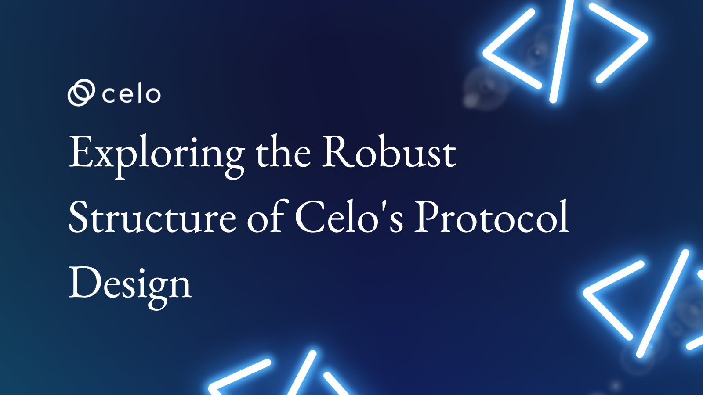

## Exploring the Robust Structure of Celo's Protocol Design

Celo's protocol design offers a strong and reliable framework that leverages blockchain technology to establish a decentralized platform for financial services. In this article, we will examine the robust structure of Celo's protocol in detail, including its consensus mechanism, token economics, and governance model.

Whether you're an experienced blockchain professional or just starting out, this article provides a comprehensive overview of Celo's innovative protocol design, revealing its unique features and the potential impact it could have on the financial industry. Get ready to delve into the technicalities of Celo's protocol and discover why it stands out as a leader in the blockchain world.
Here's an overview of what we'll cover

- ✅ Introduction to Celo’s blockchain technology
- ✅ Overview of Celo’s Protocol Design
- ✅ Celo’s Protocol Design
- ✅ Benefits of Celo’s Protocol Design
- ✅ Use cases for Celo’s Protocol Design
- ✅ Conclusion

## Introduction to Celo’s blockchain technology

Celo is a mobile-first blockchain that makes decentralized financial (DeFi) tools and services accessible to anyone with a mobile phone.  It is an open-source blockchain platform that prioritizes mobile accessibility and aims to make decentralized financial (DeFi) tools and services available to anyone with a mobile phone. By enabling easy sending, receiving, and storage of digital currencies, Celo seeks to create a more inclusive financial system.

The unique mobile-first design of Celo's blockchain technology enables users to utilize the platform without a traditional bank account. The platform's mission is to promote financial inclusion and give underserved populations around the world access to digital currencies, and this accessibility is a crucial part of that mission.

Celo's blockchain technology serves as a great basis for a variety of decentralized apps and use cases because of its scalability, usability, and security. As a result, it is suitable for assisting a variety of efforts within the decentralized banking sector and elsewhere.

## Overview of Celo’s Protocol Design

Celo is a decentralized platform that enables secure, fast, and affordable financial transactions using blockchain technology. Celo’s protocol design is a robust structure that combines various features to create a decentralized platform that is accessible to everyone. We will explore the key components of Celo’s protocol design that make it a unique and robust platform.

## Celo’s Protocol Design

The Celo blockchain and Celo Core Contracts together comprise the Celo Protocol. This term describes both what services the decentralized Celo network provides to applications and the way in which nodes in the network cooperate to achieve this. This section introduces some of these services.

### Consensus Mechanism

Blockchain platforms use consensus mechanisms as a kind of verification to confirm that transactions are in sync and to decide whether a transaction is valid before adding it to the blockchain.

Proof-of-stake (PoS) is the base of Celo's consensus algorithm. This implies that the quantity of cUSD, Celo's stablecoin, that a user stakes on the network determine which validators are picked to perform the task of verifying transactions and adding them to the blockchain. Compared to conventional proof-of-work (PoW) blockchains like Bitcoin, this leads to a system that is cheaper, faster, more scalable , and energy-efficient.

One of the unique features of Celo’s PoS consensus mechanism, is its scalability. Because the validators are selected based on their stake rather than through a resource-intensive mining process, the network can handle a large number of transactions without experiencing congestion or delays.

### Celo’s Stablecoins

Celo's stablecoin ecosystem offers users a secure and uncomplicated method to transfer money globally, pay for goods and services, and save money in a stable currency. The ecosystem comprises cUSD, cEUR, and cREAL, each pegged to the US dollar, euro, and Brazilian Real, respectively. cUSD is an ideal stablecoin for sending money to friends or purchasing goods and services, while cEUR offers a reliable way to transfer funds and make purchases in Europe. cREAL caters to the needs of many Brazilians who lack access to traditional financial services and can be used to send money to family and friends or pay for goods and services.

All three stablecoins run on Celo's blockchain platform, which employs a proof-of-stake consensus algorithm that enables swift and secure transactions. cUSD has a unique characteristic in that it is supported by a reserve of other cryptocurrencies, which enhances its stability and reduces the risk of price fluctuations. This reserve is held in a smart contract that is open to auditing by anyone, making the stablecoin more transparent and dependable.

### Governance

Celo’s governance model is designed to ensure that the network remains decentralized and community-driven. Celo uses a hybrid governance model, which combines on-chain and off-chain decision-making processes. This means that decisions are made by both the community and the protocol itself.

The on-chain governance process involves proposals that are submitted by anyone on the network….These proposals are voted on by the community, and if they receive enough votes, they are implemented. The off-chain governance process involves a Council of Validators, which is responsible for making decisions related to the protocol’s development and maintenance.

The concept that Celo has developed as a means to encourage participation is what distinguishes its governance model from others. User rewards in the form of cUSD can be earned by participating in the on-chain governance process. This encourages more people to participate and aids in the growth of celo network.

### Mobile-first Design

Celo is a Mobile-First Blockchain with an ultra-light client for low-end mobile devices. Celo’s mobile-first design is a key component of its protocol design.  It is more inclusive and user-friendly because it is made to be available to anybody with a smartphone. This is significant because despite having access to smartphones, millions of people worldwide lack access to traditional banking services

Phone numbers are used as addresses, which is a unique aspect of Celo's mobile-first design. As users may conduct business with others using their phone connections, sending and receiving payments is made simpler. As users do not need to remember sophisticated addresses or public keys, the usage of phone numbers also lowers the likelihood of transaction errors.

### Ecosystem and Partnerships

Celo's protocol design places great importance on its ecosystem and partnerships. By collaborating with a variety of organizations, such as nonprofits, governments, and businesses, the platform aims to promote financial inclusivity.
One noteworthy aspect of Celo's ecosystem is the Celo Foundation. This organization is responsible for overseeing the development and expansion of the network. It offers funding to developers and entrepreneurs who are building applications on the Celo platform, which encourages creativity and bolsters the growth of the ecosystem.

Celo has also joined forces with multiple businesses, including payment providers and remittance companies, to simplify cross-border transactions and enhance financial accessibility in less developed countries. These partnerships help to broaden the scope and influence of the Celo platform, making it possible for more individuals to access reliable and cost-effective financial services.

### Security

Celo's platform is designed with security in mind and incorporates several features to safeguard against potential threats. One of the most notable security measures is the use of multi-party computation (MPC) to secure private keys.

MPC is a cryptographic technique that enables multiple parties to compute a function collectively while keeping their inputs confidential. In the case of Celo, private keys are secured using MPC, which decreases the chances of vulnerabilities and safeguards against attacks by minimizing single points of failure.

Celo employs a system of smart contracts to automate and implement the rules of the network. These smart contracts undergo rigorous third-party security audits to guarantee that they are secure and devoid of vulnerabilities.

Celo's consensus mechanism relies on a PoS algorithm that helps ensure the platform's resiliency and security. Validators are required to stake their own assets on the network, which incentivizes them to act in the network's best interests and prevents malicious behavior.

### Smart Contracts

Smart contracts are an integral part of Celo's design protocol. These self-executing computer programs are in charge of implementing the network's policies, including the distribution of cash among users. Celo's smart contract platform has been audited by third-party security firms to ensure that the code is secure and free from vulnerabilities.

The smart contract platform from Celo is made to be user-friendly for developers, which promotes creativity and the creation of new applications. This approach helps to grow the Celo ecosystem and expand the platform's reach.

Smart contracts are an essential feature of Celo's design protocol, enabling automation and the secure enforcement of network rules. The platform's developer-friendly approach ensures that innovation can thrive, driving the growth and expansion of the Celo ecosystem.

## Benefits of Celo’s Protocol Design

Celo's protocol design offers several benefits that contribute to the success of its blockchain platform. It prioritizes security, scalability, inclusivity, and accessibility, all while creating a user-friendly platform that encourages innovation and growth

- The emphasis on security in Celo's protocol architecture is one of its main advantages. By using multi-party computation (MPC) to secure private keys and a system of smart contracts that are subject to third-party security audits, the platform helps to lower the risk of attacks and safeguard the network from potential weaknesses.

- Scalability is another important feature of celo's protocol design. Transactions may be processed cheaper and faster on the celo platform thanks to the Proof-of-Stake (PoS) consensus method, which is nevertheless very safe and decentralized. As a result, consumers who may not be able to afford high transaction charges will find the platform to be more usable.

- Inclusion and accessibility are also emphasized in the design of the Celo protocol. The platform's collaborations with organizations, nonprofits, and governments contribute to the development of a more inclusive financial system and widen financial access for those who may not have previously had it. The platform's grants to entrepreneurs and developers foster growth and innovation on the network, which benefits users.

- The goal of the protocol design for Celo is to create a user-friendly platform that is simple to operate. The platform is more accessible to users who might not have a technological background due to its mobile-first strategy and usage of simple, human-readable addresses.

## Use cases for Celo’s Protocol Design

Celo's protocol design is optimized for mobile payments, decentralized finance, stablecoins, identity and reputation, and social impact. It is designed to make financial systems more accessible to everyone around the world, regardless of  location or socioeconomic status.

1. Mobile Payments: Anyone with a smartphone can use Celo to make mobile payments simple and available. Its protocol is faster and more dependable than other blockchain platforms since it is designed specifically for mobile networks. As a result, use cases including remittances, micropayments, and peer-to-peer payments are ideal for it.

2. Decentralized Finance (DeFi): Celo's platform also enables decentralized finance (DeFi) applications to be built on top of it. Its protocol supports smart contracts, which means that developers can create complex financial applications such as lending, borrowing, and trading platforms.

3. Stablecoins: Celo's platform also supports stablecoins, which are digital currencies that are pegged to a stable asset such as the US dollar. Celo's stablecoin, cUSD, is designed to be easily used on mobile devices and can be sent to anyone with a smartphone, anywhere in the world.

4. Identification and Reputation: is a unique feature on Celo that makes it easier for users to trust one another online,  and it essentially enables people to create a digital identity that can be used to prove their reputation and identity in a variety of contexts, such as when you're making a payment or conversing with someone.

5. Social Impact: The desire of Celo to help those who lack access to traditional banking services makes them even more outstanding. Because of this, they designed their platform so that everyone may use it, even those with limited resources. You can send small amounts of cash, send money abroad, and even give to a good cause with Celo without incurring significant fees.

## Conclusion

And that brings us to the end of today's topic on “Exploring the Robust Structure of Celo's Protocol Design”. To recap, you can find a summary of all the topics we covered below.

- ✅ Introduction to Celo’s blockchain technology
- ✅ Overview of Celo’s Protocol Design
- ✅ Celo’s Protocol Design
- ✅ Benefits of Celo’s Protocol Design
- ✅ Use cases for Celo’s Protocol Design
- ✅ Conclusion

## Next Steps​

I hope you learned a lot from this tutorial. Please check out the [Celo Documentation](https://docs.celo.org/) to aid your learning further.

## About the Author​

Kyrian Chigozie is a Technical Writer with a passion for web3 technology. Connect with me on [Twitter](https://twitter.com/Kyrian_M).  

## References​

- <https://docs.celo.org/learn/celo-protocol#consensus-and-proof-of-stake>
- <https://docs.celo.org/blog/tutorials/a-beginners-guide-to-layer-1-blockchains-socialimpact-refi-defi-and-more#celos-consensus>
- <https://docs.celo.org/blog/tutorials/getting-started-with-daos-on-celo#mobile-first>
