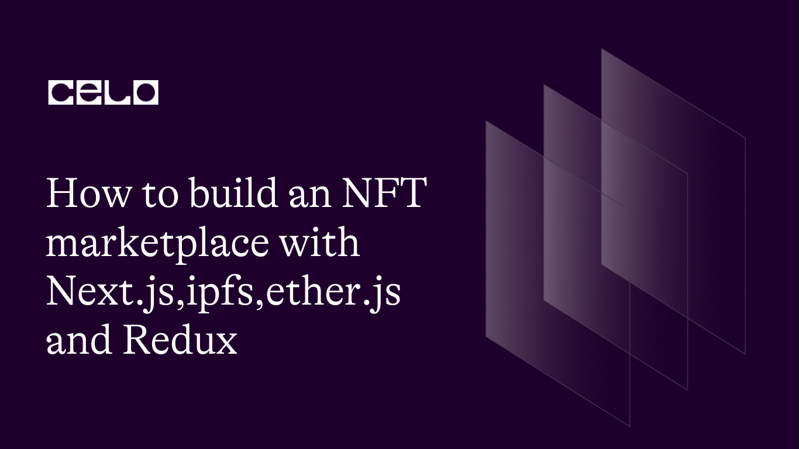

## 🌱 Introduction

There are several NFT marketplaces that operate on the Celo blockchain, including Celo NFT Marketplace, Moola Market, and FAMEO. These marketplaces allow artists and creators to mint and sell their unique digital assets, including art, music, videos, and more.
In this tutorial, you’ll learn how to mint NFTs and purchase them after minting them on the celo blockchain.

## 🗈 Prerequisites

To fully follow up with these tutorial, you should atleast have a basic understanding of the following.

- Solidity smart contracts
- React frameworks.
- Basic web Development.
- Node.js and npm installed. You will need to have Node.js and npm (the package manager for Node.js) installed on your computer. You can check if you have them installed by running the following commands in your terminal:

```bash
node -v
npm -v
```

- A code editor. You will need a code editor to write and edit your code. Some popular options include Visual Studio Code and Atom.
- A Metamask account. You will need a Metamask account to interact with the Celo blockchain from your web browser. If you don't already have one, you can create one by installing the Metamask extension for Chrome or Firefox.

## ⚠️ Requirements

- Solidity -language used to write smart contracts.
- OpenZeppelin-A library for secure smart contract development.
- Hardhat-development environment for Ethereum software.
- Next.js-flexible React framework that gives you building blocks to create fast web applications.
- Redux-state container for managing and centralizing application state.
- Ether.js-web3 client for interacting with the Ethereum Blockchain and its ecosystem.
- Chai-javascript testing framework.
- ipfs-http-client-Http Client to Connect Application with IPFS.
- IPFS-for storage of data
- React-toastify-For Notification
- Node JS 12 or higher.
- MetaMask-web3 wallet.

## Installation

Click on **[this](https://github.com/Tevin-Isaac/Celo-minter-201.git)** repo from github and:

1. Clone the repo to your computer.
2. Open the project from vscode.
3. Run `npm install` or `yarn install` command to install all the dependencies required to run the app locally.

### Folder structure

```bash
Celo-minter-201/
┣ .vscode/
┃ ┗ settings.json
┣ artifacts/
┃ ┣ @openzeppelin/
┃ ┃ ┗ contracts/
┃ ┃   ┣ access/
┃ ┃ ┃ ┃ ┗ Ownable.sol/
┃ ┃   ┣ security/
┃ ┃ ┃ ┃ ┗ ReentrancyGuard.sol/
┃ ┃   ┣ token/
┃ ┃ ┃ ┃ ┗ ERC721/
┃ ┃   ┗ utils/
┃ ┃ ┃   ┣ Address.sol/
┃ ┃ ┃   ┣ Context.sol/
┃ ┃ ┃   ┣ Counters.sol/
┃ ┃ ┃   ┣ Strings.sol/
┃ ┃ ┃   ┗ introspection/
┃ ┣ build-info/
┃ ┃ ┗ 161921f9206247a7da1c394dbe65c622.json
┃ ┣ contracts/
┃ ┃ ┣ NFT.sol/
┃ ┃ ┃ ┣ NFT.dbg.json
┃ ┃ ┃ ┗ NFT.json
┃ ┃ ┗ NFTMarket.sol/
┃ ┃   ┣ NFTMarket.dbg.json
┃ ┃   ┗ NFTMarket.json
┃ ┗ hardhat/
┃   ┗ console.sol/
┃ ┃   ┣ console.dbg.json
┃ ┃   ┗ console.json
┣ cache/
┃ ┗ solidity-files-cache.json
┣ components/
┃ ┣ Card.js
┃ ┣ NavBar.js
┃ ┗ Spinner.js
┣ contracts/
┃ ┣ NFT.sol
┃ ┗ NFTMarket.sol
┣ helpers/
┃ ┗ AuthHelper.js
┣ pages/
┃ ┣ api/
┃ ┃ ┗ hello.js
┃ ┣ _app.js
┃ ┣ _document.js
┃ ┣ creator-profile.js
┃ ┣ index.js
┃ ┣ mint.js
┃ ┗ my-orders.js
┣ public/
┃ ┣ favicon.ico
┃ ┣ favicon.svg
┃ ┣ logo.png
┃ ┗ vercel.svg
┣ redux/
┃ ┣ actions.js
┃ ┣ interactions.js
┃ ┣ reducers.js
┃ ┣ store.js
┃ ┗ types.js
┣ scripts/
┃ ┗ deploy.js
┣ styles/
┃ ┗ globals.css
┣ test/
┃ ┗ MarketplaceTest.js
┣ .env
┣ .eslintrc.json
┣ .gitignore
┣ README.md
┣ hardhat.config.js
┣ next.config.js
┣ package-lock.json
┣ package.json
┣ postcss.config.js
┗ tailwind.config.js
```

## SmartContract

We will first create our minting smart contract and with these we will use Open Zeppelin library to generate our smart contract.
:::tip
To learn more about Openzeppellin smart contracts , check out the **[step-by-step guide to automatically generate OpenZeppellin smart contracts](https://docs.openzeppelin.com/contracts/4.x/wizard)**, which provides detailed instructions on getting started.
:::
After that you can copy and paste the generated code in your preferred IDE.

- **`NFT.sol`**

On your IDE Create a new file named "NFT.sol".This is the code:

```solidity
//SPDX-License-Identifier: Unlicense
pragma solidity ^0.8.0;

import "hardhat/console.sol";
import "@openzeppelin/contracts/token/ERC721/ERC721.sol";
import "@openzeppelin/contracts/token/ERC721/extensions/ERC721URIStorage.sol";
import "@openzeppelin/contracts/utils/Counters.sol";

contract NFT is  ERC721URIStorage {
    using Counters for Counters.Counter;
    Counters.Counter private _tokenIdCounter;

    constructor() ERC721("Exchange NFT", "EXNFT") {}

    function safeMint(string memory uri,address marketPlaceAddress , address creator) public payable returns(uint) {
        require(marketPlaceAddress != address(0), "Enter a valid address");
        require(creator != address(0), "Enter a valid creator address");
        uint256 tokenId = _tokenIdCounter.current();
        _tokenIdCounter.increment();
        _mint(creator, tokenId);
        _setTokenURI(tokenId, uri);
        _approve(marketPlaceAddress, tokenId);
        return tokenId;
    }

}
```

- Breakdown

```solidity
//SPDX-License-Identifier: Unlicense
pragma solidity ^0.8.0;
```

First we will define the solidity version.

```solidity
import "hardhat/console.sol";
```

Next we will import console.sol fom the hardhat environment.
The console.sol library provides a console.log function that can be used to output debug messages to the console during contract execution. This can be useful for debugging and understanding the behavior of a smart contract.
Note that this import statement would only work if the contract is being compiled and executed within the Hardhat development environment. If you were to compile and deploy this contract on a different blockchain network or using a different development environment, you would need to replace the import statement with the appropriate library for that environment.

Next step is to import all OpenZeppelin contracts that we will feature.This lines of code below represent that.

```solidity
import "@openzeppelin/contracts/token/ERC721/ERC721.sol";
import "@openzeppelin/contracts/token/ERC721/extensions/ERC721URIStorage.sol";
import "@openzeppelin/contracts/utils/Counters.sol";
```

These @openzeppelin contracts provide functionality for creating ERC721 tokens, as well as additional functionality for enumeration, URI storage, Burnable, Ownable, and Counters. OpenZeppelin is an open-source secure framework for building smart contracts.We’ll be using the ERC721 Token standard.

Next, we create our constructor and functions and define the imports we made. Our code will look like these:

```solidity
contract NFT is  ERC721URIStorage {
    using Counters for Counters.Counter;
    Counters.Counter private _tokenIdCounter;

    constructor() ERC721("Exchange NFT", "EXNFT") {}

    function safeMint(string memory uri,address marketPlaceAddress , address creator) public payable returns(uint) {
        require(marketPlaceAddress != address(0), "Enter a valid address");
        require(creator != address(0), "Enter a valid creator address");
        uint256 tokenId = _tokenIdCounter.current();
        _tokenIdCounter.increment();
        _mint(creator, tokenId);
        _setTokenURI(tokenId, uri);
        _approve(marketPlaceAddress, tokenId);
        return tokenId;
    }
}
```

The (contract NFT) inherits from ERC721URIStorage, which is an OpenZeppelin library that provides implementations of the ERC721 standard, including the ability to store token metadata at a URI.

The using Counters for Counters.Counter statement imports the Counters library and sets up a counter for generating unique token IDs.

The constructor sets the token name to "Exchange NFT" and the symbol to "EXNFT".

The safeMint function is a public function that mints a new NFT with a given URI and assigns it to a specified creator address. It also approves a given marketplace address to transfer the token on behalf of the owner. The function returns the newly minted token ID.

The require statements ensure that the marketplace and creator addresses are valid and not equal to the null address.

Overall, this contract can be used to create and manage ERC721 NFTs with a URI storage extension, and it includes functionality to approve a marketplace to transfer the token.

Wasn't that simple now your minter contract is ready for compiling and deployment.

- **`NFTmarket.sol`**

Now create a new file and let us name our marketplace contract as NFTmarket.sol.Our marketplace contract will look like this:

```solidity
//SPDX-License-Identifier: Unlicense
pragma solidity ^0.8.0;

import "hardhat/console.sol";
import "@openzeppelin/contracts/utils/Counters.sol";
import "@openzeppelin/contracts/token/ERC721/ERC721.sol";
import "@openzeppelin/contracts/security/ReentrancyGuard.sol";
import "./NFT.sol";


contract NFTMarket is ReentrancyGuard {
    using Counters for Counters.Counter;
    Counters.Counter private _itemId;
    Counters.Counter private _itemsSold;

    address payable owner;
    uint256 public mintingCost = 0.0001 ether;

    constructor(){
        owner = payable(msg.sender);
    }

    enum ListingStatus {
        Active,
        Sold,
        Cancelled
    }

    struct _Item {
        ListingStatus status;
        address nftContract;
        address payable owner;
        address payable creator;
        uint256 token;
        uint256 price;
    }

    event Item (
        address nftContract,
        address owner,
        address creator,
        uint256 token,
        uint256 price
    );

    event CancelSell(
        uint256 token,
        address owner
    );

    event Sold(
        address nftContract,
        address owner,
        address creator,
        uint256 token,
        uint256 price
    );

    mapping(uint => _Item) public Items;

    mapping(address => uint) createdPerWallet;
    mapping(address => uint) ownedPerWallet;

    bool isPaused;

    function sellItem(string memory uri,uint256 _price,address _nftContract) public payable notPaused nonReentrant{
        require(_price > 0, "Price must be at least 1 wei");
        require(msg.value == mintingCost, "You need to pay minting price");
        require(_nftContract != address(0), "Enter a valid marketplace address");
        require(bytes(uri).length > 0, "Enter a valid uri");

        uint256 itemId = _itemId.current();
        _itemId.increment();
        createdPerWallet[msg.sender]++;
        uint256 _tokenId = NFT(_nftContract).safeMint(uri,address(this),msg.sender);

        Items[itemId] =  _Item(
            ListingStatus.Active,
            _nftContract,
            payable(address(this)),
            payable(msg.sender),
            _tokenId,
            _price
        );

        IERC721(_nftContract).transferFrom(msg.sender, address(this), _tokenId);

        emit Item(
            _nftContract,
            payable(address(this)),
            payable(msg.sender),
            _tokenId,
            _price
        );

    }

    function cancelSell(uint256 _tokenId) public isValidTokenId(_tokenId) notPaused {
        _Item storage listedItem = Items[_tokenId];
        require(msg.sender == listedItem.owner || msg.sender == listedItem.creator, "Only owner can cancel listing");
        require(listedItem.status == ListingStatus.Active, "Listing is not active");

        listedItem.status = ListingStatus.Cancelled;
        IERC721(listedItem.nftContract).transferFrom(address(this), msg.sender, listedItem.token);

        emit CancelSell(listedItem.token,listedItem.owner);
    }

    function buyItem(uint256 _tokenId) public payable isValidTokenId(_tokenId) notPaused nonReentrant {
        _Item storage listedItem = Items[_tokenId];

        require(listedItem.price == msg.value, 'Price must be equal to NFT price');

        //Update the owner & status
        listedItem.owner = payable(msg.sender);
        listedItem.status = ListingStatus.Sold;

        ownedPerWallet[msg.sender]++;
        address payable ownerAddress = listedItem.creator;
        if(listedItem.owner == address(0)){
            ownerAddress = listedItem.owner;
        }
        (bool success,) = ownerAddress.call{value: msg.value}("");
        require(success, "Transfer of payment failed");
        //Tranfer NFT to the new owner
        _itemsSold.increment();
        IERC721(listedItem.nftContract).transferFrom(address(this), msg.sender, listedItem.token);

        //Pay owner of the NFT
        (bool sent, ) = payable(owner).call{value: mintingCost}("");
        require(sent, "Transfer of mintCost failed");

        emit Sold(
            listedItem.nftContract,
            msg.sender,
            listedItem.creator,
            listedItem.token,
            listedItem.price
        );

    }

    // Fetch all unsold items
    function fetchMarketItems() public view returns (_Item[] memory) {
        uint itemCount = _itemId.current();
        uint unsoldItemCount = _itemId.current() - _itemsSold.current();
        uint currentIndex = 0;

        _Item[] memory items = new _Item[](unsoldItemCount);
        for (uint i = 0; i < itemCount; i++) {
            if (Items[i].owner == address(this) && Items[i].status == ListingStatus.Active) {
                _Item storage currentItem = Items[i];
                items[currentIndex] = currentItem;
                currentIndex += 1;
            }
        }
        return items;
    }

    // Fetch creator NFT's
    function fetchCreatorItemsListed() public view hasCreatedItems returns (_Item[] memory) {
        uint totalItemCount = _itemId.current();
        uint itemCount = createdPerWallet[msg.sender];
        _Item[] memory items = new _Item[](itemCount);
        uint currentIndex = 0;

        for(uint i = 0; i < totalItemCount; i++) {
            if(Items[i].creator == msg.sender){
                _Item storage currentItem = Items[i];
                items[currentIndex] = currentItem;
                currentIndex += 1;
            }
        }

        return items;
    }


    // Fetch owner NFT's
    function fetchOwnerItemsListed() public view hasOwnerItems  returns (_Item[] memory) {

        uint totalItemCount = _itemId.current();
        uint itemCount = ownedPerWallet[msg.sender];
        uint currentIndex = 0;
        _Item[] memory items = new _Item[](itemCount);

        for (uint i = 0; i < totalItemCount; i++) {
            if(Items[i].owner == msg.sender){
                _Item storage currentItem = Items[i];
                items[currentIndex] = currentItem;
                currentIndex += 1;
            }
        }

        return items;
    }

    function pause() public onlyOwner {
        isPaused = true;
    }

    function unPause() public onlyOwner {
        isPaused = false;
    }


    modifier hasCreatedItems {
        require(createdPerWallet[msg.sender] > 0, "You have not yet created any items");
        _;
    }

    modifier hasOwnerItems {
        require(ownedPerWallet[msg.sender] > 0, "You currently own no items");
        _;
    }

    modifier isValidTokenId(uint _tokenId) {
        require(_tokenId >= 0, "Enter a valid tokenId");
        _;
    }

    //     pause all minting and selling actions
    modifier notPaused() {
        require(!isPaused, "Contract is paused");
        _;
    }

    modifier onlyOwner(){
        require(msg.sender == owner, "Only owner can call this function");
        _;
    }


}
```

- Breakdown

First we import all the necessary contracts from openzeppelin and hardhat environment.

```solidity
//SPDX-License-Identifier: Unlicense
pragma solidity ^0.8.0;

import "hardhat/console.sol";
import "@openzeppelin/contracts/utils/Counters.sol";
import "@openzeppelin/contracts/token/ERC721/ERC721.sol";
import "@openzeppelin/contracts/security/ReentrancyGuard.sol";
import "./NFT.sol";
```

This time we’ll use just three contracts from openzeppelin `ReentrancyGuard`,`Counters` and `ERC721`.

Let’s start building up our contract.

```solidity
contract NFTMarket is ReentrancyGuard {
    using Counters for Counters.Counter;
    Counters.Counter private _itemId;
    Counters.Counter private _itemsSold;

    address payable owner;
    uint256 public mintingCost = 0.0001 ether;

    constructor(){
        owner = payable(msg.sender);
    }

    enum ListingStatus {
        Active,
        Sold,
        Cancelled
    }
}
```

The above line of code means that this contract NFTmarket defines an NFT marketplace with the ability to sell NFTs and track sales.

The using statement is used to import the Counters Open Zeppellin library, which provides a simple way to manage and manipulate counter variables.

The owner variable is an address of the contract owner, which is set in the constructor.

The mintingCost variable specifies the cost required to mint an NFT, which is set to 0.0001 ether.

The ListingStatus enum is used to define the different states an NFT can be in on the marketplace: Active, Sold, or Cancelled.

Overall, the contract sets up some basic functionality and variables needed for an NFT marketplace, but it does not yet implement any actual buying or selling functionality.
If you need to **[learn about variables in solidity](https://www.tutorialspoint.com/solidity/solidity_variables.htm)**. This guide includes details about solidity variables

Our next line of code is this:

```
    struct _Item {
        ListingStatus status;
        address nftContract;
        address payable owner;
        address payable creator;
        uint256 token;
        uint256 price;
    }

    event Item (
        address nftContract,
        address owner,
        address creator,
        uint256 token,
        uint256 price
    );

    event CancelSell(
        uint256 token,
        address owner
    );

    event Sold(
        address nftContract,
        address owner,
        address creator,
        uint256 token,
        uint256 price
    );

    mapping(uint => _Item) public Items;

    mapping(address => uint) createdPerWallet;
    mapping(address => uint) ownedPerWallet;

    bool isPaused;
```

The contract defines a struct \_Item that stores information about each NFT being sold, including its status (active, sold, or cancelled), the NFT contract address, the current owner of the NFT, the creator of the NFT, the token ID, and the price.

The 'sellItem' function allows users to sell their NFTs by passing in the URI of the NFT, the price, and the NFT contract address. The function first checks that the price is greater than 0, that the user has paid the minting cost (specified in mintingCost), that the NFT contract address is valid, and that the URI is not empty.

If these conditions are met, the function creates a new \_Item struct with the provided information and adds it to the Items mapping with a new item ID. It also increments the createdPerWallet mapping for the user who created the item and mints the NFT to the contract address. The function then emits an Item event with the relevant information.

Note that the contract uses the ReentrancyGuard contract from the OpenZeppelin library to prevent reentrancy attacks and the Counters library to manage item and sales counters. The contract also has a isPaused boolean variable that can be used to pause the marketplace in case of an emergency.

Next, let's move to the functions and see how they work.

```solidity
    function sellItem(string memory uri,uint256 _price,address _nftContract) public payable notPaused nonReentrant{
        require(_price > 0, "Price must be at least 1 wei");
        require(msg.value == mintingCost, "You need to pay minting price");
        require(_nftContract != address(0), "Enter a valid marketplace address");
        require(bytes(uri).length > 0, "Enter a valid uri");

        uint256 itemId = _itemId.current();
        _itemId.increment();
        createdPerWallet[msg.sender]++;
        uint256 _tokenId = NFT(_nftContract).safeMint(uri,address(this),msg.sender);

        Items[itemId] =  _Item(
            ListingStatus.Active,
            _nftContract,
            payable(address(this)),
            payable(msg.sender),
            _tokenId,
            _price
        );

        IERC721(_nftContract).transferFrom(msg.sender, address(this), _tokenId);

        emit Item(
            _nftContract,
            payable(address(this)),
            payable(msg.sender),
            _tokenId,
            _price
        );

    }
```

The Declared sellItem function is used to create a new NFT item listing in the marketplace. It takes three parameters:

uri (string): The URI of the NFT to be listed.
\_price (uint256): The price of the NFT in wei.
\_nftContract (address): The address of the NFT contract.
The function first checks if the \_price is greater than zero and if the msg.value (the amount of Ether sent with the transaction) is equal to the mintingCost. If these conditions are not met, the function will revert and the transaction will fail.

Next, it checks if the \_nftContract parameter is not the null address and if the uri parameter is not an empty string. If either of these conditions is not met, the function will revert.

The function then creates a new item ID using the Counters library and increments the counter. It also increments the number of NFTs created by the current msg.sender.

The function then mints a new NFT using the safeMint function of the NFT contract, passing in the uri, the address of the marketplace contract as the to parameter, and the msg.sender as the creator parameter. The function stores the \_tokenId of the new NFT and creates a new \_Item struct, setting the status to ListingStatus.Active, the \_nftContract to the provided \_nftContract parameter, the owner to the marketplace contract address (address(this)), the creator to the msg.sender, the \_tokenId to the \_tokenId variable, and the \_price to the provided \_price parameter.

Finally, the function transfers ownership of the NFT from the msg.sender to the marketplace contract using the transferFrom function of the NFT contract. The function emits an Item event with information about the new item, including the \_nftContract, owner, creator, \_tokenId, and \_price.

Let’s do the cancel sell function next.

```solidity
    function cancelSell(uint256 _tokenId) public isValidTokenId(_tokenId) notPaused {
        _Item storage listedItem = Items[_tokenId];
        require(msg.sender == listedItem.owner || msg.sender == listedItem.creator, "Only owner can cancel listing");
        require(listedItem.status == ListingStatus.Active, "Listing is not active");

        listedItem.status = ListingStatus.Cancelled;
        IERC721(listedItem.nftContract).transferFrom(address(this), msg.sender, listedItem.token);

        emit CancelSell(listedItem.token,listedItem.owner);
    }
```

This function allows the owner or creator of an NFT to cancel the listing for that NFT on the marketplace. The function takes a single argument \_tokenId which is the ID of the NFT being cancelled. The function first checks that the provided token ID is valid by calling the isValidTokenId modifier. Next, it checks that the caller of the function is either the owner or creator of the listed item, and that the status of the item is Active. If these conditions are met, the status of the item is changed to Cancelled and the NFT is transferred back to the owner using the transferFrom function of the ERC721 contract. Finally, an CancelSell event is emitted with the token ID and the previous owner of the NFT.

Next is the `butItem` function.

```solidity
 function buyItem(uint256 _tokenId) public payable isValidTokenId(_tokenId) notPaused nonReentrant {
        _Item storage listedItem = Items[_tokenId];

        require(listedItem.price == msg.value, 'Price must be equal to NFT price');

        //Update the owner & status
        listedItem.owner = payable(msg.sender);
        listedItem.status = ListingStatus.Sold;

        ownedPerWallet[msg.sender]++;
        address payable ownerAddress = listedItem.creator;
        if(listedItem.owner == address(0)){
            ownerAddress = listedItem.owner;
        }
        (bool success,) = ownerAddress.call{value: msg.value}("");
        require(success, "Transfer of payment failed");
        //Tranfer NFT to the new owner
        _itemsSold.increment();
        IERC721(listedItem.nftContract).transferFrom(address(this), msg.sender, listedItem.token);

        //Pay owner of the NFT
        (bool sent, ) = payable(owner).call{value: mintingCost}("");
        require(sent, "Transfer of mintCost failed");

        emit Sold(
            listedItem.nftContract,
            msg.sender,
            listedItem.creator,
            listedItem.token,
            listedItem.price
        );

    }
```

This function handles the purchase of an NFT listed on the marketplace. The buyer sends a payment that matches the price of the NFT, and if the payment is successful, the ownership of the NFT is transferred to the buyer.

Here's what each line of the code does:

- {function buyItem(uint256 \_tokenId) public payable isValidTokenId(\_tokenId) notPaused nonReentrant}; declares the function and sets the required parameters and modifiers.
- \_Item storage listedItem = Items[_tokenId]; retrieves the information for the NFT with the given token ID from the marketplace.
- require(listedItem.price == msg.value, 'Price must be equal to NFT price'); checks if the amount of Ether sent by the buyer matches the price of the NFT. If it doesn't match, the transaction is reverted.
- listedItem.owner = payable(msg.sender); sets the owner of the NFT to the buyer.
- listedItem.status = ListingStatus.Sold; sets the status of the NFT to "sold".
- ownedPerWallet[msg.sender]++; increments the number of NFTs owned by the buyer.
- address payable ownerAddress = listedItem.creator; sets the address of the NFT's original owner as the ownerAddress.
- (bool success,) = ownerAddress.call{value: msg.value}(""); transfers the payment from the buyer to the NFT's original owner.
- \_itemsSold.increment(); increments the number of items sold on the marketplace.
- IERC721(listedItem.nftContract).transferFrom(address(this), msg.sender, listedItem.token); transfers the ownership of the NFT from the marketplace contract to the buyer.
- (bool sent, ) = payable(owner).call{value: mintingCost}(""); sends the minting cost to the owner of the marketplace.
- emit Sold(listedItem.nftContract, msg.sender, listedItem.creator, listedItem.token, listedItem.price); emits an event to notify listeners that the NFT has been sold.

Next we have the 'fetchMarketItems' function:

```solidity
  function fetchMarketItems() public view returns (_Item[] memory) {
        uint itemCount = _itemId.current();
        uint unsoldItemCount = _itemId.current() - _itemsSold.current();
        uint currentIndex = 0;

        _Item[] memory items = new _Item[](unsoldItemCount);
        for (uint i = 0; i < itemCount; i++) {
            if (Items[i].owner == address(this) && Items[i].status == ListingStatus.Active) {
                _Item storage currentItem = Items[i];
                items[currentIndex] = currentItem;
                currentIndex += 1;
            }
        }
        return items;
    }
```

This function fetches all the market items that are currently active and have not been sold. It first gets the total number of items created so far and subtracts the number of items that have been sold to get the number of unsold items. It then initializes an array of unsold items of size equal to the number of unsold items.

It then loops through all the items and checks if an item is unsold and active. If it is, then it stores that item in the items array at the current index and increments the index.

It also returns the items array containing all the unsold and active items in the market.

Finally, let’s look at three last functions.

```solidity
   function fetchCreatorItemsListed() public view hasCreatedItems returns (_Item[] memory) {
        uint totalItemCount = _itemId.current();
        uint itemCount = createdPerWallet[msg.sender];
        _Item[] memory items = new _Item[](itemCount);
        uint currentIndex = 0;

        for(uint i = 0; i < totalItemCount; i++) {
            if(Items[i].creator == msg.sender){
                _Item storage currentItem = Items[i];
                items[currentIndex] = currentItem;
                currentIndex += 1;
            }
        }

        return items;
    }
```

- The function is defined as "public view", which means it can be called externally but does not modify the state of the contract.
- The function has a modifier "hasCreatedItems", which is not shown in the code provided. Presumably, this modifier checks whether the creator has any items listed, and the function can only be executed if this condition is met.
- The function returns an array of "\_Item" struct instances as memory.
- The function starts by getting the total number of items created, stored in a state variable "\_itemId".
- The function then retrieves the number of items created by the calling wallet address, stored in a mapping "createdPerWallet".
- The function initializes an array "items" with a length equal to the number of items created by the calling wallet address.
- The function sets a variable "currentIndex" to 0, which will be used to keep track of the index in the "items" array.
- The function loops through all the items created and stored in the "Items" array.
- If the "creator" address of the item matches the calling wallet address, the function retrieves the current item instance, stores it in a variable "currentItem", and appends it to the "items" array at the current index "currentIndex".
- The function then increments "currentIndex" by 1, to prepare for the next item to be added.
- Once all items have been looped through, the function returns the "items" array.
- Overall, this function returns a list of all items created by the calling wallet address, by looping through all items in the contract and checking their creator address. The items are returned as an array of "\_Item" struct instances, and the function does not modify the state of the contract.

```solidity
  function fetchOwnerItemsListed() public view hasOwnerItems  returns (_Item[] memory) {

        uint totalItemCount = _itemId.current();
        uint itemCount = ownedPerWallet[msg.sender];
        uint currentIndex = 0;
        _Item[] memory items = new _Item[](itemCount);

        for (uint i = 0; i < totalItemCount; i++) {
            if(Items[i].owner == msg.sender){
                _Item storage currentItem = Items[i];
                items[currentIndex] = currentItem;
                currentIndex += 1;
            }
        }

        return items;
    }

```

- The function is defined as "public view", which means it can be called externally but does not modify the state of the contract.
- The function has a modifier "hasOwnerItems", which is not shown in the code provided. Presumably, this modifier checks whether the calling wallet address owns any items listed, and the function can only be executed if this condition is met.
- The function returns an array of "\_Item" struct instances as memory.
- The function starts by getting the total number of items created, stored in a state variable "\_itemId".
- The function then retrieves the number of items owned by the calling wallet address, stored in a mapping "ownedPerWallet".
- The function initializes an array "items" with a length equal to the number of items owned by the calling wallet address.
- The function sets a variable "currentIndex" to 0, which will be used to keep track of the index in the "items" array.
- The function loops through all the items created and stored in the "Items" array.
- If the "owner" address of the item matches the calling wallet address, the function retrieves the current item instance, stores it in a variable "currentItem", and appends it to the "items" array at the current index "currentIndex".
- The function then increments "currentIndex" by 1, to prepare for the next item to be added.
- Once all items have been looped through, the function returns the "items" array.
- Overall, this function returns a list of all items owned by the calling wallet address, by looping through all items in the contract and checking their owner address. The items are returned as an array of "\_Item" struct instances, and the function does not modify the state of the contract.

**On our final functions are:**

```solidity
    function pause() public onlyOwner {
        isPaused = true;
    }

    function unPause() public onlyOwner {
        isPaused = false;
    }

```

- Both functions are defined as "public" and can be called externally.
- The "pause" function is defined with the "onlyOwner" modifier, which means only the owner of the contract can execute it. This is a common pattern for functions that modify the state of the contract.
- The "pause" function sets the state variable "isPaused" to "true". This is likely a way to pause the execution of some or all functions in the contract. Depending on how the "isPaused" variable is used, this could prevent certain actions from being executed until the contract is unpaused.
- The "unPause" function is also defined with the "onlyOwner" modifier.
- The "unPause" function sets the state variable "isPaused" to "false", which presumably allows the execution of previously paused functions to resume.
- Overall, these two functions provide a way for the contract owner to pause and unpause the execution of certain functions in the contract. The "onlyOwner" modifier ensures that only the contract owner can modify the state of the contract in this way.

**We will also set modifiers in our smart contract.This code explains why we use the modifiers:**

```solidity
  modifier hasCreatedItems {
        require(createdPerWallet[msg.sender] > 0, "You have not yet created any items");
        _;
    }

    modifier hasOwnerItems {
        require(ownedPerWallet[msg.sender] > 0, "You currently own no items");
        _;
    }

    modifier isValidTokenId(uint _tokenId) {
        require(_tokenId >= 0, "Enter a valid tokenId");
        _;
    }

    //     pause all minting and selling actions
    modifier notPaused() {
        require(!isPaused, "Contract is paused");
        _;
    }

    modifier onlyOwner(){
        require(msg.sender == owner, "Only owner can call this function");
        _;
    }
```

- The "hasCreatedItems" modifier requires that the calling wallet address has created at least one item. If this requirement is not met, the function that uses this modifier will not be executed and will throw an exception with the message "You have not yet created any items".
- The "hasOwnerItems" modifier requires that the calling wallet address currently owns at least one item. If this requirement is not met, the function that uses this modifier will not be executed and will throw an exception with the message "You currently own no items".
- The "isValidTokenId" modifier checks that the passed-in "tokenId" parameter is greater than or equal to 0. If this requirement is not met, the function that uses this modifier will not be executed and will throw an exception with the message "Enter a valid tokenId".
- The "notPaused" modifier checks that the contract is not currently paused. If this requirement is not met, the function that uses this modifier will not be executed and will throw an exception with the message "Contract is paused". This is likely used in conjunction with the "pause" and "unPause" functions to prevent certain actions from being executed while the contract is paused.
- The "onlyOwner" modifier requires that the calling wallet address is the owner of the contract. If this requirement is not met, the function that uses this modifier will not be executed and will throw an exception with the message "Only owner can call this function".
- This is a common pattern for functions that modify the state of the contract, to ensure that only the contract owner can execute them.
  Overall, these modifiers add additional requirements to the functions that use them, to ensure that only authorized parties can execute them and that the inputs passed to them are valid.

We have wrapped up doing our basic smart contracts.Take note we have used basic security features.So you can always add more to secure your smart contracts.

## Front end

We’ll use the following stack for this section.

- Next.js
- Hardhat
- Redux
- IPFS

## Setup

Clone the full project from **[this Repository](https://github.com/Tevin-Isaac/Celo-minter-201.git)**. to follow up with this section.
Alternatively you can create a new Next.js app using create-next-app, which sets up everything automatically for you.Simply run this on your terminal:

```bash
npx create-next-app@latest
# or
yarn create next-app
# or
pnpm create next-app
```

:::tip
You can follow this step to step guide on how to **[build a next.js app](https://nextjs.org/docs/getting-started)**. This guide will help you learn how to create a new next.js app.
:::

- **.env**

We will also need to include our .env file which is where you will copy your metamask wallet seed phrase that will give you access to the metamask wallet for you to be able to mint your NFT.
Create a new file in your main directory called .env. Inside the .env file, store your mnemonic. It should look like this:

```bash
MNEMONIC="(your metamask seed phrase)"

```

- Smart Contract Deployment

We want to enable Hardhat to deploy to the Celo network, in this case to the Alfajores testnet. To do that, we need to add a network entry to our hardhat.config.js file located at the project's root directory.Configure your hardhat.config file to look like this:

```javascript
require("@nomiclabs/hardhat-waffle");
require("dotenv").config({ path: ".env" });

// This is a sample Hardhat task. To learn how to create your own go to
// https://hardhat.org/guides/create-task.html
task("accounts", "Prints the list of accounts", async (taskArgs, hre) => {
  const accounts = await hre.ethers.getSigners();

  for (const account of accounts) {
    console.log(account.address);
  }
});

const getEnv = (variable, optional = false) => {
  if (!process.env[variable]) {
    if (optional) {
      console.warn(
        `[@env]: Environmental variable for ${variable} is not supplied.`
      );
    } else {
      throw new Error(
        `You must create an environment variable for ${variable}`
      );
    }
  }

  return process.env[variable]?.replace(/\\n/gm, "\n");
};

// Your mnemomic key
const MNEMONIC = getEnv("MNEMONIC");

// You need to export an object to set up your config
// Go to https://hardhat.org/config/ to learn more

/**
 * @type import('hardhat/config').HardhatUserConfig
 */
module.exports = {
  solidity: "0.8.4",
  networks: {
    alfajores: {
      url: "https://alfajores-forno.celo-testnet.org",
      accounts: {
        mnemonic: process.env.MNEMONIC,
        path: "m/44'/60'/0'/0",
      },
      chainId: 44787,
    },
  },
};
```

- This is a JavaScript file that configures the Hardhat development environment for Ethereum smart contract development.

- The first two lines import necessary packages, "@nomiclabs/hardhat-waffle" for running tests and "dotenv" for loading environment variables from a .env file.

- Then, a task named "accounts" is defined, which prints the list of accounts that can be used for the current network. This task uses Hardhat's ethers object to retrieve the signer accounts.

- The "getEnv" function is defined to retrieve environment variables from the process environment. It takes a variable name and an optional boolean flag to indicate if the variable is optional. If the variable is not optional and not present in the process environment, an error is thrown. If the variable is optional, a warning is printed to the console.

- The MNEMONIC constant is defined using the "getEnv" function to retrieve the mnemonic key for the wallet.

- Finally, the module.exports object is defined to set up the Hardhat configuration. The solidity version is set to "0.8.4". The "networks" property defines the network configurations for which Hardhat can connect. In this example, there is only one network named "alfajores", which is a testnet for Celo blockchain. It has a URL endpoint to connect, an accounts object containing the mnemonic key and its path, and the chain ID for the network.

**Now, let's create a script to deploy the smart contracts.**

The Script Above will deploy both of the smart contracts. The script will also create a contract folder for the abi and contract address for both the marketplace contract and the NFT minter contract.

To Deploy the smart contracts to the celo block-chain simply run this command

```bash
npx hardhat run scripts/deploy.js --network alfajores
```

You should see something like this in the terminal

```bash
NFTMarketplace deployed to: 0x6a84e7cd87d6A65303EdAA2DEcf51d8362B49636
MyNFT deployed to: 0x0ccEae723EdCe35a5e3570923cCE7D0E2424434e
```

It will also create a new folder named `scripts` and inside it a file named `deploy.js` with the following code below:

```javascript
const hre = require("hardhat");

async function main() {
  // We get the contract to deploy

  const NFTMarket = await hre.ethers.getContractFactory("NFTMarket");
  const NFTMarketContract = await NFTMarket.deploy();

  const NFT = await hre.ethers.getContractFactory("NFT");
  const NFTContract = await NFT.deploy();

  await NFTMarketContract.deployed();
  await NFTContract.deployed();

  console.log("NFTMarketContract deployed to:", NFTMarketContract.address);
  console.log("NFTContract deployed to:", NFTContract.address);
}

// We recommend this pattern to be able to use async/await everywhere
// and properly handle errors.
main()
  .then(() => process.exit(0))
  .catch((error) => {
    console.error(error);
    process.exit(1);
  });
```

This is a script to deploy two contracts, NFTMarket and NFT, using Hardhat.

The hre constant is imported from the Hardhat Runtime Environment module, which provides access to useful objects and functions.

The main() function is declared as an async function, and it uses the ethers.getContractFactory() method to obtain the contract factories for the NFTMarket and NFT contracts.

Then, the deploy() method is called on each contract factory to deploy the contracts.

Finally, the addresses of the deployed contracts are logged to the console.

The script uses the recommended pattern of using async/await and proper error handling.

To run the script, you can use the command npx hardhat run scripts/deploy.js --network NETWORK_NAME, where NETWORK_NAME is the name of the network you want to deploy the contracts to, such as rinkeby or localhost.

- **`next.config.js`**

We also need to add a custom configuration file for Next.js that is not included in the browser build.With this we can be able to configure our next.js application for it to interact with the server.
:::tip
To learn more about this custom added file check out this **[guide that explains more about this file](https://nextjs.org/docs/api-reference/next.config.js/introduction)** and how its used.
:::

To learn more about this file [click here](https://nextjs.org/docs/api-reference/next.config.js/introduction)

```javascript
/** @type {import('next').NextConfig} */
const nextConfig = {
  env: {
    NFT_MARKET_CONTRACT_ADDRESS: "0x6a84e7cd87d6A65303EdAA2DEcf51d8362B49636",
    NFT_CONTRACT_ADDRESS: " 0x0ccEae723EdCe35a5e3570923cCE7D0E2424434e",
    CHAIN_ID: 44787,
  },
  reactStrictMode: true,
  images: {
    domains: ["ipfs.infura.io"],
  },
};

module.exports = nextConfig;
```

The 'env' property specifies environment variables that will be available at runtime. In this case, the three variables that shows our deployed contract adresses is NFT_MARKET_CONTRACT_ADDRESS and NFT_CONTRACT_ADDRESS. The CHAIN_ID is the celo Alfajores testnet chain id that connects us to the celo network.

The reactStrictMode property, when set to true, enforces React's strict mode, which can help catch potential issues in the application during development.

The 'images' property is used to specify domains where images can be loaded from. In this case, its the IPFS domain from Infura where we will store our images.

Finally, module.exports exports the nextConfig object so it can be used as a configuration file for a Next.js application.

- **components**

Our components folder is where we have 3 files that will facilitate how our NFTs will look like once minted.The files are `Card.js`,`Navbar.js`and `Spinner.js`.

- **Card.js**

```javascript
import { useRouter } from "next/router";
import { useDispatch, useSelector } from "react-redux";
import { toast } from "react-toastify";
import { buyNFT } from "../redux/interactions";

const CardComponent = ({ nftData }) => {
  const router = useRouter();
  const dispatch = useDispatch();
  const marketplaceContract = useSelector(
    (state) => state.nftMarketplaceReducer.contract
  );
  const account = useSelector((state) => state.web3Reducer.account);

  const buyMarketplaceNft = (token, price) => {
    const onSuccess = () => {
      toast.success("woo hoo ! you own this NFT 🎉", {
        position: "top-right",
        autoClose: 5000,
        hideProgressBar: false,
        closeOnClick: true,
        pauseOnHover: true,
        draggable: true,
        progress: undefined,
      });
      router.push("my-orders");
    };
    const onError = (error) => {
      toast.error(error, {
        position: "top-right",
        autoClose: 5000,
        hideProgressBar: false,
        closeOnClick: true,
        pauseOnHover: true,
        draggable: true,
        progress: undefined,
      });
    };

    buyNFT(
      marketplaceContract,
      account,
      token,
      price,
      dispatch,
      onSuccess,
      onError
    );
  };

  return (
    <div className="root">
      <div className="card">
        {/*  eslint-disable-next-line @next/next/no-img-element */}
        
        <div className="card-body">
          <div className="d-flex justify-content-between">
            <div className="d-flex flex-column">
              <small>#{nftData.token}</small>
              <p>{nftData.name}</p>
            </div>
            <div className="d-flex flex-column">
              <small>Bid price</small>
              <p>
                <i className="fab fa-cuttlefish"></i> {nftData.price}
              </p>
            </div>
          </div>
        </div>
        {router.pathname === "/" && nftData.creator !== account ? (
          <div className="card-footer text-muted">
            <button
              className="btn text-center buy-now btn-sm"
              onClick={() => buyMarketplaceNft(nftData.token, nftData.price)}
            >
              Buy now
            </button>
          </div>
        ) : (
          ""
        )}
      </div>
    </div>
  );
};

export default CardComponent;
```

This component renders a card for a specific NFT (non-fungible token). The component receives the NFT data as a prop, which contains information such as the image, name, token ID, and price.

Inside the component, the "useRouter" hook from the "next/router" package and the "useDispatch" and "useSelector" hooks from the "react-redux" package are imported. The "toast" function from the "react-toastify" package is also imported for showing toast messages. The "buyNFT" function from the "../redux/interactions" file is imported as well.

The "useRouter" hook is used to get access to the Next.js router object, which can be used for navigation. The "useDispatch" hook is used to dispatch Redux actions, and the "useSelector" hook is used to select data from the Redux store. The "marketplaceContract" and "account" variables are set to the contract and account data from the Redux store.

The "buyMarketplaceNft" function is defined to handle buying the NFT from the marketplace. It takes the token ID and price as arguments, and calls the "buyNFT" function with the marketplace contract, account, token ID, price, dispatch, and success and error callbacks. The success callback shows a toast message and navigates to the "my-orders" page, while the error callback shows an error toast message.

The component returns a card element with the NFT data and a "Buy now" button. If the current route is the homepage ("/") and the NFT is not created by the current account, the button is shown. Otherwise, it is hidden. When the button is clicked, the "buyMarketplaceNft" function is called with the token ID and price as arguments.

Now Let’s look at Navbar.js file

```javascript
import Link from "next/link";
import React from "react";
import { useDispatch, useSelector } from "react-redux";
import { loadAccount } from "../redux/interactions";

const NavBar = () => {
  const dispatch = useDispatch();
  const account = useSelector((state) => state.web3Reducer.account);
  const provider = useSelector((state) => state.web3Reducer.connection);

  const connectWallet = async () => {
    if (window.ethereum) {
      window.ethereum
        .request({ method: "eth_requestAccounts" })
        .then(async (res) => {
          await loadAccount(provider, dispatch);
        })
        .catch((error) => {
          alert(error.message);
        });
    } else {
      window.alert(
        "Non-Ethereum browser detected. You should consider trying MetaMask!"
      );
    }
  };

  const chainOrAccountChangedHandler = async () => {
    // reload the page to avoid any errors with chain or account change.
    window.location.reload();
  };
  // listen for account changes
  window.ethereum.on("accountsChanged", chainOrAccountChangedHandler);
  // Listen for chain change
  window.ethereum.on("chainChanged", chainOrAccountChangedHandler);

  return (
    <nav className="navbar navbar-expand-lg navbar-light bg-light">
      <div className="container ">
        {/* eslint-disable-next-line @next/next/link-passhref */}
        <Link href="/">
          <span className="navbar-brand logo">NFT</span>
        </Link>

        {account ? (
          <div className="collapse navbar-collapse">
            <ul className="navbar-nav ms-auto">
              <li className="nav-item active">
                {/* eslint-disable-next-line @next/next/link-passhref */}
                <Link href="/creator-profile">
                  <span className="nav-link">Creator profile</span>
                </Link>
              </li>
              <li className="nav-item">
                {/* eslint-disable-next-line @next/next/link-passhref */}
                <Link href="/my-orders">
                  <span className="nav-link">My Orders</span>
                </Link>
              </li>
              <li className="nav-item">
                {/* eslint-disable-next-line @next/next/link-passhref */}
                <Link href="mint">
                  <span className="nav-link">Create NFT</span>
                </Link>
              </li>
            </ul>
          </div>
        ) : (
          <div className="collapse navbar-collapse">
            <ul className="navbar-nav ms-auto">
              <li className="nav-item active">
                {/* eslint-disable-next-line @next/next/link-passhref */}
                <Link href="#">
                  <span className="nav-link" onClick={() => connectWallet()}>
                    Connect with wallet
                  </span>
                </Link>
              </li>
            </ul>
          </div>
        )}
      </div>
    </nav>
  );
};

export default NavBar;
```

This is a component that renders a navigation bar (NavBar) with links to different pages of the website. The component uses the Next.js Link component to create links to the different pages of the website. The component also uses Redux hooks such as useDispatch and useSelector to get the current account and connection provider from the Redux store. The component has a connectWallet function that allows users to connect to a wallet by clicking on the "Connect with wallet" link. The function checks if the user has MetaMask installed and then requests the user's accounts. The component also listens for account and chain changes and reloads the page when these changes occur to avoid errors. If the user is not connected to a wallet, the navigation bar displays only the "Connect with wallet" link. If the user is connected, the navigation bar displays links to the "Creator profile", "My Orders", and "Create NFT" pages.

Finally our last component file is Spinner.js

```javascript
import React from "react";

const Spinner = () => {
  return (
    <div className="d-flex justify-content-center">
      <div className="spinner-border" role="status">
        <span className="sr-only"></span>
      </div>
    </div>
  );
};

export default Spinner;
```

This component returns a spinner icon that indicates the loading status of the page or an element. The spinner icon is displayed in the center of the page with the help of bootstrap classes d-flex and justify-content-center. The spinner-border class adds a spinning animation effect to the icon, and the sr-only class hides the spinner label from the screen readers. This component can be used in any React application that requires loading spinners.

- **helpers**

We will create our new file in this folder and name it `AuthHelper.js`.
This code exports a higher-order function called basicAuth that takes a component as an argument and returns a new component. The returned component includes a NavBar component and the original component (passed as WrappedComponent) as children.

The purpose of this higher-order component appears to be to provide basic authentication functionality to a component. When a user accesses a page or component wrapped with this basicAuth HOC, the NavBar component will be rendered along with the original component. This can be useful for displaying a navigation bar or other UI elements that should be visible to an authenticated user.

The typeof window !== "undefined" check is included to ensure that the NavBar component is only rendered on the client-side, and not during server-side rendering. This helps to prevent errors and improve performance.

- **pages**

In our pages folder, we will add 3 more files for navigation`creator-profile.js`, `mint.js` and `my-orders.js`.Our `index.js`,`hello.js,_document.js` and `app.js`files get generated automatically by Next.js.

For the creator-profile.js file,

```javascript
import React, { useEffect } from "react";
import { useDispatch, useSelector } from "react-redux";
import CardComponent from "../components/Card";
import Spinner from "../components/Spinner";
import { basicAuth } from "../helpers/AuthHelper";
import { loadMintedNFT } from "../redux/interactions";

const CreatorProfile = () => {
  const dispatch = useDispatch();

  const account = useSelector((state) => state.web3Reducer.account);
  const nftContract = useSelector((state) => state.nftReducer.contract);
  const marketplaceContract = useSelector(
    (state) => state.nftMarketplaceReducer.contract
  );
  const mintedNft = useSelector(
    (state) => state.nftMarketplaceReducer.mintedNFT
  );
  const provider = useSelector((state) => state.web3Reducer.connection);

  useEffect(() => {
    if (provider) {
      loadMintedNFT(
        provider,
        marketplaceContract,
        account,
        nftContract,
        dispatch
      );
    }
  }, [provider]);

  return (
    <div className="container">
      {mintedNft ? (
        <div className="row mt-4">
          {mintedNft.length > 0 ? (
            mintedNft.map((data, i) => (
              <div className="col-md-3" key={i}>
                <CardComponent nftData={data} />
              </div>
            ))
          ) : (
            // eslint-disable-next-line react/no-unescaped-entities
            <h4 className="text-center">You din't mint any NFT yet</h4>
          )}
        </div>
      ) : (
        <Spinner />
      )}
    </div>
  );
};

export default basicAuth(CreatorProfile);
```

This code defines a component called 'CreatorProfile' and exports it as the default export. The component is wrapped with the basicAuth higher-order component exported from ../helpers/AuthHelper. This implies that the CreatorProfile component will include a NavBar component along with the actual content rendered by CreatorProfile.

Within the CreatorProfile component, useSelector hook from react-redux is used to access the Redux store state variables. Specifically, the account, nftContract, marketplaceContract, mintedNft, and provider variables are extracted from the store.

The useEffect hook is used to load the minted NFT data using the loadMintedNFT action creator from the ../redux/interactions module when the provider state variable changes. The loadMintedNFT function appears to be an asynchronous function that fetches the minted NFT data and dispatches a corresponding action to update the Redux store state variables.

The component then conditionally renders either a list of minted NFTs or a spinner component based on the mintedNft state variable. If mintedNft is truthy and has a length greater than 0, then the component maps over the array and renders a CardComponent for each NFT. If mintedNft is falsy or has a length of 0, then a message is displayed stating that no NFTs have been minted yet.

Note that this code assumes that the necessary React and Redux imports are available and that the CardComponent and Spinner components are defined and exported in their respective modules. Additionally, this code is only a small part of a larger application and its exact function and usage will depend on the context in which it is used.

For the `mint.js` file

```javascript
import React, { useRef, useState } from "react";
import { basicAuth } from "../helpers/AuthHelper";
import { toast } from "react-toastify";
import { create as ipfsHttpClient } from "ipfs-http-client";

import { useDispatch, useSelector } from "react-redux";
import { etherToWei, formatNFTData } from "../redux/interactions";
import { useRouter } from "next/router";
import { nftMinted } from "../redux/actions";
// const client = create("https://ipfs.infura.io:5001/api/v0");

const projectId = "2MiwdH5zvJCIwaS1nqkFSfQkAtJ";
const projectSecret = "aeb84eb59855f3c2d7ef1d8ddc970d6c";
const auth = `Basic ${Buffer.from(`${projectId}:${projectSecret}`).toString(
  "base64"
)}`;
const options = {
  host: "ipfs.infura.io",
  protocol: "https",
  port: 5001,
  headers: { authorization: auth },
};
const client = ipfsHttpClient(options);
const dedicatedEndPoint = "https://celo-minter.infura-ipfs.io";

const Mint = () => {
  const router = useRouter();
  const formRef = useRef(null);
  const dispatch = useDispatch();
  const [file, setFile] = useState("");
  const [name, setName] = useState("");
  const [price, setPrice] = useState("");
  const [description, setDescription] = useState("");
  const [attributes, setAttributes] = useState(null);
  const [loader, setLoader] = useState(false);

  const walletAddress = useSelector((state) => state.web3Reducer.account);
  const nftReducer = useSelector((state) => state.nftReducer.contract);
  const nftMarketplaceReducer = useSelector(
    (state) => state.nftMarketplaceReducer.contract
  );
  const provider = useSelector((state) => state.web3Reducer.connection);

  const addAttribute = (e) => {
    e.preventDefault();
    if (attributes) {
      var attr = [
        ...attributes,
        {
          id: attributes.length,
          trait_type: e.target.key.value,
          value: e.target.value.value,
        },
      ];
      setAttributes(attr);
    } else {
      setAttributes([
        { id: 0, trait_type: e.target.key.value, value: e.target.value.value },
      ]);
    }
    formRef.current.reset();
  };

  const removeAttribute = (id) => {
    var filteredAttr = attributes.filter((data) => data.id !== id);
    setAttributes(filteredAttr);
  };

  const uploadImageToIPFS = async () => {
    const { chainId } = await provider.getNetwork();
    if (chainId != 44787) {
      toast.error("Invalid chain Id ! Please use alfajores test network :)", {
        position: "top-right",
        autoClose: 5000,
        hideProgressBar: false,
        closeOnClick: true,
        pauseOnHover: true,
        draggable: true,
        progress: undefined,
      });
      return;
    }

    setLoader(true);
    if (!name || !description || !price || !file) {
      toast.error("Please fill all the required fields !", {
        position: "top-right",
        autoClose: 5000,
        hideProgressBar: false,
        closeOnClick: true,
        pauseOnHover: true,
        draggable: true,
        progress: undefined,
      });
    }

    try {
      const added = await client.add(file);
      const url = `${dedicatedEndPoint}/ipfs/${added.path}`;
      await uploadMetadataToIPFS(url);
    } catch (error) {
      setLoader(false);
      toast.error("Image upload failed !", {
        position: "top-right",
        autoClose: 5000,
        hideProgressBar: false,
        closeOnClick: true,
        pauseOnHover: true,
        draggable: true,
        progress: undefined,
      });
      console.log("Error uploading file: ", error);
    }
  };

  const uploadMetadataToIPFS = async (fileUrl) => {
    if (!name || !description || !price || !fileUrl) return;
    /* first, upload to IPFS */
    const data = JSON.stringify({
      name: name,
      description: description,
      image: fileUrl,
      attributes: attributes,
    });
    try {
      const added = await client.add(data);
      const url = `${dedicatedEndPoint}/ipfs/${added.path}`;
      /* after file is uploaded to IPFS, return the URL to use it in the transaction */
      await mintNFT(url);

      return url;
    } catch (error) {
      setLoader(false);
      toast.error("Meta data upload failed !", {
        position: "top-right",
        autoClose: 5000,
        hideProgressBar: false,
        closeOnClick: true,
        pauseOnHover: true,
        draggable: true,
        progress: undefined,
      });
      console.log("Error uploading file: ", error);
    }
  };

  const mintNFT = async (metadata) => {
    try {
      const tx = await nftMarketplaceReducer.sellItem(
        metadata,
        etherToWei(price),
        nftReducer.address,
        { from: walletAddress, value: etherToWei("0.0001") }
      );
      const receipt = await tx.wait();
      const formattedData = await formatNFTData(
        receipt.events[4].args,
        nftReducer
      );
      console.log("NFT metadata : ", formattedData);
      dispatch(nftMinted(formattedData));

      setFile("");
      setName("");
      setPrice("");
      setDescription("");
      setAttributes("");

      toast.success("NFT minted successfully 🎉", {
        position: "top-right",
        autoClose: 5000,
        hideProgressBar: false,
        closeOnClick: true,
        pauseOnHover: true,
        draggable: true,
        progress: undefined,
      });
      router.push("/creator-profile");
      setLoader(false);
    } catch (error) {
      setLoader(false);
      toast.error(error.message, {
        position: "top-right",
        autoClose: 5000,
        hideProgressBar: false,
        closeOnClick: true,
        pauseOnHover: true,
        draggable: true,
        progress: undefined,
      });
    }
  };

  return (
    <div className="container create-nft">
      <div className="card m-5 p-4">
        <div className="mb-3">
          <label htmlFor="nftName" className="form-label">
            NFT Name
          </label>
          <input
            type="text"
            className="form-control"
            id="nftName"
            value={name}
            onChange={(e) => setName(e.target.value)}
          />
        </div>
        <div className="mb-3">
          <label htmlFor="nftPrice" className="form-label">
            Bid Price
          </label>
          <input
            type="number"
            className="form-control"
            id="nftPrice"
            value={price}
            onChange={(e) => setPrice(e.target.value)}
          />
        </div>

        <div className="mb-3">
          <label htmlFor="NFTimage" className="form-label">
            Image
          </label>
          <input
            type="file"
            className="form-control-file"
            id="NFTimage"
            onChange={(e) => setFile(e.target.files[0])}
          />
        </div>

        <div className="mb-3">
          <label htmlFor="description" className="form-label">
            Description
          </label>
          <textarea
            className="form-control"
            id="description"
            rows="3"
            value={description}
            onChange={(e) => setDescription(e.target.value)}
          ></textarea>
        </div>

        <form onSubmit={(e) => addAttribute(e)} ref={formRef}>
          <div className="mb-3">
            <label htmlFor="attributes" className="form-label">
              Attributes
            </label>
            <div className="d-flex flex-wrap">
              {attributes
                ? attributes.map((attr, i) => {
                    return (
                      <span
                        key={i}
                        className="m-1 badge attr-badge"
                        onClick={() => removeAttribute(attr.id)}
                      >
                        {attr.trait_type}:{attr.value}
                      </span>
                    );
                  })
                : ""}
            </div>
            <div className="d-flex attribute">
              <input
                type="text"
                name="key"
                className="form-control m-1"
                placeholder="Key"
                required
              />
              <input
                type="text"
                name="value"
                className="form-control m-1"
                placeholder="Value"
                required
              />
              <button type="submit" className="btn btn-primary mb-2 btn-sm">
                Add
              </button>
            </div>
          </div>
        </form>
        <button
          type="submit"
          className="btn btn-success btn-block"
          onClick={() => uploadImageToIPFS()}
          disabled={loader}
        >
          {loader ? "Minting..." : "Mint NFT"}
        </button>
      </div>
    </div>
  );
};

export default basicAuth(Mint);
```

This code allows users to upload an image and metadata to IPFS and mint an NFT. The component includes various hooks, such as useState and useRef, and imports several modules, including basicAuth, toast, and create from ipfs-http-client.

The component uses an API key from Infura to connect to IPFS and uploads the image and metadata using the client.add() function. The metadata is first formatted as a JSON object, then uploaded to IPFS as well. Finally, the mintNFT() function is called, which uses the sellItem() function from the nftMarketplaceReducer contract to mint the NFT. The formatted data for the NFT is then dispatched to the nftMinted() function from the Redux actions.

The component also includes various error messages, such as if a required field is missing or if the image upload or metadata upload fails. There is also a check to ensure that the user is on the alfajores test network.

Something very important you have to remember about IPFS is for you to upload images on IPFS see this article **[how to upload images to ipfs using infura](https://dev.to/adhamniazy/how-to-upload-images-to-ipfs-using-infuraio-dedicated-gateways-11c6)**. This guide will help you learn how to create your account and setup a new project.

This is how my account that i created looks like:


\*Note that the details that i included there are details you can change once you create your account.

The `my-orders.js` file:

```javascript
import React, { useEffect } from "react";
import { useDispatch, useSelector } from "react-redux";
import CardComponent from "../components/Card";
import Spinner from "../components/Spinner";
import { basicAuth } from "../helpers/AuthHelper";
import { loadOwnedNFT } from "../redux/interactions";

const MyOrders = () => {
  const dispatch = useDispatch();

  const account = useSelector((state) => state.web3Reducer.account);
  const nftContract = useSelector((state) => state.nftReducer.contract);
  const marketplaceContract = useSelector(
    (state) => state.nftMarketplaceReducer.contract
  );
  const ownedNft = useSelector((state) => state.nftMarketplaceReducer.ownedNFT);
  const provider = useSelector((state) => state.web3Reducer.connection);

  useEffect(() => {
    if (provider) {
      loadOwnedNFT(
        provider,
        marketplaceContract,
        account,
        nftContract,
        dispatch
      );
    }
  }, [provider]);

  return (
    <div className="container">
      {ownedNft ? (
        <div className="row mt-4">
          {ownedNft.length > 0 ? (
            ownedNft.map((data, i) => (
              <div className="col-md-3" key={i}>
                <CardComponent nftData={data} />
              </div>
            ))
          ) : (
            // eslint-disable-next-line react/no-unescaped-entities
            <h4 className="text-center">You don't own any NFT yet</h4>
          )}
        </div>
      ) : (
        <Spinner />
      )}
    </div>
  );
};

export default basicAuth(MyOrders);
```

This is a code that displays a user's owned NFTs. The component uses the React hooks useDispatch and useSelector to interact with the Redux store.

The useSelector hook selects pieces of state from the Redux store to be used in the component. In this case, the account, nftContract, marketplaceContract, ownedNft, and provider are selected from the Redux store.

The useEffect hook is used to call the loadOwnedNFT function when the provider state changes. The loadOwnedNFT function takes in parameters such as the provider, marketplaceContract, account, and nftContract to load the user's owned NFTs from the blockchain.

The component displays a list of owned NFTs using the ownedNft state. If there are NFTs, a CardComponent is rendered for each NFT. If there are no NFTs, a message is displayed indicating that the user doesn't own any NFTs yet.

Finally, the basicAuth higher-order component is applied to the MyOrders component. The basicAuth function is a helper function that checks if the user is authenticated before rendering the component.

Inside the index.js file which is majorly our main file on pages folder,is where we will make sure our app functions well and all the imports have been imported accordingly.Our file will look like these:

```javascript
import Head from "next/head";
import { useSelector } from "react-redux";
import CardComponent from "../components/Card";
import Spinner from "../components/Spinner";
import { basicAuth } from "../helpers/AuthHelper";

const Home = () => {
  const allUnsoldNFT = useSelector(
    (state) => state.nftMarketplaceReducer.unsoldNFT
  );

  return (
    <div className="container home">
      <Head>
        <title>Home</title>
      </Head>

      <h1 className={"header-text"}>Sneakerpunk NFT store</h1>
      <h5 className={"sub-header-text"}>
        Sneakerpunk is the place where you can mint,buy and sell your NFTs at
        your chosen price.
      </h5>
      {allUnsoldNFT ? (
        <div className="row mt-4">
          {allUnsoldNFT.length > 0 ? (
            allUnsoldNFT.map((data, i) => (
              <div className="col-md-3" key={i}>
                <CardComponent nftData={data} />
              </div>
            ))
          ) : (
            <h4 className="text-center">NFTs not uploaded yet</h4>
          )}
        </div>
      ) : (
        <Spinner />
      )}
    </div>
  );
};

export default basicAuth(Home);
```

This displays the home page of a NFT marketplace application. It imports various components, such as Head, useSelector, CardComponent, Spinner, and basicAuth.

The useSelector hook is used to extract the unsold NFTs from the application's Redux store. The component then maps over this array of NFTs and renders a CardComponent for each one, which displays information about the NFT such as its name, image, and price.

If there are no unsold NFTs, the component displays a message indicating that NFTs have not been uploaded yet.

Finally, the basicAuth function is used to wrap the component, which ensures that only authenticated users can access the page.

- **Redux**

Redux is a predictable state container for JavaScript apps.To learn more about it before we proceed [click here](https://redux.js.org/introduction/getting-started).This will help you to be able to install it and know its role in major applications.
Our redux fder has 5 files namely `actions.js`,`interactions.js`,`reducers.js`,`store.js` and `types.js`.
Our actions.js file looks like this:

```javascript
import * as types from "./types";

export const web3Loaded = (web3) => {
  return {
    type: types.WEB3_LOADED,
    payload: web3,
  };
};

export const walletAddressLoaded = (address) => {
  return {
    type: types.WALLET_ADDRESS_LOADED,
    payload: address,
  };
};

// NFT ACTIONS

export const nftContractLoaded = (contract) => {
  return {
    type: types.NFT_CONTRACT_LOADED,
    payload: contract,
  };
};

export const unsoldNFTLoaded = (nftList) => {
  return {
    type: types.UNSOLD_NFT_LOADED,
    payload: nftList,
  };
};

export const mintedNFTLoaded = (nftList) => {
  return {
    type: types.MINTED_NFT_LOADED,
    payload: nftList,
  };
};

export const ownedNFTLoaded = (nftList) => {
  return {
    type: types.OWNED_NFT_LOADED,
    payload: nftList,
  };
};

export const nftMinted = (nftData) => {
  return {
    type: types.MINTED_SUCCESSFULLY,
    payload: nftData,
  };
};

export const nftPurchased = (tokenId) => {
  return {
    type: types.PURCHASED_SUCCESSFULLY,
    payload: tokenId,
  };
};

// MARKETPLACE ACTIONS

export const nftMarketplaceContractLoaded = (contract) => {
  return {
    type: types.NFT_MARKETPLACE_CONTRACT_LOADED,
    payload: contract,
  };
};
```

This file exports various functions, which are used to dispatch actions in a Redux application.

The first two functions web3Loaded and walletAddressLoaded are used to dispatch actions related to the user's Ethereum wallet. The web3Loaded function takes in a web3 object and dispatches a WEB3_LOADED action with the web3 object as payload. The walletAddressLoaded function takes in an address string and dispatches a WALLET_ADDRESS_LOADED action with the address as payload.

The next set of functions relate to Non-Fungible Tokens (NFTs) and their contracts. The nftContractLoaded function is used to dispatch a NFT_CONTRACT_LOADED action with the NFT contract object as payload. The unsoldNFTLoaded, mintedNFTLoaded, and ownedNFTLoaded functions are used to dispatch actions with lists of unsold, minted, and owned NFTs respectively.

The nftMinted and nftPurchased functions are used to dispatch actions related to the minting and purchase of NFTs respectively. The nftMinted function takes in an nftData object and dispatches a MINTED_SUCCESSFULLY action with the nftData as payload. The nftPurchased function takes in a tokenId string and dispatches a PURCHASED_SUCCESSFULLY action with the tokenId as payload.

Finally, the nftMarketplaceContractLoaded function is used to dispatch a NFT_MARKETPLACE_CONTRACT_LOADED action with the NFT Marketplace contract object as payload.

Next it will be interactions.js file:

```javascript
import { ethers } from "ethers";
import * as actions from "./actions";
import NFTMarketContract from "../artifacts/contracts/NFTMarket.sol/NFTMarket.json";
import NFTContract from "../artifacts/contracts/NFT.sol/NFT.json";
import axios from "axios";

// var marketPlaceAddress = process.env.NFT_MARKET_CONTRACT_ADDRESS
var marketPlaceAddress = "0x3B93f48aB3F02Ae1522D179aF3440FeFBEE8690f";
// var nftAddress = process.env.NFT_CONTRACT_ADDRESS
var nftAddress = "0xD98Cb02aA84Cd452af430538cF036FC72207Ffc4";

export const formatNFTData = async (data, nftContract) => {
  const tokenUri = await nftContract.tokenURI(data.token);
  const meta = await axios.get(tokenUri);

  const formattedData = {
    name: meta.data.name,
    image: meta.data.image,
    desc: meta.data.description,
    price: weiToEther(data.price),
    token: data.token.toString(),
    creator: data.creator,
    attributes: meta.data.attributes,
  };

  return formattedData;
};

export const weiToEther = (num) => {
  return ethers.utils.formatEther(num);
};

export const etherToWei = (n) => {
  const weiBigNumber = ethers.utils.parseEther(n.toString());
  const wei = weiBigNumber.toString();
  return wei;
};

export const loadWeb3 = async (dispatch) => {
  if (window.ethereum) {
    const provider = new ethers.providers.Web3Provider(window.ethereum, "any");

    dispatch(actions.web3Loaded(provider));
    const addresses = await provider.listAccounts();
    dispatch(actions.walletAddressLoaded(addresses[0]));
    return provider;
  }
};

export const loadContracts = async (provider, dispatch) => {
  // const { chainId } = await provider.getNetwork()
  // if(chainId !== process.env.CHAIN_ID){
  //   return {
  //     marketplace:null,
  //     nft:null
  //   }
  // }

  var signer;
  const addresses = await provider.listAccounts();
  if (addresses.length > 0) {
    signer = provider.getSigner();
  } else {
    signer = provider;
  }
  console.log({ addresses });
  const nftMarketplaceContract = new ethers.Contract(
    marketPlaceAddress,
    NFTMarketContract.abi,
    signer
  );
  const nftContract = new ethers.Contract(nftAddress, NFTContract.abi, signer);

  dispatch(actions.nftMarketplaceContractLoaded(nftMarketplaceContract));
  dispatch(actions.nftContractLoaded(nftContract));

  return {
    marketplace: nftMarketplaceContract,
    nft: nftContract,
  };
};

export const loadAccount = async (provider, dispatch) => {
  if (!provider) {
    return;
  }
  const signer = await provider.getSigner();
  const connectedWallet = await signer.getAddress();
  dispatch(actions.walletAddressLoaded(connectedWallet));
};

export const loadUnsoldNFT = async (
  provider,
  marketplaceContract,
  nftContract,
  dispatch
) => {
  // const { chainId } = await provider.getNetwork()
  // if(chainId !== process.env.CHAIN_ID){
  //   dispatch(actions.unsoldNFTLoaded([]))
  //   return
  // }

  var unsoldNft = await marketplaceContract.fetchMarketItems();
  const formattedNFTList = await Promise.all(
    unsoldNft.map((nft) => {
      var res = formatNFTData(nft, nftContract);
      return res;
    })
  );

  dispatch(actions.unsoldNFTLoaded(formattedNFTList));
};

export const loadMintedNFT = async (
  provider,
  marketplaceContract,
  account,
  nftContract,
  dispatch
) => {
  // const { chainId } = await provider.getNetwork()
  // if(!account || chainId !== 44787){
  //   dispatch(actions.mintedNFTLoaded([]))
  //   return
  // }
  var unsoldNft = await marketplaceContract.fetchCreatorItemsListed({
    from: account,
  });

  const formattedNFTList = await Promise.all(
    unsoldNft.map((nft) => {
      var res = formatNFTData(nft, nftContract);
      return res;
    })
  );

  dispatch(actions.mintedNFTLoaded(formattedNFTList));
};

export const loadOwnedNFT = async (
  provider,
  marketplaceContract,
  account,
  nftContract,
  dispatch
) => {
  // const { chainId } = await provider.getNetwork()
  // if(!account || chainId !== process.env.CHAIN_ID){
  //   dispatch(actions.ownedNFTLoaded([]))
  //   return
  // }
  var unsoldNft = await marketplaceContract.fetchOwnerItemsListed({
    from: account,
  });

  const formattedNFTList = await Promise.all(
    unsoldNft.map((nft) => {
      var res = formatNFTData(nft, nftContract);
      return res;
    })
  );

  dispatch(actions.ownedNFTLoaded(formattedNFTList));
};

export const buyNFT = async (
  marketplaceContract,
  account,
  tokenId,
  price,
  dispatch,
  onSuccess,
  onError
) => {
  if (!account) {
    return;
  }
  try {
    var res = await marketplaceContract.buyItem(tokenId, {
      value: etherToWei(price),
      from: account,
    });
    const receipt = await res.wait();
    onSuccess();
    dispatch(actions.nftPurchased(tokenId));
    console.log(receipt);
  } catch (error) {
    onError(error.message);
  }
};
```

Thist file exports several functions related to interacting with Ethereum smart contracts using the Ethers.js library. Here is a brief summary of the functions:

formatNFTData: This function takes in some data about an NFT and a contract instance, fetches additional metadata about the NFT using the token URI, and returns a formatted object with the NFT's name, image, description, price, token ID, creator, and attributes.

weiToEther: This function takes in a value in wei (the smallest unit of ether) and returns the corresponding value in ether (a more commonly used unit).

etherToWei: This function takes in a value in ether and returns the corresponding value in wei.

loadWeb3: This function takes in a Redux dispatch function and checks if the user has the MetaMask browser extension installed. If so, it loads a Web3 provider using the Ethers.js library, dispatches an action to indicate that Web3 has been loaded, and returns the provider.

loadContracts: This function takes in a Web3 provider and a Redux dispatch function, creates instances of two Ethereum smart contracts (an NFT marketplace contract and an NFT contract), dispatches actions to indicate that the contracts have been loaded, and returns an object containing the two contract instances.

loadAccount: This function takes in a Web3 provider and a Redux dispatch function, retrieves the connected wallet address from the provider, and dispatches an action to indicate that the wallet address has been loaded.

loadUnsoldNFT: This function takes in a Web3 provider, the NFT marketplace contract instance, the NFT contract instance, and a Redux dispatch function, fetches a list of unsold NFTs from the marketplace contract, formats the NFT data using formatNFTData, dispatches an action to indicate that the unsold NFTs have been loaded, and returns the formatted list of NFTs.

loadMintedNFT: This function takes in a Web3 provider, the NFT marketplace contract instance, the connected wallet address, the NFT contract instance, and a Redux dispatch function, fetches a list of NFTs that the connected wallet has created and listed for sale on the marketplace, formats the NFT data using formatNFTData, dispatches an action to indicate that the minted NFTs have been loaded, and returns the formatted list of NFTs.

loadOwnedNFT: This function takes in a Web3 provider, the NFT marketplace contract instance, the connected wallet address, the NFT contract instance, and a Redux dispatch function, fetches a list of NFTs that the connected wallet has purchased on the marketplace, formats the NFT data using formatNFTData, dispatches an action to indicate that the owned NFTs have been loaded, and returns the formatted list of NFTs.

buyNFT: This function takes in the NFT marketplace contract instance, the connected wallet address, the token ID of the NFT to buy, the price of the NFT in ether, a Redux dispatch function, a success callback function, and an error callback function. It attempts to buy the NFT by calling the buyItem function on the marketplace contract with the correct arguments, and if successful, dispatches an action to indicate that the NFT has been purchased and calls the success callback. If an error occurs, it calls the error callback with the error message.

On our next file in the folder its reducers.js file which is very important.

To learn more about reducers on redux then click **[this Reducers article](https://redux.js.org/tutorials/fundamentals/part-3-state-actions-reducers)** for further knowledge about Reducers.
our file will look like this:

```javascript
import { combineReducers } from "redux";
import * as types from "./types";
const initialState = {};

export const web3Reducer = (state = initialState, action) => {
  // eslint-disable-next-line default-case
  switch (action.type) {
    case types.WEB3_LOADED:
      return {
        ...state,
        connection: action.payload,
      };
    case types.WALLET_ADDRESS_LOADED:
      return {
        ...state,
        account: action.payload,
      };
    default:
      return state;
  }
};

export const nftReducer = (state = initialState, action) => {
  // eslint-disable-next-line default-case
  switch (action.type) {
    case types.NFT_CONTRACT_LOADED:
      return {
        ...state,
        contract: action.payload,
      };

    default:
      return state;
  }
};

export const nftMarketplaceReducer = (state = initialState, action) => {
  // eslint-disable-next-line default-case
  switch (action.type) {
    case types.NFT_MARKETPLACE_CONTRACT_LOADED:
      return {
        ...state,
        contract: action.payload,
      };
    case types.MINTED_NFT_LOADED:
      return {
        ...state,
        mintedNFT: action.payload,
      };
    case types.OWNED_NFT_LOADED:
      console.log(action.payload);
      return {
        ...state,
        ownedNFT: action.payload,
      };
    case types.UNSOLD_NFT_LOADED:
      return {
        ...state,
        unsoldNFT: action.payload,
      };

    case types.MINTED_SUCCESSFULLY:
      var nftList;
      if (state.unsoldNFT) {
        nftList = [...state.unsoldNFT, action.payload];
      } else {
        nftList = [action.payload];
      }
      return {
        ...state,
        unsoldNFT: nftList,
      };

    case types.PURCHASED_SUCCESSFULLY:
      return {
        ...state,
        unsoldNFT: state.unsoldNFT.filter(
          (data) => data.token !== action.payload
        ),
      };

    default:
      return state;
  }
};

export default combineReducers({
  web3Reducer,
  nftReducer,
  nftMarketplaceReducer,
});
```

This is a module that exports three Redux reducers and a combined reducer using the combineReducers utility function from the Redux library. The three reducers are web3Reducer, nftReducer, and nftMarketplaceReducer.

The web3Reducer handles actions related to the Web3 connection and wallet address, such as WEB3_LOADED and WALLET_ADDRESS_LOADED. It maintains a connection property to store the Web3 connection and an account property to store the wallet address.

The nftReducer handles actions related to loading the NFT contract, such as NFT_CONTRACT_LOADED. It maintains a contract property to store the NFT contract.

The nftMarketplaceReducer handles actions related to loading the NFT Marketplace contract, as well as minting and purchasing NFTs. It maintains a contract property to store the NFT Marketplace contract, an ownedNFT property to store the NFTs owned by the user, an unsoldNFT property to store the NFTs that have not been sold yet, and a mintedNFT property to store the NFT that was just minted.

When a new NFT is successfully minted (MINTED_SUCCESSFULLY), the reducer adds the new NFT to the unsoldNFT array. When an NFT is successfully purchased (PURCHASED_SUCCESSFULLY), the reducer removes the purchased NFT from the unsoldNFT array.

Our next file is store.js file and the code to reference this is:

```javascript
import { createStore, applyMiddleware, compose } from "redux";
import thunk from "redux-thunk";
import { createWrapper } from "next-redux-wrapper";
import rootReducer from "./reducers";

const middleware = [thunk];

const composeEnhancers =
  typeof window === "object" && window.__REDUX_DEVTOOLS_EXTENSION_COMPOSE__
    ? window.__REDUX_DEVTOOLS_EXTENSION_COMPOSE__({})
    : compose;

const enhancer = composeEnhancers(applyMiddleware(...middleware));

const makeStore = () => createStore(rootReducer, enhancer);

export const wrapper = createWrapper(makeStore);
```

Finally our last file is types.js:

```javascript
import { combineReducers } from "redux";
import * as types from "./types";
const initialState = {};

export const web3Reducer = (state = initialState, action) => {
  // eslint-disable-next-line default-case
  switch (action.type) {
    case types.WEB3_LOADED:
      return {
        ...state,
        connection: action.payload,
      };
    case types.WALLET_ADDRESS_LOADED:
      return {
        ...state,
        account: action.payload,
      };
    default:
      return state;
  }
};

export const nftReducer = (state = initialState, action) => {
  // eslint-disable-next-line default-case
  switch (action.type) {
    case types.NFT_CONTRACT_LOADED:
      return {
        ...state,
        contract: action.payload,
      };

    default:
      return state;
  }
};

export const nftMarketplaceReducer = (state = initialState, action) => {
  // eslint-disable-next-line default-case
  switch (action.type) {
    case types.NFT_MARKETPLACE_CONTRACT_LOADED:
      return {
        ...state,
        contract: action.payload,
      };
    case types.MINTED_NFT_LOADED:
      return {
        ...state,
        mintedNFT: action.payload,
      };
    case types.OWNED_NFT_LOADED:
      console.log(action.payload);
      return {
        ...state,
        ownedNFT: action.payload,
      };
    case types.UNSOLD_NFT_LOADED:
      return {
        ...state,
        unsoldNFT: action.payload,
      };

    case types.MINTED_SUCCESSFULLY:
      var nftList;
      if (state.unsoldNFT) {
        nftList = [...state.unsoldNFT, action.payload];
      } else {
        nftList = [action.payload];
      }
      return {
        ...state,
        unsoldNFT: nftList,
      };

    case types.PURCHASED_SUCCESSFULLY:
      return {
        ...state,
        unsoldNFT: state.unsoldNFT.filter(
          (data) => data.token !== action.payload
        ),
      };

    default:
      return state;
  }
};

export default combineReducers({
  web3Reducer,
  nftReducer,
  nftMarketplaceReducer,
});
```

This is a typical setup for a Redux store with some additional configurations to work with the Next.js framework.

First, the code imports createStore, applyMiddleware, compose, and createWrapper from the redux, redux-thunk, and next-redux-wrapper packages.

createStore is used to create the Redux store, while applyMiddleware is used to apply middleware to the store, which is Redux Thunk in this case. compose is used to compose multiple store enhancers together, which can be useful for setting up a development environment.

createWrapper is used to create a wrapper around the Redux store that is compatible with Next.js. It provides a getServerSideProps function that can be used to fetch data on the server and pass it to the client-side store.

The code then creates an array of middleware with only one middleware, which is the thunk middleware. This middleware allows you to write asynchronous actions in Redux.

The next step is to create a composeEnhancers variable, which allows us to use the Redux DevTools extension in our browser. This is useful for debugging Redux applications. If the DevTools extension is not installed, the code falls back to using compose without any arguments.

After that, the enhancer variable is created by calling composeEnhancers with applyMiddleware(...middleware) as an argument. This applies the thunk middleware to the store.

The makeStore function is defined, which returns a new Redux store instance by calling createStore with the rootReducer and enhancer variables as arguments.

Finally, the createWrapper function is called with the makeStore function as an argument to create a wrapper around the Redux store. This wrapper is then exported as wrapper.

Our final file on this folder is types.js file and the code to reference this is:

```javascript
export const WEB3_LOADED = "WEB3_LOADED";
export const WALLET_ADDRESS_LOADED = "WALLET_ADDRESS_LOADED";

// NFT TYPES
export const NFT_CONTRACT_LOADED = "NFT_CONTRACT_LOADED";
export const MINTED_NFT_LOADED = "MINTED_NFT_LOADED";
export const OWNED_NFT_LOADED = "OWNED_NFT_LOADED";
export const UNSOLD_NFT_LOADED = "UNSOLD_NFT_LOADED";
export const PURCHASED_SUCCESSFULLY = "PURCHASED_SUCCESSFULLY";
export const MINTED_SUCCESSFULLY = "MINTED_SUCCESSFULLY";

//NFT MARKETPLACE TYPES
export const NFT_MARKETPLACE_CONTRACT_LOADED =
  "NFT_MARKETPLACE_CONTRACT_LOADED";
```

These are Redux action types.

In Redux, an action type is a string that describes the type of action being performed. It is used to identify which reducer function should handle the action. Action types should be unique and descriptive.

In this specific code snippet, we can see several action types being defined for different functionalities related to loading web3, wallet address, NFT contract, minted NFT, owned NFT, unsold NFT, successfully purchased NFT, successfully minted NFT, and NFT marketplace contract.

- **styles**

Our application needs some styling and under the styles folder we will create a file named 'global.css' file
Our styling feature code looks like this:

```javascript
@import url('https://fonts.googleapis.com/css2?family=Long+Cang&family=Luckiest+Guy&family=Open+Sans:wght@400;500;600;700&display=swap');

:root {
  --black: #191c1b;
  --light-black-s: #3f4944;
  --light-black-p: #303a36;
  --white: #ffffff;
  --background:#e6e6e6;
  /* Fonts */
  --header: 'Luckiest Guy', cursive;
  --sub-header: 'Long Cang', cursive;
  --primary:'Open Sans', sans-serif;
}

html,
body {
  padding: 0;
  margin: 0;
  background: var(--background);
}

a {
  color: inherit;
  text-decoration: none;
}

* {
  box-sizing: border-box;
}

.logo{
  font-weight: bold !important;
  font-family: var(--header) !important;
  font-size: 2rem;
  letter-spacing: 3px;
}

.nav-item{
   color: var(--black) !important;
   cursor: pointer !important;
}

.header-text{
  font-family: var(--header);
  font-style: normal;
  font-weight: normal;
  font-size: 70px;
  line-height: 70px;
  color: #000000;
  text-align: center;
  margin-top: 1rem;
}

.sub-header-text{
  font-family: var(--sub-header);
  font-style: normal;
  font-weight: normal;
  font-size: 29px;
  line-height: 29px;
  text-align: center;
}

.root .card{
  border-radius: 10px !important;
}
.root .card span{
  width: 100% !important;
  height: 300px !important;
}
.root .card img{
  height: 100%;
  width: 100%;
  object-fit: cover;
  cursor: pointer;
}

.root .card .card-body small{
  font-family: Open Sans;
  font-style: normal;
  font-weight: 600;
  font-size: 12px;
  line-height: 18px;
  /* text-align: center; */
}

.root .card .card-body p{
  font-family: Open Sans;
  font-style: normal;
  font-weight: bold;
  font-size: 15px;
  line-height: 25px
}

.create-nft button{
  width: 100% !important;
}

.attribute button{
width: 30% !important;
}

.attr-badge{
  background: var(--light-black-s);
}
.buy-now{
  width: 100%;
  color: #1395ff;
}

```

This is a CSS stylesheet that defines some custom properties and styles for various elements on a webpage.

## Conclusion

Feel free to style the application however you feel.This is just a basic concept for our app.
Now you can run your application and try to mint your specific nfts locally.It would be better if you do the few changes and run the application on your end and see how it looks like.
\*Please note once you mint your NFTs for them to be listed in the marketplace it may take a while and you may also encounter a purchase error that looks like this:


Do not worry incase you encounter this.
To fix this error, you'll need to modify the server-side code running at the ipfs link provided to send the "Access-Control-Allow-Origin" header. This can typically be done by adding a response header to the server's HTTP responses.

If you don't have access to modify the server-side code, you can try using a proxy server to make the request instead. The proxy server can be configured to add the necessary headers to the request before forwarding it on to the target server.

Alternatively, you can also try using a CORS proxy service such as CORS Anywhere or CORS-Proxy to make the request. These services act as a middleman between your web application and the target server, adding the necessary CORS headers to allow the request to go through. However, please note that using a third-party service may not be ideal for sensitive or private data as it can introduce additional security risks.
\*This error is not on every machine depending on which browser your using but i recently encountered when running my chrome browser.

## About the author

I'm Tevin Isaac a blockchain developer based in Nairobi Kenya and a dacade evengelist.
You can always Reach me here.

Github: [Link](https://github.com/Tevin-Isaac)
Twitter: @isaactevin

## References

- [Contract Kit](https://docs.celo.org/developer/contractkit/)

- [Celo Docs](https://docs.celo.org/)

- [Decade Course](https://dacade.org/communities/celo/courses/celo-201/learning-modules/30a4b854-6722-488f-937f-c26591b89f2e)

- [Source Code](https://github.com/Tevin-Isaac/Celo-minter-201)

Thank You!! for staying onboard.
