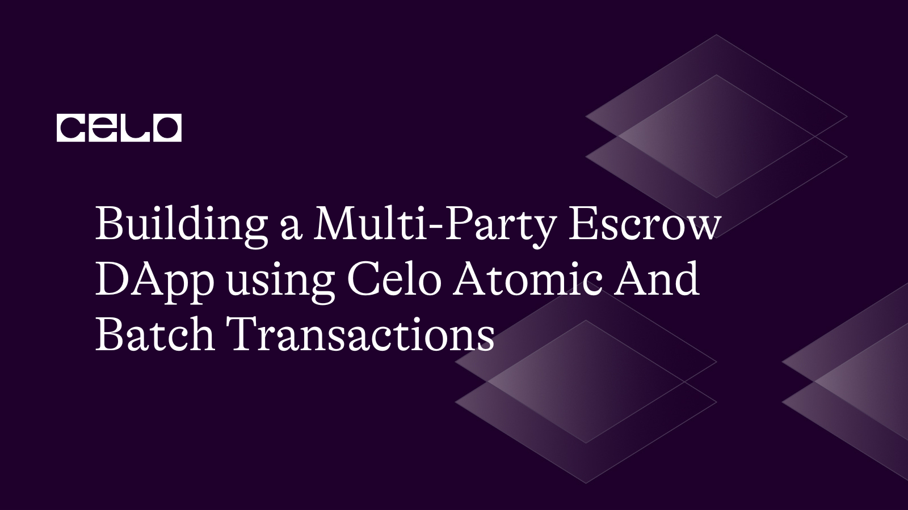

## Introduction​

In this tutorial, we'll walk through the process of building a decentralized application (DApp) on the Celo blockchain that facilitates multi-party escrow transactions using atomic and batch transactions. We'll create a simple DApp that allows users to escrow funds for a specified period of time, with the ability to release the funds or return them to the original sender depending on predefined conditions.
We'll walk you through each step of the process, providing explanations and code examples along the way. By the end of this tutorial, you'll have a working DApp that you can use to facilitate multi-party escrow transactions on the Celo blockchain using atomic and batch transactions.
The central focus of this tutorial is to show you how to handle batch transactions, both from the smart contract and normal transfer without a smart contract. I will be showing you code samples of how to do that including batch token transfers using ERC1155.
We will make use of Solidity, harhat, react and Celo composer.

## Prerequisites​

To successfully follow along in this tutorial you need basic knowledge of:

- HTML, CSS, React and Next.js
- Blockchain, solidity and hardhat
- Celo Alfajores account

## Requirements​

To build this DApp we will need the following tools:

- [Vscode](https://code.visualstudio.com/) - But you can use any code editor of your choice
- [Hardhat](https://hardhat.org/) - used to deploy the smart contract
- [Alfajores Testnet Account](https://play.google.com/store/apps/details?id=org.celo.mobile.alfajores&hl=en&gl=US&pli=1) - required to connect to the dApp and make test transactions
- [Node](https://nodejs.org/en/)- an open-source, cross-platform JavaScript runtime environment
- [Celo Composer](https://github.com/celo-org/celo-composer)- starter project with all code needed to build, deploy, and upgrade a dapps on Celo.
- [Celo Wallet Extension](https://chrome.google.com/webstore/detail/celoextensionwallet/kkilomkmpmkbdnfelcpgckmpcaemjcdh?hl=en) / [Metamask](https://metamask.io/) - For interacting with the Celo blockchain

## Let’s Get Started

In this tutorial we will build a Multi-Party Escrow DApp using Celo Atomic And Batch Transactions. The tutorial will focus more on atomic and batch transactions and its importance. Before we start building our Multi-party Escrow Dapp let's look at batch and atomic transactions.

## Batch and Atomic Transactions

### What are Batch Transactions

Batch transactions refer to a technique where multiple transactions are grouped together into a single transaction and processed as a single unit on the Ethereum blockchain. This is done to optimize gas fees, which are the fees required to perform transactions on the Ethereum network, and reduce the overall cost of executing transactions.

**Fig 5-1** Batch Transfer


### Atomic Transactions

Atomic transactions on Celo are implemented using the concept of "revert on error," which means that if any of the operations within a transaction fail, the entire transaction is reverted, and the state changes are rolled back. This ensures that either all the operations within a transaction are successfully completed, or none of them are, avoiding partial or inconsistent updates to the blockchain state.

Atomic transactions on Celo can provide benefits such as transaction integrity, consistency, and composability.

**Fig 5-2** Atomic Transfer


### When and Why you should Perform Batch Transactions

Batch transactions are typically used in scenarios where multiple transactions need to be executed together and have similar characteristics, such as transactions involving multiple transfers or interactions with multiple smart contracts. Some common use cases for batch transactions include token transfers, decentralized finance (DeFi) transactions, and batched interactions with decentralized applications (dApps).

### Benefits of Batch Transactions

Performing batch transactions can be beneficial in several ways.

- Firstly, it can help reduce gas fees, as the combined gas cost of a batched transaction is often lower compared to individual transactions.
- Secondly, batch transactions can help improve the efficiency and speed of transactions, as they allow multiple transactions to be processed in a single transaction, reducing the overall time taken to execute them.
- Lastly, batch transactions can help reduce congestion on the Ethereum network, as they occupy less block space compared to multiple individual transactions, which can lead to faster transaction confirmation times.

### Ethereum Standards that Allow Batch Transactions

Not all Ethereum standards support batch transactions. However, standards such as ERC-1155 are commonly used with batch transactions. These standards allow multiple token transfers to be bundled together into a single transaction, reducing gas fees and improving transaction efficiency.

[ERC1155](https://ethereum.org/en/developers/docs/standards/tokens/erc-1155/#batch_transfers) supports a couple of batch transactions. More detailed explanations on each of these batch transactions [here](https://eips.ethereum.org/EIPS/eip-1155).

- **Batch Transfer:** Transfer multiple assets in a single call.
- **Batch Balance:** Get the balances of multiple assets in a single call.
- **Batch Approval:** Approve all tokens to an address.
- **Mint Batch:** This function is used to mint multiple tokens

### Limitations of Batch Transactions

It's important to note that batch transactions may not always be suitable for all scenarios, as they have limitations, such as the need for similar characteristics among transactions, and potential limitations in the number of transactions that can be included in a single batch. It's essential to carefully consider the requirements of the specific use case and evaluate the gas fees, efficiency, and other factors before deciding to perform batch transactions on the Ethereum blockchain.

### Difference Between Batch And Atomic Transactions

Batch transactions and atomic transactions are two different concepts in the context of Ethereum transactions.

- Batch Transactions: As mentioned before, batch transactions refer to a technique where multiple transactions are grouped together into a single transaction and processed as a single unit on the Ethereum blockchain. Batch transactions can be achieved using smart contracts or specialized tools that support batching. The key idea is to combine multiple transactions into one transaction, which is then submitted to the Ethereum network for processing. Batch transactions can help reduce gas fees, improve transaction efficiency, and reduce congestion on the Ethereum network.

- Atomic Transactions: Atomic transactions, on the other hand, refer to a type of transaction that is designed to be executed as a single, indivisible unit. In the context of Ethereum, atomic transactions are often used in the context of smart contracts to ensure that multiple state changes within the contract occur together or not at all. In other words, either all the operations within an atomic transaction are successfully completed, or none of them are. If any of the operations fail, the entire transaction is reverted, and the state changes are rolled back.

The key difference between batch transactions and atomic transactions is the nature of their execution. Batch transactions are a way to group multiple transactions together for more efficient processing, where each transaction can be executed independently and may succeed or fail individually. On the other hand, atomic transactions are designed to ensure that multiple operations within a transaction are executed together or not at all, with an all-or-nothing approach.

Both batch transactions and atomic transactions can be useful in different scenarios depending on the requirements of the use case. Batch transactions can help optimize gas fees and improve transaction efficiency when multiple transactions with similar characteristics need to be processed together. Atomic transactions, on the other hand, can ensure that multiple operations within a transaction are executed atomically, providing guarantees of transaction integrity and consistency. It's important to carefully consider the specific requirements of the use case and choose the appropriate approach accordingly.

Now that you have a fair knowlege of batch and atomic transactions. Let's move to the next step of the tutorial.

## Multi-Escrow Dapp

Now, let's start building our Escrow Dapp.

What does A multi-party escrow dApp mean? A multi-party escrow dApp simply means a decentralized escrow platform. What does escrow mean? Escrow is a third-party arrangement where a buyer deposits some asset with the escrow and payment is made to the seller through the escrow after a particular period of time or after a certain condition has been met.

For the purpose of this tutorial, we will be building an Escrow smart contract that accepts funds from the buyer in this case called the sender. And a React/Nex.js frontend to interact with the contract.

The Escrow Smart Contract comprises of the following features;

- Ability to fund the escrow account
- Send batch transfers to all receivers
- Transfer fund to receiver
- Make refund to sender
- Get the list of all the senders
- Get contract balance

To follow along with this tutorial here is the github repo for the complete [code](https://github.com/gconnect/sage-multi-escrow-dapp).

### Step 1: Setup the Project

First, let's set up our project. Create a new directory and run the following commands and follow the steps

`npx @celo/celo-composer@latest create

Select React, Tailwind css and React-Celo option and then enter your project name. For detail on the steps checkout the [Celo Composer](https://github.com/celo-org/celo-composer) github readme page.

Once you have successfully completed the steps do `npm install` or `yarn` to install all required dependencies. Once that is done you are ready to start building.

Now open your newly created project. You will see a packages folder inside the package folder you will see hardhat and react-app folder.

For security reasons in order not to expose your private keys to the public create a new file named `.env` in the root of the hardhat folder add this line of code:

`PRIVATE KEY = <YOUR PRIVATE KEY>`

### Set up a Celo Account

To get started with Building a Multi-Party Escrow DApp using Celo Atomic And Batch Transactions, we need to set up a Celo Account. You can use the Celo Wallet app, which is available on both iOS and Android devices, or you can use a browser extension such as Metamask or Celo Wallet Extension. Once you have set up your account visit Celo testnet [faucet](https://faucet.celo.org/) for test tokens. You will need to fund your account to deploy the contract and perform other smart contract interactions.

### Step 2: Write the Smart Contract

Now, let's write the smart contract. The smart contract is written using solidity. Create a new file named **Escrow.sol** in the contracts directory of the hardhat folder and add the following code:

```solidity
 // SPDX-License-Identifier: MIT


pragma solidity ^0.8.0;


contract Escrow {


   struct EscrowData {
       uint256 amount;
       uint256 releaseTime;
       address payable sender;
       address payable receiver;
       bool returned;
       bool released;
   }


   EscrowData [] public escrowList;


   address payable owner;
   mapping(address => EscrowData) public escrows;


   event FundsEscrowed(address indexed sender, uint256 amount);
   event FundsReturned(address indexed sender, uint256 amount);
   event FundsReleased(address indexed sender, uint256 amount);


   constructor(){
       owner = payable(msg.sender);
   }


   modifier onlyOwner {
       require(msg.sender == owner, "You are not the owner");
       _;
   }


   function escrowFunds(address payable _receiver, uint256 _releaseTime) external payable {
       require(_releaseTime > block.number, "Release time must be in the future");
       require(msg.value > 0, "Amount must be greater than 0");


       EscrowData storage escrowData = escrows[msg.sender];
       require(escrowData.amount == 0, "Sender already has an active escrow");


       escrowData.amount = msg.value;
       escrowData.releaseTime = _releaseTime;
       escrowData.sender = payable(msg.sender);
       escrowData.returned = false;
       escrowData.released = false;
       //Handle storing of escrow data in a list;
       escrowList.push(EscrowData(msg.value, _releaseTime, payable(msg.sender), _receiver, false, false));
       emit FundsEscrowed(msg.sender, msg.value);
   }


   function returnFunds(address _sender) external onlyOwner {
       EscrowData storage escrowData = escrows[_sender];
       require(!escrowData.returned, "Funds have already been returned");
       require(block.number >= escrowData.releaseTime, "Release time has not arrived yet");
       require(escrowData.sender == _sender, "You don't have money on the escrow");
       escrowData.returned = true;
       escrowData.sender.transfer(escrowData.amount);


       emit FundsReturned(escrowData.sender, escrowData.amount);
   }

   function releaseFunds(address _receiver) external onlyOwner {
       EscrowData storage escrowData = escrows[_receiver];
       require(!escrowData.returned, "Funds have already been returned");
       require(!escrowData.released, "Funds have already been released");
       require(block.number >= escrowData.releaseTime, "Release time has not arrived yet");
       require(escrowData.receiver == _receiver, "You don't have money on the escrow");
       escrowData.returned = true;
       escrowData.receiver.transfer(escrowData.amount);


       emit FundsReleased(escrowData.receiver, escrowData.amount);
   }


   function batchTransfer(address payable[] calldata _receivers, uint256[] calldata _amounts) external onlyOwner {
       require(_receivers.length == _amounts.length, "Number of receivers must be equal to number of amounts");


       for (uint256 i = 0; i < _receivers.length; i++) {
           EscrowData storage escrowData = escrows[_receivers[i]];
           require(escrowData.sender == escrowData.sender, "You don't have money on the escrow");
           require(!escrowData.returned, "Funds have already been returned");
           require(!escrowData.released, "Funds have already been released");
           require(block.number >= escrowData.releaseTime, "Release time has not arrived yet");
           escrowData.returned = true;
           escrowData.released = true;
           _receivers[i].transfer(_amounts[i]);


           emit FundsReturned(_receivers[i], _amounts[i]);
       }
   }


    function groupTransfer() external onlyOwner {
       for (uint256 i = 0; i < escrowList.length; i++) {
           EscrowData storage escrowData = escrowList[i];
           require(escrowData.receiver == escrowData.receiver, "You don't have money on the escrow");
           require(!escrowData.returned, "Funds have already been returned");
           require(!escrowData.released, "Funds have already been returned");
           escrowData.returned = true;
           escrowData.released = true;
           escrowData.receiver.transfer(escrowData.amount);
           emit FundsReleased(escrowData.receiver, escrowData.amount);
       }
   }


   function getEcrowList() public view returns(EscrowData [] memory){
       return escrowList;
   }


   function getContractBalance() public onlyOwner view returns(uint256) {
       return address(this).balance;
   }


}

```

Here is a detailed breakdown of what the above smart contract code does;

```solidity
// SPDX-License-Identifier: MIT


pragma solidity ^0.8.0;
```

The first line indicates the license under which the code is distributed. The next line specifies the version of Solidity being used.

```solidity
struct EscrowData {
       uint256 amount;
       uint256 releaseTime;
       address payable sender;
       address payable receiver;
       bool returned;
       bool released;
   }


   EscrowData [] public escrowList;


   address payable owner;
   mapping(address => EscrowData) public escrows;
```

The `EscrowData` struct manages the Escrow data. And a global state list of the EscrowData, owner is set to payable so that the owner can send and receive payment. And a mapping to map the EscrowData to the user address.

```solidity
   event FundsEscrowed(address indexed sender, uint256 amount);
   event FundsReturned(address indexed sender, uint256 amount);
   event FundsReleased(address indexed sender, uint256 amount);


   constructor(){
       owner = payable(msg.sender);
   }


   modifier onlyOwner {
       require(msg.sender == owner, "You are not the owner");
       _;
   }
```

There are three events the `FundsEscrowed`,`FundsReturned` and `FundsReleased` are emitted when a new transaction occurs. The constructor function initializes the owner variable to the address of the account that deployed the contract. The `onlyOwner` modifier checks if the person making the contract function call is the owner.

```solidity
  function escrowFunds(address payable _receiver, uint256 _releaseTime) external payable {
       require(_releaseTime > block.number, "Release time must be in the future");
       require(msg.value > 0, "Amount must be greater than 0");


       EscrowData storage escrowData = escrows[msg.sender];
       require(escrowData.amount == 0, "Sender already has an active escrow");


       escrowData.amount = msg.value;
       escrowData.releaseTime = _releaseTime;
       escrowData.sender = payable(msg.sender);
       escrowData.returned = false;
       escrowData.released = false;
       //Handle storing of escrow data in a list;
       escrowList.push(EscrowData(msg.value, _releaseTime, payable(msg.sender), _receiver, false, false));
       emit FundsEscrowed(msg.sender, msg.value);
   }
```

The ' EscrowFunds' function takes in two parameters. The receiver and release time. This allows the sender to enter the escrowed amount with the `msg.value`. The function also checks that the current block number is not greater than the release time. It also checks if the escrow is still active. And also checks that the escrow amount is not zero. The last line emits the event.

```solidity
  function returnFunds(address _sender) external onlyOwner {
      EscrowData storage escrowData = escrows[_sender];
      require(!escrowData.returned, "Funds have already been returned");
      require(block.number >= escrowData.releaseTime, "Release time has not arrived yet");
      require(escrowData.sender == _sender, "You don't have money on the escrow");
      escrowData.returned = true;
      escrowData.sender.transfer(escrowData.amount);


      emit FundsReturned(escrowData.sender, escrowData.amount);
  }

```

The `returnFunds` function handles returning of the funds to the sender. It takes in the sender’s address and can only be called only by the contract owner.

```solidity
function releaseFunds(address _receiver) external onlyOwner {
       EscrowData storage escrowData = escrows[_receiver];
       require(!escrowData.returned, "Funds have already been returned");
       require(!escrowData.released, "Funds have already been released");
       require(block.number >= escrowData.releaseTime, "Release time has not arrived yet");
       require(escrowData.receiver == _receiver, "You don't have money on the escrow");
       escrowData.returned = true;
       escrowData.receiver.transfer(escrowData.amount);


       emit FundsReleased(escrowData.receiver, escrowData.amount);
   }

```

The `releaseFund` function is called to release the fund to the receiver. It takes in one parameter, the receiver address.

```solidity
function batchTransfer(address payable[] calldata _receivers, uint256[] calldata _amounts) external onlyOwner {
       require(_receivers.length == _amounts.length, "Number of receivers must be equal to number of amounts");


       for (uint256 i = 0; i < _receivers.length; i++) {
           EscrowData storage escrowData = escrows[_receivers[i]];
           require(escrowData.sender == escrowData.sender, "You don't have money on the escrow");
           require(!escrowData.returned, "Funds have already been returned");
           require(!escrowData.released, "Funds have already been released");
           require(block.number >= escrowData.releaseTime, "Release time has not arrived yet");
           escrowData.returned = true;
           escrowData.released = true;
           _receivers[i].transfer(_amounts[i]);


           emit FundsReturned(_receivers[i], _amounts[i]);
       }
   }


    function groupTransfer() external onlyOwner {
       for (uint256 i = 0; i < escrowList.length; i++) {
           EscrowData storage escrowData = escrowList[i];
           require(escrowData.receiver == escrowData.receiver, "You don't have money on the escrow");
           require(!escrowData.returned, "Funds have already been returned");
           require(!escrowData.released, "Funds have already been returned");
           escrowData.returned = true;
           escrowData.released = true;
           escrowData.receiver.transfer(escrowData.amount);
           emit FundsReleased(escrowData.receiver, escrowData.amount);
       }
   }

```

The `groupTransfer` and `batchTransfer` function handles sending of funds to all the receivers in a single transaction. The two functions handle batch transfers differently. The groupTransfer function doesn’t take in any parameter, it just loop through the escrowlist. It also checks to ensure the receiver exists. The `batchTransfer` function takes in an array of receiver’s address and array of amounts. These functions are called only by the owner.

```solidity
   function getEscrowList() public view returns(EscrowData [] memory){
       return escrowList;
   }


   function getContractBalance() public onlyOwner view returns(uint256) {
       return address(this).balance;
   }
```

The `getEscrowList` shows the list of the EscrowData. And the `getContractBalance` gets the contract balance.

### Step 3: Deploy the Contract

Inside the hardhat directory navigate to the `scripts/deploy.tsx` and replace the code with this 👇

```solidity
// We require the Hardhat Runtime Environment explicitly here. This is optional
// but useful for running the script in a standalone fashion through `node <script>`.
//
// When running the script with `npx hardhat run <script>` you'll find the Hardhat
// Runtime Environment's members available in the global scope.
const hre = require("hardhat");


async function main() {
 // Hardhat always runs the compile task when running scripts with its command
 // line interface.
 //
 // If this script is run directly using `node` you may want to call compile
 // manually to make sure everything is compiled
 // await hre.run('compile');


 // We get the contract to deploy
 const Escrow = await hre.ethers.getContractFactory("Escrow");
 const escrow = await Escrow.deploy();


 const contractAddress = await (await escrow.deployed()).address;
 console.log(`Contract was deployed to ${contractAddress}`)
}


// We recommend this pattern to be able to use async/await everywhere
// and properly handle errors.
main()
 .then(() => process.exit(0))
 .catch((error) => {
   console.error(error);
   process.exit(1);
 });

```

To deploy the contract still on the hardhat directory enter the below command;
`npx hardhat run scripts/deploy.ts –network alfajores`

Once successfully deployed it will return the contract address and a generated ABI code, which we will use later to interact with the contract on the frontend.

You will see the generated json ABI code in the `artifacts/contracts/` directory.

### Step 4: Frontend interaction

For this tutorial we will be creating a simple UI. To interact with the frontend navigate to the `react-app` directory and run this command to start the development server
`npm run dev` will start the localhost server at port 3000.

Inside the react-app directory, create an `interact.tsx` file and copy the below code. This code handles all calls to the contract. Each of these contract calls will be used in our component where appropriate. Your `interact.tsx` file should look like this. 👇

**Note**
Copy the generated escrow.json abi code from the artifact folder and create a new file call it Escrow.json and paste the code there.

**interact.tsx**

```js
import escrowABI from "./Escrow.json";
import { BigNumber, ethers } from "ethers";
import Web3 from "web3";
const web3 = new Web3("https://alfajores-forno.celo-testnet.org");

const escrowAddress = "0xF894B143FcF4f12Aa7135bc1Bd6e87c1357c4EA6";

export function initContract(kit: any) {
  return new kit.connection.web3.eth.Contract(escrowABI.abi, escrowAddress);
}

//  Contract Calls
export const escrowFunds = async (
  address: string | null | undefined,
  kit: any,
  amount: string,
  receiver: string,
  releaseTime: string
) => {
  try {
    const txHash = await initContract(kit)
      .methods.escrowFunds()
      .send({
        from: address,
        value: ethers.utils.parseUnits(amount).toString(),
      });
    console.log(txHash);
  } catch (e) {
    console.log(e);
  }
};

export const groupTransfer = async (
  address: string | null | undefined,
  kit: any
) => {
  try {
    const txHash = await initContract(kit).methods.groupTransfer().send({
      from: address,
    });
    console.log(txHash);
  } catch (e) {
    console.log(e);
  }
};

export const batchTransfer = async (
  address: string | null | undefined,
  kit: any,
  escrowClientAddresses: string[],
  amount: string[]
) => {
  try {
    const txHash = await initContract(kit)
      .methods.batchTransfer(escrowClientAddresses, amount)
      .send({
        from: address,
      });
    console.log(txHash);
  } catch (e) {
    console.log(e);
  }
};

export const getEscrowList = async (kit: any) => {
  try {
    const response = await initContract(kit).methods.getEscrowList().call();
    console.log(response);
    return response;
  } catch (e) {
    console.log(e);
  }
};

export const getContractBalance = async (kit: any) => {
  try {
    const response = await initContract(kit)
      .methods.getContractBalance()
      .call();
    console.log(response);
    return response;
  } catch (e) {
    console.log(e);
  }
};

export const BatchTransaction = async (
  kit: any,
  account: string | null | undefined,
  transaction: any[]
) => {
  try {
    // Check if Web3 instance is available
    if (web3) {
      // Create a batch object
      // const batch = new web3.BatchRequest();
      const batch = new kit.connection.web3.BatchRequest();

      for (let i = 0; i < transaction.length; i++) {
        // Add transactions to the batch
        batch.add(
          web3.eth.sendTransaction.request({
            from: account,
            to: transaction[i].address,
            value: ethers.utils.parseUnits(transaction[i].amount).toString(),
          })
        );
      }
      // Execute the batch
      batch.execute();
    }
  } catch (error) {
    console.error("Batch Transaction Error:", error);
  }
};
```

The above code handles all interactions with the smart contract except for the `BatchTransaction` function which handles a list of transfers using the web3.js BatchRequest. The function loops through a list of transactions with addresses and amount and adds them to a batch to be sent as a single transaction.

Once the `BatchTransaction` is called you will see something like this screen if you interact with Metamask.

**Fig 4-1** Batch Transfer
This screen shows two pending transactions.


**index.js**
The landing page of the UI should look like this 👇

**Fig 4-2** Landing Page


The Above screen contain input fields and buttons to interact with the contract.

Replace the code in `index.js` with this 👇

```solidity
import React, { useState, useEffect, useCallback  } from 'react'
import {
 escrowFunds,
  getContractBalance, getEscrowList, groupTransfer
} from '@/interact'
import { useCelo } from '@celo/react-celo';
import InputFieldList from '@/components/InputField';


export default function Home() {


 const { kit, address } = useCelo()
 const [employees, setEmployees] = useState<any[]>([])
 const [contractBal, setContractBal] = useState<number>(0)
 const [users, setUsers] = useState<any[]>([])
 const [input, setInput] = useState<string>("")
 const [receiver, setReceiver] = useState<string>("")
 const [releaseTime, setReleaseTime] = useState<string>("")


  const handleInput = (e: React.FormEvent<HTMLInputElement>) => {
   setInput(e.currentTarget.value)
 }


 const handleReceiver = (e: React.FormEvent<HTMLInputElement>) => {
   setReceiver(e.currentTarget.value)
   }
   const handleReleaseTime = (e: React.FormEvent<HTMLInputElement>) => {
   setReleaseTime(e.currentTarget.value)
 }


 const fundEscrowAccount = useCallback(async () => {
   if (input || receiver || releaseTime) {
     await escrowFunds(address, kit, input, receiver, releaseTime);
   } else {
     alert("Field required")
   }
   }, [kit, address, input, receiver, releaseTime])
  const handleContractBalance = useCallback( async () => {
   const res = await getContractBalance(kit);
   setContractBal( res)
 }, [kit])


   const handleUsers = useCallback( async () => {
   const res = await getEscrowList(kit);
   setUsers(res)
 }, [kit])


 useEffect(() => {
   handleContractBalance()
   handleUsers()
 }, [handleContractBalance, handleUsers])
 return (
   <div>
   {!address ? <div>Please connect your wallet</div> :
       <div>
         <h1 className='text-4xl text-center m-4'>Multi-Party Escrow Dapp</h1>
         <h1 className='my-4'>{`Escrow Account Bal: ${contractBal/1e18} CELO`}</h1>
         <div className="flex ">
           <InputFieldList/>
         </div>
         <div>
         <input className='border-2 p-2' type="text" placeholder='Receiver' value={receiver} onChange={handleReceiver}/>
         <input className='border-2 p-2' type="text" placeholder='Release time' value={releaseTime} onChange={handleReleaseTime}/>
         <input className='border-2 p-2' type="text" placeholder='make deposit' value={input} onChange={handleInput}/>
         <button
           onClick={fundEscrowAccount}
               type="button"
               className="mt-4 inline-block rounded bg-teal-500 px-6 pt-2.5 pb-2 text-xs mx-2
                font-medium uppercase leading-normal text-white shadow-[0_4px_9px_-4px_#3b71ca] transition duration-150 ease-in-out hover:bg-primary-600 hover:shadow-[0_8px_9px_-4px_rgba(59,113,202,0.3),0_4px_18px_0_rgba(59,113,202,0.2)] focus:bg-primary-600 focus:shadow-[0_8px_9px_-4px_rgba(59,113,202,0.3),0_4px_18px_0_rgba(59,113,202,0.2)] focus:outline-none focus:ring-0 active:bg-primary-700 active:shadow-[0_8px_9px_-4px_rgba(59,113,202,0.3),0_4px_18px_0_rgba(59,113,202,0.2)]"
               data-te-ripple-init
               data-te-ripple-color="light">
               Fund Escrow Account
         </button>
         </div>
         <button
           onClick={() => groupTransfer(address, kit)}
               type="button"
               className="mt-4 inline-block rounded bg-yellow-500 px-6 pt-2.5 pb-2 text-xs mx-2
                font-medium uppercase leading-normal text-white shadow-[0_4px_9px_-4px_#3b71ca] transition duration-150 ease-in-out hover:bg-primary-600 hover:shadow-[0_8px_9px_-4px_rgba(59,113,202,0.3),0_4px_18px_0_rgba(59,113,202,0.2)] focus:bg-primary-600 focus:shadow-[0_8px_9px_-4px_rgba(59,113,202,0.3),0_4px_18px_0_rgba(59,113,202,0.2)] focus:outline-none focus:ring-0 active:bg-primary-700 active:shadow-[0_8px_9px_-4px_rgba(59,113,202,0.3),0_4px_18px_0_rgba(59,113,202,0.2)]"
               data-te-ripple-init
               data-te-ripple-color="light">
               Group Transfer
         </button>
         {users.length < 1 ? null :
         <div>
           <h1 className='text-lg my-4'>Escrow Customers</h1>
           <table>
             <tr>
               <th className='border-2'>Sender Address</th>
               <th className='border-2'>Amount Deposited</th>
               </tr>
                 {users && users.map((item, index) => <tr key={index}>
                 <td className='border-2'>{item.sender}</td>
                 <td className='border-2'>{` ${item.amount/1e18} CELO`}</td>
           </tr>)}
           </table>
         </div>}
       </div>
   }
   </div>
 )
}
```

## Conclusion​

Congratulations 🎉 on finishing this tutorial! Thank you for taking the time to complete it. In this tutorial, you have learnt how to Build a Multi-Party Escrow DApp using Celo Atomic And Batch Transactions.

To have access to the full codebase, here is the link to the project repo on [github](https://github.com/gconnect/sage-multi-escrow-dapp).

## Net Steps

As a next step, apply what you have learnt in this tutorial and write a test coverage for the smart contract. Also create a more fancy UI and make all the necessary smart contract calls.

## About the Author​

Glory Agatevure is a blockchain engineer, technical writer, and co-founder of Africinnovate. You can connect with me on [Linkedin](https://www.linkedin.com/in/glory-agatevure-47a222ab/), [Twitter](https://twitter.com/agatevureglory) and [Github](https://github.com/gconnect/).

## References​

- [Celo Composer](https://github.com/celo-org/celo-composer)
- [Multisender App](https://classic.multisender.app/)
- [Web3 Batch Request](https://web3js.readthedocs.io/en/v1.2.9/web3.html#batchrequest)
- [Batch Ethereum Transactions](https://www.makeuseof.com/how-batch-ethereum-transactions-cheaper-gas-fees/)
- [How to Make Batch Transfer Request](https://www.quicknode.com/guides/ethereum-development/transactions/how-to-make-batch-requests-on-ethereum/)
- [EIP 1155](https://eips.ethereum.org/EIPS/eip-1155)
- [EIP 1155 Batch Transactions](https://ethereum.org/en/developers/docs/standards/tokens/erc-1155/#batch_transfers)
