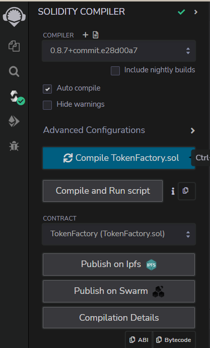
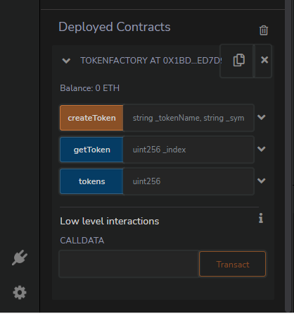
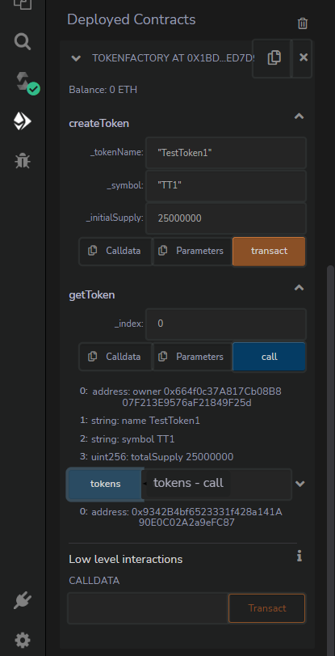
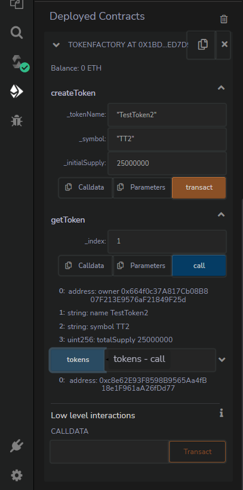

-

## Introduction
Smart contracts are programs running on blockchains. As a result, some design patterns and programming principles that apply to traditional software development also apply to smart contracts. A factory contract is similar to a class in object-oriented programming. In Solidity, a factory contract is a parent contract that will deploy other child contracts.

This article will demonstrate how to use the factory pattern to correctly deploy multiple instances of your smart contract. We will also discuss the factory pattern, its advantages, and its real-world applications. Let's dive right in.

## The Factory Contract
A Contract Factory, is a design pattern that allows you to create and deploy a new contract based on a template. It does this by using the new keyword in Solidity. A common naming convention for factory contracts is `somethingContractFactory.`

The concept behind the factory design pattern is simple: instead of creating objects directly, you have a single object (the factory) that does it for you. This also applies to Solidity because smart contracts are objects.

A basic factory contract should be able to deploy multiple instances of the same contract, store these created instances on the blockchain, and retrieve them when needed. You can add more functionality for managing deployed contracts, such as retrieving a specific instance of the contract, retrieving detailed information from or writing to a specific contract instance, and so on.

## Using the `new` Keyword
The `new` keyword in Solidity deploys and creates a new contract instance. It initializes the contract instance by deploying the contract, initializing the state variables, running its constructor, incrementing the nonce value by one, and returning the new contract address to the caller.

Deploying a contract involves checking whether the deployer has provided enough gas to complete deployment, generating a new address for the contract deployment using the deployer's address and nonce value, and passing on any Ether sent along with it.

## Factory Contract Use Cases

Factory contracts are widely used in production today, and they can be found in various decentralized applications such as Defi and NFTs built on blockchain applications. They are very effective at performing multiple functions, including:

### 1. Allowing Users to Create Liquidity Pools and Pairs

On decentralized exchanges (DEXs) where new trading pairs can be easily listed, factory contracts make it easier to develop and manage new liquidity pools and token pairs (e.g., Uniswap).

### 2. Making Interfaces to Help Users Create Their Tokens

Numerous token issuance platforms are available today, where new tokens can be developed and deployed with minimal manual intervention. 

Factory contracts enable non-technical blockchain users to create and manage their tokens more intelligently, increasing the general public's adoption and use of web3 technology (e.g., ThirdWeb).

### 3. Keeping Track of Deployed Contracts while Saving Gas

Factory contracts can be easily optimized for deployments using a clone factory contract, eliminating the need to store all bytecodes for each deployment. 

This is one method for significantly reducing the cost of each deployment, resulting in a very small payload to deploy each time. 

It entails radical restructuring, heavy use of libraries, and proxy contracts, resulting in a minimal payload to deploy each time.

## Setting Up With Remix
We will use the [Remix IDE](https://remix.ethereum.org/) for this tutorial. This tutorial assumes you have a decent grasp of Solidity and Remix IDE.

When you load up Remix in your browser, you will be greeted by this menu. For this example, we will be creating an ERC20 token factory contract. The intention is to deploy the token factory once and make as many ERC20 tokens as possible without having to deploy them ourselves.

### Step 1: Writing the ERC20 Token Code: 
Create a fairly standard ERC20 contract. This is the template contract or instance that the Factory contract will reproduce. Create a new solidity file called Token.sol inside the contracts folder and add the following code.

``` solidity
// SPDX-License-Identifier: MIT
pragma solidity ^0.8.0;
import "@openzeppelin/contracts/token/ERC20/ERC20.sol";

contract FoundationToken is ERC20 {
uint256 public initialAmount;
address public owner;

constructor(string memory _tokenName, string memory _symbol, uint256 _amount, address _owner) 
ERC20(_tokenName, _symbol) {
owner =_owner;
initialAmount = _amount;
_mint(msg.sender, initialAmount);
}

function Mint(address _toAddress, uint256 _amount) public {
require(msg.sender == owner, "Only Owner can call this function!");
_mint(_toAddress, _amount);
}
}
```

Being a powerful IDE, Remix can import solidity source files directly from GitHub. In line 3, we are importing the standard openzeppelin ERC20 implementation from GitHub, which our FoundationToken contract inherits (line 5). On line 9, the constructor takes four arguments and passes two of the arguments(_tokenName and _symbol) to the ERC20 constructor we inherited.

### Step 2: Writing the TokenFactory Contract

The FoundationToken contract cannot currently be created. So, we'll create a factory contract that will use the factory pattern to create individual instances of the FoundationToken contract.

To begin our TokenFactory contract, create a new file called TokenFactory.sol in the contracts folder. You can include the following code in that file:

``` solidity
// SPDX-License-Identifier: MIT
pragma solidity ^0.8.0;
import "./Token.sol";

contract TokenFactory {
FoundationToken[] public tokens;
uint256 count;

event TokenCreated (address indexed TokenAddress, string TokenName, uint256 InitialSupply, address Owner, uint256 Index);

function createToken(string memory _tokenName, string memory _symbol, uint256 _initialSupply ) public {
FoundationToken token = new FoundationToken(_tokenName, _symbol, _initialSupply, msg.sender);
tokens.push(token);
uint256 _index = count;
count += 1;
emit TokenCreated(address(token), _tokenName, _initialSupply, msg.sender, _index);
}

function getToken(uint _index) public view
returns (address owner, string memory name, string memory symbol, uint256 totalSupply)
{
FoundationToken token = tokens[_index];

return (token.owner(), token.name(), token.symbol(), token.totalSupply());
}
}
```

On line 3, we are locally importing the [Token file](https://gist.github.com/johnfawole/6e9f185e05235d2adfaea715d0645c04). Here we instantiate the Token contract FoundationToken token, create an array of type FoundationTokens FoundationToken[] public tokens to keep track of the newly created token contracts, and finally, the magic function createToken(), which takes the FoundationTokens's constructor parameters as arguments. 

The count is an internal variable we use to track the deployed token indexes. After a token is successfully created, the TokenCreated event is fired. The value at index 0 in the tokens array becomes the address of the first created contract!

This line creates a new contract:

``` solidity
FoundationToken token = new FoundationToken(_tokenName, _symbol, _initialSupply, msg.sender);
```

Lastly, we have our getToken function. This function takes an uint256 number representing the token contract index we want to look up. It is a view function, as it doesn't modify the chain's state. It also returns four parameters:
* Owner address
* Token Name
* Token symbol
* Total Supply of the tokens

### Step 3: Testing with Remix
Switch to the "Solidity Compiler" tab and compile both contracts by pressing the "ctrl" + "s" keys ("Command+S" for Mac users) simultaneously.



Now, we are all set to deploy the contract. Switch to "Deploy & Run Transactions" tab and deploy the [TokenFactory contract](https://gist.github.com/johnfawole/f03a43c1a099cf1418bca0ba70d3c49c).


You should ensure that the "CONTRACT" field is set to "TokenFactory" before you click "Deploy" the full code is also [available here](https://gist.github.com/johnfawole/f03a43c1a099cf1418bca0ba70d3c49c) for reference.

## Interacting with the Deployed Contract



Under the new "Deployed Contracts" tab, you can see the deployed factory contract. You should proceed to call the createToken function. This function takes the token name, symbol and initial supply as arguments. After the successful contract call, we can get a token at index "0" by calling the getToken function to get the token information stored on the factory contract.



We can also call the createToken function to create another ERC20 token from the factory contract using different parameters.



## Conclusion

In this article, we've explored factory contracts by building a factory token contract, its use cases, insights into the "new" keyword in Solidity, and its relevance in building factory contracts. You have leveled up your Solidity skills and are on your way to becoming a solidity master!

In this guide, you learned about the factory contract method and how to implement them using Remix. Well done!

## Next Step
Most DEXs in Web3 utilized factory contracts to facilitate their operations. You can look into how Uniswap implements factory contracts and do the same. Another fun project you can do next is to study common vulnerabilities in most smart contracts.

## About the Author
John Fawole is a blockchain technical writer and Solidity developer; connect with him on [LinkedIn](https://www.linkedin.com/in/johnfawole/).