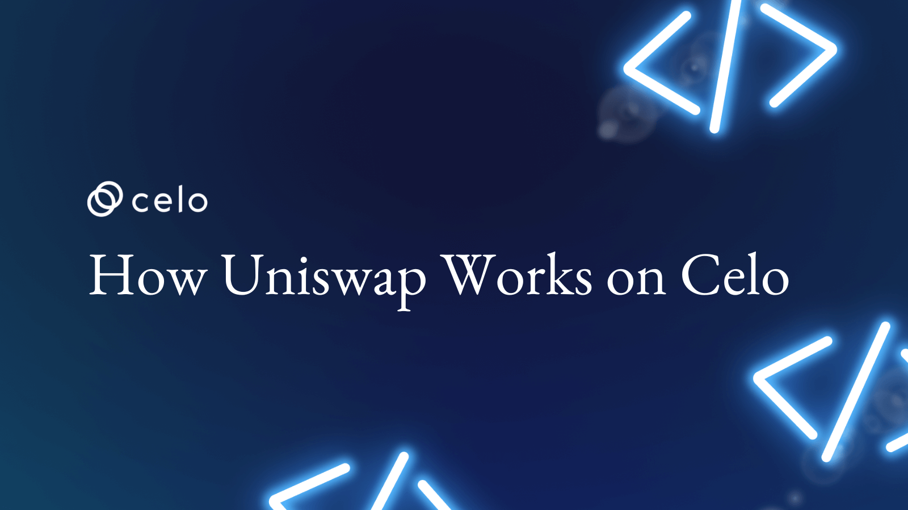
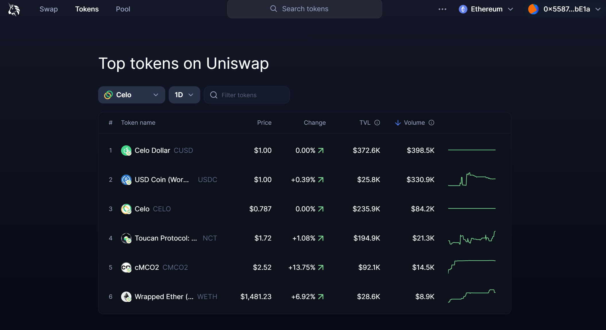
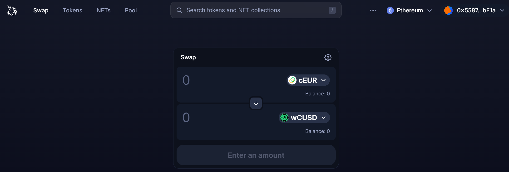
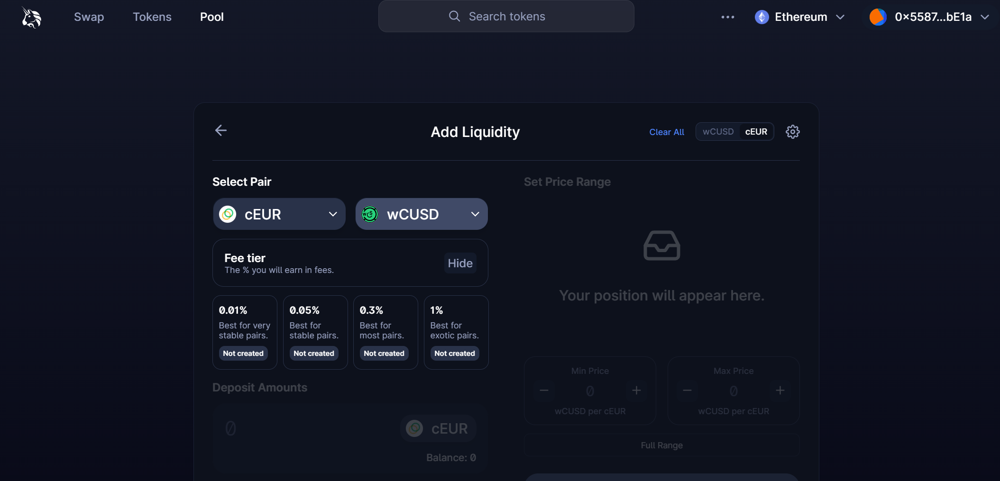
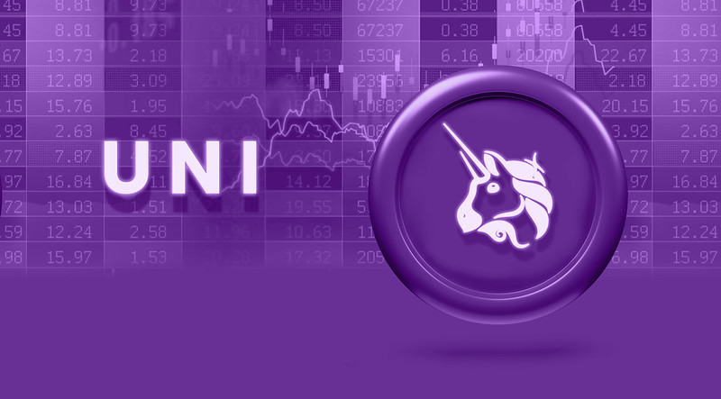

**Meta Description**:

Uniswap is the largest functional decentralized exchange on the Ethereum blockchain, offering seamless digital assets transactions. Here's how it works:

# **Introduction**

Uniswap is undoubtedly the largest functional decentralized exchange (DEX) on the Ethereum blockchain network. It implements a unique exchange protocol with benefits like trustless swapping ERC20 tokens between users –a contrast to the “traditional order book model”.

Ideally, Uniswap pools tokens into smart contracts that users can trade against—giving every user the option of swapping tokens, adding tokens to a pool (liquidity pool) while earning fees, and listing tokens on Uniswap.

In this article, we'd explore the nitty-gritty of how Uniswap works and how as a beginner, you can maximize all the opportunities it provides. Notably, Uniswap has a simple interface for optimum user experience. Still, there's more to Uniswap than meets the eye, and you'd learn more about everything behind the scenes. Let's dive right in!

## **What is Uniswap and How does it Work?**

Uniswap is a unique exchange platform, especially since it's fully decentralized. This means Uniswap isn't owned, operated, or controlled by any single entity. Also, Uniswap utilizes a refreshing model of trading known as the  “[automated liquidity protocol](https://academy.shrimpy.io/lesson/what-is-an-amm-automated-market-maker#),” a concept that automatically links a swap transaction to its respective liquidity pool.

The Uniswap platform is essentially built on the Ethereum blockchain –the second-largest cryptocurrency and it is available on Celo. As a platform, Uniswap was implemented for swapping and use in the year 2018. Since Uniswap is built on the Ethereum network, it is compatible with all ERC-20-based tokens and frameworks like the MyEther and MetaMask wallets.

Fundamentally Uniswap runs on two smart contracts, the “Exchange” contract and the “Factory” contract.

Both contracts are automated computer programs designed for specific uses and functions with conditions attached. For example, the factory smart contract works to add new tokens to the Uniswap platform, while the exchange contract eases all processes involved in token swaps and “trades.” Although Uniswap has seen many improvements and currently uses the third version of its platform, ERC20-based tokens can still be swapped across the updated Uniswap v.2 platforms.

## **How do Uniswap Liquidity Pools Work?**

Trading and exchanging tokens between Uniswap users is only possible with a liquidity pool. The best way to define a liquidity pool is a pool of tokens that allows users to swap between tokens and trade them for a profit. Tokens in the liquidity pool are usually added by liquidity providers (LPs). Liquidity providers are essentially end users who lock their tokens to smart contracts and earn fees when other users or traders swap their tokens with the availability of a liquidity pool.

Uniswap has progressively contributed to seamless digital currency transactions. The Uniswap V2 is even more intriguing because it allows traders to swap between ERC-20 tokens without hassle directly. Technically, Uniswap users do not trade with each other, as that might not mitigate the risk of token loss due to some end-user dishonesty. Instead, users deal with a liquidity token pool with a considerable reserved amount of both tokens involved in this user's trade.

Each [Uniswap Liquidity Pool](https://docs.uniswap.org/contracts/v1/guides/pool-liquidity) is designated as an avenue for trading a set pair of ERC-20 tokens. But, there are quite a lot of pairs, and it might take forever for each user to find a fitting liquidity pool for their transaction. Still, Uniswap takes the burden off users by automatically routing traders to the matching liquidity pool for their transactions.

Uniswap solves the liquidity problem of centralized exchanges through the automated liquidity protocol. This includes incentivizing people trading on the exchange when they become liquidity providers (LPs). In turn, it allows Uniswap users to pool their money together, creating a reserve fund that's used in the execution of all trades and token swaps on the platform. Every listed token has its designated pool for the user's contribution.

This system helps buyers and sellers eradicate wait time, as you'd experience in a peer-to-peer trading scenario. Rather, the system provides an instant execution to any trade as long as the transaction isn't greater than the liquidity pool itself. All LPs get a token reward for the amount of money/liquidity they provide in correspondence to the total liquidity of the pool.

For example, a contribution of $5,000 to a liquidity pool worth $50,000 means/you would get a 10% of the total reward the collection earns. The liquidity pool usually makes money by charging a fee for each swap and exchange transaction that occurs within the pool. In this case, Uniswap charges a 0.30% flat fee on every trade and swap transaction on the platform.

If a liquidity provider wishes to stop providing, they will receive the total fees they've earned from the reserve. After receiving their rewards, the tokens that keep a record of what the user owns are then destroyed. All the arrangements and protocols discussed are the basic framework of Uniswap's Liquidity Pool.

Progressively upon upgrade to V2, Uniswaps introduced a more promising reward like a protocol fee which can be turned on and off by community vote. It sends a 0.05% and 0.30% trading fee to a designated Uniswap fund to finance future development.

Uniswap V3 was recently deployed on the Celo blockchain to launch “Green Asset” liquidity pools and expand its reach to billions of smartphone users. As you may know, [Celo is a mobile-first DeFi platform](https://celo.org/) that provides fast, secure, and stable digital payment with near-zero fees. So this collaboration makes complete sense as Uniswap’s pools will be easily accessible by thousands of Celo users.

## **How Does Uniswap Work With Metamask?**

A lot can be said about the almost endless possibilities that lie with Uniswap. One of the most intriguing topics would be how Uniswap integrates and optimizes Metamask for more functionality and limitless potential. But how do the two work?  What are the underlying reasons why Uniswap works seamlessly with a wallet like Metamask? Let's find out!

Two notable features of Uniswap make it entirely compatible with Metamask.

1. Uniswap is an open-source protocol. This means anyone can create and build their frontend application for it, like Metamask or any other project that could be linked with Uniswap.
2. Uniswap is built on the Ethereum blockchain.

Metamask is more of a browser plugin or extension that doubles as a wallet. Since it's an [ERC-20 compatible wallet](https://www.investopedia.com/news/what-erc20-and-what-does-it-mean-ethereum/), it can store and save a token built on the Ethereum blockchain, making it the prime wallet choice for users who want in on the opportunities that Uniswap provides. But it doesn't take a genius to work it or link your Uniswap with a Metamask wallet. It's quickly done in two steps:

- Go to the Uniswap interface.
- Connect your wallet (MetaMask in this case).

Now, you are set to start utilizing your Metamask wallet for swapping and transactions on your Uniswap without hassle.

## **What are Uniswap Tokens Used For?**

[*Image by Satheesh Sankaran*](https://www.flickr.com/photos/justanothercreativesoul/52326474796/)

The Uniswap platform is open-source, and it uses blockchain-based smart contracts for facilitating decentralized trading between different and varying digital assets.

Each pair of these digital assets are swapped with the aid of the liquidity pools that implement smart contracts for rebalancing after every trade to keep the whole system functional and progressive. The Uniswap blockchain can be compared to an electronic ledger, and it's constantly updated with real-time trading activity as they happen between Uniswap users. This leaves the impression that Uniswap is an exchange, but unlike most, it's without the involvement or inclusion of central authorities. Uniswap is an automated market maker.

All Uniswap operations are built and rely on the Ethereum blockchain network and platforms.

Proof of work requires vast computing and energy resources, which support transaction processes and generate new cryptocurrency.

These decentralized exchanges occur in several ways creating a market that balances the supply and demand for trades between different tokens. It begs the question: what's the use of the Uniswap token?

Uniswap token (UNI) provides a unique opportunity that specially serves liquidity providers. Uniswap users who provide liquidity by staking enter a digital and legal agreement to not trade or sell their digital assets for a set time. However, they do it for rewards recorded in Uniswap tokens (UNI).

But it doesn't end there! They also take part in Uniswap governance. UNI token holders govern the Uniswap platform, with voting power determined and distributed in proportion to the users' set UNI balances.

To cash in their rewards from providing liquidity, the UNI that represents the LP reward is paid and then destroyed irrevocably to ensure transparency and security.

# **Conclusion**

Digital currencies are rapidly evolving, which creates an increasing influx of traders craving absolute decentralization. Platforms like [Celo](https://celo.org/about) make the technology more accessible to billions of users through their mobile-first DeFi solution. As a result, users of decentralized exchanges like Uniswap continue to rise.

However, a complete understanding of Uniswap's operation gives operational traders an edge to maximize the opportunities with DEX exchanges like Uniswap. We've explored core concepts of Uniswap, like Liquidity pools, liquidity providers, Uniswap tokens, and integrated wallets like Metamask.

# **Next Steps**

You can maximize the opportunities Uniswap presents right away by downloading the Celo Alfajores Wallet on your mobile device, giving you access to Uniswap’s liquidity pools.

# **About the Author[​](https://docs.celo.org/community/celo-sage/tutorial-structure#about-the-author)**

Joel Obafemi

A marketer, copywriter, and collab manager for web3 brands. You can connect with me on [LinkedIn](https://www.linkedin.com/in/joel-obafemi-a7179b19a/).

# **References**

- <https://www.coindesk.com/business/2021/02/04/what-is-uniswap-a-complete-beginners-guide/>
- <https://docs.uniswap.org/protocol/V2/concepts/core-concepts/pools>
- [UniSwap Tutorial: Beginners Guide on How to use UniSwap to Exchange & Add Liquidity](https://www.youtube.com/watch?v=PS1h8Mftk58&t=0s)
- <https://docs.uniswap.org/contracts/v1/guides/pool-liquidity>
- <https://www.investopedia.com/news/what-erc20-and-what-does-it-mean-ethereum>
