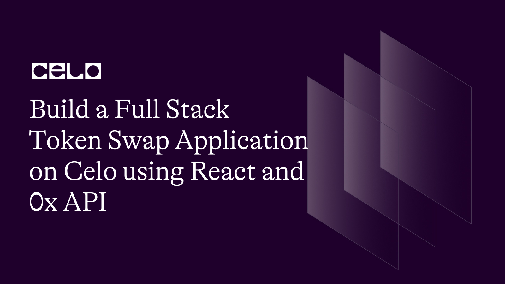
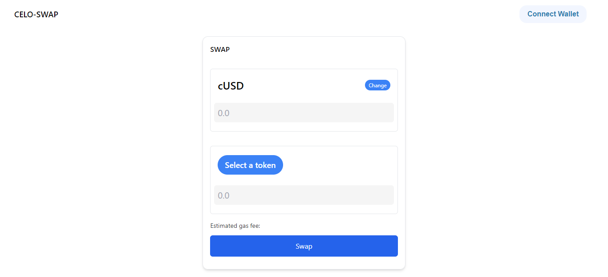
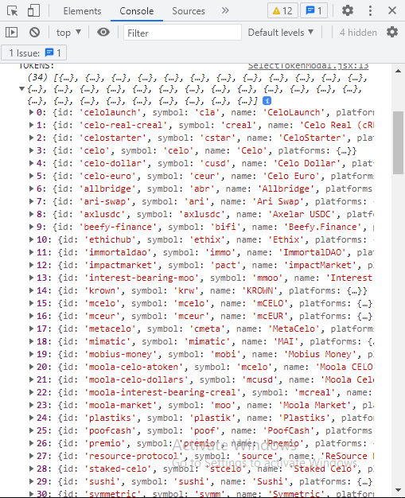
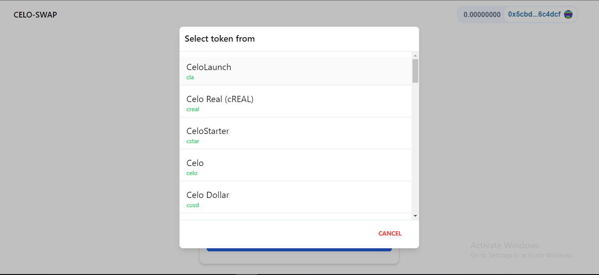
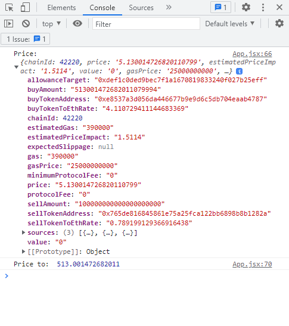
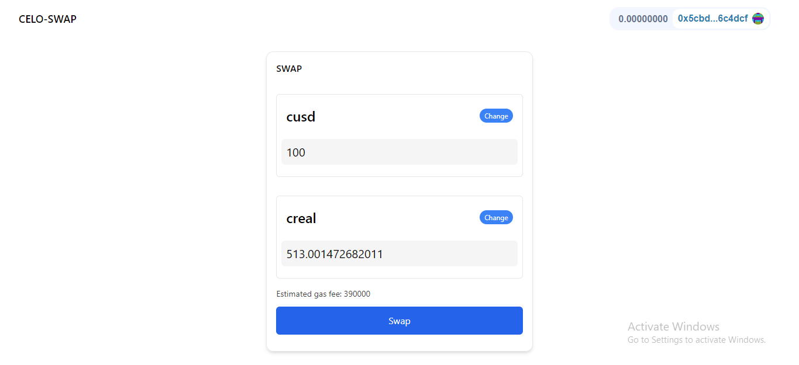
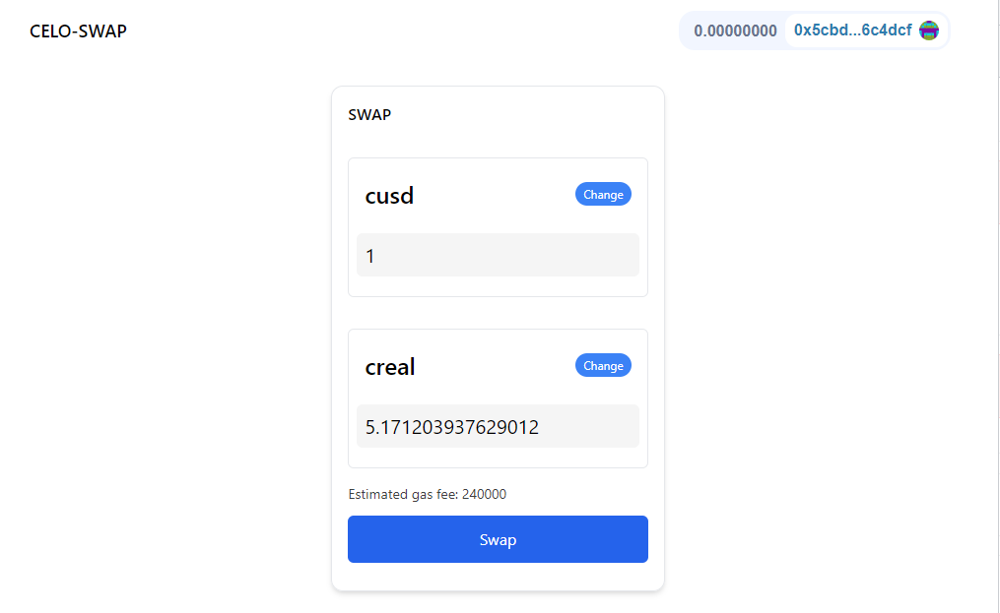
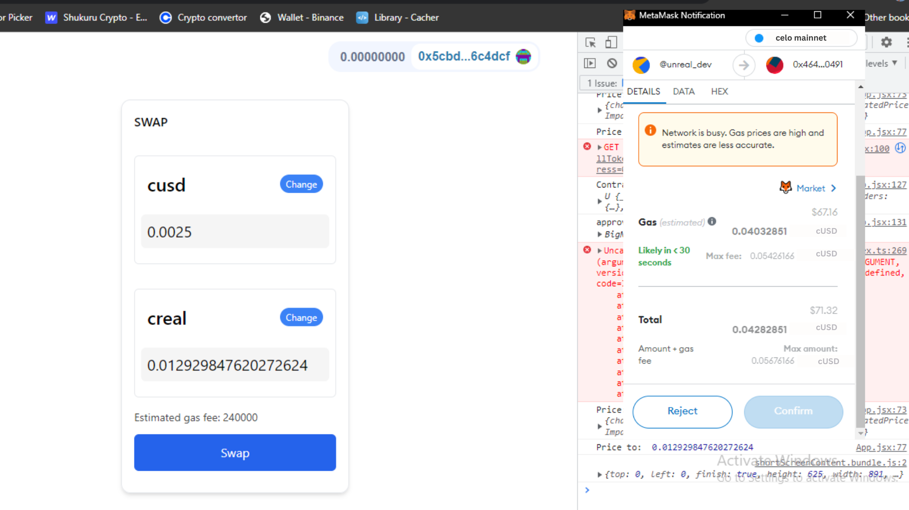

<!--truncate-->

## Introduction​

In this tutorial, we will build a full-stack token swap application on the Celo blockchain using React and 0x API. Our application will utilize the 0x API swap endpoint, which allows users to fetch available quotes across the liquidity supply and use smart order routing to split up a transaction across decentralized exchange networks to be filled with the lowest slippage possible while minimizing transaction costs. Major wallets and exchanges like MetaMask and Coinbase Wallet use this tool.

We will use React, a popular JavaScript library for building user interfaces, to create a simple and secure token swap application on the Celo network. By the end of this tutorial, you will learn how to query and display an ERC20 token list, use the 0x API swap endpoint, set a token allowance, and connect your application to the Celo network using ethers.js.

Whether you're a beginner or an experienced web3 developer, this tutorial will provide a step-by-step guide on creating a fully-functional token swap application on the Celo blockchain. So let's get started!

## Prerequisites​

Some familiarity with React working with Vite, in particular

Some understanding of Tailwind CSS

Understanding of basic terminal commands

## Requirements​

`npm (npx)` or`yarn`
node version v18.12.0

## Setting up the starter code

To get the starter code, go ahead and clone the project from Github, as shown below. This consists of a fundamental UI of the app that we'll
build the app's functionality from.

```js
git clone https://github.com/JovanMwesigwa/celo-sage-0x-swap/tree/starter-code

cd starter-code


```

This will clone the starter project to your local development environment.

Open the project in your favorable IDE, and install the dependencies with:

```bash
 yarn or npm install.
```

In your terminal, type `yarn run dev`to run the project in your browser.

Here's what you should have so far:



### The src folder structure

The src folder has the `App.jsx` and `components` folders, where most of our code is going to live.

Inside the `App.jsx`, we have the `NavbarComponent` and the `SelectTokenModal` imported at the top.

We have some simple state management and corresponding functions as shown below:

```js
...

  const [isOpen, setIsOpen] = useState(false)

  const [tokenFrom, setTokenFrom] = useState('cUSD')
  const [tokenTo, setTokenTo] = useState(null)
  const [choice, setChoice] = useState('to')

  const open = (choiceType) => {
    setChoice(choiceType)
    setIsOpen(true)
  }
  const close = () => setIsOpen(false)

  const selectToken = (token, choice) => {
    if (choice === 'from') {
      setTokenFrom(token)
      setIsOpen(false)
    } else {
      setTokenTo(token)
      setIsOpen(false)
    }
  }

  ...

```

`isOpen`: Handles the token selection modal state.

`tokenFrom` and `tokenTo`: Handles selected user tokens to swap.

`Choice`: Verifies what action the user is performing. For example, if the user selects from or selects a particular token.

`open()` and `close()`: Handle opening and closing of the select token modal.

Inside the `Components`, the folder has

1. `NavbarComponent.jsx`: This consists of the `ConnectButton` from web `uikit` that allows the user to easily connect their wallet of choice to the dapp.

2. `SelectTokenModal.jsx`: Consists of a modal that displays the lists of all available tokens the user will choose from when swapping.

This function takes in `close()` and `isOpen` state variables as parameters to handle the opening and closing of the modal.
The modal also uses the `choice()` and `selectToken()` state functions to allow a user to select a token from the modal.

### Fetching the tokens in the modal

Currently, our modal is prefilled with only two hard-coded tokens and symbols that we can select from.

Several DEX(s) like Ubeswap have various numbers of tokens and addresses listed on Celo that you can swap between each other depending on the liquidity.

Inside the `data` folder at the root of our project, I've prepared a `tokens.json` file with some of the tokens listed on Celo prefilled with their ERC20 addresses, symbols, and other details we'll use.

In the real-world scenario, you want your dApp to fetch the tokens from the main net.

Import the tokens data at the top of the `SelectTokenModel.jsx` file:

```js
import tokens from '../../data/tokens.json'
```

Inside the function body, log the data from the tokens data so that we can investigate the tokens data being imported.

```js
...

  console.log('TOKENS: ', tokens)

...

```

In your dApp, open inspect by right-clicking in your browser console to see the tokens data:



*Make sure you open the modal, to render the modal UI and log the tokens.*

Now that we have the tokens returned. We can go ahead and map through them and render them in our token component.

Inside the body of the modal component add:

```js

  {/*body*/}
  <div className="relative p-3 px-0 flex-auto overflow-y-scroll max-h-96">
    {tokens.map((item) => (
      <div
          key={item.id}
          onClick={() => selectToken(item, choice)}
          className="w-full px-4 mb-2 py-2 cursor-pointer justify-between border-b-[0.5px] hover:bg-neutral-50 flex flex-col "
      >
        <h1 className="text-xl ">{item.name}</h1>
        <h1 className="text-sm text-green-500">{item.symbol}</h1>
      </div>
    ))}
  </div>

  ...

```

We loop through all the available tokens and render their name and symbol in the modal as shown below:



The token component has an `onClick()` function that selects a token and updates the action choice state accordingly.

Final code for fetching and rendering the tokens in the modal

```js
git clone https://github.com/JovanMwesigwa/celo-sage-0x-swap/tree/fetch-tokens

```

### Fetch swap price

Our users can successfully select the tokens they want to swap. Let's help them find the best swap price.

A common functionality in most DEX apps is the ability to automatically generate a swap price when a user enters the token amount from value.

We want to automatically determine this price without letting the user explicitly press a button to see the price. We'll achieve this through the `onBlur()` function, which will call the `getPrice()` function that we'll define later.

`getPrice()` will fetch the price details of the swap and will show the user the token amount they'll receive, as well as the estimated gas fees that will cost the user.

Before we define the `getPrice()` function, we need to monitor some state variables for the app:

```js
...

  // Prices +
  const [amountEntered, setAmountEntered] = useState(0.0)
  const [amountTo, setAmountTo] = useState(null)
  const [gasPrice, setGasPrice] = useState(0.0)

...

```

`amountEntered`: Handles the amount of token entered by the user.

`amountTo`: Will be prefilled by the amount to tokenTo which the user will receive after the swap is successful

`gasPrice`: Will be prefilled by the estimated gas prices that the transaction will cost.

Define a `getPrice()` function as shown below:

```js
const getPrice = async () => {
  if (!tokenFrom.symbol || !tokenTo.symbol || !amountEntered) return

  // Get the amount by calculating it from the smallest base unit of a standard erc20 token which is 18
  let amount = Number(amountEntered) * 10 ** 18
}
```

Before we make the call to fetch the transaction details, we need to verify that all the data that the user is submitting is valid and complete.

The `amountEntered` by the user is converted to the smallest base unit standard of an ERC20 token using the `10 ** 18` before it's submitted.

```js
const getPrice = async() => {
  ...

    // set the params
    const params = {
      sellToken: tokenFrom.platforms.celo
        ? tokenFrom.platforms.celo
        : tokenFrom.symbol,
      buyToken: tokenTo.platforms.celo
        ? tokenTo.platforms.celo
        : tokenTo.symbol,
      sellAmount: amount,
    }

    // Fetch the swap price.
    const response = await fetch(
      `https://celo.api.0x.org/swap/v1/price?${qs.stringify(params)}`
    )

}

```

Create a params object and enter in the `sellToken` address from celo, if not available, enter in the token symbol. Same with `buyToken`.

Finally, we add the `sellAmount` passing in the converted amount.

The `1/price` endpoint from 0x is very similar to the `v1/quote` endpoint. The difference is that the latter returns the price details only, while the latter returns a signable transaction with all details that are ready to be submitted.

We're advised to use the `v1/price` endpoint when we're just estimating the swap price details and the `v1/quote` endpoint only when finally submitting the transaction.

```js
const getPrice = async() => {

  ...

    // Fetch the swap price.
    const response = await fetch(
      `https://celo.api.0x.org/swap/v1/price?${qs.stringify(params)}`
    )

    // Await and parse the JSON response
    const priceResult = await response.json()
    console.log('Price: ', priceResult)

    const pricesConverted = priceResult.buyAmount / 10 ** 18
    setAmountTo(pricesConverted)
    console.log('Price to: ', pricesConverted)

    setGasPrice(priceResult.estimatedGas)

  ...
}

```

Finally, we can now submit our swap params info to the 0x price endpoint.
The 0x endpoint requires us to stringify the `params` object and pass it to the URL of the endpoint.

In this case, we used an external library called `qs` to stringify the parameters properly.

In your terminal install:

```bash
yarn add qs

```

*Notice how we've prefixed the 0x endpoint with <https://celo> at the beginning. This is because we want to fetch the prices from the celo network.*

We continue to parse the result and convert the price from `priceResult.buyAmount` and get the estimated gas price from `priceResult.estimatedGas`.

The `getPrice()` function is almost done. Now we need to call it in the `onBlur()` of the input field of the tokenFrom component.

Add to the input:

```JS
...

  <input
    type=" number"
    placeholder="0.0"
    value={amountEntered}
    onChange={(e) => setAmountEntered(e.target.value)}
    onBlur={getPrice}
    className="bg-neutral-100 text-xl outline-none my-3 w-full rounded-md p-2"
  />

...

```

We've added the `onBlur()` to automatically call the `getPrice()` when the user is done typing in the data. This will return the price quote and prefill them accordingly.

In the app's UI, select swap tokens respectively and enter in a price to see our price logs.

Output log:



Adding all the necessary prices variables, our app UI completely prefills all the necessary data as shown below:



Final code for fetching token data

```bash
git clone https://github.com/JovanMwesigwa/celo-sage-0x-swap/tree/fetch-tokens

```

### Create a price quote

We can successfully connect the user to their MetaMask wallet account. Now we can use the 0x `v1/quote` endpoint to create a swap quote for the user.

As we covered before, the price quote endpoint created from 0x returns a signable object that a user can submit as a transaction to complete the swap transaction.

To achieve this, we must retrieve the user's account address from their wallet and pass it in as the `takerAddress`.

We'll use the `account` data from the `useMorales()` function that comes with the `react-morales` package we installed earlier.

We'll extract the current user address from their wallet by importing the `useMorales()` function and extracting the `account` from it as shown below:

```js
import { useMoralis, useWeb3Contract } from 'react-moralis'

...

// Extract the account address from their wallet
  const { account } = useMoralis()

...

```

Now that we have the user's account address we can create a `getQuote()` in your component. This will be called by the swap button when the user is ready to implement the swap finally.

```js
...


  const getQuote = async () => {
    if (!tokenFrom.symbol || !tokenTo.symbol || !amountEntered) return

    // Get the amount by calculating it from the smallest base unit of a standard erc20 token which is 18
    let amount = Number(amountEntered) * 10 ** 18

    // set the params
    const params = {
      sellToken: tokenFrom.platforms.celo
        ? tokenFrom.platforms.celo
        : tokenFrom.symbol,
      buyToken: tokenTo.platforms.celo
        ? tokenTo.platforms.celo
        : tokenTo.symbol,
      sellAmount: amount,
      takerAddress: account,
    }

    const response = await fetch(
      `https://celo.api.0x.org/swap/v1/quote?${qs.stringify(params)}`
    )

    // Await and parse the JSON response
    const priceResult = await response.json()
    console.log('Price: ', priceResult)

    const pricesConverted = priceResult.buyAmount / 10 ** 18
    setAmountTo(pricesConverted)
    console.log('Price to: ', pricesConverted)

    setGasPrice(priceResult.estimatedGas)

    return priceResult
  }

...

```

As you've noticed, `getQuote()` is very similar to the `getPrice()` function but has a few minor changes.

1. We include the `takerAddress` property.
2. Returns a signable transaction that can be the final step to implement the swap.

Finally, we can call `getQuote()` in the swap button, which will return the signable transaction and update all the necessary price state variables like gas estimates and amount.

We can verify this now on the app UI:



Final code for creating quote transaction

```js
git clone https://github.com/JovanMwesigwa/celo-sage-0x-swap/tree/create-quote

```

### Approve transfer

So far, all the activities we have been doing were outside the user's account.

To allow 0x to successfully implement the swap to the user, we need to ask the user to grant the
[0x Exchange Smart Contract](https://docs.0x.org/introduction/0x-cheat-sheet#exchange-proxy-addresses) to pull tokens from their account.

This is the standard procedure of most ERC20 contracts.
They come with an `approve()` method that grants permission for a contract to extract tokens from a user's account.

In this case, we want to allow the user to approve the 0x Exchange Smart contract to get the `tokenFrom` their account and send them a `tokenTo` their account.

### Exploring the approve function

`approve()` takes in many important arguments as explained below:

1. `address spender`: This is the address to which the user is granted permission to extract the token from their account. In our case, it's the 0x Exchange Contract address

2. `amount`: This is the maximum amount of tokens that we are allowing the sender address to extract from the user's account.

3. `caller`: This is the user's account address, aka `takerAddress` `we got from the user's wallet.

## Swap

Now that we can successfully get the quote, we are ready to swap the tokens.

We'll add the functionality in a `swap()` function as shown below:

```js
const swap = async () => {
  // Get and return the created quote
  const priceQuote = await getQuote()
}
```

Once our quote is ready, we can call the `approve()` method on the ERC20 contract.
To interact with functions and methods on an ERC20 contract, we need a couple of things:

1. ERC20 Contract ABI
2. Web3 wallet provider,

We can get any ERC20 abi from oppenzepplin or any instance. I've added mine here in the `data` folder as `abi.json`.

To create a wallet provider, we'll use the web3.js package, which can be found [here](https://web3js.readthedocs.io/en/v1.8.2/getting-started.html).

Install web3 from your terminal:

```bash
yarn add web3

```

At the top of your file, import the web3js package and import the ABI

```js
import Web3 from 'web3'
import ERC20ABI from '../data/abi.json'
...

```

Create a `swap()` function and replace the `getQuote()` being called in the swap button's `onClick()` function.

```js
...

  const swap = async () => {
    // Get and return the created quote
    const priceQuote = await getQuote()

    // Create a web3 object from the ABI
    const web3 = new Web3(Web3.givenProvider)

    // Get the token from addess
    const tokenFromAddress = tokenFrom.platforms.celo

    // Create the contract instance
    const Contract = new web3.eth.Contract(ERC20ABI, tokenFromAddress)
    console.log('Contract instance set-up: ', Contract)
  }

...

```

We create a new web3 object provider, and with it, we create a Contract instance of the `tokenFrom` address. We do this because we want to set a max approved amount of the token and call the approved method.

```js
...

    // Get the Max Approved amount of the token and convert it using BigNumber
    const maxApproval = new BigNumber(2).pow(256).minus(1)
    console.log('approval amount: ', maxApproval)
...

```

For testing purposes, we set a maximum to approve value to a huge amount because we want our transaction to go through regardless. But in a real-world scenario, you must set it to a proper amount.

We're using the `big-number` package from npm, which you can install:

```bash
yarn add big-number.

```

Now that our instance is ready, we can call the `approve()` method and pass in the approved amount to allow the spender (0x Exchange contract address) to spend on the user's ERC20 token.

The spender address is returned in the `v1/quote` as the `allowedTarget`.

```js
...

    // Grant the spender address approval to spend the user's tokens
    const tx = await Contract.methods
      .approve(priceQuote.allowanceTarget, maxApproval)
      .send({ from: account })
      .then((res) => {
        console.log('tx: ', res)
      })

...

```

### Test transaction approve

To test the approved method, make sure that you have enough token balance that you want to swap from.

When you click swap, MetaMask will pop up a window asking you to approve 0x Exchange Contract Address to give access to your token.

*Please remember that we're working with Celo's main net. So the transactions will incur spending of real funds. Read the transaction before you sign it. You'll get an error if you need more token funds in your wallet.*

Final code for approve transfer:

```bash
git clone https://github.com/JovanMwesigwa/celo-sage-0x-swap/tree/approve-transfer

```

### Making the swap

Most of the important work has been done.

1. We were able to get a swap price
2. We were able to fetch a swap quote
3. Allowed the user to approve 0x Smart Contract to transfer their token from their wallet.

Next, we will allow the user to sign and transfer the token transaction.

This is straightforward to do, in just two lines.

In the `swap()` function, add:

```js
...

    // Make the swap now
    const txRecipt = await web3.eth.sendTransaction(priceQuote)
    console.log('Swap transaction: ', txRecipt)
}

```

We were only left with the user to sign the `v1/quote` returned transaction.
After approving 0x Contract through the `approved()` method, the user can now sign and submit the transaction using the web3.js `sendTransaction()` method while passing in the `priceQuote` object.

### Testing the app

This time, when we press the swap button, MetaMusk will ask us to confirm the transaction since it has already been approved.



Going through all the materials, our app functions well and successfully performs the swap to your wallet.

Final code for make swap functionality:

```bash
git clone https://github.com/JovanMwesigwa/celo-sage-0x-swap/tree/make-swap

```

## Conclusion​

Congratulations! you have learned how to leverage 0x API's smart order routing capabilities to minimize transaction costs and swap tokens on Celo. You have also seen how to connect your application to the Celo network using web3.js.

By the end, you’ve had the skills and knowledge needed to build a functional token swap application on your own.

# Next Steps​

Now that you have successfully created a token swap application on the Celo blockchain using React and 0x API, the next step is to explore and experiment with the various features and functionalities of the application. You can customize the UI/UX to fit your preferences, integrate additional tokens or cryptocurrencies, or even explore other decentralized exchange protocols to offer more liquidity options to your users.

In addition, you may want to further your knowledge in web3 development and blockchain technologies by exploring other tutorials, attending meetups, or contributing to open-source projects. Celo has a vibrant community of developers and enthusiasts, so don't hesitate to join the conversation and connect with others who share your interests.

Finally, as with any blockchain-based application, security should always be a top priority. Make sure to thoroughly test and audit your code, and consider seeking feedback from other developers or security experts. By continuing to learn and improve your skills, you can build even more powerful and secure applications on the Celo network and beyond.

## About the Author​

Created by Jovan Mwesigwa B, Blockchain, Solidity developer

Reach out:
Twitter: [@unreal_joova](http://twitter.com/unreal_joova)
Github: [JovanMwesigwa](https://github.com/JovanMwesigwa)
Linkedin: [JovanMwesigwa](https://www.linkedin.com/in/jovan-mwesigwa/)

## References​

[Developers Celo](https://celo.org/developers) For Celo dev setup
[0x API Docs](https://docs.0x.org/0x-api-swap/api-references) 0x API for swap documentation
[Project code](https://github.com/JovanMwesigwa/celo-sage-0x-swap) Github
