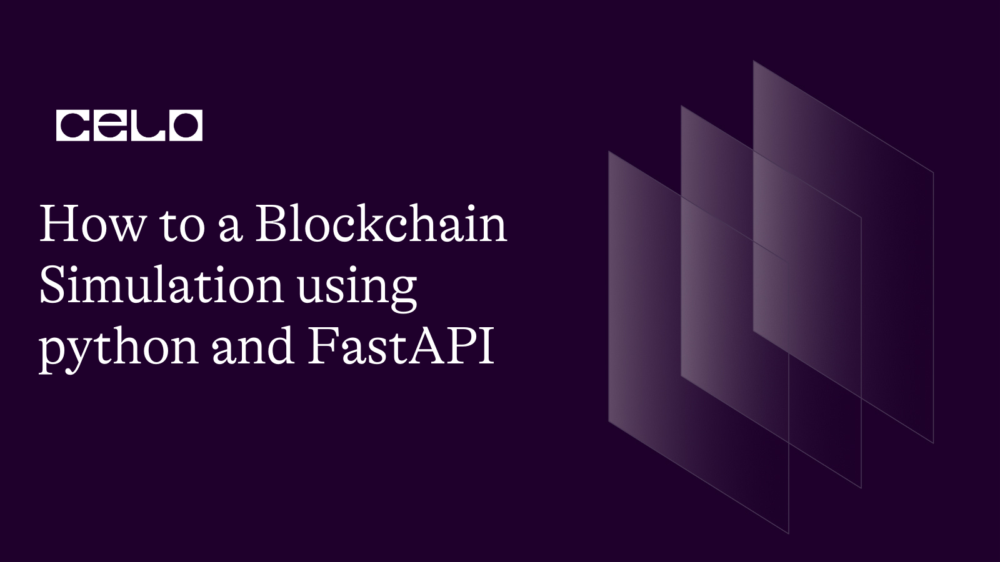

## Introduction​

Have you ever wondered how the blockchain works? It is a simple yet complex chain-like structure that appends millions it hash data and transactions with the passing seconds. Over the last decade, technologies have grown and contributed innovative solutions to major economic and financial sectors worldwide.

This innovative technology all details down to a structured and well-taught-out code base.
A practical simulation you will learn by completing this tutorial. By coding one yourself, you will have a solid insight into how blockchains like Celo work. This blockchain will simulate the Celo blockchain, including all the basic features required to function properly.

## Prerequisites​

To follow along with this tutorial, you’ll need to have a solid foundation on the following tools:

- Python
- FastAPI

## Requirements​

To follow this tutorial, you’ll need the following tools installed and functioning properly:

- Python3: any verion of python from 3 and above.

### Activating a Virtual Environment

Before creating your own blockchain, you’ll need to install and activate a virtual environment in your workspace where you’ll be building the entire blockchain. You can follow the steps below to install, create and activate your virtual environment using Python:

1. First, Create a workspace on your preferred code editor and also open a terminal where you’ll run your command prompts.
2. Next, Go to your terminal and run the command `pip install virtualenv` to install the `virtualenv` to your local device.
3. Now run the command `python3 -m venv env` to create the virtual environment.
4. Finally, run the command `cd env` and then run `Scripts/activate`, which will start up a virtual environment you can begin working on.

## Creating the Blockchain

Now to get started with creating your blockchain simulation, you can follow the steps below, and you will also find a complete code snippet for the entire blockchain code after the walk-through on the tutorial:

1. First, Navigate to your workspace folder and create a new file `blockchain.py`. Next, you’ll need to import the packages `datetime`, `hashLib`, and `JSON`. Copy and paste the code below into the `blockchain.py` file

```python
import datetime as _dt
import hashlib as _hashlib
import json as _json
```

2. Next, you’ll add the code that defines an `__init__` method within a Python `class`.
   Within the `__init__` method, a list object is created and assigned to an instance variable called `chain`. The chain list will be used to store the blockchain data.
   Next, you’ll create an initial block using a private method `_create_block()` with the following parameters: `data="genesis block"`, `proof=1, previous_hash="0"`, and `index=1`. This initial block is typically called the "genesis block", the first block in a blockchain. It contains some default values to initiate the blockchain.
   The `self.chain.append(initial_block)` statement adds the newly created initial_block to the chain list.

```python
 def __init__(self):
        self.chain = list()
        initial_block = self._create_block(
            data="genesis block", proof=1, previous_hash="0", index=1
        )
        self.chain.append(initial_block)


```

3. Next, you’ll create a function called `mine_block()` within the Python class that represents the blockchain. It creates a new block in the blockchain.
   The function will have the following features:

- The `mine_block()` function takes a `data` parameter, which I a string that represents the data that will be added to the new block.
- The first statement in the function `get_previous_block()` retrieves the most recent block in the chain before adding the new block.

- The next statement retrieves the `proof` value from the previous block by accessing the `proof` key in the dictionary of the `previous_block`.

- The `index` variable s generated by calling a private function `_proof_of_work` with the `previous_proof`, `index` and `data` parameters. The function is responsible for finding valid proof that satisfies the blockchain's consensus rules.

- The `previous_hash` variable is set by calling the private method `_hash()` with the `previous_block` as a parameter. This method generates a hash value representing the previous block, which will be added to the new block as a reference.

- Whenever you run the function, a new block is created by calling the private function `_create_block()` with the `data`, `proof`, `previous_hash`, and `index` parameters.
  The new block is appended to the blockchain's `chain` list, and the method returns the newly created `block` as a dictionary object.

**_Note: The proof of work algorithm is an essential part of blockchain technology, as it ensures that blocks can be added to the blockchain only through a certain level of computational effort_**

```python
   def mine_block(self, data: str) -> dict:
        previous_block = self.get_previous_block()
        previous_proof = previous_block["proof"]
        index = len(self.chain) + 1
        proof = self._proof_of_work(
            previous_proof=previous_proof, index=index, data=data
        )
        previous_hash = self._hash(block=previous_block)
        block = self._create_block(
            data=data, proof=proof, previous_hash=previous_hash, index=index
        )
        self.chain.append(block)
        return block

```

4. Next, you’ll create a function `_create_block()` within the class that represents a blockchain. The purpose of the function is to create a new block with the provided data and other necessary information.
   The `_create_block()` method takes four parameters: `data`, `proof`, `previous_hash`, and `index`. The `data` parameter is a string that represents the data that will be added to the new block. The `proof` parameter is an integer that represents the proof of work for the new block. The `previous_hash` parameter is a string that represents the hash value of the previous block in the chain. The `index` parameter is an integer that represents the position of the new block in the chain.

Inside the method, a dictionary object block is created and initialized with the following keys:

- `index`: The index of the new block
- `timestamp`: The timestamp when the block was created, which is generated by calling the datetime.now() method from the datetime module and converting it to a string using the str() function.
- `data`: The data to be stored in the new block.
- `proof`: The proof of work for the new block.
- `previous_hash`: The hash value of the previous block in the chain

The function returns the newly created block dictionary object as a return value. The new block can then be added to the blockchain's chain list by calling the `append()` method.

```python
    def _create_block(
        self, data: str, proof: int, previous_hash: str, index: int
    ) -> dict:
        block = {
            "index": index,
            "timestamp": str(_dt.datetime.now()),
            "data": data,
            "proof": proof,
            "previous_hash": previous_hash,
        }
        Return block

```

5. The function `get_previous_block()` is a simple method to return the most recently added block in the chain.

- The function takes no parameters and simply returns the last item in the blockchain's chain list, the most recently added block. This is achieved by indexing the chain list with `-1`, which refers to the last item in the list.

```python
    def get_previous_block(self) -> dict:
        return self.chain[-1]

```

6. The code below defines a private method `_to_digest()` within a Python class that represents a blockchain. The purpose of this method is to create a string representation of the data that needs to be hashed for the proof of work algorithm.

- The method takes four parameters: `new_proof`, `previous_proof`, `index`, and `data`, which represent the proof of work for the new block, the proof of work for the previous block, the index of the new block, and the data to be stored in the new block, respectively.

- Inside the method, a string `to_digest` is created by concatenating the following components: `(new_proof ** 2 - previous_proof ** 2 + index)` and `data`. This calculation is specific to the proof of work algorithm, and it aims to create a unique string representation of the data that needs to be hashed.

```python
    def _to_digest(
        self, new_proof: int, previous_proof: int, index: int, data: str
    ) -> bytes:
        to_digest = str(new_proof ** 2 - previous_proof ** 2 + index) + data
        # It returns an utf-8 encoded version of the string
        return to_digest.encode()
    def _to_digest(
        self, new_proof: int, previous_proof: int, index: int, data: str
    ) -> bytes:
        to_digest = str(new_proof ** 2 - previous_proof ** 2 + index) + data
        # It returns an utf-8 encoded version of the string
        return to_digest.encode()

```

7. This next code defines a private method `_proof_of_work()` within a Python class that represents a blockchain. The purpose of this method is to implement the proof of work algorithm used to mine new blocks for the blockchain.

- The method takes three parameters: `previous_proof`, `index`, and `data`, which represent the proof of work for the previous block, the index of the new block, and the data to be stored in the new block, respectively.

- The proof of work algorithm works by repeatedly calculating the hash value of a string representation of the block data, along with a "nonce" value (in this case, the new_proof value), until a hash is found that meets certain criteria. In this implementation, the criteria are that the hash value must start with four zeros.

- Inside the method, new_proof is initialized to `1`, and a loop is started that continues until a suitable proof of work is found. In each iteration of the loop, the `_to_digest()` method is used to create a string representation of the block data and the `new_proof` value. The resulting string is hashed using the `SHA256` algorithm, and the resulting hash is checked to see if it meets the criteria for a valid proof of work. If it does, the loop exits and the proof of work value is returned.

- If the hash value does not meet the criteria, the new_proof value is incremented by one, and the loop continues, repeating the process until a valid proof of work is found.

```python

    def _proof_of_work(self, previous_proof: str, index: int, data: str) -> int:
        new_proof = 1
        check_proof = False


        While not check_proof:
            to_digest = self._to_digest(new_proof, previous_proof, index, data)
            hash_operation = _hashlib.sha256(to_digest).hexdigest()
            if hash_operation[:4] == "0000":
                check_proof = True
            Else:
                new_proof += 1


        return new_proof

```

8. This is a function `_hash` defined in the class, which takes a dictionary block as input and returns the SHA-256 hash of the block as a hexadecimal string.

Here's how the method works:

- First, the block dictionary is encoded as a JSON string using the \_json.dumps() method, with the sort_keys=True argument ensuring that the keys of the dictionary are sorted before encoding. This encoded JSON string is then converted to a bytes object using the encode() method.

- Next, the SHA-256 cryptographic hash function from the \_hashlib library is applied to the bytes object to generate the hash value. The hexdigest() method is then used to convert the hash value to a hexadecimal string representation, which is returned as the result of the method.

```python
	    def _hash(self, block: dict) -> str:
        """
        Hash a block and return the crytographic hash of the block
        """
        encoded_block = _json.dumps(block, sort_keys=True).encode()


        return _hashlib.sha256(encoded_block).hexdigest()

```

9. Finally, This Python function `is_chain_valid`is defined in the class, which checks whether the blockchain maintained by the class is valid. It returns a boolean value indicating whether the chain is valid or not.

- Here's how the method works:
  The first block of the chain is assigned to `previous_block`, and the index of the next block is set to 1.

- A while loop is used to iterate over all the blocks in the chain from the second block onwards. For each block:

- The method checks whether the previous hash of the current block matches the previous block's hash, which is calculated using the `_hash` method defined in the class. If the hashes don't match, the chain is invalid, and the method returns False.

- It also checks whether the proof of work for the current block is valid. The proof of work is considered valid if the first four characters of the hash of the block satisfy a certain condition (in this case, the condition is that the first four characters should be "0000"). If the proof of work is invalid, the method returns False.
- If both the checks are passed, the `previous_block` variable is updated to the current block and the index of the next block is incremented.
  If the while loop completes successfully without invalid blocks, the method returns True, indicating that the chain is valid.
  **_Note that the method uses several helper functions and variables, such as `_hash`, `_to_digest, proof`, `data`, etc., which are defined in the class and used to calculate the hash and proof of work for each block_**.

```python
    def is_chain_valid(self) -> bool:
        previous_block = self.chain[0]
        block_index = 1


        while block_index < len(self.chain):
            block = self.chain[block_index]
            # Check if the previous hash of the current block is the same as the hash of its previous block
            if block["previous_hash"] != self._hash(previous_block):
                return False


            previous_proof = previous_block["proof"]
            index, data, proof = block["index"], block["data"], block["proof"]
            hash_operation = _hashlib.sha256(
                self._to_digest(
                    new_proof=proof,
                    previous_proof=previous_proof,
                    index=index,
                    data=data,
                )
            ).hexdigest()


            if hash_operation[:4] != "0000":
                return False


            previous_block = block
            block_index += 1


        return True
```

On completing the file, your entire code should look like the one below:

```python
import datetime as _dt
import hashlib as _hashlib
import json as _json


class Blockchain:
    def __init__(self):
        self.chain = list()
        initial_block = self._create_block(
            data="genesis block", proof=1, previous_hash="0", index=1
        )
        self.chain.append(initial_block)


    def mine_block(self, data: str) -> dict:
        previous_block = self.get_previous_block()
        previous_proof = previous_block["proof"]
        index = len(self.chain) + 1
        proof = self._proof_of_work(
            previous_proof=previous_proof, index=index, data=data
        )
        previous_hash = self._hash(block=previous_block)
        block = self._create_block(
            data=data, proof=proof, previous_hash=previous_hash, index=index
        )
        self.chain.append(block)
        return block


    def _create_block(
        self, data: str, proof: int, previous_hash: str, index: int
    ) -> dict:
        block = {
            "index": index,
            "timestamp": str(_dt.datetime.now()),
            "data": data,
            "proof": proof,
            "previous_hash": previous_hash,
        }


        return block


    def get_previous_block(self) -> dict:
        return self.chain[-1]


    def _to_digest(
        self, new_proof: int, previous_proof: int, index: int, data: str
    ) -> bytes:
        to_digest = str(new_proof ** 2 - previous_proof ** 2 + index) + data
        # It returns an utf-8 encoded version of the string
        return to_digest.encode()


    def _proof_of_work(self, previous_proof: str, index: int, data: str) -> int:
        new_proof = 1
        check_proof = False


        while not check_proof:
            to_digest = self._to_digest(new_proof, previous_proof, index, data)
            hash_operation = _hashlib.sha256(to_digest).hexdigest()
            if hash_operation[:4] == "0000":
                check_proof = True
            else:
                new_proof += 1


        return new_proof


    def _hash(self, block: dict) -> str:
        """
        Hash a block and return the crytographic hash of the block
        """
        encoded_block = _json.dumps(block, sort_keys=True).encode()


        return _hashlib.sha256(encoded_block).hexdigest()


    def is_chain_valid(self) -> bool:
        previous_block = self.chain[0]
        block_index = 1


        while block_index < len(self.chain):
            block = self.chain[block_index]
            # Check if the previous hash of the current block is the same as the hash of it's previous block
            if block["previous_hash"] != self._hash(previous_block):
                return False


            previous_proof = previous_block["proof"]
            index, data, proof = block["index"], block["data"], block["proof"]
            hash_operation = _hashlib.sha256(
                self._to_digest(
                    new_proof=proof,
                    previous_proof=previous_proof,
                    index=index,
                    data=data,
                )
            ).hexdigest()


            if hash_operation[:4] != "0000":
                return False


            previous_block = block
            block_index += 1


        return True

```

**_Note: that the underscores before the method and library names indicate that they are private and should not be accessed from outside the class_**.

## Integrating FastAPI

Navigate to your main directory, and create a new file `main.py` to add your the api code for calling the functions in your blockchain.
Copy and paste the code snippet below into the `main.py` file:

```python
import fastapi as _fastapi
import blockchain as _blockchain


blockchain = _blockchain.Blockchain()
app = _fastapi.FastAPI()


# endpoint to mine a block
@app.post("/mine_block/")
def mine_block(data: str):
    if not blockchain.is_chain_valid():
        return _fastapi.HTTPException(status_code=400, detail="The blockchain is invalid")
    block = blockchain.mine_block(data=data)


    return block


# endpoint to return the blockchain
@app.get("/blockchain/")
def get_blockchain():
    if not blockchain.is_chain_valid():
        return _fastapi.HTTPException(status_code=400, detail="The blockchain is invalid")
    chain = blockchain.chain
    return chain


# endpoint to see if the chain is valid
@app.get("/validate/")
def is_blockchain_valid():
    if not blockchain.is_chain_valid():
        return _fastapi.HTTPException(status_code=400, detail="The blockchain is invalid")


    return blockchain.is_chain_valid()


# endpoint to return the last block
@app.get("/blockchain/last/")
def previous_block():
    if not blockchain.is_chain_valid():
        return _fastapi.HTTPException(status_code=400, detail="The blockchain is invalid")

    return blockchain.get_previous_block()

```

This code above imports the FastAPI and blockchain modules, creates a new blockchain instance, and defines several endpoints for the FastAPI application. The first endpoint, `/mine_block/`, allows the user to mine a new block in the blockchain by providing a data parameter. The second endpoint, `/blockchain/`, returns the entire blockchain to the user. The third endpoint, `/validate/`, checks if the blockchain is valid and returns a Boolean value indicating its validity. The fourth and final endpoint, `/blockchain/last/`, returns the previous block in the blockchain. These endpoints are defined using FastAPI's post() and get() decorators and are designed to respond to HTTP requests made by clients.

## Conclusion​

Creating a blockchain simulation using Python and FastAPI can be a challenging yet rewarding experience for anyone interested in the field of blockchain technology. Through the use of Python and FastAPI, developers can leverage the power of these tools to build a fully functional blockchain simulation with features such as a transaction system, consensus algorithm, and mining rewards. Additionally, this project provides an opportunity for developers to gain a better understanding of how blockchain technology works and the underlying concepts that drive its functionality.

Overall, the creation of a blockchain simulation using Python and FastAPI is an exciting project that can provide developers with a deeper understanding of the complexities of blockchain technology. By leveraging the power of Python and FastAPI, developers can build a robust and scalable blockchain simulation that incorporates all of the necessary components of a fully functional blockchain. With the continued growth and adoption of blockchain technology, there is no doubt that this project will be of great value to anyone looking to develop their skills in this field

## References​

For a more reference to the entire code you worked on, in this tutorial, you can visit the repository source code on [github](https://github.com/Julius170/blockchain-fastapi)

## About the Author​

Mayowa Julius Ogungbola
is a Software Engineer and Technical writer always open to working on new ideas. I enjoy working on [GitHub](https://github.com/Julius170/) and you could also find out what I tweet about and connect with me on [LinkedIn](https://www.linkedin.com/in/julius-ogungbola-a71810229/).
