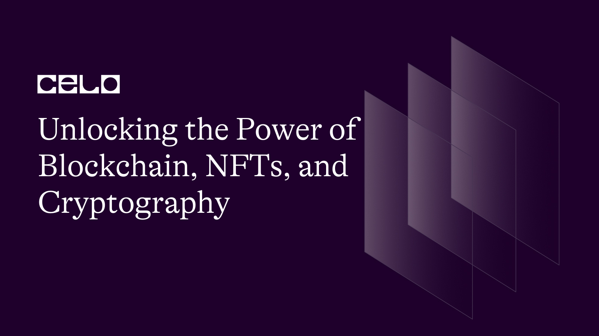
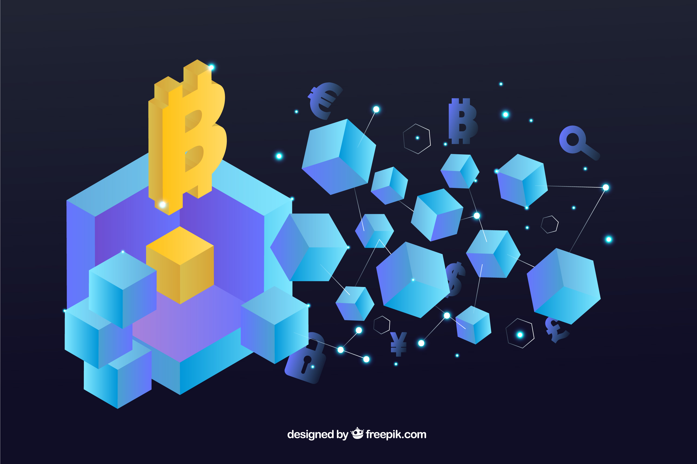
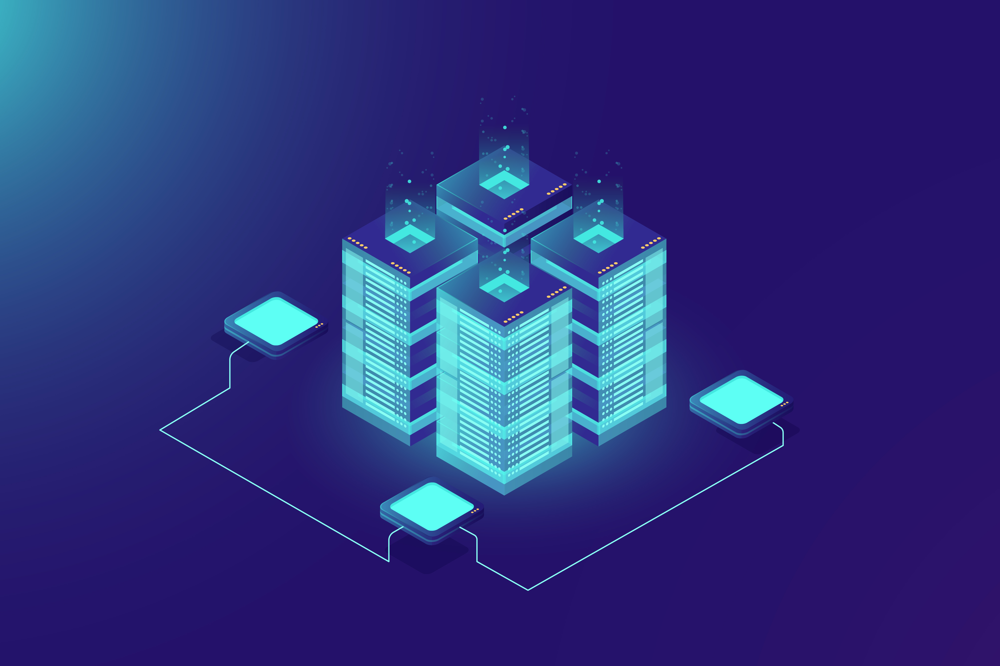
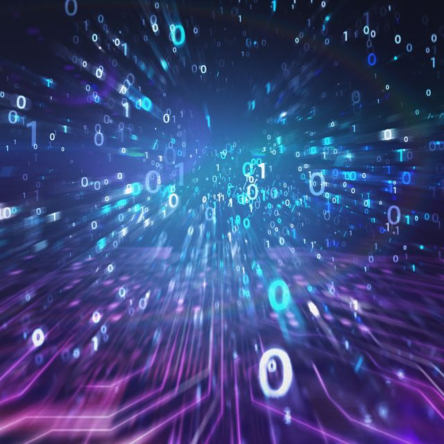
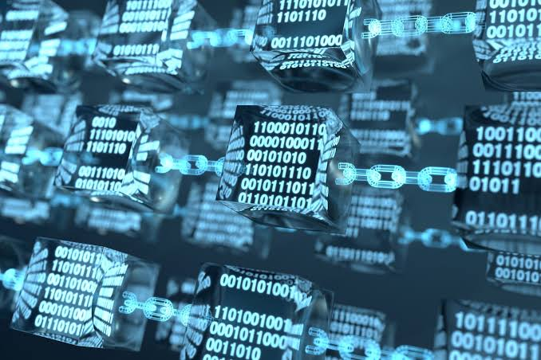

## Blockchain Technology, NFTs, and Cryptography

---

### Meta Description:

Security in blockchain technology protects smart contracts and APIs built for [tokenomics](https://cointelegraph.com/trading-for-beginners/what-is-tokenomics-a-beginners-guide-on-supply-and-demand-of-cryptocurrencies) (crypto economy). Find more details about blockchain cryptographic security.

## Introduction

Does 'blockchain' sound new to you? 

[Celo](https://celo.org/about) provides the right platform to gain basic knowledge about blockchain and its attributed features. When done with this tutorial, you can answer the question, “what is blockchain technology, and how secure is it for [decentralized finance](https://www.investopedia.com/decentralized-finance-defi-5113835) (Defi)?” 

You’ll also learn how blockchain works, why it is important, and how you can use this to gain a positional advantage in the global economy.

## Prerequisites 

Before this tutorial, you should have a basic knowledge about:

* Web3 (the future of web) and its improved features over Web-2 (the incumbent)
* Have a background knowledge of decentralized finance (DeFi) and the application of Blockchain technology to DeFi.

## Requirements 

Nil

## Blockchain and the Future of Web

Image credit: [Freepik](https://www.freepik.com/free-vector/blockchain-background-with-isometric-shapes_2619730.htm#query=free%20blockchain&position=0&from_view=search&track=ais)

If not much is known about Blockchain technology and Web3, know that Web3 is the budding future of the web, integrating an open-source networking system in the form of blockchain technology where every individual in the chain (more deets on ‘chain’ subsequently)  has fair access to proofed [tokenized equity](https://www.investopedia.com/terms/t/tokenized-equity.asp). 

Blockchain technology data structures have unique security characteristics because they are based on the principles of decentralized networking (where everyone in the network has equal power and advantage), and cryptography. Each new block of information from every individual in the chain is linked to all previous blocks in such a way that data tampering is almost impossible.

In the future of the web (web3), decentralized finance (Defi) introduces a cosmopolitan access to the share of the global economy with amply distributed share volumes in volatility, cash flow, liquidity, and other positional strengths and down-spirals of the global economy, operated in a digitally unified cryptocurrency system of finance. 

Future (already begun) web interactions will feature commercial operations including; trades, stock bargains, investments, and savings on a model of blockchain. 

What will not magnify without these commercial functions is a barter-free exchange economy where services and goods cost nothing next to one another in their referent frames of values or mismatched currency pairs.

### What is Crypto-currency?

Crypto-currency means  "_Encrypted currency_"

In this short portmanteau of two crude terms, the word ‘encrypted’ signifies that there's a code used to build the currency qualified.

Fiat Currencies like USD, NZD, GBP are standards accepted as legal tenders for local trading of values and in cross-border exchange across multiple economic borders. 

These currencies are printed and each is assigned a note value. The exchange rate is monitored and managed across exchange floors resident in each country/domain of official use. These currencies can be exchanged with other official currencies by _Bureau de Change_ in different countries using indicators (indices included in the official [Fiat system](https://www.investopedia.com/ask/answers/09/gold-standard.asp) in assets recognized worldwide e.g gold value, crude oil, brent, diamond, e.t.c) 

However, when coins built by cryptographic modules came in, we have currencies like Bitcoin and Ethereum built on rebase and debase systems digital exchange and trading Apps (DApps) to fit tad-second sensitivity fluctuating volume trades and tick-time exchange rate values when paired with fiat currencies and other encrypted coins listed.

### NFTs and Cryptocurrency - Digital assets and their price tags

### Non-fungible Tokens (NFTs)

Source images courtesy: [Bored Ape Yacht Club](https://www.newyorker.com/culture/infinite-scroll/why-bored-ape-avatars-are-taking-over-twitter)

NFTs are digital assets that represent real-world objects such as art, music, in-game items, and videos. They are bought and sold online, often in cryptocurrencies, and are usually encoded with the same underlying software as many cryptocurrencies

NFTs are individual tokens that store valuable information. Its value is largely determined by the market and demand, so it can be bought and sold like any other physical type of art. Proprietary data from NFTs makes it easy to verify ownership and transfer tokens between owners.

More physical assets and other valuable stocks get approved with unique pixel-grafted tokens such as art collections i.e NFTs are used in the conversion and auctioneering power of real art.

NFTs are also usually unique, or at least with very limited editions tagged with unique identification codes. 

This is in stark contrast to most digital works, which are almost always infinitely available. Hypothetically, supply cuts increase the value of a particular asset, assuming there is demand.

“_Fundamentally, NFTs create a digital shortage,”_ said Arry Yu, chairman of the Washington Tech Industry Association’s Cascadia Blockchain Council and executive director of Yellow Umbrella Ventures.

### NFTs are digital artworks, why sell big?

Yes, NFTs sell big!

For example, renowned digital artist Mike Winkleman (better known as "Beeple") compiled 5,000 paintings of every day into what is perhaps the most famous NFT of the moment, 'EVERYDAYS: The First 5000 Days', and [sold at Christie's for a record-breaking $69.3 million.](https://www.reuters.com/lifestyle/digital-only-artwork-fetches-nearly-70-million-christies-2021-03-12/)

If anyone can view individual images or entire collages online for free, why are people willing to pay millions of dollars for something they can scan or download?

NFTs are unique digital assets that provide traffic, sometimes, for real-life products and services, established for projects that are bidden in the crypto economy. 

Additionally, it includes built-in authentication that serves as proof of ownership. Collectors value these "digital bragging rights" more than the objects themselves.

Raising the crypto trading power of NFTs against a drastically low volume of global product demands and erratic product sales supersedes all erratic intra- & inter-national policies leveraged against local trades and international product exchange in local currencies. i.e. a boosted salespower of digital products can salvage the threats to an undermined product-service trading economy.

 

### Why Blockchain Technology?

[Image by Fullvector on Freepik](https://www.freepik.com/free-vector/server-room-rack-blockchain-technology-token-api-access-data-center_2910154.htm#query=blockchain%20technology&position=0&from_view=keyword)

Every country is an autonomous unit of the global economy. Each has its own quota in the world’s share of industrial production, labor market, raw material and environmental (natural) resources, among other cardinal capital resources contributing to the world’s economy. 

All of the resources in the nations of the world and the continents engaged in unilateral/bilateral/multilateral trades will perform better in a globally unified economy. A unified economy with security in the interests and market of each nation will help achieve a sustainable economy.

According to the [United Nations Department of Economic and Social Affairs](https://www.un.org/en/desa/four-steps-towards-more-sustainable-global-economy), there are four ultimate steps toward a more sustainable global economy:

* Diversify economies
* Ensure that development strategies are not implemented overnight but gradually tailored
* Stem the rise of inequalities
* Make finance sustainable
* Improve institutions

Stemming the rise of inequalities and building a sustainable finance, are a pair of driving influences for blockchain technology. 

Blockchain's transformative potential lies in its ability to secure, track, segment and transfer wealth over the internet with real-time inventory of the whole population sharing a consensual participation in the risks and hence, benefits of economic functions, most especially in trading/exchange - In short, whatever the internet was to a caste social media as a core technology, blockchain is more to the potential of a true sharing economy.

Having a decentralized digital ledger that stores transactions on thousands of computers around the world, it is easy to code-register every exchange in such a way as to prevent data manipulation, avoid fund mismanagement or laundering, set stock limits, etc. 

_N.B: A Blockchain is a repeat-record chain of information arranged in an order that makes it impossible or difficult for the system to be changed, bypassed, hacked, or manipulated. _

Indicators and signals made available in DApps and other DEx platforms make it easy to read and predict in-time data for breakthrough analysis, risk potential, and recession,  (among other fiscal analyses). This is practically identified in the bullish and bearish markets spotted by indicating trade volume -  So, proactive rebase and debase coin responses prevent futuristic economic crises that might be as terrible as the COVID-19 aftermath.

Blockchain technology enhances security and speeds up information exchange, making it cost-effective and transparent. It also removes third parties (such as notaries and banks) whose primary role is to provide trust and authentication in legal transactions.

The high importance of blockchain has attracted the attention of organizations from various sectors, with the banking sector being the most active at this stage. Blockchain has created thousands of new jobs and new startups, from mobile payment solutions to product/service digital-link sales, even in healthcare applications.

### Blockchain and Cryptography 

Image Credits: Yuichiro Chino / Getty Images

In recent years, some web3 tech platforms like [Celo](https://celo.org/about) have consistently told us about the prospering feature of web3 which is ‘blockchain technology'.

This is probably regarding the wealth of cryptocurrencies (like Bitcoin) and NFTs like Mutant Ape, right?

You may be asking yourself if blockchain technology was just a chain connecting peers with cryptocurrency deals/exchanges.

It seems like blockchain is a platitude but in a hypothetical sense, as there is no real meaning that the layman can understand easily, it is imperative to answer; “What is blockchain technology?"

The answer must  include the technology that is used, how it works, and how it’s becoming vital in the digital world.

As blockchain continues to grow and become more user-friendly, the onus is on every web user to learn this evolving technology to prepare for the future. 

Blockchain is a cryptographic method of recording information that makes it impossible or difficult for the system to be changed, hacked, or manipulated. A blockchain is built with cryptographic binary codes which operate a distributed ledger. 

Blockchain cryptographic technology allows a structure that stores transactional records, also known as the 'block' in several databases - known as the 'chain' - in a network connected through peer-to-peer nodes. Typically, this storage is referred to as a ‘digital ledger.’

In transactions, blockchain technology follows an algorithm that works on a fairly distributed ledger. This ledger duplicates and distributes transactions across the network of computers participating in the blockchain and computers share an equitable power to influence the blockchain the same.

Every transaction in this ledger is authorized by the digital signature of the owner, which authenticates the transaction and safeguards it from tampering. Hence, the information the digital ledger contains is highly secure.

This ledger duplicates and distributes transactions across the network of computers participating in the blockchain.

Simply put, a digital ledger is like a Google spreadsheet shared by multiple computers on a network that stores transaction records based on actual purchases. What's interesting is that anyone can see your data, but they can't damage it.

Conversely, nobody jumps in the middle of the queue (chain) or ahead of it by mere clout. Unlike the usual global economic models of appreciation and devaluation, recession, taxation, revenue, and profit calculations among others, blockchain technology gives an instituted solidity to sellers and buyers who join peers with their share of cryptocurrency and digital assets (NFTs) and engage in crypto transactions. 

### Cryptography - the security of blockchain transactions 

Image Credit: _Yuichiro Chino /Moment/ Getty Images_

Privacy is a core concern in security for decentralized finance. Cryptocurrency allows every asset owner to know if a crypto wallet address corresponds to a certain individual, you can track all the transactions that an individual has made through their wallet on any public blockchain, including Bitcoin and Ethereum.

Some cryptographers think the solution to crypto’s privacy concerns lies in zero-knowledge proofs (ZKPs), a technique that allows for a transaction to be verified on a blockchain without the underlying data being shared. While zero-knowledge proofs could indeed improve privacy and scalability for some of the most popular blockchains, they are far from being the only cryptographic method that could accelerate progress in web3.

Ravital Solomon, co-founder, and CEO of Sunscreen, thinks fully homomorphic encryption (FHE) is even more promising in its potential to bolster privacy in web3. 

"_The technology allows for individuals to perform computations on encrypted data without needing to decrypt it_," Solomon explained. 

One of the obvious use cases that comes to mind is for financial institutions, which could use FHE to slice and dice transaction data to detect potential fraud while maintaining more privacy for customers than is currently the norm.

Zero-knowledge proofs are really exciting in terms of what they can offer to web3.  There are all these exciting applications for gaming and identity, but zero-knowledge proofs aren’t necessarily the be-all and end-all for crypto or privacy. 

Solomon explained that it’s very difficult to write FHE programs because the space is still so nascent, for one thing — which is part of why Sunscreen is building developer tools to simplify processes around it.

FHE is a subset of lattice cryptography, an area still considered as the most plausible niche even within the cryptography space

With every new chain, technologists can build integrations between that chain and other protocols such as FileCoin to hide the underlying data from users and can leverage both ZKPs and FHE together, at a lower cost.

## Conclusion

Cryptographic blockchain technology provides a steady-safe security solution to DeFi and the algorithmic systems by which digital transactions are enabled. Platforms like [Celo](https://celo.org/about) let you know the latest attributes of blockchain technology and how your web identity is best kept in a secure manner helping you to get hands-on experience for safe crypto-transacts and token mining on web3 decentralized spaces.

## Next Steps

Nil

## About the Author

Imole Peter L.

A web3 enthusiast, content writer for web3 brands, visual artist, and a seasoned author (Pen name: [Sasani Eldis](https://www.amazon.com/Imole-Latona/e/B088F4KF7H))

Connect with me on [LinkedIn](https://www.linkedin.com/in/imole-peter-latona)

## References

[https://www.google.com/amp/s/techcrunch.com/2022/07/18/crypto-blockchain-web3-privacy-cryptography-fully-homomorphic-encryption-startup-sunscreen/amp/](https://www.google.com/amp/s/techcrunch.com/2022/07/18/crypto-blockchain-web3-privacy-cryptography-fully-homomorphic-encryption-startup-sunscreen/amp/)

[https://www.investopedia.com/decentralized-finance-defi-5113835](https://www.investopedia.com/decentralized-finance-defi-5113835)

[https://www.reuters.com/lifestyle/digital-only-artwork-fetches-nearly-70-million-christies-2021-03-12/](https://www.reuters.com/lifestyle/digital-only-artwork-fetches-nearly-70-million-christies-2021-03-12/)

[https://www.forbes.com/advisor/in/investing/cryptocurrency/what-is-an-nft-how-do-nfts-work/](https://www.forbes.com/advisor/in/investing/cryptocurrency/what-is-an-nft-how-do-nfts-work/)
