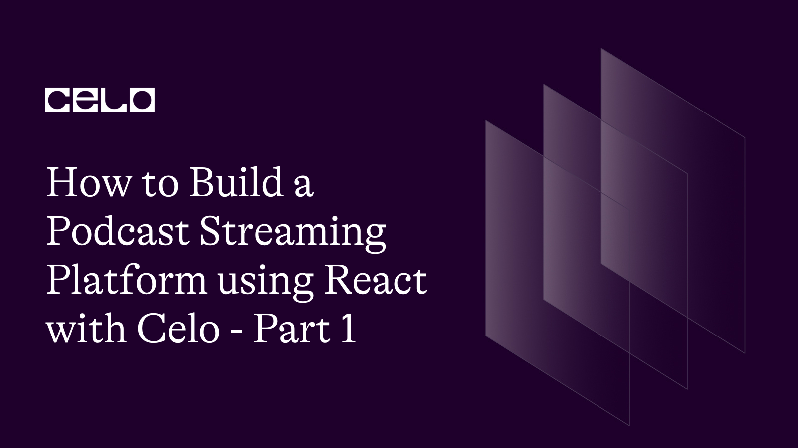
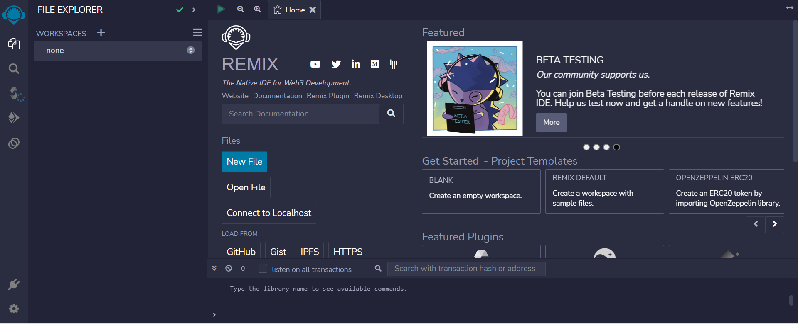

## Introduction

Bonjour readers! I really would like to speak french even though I know its a little bit late. Lol😅. Anyways. Welcome to another exciting tutorial! In this tutorial, we would be going through how to build a podcast streaming platform on the celo blockchain.
This would be the first section out of two and in this section, we would look at how to develop the smart contract and the second would be implementing the contract with the frontend.

Just like I start most of these tutorials, For newbies, I would like to define what celo is and why it is important.

## What is Celo

Celo is a blockchain platform that focuses on enabling mobile-first financial services. It is built using the Ethereum codebase and employs a proof-of-stake consensus mechanism for transaction validation. One unique aspect of Celo is its focus on usability and accessibility, aiming to create a more inclusive and decentralized financial system.

## Prerequisites

- Prior knowledge of javascript
- Familiarity with the command line
- Basic understanding of blockchain concepts
- Have some knowledge of solidity and its concepts
- Have a basic understanding of **[React](https://react.org)**. Knowledge of JSX, props, state, and hooks.

## Requirements

- **[NodeJS](https://nodejs.org/en/download)** from V12.or higher
- A code editor or text editor. **[VSCode](https://code.visualstudio.com/download)** is recommended
- A terminal. **[Git Bash](https://git-scm.com/downloads)** is recommended
- An Internet Browser and a good internet connection
- **[Remix](https://remix.ethereum.org)**
- **[Celo Extension Wallet](https://chrome.google.com/webstore/detail/celoextensionwallet/kkilomkmpmkbdnfelcpgckmpcaemjcdh?hl=en)**.

Screenshot: 

## Smart Contract Development

If you have seen any of my previous tutorials, you would realize I am fan of remix for writing smart contracts. Remix is a web-based IDE that allows developers to write, test and deploy smart contracts on the Celo blockchain.

Here is a preview of the Remix IDE:


On Remix, We would create a new workspace and then a new file which we would name `CelCast.sol`

Starting in the first line, you include a statement that specifies the license under which the code is being released.

```js
// SPDX-License-Identifier: MIT
pragma solidity >=0.7.0 <0.9.0;
```

The first line is a SPDX license identifier and a Solidity version pragma.

SPDX (Software Package Data Exchange) is a specification that provides a standard way to declare the license of open source software packages. The SPDX-License-Identifier is a header that specifies the license of a given source code file.
The Solidity version pragma specifies the version of the Solidity programming language used to write the smart contract code. The version range specified is greater than or equal to 0.7.0 and less than 0.9.0, meaning that the code should be compiled with a Solidity compiler version between 0.7.0 and 0.8.x.

Following that, we define an `IERC20Token` interface which enables us to interact with the celo stablecoin (cUSD).

```solidity
// SPDX-License-Identifier: MIT

pragma solidity >=0.7.0 <0.9.0;

interface IERC20Token {
  function transfer(address, uint256) external returns (bool);
  function approve(address, uint256) external returns (bool);
  function transferFrom(address, address, uint256) external returns (bool);
  function totalSupply() external view returns (uint256);
  function balanceOf(address) external view returns (uint256);
  function allowance(address, address) external view returns (uint256);

  event Transfer(address indexed from, address indexed to, uint256 value);
  event Approval(address indexed owner, address indexed spender, uint256 value);
}
```

ERC-20 tokens are a well-established standard utilized to generate digital assets on the Ethereum blockchain, including cUSD. These tokens come equipped with pre-defined functions and events that can be effortlessly integrated into contracts, without the need for additional implementation. When interacting with the token, you will be employing the ERC-20 token's interface, which allows your contract to communicate with the token.

For more information on using these functions and events, you can refer to the Celo **[documentation](https://docs.celo.org/developer-guide/celo-for-eth-devs)**. The documentation provides comprehensive details on how to work with ERC-20 tokens and how to utilize them in conjunction with the Celo network.

Next up, we have a Solidity smart contract named "CelCast". Let's break down the code:

```solidity
contract CelCast{
address internal cUsdTokenAddress = 0x874069Fa1Eb16D44d622F2e0Ca25eeA172369bC1;
```

This line of code declares a variable named cUsdTokenAddress of type address and assigns it a specific value of 0x874069Fa1Eb16D44d622F2e0Ca25eeA172369bC1. Which is the address of the ERC-20 token `cUSD`.

```solidity
uint podcastLength = 0;
```

This line of code declares a variable named podcastLength of type uint and initializes it with a value of 0. This variable will be used to keep track of the total number of podcasts that have been added to the contract.

```solidity
struct Podcast{
    address payable owner;
    string title;
    string excerpt;
    string excerptImage;
    string audioLink;
    uint fans;
}

mapping (uint => Podcast) internal podcasts;

```

The above block of code defines a struct named `Podcast`, which represents a single podcast episode. It has the following properties:

- `owner`: the address of the owner of the podcast
- `title`: the title of the podcast episode
- `excerpt`: a short description of the podcast episode
- `excerptImage`: the URL of an image that represents the podcast episode
- `audioLink`: the URL of the audio file for the podcast episode
- `fans`: the number of fans who have subscribed to the podcast

The last line of code declares a mapping named `podcasts` that maps `uint` keys to Podcast values. This mapping will be used to store information about all of the podcasts that have been added to the contract. The `internal` keyword makes this mapping only accessible within the contract and any contracts that inherit from it.

After defining all these, you would define a modifier that helps to ensure that only non-owners can perform certain actions on the podcast, such as subscribing to the podcast or leaving a review. This adds an additional layer of security to the contract and helps to prevent malicious behavior.

```solidity
    modifier notOwner(uint _index) {
        require(msg.sender != podcasts[_index].owner, "You cant transact");
        _;
    }
```

This is a Solidity modifier named `notOwner` that takes in a single parameter, `_index`, of type `uint`. Modifiers are used in Solidity to modify the behavior of functions or to add additional requirements that need to be satisfied before a function can be executed.

The `notOwner` modifier is designed to be used in conjunction with functions that modify the state of the contract. It checks to make sure that the caller of the function (msg.sender) is not the owner of the podcast at the specified index `_index`. If the caller is the owner, the function call will fail and an error message will be returned to the caller.

The `require` statement is used to enforce this condition. If the condition evaluates to true, then the code inside the curly braces ({}) will be executed. Otherwise, the function call will fail and an error message will be returned to the caller.

The underscore (\_) is a placeholder that represents the body of the function that the modifier is being applied to. In this case, the function body will only be executed if the `require` statement is satisfied.

Moving forward, we create a function that allows callers to add a new podcast episode to the contract, by providing its metadata.

```solidity
    function addPodcast(
        string memory _title,
        string memory _excerpt,
        string memory _excerptImage,
        string memory _audioLink
    )public{
        podcasts[podcastLength] = Podcast(
            payable(msg.sender),
            _title,
            _excerpt,
            _excerptImage,
            _audioLink,
            0
        );
        podcastLength++;
    }
```

The function takes in four parameters of type string memory: `_title`, `_excerpt`, `_excerptImage`, and `_audioLink`. These parameters represent the metadata for the podcast episode that the caller wants to add to the contract.

The function is marked as `public`, which means that it can be called by anyone, both internally and externally.

Inside the function, a new `Podcast` struct is created with the provided metadata, and the struct is added to the podcasts mapping at the index of podcastLength. The `msg.sender` address is used as the owner of the podcast episode, and the `fans` count is initialized to 0.

After the podcast episode is added to the mapping, `podcastLength` is incremented by 1, so that the next podcast episode will be added to the next index in the mapping.

Following this, we would define the `getPodcasts` function, this function allows callers to retrieve information about a specific podcast episode by its index, which can be useful for displaying podcast episode metadata in a user interface.

```solidity
 function getPodcast(uint _index)public view returns(
        address payable,
        string memory,
        string memory,
        string memory,
        string memory,
        uint
    ){
        return(
            podcasts[_index].owner,
            podcasts[_index].title,
            podcasts[_index].excerpt,
            podcasts[_index].excerptImage,
            podcasts[_index].audioLink,
            podcasts[_index].fans
        );
    }
```

The function takes in a single parameter, `_index`, of type `uint`, which represents the index of the podcast episode that the caller wants to retrieve.

The function is marked as `public`, which means that it can be called by anyone, both internally and externally.

The function returns a tuple that contains six values:

`address payable`: the address of the owner of the podcast
`string memory`: the title of the podcast episode
`string memory`: a short description of the podcast episode
`string memory`: the URL of an image that represents the podcast episode
`string memory`: the URL of the audio file for the podcast episode
`uint`: the number of fans who have subscribed to the podcast

Inside the function, the tuple is constructed by accessing the podcasts mapping with the given `_index`, and returning the values of its properties in the specified order.

The `view` keyword in the function signature indicates that this function will only read data from the contract state, and will not modify it. This means that calling this function will not cost any gas, since it does not require any transactions to be mined.

Up next, we would create a function that allows callers to support a specific podcast episode by sending cUSD tokens to its owner. This function requires that the caller is not the owner of the podcast episode, and will revert if the token transfer is unsuccessful.

```solidity
    function supportPodcast(uint _index,  uint _amount) notOwner(_index) public payable{
        require(
          IERC20Token(cUsdTokenAddress).transferFrom(
                msg.sender,
                podcasts[_index].owner,
                _amount
            ),
            "Transaction could not be performed"
        );
        podcasts[_index].fans++;
    }
```

The function takes in two parameters of type uint: `_index` and `_amount`. These parameters represent the index of the podcast episode that the caller wants to support and the amount of cUSD tokens that the caller wants to send to the podcast owner, respectively.

The function is marked as `public`, which means that it can be called by anyone, both internally and externally.

The function includes a modifier `notOwner(_index)`, which ensures that the caller is not the owner of the podcast episode at the given index. This is important because the podcast owner cannot support their own podcast, as it would result in transferring tokens from themselves to themselves, which does not make sense.

Inside the function, the `transferFrom` method of the `IERC20Token` contract located at the `cUsdTokenAddress` is called, in order to transfer the specified `_amount` of cUSD tokens from the `msg.sender` to the podcast owner (podcasts[_index].owner). The require statement is used to ensure that the token transfer was successful. If it fails, the transaction is reverted with an error message.

After the token transfer, the `fans` count of the podcast episode at the given `_index` is incremented by 1, to indicate that a new fan has supported the podcast.

Finally, you would create a function called `getPodcastLength`.

```solidity
    function getPodcastLength() public view returns (uint) {
        return (podcastLength);
    }
```

The function is marked as `public`, which means that it can be called by anyone, both internally and externally.

The purpose of this function is to return the total number of podcast episodes that have been added to the contract. This number is stored in the podcastLength variable, which is declared at the beginning of the contract and is incremented every time a new podcast episode is added.

The function simply returns the current value of `podcastLength`. Since the function is marked as `view`, it does not modify the contract state in any way and does not require any gas fees to be paid. Therefore, callers can retrieve the total number of podcast episodes without any cost, simply by calling this function.

This is the complete code:

```solidity
// SPDX-License-Identifier: MIT

pragma solidity >=0.7.0 <0.9.0;

interface IERC20Token {
  function transfer(address, uint256) external returns (bool);
  function approve(address, uint256) external returns (bool);
  function transferFrom(address, address, uint256) external returns (bool);
  function totalSupply() external view returns (uint256);
  function balanceOf(address) external view returns (uint256);
  function allowance(address, address) external view returns (uint256);

  event Transfer(address indexed from, address indexed to, uint256 value);
  event Approval(address indexed owner, address indexed spender, uint256 value);
}

contract CelCast{
    address internal cUsdTokenAddress = 0x874069Fa1Eb16D44d622F2e0Ca25eeA172369bC1;

    uint podcastLength = 0;

    struct Podcast{
        address payable owner;
        string title;
        string excerpt;
        string excerptImage;
        string audioLink;
        string [] reports;
        uint fans;
        uint downvotes;
    }

    mapping (uint => Podcast) internal podcasts;

    modifier notOwner(uint _index) {
        require(msg.sender != podcasts[_index].owner, "You cant transact");
        _;
    }

    // function to add podcasts
    function addPodcast(
        string memory _title,
        string memory _excerpt,
        string memory _excerptImage,
        string memory _audioLink
    )public{
        Podcast storage podcast = podcasts[podcastLength];
        podcast.owner = payable(msg.sender);
        podcast.title = _title;
        podcast.excerpt = _excerpt;
        podcast.excerptImage = _excerptImage;
        podcast.audioLink = _audioLink;
        podcast.fans = 0;
        podcast.downvotes = 0;
        podcastLength++;
    }

    // function to get podcasts
    function getPodcast(uint _index)public view returns(
        address payable,
        string memory,
        string memory,
        string memory,
        string memory,
        string [] memory,
        uint,
        uint
    ){
         Podcast storage podcast = podcasts[_index];
        return(
            podcast.owner,
            podcast.title,
            podcast.excerpt,
            podcast.excerptImage,
            podcast.audioLink,
            podcast.reports,
            podcast.fans,
            podcast.downvotes
        );
    }

    // function initiates payment transaction
    function supportPodcast(uint _index,  uint _amount) notOwner(_index) public payable{
        require(
          IERC20Token(cUsdTokenAddress).transferFrom(
                msg.sender,
                podcasts[_index].owner,
                _amount
            ),
            "Transaction could not be performed"
        );
        podcasts[_index].fans++;
    }

    function getPodcastLength() public view returns (uint) {
        return (podcastLength);
    }

}
```

## Contract Deployment

To deploy the contract, we would need:

1. [CeloExtensionWallet](<(https://chrome.google.com/webstore/detail/celoextensionwallet/kkilomkmpmkbdnfelcpgckmpcaemjcdh?hl=en)>)
2. [ Celo Faucet](https://celo.org/developers/faucet)
3. Celo Remix Plugin

Download the Celo Extension Wallet from the Google chrome store using the link above. After doing that, create a wallet, and store your key phrase in a very safe place to avoid permanently losing your funds.

After downloading and creating your wallet, you will need to fund it using the Celo Faucet. Copy the address to your wallet, click the link to the faucet above and paste the address into the text field, and confirm.

Next up, on remix, download and activate the celo plugin from the plugin manager. Connect your wallet and deploy your contract.

## Conclusion

Congratulations 🎉, you are done with the first section of these two-part series, writing and deploying the smart contracts.

## Next steps

You can challenge yourself by implementing a frontend, I would be making a whole tutorial on that but if you are confident in your react skills then I implore you to go ahead 😉
You can use this [link](https://github.com/dahnny/celcast-1) for reference

## About the Author

Daniel Ogbuti is a web3 developer with a passion for teaching as well as learning. I would love to connect on Twitter @daniel_ogbuti and linkedin @ Daniel Ogbuti

See you soon!
